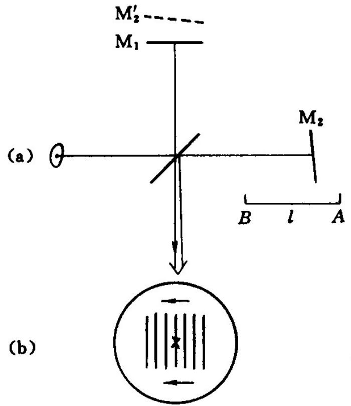
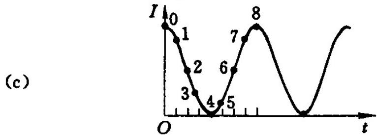
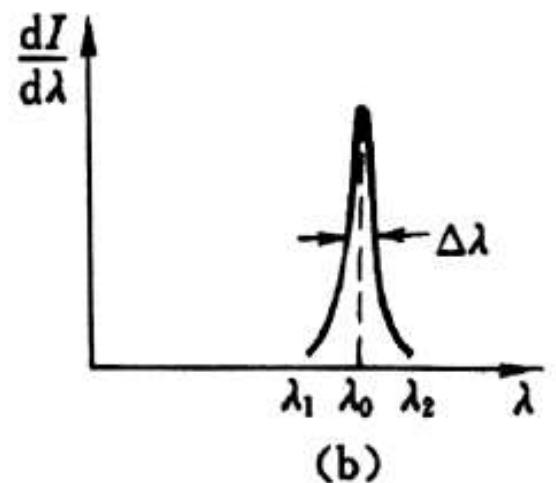
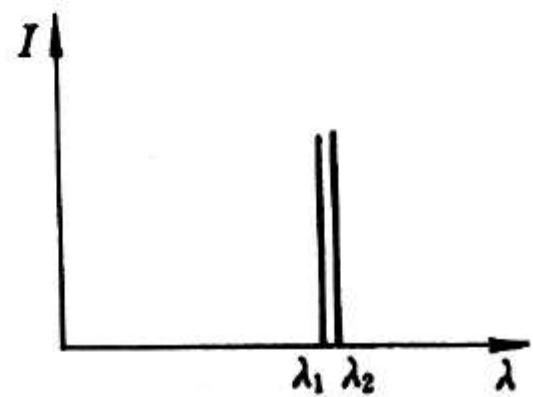
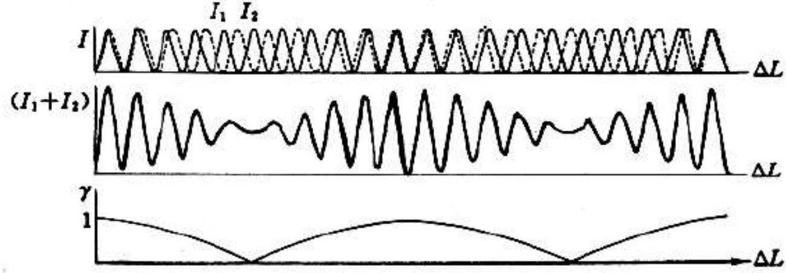
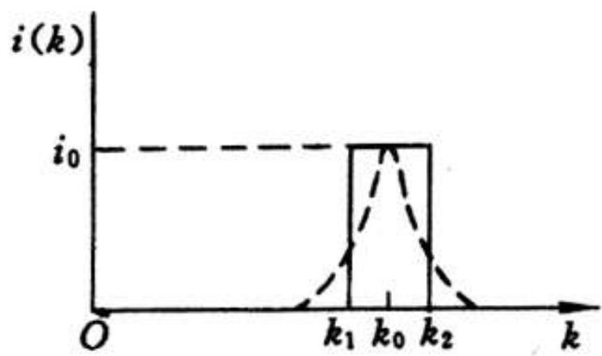
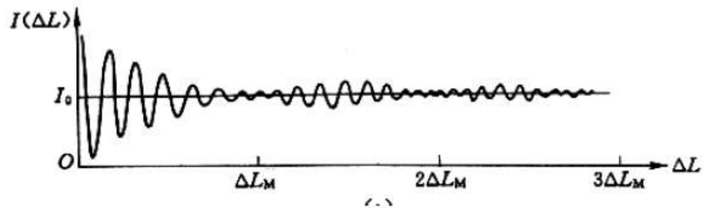
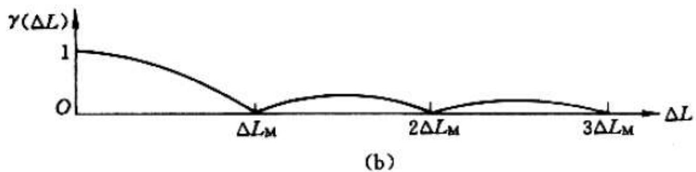

# 4.7.2 ==精密测长==与量程分析

### 一、 测长的基本原理

在迈克耳孙干涉仪中，当可动镜 $M_1$ 从位置 $A$ 平移到位置 $B$，移动距离为 $l$（在空气中，折射率 $n=1$）时，两路光的光程差变化为：

$$\Delta L = 2nl$$
通过观察干涉图像变化就可以去判断反射镜的移动距离
（一路光往返，路程变化 $2l$，折射率 $n$ 的 介质中光程变化 $2nl$）

如图所示，在平移过程中，观察点（或光电探测器）处的干涉强度随光程差周期性变化：

每当光程差变化 $\lambda$，干涉强度完成一个周期的明暗变化（亮→暗→亮）。若在 $M_1$ 移动 $l$ 的过程中，探测器记录到干涉强度变化了 $N$ 次（即条纹计数 $N$），则：

$$\Delta L = 2nl = N\lambda$$

解得 $M_1$ 的位移为：（背诵）

$$\boxed{l = N \cdot \frac{\lambda}{2n}}$$

这就是干涉测长的基本公式。知道波长 $\lambda$、介质折射率 $n$，再计数条纹数 $N$，即可测出位移 $l$。

### 二、 测长==精度==

实际测量中，条纹计数 $N$ 存在精度 $\delta N$（即对条纹数的分辨能力），则对应的位移测量误差为：

$$\delta l = \frac{\lambda}{2n} \cdot \delta N$$

在空气中（$n = 1$），取 $\lambda \approx 600\text{ nm}$：

- 人眼目视计数精度 $\delta N \sim 1/4$ 时：$\delta l \sim \lambda/8 \approx 75\text{ nm}$
- 光电计数技术精度 $\delta N \sim 1/12$ 时：$\delta l \sim \lambda/24 \approx 25\text{ nm}$

现代激光干涉仪配合高精度光电计数，测长精度可达 $\sim 20\text{ nm}$，达到纳米量级。

### 三、 测长==量程==的限制

#### 问题的来源

光源发出的光并非理想单色光，其谱线具有一定宽度 $\Delta\lambda$（即谱线不是无限细的单色线，而是有一定展宽）。这种非单色性导致干涉场的衬比度 $\gamma$ 随光程差 $\Delta L$ 增大而降低，当光程差过大时，干涉条纹会消失（$\gamma \to 0$），测量即无法继续进行。

#### 量程公式

对于谱线宽度为 $\Delta\lambda$（中心波长 $\bar\lambda$）的光源，干涉条纹可见的最大光程差为：
（背诵）
$$\Delta L_M = \frac{\bar\lambda^2}{\Delta\lambda}$$

因此迈克耳孙干涉仪的最大测长量程为：
（背诵）
$$\boxed{l_M = \frac{\Delta L_M}{2} = \frac{\bar\lambda^2}{2\Delta\lambda}}$$

#### 数值举例

以镉红线（$\lambda \approx 644\text{ nm}$，$\Delta\lambda \approx 10^{-3}\text{ nm}$）为例：

$$l_M = \frac{(644\text{ nm})^2}{2 \times 10^{-3}\text{ nm}} = \frac{644^2}{2 \times 10^{-3}} \text{ nm} \approx 2.07 \times 10^8\text{ nm} = 20.7\text{ cm}$$

即单次连续测量的最大量程约为 $20\text{ cm}$。

激光光源单色性极好（$\Delta\lambda \sim 10^{-7}\text{ nm}$），量程可达数百米至数千米，适合长距离精密测量。

#### 相对测量精度

综合测量精度与量程，干涉测长仪的相对精度为：

$$\frac{\delta l}{l_M} = \frac{\delta N \cdot \frac{\lambda}{2}}{l_M} = \delta N \cdot \frac{\Delta\lambda}{\bar\lambda} \sim 10^{-6} \sim 10^{-7}$$

这比普通机械测量精度高出数个数量级。

### 四、 非单色性对衬比度影响的定性理解

关于谱线宽度为何限制量程，直观理解如下：

光源发出的光包含一段波长范围 $[\bar\lambda - \Delta\lambda/2, \; \bar\lambda + \Delta\lambda/2]$ 内的各种波长成分。光程差 $\Delta L$ 时，不同波长成分各自形成干涉强度：
- 波长 $\lambda_1$ 的成分产生一套条纹
- 波长 $\lambda_2 \neq \lambda_1$ 的成分产生另一套条纹（同一级次对应的位置不同）

这多套条纹在探测器上叠加。当 $\Delta L$ 较小时，不同波长条纹的亮暗位置相差不多，叠加后衬比度较高；当 $\Delta L$ 增大时，不同波长条纹的亮暗位置逐渐错开（相对错位量随 $\Delta L$ 增大），叠加后衬比度下降；当 $\Delta L = \Delta L_M$ 时，各波长条纹的亮暗位置彼此均匀分布（等间隔错位），叠加后相互抵消，$\gamma = 0$，条纹消失。

### 五、 ==非单色性==的两种典型情况——详细分析（重要）

实际光源的非单色性有两种典型形式：

#### 1. ==光谱双线结构==导致 $\gamma(\Delta L)$ 周期性变化

典型例子：Na 黄双线（589.0 nm 和 589.6 nm），Hg 黄双线（577.0 nm 和 579.1 nm），均满足 $\Delta\lambda \ll \lambda_1, \lambda_2$。

两条谱线各自独立地（非相干地）产生一套干涉条纹，总光强为两套条纹的非相干叠加：

$$I(\Delta L) = I_0(1 + \cos k_1\Delta L) + I_0(1 + \cos k_2\Delta L)$$

利用和差化积 $\cos A + \cos B = 2\cos\dfrac{A-B}{2}\cos\dfrac{A+B}{2}$，整理得：

$$\boxed{I(\Delta L) = 2I_0\!\left(1 + \cos\frac{\Delta k}{2}\Delta L\cdot\cos\bar{k}\Delta L\right)}$$

其中 $\bar{k} = \dfrac{k_1+k_2}{2}$（对应平均波长 $\bar\lambda$），$\Delta k = k_1 - k_2 = \dfrac{2\pi}{\lambda^2}\Delta\lambda$（波长差对应的波数差）。

读出**衬比度**：

$$\boxed{\gamma(\Delta L) = \left|\cos\frac{\Delta k}{2}\Delta L\right|}$$

这是周期为 $\dfrac{2\pi}{\Delta k} = \dfrac{\bar\lambda^2}{\Delta\lambda}$ 的余弦函数，衬比度随光程差**周期性起伏**：

| $\Delta L$ | $0$ | $\dfrac{\bar\lambda^2}{2\Delta\lambda}$ | $\dfrac{\bar\lambda^2}{\Delta\lambda}$ | $\dfrac{3\bar\lambda^2}{2\Delta\lambda}$ |
|---|---|---|---|---|
| $\gamma$ | 1（==清晰==） | 0（==模糊==） | 1（==清晰==） | 0（==模糊==） |

**利用双线结构测量波长差 $\Delta\lambda$**（分辨光谱双线的干涉方法）：

从 $\Delta L = 0$ 开始移动 $M_1$，计数条纹数 $N_0$ 直到干涉场第一次变模糊（$\gamma = 0$），此时 $\lambda_1$ 的第 $N_0$ 级亮纹与 $\lambda_2$ 的第 $N_0 - \tfrac{1}{2}$ 级亮纹重合：

$$\Delta L = N_0\lambda_1 = \left(N_0 - \frac{1}{2}\right)\lambda_2 \quad\Rightarrow\quad N_0 \approx \frac{\bar\lambda}{2\Delta\lambda}$$

解得波长差：

$$\boxed{\Delta\lambda = \frac{\bar\lambda}{2N_0}}$$

由此还可以计算出两条谱线的波长 $\lambda_1 = \bar\lambda - \tfrac{\Delta\lambda}{2}$，$\lambda_2 = \bar\lambda + \tfrac{\Delta\lambda}{2}$。

#### 2. ==准单色线宽==导致 $\gamma(\Delta L)$ 单调下降

准单色光的谱线是以中心波数 $k_0$ 为中心、宽度为 $\Delta k$（对应波长宽度 $\Delta\lambda$）的连续谱分布，不是两条离散线。K是波数，2π/λ

**（a）谱密度函数**

定义光强谱密度 $i(k)$，使得 $[k, k+dk]$ 内的光强为 $i(k)dk$。为计算简洁，用**方垒型**（矩形）近似真实谱线形状：

$$i(k) = \begin{cases} i_0, & |k - k_0| < \Delta k/2 \\ 0, & |k - k_0| > \Delta k/2 \end{cases}$$

**（b）干涉强度积分**

各波数成分 $k$ 贡献的干涉强度微元为 $dI = i(k)(1 + \cos k\Delta L)dk$，总光强为各成分的**非相干叠加**（积分）：

$$I(\Delta L) = \int_{k_0-\Delta k/2}^{k_0+\Delta k/2} i_0(1 + \cos k\Delta L)\,dk = i_0\Delta k + i_0\int_{k_1}^{k_2}\cos k\Delta L\,dk$$

计算积分 $\int_{k_1}^{k_2}\cos k\Delta L\,dk = \dfrac{\sin k_2\Delta L - \sin k_1\Delta L}{\Delta L}$，再利用 $\sin\alpha - \sin\beta = 2\cos\dfrac{\alpha+\beta}{2}\sin\dfrac{\alpha-\beta}{2}$，整理得：

$$\boxed{I(\Delta L) = I_0\!\left(1 + \frac{\sin v}{v}\cos k_0\Delta L\right), \quad v = \frac{\Delta k}{2}\Delta L}$$

其中 $I_0 = i_0\Delta k$ 是总光强。

**（c）衬比度：sinc 函数**

$$\boxed{\gamma(\Delta L) = \left|\frac{\sin v}{v}\right| = \left|\operatorname{sinc}\!\left(\pi\frac{\Delta L}{\Delta L_M}\right)\right|, \quad \Delta L_M = \frac{2\pi}{\Delta k} = \frac{\bar\lambda^2}{\Delta\lambda}}$$

**（d）两种非单色性的对比总结**

| 光谱结构                        | $\gamma(\Delta L)$ 形式 | 行为特征                                                    |     |                               |
| --------------------------- | --------------------- | ------------------------------------------------------- | --- | ----------------------------- |
| **双线**（间距 $\Delta\lambda$）  | $\left                | $\cos\dfrac{\pi\Delta L}{\Delta L_M}$                   | $   | 周期性起伏，$\gamma$ 反复在 0 和 1 之间振荡 |
| **准单色**（线宽 $\Delta\lambda$） | $\left                | $\operatorname{sinc}\dfrac{\Delta L}{\Delta L_M}\right$ | $   | 从 1 单调衰减到 0，之后极小振荡            |

两种情况下，最大测长量程==相同==：$l_M = \dfrac{\bar\lambda^2}{2\Delta\lambda}$。

> **谱线宽度的定义**：谱线宽度 $\Delta\lambda$ 是谱密度函数 $i(\lambda)$（或 $i(k)$）的**半高全宽（FWHM）**，即光强谱密度降为峰值一半时对应的波长范围。$\Delta\lambda$ 越小，单色性越好，干涉场中衬比度维持较高值的光程差范围越大，迈克耳孙干涉仪的测长量程越大。常用数量级：普通光源 $\Delta\lambda \sim 1\text{ nm}$，滤波后 $\Delta\lambda \sim 10^{-3}\text{ nm}$，激光 $\Delta\lambda \sim 10^{-7}\text{ nm}$。

> **结论**：迈克耳孙干涉仪的测长公式为 $l = N\lambda/(2n)$，精度取决于条纹计数精度；量程受光源谱线宽度限制，最大量程 $l_M = \bar\lambda^2/(2\Delta\lambda)$。双线结构导致 $\gamma$ 周期性起伏（可用来测双线间距 $\Delta\lambda = \bar\lambda/2N_0$），准单色线宽导致 $\gamma$ 单调衰减为 sinc 函数。两者最大量程形式相同，单色性越好量程越大。

