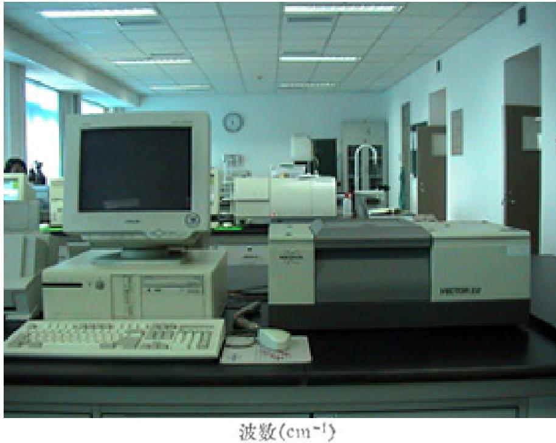
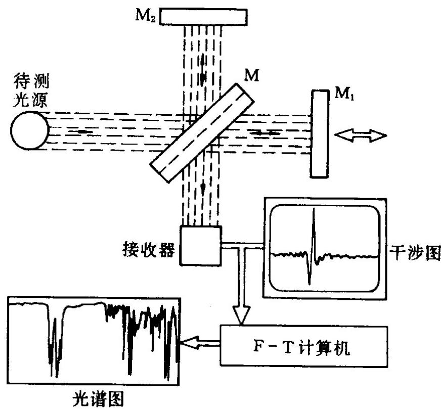
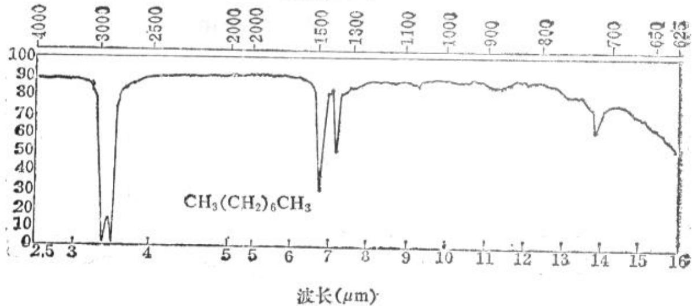
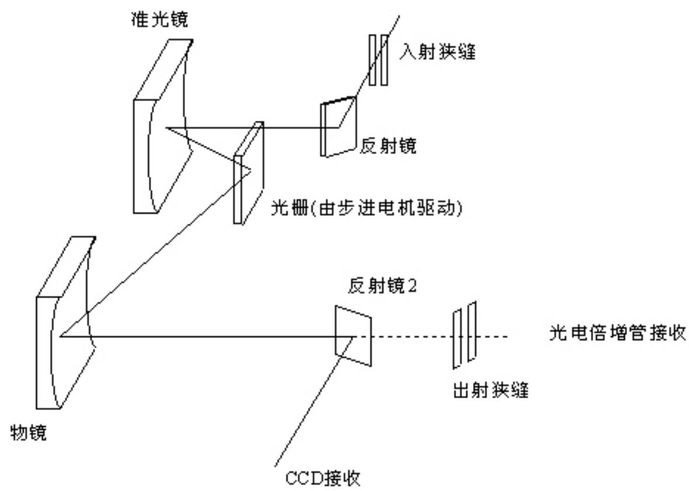

# 4.7.3 ==傅立叶变换光谱仪==

### 一、 基本思路

传统光谱仪（棱镜式或衍射光栅式）通过色散元件将不同波长的光在空间上分开，再由探测器阵列逐点测量各波长的光强，从而获得光谱 $I_0(\lambda)$。

傅立叶变换光谱仪的思路完全不同：它以迈克耳孙干涉仪为核心，**不在空间上分开不同波长**，而是让所有波长的光一起产生干涉；通过扫描可动镜 $M_1$ 改变光程差 $l$，记录探测器上的总光强随光程差的变化 $I(l)$；最后对 $I(l)$ 进行**傅立叶变换**，数学上恢复出光源的光谱分布 $I_0(k)$（$k = 2\pi/\lambda$ 为波数）。

### 二、 数学原理推导

设光源的光强谱分布为 $I_0(k)$（即在波数 $k$ 到 $k+dk$ 区间内的光强为 $I_0(k)dk$）。

当可动镜处于位置使光程差为 $D = 2l$ 时，波数为 $k$ 的单色成分产生的干涉光强为：

$$I(\lambda) = 2I_0(\lambda)(1 + \cos\delta(\lambda)) = 2I_0(k)(1 + \cos 2lk)$$

探测器接收到的是所有波长成分的非相干叠加，总光强为：

$$I(l) = \int_0^\infty I_0(k)(1 + \cos 2lk) \, dk = I_{00} + \int_0^\infty I_0(k)\cos(2lk) \, dk$$

其中 $I_{00} = \int_0^\infty I_0(k) \, dk$ 是光源总光强（与 $l$ 无关的直流分量）。

注意到 $I(l) - I_{00} = \int_0^\infty I_0(k)\cos(2lk) \, dk$ 正好是 $I_0(k)$ 对 $l$ 的**余弦傅立叶变换**。

对此式做傅立叶**逆变换**，就可从测量到的 $I(l)$ 中还原出光谱：

$$\boxed{I_0(k) = \frac{1}{\pi} \int_0^\infty \left[I(l) - I_{00}\right] \cos(2lk) \, dl}$$

### 三、 实验流程

1. 扫描可动镜 $M_1$，在一定范围内均匀改变光程差 $l$（从 $0$ 到最大值 $l_M$）
2. 探测器在每个位置记录总光强 $I(l)$，得到"干涉图"（interferogram）
3. 用计算机对干涉图做傅立叶变换，得到光源的光谱 $I_0(k)$

下图给出了完整的傅立叶变换光谱仪工作流程：

### 四、 傅立叶变换光谱仪的优点

与传统色散型光谱仪相比，傅立叶变换光谱仪具有以下优势。传统色散型光谱仪（如光栅光谱仪）的光路结构如图：

**1. 速度快（Fellgett优势）**

传统光谱仪通过狭缝一次只测量一个波长（或小波长范围），要获得完整光谱需要逐段扫描。傅立叶变换光谱仪每次测量时，探测器同时接收来自所有波长的光，一次扫描即可获得整个光谱。在相同时间内，信噪比提高 $\sqrt{M}$ 倍（$M$ 为光谱分辨单元数目）。

**2. 分辨本领高（Jacquinot优势）**

传统光谱仪通过狭缝限制，分辨率提高时，光通量下降；傅立叶变换光谱仪不需要狭缝，可以使用面积很大的圆形入射孔径，在同等分辨率下光通量更大，信噪比更高。

**3. 信噪比高**

以上两点综合，使傅立叶变换光谱仪在相同分辨率和测量时间条件下，信噪比显著优于色散型光谱仪。

**4. 适合红外区域**

红外探测器灵敏度较低，光源功率弱，上述优势在红外区（波长 $1 \sim 1000 \, \mu\text{m}$）表现得最为突出，因此傅立叶变换光谱仪在红外光谱分析领域被广泛应用。

### 五、 仪器规格举例

以德国 **Bruker VECTOR 22** 傅立叶红外光谱仪为例：
- **波数范围**：$370 \sim 7500 \, \text{cm}^{-1}$（即波长约 $1.3 \sim 27 \, \mu\text{m}$，中远红外区）
- **分辨率**：$1 \, \text{cm}^{-1}$
- **主要应用**：物质的定性与定量分析（通过分子的吸收光谱判断官能团）

> **结论**：傅立叶变换光谱仪的核心是迈克耳孙干涉仪。通过扫描光程差 $l$ 记录干涉图 $I(l)$，再对 $I(l) - I_{00}$ 做余弦傅立叶变换，即可还原出光源的光谱分布 $I_0(k)$。其主要优势是速度快、分辨率高、信噪比高，特别适合红外光谱分析。
