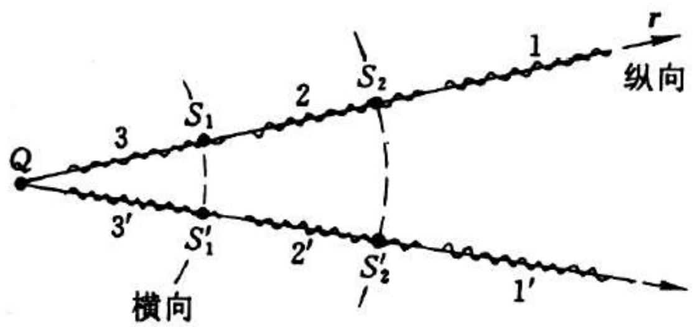
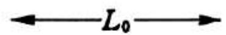
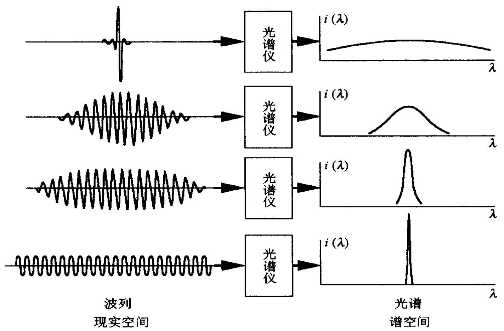

# 4.8.1 ==相干时间==与==相干长度==

### 一、 问题的提出

前面讨论干涉时，通常假设从同一光源出发的 两路光可以干涉。但对于实际光源，即使是**点光源**，其照明空间中的两个点（次波源 $S_1$ 和 $S_2$）也并非"完全相干"——它们的相干程度取决于两点之间的**光程差** $\Delta L$ 与光源的**波列长度** $L_0$ 的比较。

### 二、 实际光源的发光机制

实际光源（非激光）的发光来自原子或分子的**自发辐射**：原子在激发态上不稳定，会自发跳回低能级并辐射一个光子。这是一个**随机过程**：
- 每个原子辐射的时刻不可预测
- 辐射完成后，原子进入基态，光辐射中断
- 原子再次被激发后，可能在某个随机时刻再次发光
- 相邻两次发光之间的相位**没有固定关系**（随机跳变）

因此，从宏观角度看，单个原子发出的是一串断续的**波列**：每一段波列有一定的持续时间 $\tau_0$（量级为纳秒，即 $\tau_0 \sim 10^{-9}\text{ s}$），波列之间相位随机。

### 三、 相干时间与相干长度

**相干时间** $\tau_0$：一段波列持续发光的时间，即两次相位随机跳变之间的时间间隔。

**相干长度** $L_0$：一段波列在空间中的长度（光程），定义为：

$$L_0 = c\tau_0$$

其物理意义是：在距离 $L_0$ 范围内，光场的相位是连续的、有规律的（属于同一段波列）；超出 $L_0$，光场属于不同的波列，相位之间没有固定关系。

### 四、 相干长度决定相干条件

在干涉实验（如迈克耳孙干涉仪）中，两路光的光程差为 $\Delta L$：

- 若 $\Delta L < L_0$：到达观察点的两束光属于同一段波列，相位差固定，可以产生稳定的干涉条纹
- 若 $\Delta L > L_0$：两束光来自不同段波列，相位差随时间随机变化（快速涨落），干涉条纹消失，观察到的是时间平均强度

### 五、 数量级估算

| 发光类型 | 相干时间 $\tau_0$ | 相干长度 $L_0 = c\tau_0$ |
|---------|-----------------|------------------------|
| 普通热光源（如钠灯）| $\sim 10^{-9}\text{ s}$ | $\sim 30\text{ cm}$ |
| 精选单色光源（如稳频钠灯）| $\sim 10^{-8}\text{ s}$ | $\sim 3\text{ m}$ |
| 优质单色光源 | $\sim 10^{-5}\text{ s}$ | $\sim 3\text{ km}$ |
| 稳频激光器 | $\sim 10^{-3}\text{ s}$ 或更长 | $\sim 300\text{ km}$ 或更长 |

### 六、 波列长度与谱线宽度的互为表里关系

波列长度 $L_0$ 与光源谱线宽度 $\Delta\lambda$ 之间存在反比关系：

$$\boxed{L_0 = c\tau_0 \approx \frac{\bar\lambda^2}{\Delta\lambda}}$$

这个关系是由信号的时频互为变换性质决定的（类似于量子力学中的时间-能量不确定关系 $\Delta E \cdot \Delta t \sim \hbar$）：

如图所示，波列越短（$L_0$ 越小），其频率分量越分散（谱线宽度 $\Delta\lambda$ 越大）；波列越长（$L_0$ 越大），频率越集中（$\Delta\lambda$ 越小）。

用频率 $\nu$ 表达时，此反比律写为：

$$\tau_0 \cdot \Delta\nu \approx 1$$

即相干时间和谱线的频率宽度互为倒数关系。

### 七、 与迈克耳孙干涉仪量程的对应

在 [[4.7.2 精密测长与量程分析]] 中，由谱线宽度给出的量程为 $l_M = \bar\lambda^2 / (2\Delta\lambda)$。结合上述反比律 $L_0 \approx \bar\lambda^2/\Delta\lambda$，两者完全一致：

$$l_M = \frac{\bar\lambda^2}{2\Delta\lambda} = \frac{L_0}{2} = \frac{c\tau_0}{2}$$

这说明两种角度（谱线宽度角度 vs. 波列长度角度）对测长量程的限制本质上是同一件事。

> **结论**：实际光源的自发辐射是断续的，产生有限长度的波列。相干时间 $\tau_0$ 和相干长度 $L_0 = c\tau_0$ 描述了波列的持续时间和空间长度。只有当光程差 $\Delta L < L_0$ 时，两路光才属于同一波列、才能干涉。波列越长（单色性越好），相干长度越大，对应的谱线宽度越窄，两者满足反比律 $L_0 \cdot \Delta\lambda \approx \bar\lambda^2$。
