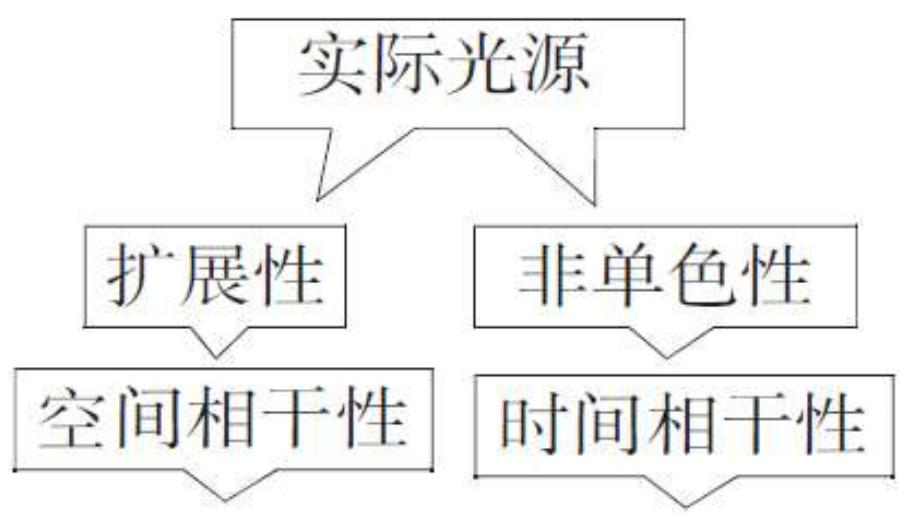

# 4.8.3 时间相干性==反比律==与光场时空相干性小结

### 一、 时间相干性反比律

在 [[4.8.1 相干时间与相干长度]] 中已给出结论，这里明确写出**时间相干性反比律**的三种等价表达形式：

$$\boxed{L_0 \cdot \frac{\Delta\lambda}{\lambda} \approx \lambda \quad \Longleftrightarrow \quad L_0 \approx \frac{\lambda^2}{\Delta\lambda} \quad \Longleftrightarrow \quad \tau_0 \cdot \Delta\nu \approx 1}$$

其中：
- $L_0 = c\tau_0$ 为相干长度（波列的空间长度）
- $\Delta\lambda$ 为谱线宽度（波长域）
- $\Delta\nu$ 为谱线宽度（频率域，$\Delta\nu = c\Delta\lambda/\lambda^2$）
- $\tau_0$ 为相干时间

三种写法中，$\tau_0 \cdot \Delta\nu \approx 1$ 最常用，表明相干时间和谱线的频率宽度互为倒数。

### 二、 实际光源的两类局限性

实际光源总是**同时具备**两种局限性：

- **扩展性**（有一定大小）：光源不是理想点光源，具有一定的线度（对应张角 $\Delta\theta_0$），这导致**空间相干性**的限制——只有光程横向差（由光源各部分到两次波源的路程差）在相干范围内，才能产生干涉。空间相干性用相干孔径角 $\Delta\theta_0$ 或相干面积描述，衬比度满足：$\gamma(\Delta\theta) = \left|\text{sinc}\left(\pi\frac{\Delta\theta}{\Delta\theta_0}\right)\right|$

- **非单色性**（谱线有宽度）：光源发出的光不是理想单色光，具有一定谱线宽度 $\Delta\lambda$，这导致**时间相干性**的限制——只有光程纵向差（路程差 $\Delta L$）在相干长度以内，才能产生干涉。时间相干性用相干长度 $L_0 = \lambda^2/\Delta\lambda$ 或相干时间 $\tau_0 = L_0/c$ 描述，衬比度满足：$\gamma(\Delta L) = \left|\text{sinc}\left(\pi\frac{\Delta L}{L_0}\right)\right|$

### 三、 时空相干性并存

在实际干涉实验中，以上两类限制同时存在。观察点 $P$ 处两束光的叠加，等价于研究光源在两个不同时刻 $t_1 = t$ 和 $t_2 = t - \tau$（其中 $\tau = \Delta L/c$）的扰动之间的相关性：

$$\tilde{U}_1(t) \text{ 与 } \tilde{U}_2(t - \tau) \text{ 的相关性}$$

两者同时受到以下制约：
- 若 $\tau$ 大（光程差大）：时间相干性下降，$\gamma(\Delta L)$ 减小
- 若 $\Delta\theta$（两次波源对光源的张角差）大：空间相干性下降，$\gamma(\Delta\theta)$ 减小

总体衬比度近似为两者乘积（在两类限制相互独立时）：

$$\gamma_{\text{总}} \approx \gamma_{\text{空间}}(\Delta\theta) \cdot \gamma_{\text{时间}}(\Delta L)$$

### 四、 不同干涉装置中的侧重点

不同干涉装置对两类相干性的侧重不同：

**分波前干涉（杨氏双缝）**：两次波源 $S_1$、$S_2$ 之间的横向间距 $d$ 远小于相干长度（$d \ll L_0$），两路光的光程差通常也远小于 $L_0$，因此**时间相干性影响可忽略**（$\gamma_{\text{时间}} \approx 1$）；这类装置**主要体现空间相干性**——光源大小是否满足相干条件是关键。

**迈克耳孙干涉仪（纵向平移型）**：两路光的路程差可以很大，因此**时间相干性是主要限制**；扩展光源有利于提高等倾干涉条纹的亮度，不受空间相干性限制，因此这类装置**主要体现时间相干性**——谱线宽度决定可干涉的最大路程差。

### 五、 常用术语汇总

| 术语 | 含义 | 对应量 |
|------|------|--------|
| **相干孔径角** $\delta\theta_0$ | 光源允许的最大张角 | $b\cdot\delta\theta_0 \approx \lambda$（$b$ 为双缝间距）|
| **相干面积** $S_c$ | 波前上相干区域的面积 | $S_c \approx \lambda^2/\Omega$（$\Omega$ 为光源立体角）|
| **相干时间** $\tau_0$ | 波列的持续时间 | $\tau_0 \approx 1/\Delta\nu$ |
| **相干长度** $L_0$ | 波列的空间长度 | $L_0 = c\tau_0 \approx \lambda^2/\Delta\lambda$ |

> **总结**：时间相干性反比律 $\tau_0\cdot\Delta\nu \approx 1$（即 $L_0 \approx \lambda^2/\Delta\lambda$）将相干时间与谱线宽度联系起来，是理解干涉测量量程限制的核心公式。实际光源的扩展性和非单色性同时存在，前者限制空间相干性（决定分波前干涉能否进行），后者限制时间相干性（决定长程差干涉的最大光程差范围）。两类相干性的统一描述框架是部分相干光传播理论。
