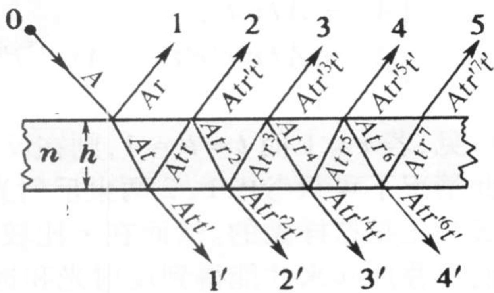
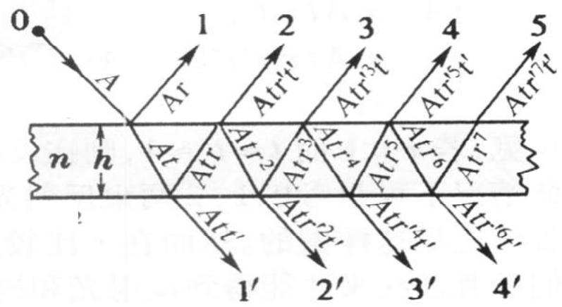
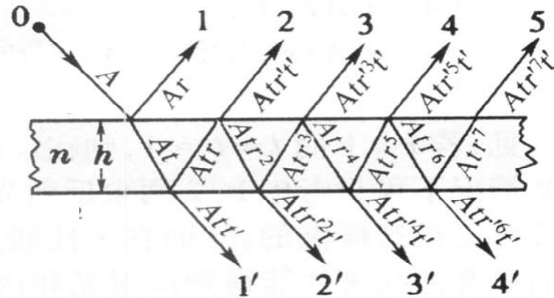
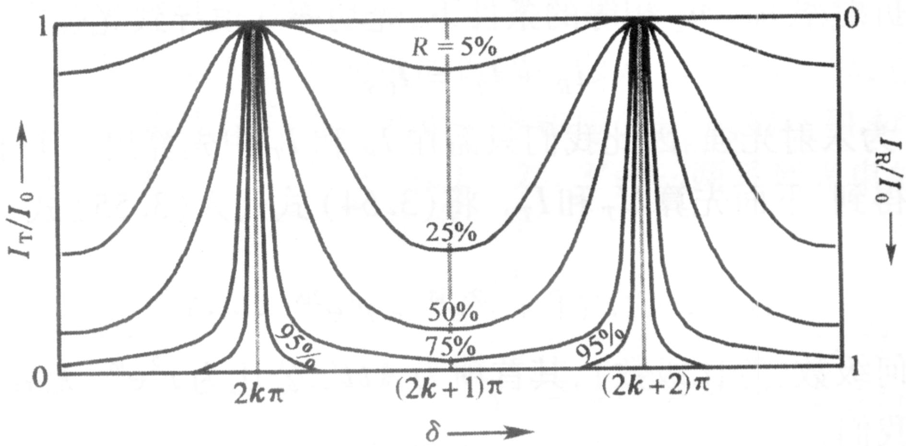
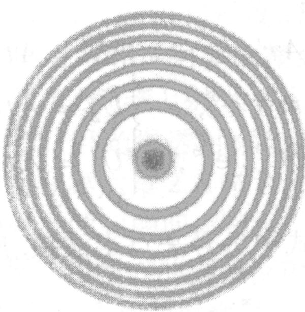
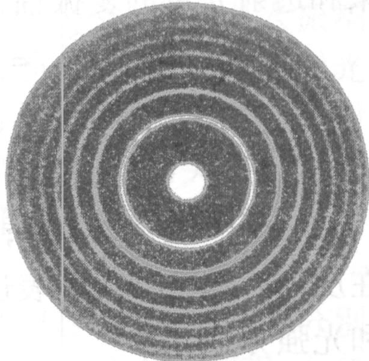

# 4.9.1 ==多光束==振幅分割与透射反射强度公式

> **脉络**：前几节讨论的都是两束光的叠加（两光束干涉）。当平板玻璃或两平行镜面之间的界面反射率较高时，光在两界面之间会来回多次反射，形成无穷多束相干光的叠加，即**多光束干涉**。多光束干涉给出的光强公式（艾里公式）与两光束干涉结果有本质差异：随着反射率的增大，透射条纹变得极细极锐，这是法布里-珀罗干涉仪（[[4.9.2 法布里-珀罗干涉仪与应用]]）的物理基础。

---

### 一、 问题的提出：多光束的产生

在普通薄膜干涉（[[4.6.1 薄膜干涉的光程差公式与半波损失]]）中，我们只取了两束光（第一次反射光和第一次折射再反射再折射光），这在界面反射率 $R$ 很小（如普通玻璃，$R \approx 4\%$）时是可接受的近似，因为后续各束光的强度迅速衰减到几乎可以忽略。

但是，当界面的反射率 $R$ 较高时（例如镀银膜后 $R$ 可达 $90\%$ 以上），后续多次反射光的强度不可忽略，此时必须将所有反射次数的光全部叠加，才能得到正确的光强分布。

---

### 二、 振幅关系：各次透射光和反射光的振幅

设平板折射率为 $n$，厚度为 $h$，入射角为 $i$，入射光振幅为 $A$。用菲涅耳系数 $r$（上表面反射）、$t$（上表面透射）、$r'$（下表面反射）、$t'$（下表面透射）描述各界面上振幅的比值。

**反射光各束振幅**（从上方逐一射出）：

$$\begin{cases}
A_1 = Ar \\
A_2 = Atr't' \\
A_3 = Atr'^3t' \\
A_4 = Atr'^5t' \\
\quad\vdots
\end{cases}$$

第1束是入射光在上表面直接反射，振幅为 $Ar$。

第2束及以后各束：光先透过上表面（系数 $t$），在下表面反射一次（系数 $r'$），回到上表面内表面反射偶数次后再透出（系数 $t'$），每多绕一圈多两次下表面内反射（系数 $r'^2$），所以第 $j$ 束（$j \geq 2$）振幅为 $Atr'^{2j-3}t'$。

**透射光各束振幅**（从下方逐一射出）：

$$\begin{cases}
A_1' = Att' \\
A_2' = Att'r'^2 \\
A_3' = Att'r'^4 \\
A_4' = Att'r'^6 \\
\quad\vdots
\end{cases}$$

第1束直接透过（系数 $tt'$），此后每束比前一束在内部多绕一圈（多两次内反射 $r'^2$）。

---

### 三、 相位关系：相邻光束的相位差

相邻两束透射光（或相邻两束反射光中第2、3、4...束之间）的光程差相同，都来自光在厚度为 $h$ 的平板内多走一个完整来回：

$$\Delta L = 2nh\cos i$$

对应的相位差：

$$\boxed{\delta = \frac{2\pi}{\lambda} \cdot 2nh\cos i = \frac{4\pi nh\cos i}{\lambda}}$$

（此处暂不计入半波损失的相位变化，后面在讨论反射光时需要注意上下表面半波损失情况。）

写出各束透射光的复振幅（以第1束相位为参考零点）：

$$\begin{cases}
\widetilde{U}_1' = Att' \\
\widetilde{U}_2' = Att'r'^2 e^{i\delta} \\
\widetilde{U}_3' = Att'r'^4 e^{i2\delta} \\
\widetilde{U}_4' = Att'r'^6 e^{i3\delta} \\
\quad\vdots
\end{cases}$$

各束反射光的复振幅（注意第1束与其他束相位基准不同）：

$$\begin{cases}
\widetilde{U}_1 = Ar \\
\widetilde{U}_2 = Atr't'e^{i\delta} \\
\widetilde{U}_3 = Atr'^3t'e^{i2\delta} \\
\widetilde{U}_4 = Atr'^5t'e^{i3\delta} \\
\quad\vdots
\end{cases}$$

---

### 四、 透射光总振幅的求和：等比数列

将透射光所有分量按等比数列求和：

$$\widetilde{U}_T = \sum_{j=1}^{\infty} \widetilde{U}_j' = Att'\sum_{j=0}^{\infty} (r'^2 e^{i\delta})^j = \frac{Att'}{1 - r'^2 e^{i\delta}}$$

利用菲涅耳系数满足的关系式：

- $r = -r'$（同一界面两侧入射时反射系数互为相反数，满足斯托克斯倒逆关系）
- $r^2 = r'^2$，令 $R = r^2 = r'^2$（单界面光强反射率）
- $tt' = 1 - r^2 = 1 - R$（能量守恒：无吸收时 $r^2 + tt' = 1$）

则总透射光强：

$$\boxed{I_T = \widetilde{U}_T \cdot \widetilde{U}_T^* = \frac{I_0}{1 + \dfrac{4R\sin^2\!\left(\dfrac{\delta}{2}\right)}{(1-R)^2}}}$$

这就是**艾里公式（Airy formula）**，描述多光束干涉的透射光强分布。

---

### 五、 反射光强度

由能量守恒（无吸收），透射光强和反射光强之和等于入射光强：

$$I_R = I_0 - I_T$$

即：

$$\boxed{I_R = \frac{I_0}{1 + \dfrac{(1-R)^2}{4R\sin^2\!\left(\dfrac{\delta}{2}\right)}}}$$

$I_T$ 与 $I_R$ 互补：$I_T + I_R = I_0$，二者之和始终等于入射光强。

---

### 六、 艾里公式的分析：极值与峰的锐度

**透射极大（亮纹）**：当 $\sin^2(\delta/2) = 0$，即 $\delta = 2k\pi$（$k$ 为整数）时，$I_T$ 取最大值：

$$I_{T,\max} = I_0$$

此时透射光强等于入射光强（全部透射），无论 $R$ 取何值，峰值均为 $I_0$。

**透射极小（暗纹）**：当 $\sin^2(\delta/2) = 1$，即 $\delta = (2k+1)\pi$ 时，$I_T$ 取最小值：

$$I_{T,\min} = \frac{I_0(1-R)^2}{(1-R)^2 + 4R} = \frac{I_0(1-R)^2}{(1+R)^2}$$

当 $R$ 增大时，$(1-R)^2/(1+R)^2$ 迅速减小，暗纹趋近于零。

**峰的锐度随 $R$ 的变化**：

下图是不同反射率 $R$ 下 $I_T/I_0$ 随相位差 $\delta$ 变化的曲线（艾里公式曲线族），左纵轴为 $I_T/I_0$，右纵轴为 $I_R/I_0$：

从图中可以直观地看出：
- $R = 5\%$（普通玻璃）：曲线接近余弦分布，峰宽，暗纹极小值较大，与两光束干涉结果差别不大
- $R = 50\%$：峰变窄，暗纹明显更深
- $R = 95\%$（高反射率镀膜）：透射峰极细极锐，绝大部分 $\delta$ 值下 $I_T \approx 0$，只在 $\delta = 2k\pi$ 附近的极窄范围内有光透过

下面两张照片对比了低反射率（宽条纹）和高反射率（极细条纹）下 FP 干涉仪实际产生的等倾圆环形貌：

这就是多光束干涉的核心特点：**高反射率导致极细锐的透射条纹**。相比之下，两光束干涉只能得到余弦分布的条纹，条纹没有这种选频尖锐性。

---

### 七、 引入精细度 $\mathcal{F}$（峰锐度的量化指标）

为定量描述峰的锐度，引入**精细度**（Finesse）$\mathcal{F}$，定义为相邻两个极大之间的相位差间隔（即自由光谱范围 FSR = $2\pi$）除以峰的半高全宽 $\delta_{1/2}$：

$$\boxed{\mathcal{F} = \frac{\text{FSR}}{\delta_{1/2}} = \frac{\pi\sqrt{R}}{1-R}}$$

**精细度的推导过程**：引入参数 $F = 4R/(1-R)^2$，艾里公式可简写为 $I_T = I_0/(1+F\sin^2(\delta/2))$。透射峰的半高点满足 $I_T = I_0/2$，即：

$$1 + F\sin^2\!\left(\frac{\delta}{2}\right) = 2 \quad\Rightarrow\quad \sin^2\!\left(\frac{\delta}{2}\right) = \frac{1}{F}$$

在极大值附近（$\delta \approx 2k\pi$），令 $\delta = 2k\pi + \varepsilon$，则 $\sin(\delta/2) = \sin(k\pi + \varepsilon/2) \approx \pm\varepsilon/2$（小角近似），代入得：

$$\left(\frac{\varepsilon}{2}\right)^2 = \frac{1}{F} \quad\Rightarrow\quad |\varepsilon| = \frac{2}{\sqrt{F}}$$

半高全宽（FWHM）为两个半高点之差：

$$\delta_{1/2} = 2|\varepsilon| = \frac{4}{\sqrt{F}} = \frac{4(1-R)}{2\sqrt{R}} = \frac{2(1-R)}{\sqrt{R}}$$

自由光谱范围（FSR）= 相邻两极大之间的相位差 = $2\pi$，因此：

$$\boxed{\mathcal{F} = \frac{\text{FSR}}{\delta_{1/2}} = \frac{2\pi}{2(1-R)/\sqrt{R}} = \frac{\pi\sqrt{R}}{1-R}}$$

$R$ 越大，$\mathcal{F}$ 越大，$\delta_{1/2}$ 越小，条纹越细锐，分辨超精细谱线的能力越强。

---

### 八、 对比两光束干涉与多光束干涉

| 比较项目 | 两光束干涉 | 多光束干涉 |
|---|---|---|
| 光强公式形式 | $I = 2I_0(1+\cos\delta)$，余弦 | $I_T = I_0 / [1 + F\sin^2(\delta/2)]$，艾里公式 |
| 亮纹形状 | 宽余弦峰 | 随 $R$ 增大变为极细锐峰 |
| 暗纹最低点 | $I_{\min} = 0$ | $I_{\min} \to 0$（仅当 $R \to 1$ 时接近0） |
| 衬比度 | 取决于振幅比 | 取决于 $R$ |
| 谱线分辨能力 | 低 | 高（$R$ 越大越高） |
| 典型应用 | 波长测量、薄膜检测 | 超精细光谱分析（FP干涉仪） |

> **结论**：多光束干涉的透射光强由艾里公式 $I_T = I_0 / [1 + 4R\sin^2(\delta/2)/(1-R)^2]$ 描述。当界面反射率 $R$ 增大时，透射峰的宽度按精细度 $\mathcal{F} = \pi\sqrt{R}/(1-R)$ 的倒数缩窄，条纹变得极细极锐。这种细锐条纹对相位差的微小变化极为敏感，是法布里-珀罗干涉仪实现超精细光谱分辨的物理基础（[[4.9.2 法布里-珀罗干涉仪与应用]]）。
