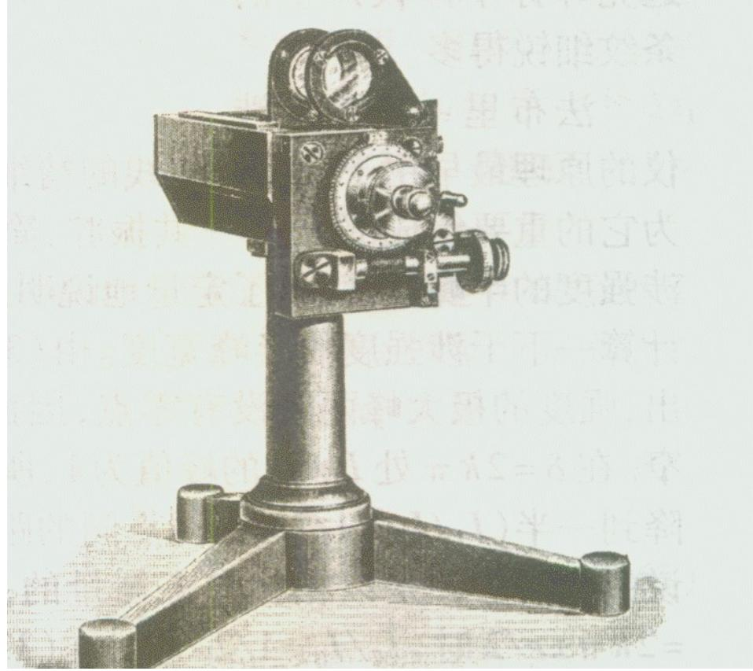
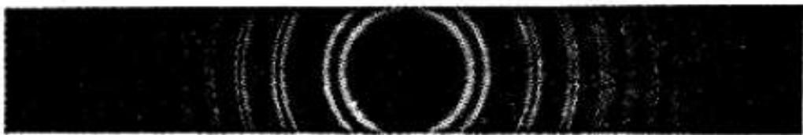
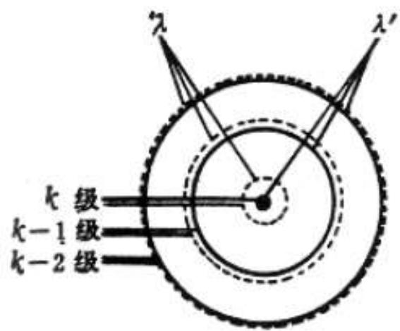
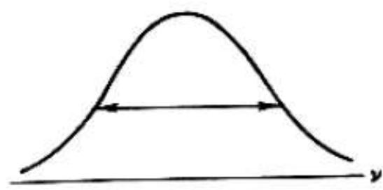
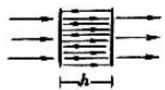
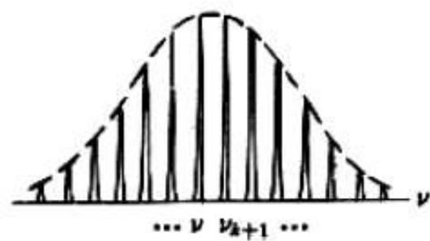

# 4.9.2 ==法布里-珀罗干涉仪==及其应用

> **脉络**：在[[4.9.1 多光束振幅分割与透射反射强度公式]]中，我们得到了艾里公式，并看到高反射率下透射峰极细极锐。法布里-珀罗干涉仪（Fabry-Pérot interferometer，简称FP仪）正是利用这一原理制成的仪器：在两面高反射率镀膜的平行玻璃板之间形成多光束干涉，产生极细锐的等倾条纹，从而能够分辨极为接近的两条谱线（超精细光谱）。此外，当用平行光（单一角度）照明时，FP谐振腔对透过的光的频率具有严格的选频功能，是激光器谐振腔的工作原理。

---

### 一、 装置结构

法布里-珀罗干涉仪由两块平行的光学平板（或两块平行镜面）组成，内表面镀有高反射率薄膜（$R$ 通常为 $85\%\sim99\%$），外表面略有倾角以防止杂散反射光干扰。两内表面之间的间距为 $h$，腔内介质折射率为 $n$（通常为空气，$n=1$）。

光源和仪器的使用方式有两种，分别对应两种应用场景：

**（a）扩展单色光源照明**：光源角度范围广，对应 $\delta(\theta)$ 的变化，在观察屏上形成等倾干涉圆条纹。由于条纹极细锐，可用于分辨超精细谱线。

**（b）平行单色光正入射**：光的入射角 $\theta = 0$ 固定，$\delta = 4\pi nh/\lambda$ 只随波长 $\lambda$（或频率 $\nu$）变化，FP腔对透过光的频率起**选频**作用。

---

### 二、 等倾条纹与谱线分辨

当用**扩展的单色光源**照明时，$\theta$ 连续变化，相位差：

$$\delta(\theta) = \frac{4\pi nh\cos\theta}{\lambda}$$

按艾里公式，每当 $\delta = 2k\pi$（$k$为正整数）时，出现一个极细锐的透射亮环，对应的入射角 $\theta_k$ 满足：

$$2nh\cos\theta_k = k\lambda$$

由于条纹极细锐（精细度 $\mathcal{F}$ 很大），两个相邻亮环之间间隔很大，而每个亮环本身极窄。

**谱线分辨**：如果光源同时含有两条接近的谱线 $\lambda_1$ 和 $\lambda_2$（$\lambda_1 < \lambda_2$，$\Delta\lambda = \lambda_2 - \lambda_1$ 很小），每条谱线各自产生一套极细锐的等倾条纹，如图所示：

下图是艾里公式曲线上两条谱线产生的两套细锐峰，展示了FP仪在 $I_T$-$\delta$ 曲线上如何分辨双谱线的情况：

分辨两条谱线的条件是：当其中一条谱线 $\lambda_1$ 的某一级极大与另一条谱线 $\lambda_2$ 的同级极大能够被明显区分开，即要求两套条纹的峰不重叠。精细度 $\mathcal{F}$ 越大（$R$ 越大），每个峰越细锐，越小的 $\Delta\lambda$ 也能被分辨。FP仪的分辨本领（色分辨率）$\mathcal{R}$ 满足：

$$\mathcal{R} = \frac{\lambda}{\delta\lambda_{\min}} \approx k \cdot \mathcal{F}$$

其中 $k$ 是干涉级次，$\mathcal{F} = \pi\sqrt{R}/(1-R)$，$\delta\lambda_{\min}$ 是刚好能分辨的最小谱线间距。

---

### 三、 FP谐振腔的选频功能

当用**平行光（$\theta = 0$）正入射**时，固定入射方向，相位差只随波长变化：

$$\delta = \frac{4\pi nh}{\lambda}$$

透射极大的波长条件（$\delta = 2k\pi$）为：

$$\boxed{\lambda_k = \frac{2nh}{k}}$$

写成频率形式：

$$\boxed{\nu_k = k \cdot \frac{c}{2nh}}$$

这些频率彼此等间隔，间距（即纵模间隔，Free Spectral Range，FSR）为：

$$\Delta\nu_{\text{FSR}} = \nu_{k+1} - \nu_k = \frac{c}{2nh}$$

物理意义：FP谐振腔对入射光中频率恰好满足 $\nu = k \cdot c/(2nh)$ 的分量允许透过（该频率在腔内来回反射时恰好形成驻波，即相位累积为 $2\pi$ 的整数倍），而其他频率的光则在多次反射后相消，不能透过。

**选频过程如图所示**：

输入宽谱光经过FP谐振腔后，输出的是一系列等间隔的细谱线，即下图所示的"梳状"频谱：

**纵模间隔的实际意义**：

$$\Delta\nu_{\text{FSR}} = \frac{c}{2nh}$$

腔长 $h$ 越短，纵模间隔越大（"短腔长，频差大"）。例如，腔长 $h = 15\text{ cm}$（$n = 1$）时：

$$\Delta\nu_{\text{FSR}} = \frac{3\times10^8}{2\times0.15} = 10^9\text{ Hz} = 1\text{ GHz}$$

FP谐振腔的每个纵模本身还有一定的线宽，线宽由精细度决定：

$$\delta\nu_{\text{峰宽}} = \frac{\Delta\nu_{\text{FSR}}}{\mathcal{F}}$$

$R$ 越高，$\mathcal{F}$ 越大，每个纵模的线宽越窄，输出谱线越单一。这正是激光器谐振腔选频工作的原理。

---

### 四、 FP干涉仪与迈克耳孙干涉仪的对比

| 比较项目 | 迈克耳孙干涉仪 | 法布里-珀罗干涉仪 |
|---|---|---|
| 干涉光束数 | 2束 | 无穷多束（多光束） |
| 光强公式 | 余弦分布 $I = 2I_0(1+\cos\delta)$ | 艾里公式 |
| 条纹形状 | 宽余弦峰（等倾圆环或直条纹） | 极细锐峰（等倾圆环，$R$大时） |
| 主要应用 | 测量光程差、光速、折射率 | 超精细光谱分析、激光选频谐振腔 |
| 反射率要求 | 无特殊要求（利用普通分束器） | 需要高反射率镀膜 |

---

> **结论**：法布里-珀罗干涉仪的核心是多光束干涉产生的极细锐透射峰（艾里公式）。当用扩展单色光照明时，形成极细的等倾条纹，可分辨超精细谱线，色分辨率 $\mathcal{R} = k\mathcal{F}$，精细度 $\mathcal{F} = \pi\sqrt{R}/(1-R)$。当用平行光正入射时，FP腔对频率具有选择性，只允许满足 $\nu_k = kc/(2nh)$ 的等间隔纵模频率透过，纵模间隔 $\Delta\nu = c/(2nh)$，这是激光器谐振腔选频工作的物理基础。
