# 第2章

# 电磁场的基本规律

# 本章讨论内容

2.1 电荷守恒定律

2.2 真空中静电场的因果规律

2.3 真空中恒定磁场的因果规律

2.4 真空中时变电磁场的因果规律

2.5 物质空间中媒质的电磁效应

2.6 物质空间中的电磁场因果规律

2.7 分界面上电磁场的因果规律（边界条件）

2.8 电磁能量守恒定律

# 2.1电荷守恒定律

电磁场物理模型中的基本物理量可分为源量和场量两大类。

源量为电荷 $q \left( r _ { \mathrm { ~ , ~ } t } ^ { \prime } \right)$ 和电流 $I \left( \stackrel { \prime } { r } , \stackrel { \prime } { t } \right)$ ，分别用来描述产生电磁效应的两类场源。电荷是产生电场的源，电流是产生磁场的源。

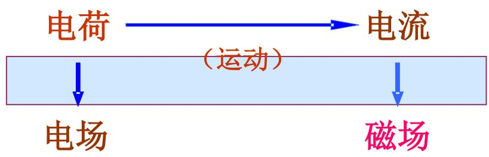

•本节讨论的内容：电荷模型、电流模型、电荷守恒定律

# 2.1电荷守恒定律

# 电荷与电荷密度

❖ 电荷是物质基本属性之一。

❖ 1897年英国科学家汤姆逊(J.J.Thomson)在实验中发现了电子。

1907－1913年间，美国科学家密立根(R.A.Miliken)通过油滴实验，精确测定电子电荷的量值为

$$
e = 1. 6 0 2 1 7 7 3 3 \times 1 0 ^ {- 1 9} \quad (\text {单 位 : C})
$$

确认了电荷量的量子化概念。换句话说，e 是最小的电荷量，而任何带电粒子所带电荷都是e 的整数倍。

❖ 宏观分析时，电荷常是数以亿计的电子电荷e的组合，故可不考虑其量子化的事实，而认为电荷量q可任意连续取值。

# 2.1电荷守恒定律

理想化实际带电系统的电荷分布形态分为四种形式：

点电荷、体分布电荷、面分布电荷、线分布电荷

# 电荷体密度

电荷连续分布于体积V内，用电荷体密度来描述其分布

$$
\rho (\vec {r}) = \lim _ {\Delta V \rightarrow 0} \frac {\Delta q (\vec {r})}{\Delta V} = \frac {\mathrm {d} q (\vec {r})}{\mathrm {d} V}
$$

单位： $\mathbf { C } / \mathbf { m } ^ { 3 }$ (库仑/米3 )

根据电荷密度的定义，如果已知某空间区域V中的电荷体密度，则区域V中的总电量q为

$$
q = \int_ {V} \rho (\vec {r}) \mathrm {d} V
$$

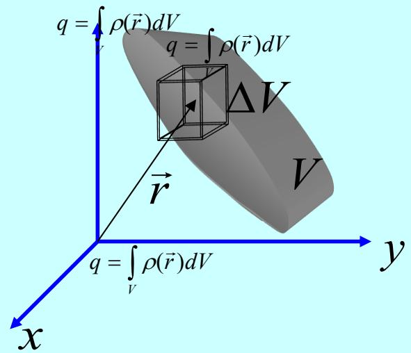

# 2.1电荷守恒定律

# 2 电荷面密度

若电荷分布在薄层上的情况，当仅考虑薄层外，距薄层的距离要比薄层的厚度大得多处的电场，而不分析和计算该薄层内的电场时，可将该薄层的厚度忽略，认为电荷是面分布。面分布的电荷可用电荷面密度表示。

$$
\rho_ {s} (\vec {r}) = \lim _ {\Delta S \to 0} \frac {\Delta q (\vec {r})}{\Delta S} = \frac {\mathrm {d} q (\vec {r})}{\mathrm {d} S}
$$

单位: $\mathbf { C } / \mathbf { m } ^ { 2 }$ (库仑/米2)

如果已知某空间曲面S上的电荷面密度，则该曲面上的总电量q 为

$$
q = \int_ {S} \rho_ {s} (\vec {r}) \mathrm {d} S
$$

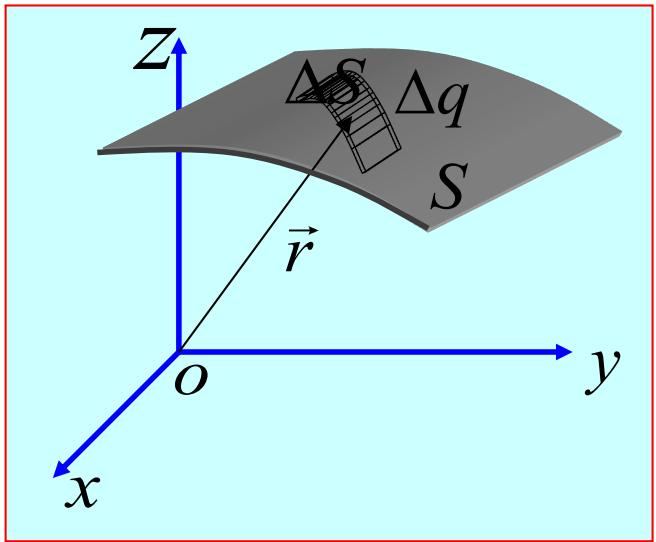

# 2.1电荷守恒定律

# 3. 电荷线密度

在电荷分布在细线上的情况，当仅考虑细线外，距细线的距离要比细线的直径大得多处的电场，而不分析和计算线内的电场时，可将线的直径忽略，认为电荷是线分布。

$$
\rho_ {l} (\vec {r}) = \lim _ {\Delta l \to 0} \frac {\Delta q (\vec {r})}{\Delta l} = \frac {\mathrm {d} q (\vec {r})}{\mathrm {d} l}
$$

单位: C/m (库仑/米)

如果已知某空间曲线上的电荷线密度，则该曲线上的总电量q 为

$$
q = \int_ {\mathcal {C}} \rho_ {I} (\vec {r}) \mathrm {d} I
$$

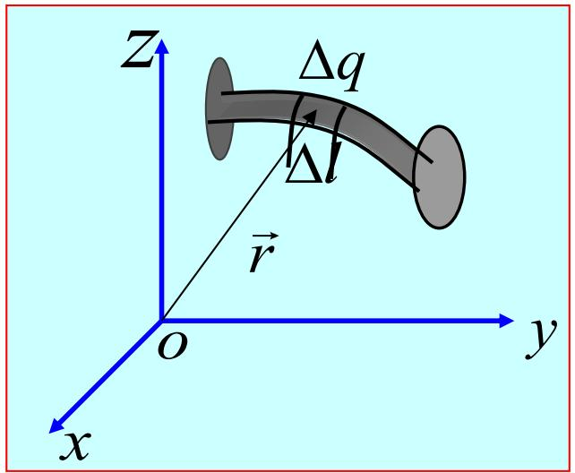

# 2.1电荷守恒定律

# 点电荷

对于总电量为 q 的电荷集中在很小区域 V 的情况，当不分析和计算该电荷所在的小区域中的电场，而仅需要分析和计算电场的区域又距离电荷区很远，即场点距源点的距离远大于电荷所在的源区的线度时，小体积 V 中的电荷可看作位于该区域中心、电量为 q 的点电荷。

点电荷的电荷密度表示

$$
\rho (\vec {r}) = q \delta (\vec {r} - \vec {r} ^ {\prime})
$$

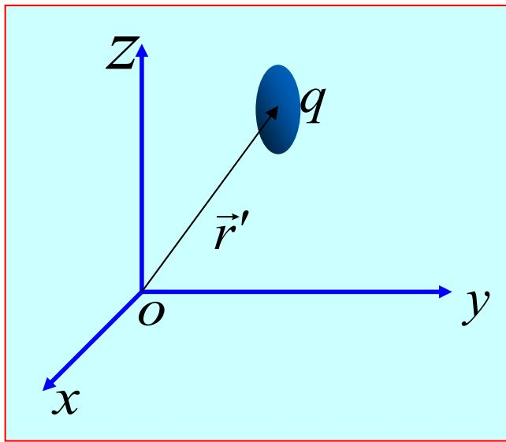

# 2.1电荷守恒定律

❖为表示点电荷的体密度，引入 $\delta$ 函数

$$
\begin{array}{l} \delta \left(\vec {r} - \vec {r} ^ {\prime}\right) = \left\{ \begin{array}{l l} 0 & \vec {r} \neq \vec {r} ^ {\prime} \\ \infty & \vec {r} = \vec {r} ^ {\prime} \end{array} \right. \\ \int_ {\tau} \delta \left(\vec {r} - \vec {r} ^ {\prime}\right) \mathrm {d} \tau = \left\{ \begin{array}{l l} 0 & \vec {r} \neq \vec {r} ^ {\prime} \\ 1 & \vec {r} = \vec {r} ^ {\prime} \end{array} \right. \\ \int_ {\tau} f (\vec {r}) \delta (\vec {r} - \vec {r} ^ {\prime}) d \tau = f (\vec {r} ^ {\prime}) \\ \end{array}
$$

于是位于 ${ \vec { r } } = { \vec { r } }$ '处的点电荷q 的体密度为 $q \delta \left( { \vec { r } } - { \vec { r } } ^ { \ : \prime } \right)$ 

# 2.1电荷守恒定律

# 电流与电流密度

电流：电荷的定向运动而形成，用i 表示，其大小定义为：单位时间内通过某一横截面S的电荷量，即

$$
i = \lim _ {\Delta t \rightarrow 0} \left(\Delta q / \Delta t\right) = \mathrm {d} q / \mathrm {d} t
$$

单位: A （安培）

电流方向: 正电荷的流动方向形成电流的条件：

存在可以自由移动的电荷

• 存在电场

说明：电流通常是时间的函数，不随时间变化的电流称为恒定电流，用 $I$ 表示。

# 2.1电荷守恒定律

一般情况下，在空间不同的点，电流的大小和方向往往是不同的。在电磁理论中，常用体电流、面电流和线电流来描述电流的分布状态。

# 体电流

电荷在某一体积内定向运动所形成的电流称为体电流，用电流密度矢量J 来描述。

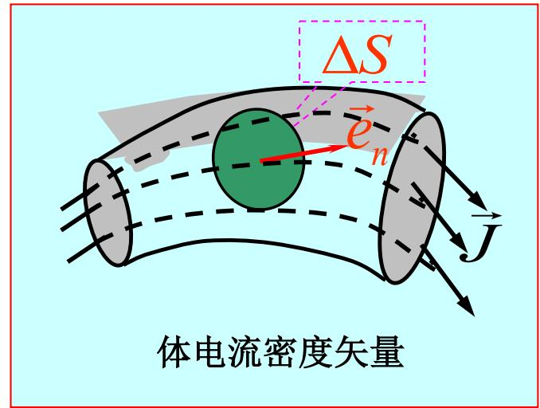

$$
\vec {J} = \vec {e} _ {n} \lim  _ {\Delta S \rightarrow 0} \frac {\Delta i}{\Delta S} = \vec {e} _ {n} \frac {\mathrm {d} i}{\mathrm {d} S}
$$

单位： $\mathbf { A } / \mathbf { m } ^ { 2 }$ 。

正电荷运动的方向

流过任意曲面S 的电流为

$$
I = \int_ {S} \vec {J} \cdot \mathrm {d} \vec {S}
$$

# 2.1电荷守恒定律

# 面电流

电荷在一个厚度可以忽略的薄层内定向运动所形成的电流称为面电流

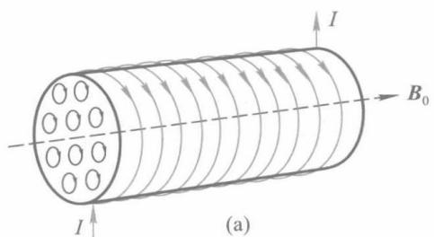

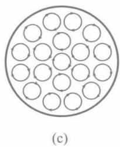

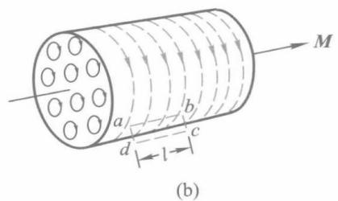

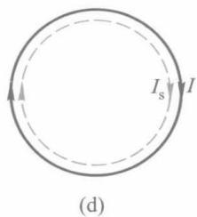

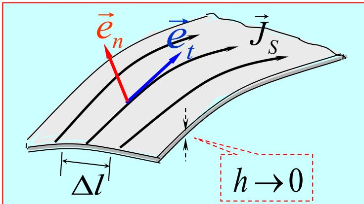

面电流密度矢量

# 2.1电荷守恒定律

# 面电流

电荷在一个厚度可以忽略的薄层内定向运动所形成的电流称为面电流， 用面电流密度矢量 ${ \vec { J } } _ { s }$ 来描述其分布

$$
\vec {J} _ {S} = \vec {e} _ {t} \lim  _ {\Delta l \rightarrow 0} \frac {\Delta i}{\Delta l} = \vec {e} _ {t} \frac {\mathrm {d} i}{\mathrm {d} l}
$$

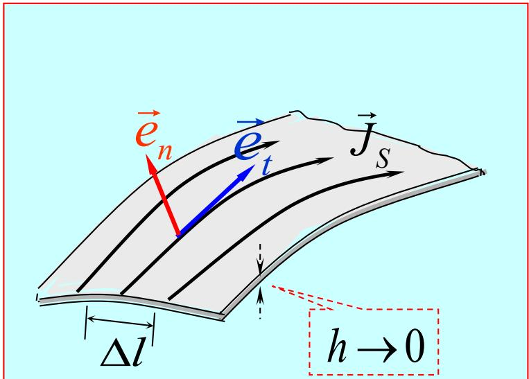

面电流密度矢量

单位：A/m。

正电荷运动的方向

通过薄导体层上任意有向曲线 的电流为

$$
i = \int_ {l} \vec {J} _ {S} \bullet (\vec {e} _ {n} \times \mathrm {d} \vec {l})
$$

# 面电流

通过薄导体层上任意有向曲线 的电流为

$$
i = \int_ {l} \vec {J} _ {S} \cdot (\vec {e} _ {n} \times \mathrm {d} \vec {l})
$$

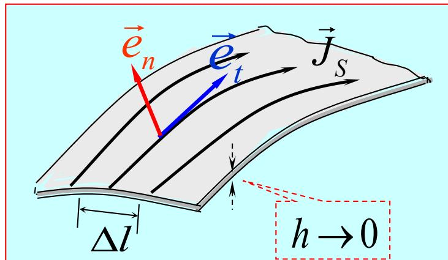

面电流密度矢量

第四版(2.1.13)式,第五版(2.1.17)式，第六版（2.1.18）式

$$
\Bigg {\downarrow} \hat {e} _ {t} = \hat {e} _ {n} \times \hat {e} _ {l}
$$

$i = \int _ { l } \vec { J } _ { S } \cdot \vec { e } _ { t } \mathrm { d } l$ 第五版(2.1.16)式，第六版（2.1.17）式

# 2.1电荷守恒定律

# 电荷守恒定律与电流连续性方程

电荷守恒定律:电荷既不能被创造，也不能被消灭，只能从物体的一部分转移到另一部分，或者从一个物体转移到另一个物体。电荷守恒定律是电磁现象中的基本定律之一。

电流连续性方程

积分形式 $\oint _ { S } { \vec { J } } \cdot \mathrm { d } { \vec { S } } = - { \frac { \mathrm { d } q } { \mathrm { d } t } } = - { \frac { \mathrm { d } } { \mathrm { d } t } } { \int _ { V } \rho \mathrm { d } V }$ 

# 电流的连续性方程推导细节讲解

流出闭合曲面 $\pmb { S }$ 的电流等于体积V 内单位时间所减少的电荷量。

$$
\oiint_ {S} \vec {J} \cdot \mathrm {d} \vec {S} = \sum I = - \frac {\mathrm {d} q}{\mathrm {d} t}
$$

$$
\iiint_ {V} \nabla \cdot \vec {J} \mathrm {d} V = - \frac {\mathrm {d}}{\mathrm {d} t} \iiint_ {V} \rho \mathrm {d} V = - \iiint_ {V} \frac {\partial \rho}{\partial t} \mathrm {d} V
$$

电流的连续性方程

$$
\iint_ {S} \vec {J} \cdot \mathrm {d} \vec {S} = - \frac {\mathrm {d} q}{\mathrm {d} t}
$$

$$
\nabla \cdot \vec {J} = - \frac {\partial \rho}{\partial t}
$$

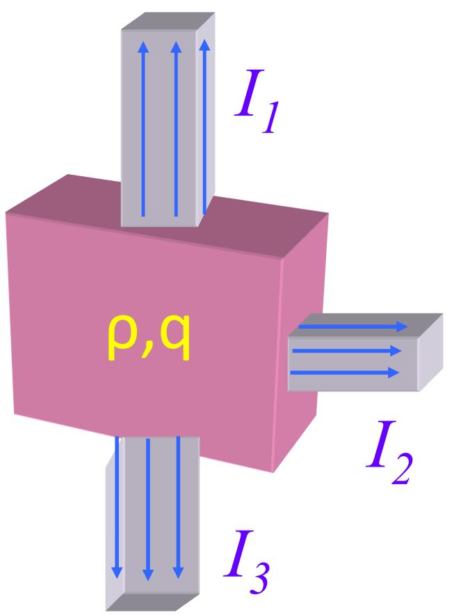

# 2.1电荷守恒定律

# 电荷守恒定律与电流连续性方程

# 电流连续性方程

积分形式 $\oint _ { S } { \vec { J } } \cdot \mathrm { d } { \vec { S } } = - { \frac { \mathrm { d } q } { \mathrm { d } t } } = - { \frac { \mathrm { d } } { \mathrm { d } t } } { \widehat { \int _ { V } } } \rho \mathrm { d } V$ 

流出闭曲面S的电流

等于体积V内单位时

间所减少的电荷量

微分形式 v.J=- $\nabla \bullet { \vec { J } } = - { \frac { \partial \rho } { \partial t } }$ 

# 恒定电流的连续性方程

$$
\frac {\partial \rho}{\partial t} = 0 \Longrightarrow \nabla \cdot \vec {J} = 0 \quad \oint_ {S} \vec {J} \cdot \mathrm {d} \vec {S} = 0
$$

恒定电流是无源场，电

流线是连续的闭合曲线，

既无起点也无终点

# 2.2 真空中静电场的因果规律

静电场：由静止电荷产生的电场

重要特征：对位于电场中的电荷有电场力作用

# 库仑定律 电场强度

1. 库仑（Coulomb）定律(1785年)

真空中静止点电荷 $\pmb q _ { 1 }$ 对 $\mathbf { \dot { q } } _ { 2 }$ 的作用力:

$$
\vec {F} _ {1 2} = \vec {e} _ {R} \frac {q _ {1} q _ {2}}{4 \pi \varepsilon_ {0} R _ {1 2} ^ {2}} = \frac {q _ {1} q _ {2} \vec {R} _ {1 2}}{4 \pi \varepsilon_ {0} R _ {1 2} ^ {3}}
$$

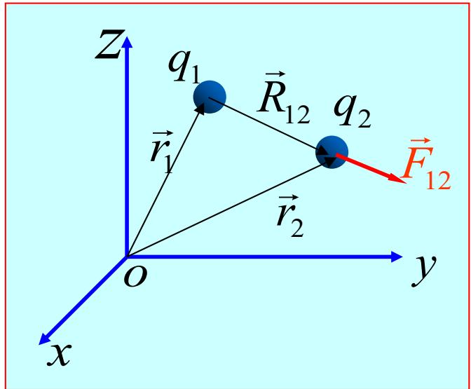

$\clubsuit$ 大小与两电荷的电荷量成正比，与两电荷距离的平方成反比；

❖ 方向沿 $\mathbf { { q } _ { 1 } }$ 和 $\pmb q _ { 2 }$ 连线方向，同性电荷相排斥，异性电荷相吸引；

❖ $\vec { F } _ { 2 1 } = - \vec { F } _ { 1 2 } \ ,$ = −F 满足牛顿第三定律吗？

$$
\varepsilon_ {0} \approx \frac {1}{3 6 \pi} \times 1 0 ^ {- 9} \approx 8. 8 5 \times 1 0 ^ {- 1 2} \mathrm {F / m}
$$

真空(或自由空间)的介电常数

❖ 电场力服从叠加原理

真空中的N个点电荷 $q _ { 1 } \quad q _ { 2 } \quad \cdots q _ { N }$ (分别位于 $\vec { r } _ { 1 } ^ { \prime } \vec { r } _ { 2 } ^ { \prime } \cdots \vec { r } _ { N } ^ { \prime } )$ 对点电荷 $q$ （位于 ）的作用力为r

$$
\vec {F} _ {q} = \sum_ {i = 1} ^ {N} \vec {F} _ {q _ {i} q} = \sum_ {i = 1} ^ {N} \frac {q q _ {i}}{4 \pi \varepsilon_ {0} R _ {i} ^ {3}} \vec {R} _ {i}
$$

$$
(\vec {R} _ {i} = \vec {r} - \vec {r} _ {i} ^ {\prime})
$$

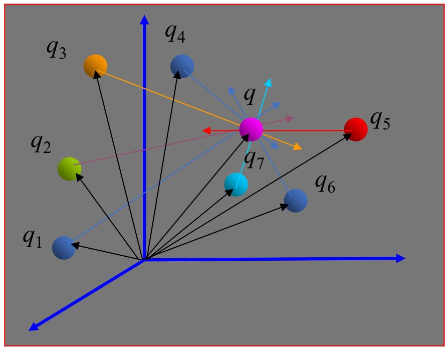

# 2. 电场强度

电场强度矢量: 描述电场分布的基本物理量

空间某点的电场强度定义为置于该点的单位点电荷（又称试验电荷）受到的作用力，即

$$
\vec {E} (\vec {r}) = \lim  _ {q _ {0} \rightarrow 0} \frac {\vec {F} (\vec {r})}{q _ {0}} q _ {0} — — \text {试 验 正 电 荷}
$$

根据上述定义， 真空中静止点电荷q 激发的电场为：

$$
\vec {E} (\vec {r}) = \frac {q \vec {R}}{4 \pi \varepsilon_ {0} R ^ {3}} (\vec {R} = \vec {r} - \vec {r} ^ {\prime})
$$

如果电荷是连续分布呢？ $q = \int _ { \stackrel { V } { V } } \rho ( { \vec { r } } ) d V$ 

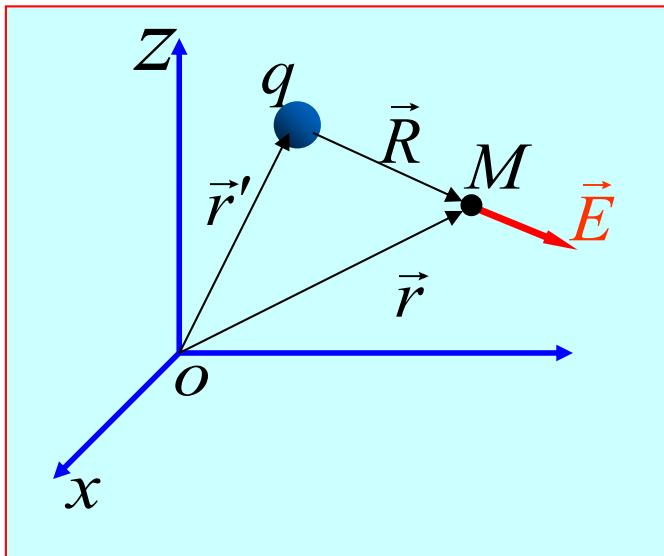

# 体密度为 $\rho ^ { ( \vec { r } ) }$ 的体分布电荷产生的电场强度

$$
\begin{array}{l} \vec {E} (\vec {r}) = \sum_ {i = 1} \frac {\rho (\vec {r} _ {i} ^ {\prime}) \Delta V _ {i} ^ {\prime} \vec {R} _ {i}}{4 \pi \varepsilon_ {0} R _ {i} ^ {3}} \\ = \frac {1}{4 \pi \varepsilon_ {0}} \int_ {V} \frac {\rho (\vec {r} ^ {\prime}) \vec {R}}{R ^ {3}} \mathrm {d} V ^ {\prime} \\ \end{array}
$$

# 小体积元中的电荷产生的电场

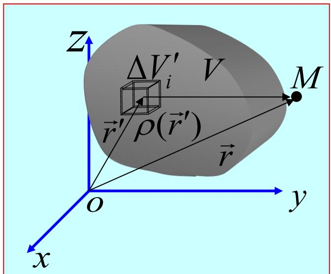

面密度为 $\rho _ { _ { S } } ( { \vec { r } } )$ 的面分布电荷的电场强度

$$
\vec {E} (\vec {r}) = \frac {1}{4 \pi \varepsilon_ {0}} \int_ {S} \frac {\rho_ {S} (\vec {r} ^ {\prime}) \vec {R}}{R ^ {3}} \mathrm {d} S ^ {\prime}
$$

线密度为 $\rho _ { _ l } ( \vec { r } )$ 的线分布电荷的电场强度

$$
\vec {E} (\vec {r}) = \frac {1}{4 \pi \varepsilon_ {0}} \int_ {C} \frac {\rho_ {l} (\vec {r} ^ {\prime}) \vec {R}}{R ^ {3}} \mathrm {d} l ^ {\prime}
$$

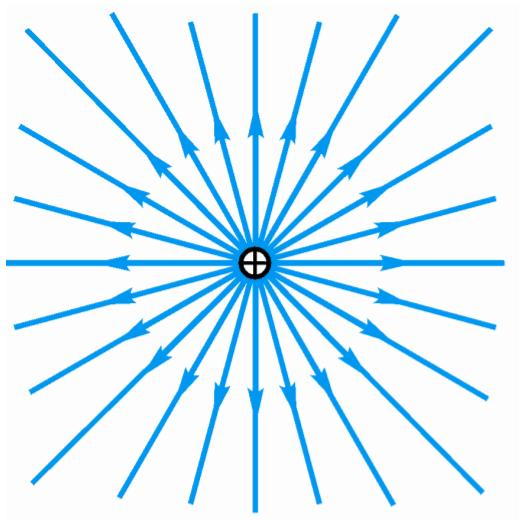

(a)正电荷

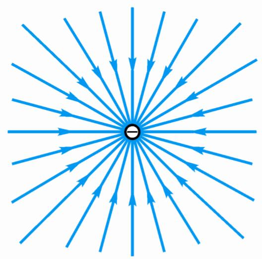

(b）负电荷

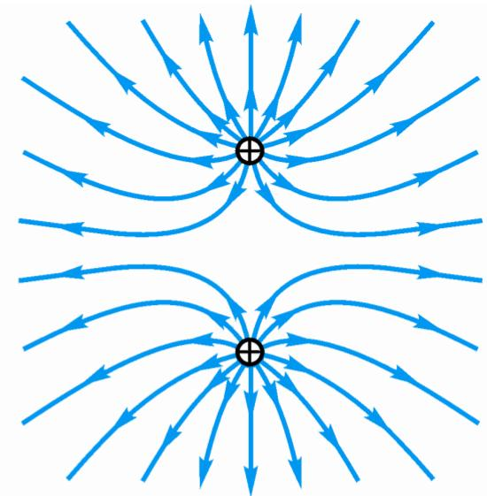

(c）两个等值正电荷

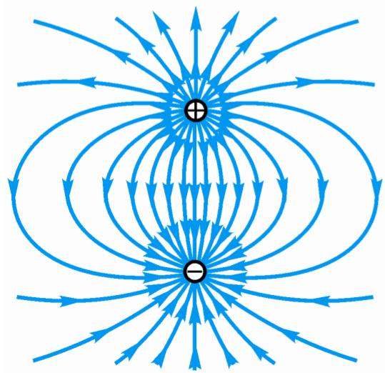

(d）两个等值异号电荷

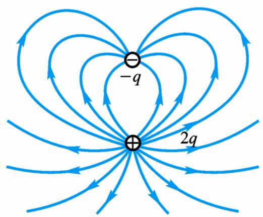

(e）电荷 $+ 2 q$ 与电荷 $- q$

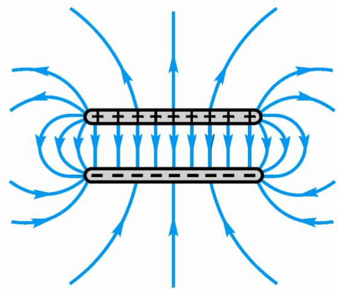

(f)正负带电板

# 3. 几种典型电荷分布的电场强度

• 均匀带电直线段的电场强度：

$$
\left\{ \begin{array}{l} E _ {\rho} = \frac {\rho_ {l}}{4 \pi \varepsilon_ {0} \rho} (\cos \theta_ {1} - \cos \theta_ {2}) \\ E _ {z} = \frac {\rho_ {l}}{4 \pi \varepsilon_ {0} \rho} (\sin \theta_ {2} - \sin \theta_ {1}) \end{array} \right.
$$

（有限长）

$$
E _ {\rho} = \frac {\rho_ {l}}{2 \pi \varepsilon_ {0} \rho} \quad (\text {无 限 长})
$$

• 均匀带电圆环轴线上的电场强度：

$$
E _ {z} (0, 0, z) = \frac {a \rho_ {l} z}{2 \varepsilon_ {0} \left(a ^ {2} + z ^ {2}\right) ^ {3 / 2}}
$$

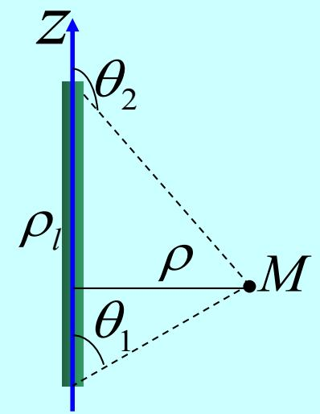

均匀带电直线段

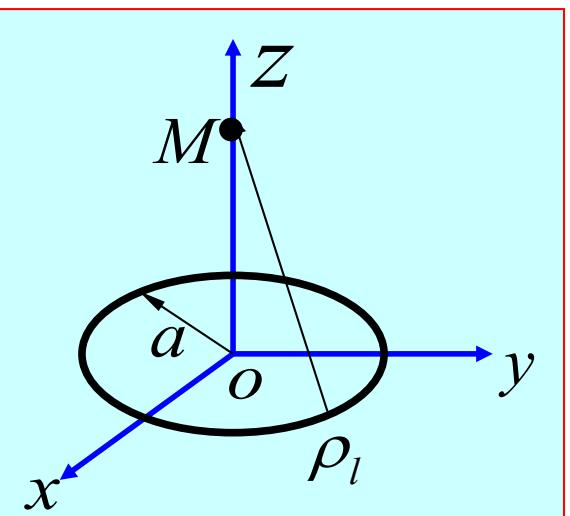

均匀带电圆环

所以，由对称性 $E _ { y } = E _ { z } = 0$ 

$$
\begin{array}{l} E = E _ {x} = \int d E \cdot \cos \theta \\ = \int \frac {1}{4 \pi \varepsilon_ {0} r ^ {2}} d q \cos \theta \\ = \frac {\cos \theta}{4 \pi \varepsilon_ {0} r ^ {2}} \int d q \\ = \frac {q \cos \theta}{4 \pi \varepsilon_ {0} r ^ {2}} = \frac {q x / r}{4 \pi \varepsilon_ {0} r ^ {2}} \\ = \frac {q x}{4 \pi \varepsilon_ {0} \left(R ^ {2} + x ^ {2}\right) ^ {3 / 2}} \\ \end{array}
$$

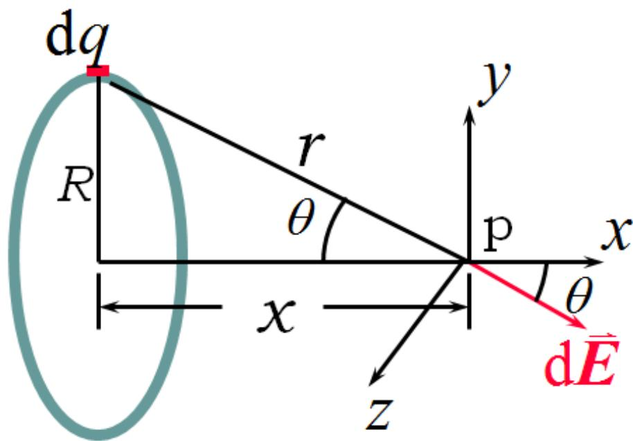

电偶极子的电场强度：

❖ 电偶极子是由相距很近、带等值异号的两个点电荷组成的电荷系统，其远区电场强度为

$$
\vec {E} (\vec {r}) = \frac {1}{4 \pi \varepsilon_ {0}} \left[ \frac {3 (\vec {p} \cdot \vec {r}) \vec {r}}{r ^ {5}} - \frac {\vec {p}}{r ^ {3}} \right] = \frac {P}{4 \pi \varepsilon_ {0} r ^ {3}} \left(\vec {e} _ {r} 2 \cos \theta + \vec {e} _ {\theta} \sin \theta\right)
$$

• ——电偶极矩

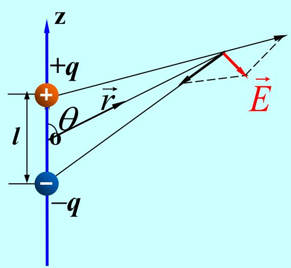

电偶极子

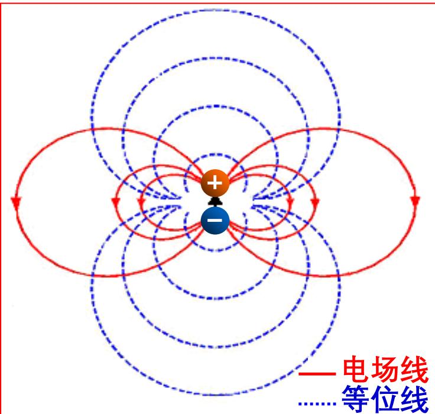

电偶极子的场图

例2.2.1 计算电偶极子的电场强度。

解：电偶极子是相距很小距离 $^ d$ 的两个等值异号的点电荷组成的电荷系统，如图2.2.3所示。采用球坐标系，使电偶极子的中心与坐标系的原点O重合，并使电偶极子轴与 $\mathscr { z }$ 轴重合。场点 $P ( r , \theta , \phi )$ 的电场强度 $\pmb { \cal E }$ 就是 $+ \ q$ 产生

的电场强度 $\pmb { { \cal E } } _ { + }$ 和- $q$ 产生的电场强度E_的矢量和。

在球坐标系中,场点 $P \left( r , \theta , \phi \right)$ 的位置矢量为 $\pmb { r } = \pmb { e } _ { r } { \pmb { r } }$ ,两个点电荷的位置矢量分别为 $r _ { \mathrm { ~ + ~ } } ^ { \prime } = \frac { e _ { z } d } { 2 }$ ed 和 $r ^ { \prime } _ { \mathrm { ~ - ~ } } = - \frac { { \bf e } _ { z } d } { 2 }$ 2 □ 根据式(2.2.6)，得

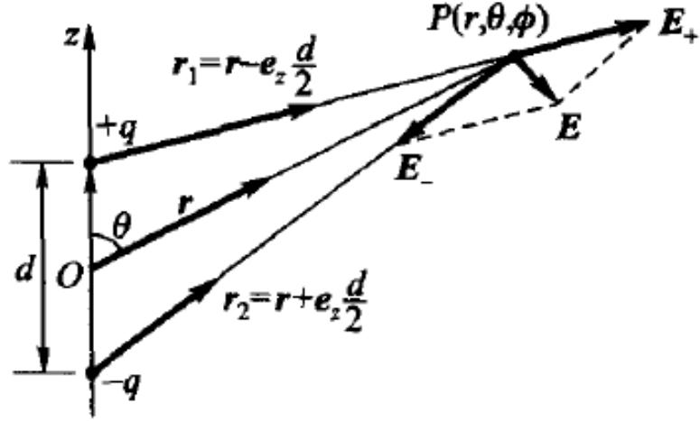

图2.2.3电偶极子

$$
\boldsymbol {E} (\boldsymbol {r}) = \frac {q}{4 \pi \varepsilon_ {0}} \left(\frac {\boldsymbol {r} _ {1}}{r _ {1} ^ {3}} - \frac {\boldsymbol {r} _ {2}}{r _ {2} ^ {3}}\right) = \frac {q}{4 \pi \varepsilon_ {0}} \left(\frac {\boldsymbol {r} - \boldsymbol {e} _ {z} d / 2}{| \boldsymbol {r} - \boldsymbol {e} _ {z} d / 2 | ^ {3}} - \frac {\boldsymbol {r} + \boldsymbol {e} _ {z} d / 2}{| \boldsymbol {r} + \boldsymbol {e} _ {z} d / 2 | ^ {3}}\right)
$$

在电磁理论中，常常感兴趣的是远离电偶极子区域内（即 $r \gg d$ )的场。此时

$$
\begin{array}{l} \left| \boldsymbol {r} - \boldsymbol {e} _ {z} \frac {d}{2} \right| ^ {- 3} = \left[ \left(\boldsymbol {r} - \boldsymbol {e} _ {z} \frac {d}{2}\right) \cdot \left(\boldsymbol {r} - \boldsymbol {e} _ {z} \frac {d}{2}\right) \right] ^ {- 3 / 2} \\ = \left(r ^ {2} - r \cdot e _ {z} d + \frac {d ^ {2}}{4}\right) ^ {- 3 / 2} \approx r ^ {- 3} \left(1 - \frac {r \cdot e _ {z} d}{r ^ {2}}\right) ^ {- 3 / 2} \\ \end{array}
$$

将上式中的 $\left( 1 - \frac { r \cdot e _ { z } d \big ) } { r ^ { 2 } } \right)$ -3应用二项式公式展开，并忽略所有包含 $\mathbf { \Delta } d { \mathbf { \nabla } } / r$ 的二次方和高次方项，则有

$$
\left| r - e _ {z} \frac {d}{2} \right| ^ {- 3} \approx r ^ {- 3} \left(1 + \frac {3}{2} \frac {\boldsymbol {r} \cdot \boldsymbol {e} _ {z} d}{r ^ {2}}\right)
$$

同样

$$
\left| r + e _ {z} \frac {d}{2} \right| ^ {- 3} \approx r ^ {- 3} \left(1 - \frac {3}{2} \frac {\boldsymbol {r} \cdot \boldsymbol {e} _ {z} d}{r ^ {2}}\right)
$$

这样，当 $r \gg d$ 时，点 $P ( \pmb { r } )$ 的电场强度近似为

$$
\boldsymbol {E} (\boldsymbol {r}) \approx \frac {q}{4 \pi \varepsilon_ {0} r ^ {3}} \left(3 \frac {\boldsymbol {r} \cdot \boldsymbol {e} _ {z} d}{r ^ {2}} \boldsymbol {r} - \boldsymbol {e} _ {z} d\right)
$$

引人电偶极矩 $\pmb { P } = e _ { z } P = e _ { z } q d$ ,则上式变为

$$
\boldsymbol {E} (\boldsymbol {r}) \approx \frac {1}{4 \pi \varepsilon_ {0} r ^ {3}} \left(3 \frac {\boldsymbol {r} \cdot \boldsymbol {P}}{r ^ {2}} \boldsymbol {r} - \boldsymbol {P}\right)
$$

在球坐标系中

$$
\boldsymbol {P} = \boldsymbol {e} _ {\tau} P = P (\boldsymbol {e} _ {r} \cos \theta - \boldsymbol {e} _ {\theta} \sin \theta)
$$

则

$$
\boldsymbol {r} \cdot \boldsymbol {P} = e _ {r} r \cdot P \left(e _ {r} \cos \theta - e _ {\theta} \sin \theta\right) = r P \cos \theta
$$

故

$$
\boldsymbol {E} (\boldsymbol {r}) \approx \frac {\boldsymbol {P}}{4 \pi \epsilon_ {0} r ^ {3}} \left(\boldsymbol {e} _ {r} 2 \cos \theta + \boldsymbol {e} _ {\theta} \sin \theta\right)
$$

在分析电介质的极化时，电偶极子是-个重要概念。

例2.2.2 计算均匀带电的环形薄圆盘轴线上任意点的电场强度。

解：如图所示，环形薄圆盘的内半径为a 、外半径为b，电荷

面密度为 $\rho _ { s }$ 。在环形薄圆盘上取面积元$\mathrm { d } S ^ { \prime } = \rho ^ { \prime } \mathrm { d } \rho ^ { \prime } \mathrm { d } \phi ^ { \prime }$ ，其位置矢量为 $\vec { r } ^ { \prime } = \vec { e } _ { \rho } \rho ^ { \prime }$ 它所带的电量为 $\mathrm { d } q = \rho _ { s } \mathrm { d } S ^ { \prime } = \rho _ { s } \rho ^ { \prime } \mathrm { d } \rho ^ { \prime } \mathrm { d } \phi ^ { \prime }$ 而薄圆盘轴线上的场点 $P ( 0 , 0 , z )$ 的位置矢量为 $\vec { r } = \vec { e } _ { z } z$ ，因此有

$$
\vec {E} (\vec {r}) = \frac {\rho_ {S}}{4 \pi \varepsilon_ {0}} \int_ {a} ^ {b} \int_ {0} ^ {2 \pi} \frac {\vec {e} _ {z} z - \vec {e} _ {\rho} \rho^ {\prime}}{\left(z ^ {2} + \rho^ {\prime 2}\right) ^ {3 / 2}} \rho^ {\prime} \mathrm {d} \rho^ {\prime} \mathrm {d} \phi^ {\prime}
$$

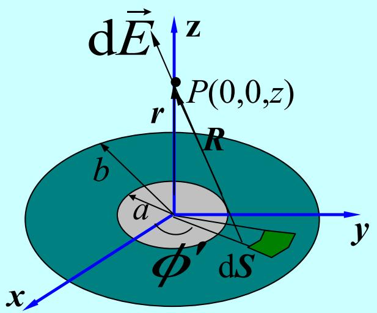

均匀带电的环形薄圆盘

由于 $\int _ { 0 } ^ { 2 \pi } \vec { e } _ { \rho } \mathrm { d } \phi ^ { \prime } = \int _ { 0 } ^ { 2 \pi } ( \vec { e } _ { x } \cos \phi ^ { \prime } + \vec { e } _ { y } \sin \phi ^ { \prime } ) \mathrm { d } \phi ^ { \prime } = 0$ 

故 E()=e $\vec { E } ( \vec { r } ) = \vec { e } _ { z } \frac { \rho _ { S } z } { 2 \varepsilon _ { 0 } } \int _ { a } ^ { b } \frac { \rho ^ { \prime } \mathrm { d } \rho ^ { \prime } } { \left( z ^ { 2 } + \rho ^ { \prime 2 } \right) ^ { 3 / 2 } } = \vec { e } _ { z } \frac { \rho _ { S } z } { 2 \varepsilon _ { 0 } } \Bigg [ \frac { 1 } { ( z ^ { 2 } + a ^ { 2 } ) ^ { 1 / 2 } } -$ =e 12ε0 （z² +b²）/2

# 静电场的散度与旋度(板书推导)

# 静电场散度与高斯定理

静电场的散度（微分形式） 静电场的高斯定理（积分形式）

$$
\begin{array}{c} \hline \nabla \bullet \vec {E} (\vec {r}) = \frac {\rho (\vec {r})}{\varepsilon_ {0}} \\ \hline \end{array}
$$

$$
\oint_ {S} \vec {E} (\vec {r}) \cdot \mathrm {d} \vec {S} = \frac {1}{\varepsilon_ {0}} \int_ {V} \rho (\vec {r}) \mathrm {d} V
$$

高斯定理表明：静电场是有源场，电场线起始于正电荷，终止于负电荷。

# 2. 静电场旋度与环路定理

静电场的旋度（微分形式） 静电场的环路定理（积分形式）

$$
\nabla \times \vec {E} (\vec {r}) = 0
$$

$$
\oint_ {C} \vec {E} (\vec {r}) \cdot \mathrm {d} \vec {l} = 0
$$

环路定理表明：静电场是无旋场，是保守场，电场力做功与路径无关。

# 1．静电场的散度和高斯定理

高斯定理是静电场的基本定理，它是平方反比定律(库仑定律)的必然结果。将式(2.2.7)写为

$$
\boldsymbol {E} (\boldsymbol {r}) = \frac {1}{4 \pi \varepsilon_ {0}} \int_ {V} \frac {\boldsymbol {R}}{R ^ {3}} \rho \left(\boldsymbol {r} ^ {\prime}\right) \mathrm {d} V ^ {\prime}
$$

式中

$$
\boldsymbol {R} = \boldsymbol {r} - \boldsymbol {r} ^ {\prime}, \quad R = | \boldsymbol {r} - \boldsymbol {r} ^ {\prime} |
$$

$\nabla \left( { \frac { 1 } { R } } \right) = - { \frac { R } { R ^ { 3 } } }$ 一 ，可将 $\mathbf { { \delta } } \mathbf { { \vec { { \varepsilon } } } } ( \boldsymbol { r } )$ 

$$
\boldsymbol {E} (\boldsymbol {r}) = - \frac {1}{4 \pi \varepsilon_ {0}} \int_ {V} \rho \left(\boldsymbol {r} ^ {\prime}\right) \nabla \left(\frac {1}{R}\right) d V ^ {\prime} \tag {2.2.10}
$$

对式(2.2.10)两边取散度,得

$$
\nabla \cdot \boldsymbol {E} (\boldsymbol {r}) = - \frac {1}{4 \pi \varepsilon_ {0}} \int_ {V} \rho (\boldsymbol {r} ^ {\prime}) \nabla^ {2} \left(\frac {1}{R}\right) d V ^ {\prime}
$$

$$
\nabla \cdot \boldsymbol {E} (\boldsymbol {r}) = - \frac {1}{4 \pi \varepsilon_ {0}} \int_ {V} \rho (\boldsymbol {r} ^ {\prime}) \nabla^ {2} \left(\frac {1}{R}\right) d V ^ {\prime}
$$

利用关系式 $\nabla ^ { 2 } \left( \frac { 1 } { R } \right) = - 4 \pi \delta ( \pmb { r } - \pmb { r } ^ { \prime } )$ ，上式变为

$$
\nabla \cdot \boldsymbol {E} (\boldsymbol {r}) = \frac {1}{\varepsilon_ {0}} \int_ {V} \rho \left(\boldsymbol {r} ^ {\prime}\right) \delta \left(\boldsymbol {r} - \boldsymbol {r} ^ {\prime}\right) d V ^ {\prime} \tag {2.2.11}
$$

再利用 $\pmb { \delta }$ 函数的挑选性,有

$\int _ { \mathbf { \nabla } V } \rho ( \boldsymbol { r } ^ { \prime } ) \delta ( \boldsymbol { r } - \boldsymbol { r } ^ { \prime } ) \mathrm { d } V ^ { \prime } = \left\{ \begin{array} { l l } { 0 , } & { } \\ { \rho ( \boldsymbol { r } ) , } & { } \end{array} \right.$ 积分区域不包含 $\boldsymbol { r } ^ { \prime } = \boldsymbol { r }$ 的点积分区域包含 $\boldsymbol { r } ^ { \prime } = \boldsymbol { r }$ 的点

则由式(2.2.11)得

$\nabla \cdot E ( r ) = \sqrt [ ] { \frac { 0 } { \epsilon _ { 0 } } \rho ( r ) } ,$ r位于区域 $V$ 外$\pmb { r }$ 位于区域V内

因已假设电荷分布在区域 $V$ 内,故可将上式写为

$$
\nabla \cdot \boldsymbol {E} = \frac {\rho}{\varepsilon_ {0}} \tag {2.2.12}
$$

对 $\mathbf { \nabla } \nabla \cdot \mathbf { E } = { \frac { \rho } { \varepsilon _ { 0 } } }$ 的两边取体积分,则有

$$
\int_ {V} \boldsymbol {\nabla} \cdot \boldsymbol {E} \mathrm {d} V = \int_ {V} \frac {\rho}{\varepsilon_ {0}} \mathrm {d} V
$$

$\int _ { V } { \textbf { \nabla } } \cdot { \boldsymbol { \mathbf { \mathit { E } } } } \mathrm { d } V = \oint _ { S } { \boldsymbol { \mathbf { \mathit { E } } } } \cdot \mathrm { d } { \boldsymbol { \mathbf { \mathit { S } } } }$ 

$$
\oint_ {S} \boldsymbol {E} \cdot \mathrm {d} \boldsymbol {S} = \frac {1}{\varepsilon_ {0}} \int_ {V} \rho \mathrm {d} V \tag {2.2.13}
$$

这就是高斯定理的积分形式，它表明电场强度矢量穿过闭合曲面S的通量等于该闭合面所包围的总电荷与 ${ \mathfrak { E } } _ { 0 }$ 之比。

如果电荷分布有一定的对称性，则可利用高斯定理的积分形式很方便地计算电场强度。

利用 $\nabla \left( { \frac { 1 } { R } } \right) = - { \frac { R } { R ^ { 3 } } }$ 可将 $\mathbf { { \delta } } \mathbf { { \vec { { \varepsilon } } } } ^ { E \left( r \right) }$ 

$$
\boldsymbol {E} (\boldsymbol {r}) = - \frac {1}{4 \pi \varepsilon_ {0}} \int_ {V} \rho \left(\boldsymbol {r} ^ {\prime}\right) \nabla \left(\frac {1}{R}\right) \mathrm {d} V ^ {\prime} \tag {2.2.10}
$$

# 2．静电场的旋度

在式(2.2.10)中,微分算符 $\mathbf { v }$ 是对场点坐标 $\pmb { r }$ 求导，与源点坐标 $\pmb { r } ^ { \prime }$ 无关，故可将算符V从积分号中移出，即

$$
\boldsymbol {E} (\boldsymbol {r}) = - \nabla \left[ \frac {1}{4 \pi \varepsilon_ {0}} \int_ {V} \frac {\rho \left(\boldsymbol {r} ^ {\prime}\right)}{R} \mathrm {d} V ^ {\prime} \right]
$$

对上式两边取旋度,即

$$
\nabla \times \boldsymbol {E} (\boldsymbol {r}) = - \nabla \times \nabla \left[ \frac {1}{4 \pi \varepsilon_ {0}} \int_ {\dot {V}} \frac {\rho \left(\boldsymbol {r} ^ {\prime}\right)}{R} d V ^ {\prime} \right]
$$

上式右边括号内是一个连续标量函数，而任何一个标量函数的梯度再求旋度时恒等于0,故上式右边恒为0,则得

$$
\boldsymbol {\nabla} \times \boldsymbol {E} = 0 \tag {2.2.14}
$$

此结果表明静电场是无旋场。

$$
\boldsymbol {\nabla} \times \boldsymbol {E} = \mathbf {0} \tag {2.2.14}
$$

此结果表明静电场是无旋场。

将式(2.2.14)对任意曲面S求积分，并利用斯托克斯定理 $\int _ { S } { \bf { v } } \times { \bf { { E } } } \cdot \mathrm { d } { \bf { { S } } } =$ $\oint _ { C } \mathbf { \nabla } \mathbf { E } \cdot \mathbf { d } { \boldsymbol { l } }$ ，得

$$
\oint_ {C} \boldsymbol {E} \cdot \mathrm {d} \boldsymbol {l} = 0 \tag {2.2.15}
$$

上式表明,在静电场 $\mathbf { E }$ 中，沿任意闭合路径C的积分恒等于0。其物理含义是将单位正电荷沿静电场中的任一个闭合路径移动一周，电场力不做功。

$\nabla ^ { 2 } \left( { \frac { 1 } { r } } \right)$ $\pmb { \nabla } ^ { 2 } \left( \frac { 1 } { R } \right)$ $\delta$ 

$$
\left. \begin{array}{l} \nabla^ {2} \left(\frac {1}{r}\right) = - 4 \pi \delta (r) \\ \nabla^ {2} \left(\frac {1}{R}\right) = - 4 \pi \delta (r - r ^ {\prime}) \end{array} \right\}
$$

$\cdot R { = } \vert r { - } r ^ { \prime } \vert$ 

$\pmb { \nabla } ^ { 2 } \left( \frac { 1 } { r } \right) = - 4 \pi \delta ( r )$ 

证明利用散度定理，对等式左侧积分为

$$
\begin{array}{l} \int_ {V} \nabla^ {2} \left(\frac {1}{r}\right) \mathrm {d} V = \int_ {V} \nabla \cdot \nabla \left(\frac {1}{r}\right) \mathrm {d} V = \oint_ {S} \nabla \left(\frac {1}{r}\right) \mathrm {d} S \\ = - \oint_ {S} \frac {e _ {r}}{r ^ {2}} d S = - \oint_ {S} \frac {d S \cos \theta}{r ^ {2}} = - \oint_ {S} \frac {d S ^ {\prime}}{r ^ {2}} = - \oint_ {S} d \Omega = - 4 \pi \\ \end{array}
$$

其中，S为包围积分区域 $V$ 的闭合曲面。d2为 $\mathrm { d } S ^ { \prime }$ 所张的立体角。而等式右侧的积

$$
\int_ {V} - 4 \pi \delta (r) \mathrm {d} V = - 4 \pi
$$

由于积分是对任意体积区域进行的，故有

$$
\nabla^ {2} \left(\frac {1}{r}\right) = - 4 \pi \delta (r)
$$

故原式得证

Fieldand Wave Electromagnetics,Second Edition 

# 电磁场与电磁波

（第2版）

张洪欣沈远茂韩宇南编著

# 3. 利用高斯定理计算电场强度

当电场分布具有一定对称性的情况下，可以利用高斯定理计算电场强度。

❖具有以下几种对称性的场可用高斯定理求解：

❖ 球对称分布：包括均匀带电的球面，球体和多层同心球壳等。

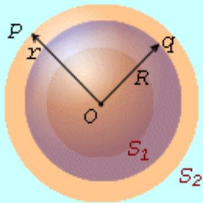

带电球壳

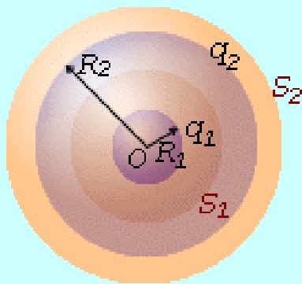

多层同心球壳

均匀带电球体

• 轴对称分布：如无限长均匀带电的直线，圆柱面，圆柱壳等。

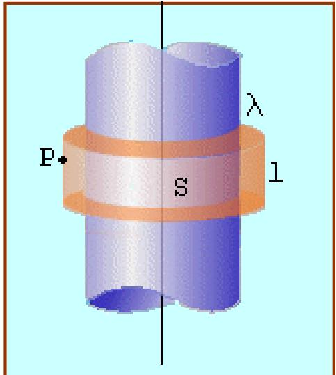

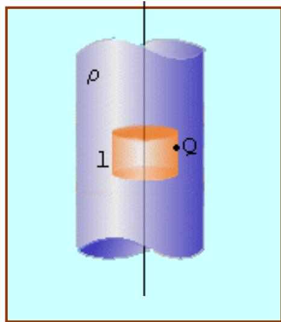

无限大平面电荷：如无限大的均匀带电平面、平板等。

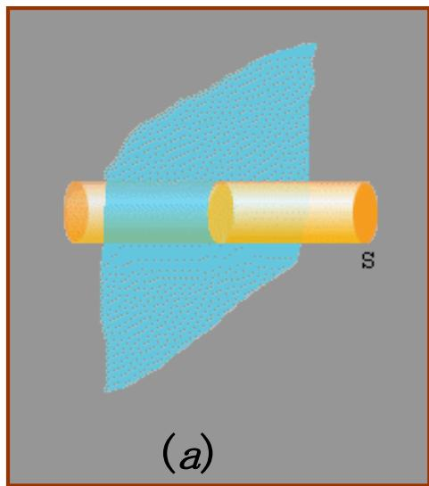

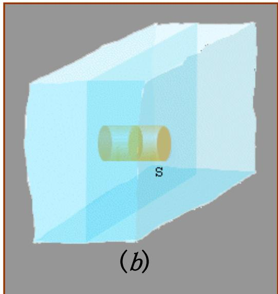

例 求真空中均匀带电球体的场强分布。已知球体半径为a，电荷密度为 0 。

解： （1） 球外某点的场强

$$
\begin{array}{l} \oint_ {S} \vec {E} \cdot \mathrm {d} \vec {S} = \frac {q}{\varepsilon_ {0}} = \frac {1}{\varepsilon_ {0}} \frac {4}{3} \pi a ^ {3} \rho_ {0} \\ \Longrightarrow E = \frac {\rho_ {0} a ^ {3}}{3 \varepsilon_ {0} r ^ {2}} (r \geq a) \\ \end{array}
$$

（2） 求球体内一点的场强

$$
\oint_ {S} \vec {E} \cdot \mathrm {d} \vec {S} = \frac {1}{\varepsilon} \int_ {V} \rho_ {0} \mathrm {d} V
$$

$$
\begin{array}{l} \Longrightarrow 4 \pi r ^ {2} E = \frac {1}{\varepsilon_ {o}} \cdot \frac {q}{4 \pi a ^ {3} / 3} \cdot \frac {4}{3} \pi r ^ {3} \\ \Longrightarrow E = \frac {\rho_ {0} r}{3 \varepsilon_ {o}} \quad (r <   a) \\ \end{array}
$$

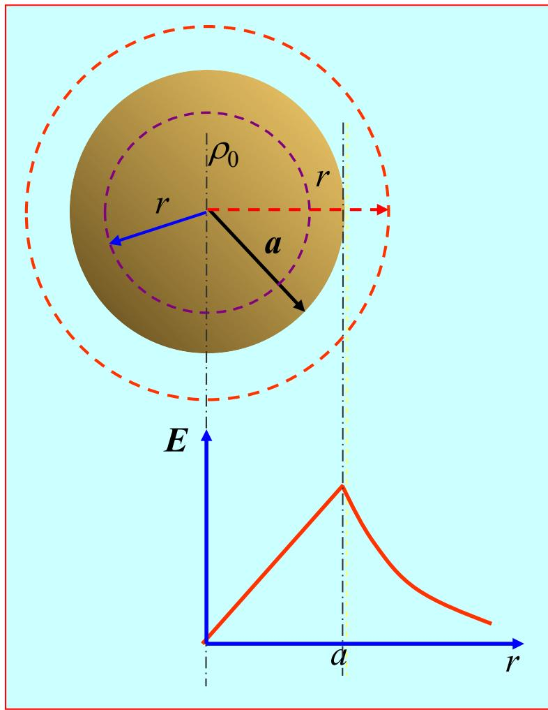

# 2.3 真空中恒定磁场的因果规律

磁感应强度 $\vec { B }$ 

电流在其周围空间中产生磁场，描述磁场分布的基本物理量是磁感应强度 $\vec { B }$ ，单位为T（特斯拉） 

磁场的重要特征是对场中的电流磁场力作用，载流回路 $C _ { 1 }$ 对载流回路 $C _ { 2 }$ 的作用力是回路 $C _ { 1 }$ 中的电流 $I _ { 1 }$ 产生的磁场对回路 $C _ { 2 }$ 中的电流 $I _ { 2 }$ 的作用力。

根据安培力定律， 有

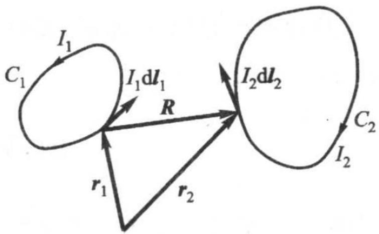

$$
\vec {F} _ {1 2} = \oint_ {C _ {2}} I _ {2} \mathrm {d} \vec {l} _ {2} \times \left(\frac {\mu_ {0}}{4 \pi} \oint_ {C _ {1}} \frac {I _ {1} \mathrm {d} \vec {l} _ {1} \times \vec {R} _ {1 2}}{R _ {1 2} ^ {3}}\right) = \oint_ {C _ {2}} I _ {2} \mathrm {d} \vec {l} _ {2} \times \vec {B} _ {1} (\vec {r} _ {2})
$$

其中

$$
\vec {B} _ {1} (\vec {r} _ {2}) = \frac {\mu_ {0}}{4 \pi} \oint_ {C _ {1}} \frac {\vec {I} _ {1} \mathrm {d} \vec {l} _ {1} \times \vec {R} _ {1 2}}{R _ {1 2} ^ {3}}
$$

电流I1在电流元 $I _ { 2 } \vec { \mathrm { d } l _ { 2 } }$ 

处产生的磁感应强度

任意电流回路C产生的磁场感应强度

$$
\vec {B} (\vec {r}) = \frac {\mu_ {0}}{4 \pi} \oint_ {C} \frac {I \mathrm {d} \vec {l} ^ {\prime} \times (\vec {r} - \vec {r} ^ {\prime})}{| \vec {r} - \vec {r} ^ {\prime} | ^ {3}} = \frac {\mu_ {0}}{4 \pi} \oint_ {C} \frac {I \mathrm {d} \vec {l} ^ {\prime} \times \vec {R}}{R ^ {3}}
$$

电流元 产生的磁场感应强度

$$
\mathrm {d} \vec {B} (\vec {r}) = \frac {\mu_ {0}}{4 \pi} \frac {I \mathrm {d} \vec {l} ^ {\prime} \times (\vec {r} - \vec {r} ^ {\prime})}{| \vec {r} - \vec {r} ^ {\prime} | ^ {3}}
$$

体电流产生的磁场感应强度

$$
\vec {B} (\vec {r}) = \frac {\mu_ {0}}{4 \pi} \int_ {V} \frac {\vec {J} (\vec {r} ^ {\prime}) \times \vec {R}}{R ^ {3}} \mathrm {d} V ^ {\prime}
$$

面电流产生的磁场感应强度

$$
\vec {B} (\vec {r}) = \frac {\mu_ {0}}{4 \pi} \int_ {S} \frac {\vec {J} _ {\mathrm {S}} (\vec {r} ^ {\prime}) \times \vec {R}}{R ^ {3}} \mathrm {d} S ^ {\prime}
$$

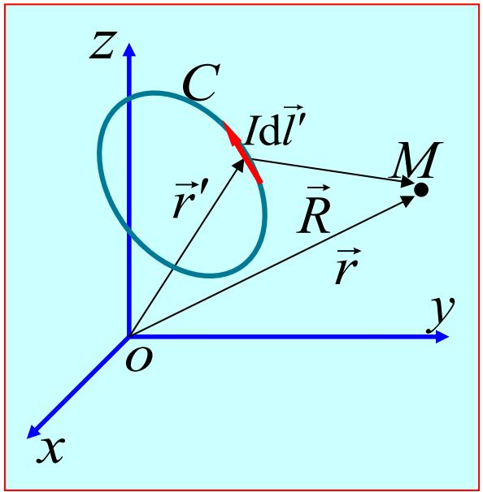

# 几种典型电流分布的磁感应强度

载流直线段的磁感应强度：

$$
\vec {B} = \vec {e} _ {\phi} \frac {\mu_ {0} I}{4 \pi \rho} \left(\cos \theta_ {1} - \cos \theta_ {2}\right) \cdot \quad (\text {有 限 长})
$$

$$
\vec {B} = \vec {e} _ {\phi} \frac {\mu_ {0} I}{2 \pi \rho} \quad \cdot \quad (\text {无 限 长})
$$

载流圆环轴线上的磁感应强度：

$$
\vec {B} (0, 0, z) = \vec {e} _ {z} \frac {\mu_ {0} I a ^ {2}}{2 (a ^ {2} + z ^ {2}) ^ {3 / 2}}
$$

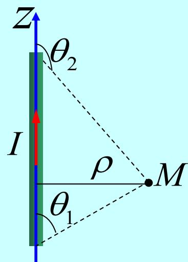

载流直线段

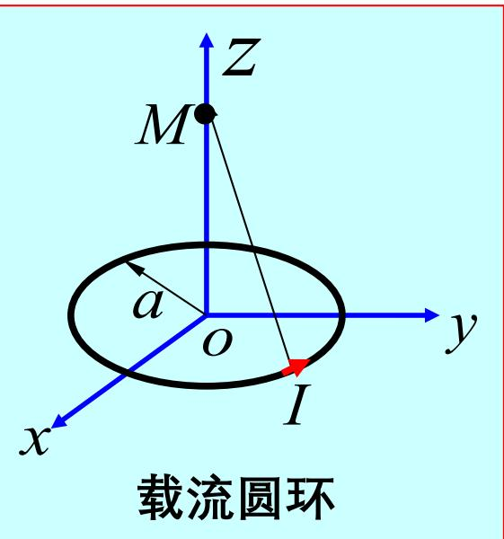

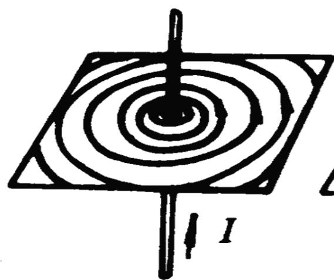

(a)

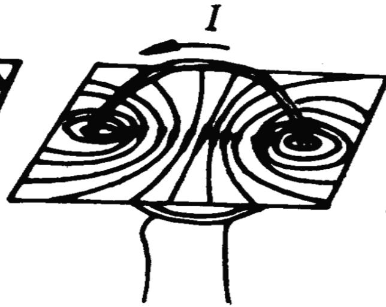

(b)

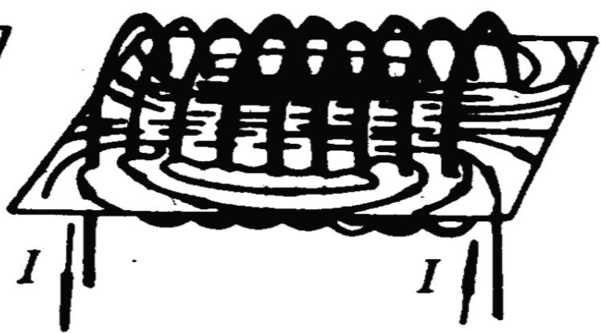

(c）

例2.3.1 计算线电流圆环轴线上任一点的磁感应强度。 ^bc33fc

解：设圆环的半径为 $\pmb { a }$ ，流过的电流为I 。为计算方便取线电流圆环位于xy平面上，则所求场点为P $\bf \delta ( 0 , 0 , z )$ ,如图所示。采用圆柱坐标系，圆环上的电流元为 $I \mathrm { d } \vec { l ^ { \prime } } = \vec { e } _ { \phi } I a \mathrm { d } \phi ^ { \prime }$ ，其位置矢量为 $\vec { r } ^ { \prime } = \vec { e } _ { \rho } a$ 而场点 P 的位置矢量为 $\vec { r } = \vec { e } _ { z } z$ ， 故 得

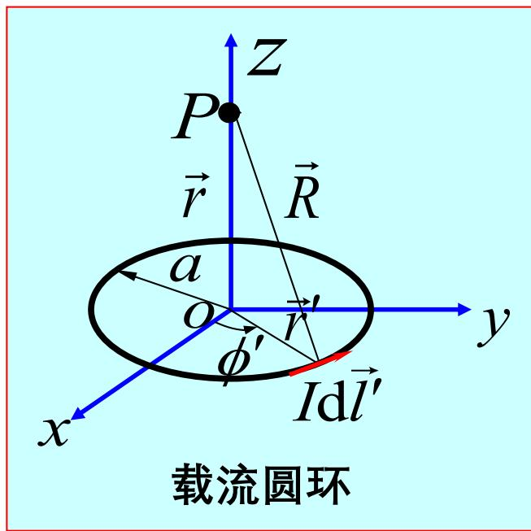

$$
\begin{array}{l} \vec {r} - \vec {r} ^ {\prime} = \vec {e} _ {z} z - \vec {e} _ {\rho} a, \quad \left| \vec {r} - \vec {r} ^ {\prime} \right| = (z ^ {2} + a ^ {2}) ^ {1 / 2} \\ I \mathrm {d} \vec {l} ^ {\prime} \times (\vec {r} - \vec {r} ^ {\prime}) = \vec {e} _ {\phi} I a \mathrm {d} \phi^ {\prime} \times (\vec {e} _ {z} z - \vec {e} _ {\rho} a) \\ = \vec {e} _ {\rho} I a z \mathrm {d} \phi^ {\prime} + \vec {e} _ {z} I a ^ {2} \mathrm {d} \phi^ {\prime} \\ \end{array}
$$

轴线上任一点P(0,0,z)的磁感应强度为

$$
\vec {B} (z) = \frac {\mu_ {0} I a}{4 \pi} \int_ {0} ^ {2 \pi} \frac {\vec {e} _ {\rho} z + \vec {e} _ {z} a}{\left(z ^ {2} + a ^ {2}\right) ^ {3 / 2}} \mathrm {d} \phi^ {\prime}
$$

由于 $\int _ { 0 } ^ { 2 \pi } \vec { e } _ { \rho } \mathrm { d } \phi ^ { \prime } = \int _ { 0 } ^ { 2 \pi } ( \vec { e } _ { x } \mathrm { c o s } \phi ^ { \prime } + \vec { e } _ { y } \mathrm { s i n } \phi ^ { \prime } ) \mathrm { d } \phi ^ { \prime } = 0$ ，所以

$$
\vec {B} (z) = \frac {\mu_ {0} I a}{4 \pi} \int_ {0} ^ {2 \pi} \frac {\vec {e} _ {z} a}{(z ^ {2} + a ^ {2}) ^ {3 / 2}} \mathrm {d} \phi^ {\prime} = \frac {\mu_ {0} I a ^ {2}}{2 (z ^ {2} + a ^ {2}) ^ {3 / 2}} \vec {e} _ {z}
$$

可见，线电流圆环轴线上的磁感应强度只有轴向分量，这是因为圆环上各对称点处的电流元在场点P产生的磁场强度的径向分量相互抵消。

在圆环的中心点上， $z = 0$ ，磁感应强度最大，即

$$
\vec {B} (0) = \vec {e} _ {z} \frac {\mu_ {0} I}{2 a}
$$

当场点P远离圆环，即z >> a时，因 $\left( z ^ { 2 } + a ^ { 2 } \right) ^ { 3 / 2 } \approx z ^ { 3 }$ ， 故

$$
\vec {B} = \vec {e} _ {z} \frac {\mu_ {0} I a ^ {2}}{2 z ^ {3}}
$$

# 恒定磁场的散度和旋度

# 1. 恒定磁场的散度与磁通连续性原理

恒定场的散度（微分形式） 磁通连续性原理（积分形式）

$$
\nabla \cdot \vec {B} (\vec {r}) = 0
$$

$$
\oint_ {S} \vec {B} (\vec {r}) \cdot \mathrm {d} \vec {S} = 0
$$

磁通连续性原理表明：恒定磁场是无源场，磁场线是无起点和终点的闭合曲线。

# 2.恒定磁场的旋度与安培环路定理

恒定磁场的旋度（微分形式） 安培环路定理（积分形式）

$$
\left| \nabla \times \vec {B} (\vec {r}) \right. = \mu_ {0} \vec {J} (\vec {r})
$$

$$
\oint_ {\mathcal {C}} \vec {B} (\vec {r}) \cdot \mathrm {d} \vec {I} = \mu_ {0} \int_ {\mathcal {S}} \vec {\mathcal {J}} (\vec {r}) \cdot \mathrm {d} \vec {S} = \mu_ {0} I
$$

安培环路定理表明：恒定磁场是有旋场，是非保守场、电流是磁场的旋涡源。

# 3. 利用安培环路定理计算磁感应强度

当磁场分布具有一定对称性的情况下，可以利用安培环路定理计算磁感应强度。

例:求电流面密度为 $\vec { J } _ { S } = \vec { e } _ { z } J _ { S 0 }$ 的无限大电流薄板产生的磁感应强度。

解：分析场的分布，取安培环路如图

$$
\oint_ {C} \vec {B} \cdot \mathrm {d} \vec {l} = B _ {1} l + B _ {2} l = \mu_ {0} J _ {S 0} l
$$

根据对称性，有 $B _ { 1 } = B _ { 2 } = B$ ，故

$$
\vec {B} = \left\{ \begin{array}{l l} \vec {e} _ {y} \frac {\mu_ {0} J _ {S 0}}{2} & x > 0 \\ - \vec {e} _ {y} \frac {\mu_ {0} J _ {S 0}}{2} & x <   0 \end{array} \right.
$$

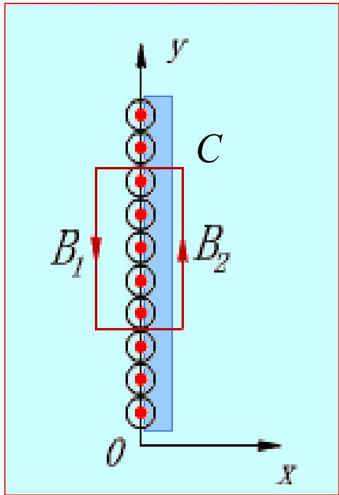

例:求载流无限长同轴电缆产生的磁感应强度。

解 选用圆柱坐标系，则 $\vec { B } = \vec { e } _ { \phi } B ( \rho )$ 

(1) $0 \leq \rho < a$ 

取安培环路 $( \rho < a )$ ，交链的电流为

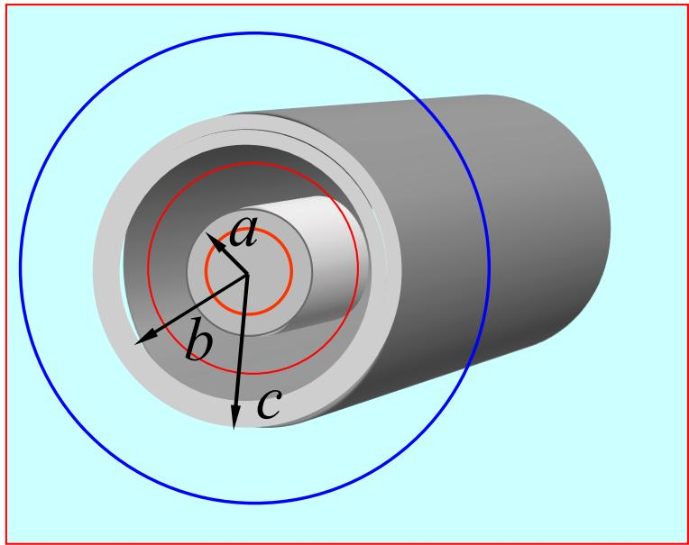

$$
I _ {1} = \frac {I}{\pi a ^ {2}} \cdot \pi \rho^ {2} = I \frac {\rho^ {2}}{a ^ {2}}
$$

应用安培环路定理，得

$$
2 \pi \rho B _ {1} = \mu_ {0} \frac {I \rho^ {2}}{a ^ {2}}
$$

$$
\Longrightarrow \vec {B} _ {1} = \vec {e} _ {\phi} \frac {\mu_ {0} I \rho}{2 \pi a ^ {2}}
$$

(2) $a \leq \rho < b$ 

$$
2 \pi \rho B _ {2} = \mu_ {0} I \quad \Longrightarrow \vec {B} _ {2} = \vec {e} _ {\phi} \frac {\mu_ {0} I}{2 \pi \rho}
$$

(3) $b \leq \rho < c$ 

$$
I _ {3} = I - I \frac {\rho^ {2} - b ^ {2}}{c ^ {2} - b ^ {2}} = I \frac {c ^ {2} - \rho^ {2}}{c ^ {2} - b ^ {2}}
$$

应用安培环路定律， 得

$$
2 \pi \rho B _ {3} = \frac {\mu_ {0} I (c ^ {2} - \rho^ {2})}{c ^ {2} - b ^ {2}} \Longrightarrow \vec {B} _ {3} = \vec {e} _ {\phi} \frac {\mu_ {0} I}{2 \pi \rho} \cdot \frac {c ^ {2} - \rho^ {2}}{c ^ {2} - b ^ {2}}
$$

(4)c≤p<8 

$$
I _ {4} = 0 \quad \Longrightarrow \vec {B} _ {4} = 0
$$

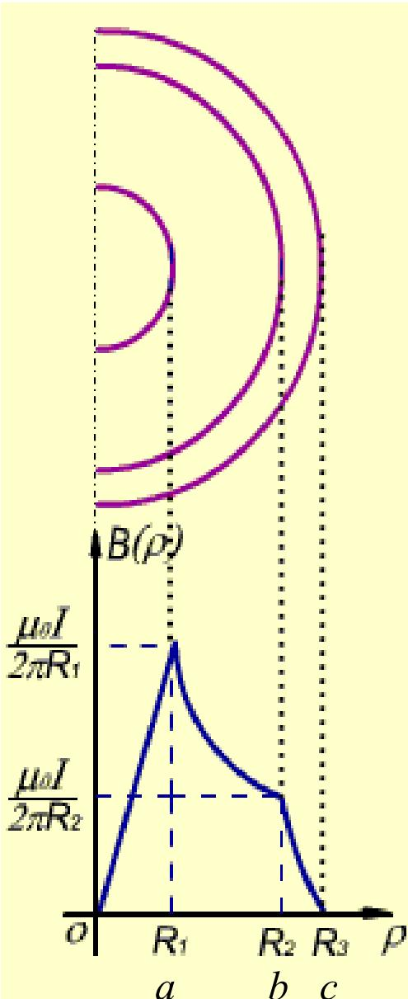

# 2.4 真空中时变电磁场的因果规律

❖电磁感应定律 —— 揭示时变磁场产生电场

❖位移电流 揭示时变电场产生磁场

重要结论： 在时变情况下，电场与磁场相互激励，形成统一的电磁场。

# 法拉第电磁感应定律

❖ 自从1820年奥斯特发现电流的磁效应之后，人们开始研究相反的问题，即磁场能否产生电流。

❖1831年法拉第发现，当穿过导体回路的磁通量发生变化时，回路中就会出现感应电流和电动势，且感应电动势与磁通量的变化有密切关系，由此总结出了著名的法拉第电磁感应定律。

# 法拉第电磁感应定律的表述

当通过导体回路所围面积的磁通量 $\pmb { \psi }$ 发生变化时，回路中产生的感应电动势 $\mathcal { E } _ { \mathrm { i n } }$ 的大小等于磁通量的时间变化率的负值，方向是要阻止回路中磁通量的改变，即

$$
\varepsilon_ {i n} = - \frac {\mathrm {d} \psi}{\mathrm {d} t}
$$

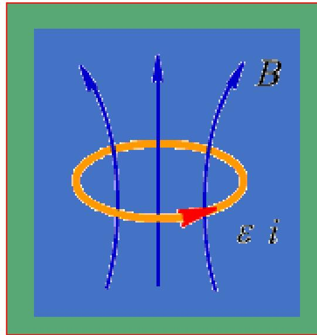

❖ 负号表示感应电流产生的磁场总是阻止磁通量的变化。

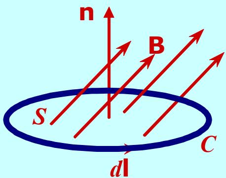

设任意导体回路C围成的曲面为S ，其单位法向矢量为 ne $\vec { e } _ { n }$ ， 则穿过回路的磁通为

$$
\psi = \int_ {S} \vec {B} \cdot d \vec {S} \longrightarrow \varepsilon_ {i n} = - \frac {\mathrm {d}}{\mathrm {d} t} \int_ {S} \vec {B} \cdot \mathrm {d} \vec {S}
$$

导体回路中有感应电流，表明回路中存在感应电场 $\vec { E } _ { i n }$ ，回路中的感应电动势可表示为 $\varepsilon _ { i n } = \oint _ { C } { \vec { E } } _ { i n } \mathbf { \cdot } \mathbf { d } \vec { l }$ 

因而有

$$
\oint_ {C} \vec {E} _ {i n} \cdot \mathrm {d} \vec {l} = - \frac {\mathrm {d}}{\mathrm {d} t} \int_ {S} \vec {B} \cdot \mathrm {d} \vec {S}
$$

对感应电场的讨论：

❖ 感应电场是由变化的磁场所激发的电场；

$\clubsuit$ 感应电场是有旋场；

❖ 感应电场不仅存在于导体回路中，也存在于导体回路之外的空间；

❖ 对空间中的任意回路（不一定是导体回路） C ，都有

$$
\oint_ {C} \vec {E} _ {i n} \cdot \mathrm {d} \vec {l} = - \frac {\mathrm {d}}{\mathrm {d} t} \int_ {S} \vec {B} \cdot \mathrm {d} \vec {S}
$$

若空间同时存在由电荷产生的电场 $\vec { E } _ { c }$ ,则总电场 $\vec { E }$ 应为 与 E之和，即 $\vec { E } = \vec { E } _ { i n } + \vec { E } _ { c }$ 。由于 $\oint _ { C } { \vec { E } } _ { c } \mathbf { \cdot } \mathbf { d } { \vec { l } } = 0$ ，故有

$$
\oint_ {C} \vec {E} \cdot \mathrm {d} \vec {l} = - \frac {\mathrm {d}}{\mathrm {d} t} \int_ {S} \vec {B} \cdot \mathrm {d} \vec {S}
$$

推广的法拉第电磁感应定律

2. 引起回路中磁通变化的几种情况：

(1) 回路不变， 磁场随时间变化

磁通量的变化由磁场随时间变化引起，因此有

$$
\frac {\mathrm {d}}{\mathrm {d} t} \int_ {S} \vec {B} \cdot \mathrm {d} \vec {S} = \int_ {S} \frac {\partial \vec {B}}{\partial t} \cdot \mathrm {d} \vec {S} \Longrightarrow \oint_ {C} \vec {E} \cdot \mathrm {d} \vec {l} = - \int_ {S} \frac {\partial \vec {B}}{\partial t} \cdot \mathrm {d} \vec {S}
$$

相应的微分形式为 VxE=- $\nabla \times \vec { E } = - \frac { \partial \vec { B } } { \partial t }$ 

# ( 2 ) 导体回路在恒定磁场中运动

$$
\varepsilon_ {i n} = \oint_ {C} \vec {E} \cdot \mathrm {d} \vec {l} = \oint_ {C} (\vec {v} \times \vec {B}) \cdot \mathrm {d} \vec {l}
$$

动生电动势， 这就是发电机工作原理。

$$
\oint_ {C} \vec {E} \cdot \mathrm {d} \vec {l} = \oint_ {C} \left(\vec {F} _ {m} / q\right) \cdot \mathrm {d} \vec {l} = \oint_ {C} q \vec {\nu} \times \vec {B} / q \cdot \mathrm {d} \vec {l} = \oint_ {C} (\vec {\nu} \times \vec {B}) \cdot \mathrm {d} \vec {l}
$$

# ( 3 回路在时变磁场中运动

$$
\varepsilon_ {i n} = \oint_ {C} \vec {E} \cdot \mathrm {d} \vec {l} = \oint_ {C} (\vec {v} \times \vec {B}) \cdot \mathrm {d} \vec {l} - \int_ {S} \frac {\partial \vec {B}}{\partial t} \cdot \mathrm {d} \vec {S}
$$

微分形式

$$
\nabla \times \vec {E} = \nabla \times (\vec {\nu} \times \vec {B}) - \frac {\partial \vec {B}}{\partial t}
$$

例：长为 $\pmb { a }$ 、宽为 $\pmb { b }$ 的矩形环中有均匀磁场 $\vec { B }$ 垂直穿过，如图所示。在以下三种情况下，求矩形环内的感应电动势。

（1） $\vec { B } = \vec { e } _ { z } B _ { 0 }$ cos(@t) 矩形回路静止；

（2） $\vec { B } = \vec { e } _ { z } B _ { 0 }$ ，矩形回路的宽边 $\mathbf { \delta } _ { b } =$ 常数，但其长边因可滑动导体L以匀速 $\vec { \nu } = \vec { e } _ { x } \nu$ 运动而随时间增大；

（3） $\vec { B } = \vec { e } _ { z } B _ { 0 }$ cos(ωt) 且矩形回路上的可滑动导体L以匀速 $\vec { \nu } = \vec { e } _ { x } \nu$ 运动。

解：(1) 均匀磁场 $\vec { B }$ 随时间作简谐变化， 而回路静止，因而回路内的感应电动势是由磁场变化产生的，故

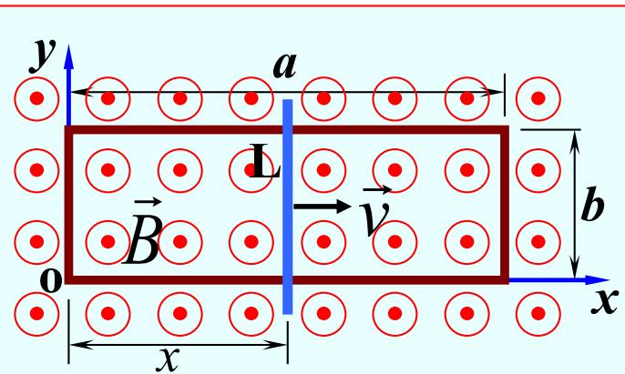

均匀磁场中的矩形环

$$
\varepsilon_ {i n} = - \int_ {S} \frac {\partial \vec {B}}{\partial t} \cdot \mathrm {d} \vec {S} = - \int_ {S} \frac {\partial}{\partial t} [ \vec {e} _ {z} B _ {0} \cos (\omega t) ] \cdot \vec {e} _ {z} \mathrm {d} S = \omega a b B _ {0} \sin (\omega t)
$$

( 2 ) 均匀磁场 $\vec { B }$ 为恒定磁场，而回路上的可滑动导体以匀速运动，因而回路内的感应电动势全部是由导体L在磁场中运动产生的，故得

$$
\varepsilon_ {i n} = \oint_ {C} (\vec {\nu} \times \vec {B}) \cdot \mathrm {d} \vec {l} = \oint_ {C} (\vec {e} _ {x} \nu \times \vec {e} _ {z} B _ {0}) \cdot \vec {e} _ {y} \mathrm {d} l = - \nu B _ {0} b
$$

或 $\varepsilon _ { i n } = - { \frac { \mathrm { d } } { \mathrm { d } t } } { \int _ { S } { { \vec { B } } \cdot { \mathrm { d } } { \vec { S } } } } = - { \frac { \mathrm { d } } { \mathrm { d } t } } { ( b B _ { 0 } \nu t ) } = - b B _ { 0 } \nu$ €

( 3 ) 矩形回路中的感应电动势是由磁场变化以及可滑动导体L在磁场中运动产生的，故得

$$
\begin{array}{l} \varepsilon_ {i n} = - \int_ {S} \frac {\partial \vec {B}}{\partial t} \cdot \mathrm {d} \vec {S} + \oint_ {C} (\vec {v} \times \vec {B}) \cdot \mathrm {d} \vec {l} \\ = \int_ {S} \frac {\partial}{\partial t} \left(\vec {e} _ {z} B _ {0} \cos \omega t\right) \cdot \vec {e} _ {z} d S + \oint_ {C} \left(\vec {e} _ {x} v \times \vec {e} _ {z} B _ {0} \cos \omega t\right) \cdot \vec {e} _ {y} d l \\ = v t \omega b B _ {0} \sin \omega t - v b B _ {0} \cos \omega t \\ \end{array}
$$

例 ：在时变磁场 $\vec { B } = \vec { e } _ { y } B _ { 0 }$ 中，放置有一个sin t  $a \times b$ 的矩形线圈。初始时刻，线圈平面的法向单位矢量$\vec { e } _ { n }$ 与 $\vec { e } _ { y }$ 成α角，如图所示。试求：

（1） 线圈静止时的感应电动势；

（2）线圈以角速度 $\pmb { \omega }$ 绕 x 轴旋转时的感应电动势。

解: （1）线圈静止时，感应电动势是由时变磁场引起，故

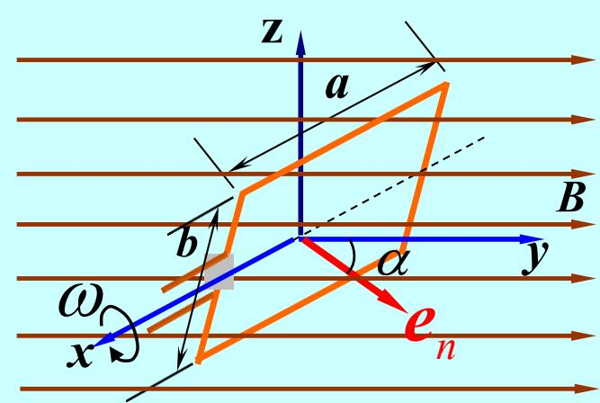

时变磁场中的矩形线圈

$$
\begin{array}{l} \varepsilon_ {i n} = \oint_ {c} \vec {E} \cdot \mathrm {d} \vec {l} = - \int \frac {\partial \vec {B}}{\partial t} \cdot \mathrm {d} \vec {S} \\ = - \int_ {S} \frac {\partial}{\partial t} (\vec {e} _ {y} B _ {0} \sin \omega t \cdot \vec {e} _ {n} \mathrm {d} S) \\ = - \int_ {S} B _ {0} \omega \cos \omega t \cos \alpha \mathrm {d} S \\ = - B _ {0} a b \omega \cos \omega t \cos \alpha \\ \end{array}
$$

（2）线圈绕 x 轴旋转时， $\vec { e } _ { n }$ 的指向将随时间变化。线圈内的感应电动势可以用两种方法计算。

方法一：利用式 $\mathscr { E } _ { i n } = - \frac { \mathrm { d } } { \mathrm { d } t } \int _ { S } \vec { B } { \cdot } \mathrm { d } \vec { S }$ Ci 算

假定 $t = 0$ 时 $\alpha = 0$ ，则在时刻 $t$ 时， $\vec { e } _ { n }$ 与y 轴的夹角 $\alpha = \omega t$ 故

$$
\begin{array}{l} \varepsilon_ {i n} = - \frac {\mathrm {d}}{\mathrm {d} t} \int_ {S} \vec {B} \cdot \mathrm {d} \vec {S} \\ = - \frac {\mathrm {d}}{\mathrm {d} t} \int_ {S} \vec {e} _ {y} B _ {0} \sin \omega t \cdot \vec {e} _ {n} \mathrm {d} S = - \frac {\mathrm {d}}{\mathrm {d} t} (a b B _ {0} \sin \omega t \cos \omega t) \\ = - \frac {\mathrm {d}}{\mathrm {d} t} \left(\frac {1}{2} B _ {0} a b \sin 2 \omega t\right) = - B _ {0} a b \omega \cos 2 \omega t \\ \end{array}
$$

# 方法二： 利用式

$$
\varepsilon_ {i n} = - \int_ {S} \frac {\partial \vec {B}}{\partial t} \cdot \mathrm {d} \vec {S} + \oint_ {c} (\vec {v} \times \vec {B}) \cdot \mathrm {d} \vec {l} \quad \text {计 算 。}
$$

# 上式右端第一项与( 1 )相同，第二项

$$
\oint_ {c} (\vec {v} \times \vec {B}) \cdot \mathrm {d} \vec {l} = \int_ {2} ^ {1} \left[ \left(\vec {e} _ {n} \frac {b}{2} \omega\right) \times \vec {e} _ {y} B _ {0} \sin \omega t \right] \cdot \vec {e} _ {x} \mathrm {d} x +
$$

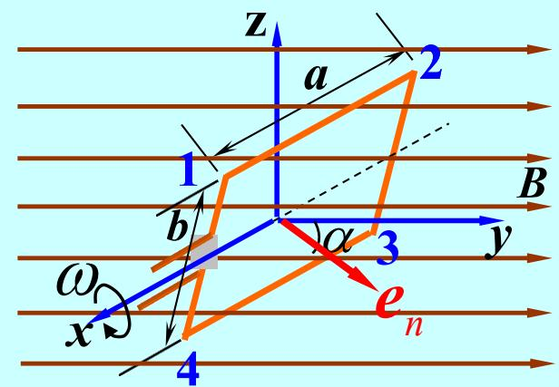

时变磁场中的矩形线圈

$$
\begin{array}{l} \int_ {4} ^ {3} \left[ \left(- \vec {e} _ {n} \frac {b}{2} \omega\right) \times \vec {e} _ {y} B _ {0} \sin \omega t \right] \cdot \left(- \vec {e} _ {x}\right) d x \\ = \omega B _ {0} a b \sin \omega t \sin \alpha \\ \end{array}
$$

$$
\begin{array}{l} \varepsilon_ {i n} = - a b \omega B _ {0} \cos \omega t \cos \alpha + \omega B _ {0} a b \sin \omega t \sin \alpha \\ = - B _ {0} a b \omega \cos^ {2} \omega t + B _ {0} \omega a b \sin^ {2} \omega t \\ = - B _ {0} a b \omega \cos 2 \omega t \\ \end{array}
$$

# 位移电流及全电流定理

❖静态情况下的电场基本方程在非静态时发生了变化，即

$$
\nabla \times \vec {E} = 0
$$

$$
\nabla \times \vec {E} = - \frac {\partial \vec {B}}{\partial t}
$$

❖这不仅是方程形式的变化，而是一个本质的变化，其中包含了重要的物理事实，即 时变磁场可以激发电场 

问题：随时间变化的磁场要产生电场，那么随时间变化的电场是否会产生磁场？

在时变情况下，安培环路定理是否要发生变化？有什么变化？即

$$
\nabla \times \vec {H} = \vec {J}
$$

（恒定磁场）

$$
\nabla \times \vec {H} = ?
$$

（时变场）

# 1.全电流定理

时变情况下，电荷分布随时间变化，由电流连续性方程有

$$
\nabla \cdot \vec {\mathcal {J}} = - \frac {\partial \rho}{\partial t} \neq 0
$$

发生矛盾

而由 $\nabla _ { \boldsymbol { \pi } } \times \vec { H } \ = \ \vec { J } \Longrightarrow \nabla \cdot \vec { J } \ = \nabla \cdot ( \nabla \times \vec { H } ) = 0 \gets \vec { \mathcal { H } }$ 

在时变的情况下不适用

解决办法： 对安培环路定理进行修正

由 $\nabla \cdot { \vec { D } } = \rho \Longrightarrow \nabla \cdot { \vec { J } } = - { \frac { \partial } { \partial t } } \left( \nabla \cdot { \vec { D } } \right) \Longrightarrow \nabla$ .(+） =0at

将 $\nabla \times \vec { H } = \vec { J }$ 修正为：  DOt

矛盾解决

时变电场会激发磁场

全电流定理：

$$
\begin{array}{l} \nabla \times \vec {H} = \vec {J} + \frac {\partial \vec {D}}{\partial t} \quad - \text {微 分 形 式} \\ \oint_ {C} \vec {H} \cdot \mathrm {d} \vec {I} = \int_ {S} (\vec {J} + \frac {\partial \vec {D}}{\partial t}) \cdot \mathrm {d} \vec {S} - \text {积 分 形 式} \\ \end{array}
$$

全电流定理揭示不仅传导电流激发磁场，变化的电场也可以激发磁场。它与变化的磁场激发电场形成自然界的一个对偶关系。

位移电流密度

$$
\vec {J} _ {d} = \frac {\partial \vec {D}}{\partial t}
$$

❑ 电位移矢量随时间的变化率，能像电流一样产生磁场，故称“位移电流” o

❑ 位移电流只表示电场的变化率，与传导电流不同，它所产生热效应不满足焦耳定律。

❑ 位移电流的引入是建立麦克斯韦方程组的至关重要的一步，它揭示了时变电场产生磁场这一重要的物理概念。

❑ 在绝缘介质中，无传导电流，但有位移电流；注：

❑ 在理想导体中，无位移电流，但有传导电流；

❑ 在一般介质中，既有传导电流，又有位移电流。

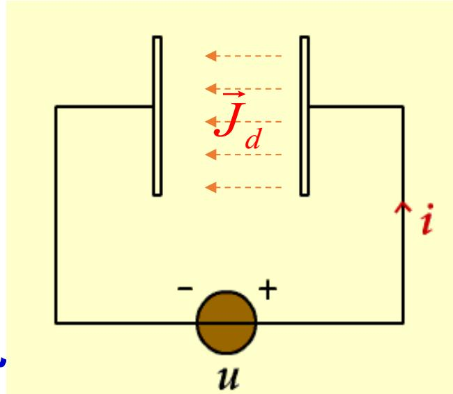

例 海水的电导率为4S/m，相对介电常数为81，求频率为1MHz时，位移电流振幅与传导电流振幅的比值。

解：设电场随时间作正弦变化， 表示为

$$
\vec {E} = \vec {e} _ {X} E _ {m} \cos \omega t
$$

则位移电流密度为 $\vec { J } _ { d } ~ = ~ \frac { \partial \vec { D } } { \partial t } ~ = ~ - \vec { e } _ { x } \omega \varepsilon _ { \scriptscriptstyle 0 } \varepsilon _ { \scriptscriptstyle r } E _ { \scriptscriptstyle m } ~ \sin ~ \omega t$ d =

其振幅值为 $J _ { { d m } } ~ = ~ \omega \varepsilon _ { \scriptscriptstyle 0 } \varepsilon _ { \scriptscriptstyle r } E _ { { m } } ~ = ~ 4 . 5 \times 1 0 ^ { - 3 } E _ { { m } }$ 

传导电流的振幅值为 $J _ { { } _ { c m } } = \sigma E _ { { } _ { m } } = 4 E _ { { } _ { m } }$ 

故 $\frac { J _ { d m } } { J _ { c m } } = 1 . 1 2 5 \times 1 0 ^ { - 3 }$ Jdm

例：自由空间的磁场强度为 $\vec { H } = \vec { e } _ { x } H _ { m }$ cos(@t -kz) A/m式中的 k 为常数。试求：位移电流密度和电场强度。

解 自由空间的传导电流密度为0，故由 式V×H=D $\nabla \times \vec { H } = \frac { \hat { \partial } \vec { D } } { \hat { \partial } t }$ 得

$$
\begin{array}{l} \vec {J} _ {d} = \frac {\partial \vec {D}}{\partial t} = \nabla \times \vec {H} = (\vec {e} _ {x} \frac {\partial}{\partial x} + \vec {e} _ {y} \frac {\partial}{\partial y} + \vec {e} _ {z} \frac {\partial}{\partial z}) \times \vec {e} _ {x} H _ {x} \\ = \vec {e} _ {y} \frac {\partial H _ {x}}{\partial z} = \vec {e} _ {y} \frac {\partial}{\partial z} \big [ H _ {m} \cos (\omega t - k z) \big ] \\ = \vec {e} _ {y} k H _ {m} \sin (\omega t - k z) \quad \mathrm {A / m ^ {2}} \\ \end{array}
$$

$$
\begin{array}{l} \vec {E} = \frac {\vec {D}}{\varepsilon_ {0}} = \frac {1}{\varepsilon_ {0}} \int \frac {\partial \vec {D}}{\partial t} d t = \frac {1}{\varepsilon_ {0}} \int \vec {e} _ {y} k H _ {m} \sin (\omega t - k z) d t \\ = - \vec {e} _ {y} \frac {k}{\omega \varepsilon_ {0}} H _ {m} \cos (\omega t - k z) \quad \mathrm {V / m} \\ \end{array}
$$

例： 铜的电导率 $\sigma = 5 . 8 { \times } 1 0 ^ { 7 } \mathrm { S / m }$ 、相对介电常数 $\mathcal { E } _ { r } = 1$ 。 设 铜中的传导电流密度为 $\vec { J } = \vec { e } _ { x } J _ { m }$ 。试证明：在无线电频率范围内，铜中的位移电流与传导电流相比是可以忽略的。

解：铜中存在时变电磁场时，位移电流密度为

$$
\vec {J} _ {d} = \frac {\partial \vec {D}}{\partial t} = \varepsilon_ {r} \varepsilon_ {0} \frac {\partial \vec {E}}{\partial t} = \varepsilon_ {r} \varepsilon_ {0} \frac {\partial}{\partial t} (\vec {e} _ {x} E _ {m} \cos \omega t) = - \vec {e} _ {x} \omega \varepsilon_ {r} \varepsilon_ {0} E _ {m} \sin \omega t
$$

位移电流密度的振幅值为 $J _ { { d m } } = \omega \varepsilon _ { r } \varepsilon _ { 0 } E _ { m }$ 

而传导电流密度的振幅值为 $J _ { { m } } = \sigma E _ { { m } }$ 

$$
\Longrightarrow \frac {J _ {d m}}{J _ {m}} = \frac {\omega \varepsilon_ {r} \varepsilon_ {0} E _ {m}}{\sigma E _ {m}} = \frac {2 \pi f \times 1 \times \frac {1}{3 6 \pi} \times 1 0 ^ {- 9} E _ {m}}{5 . 8 \times 1 0 ^ {7} E _ {m}} = 9. 5 8 \times 1 0 ^ {- 1 9} f
$$

通常所说的无线电频率是指 $\mathbf { \mathit { f } } \mathbf { = } 3 0 0 \mathbf { \mathit { M H z } }$ 以下的频率范围，即使扩展到极高频段 $\left( f = 3 0 \mathrm { G H z } \sim 3 0 0 \mathrm { G H z } \right)$ ），从上面的关系式看出比值 $J _ { \mathbf { d m } } / J _ { \mathbf { m } }$ 也是很小的，故可忽略铜中的位移电流。

# 2.5 物质空间中媒质的电磁效应

❖ 媒质对电磁场的响应可分为三种情况：极化、磁化和传导。

❖ 描述媒质电磁特性的参数为： 介电常数、磁导率和电导率。

# 电介质的极化 电位移矢量

# 电介质的极化现象

电介质的分子分为无极分子和有极分子。

(1)有极分子：无外场时，正负电中心不重合，有分子电偶极矩。但取向无规则性，不表现宏观电矩

(2)无极分子：无外场时，正负电中心重合，无分子电偶极矩，也无宏观电矩。

没有外场作用

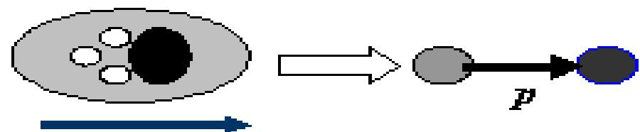

外加电场

（a）外场使正、负电荷中心发生位移，形成定向排列的电偶极矩

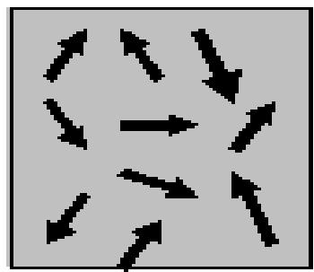

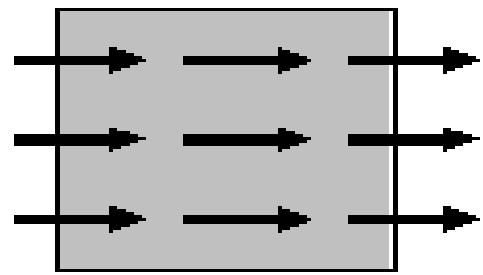

外加电场

（b）外场使不规则的分布的固有电偶极矩，形成规则排列

介质的极化：介质中分子和原子的正负电荷在外加电场力的作用下发生小的位移，形成定向排列的电偶极矩；或原子、分子固有电偶极矩不规则的分布，在外场作用下形成规则排列。无极分子的极化称为位移极化，有极分子的极化称为取向极化。

极化使介质内部或表面上出现的电荷称为束缚电荷。

# 极化强度矢量 $\vec { P } ( \mathrm { C } / \mathrm { m } ^ { 2 } )$

极化强度矢量 $\vec { P }$ 是描述介质极化程度的物理量，定义为

$$
\vec {P} = \lim _ {\Delta V \rightarrow 0} \frac {\sum \vec {p} _ {i}}{\Delta V} = n \vec {p}
$$

p=ql 分子的平均电偶极矩

• $\vec { P }$ 的物理意义：单位体积内分子电偶极矩的矢量和。

极化强度与电场强度有关，其关系一般比较复杂。在线性、各向同性的电介质中， $\vec { P }$ 与电场强度成正比，即

$$
\vec {P} = \chi_ {e} \varepsilon_ {0} \vec {E}
$$

$\chi _ { e } ( > 0 )$ 电介质的电极化率

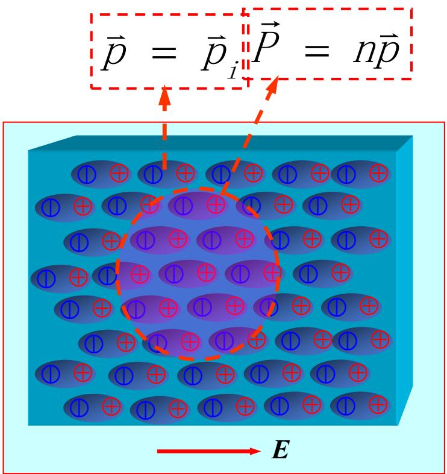

# 极化电荷体密度与极化强度的关系

用偶极子 $\overline { { \vec { p } = q \vec { l } } }$ 代替电介质中的中性分子。

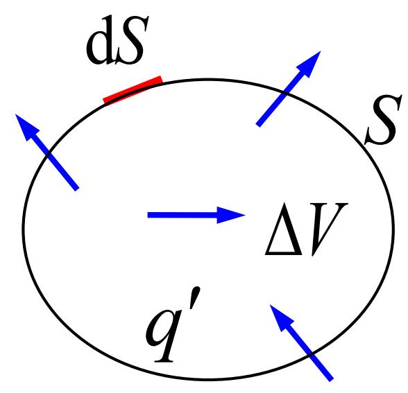

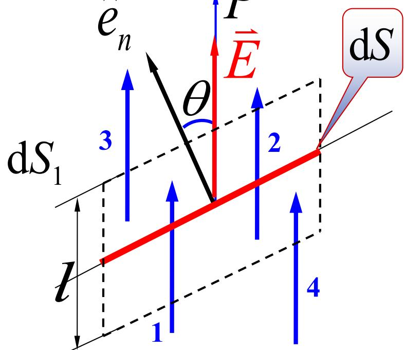

dS

只有被S所截的偶极子才对 有贡献

本页动画保留。

如图所示，只有中心在斜柱状夹层内的偶极子才对 $q _ { \mathfrak { p } }$ 有贡献。夹层的体积 $l | { \cos \theta } | { \mathrm { d } } S$ 对 $q _ { P }$ 有贡献的偶极子数为 $n l { \big | } \cos \theta { \big | } \mathrm { d } S$ ， 所 贡献的电荷为

$$
\mathrm {d} q _ {P} = - q n l \cos \theta \mathrm {d} S
$$

式中负号说明.

因为 $\bar { p } = q \bar { l }$ ， 所 以 $P = n q l$ ， 故

$$
\mathrm {d} q _ {P} = - P \cos \theta \mathrm {d} S = - \vec {P} \cdot \mathrm {d} \vec {S}
$$

对 的整个边界面 $S$ 积分便得极化电荷总量为

$$
q _ {\mathrm {P}} = - \oiint_ {S} \vec {P} \cdot \mathrm {d} \vec {S}
$$

一般关系式

上式表明，电介质内部任何体积 内的极化V电荷等于极化强度对包围 的表面 V $S$ 的通量的负值。

电介质内一点极化电荷体密度为

$$
\rho_ {P} = - \lim _ {\Delta V \rightarrow 0} \frac {\iint_ {S} \vec {P} \cdot \mathrm {d} \vec {S}}{\Delta V}
$$

极化电荷

由于极化，正负电荷发生位移，在电介质内部可能出现净余的极化电荷分布，同时在电介质的表面上有面分布的极化电荷。

# ( 1 ) 极化电荷体密度

在电介质内任意作一闭合面S ，只有电偶极矩穿过S的分子对S内的极化电荷有贡献。由于负电荷位于斜柱体内的电偶极矩才穿过小面元 dS，因此dS对极化电荷的贡献为

$$
\mathrm {d} q _ {P} = - q n d \mathrm {d} S \cos \theta = - P \mathrm {d} S \cos \theta = - \vec {P} \cdot \mathrm {d} \vec {S}
$$

S所围的体积内的极化电荷 $q _ { P }$ 为

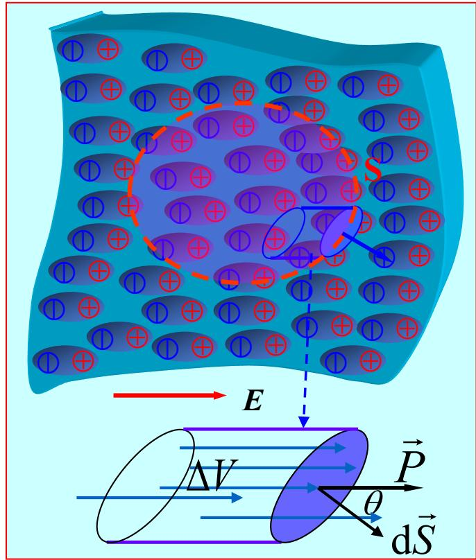

$$
q _ {P} = - \oint_ {S} \vec {P} \cdot \mathrm {d} \vec {S} = - \int_ {V} \nabla \cdot \vec {P} \mathrm {d} V \Longrightarrow \rho_ {P} = - \nabla \cdot \vec {P}
$$

特例：均匀极化时， $\vec { P } =$ 常矢量， $\rho _ { { } _ { P } } = 0$ 即电介质内部极化电荷体密度为零。

# ( 2 ) 极化电荷面密度

紧贴电介质表面取如图所示的闭曲面，则穿过面积元 的极化电荷为

$$
\mathrm {d} q _ {P} = q n l \mathrm {d} S \cos \theta = P \mathrm {d} S \cos \theta = \vec {P} \cdot \mathrm {d} \vec {S}
$$

故得到电介质表面的极化电荷面密度

$$
\rho_ {S P} = \vec {P} \cdot \vec {e} _ {n}
$$

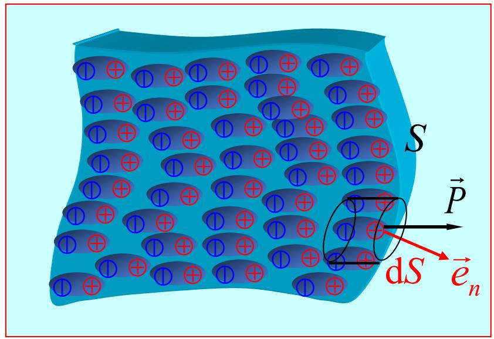

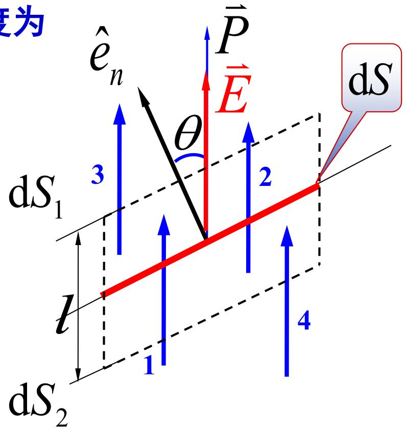

电位移矢量 介质中的高斯定理介质的极化过程包括两个方面：

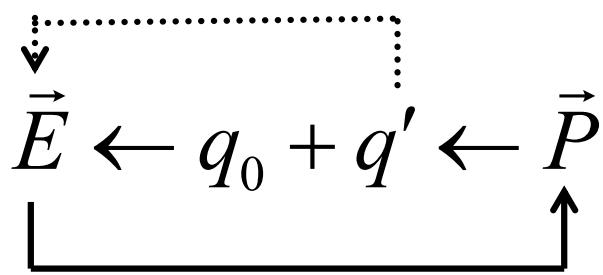

❑ 外加电场的作用使介质极化，产生极化电荷；

❑ 极化电荷反过来激发电场，两者相互制约，并达到平衡状态。无论是自由电荷，还是极化电荷，它们都激发电场，服从同样的库仑定律和高斯定理。

介质中的电场应该是外加电场和极化电荷产生的电场的叠加，应用高斯定理得到：

$$
\oint_ {S} \vec {E} \cdot \mathrm {d} \vec {S} = \frac {1}{\varepsilon_ {0}} \int_ {V} \underbrace {\left(\rho + \rho_ {p}\right)} _ {\uparrow} \mathrm {d} V \quad \Longrightarrow \quad \nabla \cdot \vec {E} = \frac {1}{\varepsilon_ {0}} \left(\rho + \rho_ {p}\right)
$$

自由电荷和极化电荷共同激发的结果

$$
\begin{array}{l} \iint_ {S} \vec {E} \cdot \mathrm {d} \vec {S} = \frac {1}{\varepsilon_ {0}} (q + q _ {P}) = \frac {1}{\varepsilon_ {0}} q - \frac {1}{\varepsilon_ {0}} \iint_ {S} \vec {P} \cdot \mathrm {d} \vec {S} \\ \longrightarrow \iint_ {S} \left(\varepsilon_ {0} \vec {E} + \vec {P}\right) \cdot \mathrm {d} \vec {S} = q _ {0} \\ \end{array}
$$

电位移（D矢量）： D=εE+P

$$
\longrightarrow \oiint_ {S} \vec {D} \cdot \mathrm {d} \vec {S} = q _ {0} \quad \text {有 电 介 质 时 的 高 斯 定 理}
$$

$\vec { D }$ 线起始于正自由电荷，终止于负自由电荷在没有自由电荷处不中断。

D 线分布由 $q _ { 0 } \mathbf { \cdot }$ q' 共同决定。

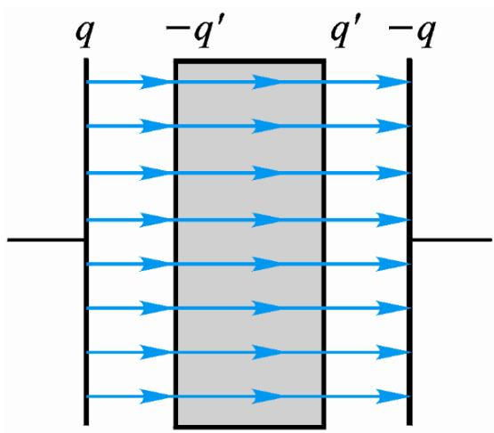

(a) $\pmb { D }$ 线均匀分布

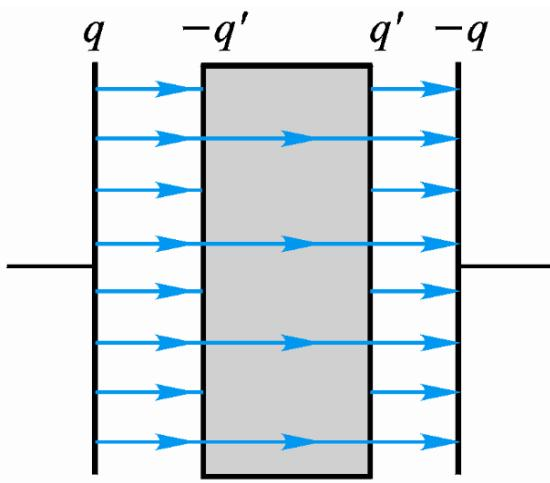

(b)电介质内部E线较稀疏

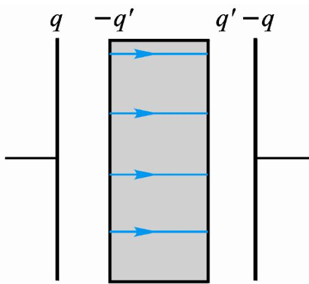

（c） $\pmb { P }$ 线只在电介质内部

有电介质的平行板电容器内的电位移线、电场线与电极化强度线

# 3．电介质的本构关系

对于所有电介质,式(2.4.10)都是成立的。若是线性和各向同性的电介质，将式(2.4.3)代人式(2.4.10)，得

$$
\begin{array}{l} \boldsymbol {D} (\boldsymbol {r}) = \varepsilon_ {0} \boldsymbol {E} (\boldsymbol {r}) + \chi_ {\mathrm {e}} \varepsilon_ {0} \boldsymbol {E} (\boldsymbol {r}) = (1 + \chi_ {\mathrm {e}}) \varepsilon_ {0} \boldsymbol {E} (\boldsymbol {r}) \\ = \varepsilon_ {r} \varepsilon_ {0} \boldsymbol {E} (\boldsymbol {r}) = \varepsilon \boldsymbol {E} (\boldsymbol {r}) \tag {2.4.13} \\ \end{array}
$$

式中的 $\varepsilon = \varepsilon _ { 0 } \varepsilon ,$ 称为电介质的介电常数，单位为 $\mathbf { F } / \mathbf { m }$ (法拉/米)。 $\tt { e } _ { \tt { r } } = 1 + \chi _ { \tt { e } }$ 称为电介质的相对介电常数,无量纲。表2.4.1列出部分电介质的相对介电常数的近似值。

表2.4.1部分电介质的相对介电常数

<table><tr><td>电介质</td><td>εr</td><td>电介质</td><td>εr</td></tr><tr><td>空气</td><td>1.0006</td><td>尼龙(固态)</td><td>3.8</td></tr><tr><td>聚苯乙烯泡沫塑料</td><td>1.03</td><td>石英</td><td>5</td></tr><tr><td>干燥木头</td><td>2~4</td><td>胶木</td><td>5</td></tr><tr><td>石蜡</td><td>2.1</td><td>铅玻璃</td><td>6</td></tr><tr><td>胶合板</td><td>2.1</td><td>云母</td><td>6</td></tr><tr><td>聚乙烯</td><td>2.26</td><td>氯丁橡胶</td><td>7</td></tr><tr><td>聚苯乙烯</td><td>2.6</td><td>大理石</td><td>8</td></tr><tr><td>PVC</td><td>2.7</td><td>硅</td><td>12</td></tr><tr><td>琥珀</td><td>3</td><td>酒精</td><td>25</td></tr><tr><td>橡胶</td><td>3</td><td>甘油</td><td>50</td></tr><tr><td>纸</td><td>3</td><td>蒸馏水</td><td>81</td></tr><tr><td>有机玻璃</td><td>3.4</td><td>二氧化钛</td><td>89~173</td></tr><tr><td>干燥沙质土壤</td><td>3.4</td><td>钛酸钡</td><td>1200</td></tr></table>

例题：半径为a的球形区域内充满分布不均匀的自由电荷，设其体密度为 如果已知电场分布为

$$
\vec {E} = \left\{ \begin{array}{l l} \vec {e} _ {r} \left(r ^ {3} + A r ^ {2}\right), r \leq a \\ \vec {e} _ {r} \left(a ^ {5} + A a ^ {4}\right) r ^ {- 2}, r > a \end{array} \quad \text {求 体 密 度} \rho (\vec {r}) \right.
$$

分析：球面坐标系

$$
\nabla \cdot \vec {F} = \frac {1}{r ^ {2}} \frac {\partial}{\partial r} (r ^ {2} F _ {r}) + \frac {1}{r \sin \theta} \frac {\partial}{\partial \theta} (\sin \theta F _ {\theta}) + \frac {1}{r \sin \theta} \frac {\partial}{\partial \phi} (F _ {\phi})
$$

解：高斯定理微分形式： $\nabla \cdot \vec { D } = \rho \qquad \rho ( \vec { r } ) = \varepsilon _ { 0 } \nabla \cdot \vec { E }$ $\rho ( \vec { r } ) = \varepsilon _ { 0 } \nabla \cdot \vec { E }$ 

采用球面坐标系：

$$
\rho (\vec {r}) = \varepsilon_ {0} \nabla \cdot \vec {E} _ {r} = \varepsilon_ {0} \frac {1}{r ^ {2}} \frac {\partial}{\partial r} (r ^ {2} E _ {r})
$$

当 时： $r \leq a$ $\rho ( \vec { r } ) = \varepsilon _ { 0 } { \frac { 1 } { r ^ { 2 } } } { \frac { \partial } { \partial r } } ( r ^ { 2 } ( r ^ { 3 } + A r ^ { 2 } ) )$ 

$$
= \varepsilon_ {0} (5 r ^ {2} + 4 A r)
$$

0 2r a r( ) (r r = 当 时： $r > a$ $\rho ( \vec { r } ) = \varepsilon _ { 0 } \frac { 1 } { r ^ { 2 } } \frac { \partial } { \partial r } ( r ^ { 2 } ( a ^ { 5 } + A a ^ { 4 } ) r ^ { - 2 } ) = 0$ 

讨论：体密度电荷只分布在 $r = a$ 的球形区域内，球外无电荷分布。

例题：半径为a,介电常数为的球形电介质内的极化强度为， 为常数。

（1）计算极化电荷体密度和面密度。

（2）计算电介质球内的自由电荷体密度。

解：（1）电介质球内的极化电荷体密度为：

$$
\rho_ {P} = - \nabla \cdot \vec {P} = - \frac {1}{r ^ {2}} \frac {\partial}{\partial r} \left(r ^ {2} P _ {r}\right) = \frac {1}{r ^ {2}} \frac {\partial}{\partial r} \left(r ^ {2} k / r\right) = - k / r ^ {2}
$$

极化电荷面密度为：

$$
\rho_ {S P} = \vec {P} \cdot \vec {e} _ {n} = (\vec {e} _ {r} k / r) \cdot \vec {e} _ {r} = k / a
$$

# （2）电介质球内的自由电荷体密度为：

$$
\vec {D} = \varepsilon_ {0} \vec {E} + \vec {P}
$$

$$
\begin{array}{l} \rho = \nabla \cdot \vec {D} = \nabla \cdot (\varepsilon_ {0} \vec {E} + \vec {P}) \\ = \varepsilon_ {0} \nabla \cdot \vec {E} + \nabla \cdot \vec {P} \\ = \varepsilon_ {0} \nabla \cdot \vec {D} / \varepsilon + \nabla \cdot \vec {P} \\ \end{array}
$$

$$
(1 - \frac {\varepsilon_ {0}}{\varepsilon}) \nabla \cdot \vec {D} = \nabla \cdot \vec {P}
$$

$$
\rho = \nabla \cdot \vec {D} = \frac {\varepsilon}{\varepsilon - \varepsilon_ {0}} \nabla \cdot \vec {P} = \frac {\varepsilon}{\varepsilon - \varepsilon_ {0}} k / r ^ {2}
$$

# 2.5 物质空间中媒质的电磁效应

# 小结. 电介质的本构关系

❖极化强度 与电场强度 $\vec { E }$ 之间的关系由介质的性质决定。对于线性各向同性介质， $\vec { P }$ 和 $\vec { E }$ 有简单的线性关系

在这种情况下 $\vec { { \cal P } } ~ = ~ \varepsilon _ { \scriptscriptstyle 0 } \chi _ { e } \vec { E }$ 

$$
\vec {D} = \varepsilon_ {0} (1 + \chi_ {e}) \vec {E} = \varepsilon \vec {E} = \varepsilon_ {r} \varepsilon_ {0} \vec {E}
$$

其中 $\varepsilon = \varepsilon _ { _ 0 } ( 1 + \chi _ { _ e } ) = \varepsilon _ { _ r } \varepsilon _ { _ 0 }$ 称为介质的介电常数， $\varepsilon _ { r } ~ = ~ 1 + ~ \chi _ { e }$ 称为介质的相对介电常数（无量纲） 

$\clubsuit$ 介质有多种不同的分类方法，如：

• 均匀和非均匀介质

各向同性和各向异性介质

时变和时不变介质

• 线性和非线性介质

• 确定性和随机介质

# 磁介质的磁化 磁场强度

# 磁介质的磁化

❑磁化：磁介质在磁场的作用下产生附加磁场的现象叫做磁介质的磁化。

❑微观解释：无外磁场时，各分子环流取向杂乱无章，它们的磁矩互相抵消，宏观上不显磁性，处于未磁化状态。

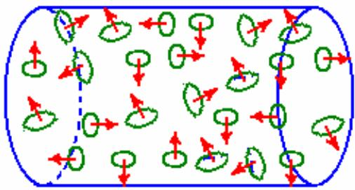

加上外磁场以后，各分子环流的磁矩在磁力矩作用下，一定程度上沿着磁场的方向排列起来，这时介质被磁化了。由图可以看出，内部任何两个分子环流方向总是彼此相反，它们的效果相互抵消。

只有在横截面边缘上各段电流元未被抵消，宏观上看来，这横截面内所有分子环流的总体与沿截面边缘的一个大环形电流等效。

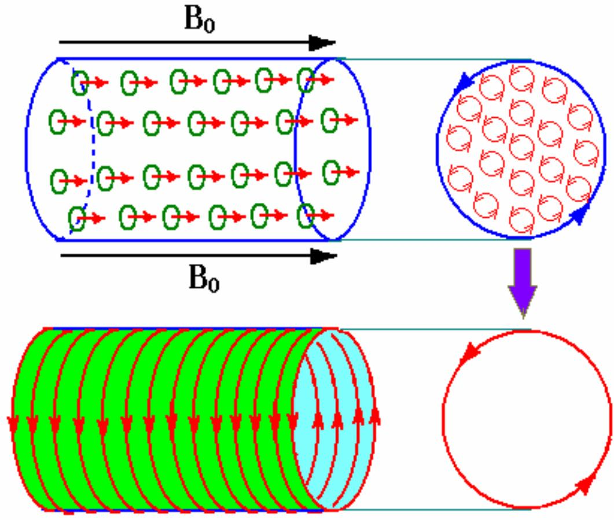

❑磁化电流：磁介质因磁化而出现的宏观电流。无带电粒子的宏观运动，它起源于电荷的微观运动，正是这个磁化电流产生了附加磁场。

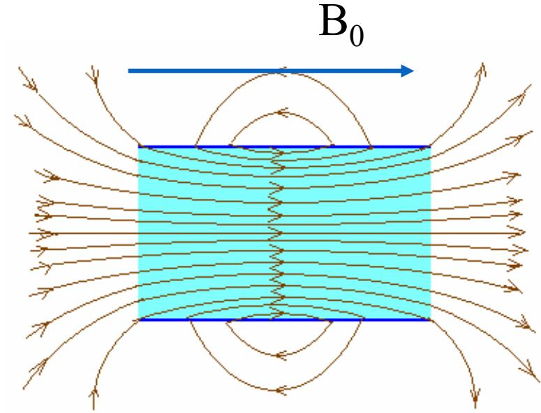

整体看来，磁化了的介质棒就象一个由磁化电流组成的“螺线管”。这个磁化电流的“螺线管”产生的磁感应强度的方向与磁化场的方向一致，因而在棒内的总磁感应强度增强了。

❑磁介质内的总磁场

$$
\vec {B} = \vec {B} _ {0} + \vec {B} ^ {\prime}
$$

# 磁化强度

❑单位体积内分子磁矩的矢量和称作磁介质的磁化强度。

$$
\vec {M} = \frac {\sum \vec {p} _ {m i}}{\Delta V} = N \vec {p} _ {m}
$$

$\vec { p } _ { m } = i \Delta \vec { S }$ 某一分子的磁矩矢量

N为单位体积内的分子数

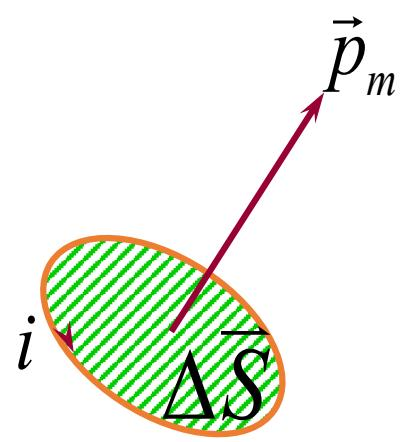

❑M 的单位 安每米 （A/m）

❑磁化强度矢量是一个能够反映磁介质磁化状态或磁化程度的物理量。

# 磁化电流与磁化强度之间的关系

❑以顺磁质为例,等效分子电流为i，面积为ΔS，分子磁矩为 $\vec { p } _ { m }$ , $\vec { p } _ { m }$ 与 $\vec { M }$ 方向相同。

❑任取一微小矢量元 $d \vec { l }$ ，它与磁感应强度 $\vec { M }$ 的夹角为，则与 $d \vec { l }$ 套住的分子电流的中心都是位于以 $d \vec { l }$ 为轴、 ΔS为底面积的斜柱体内。

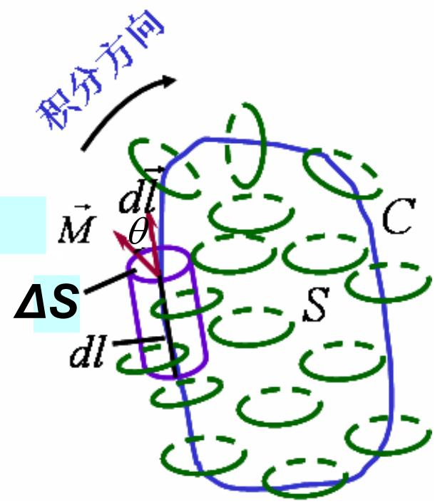

未被C链串的分子对S上的磁化电流无贡献

❑若单位体积内的分子数为 $N$ ， 则与 $d \vec { l }$ 套链的总分子电流为

单位体积分子数 $\begin{array} { l } { { d I _ { M } = N \big ( \underbrace { \Delta S d l \cos \theta } _ { \big | } i \ = N p _ { m } d l \cos \theta } } \\ { { \texttt { \# } \underbrace { \Sigma } } } \end{array}$ 分子电流斜圆柱体体积

$$
\begin{array}{l} = M d l \cos \theta \\ = \vec {M} \cdot d \vec {l} \\ \end{array}
$$

$$
d I _ {M} = \vec {M} \cdot d \vec {l}
$$

❑在磁介质内，任一面积S上的磁化电流等于磁化强度沿该曲面周界L的线积分，即磁化强度的环流

$$
d I _ {M} = \vec {M} \cdot \mathrm {d} \vec {l}
$$

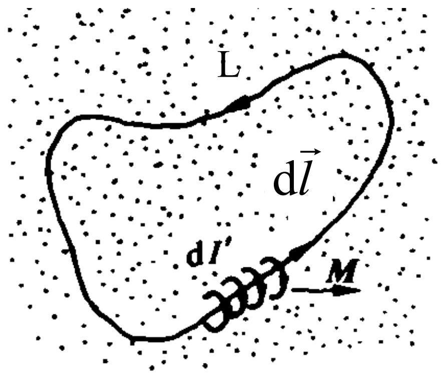

$$
I _ {M} = \oint_ {L} \mathrm {d} I _ {M} = \oint_ {L} \vec {M} \cdot \mathrm {d} \vec {l} = \int_ {S} \left(\nabla \times \vec {M}\right) \cdot \mathrm {d} \vec {S}
$$

磁化体电流密度 $\vec { J } _ { M } = \nabla \times \vec { M }$ 

# 磁化电流的面密度

在均匀磁介质内部无磁化电流体分布，只有在均匀磁介质表面上和两种不同均匀磁介质的交界面上才存在着面分布的磁化电流。

通过与电流方向垂直的单位长度的面磁化电流强度叫做磁化面电流密度。

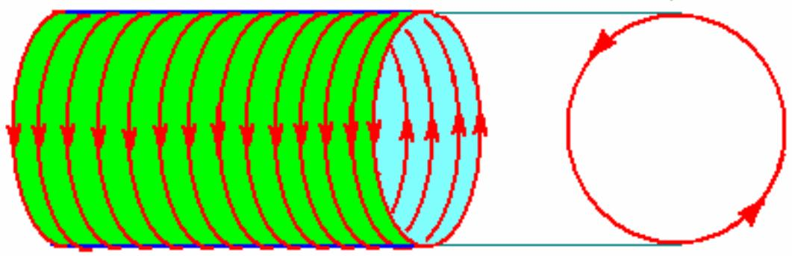

# 在紧贴磁介质表面取一长度元

# dl， 与此交链的磁化电流为

$$
\begin{array}{l} \mathrm {d} I _ {M} = - \vec {M} \cdot \mathrm {d} \vec {l} = - \vec {M} \cdot (\vec {e} _ {t} \times \vec {e} _ {n}) \mathrm {d} l \\ = - \vec {e} _ {t} \cdot (\vec {e} _ {n} \times \vec {M}) d l = (\vec {M} \times \vec {e} _ {n}) \cdot \vec {e} _ {t} d l \\ \end{array}
$$

$$
I _ {M} = \int_ {l} \left(\vec {M} \times \vec {e} _ {n}\right) \cdot \vec {e} _ {t} \mathrm {d} l
$$

$$
i = \int_ {l} \vec {J} _ {S} \cdot \vec {e} _ {t} \mathrm {d} l
$$

第五版(2.1.16)式第六版(2.1.17)式

则 大小： $J _ { { \scriptscriptstyle S M } } = M _ { { \scriptscriptstyle t } }$ 

$\vec { M }$ 的切向分量

矢量： J $\vec { J } _ { S M } = \vec { M } \times \vec { e } _ { n }$ 

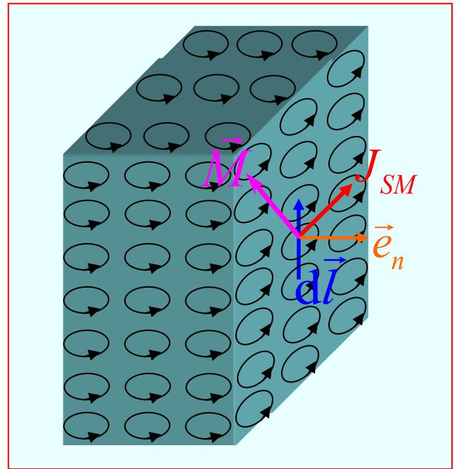

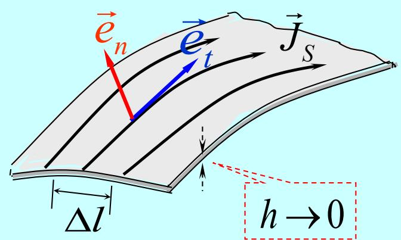

面电流密度矢量

# 2.5 物质空间中媒质的电磁效应

# 4. 磁场强度 介质中安培环路定理

外加磁场使介质发生磁化，磁化导致磁化电流。磁化电流同样也激发磁感应强度，两种相互作用达到平衡，介质中的磁感应强度 $\vec { B }$ 应是所有电流源激励的结果：

$$
\nabla \times \vec {B} = \mu_ {0} (\vec {\mathcal {J}} + \vec {\mathcal {J}} _ {M}) \oint_ {\mathcal {C}} \vec {B} \cdot \mathrm {d} \vec {I} = \mu_ {0} \int_ {S} (\vec {\mathcal {J}} + \vec {\mathcal {J}} _ {M}) \cdot \mathrm {d} \vec {S}
$$

JM $\vec { J } , \ \vec { J } _ { M }$ 分别是传导电流密度和磁化电流密度。

将磁化体电流密度表达式 $\vec { J } _ { M } = \nabla \times \vec { M }$ 代入 $\nabla \times { \vec { B } } = \mu _ { \scriptscriptstyle 0 } ( { \vec { J } } + { \vec { J } } _ { \scriptscriptstyle M } )$ 

有

$$
\nabla \times (\frac {\vec {B}}{\mu_ {0}} - \vec {M}) = \vec {J} \qquad \nabla \times \vec {H} (\vec {r}) = \vec {J} (\vec {r})
$$

, 定义磁场强度 H 为：  $\vec { H } \ = \ \frac { \vec { B } } { \mu _ { \scriptscriptstyle 0 } } - \ \vec { M } ,$ 即 $\vec { B } = \mu _ { \scriptscriptstyle 0 } ( \vec { H } + \vec { M } )$ 

则得到介质中的安培环路定理为：

$$
\oint_ {C} \vec {H} (\vec {r}) \cdot \mathrm {d} \vec {I} = \int_ {S} \vec {J} (\vec {r}) \cdot \mathrm {d} \vec {S} \qquad \nabla \times \vec {H} (\vec {r}) = \vec {J} (\vec {r})
$$

磁通连续性定理为 $\oint _ { S } \vec { B } ( \vec { r } ) \cdot \mathrm { d } \vec { S } \ = \ 0 \qquad \nabla \cdot \vec { B } ( \vec { r } ) \ = \ 0$ $\oint _ { S } \vec { B } ( \vec { r } ) \cdot \mathrm { d } \vec { S } = 0$ $\nabla \cdot { \vec { B } } ( { \vec { r } } ) = 0$ 

小结：恒定磁场是无源有旋场，磁介质中的基本方程为

（微分形式）

$$
\left\{ \begin{array}{l} \nabla \times \vec {H} (\vec {r}) = \vec {\mathcal {J}} (\vec {r}) \\ \nabla \cdot \vec {B} (\vec {r}) = 0 \end{array} \right.
$$

（积分形式）

$$
\left\{ \begin{array}{l} \oint_ {C} \vec {H} (\vec {r}) \cdot \mathrm {d} \vec {I} = \int_ {S} \vec {J} (\vec {r}) \cdot \mathrm {d} \vec {S} \\ \oint_ {S} \vec {B} (\vec {r}) \cdot \mathrm {d} \vec {S} = 0 \end{array} \right.
$$

磁化强度 和磁场强度 $\vec { H }$ 之间的关系由磁介质的物理性质决定，对于线性各向同性介质， 与 $\vec { H }$ 之间存在简单的线性关系： $\vec { M } = \chi _ { _ { m } } \vec { H }$ 

其中， $\chi _ { m }$ 称为介质的磁化率（也称为磁化系数） 

这种情况下 $\vec { B } = \mu _ { \scriptscriptstyle 0 } ( 1 + \chi _ { \scriptscriptstyle m } ) \vec { H } = \mu \vec { H }$ 

其中 $\mu = \mu _ { \scriptscriptstyle 0 } ( 1 + \chi _ { \scriptscriptstyle m } ) = \mu _ { \scriptscriptstyle r } \mu _ { \scriptscriptstyle 0 }$ 称为介质的磁导率， $\mu _ { _ { r } } \ : = \ : 1 + \ : \chi _ { _ { m } }$ 称为介质的相对磁导率（无量纲） 

磁介质的分类

$$
\mu_ {\mathit {\Pi} _ {r}} > 1
$$

顺磁质

$$
\mu_ {r} <   1
$$

抗磁质

$$
\mu_ {r} \gg 1
$$

铁磁质

# 3.电介质的本构关系

对于所有电介质，式(2.4.10)都是成立的。若是线性和各向同性的电介质，将式(2.4.3)代人式(2.4.10)，得

$$
\begin{array}{l} \boldsymbol {D} (\boldsymbol {r}) = \varepsilon_ {0} \boldsymbol {E} (\boldsymbol {r}) + \chi_ {\mathrm {e}} \varepsilon_ {0} \boldsymbol {E} (\boldsymbol {r}) = (1 + \chi_ {\mathrm {e}}) \varepsilon_ {0} \boldsymbol {E} (\boldsymbol {r}) \\ = \varepsilon_ {r} \varepsilon_ {0} \boldsymbol {E} (\boldsymbol {r}) = \varepsilon \boldsymbol {E} (\boldsymbol {r}) \tag {2.4.13} \\ \end{array}
$$

式中的 $\varepsilon = \varepsilon _ { 0 } \varepsilon$ ，称为电介质的介电常数，单位为 $\mathbf { F } / \mathbf { m }$ (法拉/米)。 $\tt { e } _ { \tt { r } } = 1 + \chi _ { \tt { e } }$ 称为电介质的相对介电常数,无量纲。表2.4.1列出部分电介质的相对介电常数的近似值。

# 3．磁介质的本构关系

对所有的磁介质，式(2.4.23)都是成立的。实验表明，对于线性和各向同性磁介质，磁化强度 $\pmb { M }$ 与磁场强度 $\pmb { H }$ 成正比，表示为

$$
\boldsymbol {M} = \chi_ {\mathrm {m}} \boldsymbol {H} \tag {2.4.26}
$$

式中的 $\chi _ { \mathfrak { m } }$ 称为磁介质的磁化率，是一个无量纲的常数，不同的磁介质有不同的磁化率。

将式(2.4.26)代人式(2.4.23)，得H=B $\pmb { H } = \frac { \pmb { B } } { \pmb { \mu } _ { 0 } } - \pmb { \chi } _ { \mathrm { m } } \pmb { H }$ -xmH,即

$$
\boldsymbol {B} = (1 + \chi_ {\mathrm {m}}) \mu_ {0} \boldsymbol {H} = \mu_ {\mathrm {r}} \mu_ {0} \boldsymbol {H} = \mu \boldsymbol {H} \tag {2.4.27}
$$

本节例题： 半径 $r = a$ 的球形磁介质的磁化强度为 $\pmb { M } = e _ { z } \big ( A z ^ { 2 } + B \big )$ ，如图2.4.5所示。式中的A、B为常数，求磁化电流密度。

解：磁化电流体密度为

$$
\begin{array}{l} \boldsymbol {J} _ {M} = \boldsymbol {\nabla} \times \boldsymbol {M} \\ = \left(\boldsymbol {e} _ {x} \frac {\partial}{\partial x} + \boldsymbol {e} _ {y} \frac {\partial}{\partial y} + \boldsymbol {e} _ {z} \frac {\partial}{\partial z}\right) \times \boldsymbol {e} _ {z} (A z ^ {2} + B) = 0 \\ \end{array}
$$

$r = a$ 处的磁化电流面密度为

$$
\boldsymbol {J} _ {\mathbf {S M}} = \boldsymbol {M} \times \boldsymbol {e} _ {\mathrm {n}} | _ {r = a}
$$

式中的 $\pmb { e _ { n } } = \pmb { e _ { r } }$ 。在球面上任一点,有 $z = a \cos \theta$ $\theta$ ，,而直角

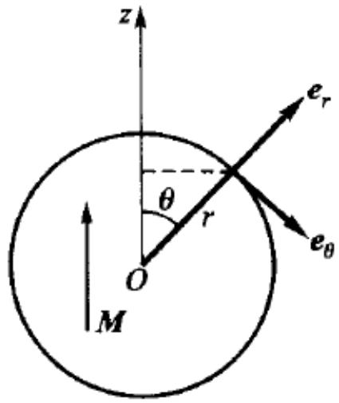

图2.4.5球形磁介质的磁化强度

坐标系中的单位矢量 $\pmb { e } _ { z }$ 换成球坐标系中的单位矢量表示为

$$
\boldsymbol {e} _ {z} = \boldsymbol {e} _ {r} \cos \theta - \boldsymbol {e} _ {\theta} \sin \theta
$$

所以题目所给的磁化强度换成球坐标系表示为

$$
\boldsymbol {M} = \left(\boldsymbol {e} _ {r} \cos \theta - \boldsymbol {e} _ {\theta} \sin \theta\right) \left(A a ^ {2} \cos^ {2} \theta + B\right)
$$

故

$$
\begin{array}{l} J _ {\mathrm {S M}} = \left(\boldsymbol {e} _ {r} \cos \theta - \boldsymbol {e} _ {\theta} \sin \theta\right) \left(A a ^ {2} \cos^ {2} \theta + B\right) \times \boldsymbol {e} _ {r} \\ = e _ {\phi} \left(A a ^ {2} \cos^ {2} \theta + B\right) \sin \theta \\ \end{array}
$$

本节例题： 内、外半径分别为 $\rho _ { \sf P } = a$ 和 $p _ { \nparallel } = b$ 的圆筒形磁介质中，沿轴向有电流密度为 ${ \bf { J } } = { \bf { e } } _ { \bf { \infty } } { \bf { J } } _ { 0 }$ 的传导电流，如图2.4.6所示。设磁介质的磁导率为 $\pmb { \mu }$ 求磁化电流分布。

解：设圆筒形磁介质为无限长，则其磁场分布具有轴对称性，可利用安培环路定理求各个区域内由传导电流 $\pmb { J }$ 产生的磁场分布。

在 $\rho < \alpha$ 的区域,根据式(2.4.25),得

$$
2 \pi \rho H _ {1 \phi} = 0
$$

故 $\pmb { H } _ { 1 } = \pmb { 0 } , \pmb { B } _ { 1 } = \pmb { 0 }$ 

在 $\alpha < \rho < b$ 的区域,得

$$
2 \pi \rho H _ {2 \phi} = J _ {0} \pi \left(\rho^ {2} - a ^ {2}\right)
$$

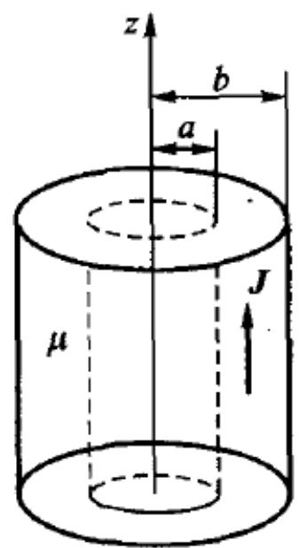

在 $\alpha < \rho < b$ 的区域,得

$$
2 \pi \rho H _ {2 \phi} = J _ {0} \pi \left(\rho^ {2} - a ^ {2}\right)
$$

故

$$
H _ {2} = e _ {\phi} H _ {2 \phi} = e _ {\phi} \frac {J _ {0}}{2 \rho} (\rho^ {2} - a ^ {2})
$$

$$
\boldsymbol {B} _ {2} = \mu \boldsymbol {H} _ {2} = e _ {\phi} \frac {\mu J _ {0}}{2 \rho} (\rho^ {2} - a ^ {2})
$$

在 $\rho > b$ 的区域,得

$$
2 \pi \rho H _ {3 \phi} = J _ {0} \pi (b ^ {2} - a ^ {2})
$$

故

$$
\boldsymbol {H} _ {3} = e _ {\phi} H _ {3 \phi} = e _ {\phi} \frac {J _ {0}}{2 \rho} (b ^ {2} - a ^ {2})
$$

$$
\boldsymbol {B} _ {3} = \mu_ {0} \boldsymbol {H} _ {3} = e _ {\phi} \frac {\mu_ {0} J _ {0}}{2 \rho} (b ^ {2} - a ^ {2})
$$

磁介质的磁化强度

$$
\begin{array}{l} \boldsymbol {M} = \frac {\boldsymbol {B} _ {2}}{\mu_ {0}} - \boldsymbol {H} _ {2} = \left(\frac {\mu}{\mu_ {0}} - 1\right) \boldsymbol {H} _ {2} = e _ {\phi} \frac {\mu - \mu_ {0}}{2 \mu_ {0} \rho} J _ {0} (\rho^ {2} - a ^ {2}) \\ (a <   \rho <   b) \\ \end{array}
$$

则磁介质圆筒内的磁化电流密度为

$$
\boldsymbol {J} _ {M} = \boldsymbol {\nabla} \times \boldsymbol {M} = \frac {1}{\rho} \left| \begin{array}{l l l} \boldsymbol {e} _ {\rho} & \boldsymbol {e} _ {\phi} & \boldsymbol {e} _ {z} \\ \frac {\partial}{\partial \rho} & \frac {\partial}{\partial \phi} & \frac {\partial}{\partial z} \\ M _ {\rho} & \rho M _ {\phi} & M _ {z} \end{array} \right| = \frac {1}{\rho} \boldsymbol {e} _ {z} \frac {\mathrm {d}}{\mathrm {d} \rho} (\rho M _ {\phi}) = \boldsymbol {e} _ {z} \frac {\mu - \mu_ {0}}{\mu_ {0}} J _ {0}
$$

在磁介质圆筒内表面 $\rho = a$ 上，

$$
J _ {S M} = \left. \boldsymbol {M} \times \boldsymbol {e} _ {\mathrm {n}} = \boldsymbol {M} \times \left(- \boldsymbol {e} _ {\rho}\right) \right| _ {\rho = a} = \left. \boldsymbol {e} _ {z} \frac {\mu - \mu_ {0}}{2 \mu_ {0} a} J _ {0} \left(a ^ {2} - a ^ {2}\right) = 0 \right.
$$

在磁介质圆筒外表面 $\rho = b$ 上，

$$
J _ {S M} = \boldsymbol {M} \times \boldsymbol {e} _ {\mathrm {n}} = \boldsymbol {M} \times \left. \boldsymbol {e} _ {\rho} \right| _ {\rho = b} = - \left. \boldsymbol {e} _ {z} \frac {\mu - \mu_ {0}}{2 \mu_ {0} b} J _ {0} \left(b ^ {2} - a ^ {2}\right) \right.
$$

# 2.5 物质空间中媒质的电磁效应

# 媒质的传导特性

❖ 定义 存在可以自由移动带电粒子的介质称为导电媒质。在外场作用下，导电媒质中将形成定向移动电流。

❖ 公式 对于线性和各向同性导电媒质，媒质内任一点的电流密度矢量 J和电场强度 E成正比，表示为

$$
\vec {J} = \sigma \vec {E}
$$

这就是欧姆定律的微分形式。式中的比例系数 $\sigma$ 称为媒质的电导率，单位是S/m（西门子/米） 

表2.4.3部分材料的相对电导率

<table><tr><td>材料</td><td>电导率/(S/m)</td><td>材料</td><td>电导率/(S/m)</td></tr><tr><td>海水</td><td>4</td><td>铅</td><td>5×106</td></tr><tr><td>铁氧体</td><td>102</td><td>锡</td><td>9×106</td></tr><tr><td>硅</td><td>2.6×103</td><td>黄铜</td><td>1.46×107</td></tr><tr><td>石墨</td><td>105</td><td>锌</td><td>1.7×107</td></tr><tr><td>铸铁</td><td>106</td><td>钨</td><td>1.8×107</td></tr><tr><td>汞</td><td>1.04×106</td><td>铝</td><td>3.53×107</td></tr><tr><td>不锈钢</td><td>106</td><td>金</td><td>4.1×107</td></tr><tr><td>康铜</td><td>2.04×106</td><td>铜</td><td>5.8×107</td></tr><tr><td>硅钢</td><td>2×106</td><td>银</td><td>6.2×107</td></tr></table>

❖ 推导 ${ \vec { J } } = \sigma { \vec { E } }$ 导电媒质导电率

体积元内存在： E,J

由欧姆定律：

$$
\mathrm {d} I = \frac {\mathrm {d} U}{R} \Rightarrow \overrightarrow {J} \cdot \mathrm {d} \overrightarrow {S} = \frac {\overrightarrow {E} \cdot \mathrm {d} \overrightarrow {l}}{\frac {\mathrm {d} l}{\sigma d S}}
$$

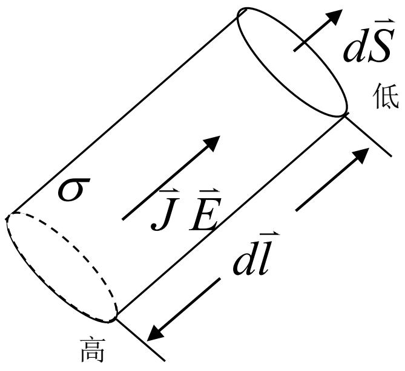

- j-oe 场本构关系。

# 2.5 物质空间中媒质的电磁效应

# 讨论:

$\vec { J } = \sigma \vec { E } \qquad \vec { E } = \frac { \vec { J } } { \sigma }$ 

在理想导体内， 恒定电场为0；

恒定电场可以存在于非理想导体内。

2)在导电媒质内，

恒定电场 E $\vec { E }$ 和 的方向相同J

# 焦耳定律

小体积元内，产生的焦耳热功率为：

$$
d P = \frac {U ^ {2}}{R} \quad = \frac {E ^ {2} d l ^ {2}}{\frac {d l}{\sigma d S}} = \sigma E ^ {2} d S d l
$$

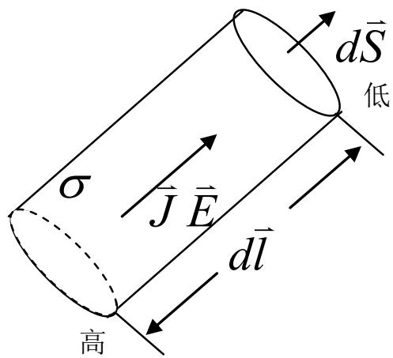

所以， 单位体积功率损耗为：

$$
p = \frac {P}{d V} = \sigma E ^ {2} = \vec {J} \cdot \vec {E}
$$

导电媒质焦耳功率损耗密度

# 2.5 物质空间中媒质的电磁效应

<table><tr><td>媒质的电磁特性</td><td>描述</td></tr><tr><td>极化特性</td><td>介电常数ε</td></tr><tr><td>磁化特性</td><td>磁导率μ</td></tr><tr><td>导电特性</td><td>电导率σ</td></tr></table>

真空： $\varepsilon = \varepsilon _ { 0 } , \mu = \mu _ { 0 }$ $\varepsilon = \varepsilon _ { 0 }$ ，且 $\sigma = 0$ 

理想介质： $\varepsilon = \varepsilon _ { \scriptscriptstyle 0 } \varepsilon _ { \scriptscriptstyle r } , \mu = \mu _ { \scriptscriptstyle 0 } \mu _ { \scriptscriptstyle r }$ ，且 $\sigma = 0$ 

理想电介质： $\varepsilon = \varepsilon _ { \scriptscriptstyle 0 } \varepsilon _ { \scriptscriptstyle r } , \mu = \mu _ { \scriptscriptstyle 0 }$ ，且 $\sigma = 0$ 

理想磁介质： $\varepsilon = \varepsilon _ { \scriptscriptstyle 0 } , \mu = \mu _ { \scriptscriptstyle 0 } \mu _ { \scriptscriptstyle r }$ ，且 $\sigma = 0$ 

理想导电媒质： $\varepsilon = \varepsilon _ { 0 } , \mu = \mu _ { 0 }$ ，且 $\sigma \neq 0$ 

导电媒质： $\sigma \neq 0 , \varepsilon _ { r } \neq 1$ $\sigma \neq 0$ 与/或 $\mu _ { r } \neq 1$ ；

强导电媒质：电场作用下,其中的传导电流远大于位移电流;

弱导电媒质：电场作用下,其中的传导电流远小于位移电流；

理想(电)导体： $\sigma = \infty$ ,其中的电磁场总是为零；

理想磁导体： ${ \bf \nabla } _ { \mu _ { r } } = \infty$ ,其中的电磁场总是为零。

# 2.6 物质空间中的电磁场因果规律

麦克斯韦方程组 宏观电磁现象所遵循的基本规律，是电磁场的基本方程。

# 麦克斯韦方程组的积分形式

$$
\left\{ \begin{array}{l} \oint_ {C} \vec {H} \cdot \mathrm {d} \vec {l} = \int_ {S} (\vec {J} + \frac {\partial \vec {D}}{\partial t}) \cdot \mathrm {d} \vec {S} \\ \oint_ {C} \vec {E} \cdot \mathrm {d} \vec {l} = - \int_ {S} \frac {\partial \vec {B}}{\partial t} \cdot \mathrm {d} \vec {S} \\ \oint_ {S} \vec {B} \cdot \mathrm {d} \vec {S} = 0 \\ \oint_ {S} \vec {D} \cdot \mathrm {d} \vec {S} = \int_ {V} \rho \mathrm {d} V \end{array} \right.
$$

$$
\oint_ {S} \vec {\mathbf {J}} \cdot \mathrm {d} \vec {\mathbf {S}} = - \frac {\mathrm {d}}{\mathrm {d} t} \int_ {V} \rho \mathrm {d} V
$$

# 麦克斯韦方程组的微分形式

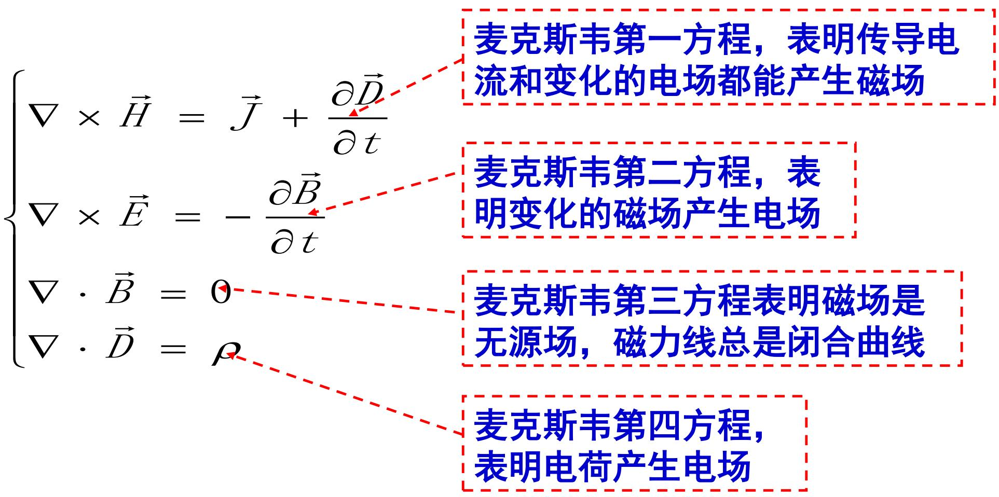

# 媒质的本构关系

各向同性线性媒质的本构关系为

$$
\vec {D} = \varepsilon \vec {E} \quad \vec {B} = \mu \vec {H} \quad \vec {J} = \sigma \vec {E}
$$

代入麦克斯韦方程组中， 有：

限定形式的麦克斯韦方程

$$
\left\{ \begin{array}{l} \nabla \times \vec {H} = \sigma \vec {E} + \frac {\partial}{\partial t} (\varepsilon \vec {E}) \\ \nabla \times \vec {E} = - \frac {\partial}{\partial t} (\mu \vec {H}) \\ \nabla \cdot (\mu \vec {H}) = 0 \\ \nabla \cdot (\varepsilon \vec {E}) = \rho \end{array} \right.
$$

（均匀媒质）

$$
\left\{ \begin{array}{l} \nabla \times \vec {H} = \sigma \vec {E} + \varepsilon \frac {\partial \vec {E}}{\partial t} \\ \nabla \times \vec {E} = - \mu \frac {\partial \vec {H}}{\partial t} \\ \nabla \cdot \vec {H} = 0 \\ \nabla \cdot \vec {E} = \rho / \varepsilon \end{array} \right.
$$

# 麦克斯韦方程组的独立性和限定性

对于不随时间变化的静态场,则

$$
\frac {\partial \boldsymbol {B}}{\partial t} = \frac {\partial \boldsymbol {D}}{\partial t} = 0
$$

由麦克斯韦方程组，即得到

$$
\nabla \times H = J \tag {2.6.9}
$$

$$
\nabla \cdot \boldsymbol {B} = 0 \tag {2.6.10}
$$

$$
\nabla \times E = 0 \tag {2.6.11}
$$

$$
\nabla \cdot D = \rho \tag {2.6.12}
$$

这正是恒定磁场方程和静电场方程,电场与磁场不再相关,彼此独立。

时变情况下,麦克斯韦方程组中的两个旋度方程与电流连续性方程或电位移矢量满足的高斯定律一起,可构成求解电磁问题的独立方程式,称为独立形式的麦克斯韦方程。即

$$
\left\{ \begin{array}{l} \boldsymbol {\nabla} \times \boldsymbol {E} = - \frac {\partial \boldsymbol {B}}{\partial t} \\ \boldsymbol {\nabla} \times \boldsymbol {H} = \boldsymbol {J} + \frac {\partial \boldsymbol {D}}{\partial t} \\ \boldsymbol {\nabla} \cdot \boldsymbol {J} = - \frac {\partial \rho}{\partial t} \text {o r} \boldsymbol {\nabla} \cdot \boldsymbol {D} = \rho \end{array} \right.
$$

❑ 时变电场的激发源除了电荷以外，还有变化的磁场；而时变磁场的激发源除了传导电流以外，还有变化的电场。电场和磁场互为激发源，相互激发。

时变电磁场的电场和磁场不再相互独立， 而是相互关联，构成一个整体 电磁场。电场和磁场分别是电磁场的两个分量。

❑ 在离开辐射源（如天线）的无源空间中，电荷密度和电流密度矢量为零，电场和磁场仍然可以相互激发，从而在空间形成电磁振荡并传播，这就是电磁波。

在无源空间中，两个旋度方程分别为

$$
\nabla \times \vec {H} = \frac {\partial \vec {D}}{\partial t}, \qquad \nabla \times \vec {E} = - \frac {\partial \vec {B}}{\partial t}
$$

❑ 可以看到两个方程的右边相差一个负号，而正是这个负号使得电场和磁场构成一个相互激励又相互制约的关系。当磁场减小时，电场的漩涡源为正，电场将增大；而当电场增大时，使磁场增大，磁场增大反过来又使电场减小。

小结： 麦克斯韦方程适用范围：一切宏观电磁现象

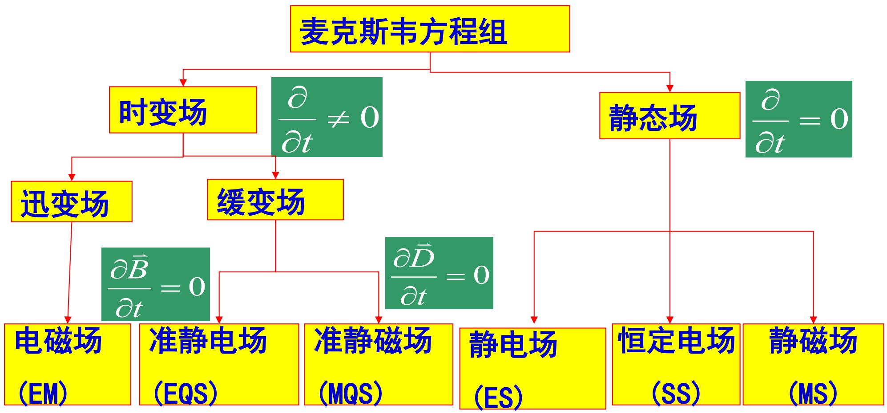

# 2.6 物质空间中的电磁场因果规律

例：正弦交流电压源 $u = U _ { m }$ 连接到平行板电容器的两个极板上，如图所示。(1) 证明电容器两极板间的位移电流与连接导线中的传导电流相等；(2)求导线附近距离连接导线为r 处的磁场强度。

解：( 1 ) 导线中的传导电流为

$$
\begin{array}{l} i _ {c} = C \frac {\mathrm {d} u}{\mathrm {d} t} = C \frac {\mathrm {d}}{\mathrm {d} t} (U _ {m} \sin \omega t) \\ = C \omega U _ {m} \cos \omega t \\ \end{array}
$$

忽略边缘效应时，间距为d的两平行板之间的电场为 $E = \pmb { u } / d$ ，则

$$
D = \varepsilon E = \frac {\varepsilon U _ {m} \sin \omega t}{d}
$$

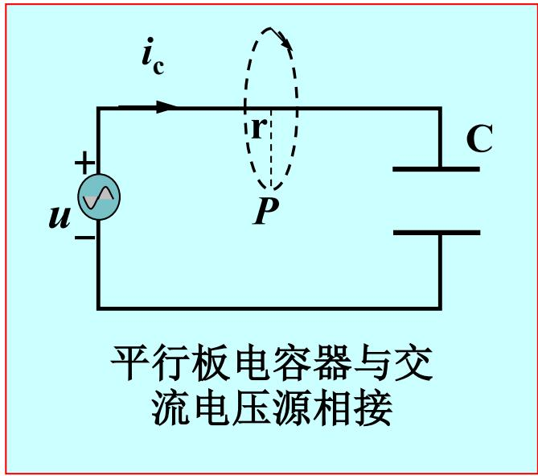

则极板间的位移电流为

$$
i = \int_ {S} \boldsymbol {J} _ {d} \cdot \mathrm {d} \boldsymbol {S} = \int_ {S} \frac {\partial D}{\partial t} \mathrm {d} S = \frac {\varepsilon U _ {m} \omega}{d} \cos \omega t \cdot S _ {0} = C \omega U _ {m} \cos \omega t = i _ {c}
$$

式中的 $S _ { \mathbf { 0 } }$ 为极板的面积，而 $\frac { \varepsilon S _ { 0 } } { d } = C$ 为平行板电容器的电容。

( 2 ) 以 r为半径作闭合曲线 $C _ { ! }$ ，由于连接导线本身的轴对称性，使得沿闭合线的磁场相等，故

$$
\oint_ {c} \vec {H} \cdot \mathrm {d} \vec {l} = 2 \pi r H _ {\phi}
$$

与闭合线铰链的只有导线中的传导电流 $i _ { c } = C \omega U _ { m }$ cos t ， 故

得

$$
2 \pi r H _ {\phi} = C \omega U _ {m} \cos \omega t
$$

$$
\Longrightarrow \vec {H} = \vec {e} _ {\phi} H _ {\phi} = \vec {e} _ {\phi} \frac {C \omega U _ {m}}{2 \pi r} \cos \omega t
$$

例 ：在无源 $( \vec { J } = 0 \rho = 0 )$ 的理想介质 $( \sigma = 0 )$ 中，若已知电场强度矢量 $\vec { E } = \vec { e } _ { x } E _ { 0 }$ $\vec { E } = \vec { e } _ { x } E _ { 0 } \cos ( \omega t - k z ) \mathrm { V / m }$ ，式中的 $E _ { 0 }$ 为振幅、 $\pmb { \omega }$ 为角频率、k为相位常数。试确定k与 $\omega$ 之间所满足的关系，并求出与 $\vec { E }$ 相应的其它场矢量。

解： $\vec { E }$ 是电磁场的场矢量，应满足麦克斯韦方程组。因此，利用麦克斯韦方程组可以确定 $\pmb { k }$ 与ω 之间所满足的关系，以及与 $\vec { E }$ 相应的其它场矢量。

$$
\begin{array}{l} \frac {\partial \vec {B}}{\partial t} = - \nabla \times \vec {E} = - (\vec {e} _ {x} \frac {\partial}{\partial x} + \vec {e} _ {y} \frac {\partial}{\partial y} + \vec {e} _ {z} \frac {\partial}{\partial z}) \times \vec {e} _ {x} E _ {x} \\ = - \vec {e} _ {y} \frac {\partial E _ {x}}{\partial z} = - \vec {e} _ {y} \frac {\partial}{\partial z} \big [ E _ {0} \cos (\omega t - k z) \big ] = - \vec {e} _ {y} k E _ {0} \sin (\omega t - k z) \\ \end{array}
$$

对时间t积分，得 B=ey $\vec { B } = \vec { e } _ { y } \frac { k E _ { m } } { \omega } \cos ( \omega t - k z )$ kEm

$$
\vec {B} = \mu \vec {H} \quad \Longrightarrow \quad \vec {H} = \vec {e} _ {y} \frac {k E _ {m}}{\mu \omega} \cos (\omega t - k z)
$$

$$
\vec {D} = \varepsilon \vec {E} \quad \Longrightarrow \quad \vec {D} = \vec {e} _ {x} \varepsilon E _ {m} \cos (\omega t - k z)
$$

以上各个场矢量都应满足麦克斯韦方程，将以上得到的 H 和 D代入式

$$
\nabla \times \vec {H} = \left| \begin{array}{l l l} \vec {e} _ {x} & \vec {e} _ {y} & \vec {e} _ {z} \\ \frac {\partial}{\partial x} & \frac {\partial}{\partial y} & \frac {\partial}{\partial z} \\ H _ {x} & H _ {y} & H _ {z} \end{array} \right| = - \vec {e} _ {x} \frac {\partial H _ {y}}{\partial z} = - \vec {e} _ {x} \frac {k ^ {2} E _ {m}}{\omega \mu} \sin (\omega t - k z)
$$

$$
\frac {\partial \vec {D}}{\partial t} = \vec {e} _ {x} \frac {\partial D _ {x}}{\partial t} = - \vec {e} _ {x} \varepsilon E _ {m} \omega \sin (\omega t - k z)
$$

由

$$
\nabla \times \vec {H} = \frac {\partial \vec {D}}{\partial t} \quad \Longrightarrow \quad k ^ {2} = \omega^ {2} \mu \varepsilon
$$

$$
k = \pm \omega \sqrt {\mu \varepsilon}
$$

将 $\pmb { D }$ 代人式（2.6.8）并注意到 $\rho = 0$ ,得

$$
\nabla \cdot \boldsymbol {D} = \frac {\partial D _ {x}}{\partial x} + \frac {\partial D _ {y}}{\partial y} + \frac {\partial D _ {z}}{\partial z} = 0
$$

将B代人式（2.6.7），得

$$
\nabla \cdot \boldsymbol {B} = \frac {\partial B _ {x}}{\partial x} + \frac {\partial B _ {y}}{\partial y} + \frac {\partial B _ {z}}{\partial z} = 0
$$

可见，只有满足条件 $k = \pm \omega \sqrt { \mu \varepsilon }$ ，矢量E以及与之相应的 $\smash { D _ { \perp } B _ { \perp } H }$ 才可能是无源电介质中的电磁场的场矢量。

# 2.7分界面上电磁场的因果规律（边界条件）

什么是电磁场的边界条件?

为什么要研究边界条件?

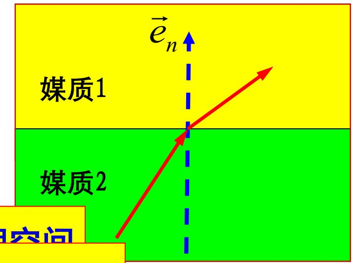

❖ 如内物理：

实际电磁场问题都是在一定的物理麦克斯韦方程组的积分形式在不同媒数学：麦克斯韦方程组是微分方程组的分界面上仍然适用，由此可导出电磁解是不确定的，边界条件起矢量在不同媒质分界面上的边界条件。

数发

作用。生突变。 麦克斯韦方程组的微分形式在分界面两侧失去意义， 必须采用边界条件。

其的

# 边界条件一般表达式

$$
\left\{ \begin{array}{l} \oint_ {C} \vec {H} \cdot \mathrm {d} \vec {I} = \int_ {S} (\vec {J} + \frac {\partial \vec {D}}{\partial t}) \cdot \mathrm {d} \vec {S} \\ \oint_ {C} \vec {E} \cdot \mathrm {d} \vec {I} = - \int_ {S} \frac {\partial \vec {B}}{\partial t} \cdot \mathrm {d} \vec {S} \\ \oint_ {S} \vec {B} \cdot \mathrm {d} \vec {S} = 0 \\ \oint_ {S} \vec {D} \cdot \mathrm {d} \vec {S} = \int_ {V} \rho d V \end{array} \right.
$$

$$
\left\{ \begin{array}{l} \vec {e} _ {n} \times (\vec {H} _ {1} - \vec {H} _ {2}) = \vec {J} _ {S} \\ \vec {e} _ {n} \times (\vec {E} _ {1} - \vec {E} _ {2}) = 0 \\ \vec {e} _ {n} \cdot (\vec {B} _ {1} - \vec {B} _ {2}) = 0 \\ \vec {e} _ {n} \cdot (\vec {D} _ {1} - \vec {D} _ {2}) = \rho_ {S} \end{array} \right.
$$

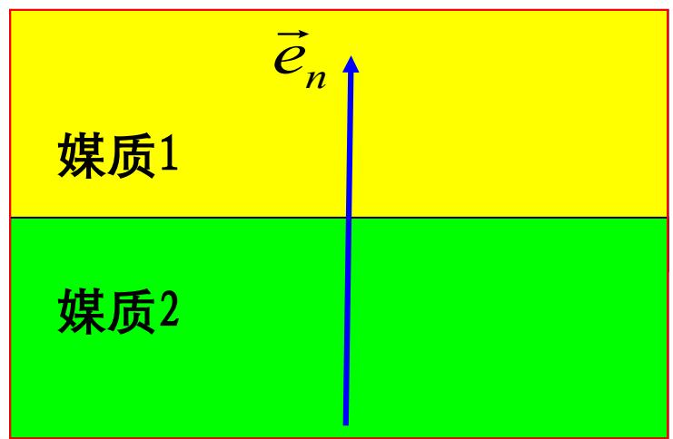

分界面上的面电荷密度

分界面上的面电流密度

# 边界条件的推证

# （1） 电磁场量的法向边界条件

在两种媒质的交界面上任取一点P，作一个包围点P的扁平圆柱曲面S，如图表示。

令 $\Delta \hbar { \longrightarrow } 0$ ，则由

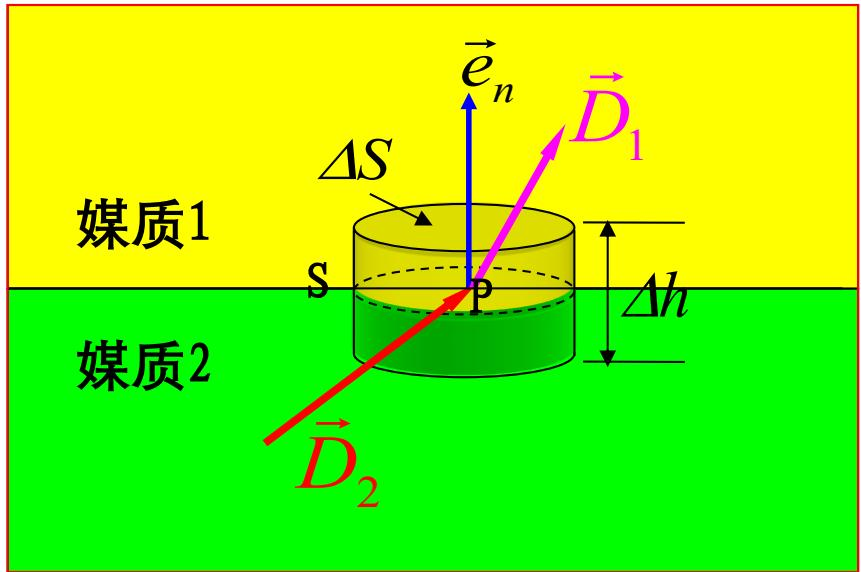

$$
\oint_ {S} \vec {D} \cdot \mathrm {d} \vec {S} = \int_ {V} \rho d V \quad \Longrightarrow \quad (\vec {D} _ {1} - \vec {D} _ {2}) \cdot \vec {e} _ {n} \Delta S = \rho_ {S} \Delta S
$$

即

$$
\vec {e} _ {n} \cdot (\vec {D} _ {1} - \vec {D} _ {2}) = \rho_ {S} \quad \text {或} \quad D _ {1 n} - D _ {2 n} = \rho_ {S}
$$

同理 ，由 $\oint _ { s } \vec { B } \cdot \mathbf { d } \vec { S } = 0 \qquad \vec { e } _ { n } \cdot ( \vec { B } _ { 1 } - \vec { B } _ { 2 } ) = 0$ 或 $\mathsf { B } _ { \mathtt { l } n } = \mathsf { B } _ { 2 n }$ 2 B

# （2） 电磁场量的切向边界条件

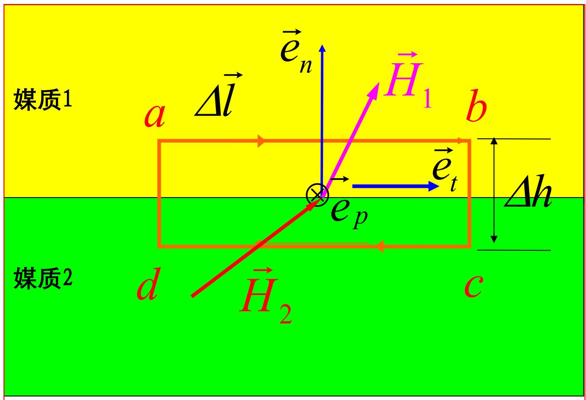

$$
\oint_ {C} \vec {H} \cdot \mathrm {d} \vec {l} = \int_ {S} (\vec {J} + \frac {\partial \vec {D}}{\partial t}) \cdot \mathrm {d} \vec {S}
$$

$b c = d a = \Delta h  0$ 时，只要分界面附近的 $H$ 为有限值，则有

$$
\lim  _ {\Delta h \rightarrow 0} \int_ {b} ^ {c} \boldsymbol {H} \cdot \mathrm {d} \boldsymbol {l} = \lim  _ {\Delta h \rightarrow 0} \int_ {d} ^ {a} \boldsymbol {H} \cdot \mathrm {d} \boldsymbol {l} = 0
$$

于是得到

$$
\begin{array}{l} \lim  _ {\Delta h \rightarrow 0} \oint_ {C} \boldsymbol {H} \cdot \mathrm {d} \boldsymbol {l} = \int_ {a} ^ {b} \boldsymbol {H} _ {1} \cdot \mathrm {d} \boldsymbol {l} + \int_ {c} ^ {d} \boldsymbol {H} _ {2} \cdot \mathrm {d} \boldsymbol {l} = \int_ {\Delta l} (\boldsymbol {H} _ {1} - \boldsymbol {H} _ {2}) \cdot \boldsymbol {e} _ {\mathrm {t}} \mathrm {d} l \\ = \lim  _ {\Delta h \rightarrow 0} \left[ \int_ {\Delta S} \boldsymbol {J} \cdot \mathrm {d} \boldsymbol {S} + \int_ {\Delta S} \frac {\partial \boldsymbol {D}}{\partial t} \cdot \mathrm {d} \boldsymbol {S} \right] \tag {2.7.1} \\ \end{array}
$$

如果分界面上存在自由面电流密度 $J _ { s }$ ，则有

$$
\lim  _ {\Delta h \rightarrow 0} \int_ {\Delta S} \boldsymbol {J} \cdot \mathrm {d} \boldsymbol {S} = \int_ {\Delta l} (\lim  _ {\Delta h \rightarrow 0} \Delta h \boldsymbol {J}) \cdot \boldsymbol {e} _ {\mathrm {p}} \mathrm {d} l = \int_ {\Delta l} \boldsymbol {J} _ {S} \cdot \boldsymbol {e} _ {\mathrm {p}} \mathrm {d} l
$$

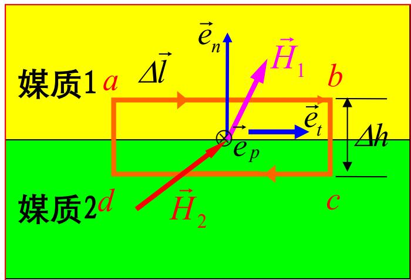

$\pmb { D }$ $D$ $\frac { \partial \pmb { D } } { \partial t }$ $\operatorname* { l i m } _ { \Delta h \to 0 } \int _ { \Delta S } \frac { \partial D } { \partial t } \cdot \mathrm { d } S = 0$ 。因此，由式（2.7.1）得到

$$
\int_ {\Delta l} \left(\boldsymbol {H} _ {1} - \boldsymbol {H} _ {2}\right) \cdot \boldsymbol {e} _ {\mathrm {t}} \mathrm {d} l = \int_ {\Delta l} \boldsymbol {J} _ {S} \cdot \boldsymbol {e} _ {\mathrm {p}} \mathrm {d} l
$$

又因为 $\Delta l$ 很小时，可以认为 $H$ 和 $J _ { s }$ 在 $\Delta l$ 上都是均匀的，于是有

$$
\int_ {\Delta l} \left(\boldsymbol {H} _ {1} - \boldsymbol {H} _ {2}\right) \cdot \boldsymbol {e} _ {t} d l \approx \left(\boldsymbol {H} _ {1} - \boldsymbol {H} _ {2}\right) \cdot \boldsymbol {e} _ {t} \Delta l
$$

$$
\int_ {\Delta l} \boldsymbol {J} _ {S} \cdot \boldsymbol {e} _ {\mathrm {p}} \mathrm {d} l \approx \boldsymbol {J} _ {S} \cdot \boldsymbol {e} _ {\mathrm {p}} \Delta l
$$

$$
\left(\boldsymbol {H} _ {1} - \boldsymbol {H} _ {2}\right) \cdot \boldsymbol {e} _ {\mathrm {t}} = \boldsymbol {J} _ {S} \cdot \boldsymbol {e} _ {\mathrm {p}}
$$

$\boldsymbol { e } _ { \mathrm { _ t } } = \boldsymbol { e } _ { \mathrm { _ p } } \times \boldsymbol { e } _ { \mathrm { _ n } }$ ，所以

$$
\left(\boldsymbol {H} _ {1} - \boldsymbol {H} _ {2}\right) \cdot \boldsymbol {e} _ {\mathrm {t}} = \left(\boldsymbol {H} _ {1} - \boldsymbol {H} _ {2}\right) \cdot \left(\boldsymbol {e} _ {\mathrm {p}} \times \boldsymbol {e} _ {\mathrm {n}}\right) = \left[ \boldsymbol {e} _ {\mathrm {n}} \times \left(\boldsymbol {H} _ {1} - \boldsymbol {H} _ {2}\right) \right] \cdot \boldsymbol {e} _ {\mathrm {p}}
$$

于是得到

$$
\left[ \boldsymbol {e} _ {\mathrm {n}} \times \left(\boldsymbol {H} _ {1} - \boldsymbol {H} _ {2}\right) \right] \cdot \boldsymbol {e} _ {\mathrm {p}} = \boldsymbol {J} _ {S} \cdot \boldsymbol {e} _ {\mathrm {p}}
$$

故得 $\vec { e } _ { n } \times ( \vec { H } _ { 1 } - \vec { H } _ { 2 } ) = \vec { J } _ { S }$ 

或

同理得 ${ \vec { e } } _ { _ n } \times ( { \stackrel {  } { E } } _ { 1 } - { \stackrel {  } { E } } _ { 2 } ) = 0$ 

或 E2t

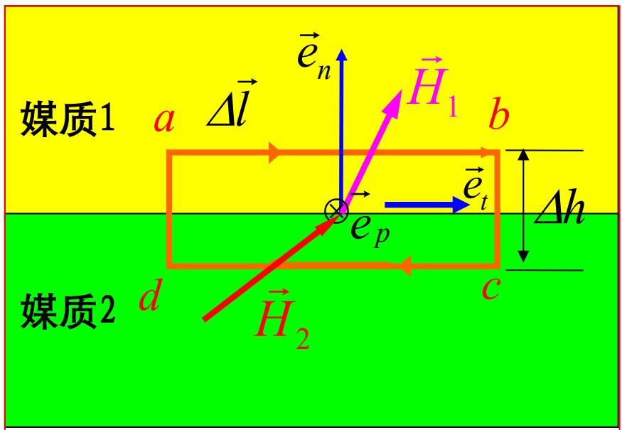

# 法向边界条件

$$
\vec {e} _ {n} \cdot (\vec {D} _ {1} - \vec {D} _ {2}) = \rho_ {S}
$$

或 $D _ { _ { 1 n } } - D _ { _ { 2 n } } = \rho _ { s }$ 

$$
\vec {e} _ {n} \cdot (\vec {B} _ {1} - \vec {B} _ {2}) = 0
$$

1n或 $\underline { { { B } } } _ { 1 \underline { { { n } } } } = \underline { { { B } } } _ { 2 \underline { { { n } } } }$ = 2n

# 切向边界条件

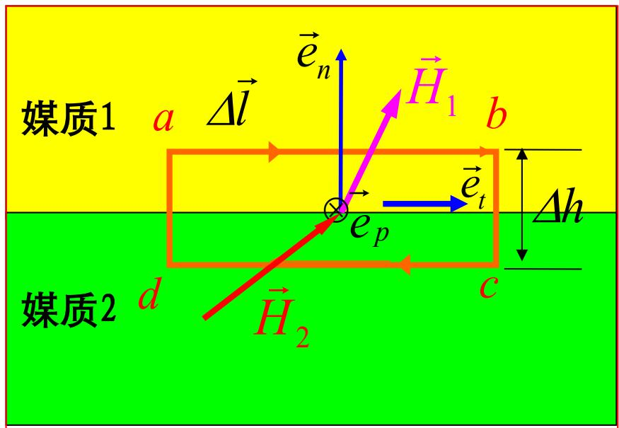

$$
\vec {e} _ {n} \times (\vec {H} _ {1} - \vec {H} _ {2}) = \vec {J} _ {S}
$$

或 $H _ { \mathrm { { l t } } } - H _ { 2 t } = J _ { S }$ 

$$
\vec {e} _ {n} \times (\overrightarrow {E} _ {1} - \overrightarrow {E} _ {2}) = 0
$$

或 $E _ { \mathrm { 1 } t } ~ = ~ E _ { \mathrm { 2 } t }$ 

# 三种常见的情况

# 1. 两种媒质均为非理想介质的分界面上的边界条件

两种媒质的电导率均为有限值时，分界面上

$$
\overrightarrow {J} _ {S} = \lim _ {\Delta h \to 0} \overrightarrow {J} \Delta h = 0
$$

媒质1

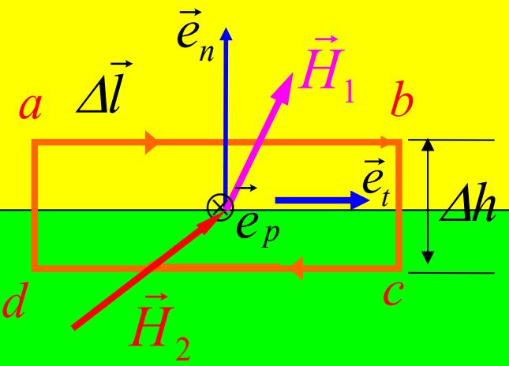

媒质2

$$
\left\{ \begin{array}{l} \vec {e} _ {n} \cdot (\vec {D} _ {1} - \vec {D} _ {2}) = \rho_ {S} \\ \vec {e} _ {n} \cdot (\vec {B} _ {1} - \vec {B} _ {2}) = 0 \\ \vec {e} _ {n} \times (\vec {E} _ {1} - \vec {E} _ {2}) = 0 \\ \vec {e} _ {n} \times (\vec {H} _ {1} - \vec {H} _ {2}) = 0 \end{array} \right.
$$

# 2. 两种理想介质分界面上的边界条件

在两种理想介质分界面上， 通常没有电荷和电流分布，即 $\mathbf { \mathit { J } } _ { \mathbf { \hat { S } } } = \mathbf { \mathbf { 0 } }$ 、${ \pmb \rho } _ { \bf S } = { \bf 0 }$ ，故

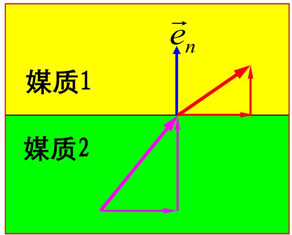

、 的切向分量连续

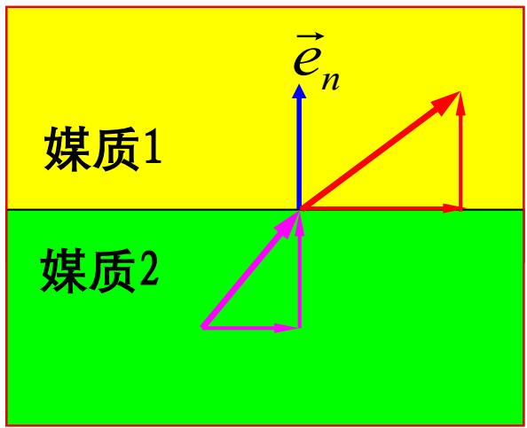

、 的法向分量连续

$$
\left\{ \begin{array}{l} \vec {e} _ {n} \cdot (\vec {D} _ {1} - \vec {D} _ {2}) = 0 \\ \vec {e} _ {n} \cdot (\vec {B} _ {1} - \vec {B} _ {2}) = 0 \\ \vec {e} _ {n} \times (\vec {E} _ {1} - \vec {E} _ {2}) = 0 \\ \vec {e} _ {n} \times (\vec {H} _ {1} - \vec {H} _ {2}) = 0 \end{array} \right.
$$

的法向分量连续D

的法向分量连续B

的切向分量连续 E

的切向分量连续 H

# 3. 理想导体表面上的边界条件

理想导体：电导率为无限大的导电媒质特征：电磁场不可能进入理想导体内理想导体表面上的边界条件设媒质2为理想导体，则 $E _ { 2 }$ 、 $D _ { 2 }$ 、 $H _ { 2 }$ 、$B _ { 2 }$ 均为零，故

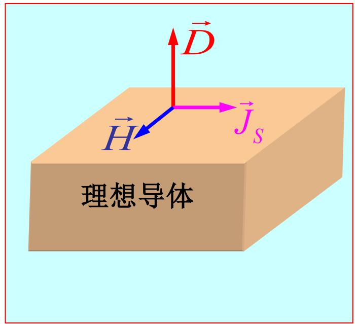

$$
\left\{ \begin{array}{l} \vec {e} _ {n} \cdot \vec {D} = \rho_ {S} \\ \vec {e} _ {n} \cdot \vec {B} = 0 \\ \vec {e} _ {n} \times \vec {E} = 0 \\ \vec {e} _ {n} \times \vec {H} = \vec {J} _ {S} \end{array} \right.
$$

理想导体表面上的电荷密度等于 的法向分量

理想导体表面上 $\vec { B }$ 的法向分量为0

理想导体表面上 的切向分量为0 

理想导体表面上的电流密度等于 的切向分量 H

表2.7.1电磁场的基本方程和边界条件

<table><tr><td>基本方程</td><td>边界条件</td><td>说明</td></tr><tr><td rowspan="4">积分形式: ∫C H·dI = ∫S J·dS + ∫S ∂D/∂t · dS</td><td>1. en × (H1 - H2) = JS</td><td rowspan="4">情况1是边界条件的一般形式</td></tr><tr><td>2. en × (H1 - H2) = 0</td></tr><tr><td>3. en × (H1 - H2) = 0</td></tr><tr><td>4. en × H1 = JS</td></tr><tr><td rowspan="4">微分形式: ∇×H = J + ∂D/∂t</td><td>1. en × (E1 - E2) = 0</td><td rowspan="4">情况2是电导率为有限值的导电媒质的边界条件</td></tr><tr><td>2. en × (E1 - E2) = 0</td></tr><tr><td>3. en × (E1 - E2) = 0</td></tr><tr><td>4. en × E1 = 0</td></tr><tr><td rowspan="4">积分形式: ∫C E · dl = - ∫S ∂B/∂t · dS</td><td>1. en × (B1 - B2) = 0</td><td rowspan="4">情况3是两种媒质为理想介质的边界条件</td></tr><tr><td>2. en × (B1 - B2) = 0</td></tr><tr><td>3. en × (B1 - B2) = 0</td></tr><tr><td>4. en × B1 = 0</td></tr><tr><td rowspan="4">微分形式: ∇×E = - ∂B/∂t</td><td>1. en × (D1 - D2) = ρS</td><td rowspan="4">情况4是理想导体表面上的边界条件</td></tr><tr><td>2. en × (D1 - D2) = ρS</td></tr><tr><td>3. en × (D1 - D2) = 0</td></tr><tr><td>4. en × D1 = ρS</td></tr><tr><td rowspan="4">积分形式: ∫S D · dS = ∫V ρ dV</td><td>1. en × (D1 - D2) = ρS</td><td rowspan="4">单位矢量en由媒质2指向媒质1</td></tr><tr><td>2. en × (D1 - D2) = ρS</td></tr><tr><td>3. en × (D1 - D2) = 0</td></tr><tr><td>4. en × D1 = ρS</td></tr></table>

例： $z < 0$ 的区域的媒质参数为 $\mathcal { E } _ { 1 } = \mathcal { E } _ { 0 } \mathbf { \cdot } \ \mu _ { 1 } = \mu _ { 0 } \mathbf { \cdot } \ \sigma _ { 1 } = 0$ , z > 0区域的媒质参数为 $\mathcal { E } _ { 2 } = 5 \mathcal { E } _ { 0 } \cdot$ $\mathscr { E } _ { 2 } = 5 \mathscr { E } _ { 0 } \cdot \mathscr { \mu } _ { 2 } = 2 0 \mathscr { \mu } _ { 0 } \cdot \mathscr { \sigma } _ { 2 } = 0$ $\mu _ { 2 } = 2 0 \mu _ { 0 } \mathrm { . }$ 。若媒质1中的电场强度为 $\vec { E } _ { 1 } ( z , t ) = \vec { e } _ { x } [ 6 0 \cos ( 1 5 \times 1 0 ^ { 8 } t - 5 z ) + 2 0 \cos ( 1 5 \times 1 0 ^ { 8 } t + .$ z5 )] V/m

媒质2中的电场强度为

$$
\vec {E} _ {2} (z, t) = \vec {e} _ {x} A \cos \left(1 5 \times 1 0 ^ {8} t - 5 0 z\right) \quad \mathrm {V / m}
$$

（1）试确定常数A的值;（2）求磁场强度 $\vec { \bf { H } } _ { 1 } ( z , t )$ 和 $\vec { \bf H } _ { 2 } ( z , t ) { \bf { ; } }$ ；

（3）验证 $( z , t )$ 和 $\vec { \bf H } _ { 2 } ( z , t )$ 满足边界条件。

解:（1）这是两种电介质的分界面，在分界面 $z = 0$ 处，有

$$
\begin{array}{l} \vec {E} _ {1} (0, t) = \vec {e} _ {x} [ 6 0 \cos (1 5 \times 1 0 ^ {8} t) + 2 0 \cos (1 5 \times 1 0 ^ {8} t) ] \\ = \vec {e} _ {x} 8 0 \cos (1 5 \times 1 0 ^ {8} t) \quad \mathrm {V / m} \\ \end{array}
$$

# 利用两种电介质分界面上电场强度的切向分量连续的边界条件

$$
E _ {1} (0, t) = E _ {2} (0, t)
$$

得到 $A = 8 0 \mathrm { ~ \textit ~ { ~ V / m } ~ }$ 

（2）由 $\nabla \times \vec { E } _ { 1 } = - \mu _ { 1 } \frac { \partial \vec { H } _ { 1 } } { \partial t }$ ，有

$$
\begin{array}{l} \frac {\partial \vec {H} _ {1}}{\partial t} = - \frac {1}{\mu_ {1}} \nabla \times \vec {E} _ {1} = - \vec {e} _ {y} \frac {1}{\mu_ {1}} \frac {\partial E _ {1 x}}{\partial z} \\ = - \vec {e} _ {y} \frac {1}{\mu_ {0}} [ 3 0 0 \sin (1 5 \times 1 0 ^ {8} t - 5 z) - 1 0 0 \sin (1 5 \times 1 0 ^ {8} t + 5 z) ] \\ \end{array}
$$

将上式对时间t 积分，得

$$
\vec {H} _ {1} (z, t) = \vec {e} _ {y} \frac {1}{\mu_ {0}} [ 2 \times 1 0 ^ {- 7} \cos (1 5 \times 1 0 ^ {8} t - 5 z) - \frac {2}{3} \times 1 0 ^ {- 7} \cos (1 5 \times 1 0 ^ {8} t + 5 z) ] \quad \mathrm {A / m}
$$

同样，由 $\nabla \times \vec { E } _ { 2 } = - \mu _ { 2 } \frac { \partial \vec { H } _ { 2 } } { \partial t }$ ， 得

$$
\vec {H} _ {2} (z, t) = \vec {e} _ {y} \frac {4}{3 \mu_ {0}} \times 1 0 ^ {- 7} \cos \left(1 5 \times 1 0 ^ {8} t - 5 z\right) \quad \mathrm {A / m}
$$

（3）z = 0时

$$
\begin{array}{l} \vec {H} _ {1} (0, t) = \vec {e} _ {y} \frac {1}{\mu_ {0}} [ 2 \times 1 0 ^ {- 7} \cos (1 5 \times 1 0 ^ {8} t) - \frac {2}{3} \times 1 0 ^ {- 7} \cos (1 5 \times 1 0 ^ {8} t) ] \\ = \vec {e} _ {y} \frac {4}{3 \mu_ {0}} \times 1 0 ^ {- 7} \cos (1 5 \times 1 0 ^ {8} t) \quad \mathrm {A / m} \\ \end{array}
$$

$$
\vec {H} _ {2} (0, t) = \vec {e} _ {y} \frac {4}{3 \mu_ {0}} \times 1 0 ^ {- 7} \cos \left(1 5 \times 1 0 ^ {8} t\right) \quad \mathrm {A / m}
$$

可见，在 $z = 0$ 处，磁场强度的切向分量是连续的，因为在分界面上（ $( z = 0 )$ ）不存在面电流。

例： 如图所示，1区的媒质参数为 , $\varepsilon _ { 1 } = 5 \varepsilon _ { 0 } , \mu _ { 1 } = \mu _ { 0 } , \sigma _ { 1 } = 0$ 1 2区

的媒质参数为 ε=ε、μ=μ0、O=0 

若已知自由空间的电场强度为

$$
\vec {E} _ {2} = \vec {e} _ {x} 2 y + \vec {e} _ {y} 5 z + \vec {e} _ {z} (3 + z) \quad \mathrm {V / m}
$$

试问关于1区中的 $\vec { E } _ { 1 }$ 和 $\vec { D } _ { 1 }$ 能求得出吗？解 根据边界条件，只能求得边界面 $z = 0$ 处的 $\vec { E } _ { 1 }$ 和 $\vec { D } _ { 1 }$ 

由 $\vec { e } _ { n } \times ( \vec { E } _ { 1 } - \vec { E } _ { 2 } ) = 0$ ，有

$$
\begin{array}{l} \vec {e} _ {z} \times \{\vec {e} _ {x} E _ {1 x} + \vec {e} _ {y} E _ {1 y} + \vec {e} _ {z} E _ {1 z} - [ \vec {e} _ {x} 2 y + \vec {e} _ {y} 5 x + \vec {e} _ {z} (3 + z) ] \} _ {z = 0} \\ = \vec {e} _ {y} (E _ {1 x} - 2 y) - \vec {e} _ {x} (E _ {1 y} - 5 x) = 0 \\ \end{array}
$$

则得 $E _ { 1 x } = 2 y , ~ E _ { 1 y } = 5 x$ 

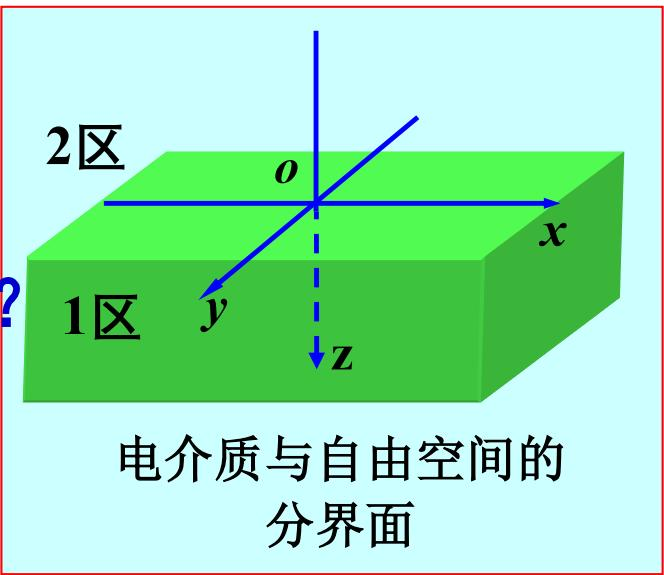

$$
D _ {1 x} = \varepsilon_ {1} E _ {1 x} = 1 0 \varepsilon_ {0} y, \quad D _ {1 y} = \varepsilon_ {1} E _ {1 y} = 2 5 \varepsilon_ {0} x
$$

又由 $\vec { e } _ { n } \cdot ( \vec { D } _ { 1 } - \vec { D } _ { 2 } ) = 0$ ，有

$$
\vec {e} _ {z} \cdot [ \vec {e} _ {x} D _ {1 x} + \vec {e} _ {y} D _ {1 y} + \vec {e} _ {z} D _ {1 z} - (\vec {e} _ {x} D _ {2 x} + \vec {e} _ {y} D _ {2 y} + \vec {e} _ {z} D _ {2 z} ] _ {z = 0} = 0
$$

则得 $D _ { 1 z } \big | _ { z = 0 } = D _ { 2 z } \big | _ { z = 0 } = \varepsilon _ { 0 } ( 3 + z ) \big | _ { z = 0 } = 3 \varepsilon _ { 0 }$ 

$$
E _ {1 z} \big | _ {z = 0} = \frac {D _ {1 z}}{\varepsilon_ {1}} \big | _ {z = 0} = \frac {3 \varepsilon_ {0}}{5 \varepsilon_ {0}} = \frac {3}{5}
$$

最后得到 $\vec { E } _ { 1 } ( x , y , 0 ) = \vec { e } _ { x } 2 y + \vec { e } _ { y } 5 x + \vec { e } _ { z } \frac { 3 } { 5 }$ 

$$
\vec {D} _ {1} (x, y, 0) = \vec {e} _ {x} 1 0 \varepsilon_ {0} y + \vec {e} _ {y} 2 5 \varepsilon_ {0} x + \vec {e} _ {z} 3 \varepsilon_ {0}
$$

例： 在两导体平板（ $( z = 0$ 和 $z = \mathsf { d } )$ ）之间的空气中，已知

电场强度 $\vec { E } = \vec { e } _ { y } E _ { 0 } \sin ( \frac { \pi } { d } z ) \cos ( \omega t - k _ { x } x )$ V/m

试求:（1）磁场强度 $\vec { H } \mathbf { \mathbf { ; } }$ ； （2）导体表面的电流密度 ${ \vec { J } } _ { s }$ 

解 （1）由 $\nabla \times \vec { E } = - \mu _ { 0 } \frac { \partial \vec { H } } { \partial t }$ 有

$$
\begin{array}{l} \frac {\partial \vec {H}}{\partial t} = - \frac {1}{\mu_ {0}} \nabla \times \vec {E} \\ = - \frac {1}{\mu_ {0}} (- \vec {e} _ {x} \frac {\partial E _ {y}}{\partial z} + \vec {e} _ {z} \frac {\partial E _ {y}}{\partial x}) \\ = \frac {E _ {0}}{\mu_ {0}} [ \vec {e} _ {x} \frac {\pi}{d} \cos (\frac {\pi}{d} z) \cos (\omega t - k _ {x} x) - \vec {e} _ {z} k _ {x} \sin (\frac {\pi}{d} z) \sin (\omega t - k _ {x} x) ] \\ \end{array}
$$

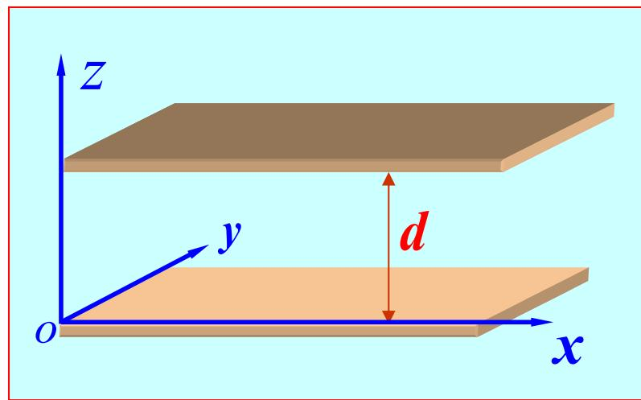

将上式对时间 t 积分，得

$$
\begin{array}{l} \vec {H} (x, z, t) = \int \frac {\partial \vec {H} (x , z , t)}{\partial t} d t \\ = \vec {e} _ {x} \frac {\pi E _ {0}}{\omega \mu_ {0} d} \cos (\frac {\pi}{d} z) \sin (\omega t - k _ {x} x) + \\ \vec {e} _ {z} \frac {k _ {x} E _ {0}}{\omega \mu_ {0}} \sin (\frac {\pi}{d} z) \cos (\omega t - k _ {x} x) \mathrm {A / m} \\ \end{array}
$$

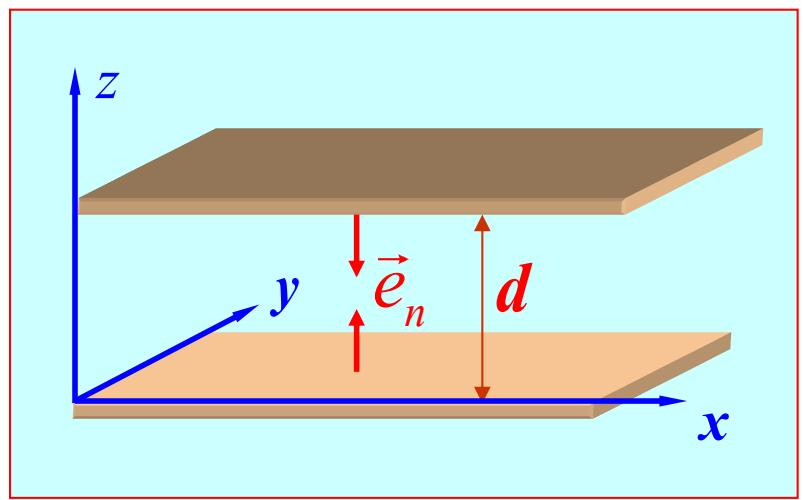

（2） $z = 0$ 处导体表面的电流密度为

$$
\left. \vec {J} _ {S} = \vec {e} _ {z} \times \vec {H} \right| _ {z = 0} = \vec {e} _ {y} \frac {\pi E _ {0}}{\omega \mu_ {0} d} \sin (\omega t - k _ {x} x) \quad \mathrm {A / m}
$$

$\mathbf { z } = \pmb { d }$ 处导体表面的电流密度为

$$
\vec {J} _ {S} = (- \vec {e} _ {z}) \times \vec {H} \Big | _ {z = d} = \vec {e} _ {y} \frac {\pi E _ {0}}{\omega \mu_ {0} d} \sin (\omega t - k _ {x} x) \quad \mathrm {A / m}
$$

# 2.8 电磁能量守恒定律

电磁能量及守恒关系

坡印廷定理

坡印廷矢量

# 电磁能量及守恒关系

电场能量密度：

磁场能量密度：

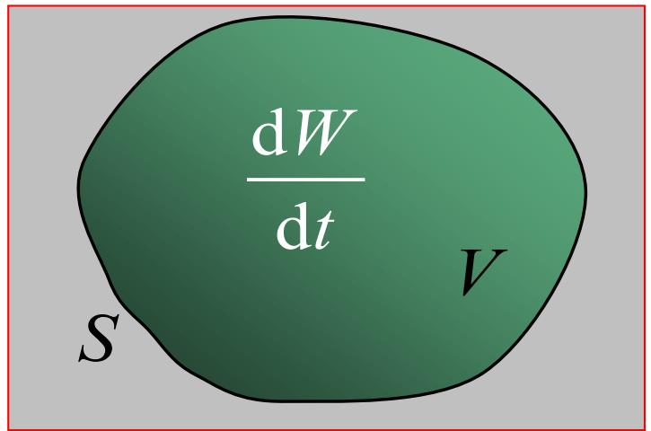

电磁能量密度：

空间区域V中的电磁能量：

$$
W = \int_ {V} w d V = \int_ {V} (\frac {1}{2} \vec {E} \cdot \vec {D} + \frac {1}{2} \vec {H} \cdot \vec {B}) d V
$$

空间区域V中的电磁能量：

$$
W = \int_ {V} w d V = \int_ {V} (\frac {1}{2} \vec {E} \cdot \vec {D} + \frac {1}{2} \vec {H} \cdot \vec {B}) d V
$$

特点：当场随时间变化时，空间各点的电磁场能量密度也要随时间改变，从而引起电磁能量流动。

# 坡印廷矢量（电磁能流密度矢量）

描述时变电磁场中电磁能量传输的一个重要物理量

单位：W/m2

单位时间内流过面积S的电磁能量为 Ssds

电荷受到电磁场的作用力会产生运动，因此电磁场就会对电荷做功，这时电磁能量转换成其他形式的能量。设处于电磁场中的电荷 $q$ 以速度 $\boldsymbol { v }$ 运动，则电荷q受到的电磁力F=qE+qvxB，所以电磁场对电荷q做功的功率为P=F·v= $q$ $\scriptstyle { F = q E + q v \times B }$ $q$ $P = F \cdot v =$ qu·E。对于连续分布的电荷，电磁场对单位体积电荷做功的功率P=pv·E= $q v \cdot E$ $p = \rho v \cdot E =$ $\boldsymbol { J } \cdot \boldsymbol { E }$ ，对体积 $V$ 中的所有电荷做功的功率则为

$$
P = \int_ {V} p \mathrm {d} V = \int_ {V} \boldsymbol {J} \cdot \boldsymbol {E} \mathrm {d} V
$$

设在区域V中电磁场的能量随时间减少，由于能量必须守恒，所以减少的能量不会消失，它或者因对区域V中的电荷做功而损耗，也可能通过边界S流出了 $V$ 区域V，即

减少的电磁能量 $=$ 损耗的电磁能量 $^ +$ 流出的电磁能量

其中：单位时间内减少的电磁能量为 $- \left. { \frac { \operatorname { d } } { \operatorname { d } t } } \right) _ { V } w \operatorname { d } V$ ，单位时间内损耗的电磁能量为$\int _ { V } \boldsymbol { J } \boldsymbol { \cdot } \boldsymbol { E } \mathrm { d } V ,$ 单位时间内流出的电磁能量为 $\oint _ { s } \boldsymbol { S } \boldsymbol { \cdot } \mathrm { d } \boldsymbol { S }$ ，于是得到

$$
- \frac {\mathrm {d}}{\mathrm {d} t} \int_ {V} w \mathrm {d} V = \int_ {V} \boldsymbol {J} \cdot \boldsymbol {E} \mathrm {d} V + \oint_ {S} \boldsymbol {S} \cdot \mathrm {d} \boldsymbol {S} \tag {4.3.4}
$$

这就是电磁能量守恒定理，称为坡印廷定理。

推证

$$
\left\{ \begin{array}{l} \nabla \times \vec {H} = \vec {J} + \frac {\partial \vec {D}}{\partial t} \\ \nabla \times \vec {E} = - \frac {\partial \vec {B}}{\partial t} \end{array} \right. \Longrightarrow \left\{ \begin{array}{l} \vec {E} \cdot \nabla \times \vec {H} = \vec {E} \cdot \vec {J} + \vec {E} \cdot \frac {\partial \vec {D}}{\partial t} \\ \vec {H} \cdot \nabla \times \vec {E} = - \vec {H} \cdot \frac {\partial \vec {B}}{\partial t} \end{array} \right.
$$

以上两式相减， 得到

$$
\vec {E} \cdot \nabla \times \vec {H} - \vec {H} \cdot \nabla \times \vec {E} = \vec {E} \cdot \vec {J} + \vec {E} \cdot \frac {\partial \vec {D}}{\partial t} + \vec {H} \cdot \frac {\partial \vec {B}}{\partial t}
$$

线性和各向同性的媒质，当参数都不随时间变化时，则有

$$
\vec {E} \cdot \frac {\partial \vec {D}}{\partial t} = \varepsilon \vec {E} \cdot \frac {\partial \vec {E}}{\partial t} = \frac {1}{2} \varepsilon \frac {\partial (\vec {E} \cdot \vec {E})}{\partial t} = \frac {\partial}{\partial t} (\frac {1}{2} \vec {E} \cdot \vec {D})
$$

$$
\vec {H} \cdot \frac {\partial \vec {B}}{\partial t} = \mu \vec {H} \cdot \frac {\partial \vec {H}}{\partial t} = \frac {1}{2} \mu \frac {\partial (\vec {H} \cdot \vec {H})}{\partial t} = \frac {\partial}{\partial t} (\frac {1}{2} \vec {H} \cdot \vec {B})
$$

$$
\vec {E} \cdot \nabla \times \vec {H} - \vec {H} \cdot \nabla \times \vec {E} = \vec {E} \cdot \vec {J} + \frac {\partial}{\partial t} \left(\frac {1}{2} \vec {E} \cdot \vec {D} + \frac {1}{2} \vec {H} \cdot \vec {B}\right)
$$

再利用矢量恒等式：

$$
- \nabla \cdot (\vec {E} \times \vec {H}) = \vec {E} \cdot \nabla \times \vec {H} - \vec {H} \cdot \nabla \times \vec {E}
$$

即可得到微分形式

$$
- \nabla \cdot (\vec {E} \times \vec {H}) = \frac {\partial}{\partial t} \left(\frac {1}{2} \vec {E} \cdot \vec {D} + \frac {1}{2} \vec {H} \cdot \vec {B}\right) + \vec {E} \cdot \vec {J}
$$

在任意闭曲面S 所包围的体积V上，对上式两端积分，并应用散度定理，即可得到:

$$
- \oint_ {S} (\vec {E} \times \vec {H}) \cdot \mathrm {d} \vec {S} = \frac {\mathrm {d}}{\mathrm {d} t} \int_ {V} \left(\frac {1}{2} \vec {E} \cdot \vec {D} + \frac {1}{2} \vec {H} \cdot \vec {B}\right) \mathrm {d} V + \int_ {V} \vec {E} \cdot \vec {J} \mathrm {d} V
$$

# 坡印廷定理的积分形式

$$
- \frac {\mathrm {d}}{\mathrm {d} t} \int_ {V} \left(\frac {1}{2} \vec {E} \cdot \vec {D} + \frac {1}{2} \vec {H} \cdot \vec {B}\right) \mathrm {d} V = \int_ {V} \vec {E} \cdot \vec {J} \mathrm {d} V + \oint_ {S} (\vec {E} \times \vec {H}) \cdot \mathrm {d} \vec {S}
$$

单位时间内体积V中

所减少的电磁场能量

单位时间内电场

对体积V中的电流

所作的功而消耗的

电磁场能量

通过曲面S

流出体积V

的电磁功率

$$
\oint_ {S} (\vec {E} \times \vec {H}) \cdot \mathrm {d} \vec {S} = \oint_ {S} \vec {S} \cdot \mathrm {d} \vec {S}
$$

# 坡印廷矢量（电磁能流密度矢量）

定义： $\vec { S } = \vec { E } \times \vec { H } ( \mathbf { W } / \mathbf { m } ^ { 2 } )$ 

# 物理意义：

s 方向 电磁能量传输的方向

的大小 通过垂直于能量传输方向的单位面积的电磁功率

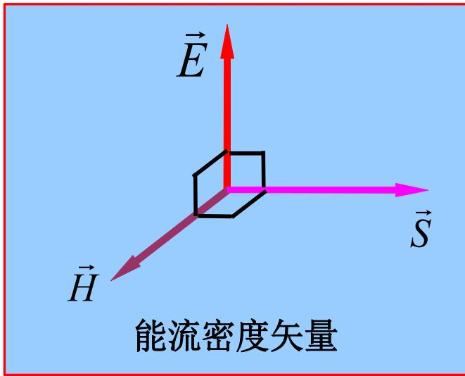

本节例题：同轴线的内导体半径为a 、外导体的内半径为b，其间填充均匀的理想介质。设内外导体间的电压为U ，导体中流过的电流为I 。（1）在导体为理想导体的情况下，计算同轴线中传输的功率；（2）当导体的电导率σ为有限值时，计算通过内导体表面进入每单位长度内导体的功率。

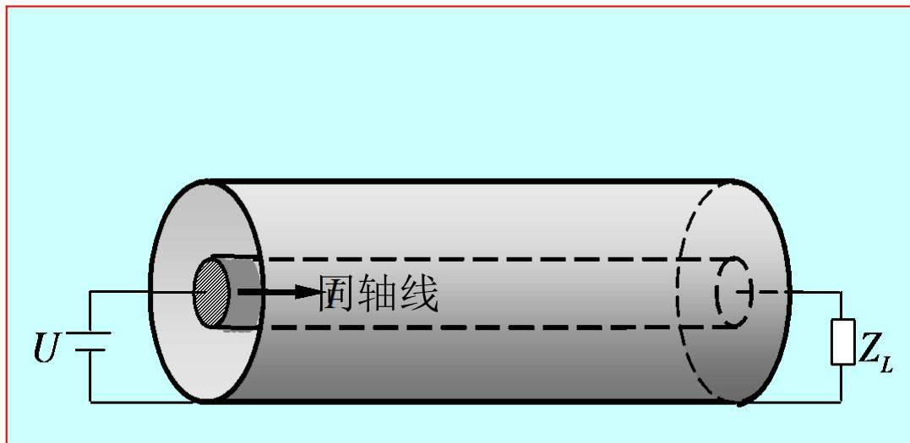

解：（1）在内外导体为理想导体的情况下，电场和磁场只存在于内外导体之间的理想介质中，内外导体表面的电场无切向分量，只有电场的径向分量。利用高斯定理和安培环路定理，容易求得内外导体之间的电场和磁场分别为

$$
\vec {E} = \vec {e} _ {\rho} \frac {U}{\rho \ln (b / a)}, \qquad \vec {H} = \vec {e} _ {\phi} \frac {I}{2 \pi \rho} \qquad (a <   \rho <   b)
$$

内外导体之间任意横截面上的坡印廷矢量

$$
\vec {S} = \vec {E} \times \vec {H} = [ \vec {e} _ {\rho} \frac {U}{\rho \ln (b / a)} ] \times (\vec {e} _ {\phi} \frac {I}{2 \pi \rho}) = \vec {e} _ {z} \frac {U I}{2 \pi \rho^ {2} \ln (b / a)}
$$

电磁能量在内外导体之间的介质中沿轴方向流动，即由电源流向负载，如图所示。

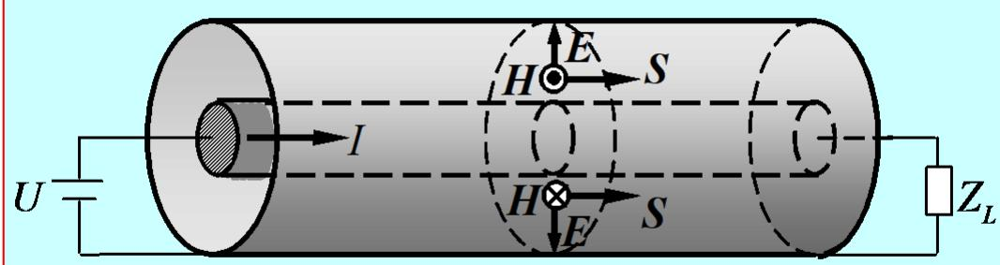

同轴线中的电场、磁场和坡印廷矢量（理想导体情况）

穿过任意横截面的功率为

$$
P = \int_ {S} \vec {S} \cdot \vec {e} _ {z} d S = \int_ {a} ^ {b} \frac {U I}{2 \pi \rho^ {2} \ln (b / a)} 2 \pi \rho d \rho = U I
$$

（2）当导体的电导率 $\sigma$ 为有限值时，导体内部存在沿电流方向的电场

$$
\vec {E} = \frac {\vec {J}}{\sigma} = \vec {e} _ {z} \frac {I}{\pi a ^ {2} \sigma}
$$

在内导体表面上电场的切向分量连续，即 E Ez = z外 内因此，在内导体表面外侧的电场为

$$
\left. \vec {E} _ {\text {外}} \right| _ {\rho = a} = \vec {e} _ {\rho} \frac {U}{a \ln (b / a)} + \vec {e} _ {z} \frac {I}{\pi a ^ {2} \sigma}
$$

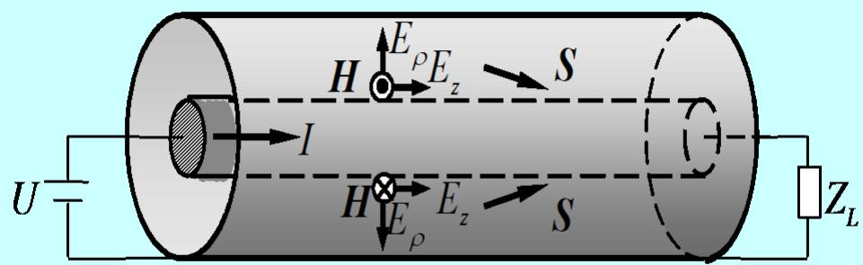

同轴线中的电场、磁场和坡印廷矢量（非理想导体情况）

磁场则仍为 $\left. \vec { H } _ { \scriptscriptstyle \left. \right. } \right. _ { \rho = a } = \vec { e } _ { \scriptscriptstyle \phi } \frac I { 2 \pi a }$ H外|p e

内导体表面外侧的坡印廷矢量为

$$
\left. \vec {S} _ {\text {外}} \right| _ {\rho = a} = \left(\vec {E} _ {\text {外}} \times \vec {H} _ {\text {外}}\right) \bigg | _ {\rho = a} = - \vec {e} _ {\rho} \frac {I ^ {2}}{2 \pi^ {2} a ^ {3} \sigma} + \vec {e} _ {z} \frac {U I}{2 \pi a ^ {2} \ln (b / a)}
$$

由此可见，内导体表面外侧的坡印廷矢量既有轴向分量，也有径向分量，如图所示。

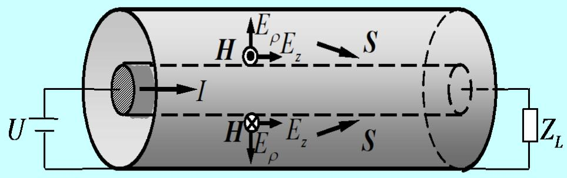

同轴线中的电场、磁场和坡印廷矢量（非理想导体情况）

通过内导体表面进入每单位长度内导体的功率为

$$
P = \int_ {S} \vec {S} _ {\text {外}} \Big | _ {\rho = a} \bullet (- \vec {e} _ {\rho}) \mathrm {d} S = \int_ {0} ^ {1} \frac {I ^ {2}}{2 \pi^ {2} a ^ {3} \sigma} 2 \pi a \mathrm {d} z = \frac {I ^ {2}}{\pi a ^ {2} \sigma} = R I ^ {2}
$$

式中 $R = { \frac { 1 } { \pi a ^ { 2 } \sigma } }$ 是单位长度内导体的电阻。由此可见，进入内导体中功率等于这段导体的焦耳损耗功率。

以上分析表明电磁能量是由电磁场传输的，导体仅起着定向引导电磁能流的作用。当导体的电导率为有限值时，进入导体中的功率全部被导体所吸收，成为导体中的焦耳热损耗功率。