# 第三章

# 静态电磁场分析与求解

# 第3章 静态电磁场及其边值问题的解

静态电磁场：场量不随时间变化，包括：静电场、恒定电场和恒定磁场

时变情况下，电场和磁场相互关联，构成统一的电磁场静态情况下，电场和磁场由各自的源激发，且相互独立

# 本章内容

3.1 静电场分析及应用

3.2 恒定电场分析及应用

3.3 恒定磁场分析及应用

3.4 静态场的边值问题及解的惟一性定理

3.5 镜像法求解高维问题

3.6 分离变量法求解高维问题

注：在第四版和第五版教材中提到的“有限差分方法”内容在第六版教材中已经删除了，本课程不涉及有限差分方法的讲解和考核。

# 3.1 静电场分析及应用

# 本节内容

3.1.1 静电场的基本方程和边界条件

3.1.2 电位函数的分析与求解

3.1.3 导体系统的电容

3.1.4 静电场的能量与电容储能

3.1.5 静电场中带电体的受力

# 3.1.1 静电场的基本方程和边界条件

基本方程

微分形式：

$$
\left\{ \begin{array}{l} \nabla \cdot \vec {D} = \rho \\ \nabla \times \vec {E} = 0 \end{array} \right.
$$

积分形式：

$$
\left\{ \begin{array}{l} \oint_ {S} \vec {D} \cdot d \vec {S} = q \\ \oint_ {C} \vec {E} \cdot d \vec {l} = 0 \end{array} \right.
$$

本构关系： $\vec { D } = \varepsilon \vec { E }$ 

边界条件

$$
\left\{ \begin{array}{l} \vec {e} _ {n} \cdot (\vec {D} _ {1} - \vec {D} _ {2}) = \rho_ {S} \\ \vec {e} _ {n} \times (\vec {E} _ {1} - \vec {E} _ {2}) = 0 \end{array} \right.
$$

或

$$
\left\{ \begin{array}{l} D _ {1 n} - D _ {2 n} = \rho_ {S} \\ E _ {1 t} - E _ {2 t} = 0 \end{array} \right.
$$

若分界面上不存在面电荷，即 $\rho _ { \textrm { S } } { = } 0$ ，则

$$
\left\{ \begin{array}{l} \vec {e} _ {n} \cdot (\vec {D} _ {1} - \vec {D} _ {2}) = 0 \\ \vec {e} _ {n} \times (\vec {E} _ {1} - \vec {E} _ {2}) = 0 \end{array} \right.
$$

或

$$
\left\{ \begin{array}{l} D _ {1 n} = D _ {2 n} \\ E _ {1 t} = E _ {2 t} \end{array} \right.
$$

# 场矢量的折射关系

$$
\frac {\tan \theta_ {1}}{\tan \theta_ {2}} = \frac {E _ {1 t} / E _ {1 n}}{E _ {2 t} / E _ {2 n}} = \frac {\varepsilon_ {1} / D _ {1 n}}{\varepsilon_ {2} / D _ {2 n}} = \frac {\varepsilon_ {1}}{\varepsilon_ {2}}
$$

# 导体表面的边界条件

# ❖ 在静电平衡的情况下，导体内部的电场为0，则导体表面的边界条件为

$$
\left\{ \begin{array}{l} {\vec {e} _ {n} \cdot \vec {D} = \rho_ {S}} \\ {\vec {e} _ {n} \times \vec {E} = 0} \end{array} \right. \quad \text {或} \quad \left\{ \begin{array}{l} D _ {n} = \rho_ {S} \\ E _ {t} = 0 \end{array} \right.
$$

# 3.1.2 电位函数

# 电位函数的定义

由 $\nabla \times \vec { E } = 0$ E=-V

即静电场可以用一个标量函数的梯度来表示，标量函数 $\phi$ 称为静电场的标量电位或简称电位。

# 2 电位的表达式

$$
\vec {R} = \vec {r} - \vec {r ^ {\prime}}
$$

对于连续的体分布电荷， 由

$$
\begin{array}{l} \vec {E} (\vec {r}) = \frac {1}{4 \pi \varepsilon} \int_ {V} \frac {\rho (\vec {r} ^ {\prime}) \vec {R}}{R ^ {3}} \mathrm {d} V ^ {\prime} = - \frac {1}{4 \pi \varepsilon} \int_ {V} \rho (\vec {r} ^ {\prime}) \nabla (\frac {1}{R}) \mathrm {d} V ^ {\prime} \\ = - \nabla [ \frac {1}{4 \pi \varepsilon} \int_ {V} \rho (\vec {r} ^ {\prime}) (\frac {1}{R}) \mathrm {d} V ^ {\prime} ] \\ \end{array}
$$

$$
\nabla \left(\frac {1}{R}\right) = - \frac {\vec {R}}{R ^ {3}}
$$

故得 $\varphi ( \vec { r } ) = \frac { 1 } { 4 \pi \varepsilon } \int _ { \cal V } \frac { \rho ( \vec { r } ^ { \prime } ) } { R } \mathrm { d } V ^ { \prime } + C$ p(2dv' + C

面电荷的电位： $\varphi ( \vec { r } ) = \frac { 1 } { 4 \pi \varepsilon } \int _ { S } \frac { \rho _ { S } ( \vec { r } ^ { \prime } ) } { R } \mathrm { d } S ^ { \prime } + C$ 

线电荷的电位： $\varphi ( \vec { r } ) = \frac { 1 } { 4 \pi \varepsilon } \int _ { C } \frac { \rho _ { l } ( \vec { r } ^ { \prime } ) } { R } \mathrm { d } l ^ { \prime } + C$ [pd+c

点电荷的电位： $\varphi ( { \vec { r } } ) = { \frac { q } { 4 \pi \varepsilon R } } + C$ 

# 3. 电位差

将 $\vec { E } = - \nabla \phi$ 两端点乘 ，则有

$$
\vec {E} \cdot \mathrm {d} \vec {l} = - \nabla \phi \cdot \mathrm {d} \vec {l} = - (\frac {\partial \phi}{\partial x} \mathrm {d} x + \frac {\partial \phi}{\partial y} \mathrm {d} y + \frac {\partial \phi}{\partial z} \mathrm {d} z) = - \mathrm {d} \phi
$$

上式两边从点P到点Q沿任意路径进行积分，得

P、Q 两点间的电位差等于电场力将单位正电荷从P点移至Q 点所做的功，电场力使单位正电荷由高电位处移到低电位处；

电位差也称为电压， 可用U表示；

→ 电位差有确定值，只与首尾两点位置有关，与积分路径无关。

# 电位参考点

静电位不惟一，可以相差一个常数，即

$$
\phi^ {\prime} = \phi + C \Rightarrow \nabla \phi^ {\prime} = \nabla (\phi + C) = \nabla \phi
$$

为使空间各点电位具有确定值，可以选定空间某一点作为参考点，且令参考点的电位为零，由于空间各点与参考点的电位差为确定值，所以该点的电位也就具有确定值，即

应使电位表达式最简单。若电荷分布在有限区域，通常取无限远作电位参考点；

同一个问题只能有一个参考点。

# 例 3.1.1 求电偶极子的电位.

解 在球坐标系中

$$
\begin{array}{l} \phi (\vec {r}) = \frac {q}{4 \pi \varepsilon_ {0}} \left(\frac {1}{r _ {1}} - \frac {1}{r _ {2}}\right) = \frac {q}{4 \pi \varepsilon_ {0}} \frac {r _ {2} - r _ {1}}{r _ {1} r _ {2}} \\ r _ {1} = \sqrt {r ^ {2} + (d / 2) ^ {2} - r d \cos \theta} \\ r _ {2} = \sqrt {r ^ {2} + (d / 2) ^ {2} + r d \cos \theta} \\ \end{array}
$$

电偶极子

用二项式展开，由于 $r > > d$ ，得 $r _ { 1 } = r - \frac { d } { 2 } \cos \theta ,$ $r _ { 2 } = r + \frac { d } { 2 } \cos \theta$ 

代入上式，得 (r)=qd cosθ $\phi ( \vec { r } ) = { \frac { q d \cos \theta } { 4 \pi { \varepsilon _ { 0 } } r ^ { 2 } } } = { \frac { { \vec { \bf p } } \cdot { \vec { \bf e } } _ { r } } { 4 \pi { \varepsilon _ { 0 } } r ^ { 2 } } } = { \frac { { \vec { \bf p } } \cdot { \vec { r } } } { 4 \pi { \varepsilon _ { 0 } } r ^ { 3 } } }$ 

p=qd 电偶极矩，方向由负电荷指向正电荷。

由球坐标系中的梯度公式，可得到电偶极子的远区电场强度

$$
\begin{array}{l} \vec {\bf E} (\vec {r}) = - \nabla \phi = - (\vec {\bf e} _ {r} \frac {\partial \phi}{\partial r} + \vec {\bf e} _ {\theta} \frac {1}{r} \frac {\partial \phi}{\partial \theta} + \vec {\bf e} _ {\varphi} \frac {1}{r \sin \theta} \frac {\partial \phi}{\partial \varphi}) \\ = \frac {q}{4 \pi \varepsilon_ {0} r ^ {3}} (\vec {\mathbf {e}} _ {r} 2 \cos \theta + \vec {\mathbf {e}} _ {\theta} \sin \theta) \\ \end{array}
$$

等位线方程：

$$
\frac {p \cos \theta}{4 \pi \varepsilon_ {0} r ^ {2}} = C \Longrightarrow r ^ {2} = C ^ {\prime} \cos \theta
$$

电场线微分方程：

$$
\frac {\mathrm {d} r}{E _ {r}} = \frac {r \mathrm {d} \theta}{E _ {\theta}}
$$

将 $\mathbf { E } _ { \theta }$ 和 $\mathbf { E } _ { \mathfrak { r } }$ 代入上式， 解得E线方程为

$$
r = C _ {1} \sin^ {2} \theta
$$

电偶极子的场图

# 例3.1.2 求均匀电场的电位分布。

解 选定均匀电场空间中的一点o为坐标原点，而任意点P 的位置矢量为r，则

$$
\varphi (P) - \varphi (o) = \int_ {P} ^ {o} \vec {E} _ {0} \bullet \mathrm {d} \vec {l} = - \int_ {o} ^ {P} \vec {E} _ {0} \bullet \mathrm {d} \vec {r} = - \vec {E} _ {0} \bullet \vec {r}
$$

选择点o为电位参考点，即 $\varphi ( o ) = 0 _ { \mathfrak { s } }$ ，则

$$
\varphi (P) = - \vec {E} _ {0} \cdot \vec {r}
$$

在球坐标系中，取极轴与 $E _ { \mathrm { c } }$ 的方向一致，即 $\vec { E } _ { 0 } = \vec { e } _ { z } E _ { 0 }$ ，则有 

$$
\varphi (P) = - \vec {E} _ {0} \bullet \vec {r} = - \vec {e} _ {z} \bullet \vec {r} E _ {0} = - E _ {0} r \cos \theta
$$

在圆柱面坐标系中，取 $\vec { E } _ { 0 }$ 与x轴方向一致，即 $\vec { E } _ { 0 } = \vec { e } _ { x } E _ { 0 }$ ，而

$$
\vec {r} = \vec {e} _ {\rho} \rho + \vec {e} _ {z} z, \text {故} \varphi (P) = - \vec {E} _ {0} \bullet \vec {r} = - \vec {e} _ {x} \bullet E _ {0} (\vec {e} _ {\rho} \rho + e _ {z} z) = - E _ {0} \rho \cos \phi
$$

例 求长度为2L、电荷线密度为 $\rho _ { l 0 }$ 的均匀带电线的电位。

解 采用圆柱面坐标系，令线电荷与 z 轴相重合，中点位于坐标原点。由于轴对称性，电位与 $\phi$ 无关。

在带电线上位于 $z ^ { \prime }$ 处的线元 $\mathrm { d } l ^ { \prime } = \mathrm { d } z ^ { \prime }$ 到点 $P ( \rho , \phi , z )$ 的距离 $R = \sqrt { \rho ^ { 2 } + ( z - z ^ { \prime } ) ^ { 2 } }$ 

则

$$
\begin{array}{l} \varphi (\vec {r} ^ {\prime}) = \frac {\rho_ {l 0}}{4 \pi \varepsilon_ {0}} \int_ {- L} ^ {L} \frac {1}{\sqrt {\rho^ {2} + (z - z ^ {\prime}) ^ {2}}} \mathrm {d} z ^ {\prime} \\ = \frac {\rho_ {l 0}}{4 \pi \varepsilon_ {0}} \ln [ z ^ {\prime} - z + \sqrt {\rho^ {2} + (z - z ^ {\prime}) ^ {2}} ] \Bigg | _ {- L} ^ {L} \\ = \frac {\rho_ {l 0}}{4 \pi \varepsilon_ {0}} \ln \frac {\sqrt {\rho^ {2} + (z - L) ^ {2}} - (z - L)}{\sqrt {\rho^ {2} + (z + L) ^ {2}} - (z + L)} \\ \end{array}
$$

在上式中若令 $L \to \infty$ ，则可得到无限长直线电荷的电位。当时，上式可写为

$$
\varphi (\vec {r}) \approx \frac {\rho_ {l 0}}{4 \pi \varepsilon_ {0}} \ln \frac {\sqrt {\rho^ {2} + L ^ {2}} + L}{\sqrt {\rho^ {2} + L ^ {2}} - L} = \frac {\rho_ {l 0}}{4 \pi \varepsilon_ {0}} \ln \frac {2 L}{\rho^ {2} / 2 L} \approx \frac {\rho_ {l 0}}{2 \pi \varepsilon_ {0}} \ln \frac {2 L}{\rho}
$$

当 $L \to \infty$ 时，上式变为无穷大，这是因为电荷不是分布在有限区域内，而将电位参考点选在无穷远点之故。这时可在上式中加上一个任意常数，则有 $\varphi ( \vec { r } ) = \frac { \rho _ { l 0 } } { 2 \pi \varepsilon _ { 0 } } \ln \frac { 2 L } { \rho } + C$ 2π

并选择有限远处为电位参考点。例如，选择ρ= a的点为电位参考点，则有

$$
C = - \frac {\rho_ {l 0}}{2 \pi \varepsilon_ {0}} \ln \frac {2 L}{a} \Longrightarrow \varphi (\vec {r}) = \frac {\rho_ {l 0}}{2 \pi \varepsilon_ {0}} \ln \frac {a}{\rho}
$$

# 5. 电位的微分方程

# 静电位的边界条件

设 $P _ { 1 }$ 和P2是介质分界面两侧紧贴界面的相邻两点，其电位分别为 $\varphi _ { 1 }$ 和 $\varphi _ { 2 }$ 。当两点间距离 $\pmb { \triangleleft l }  \mathbf { 0 }$ 时

$$
\phi_ {1} - \phi_ {2} = \lim _ {\Delta l \to 0} \int_ {P _ {1}} ^ {P _ {2}} \vec {E} \cdot d \vec {l} = 0
$$

$$
\Longrightarrow \phi_ {1} = \phi_ {2}
$$

由 $\vec { e } _ { n } \cdot ( \vec { D } _ { 1 } - \vec { D } _ { 2 } ) = \rho _ { S }$ 和 $\vec { D } = - \varepsilon \nabla \phi$ 

$$
\Longrightarrow \varepsilon_ {2} \frac {\partial \phi_ {2}}{\partial n} - \varepsilon_ {1} \frac {\partial \phi_ {1}}{\partial n} = \rho_ {S}
$$

若介质分界面上无自由电荷，即

导体表面上电位的边界条件：

$$
\rho_ {S} = 0
$$

$\phi =$ 常数，

$$
\Longrightarrow
$$

$$
\varepsilon_ {2} \frac {\partial \phi_ {2}}{\partial n} = \varepsilon_ {1} \frac {\partial \phi_ {1}}{\partial n}
$$

媒质1 £1 91 P TAl媒 质 2 £2 P2

例 两块无限大接地导体平板分别置于 $\mathbf { \nabla } \cdot \mathbf { x } = \mathbf { 0 }$ 和 $x = a$ 处，在两板之间的 $x = b$ 处有一面密度为 $\rho _ { s 0 }$ 的均匀电荷分布，如图所示。求两导体平板之间的电位和电场。

解 在两块无限大接地导体平板之间，除 $x = b$ 处有均匀面电荷分布外，其余空间均无电荷分布，故电位函数满足一维拉普拉斯方程

$$
\frac {\mathrm {d} ^ {2} \varphi_ {1} (x)}{\mathrm {d} x ^ {2}} = 0, \qquad (0 <   x <   b)
$$

$$
\frac {\mathrm {d} ^ {2} \varphi_ {2} (x)}{\mathrm {d} x ^ {2}} = 0, \quad (b <   x <   a)
$$

方程的解为 $\varphi _ { 1 } ( x ) = C _ { 1 } x + D _ { 1 }$ 

$$
\varphi_ {2} (x) = C _ {2} x + D _ {2}
$$

两块无限大平行板

# 利用边界条件，有

$$
x = 0 \text {处}, \varphi_ {1} (0) = 0
$$

$$
x = a \text {处}, \varphi_ {2} (a) = 0
$$

$$
\begin{array}{l} x = b \text {处}, \varphi_ {1} (b) = \varphi_ {2} (b), \\ \left[ \frac {\partial \varphi_ {2} (x)}{\partial x} - \frac {\partial \varphi_ {1} (x)}{\partial x} \right] _ {x = b} = - \frac {\rho_ {S 0}}{\varepsilon_ {0}} \\ \end{array}
$$

所以 $D _ { 1 } = 0$ 

$$
\begin{array}{l} C _ {2} a + D _ {2} = 0 \\ C _ {1} b + D _ {1} = C _ {2} b + D _ {2} \\ \end{array}
$$

$$
C _ {2} - C _ {1} = - \frac {\rho_ {S 0}}{\varepsilon_ {0}}
$$

由此解得 0 ( ) ,S b aC = − $C _ { 1 } = - \frac { \rho _ { s 0 } ( b - a ) } { \varepsilon _ { 0 } a } , \quad D _ { 1 } = 0$ 

$$
C _ {2} = - \frac {\rho_ {S 0} b}{\varepsilon_ {0} a}, D _ {2} = \frac {\rho_ {S 0} b}{\varepsilon_ {0}}
$$

# 最后得

$$
\begin{array}{l} \varphi_ {1} (x) = \frac {\rho_ {S 0} (a - b)}{\varepsilon_ {0} a} x, \quad (0 \leqslant x \leqslant b) \\ \varphi_ {2} (x) = \frac {\rho_ {S 0} b}{\varepsilon_ {0} a} (a - x), \quad (b \leqslant x \leqslant a) \\ \vec {E} _ {1} (x) = - \nabla \varphi_ {1} (x) = - \vec {e} _ {x} \frac {\rho_ {S 0} (a - b)}{\varepsilon_ {0} a} \\ \vec {E} _ {2} (x) = - \nabla \varphi_ {2} (x) = \vec {e} _ {x} \frac {\rho_ {S 0} b}{\varepsilon_ {0} a} \\ \end{array}
$$

# 3.1.3 导体系统的电容

电容器广泛应用于电子设备的电路中：

❖ 在电子电路中，利用电容器来实现滤波、移相、隔直、旁路、选频等作用；

通过电容、电感、电阻的排布，可组合成各种功能的复杂电路；

❖ 在电力系统中，可利用电容器来改善系统的功率因数，以减少电能的损失和提高电气设备的利用率；

# 1.电容

电容是导体系统的一种基本属性，是描述导体系统储存电荷能力的物理量。

孤立导体的电容

孤立导体的电容定义为所带电量q与其电位 $\varphi$ 的比值，即

$$
C = \frac {q}{\phi}
$$

两个带等量异号电荷（q）的导体组成的电容器，其电容为

$$
C = \frac {q}{U} = \frac {q}{\left| \varphi_ {1} - \varphi_ {2} \right|}
$$

电容的大小只与导体系统的几何尺寸、形状及周围电介质的特性参数有关，而与导体的带电量和电位无关。

# 计算电容的步骤：

(1) 假定两导体上分别带电荷+q 和 -q ；

(2) 计算两导体间的电场强度E；

(3) 由 $U = \int _ { 1 } ^ { 2 } \vec { E } \cdot d \vec { l }$ ， 求出两导体间的电位差；

(4) 求比值 $C = q / U$ 即得出所求电容。

例 同心球形电容器的内导体半径为 $\pmb { a }$ 、外导体半径为b，其间填充介电常数为ε的均匀介质。求此球形电容器的电容。

解：设内导体的电荷为 $q$ ，则由高斯定理可求得内外导体间

的电场 $\vec { \cal D } = \vec { e } _ { r } \frac { q } { 4 \pi r ^ { 2 } } , \vec { \cal E } = \vec { e } _ { r } \frac { q } { 4 \pi \varepsilon r ^ { 2 } }$ D=e

同心导体间的电压

$$
U = \int_ {a} ^ {b} E \mathrm {d} r = \frac {q}{4 \pi \varepsilon} (\frac {1}{a} - \frac {1}{b}) = \frac {q}{4 \pi \varepsilon} \cdot \frac {b - a}{a b}
$$

球形电容器的电容 c=q= $C = { \frac { q } { U } } = { \frac { 4 \pi \varepsilon a b } { b - a } }$ 

当 b → 时， C a= 4 孤立导体球的电容

例：如图所示的平行双线传输线，导线半径为a，两导线的轴线距离为 $\pmb { D }$ ，且 $\pmb { D } > > \pmb { a }$ ，求传输线单位长度的电容。

解 设两导线单位长度带电量分别为 $+ \rho _ { l }$ 和 $- \rho _ { l }$ 。由于 $D > > a$ ，

故可近似地认为电荷分别均匀分布在两导线的表面上。应用高斯定理和叠加原理，可得到两导线之间的平面上任一点P 的电场强度为

$$
\vec {E} (x) = \vec {e} _ {x} \frac {\rho_ {l}}{2 \pi \varepsilon_ {0}} (\frac {1}{x} + \frac {1}{D - x})
$$

导线间的电位差

$$
U = \int_ {1} ^ {2} \vec {E} \cdot \mathrm {d} \vec {l} = \frac {\rho_ {l}}{2 \pi \varepsilon_ {0}} \int_ {a} ^ {D - a} (\frac {1}{x} + \frac {1}{D - x}) \mathrm {d} x = \frac {\rho_ {l}}{\pi \varepsilon_ {0}} \ln \frac {D - a}{a}
$$

单位长度的电容为

$$
C _ {1} = \frac {\rho_ {l}}{U} = \frac {\pi \varepsilon_ {0}}{\ln [ (D - a) / a ]} \approx \frac {\pi \varepsilon_ {0}}{\ln (D / a)} \quad \mathrm {F / m}
$$

例：同轴线内导体半径为a，外导体半径为 $\pmb { b }$ ，内外导体间填充的介电常数为 的均匀介质，求同轴线单位长度的电容。

解 设同轴线的内、外导体单位长度带电量分别为 $+ \rho _ { l }$ 和 $- \rho _ { l }$ 应用高斯定理可得到内外导体间任一点的电场强度为

$$
\vec {E} (\rho) = \vec {e} _ {\rho} \frac {\rho_ {l}}{2 \pi \varepsilon \rho}
$$

内外导体间的电位差

$$
\begin{array}{l} U = \int_ {a} ^ {b} \vec {E} (\rho) \cdot \vec {e} _ {\rho} d \rho = \frac {\rho_ {l}}{2 \pi \varepsilon} \int_ {a} ^ {b} \frac {1}{\rho} d \rho \\ = \frac {\rho_ {l}}{2 \pi \varepsilon} \ln (b / a) \\ \end{array}
$$

同轴线

故得同轴线单位长度的电容为 q= $C _ { 1 } = \frac { \rho _ { l } } { U } = \frac { 2 \pi \varepsilon } { \ln ( b / a ) }$ F/m

# 部分电容

在多导体系统中，任何两个导体间的电压都要受到其余导体上的电荷的影响。因此，研究多导体系统时，必须把电容的概念加以推广，引入部分电容的概念。

# 电位系数

在由N+1个导体组成的系统中，由于电位与各导体所带的电荷之间成线性关系，所以，各导体的电位为

$$
\varphi_ {i} = \sum_ {j = 1} ^ {N} \alpha_ {i j} q _ {j} (i = 1, 2, \dots , N)
$$

式中： $\alpha _ { i i } ( i = 1 , 2 , \cdots , N ) \_$ 自电位系数

aij(i≠ j) 互电位系数

电位系数的特点：

$\pmb { \alpha } _ { i j }$ 在数值上等于第j个导体上的总电量为一个单位、而其余导体上的总电量都为零时，第 i 个导体上的电位，即

$$
\alpha_ {i j} = \frac {\varphi_ {i}}{q _ {j}} \Bigg | _ {q _ {1} = \dots = q _ {j - 1} = q _ {j + 1} \dots = q _ {N} = 0} (i, j = 1, 2, \dots , N)
$$

$\alpha _ { i j }$ 只与各导体的形状、尺寸、相互位置以及导体周围的介质参数有关，而与各导体的电位和带电量无关；

$a _ { i j } > 0 \ :$ 

具有对称性，即 ${ a } _ { i j } = { a } _ { j i }$ 。

# （2） 电容系数

已知各导体的电位，则各导体的电量可表示为

$$
q _ {i} = \sum_ {j = 1} ^ {N} \beta_ {i j} \varphi_ {j} (i = 1, 2, \dots , N)
$$

式中： $\beta _ { i i } ( i = 1 , 2 , \cdots , N ) \_$ 自电容系数或自感应系数

$\beta _ { i j } ( i \neq j )$ 互电容系数或互感应系数

电容系数的特点：

$\beta _ { i j }$ 在数值上等于第 j个导体上的电位为一个单位、而其余导体接地时，第 $i$ 个导体上的电量，即

$$
\beta_ {i j} = \frac {q _ {i}}{\varphi_ {j}} \Bigg | _ {\varphi_ {1} = \dots = \varphi_ {j - 1} = \varphi_ {j + 1} \dots = \varphi_ {N} = 0} (i, j = 1, 2, \dots , N)
$$

$\beta _ { i j }$ 只与各导体的形状、尺寸、相互位置以及导体周围的介质参数有关，而与各导体的电位和带电量无关；

$\beta _ { i i } { > } 0 \ , \quad \beta _ { i j } \leq 0 ( i \neq j ) ;$ 

具有对称性，即 $\beta _ { i j } = \beta _ { j i }$ 。

电容系数 $\beta _ { i j }$ j与电位系数 $\pmb { \alpha } _ { i }$ j之间的关系为

$$
\beta_ {i j} = (- 1) ^ {i + j} \frac {M _ {i j}}{\left| \alpha_ {i j} \right| _ {N \times N}}
$$

${ \left| { \alpha _ { i j } } \right| } _ { N \times N }$ αij 是电容系数 $\pmb { \alpha } _ { i j }$ 组成的行列式

$M _ { i j }$ Mii 是行列式 $\left| \alpha _ { i j } \right| _ { N \times N }$ αiINxN 的余子式。

# （3） 部分电容

$$
q = C U
$$

# 各导体的电量表示为

$$
\begin{array}{l} q _ {i} = \sum_ {j = 1} ^ {N} \beta_ {i j} \varphi_ {j} = \sum_ {j = 1} ^ {N} (\beta_ {i j} \varphi_ {j} - \beta_ {i j} \varphi_ {i} + \beta_ {i j} \varphi_ {i}) \\ = - \sum_ {j = 1, j \neq i} ^ {N} \beta_ {i j} (\varphi_ {i} - \varphi_ {j}) - \beta_ {i i} (\varphi_ {i} - \varphi_ {i}) + \sum_ {j = 1} ^ {N} \beta_ {i j} \varphi_ {i} \\ = - \sum_ {j = 1, j \neq i} ^ {N} \beta_ {i j} (\varphi_ {i} - \varphi_ {j}) + \left(\sum_ {j = 1} ^ {N} \beta_ {i j}\right) (\varphi_ {i} - 0) \\ = \sum_ {j = 1, j \neq i} ^ {N} C _ {i j} (\varphi_ {i} - \varphi_ {j}) + C _ {i i} (\varphi_ {i} - 0) \\ \end{array}
$$

$$
C _ {i j} = - \beta_ {i j} (i \neq j)
$$

导体 $i$ 与导体 $j$ 之间的部分电容

$$
C _ {i i} = \sum_ {j = 1} ^ {N} \beta_ {i j}
$$

导体 $i$ 与地之间的部分电容

$$
(i = 1, 2, \dots , N)
$$

部分电容的特点：

$$
q _ {i} = \sum_ {j = 1, j \neq i} ^ {N} C _ {i j} (\varphi_ {i} - \varphi_ {j}) + C _ {i i} (\varphi_ {i} - 0)
$$

$C _ { i i }$ i在数值上等于全部导体的电位都为一个单位时，第 $i$ 个导体上的电量；

$C _ { i j } ( i \neq j )$ 在数值上等于第 $j$ 个导体的电位为一个单位、其余导体都接地时，第 $i$ 个导体上的电量；

$C _ { i j }$ 只与各导体的形状、尺寸、相互位置以及导体周围的介质参数有关，而与各导体的电位和带电量无关；

$C _ { i j } > \mathbf { 0 } ~ ;$ 

具有对称性，即 $C _ { i j } { = } C _ { j i }$ 。

（4） 等效电容

在多导体系统中，把其中任意两个导体作为电容器的两个电极，设在这两个电极间加上电压U，极板上所带电荷分别为 ±q ，则比值 $q / U$ 称为这两个导体间的等效电容。

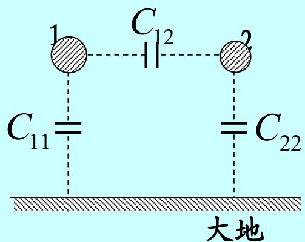

大地上空的平行双导线

如图所示，有三个部分电容 $C _ { 1 1 } , \ C _ { 2 2 } , \ C _ { 1 2 }$ 

导线 1 和 2 间的等效电容为

导线 1 和大地间的等效电容为

导线 2 和大地间的等效电容为 $C _ { 3 } = C _ { 2 2 } + \frac { C _ { 1 2 } C _ { 1 1 } } { C _ { 1 2 } + C _ { 1 1 } }$ 

# 3.1.4 静电场的能量与电容储能

静电场最基本的特征是对电荷有作用力，这表明静电场具有能量。

静电场能量来源于建立电荷系统的过程中外源提供的能量

任何形式的带电系统，都要经过从没有电荷分布到某个最终电荷分布的建立(或充电)过程。在此过程中，外加电源必须克服电荷之间的相互作用力而作功。

如果充电过程进行得足够缓慢，就不会有能量辐射，充电过程中外加电源所作的总功将全部转换成电场能量，或者说电场能量就等于外加电源在此电场建立过程中所作的总功。

# 静电场的能量

设系统从零开始充电，最终带电量为 q 、电位为 $\varphi$ 。

充电过程中某一时刻的电荷量为αq、电位为α 。 (0≤α≤1)

当α增加为 $( a + \mathbf { d } a )$ 时，外电源做功为: $: a \varphi ( q { \mathrm { ~ d } } a )$ 。

对 $\pmb { \alpha }$ 从0 到1积分，即得到外电源所做的总功为

$$
\int_ {0} ^ {1} \alpha q \varphi d \alpha = \frac {1}{2} q \varphi
$$

根据能量守恒定律，此功也就是电量为 $q$ 的带电体具有的电场能量 $W _ { e }$ ，即 $W _ { e } = { \frac { 1 } { 2 } } q \varphi$ 

电荷体密度ρ为的体分布电荷，体积元dV中的电荷ρdV具有的电场能量为$\mathrm { d } W _ { e } = { \frac { 1 } { 2 } } \rho \varphi \mathrm { d } V$ 二 ppdV

故体分布电荷的电场能量为

$$
W _ {e} = \frac {1}{2} \int_ {V} \rho \phi \mathrm {d} V
$$

对于面分布电荷， 电场能量为

$$
W _ {e} = \frac {1}{2} \int_ {S} \rho_ {S} \phi d S
$$

对于多导体组成的带电系统， 则有

$$
W _ {e} = \frac {1}{2} \sum_ {i} \oint_ {S _ {i}} \rho_ {S _ {i}} \varphi_ {i} \mathrm {d} S = \frac {1}{2} \sum_ {i} \varphi_ {i} \oint_ {S _ {i}} \rho_ {S _ {i}} \mathrm {d} S = \frac {1}{2} \sum_ {i} \varphi_ {i} q _ {i}
$$

式中：

qi 第i个导体所带的电荷

— 第 $i$ 个导体的电位

# 2 电场能量密度

从场的观点来看，静电场的能量分布于电场所在的整个空间。

电场能量密度： $w _ { e } = \frac { 1 } { 2 } \vec { D } \cdot \vec { E }$ 

电场的总能量： $W _ { e } = \frac { 1 } { 2 } \int _ { V } \vec { D } \cdot \vec { E } \mathrm { d } V$ 2 积分区域为电场所在的整个空间对于线性、各向同性介质，则有

$$
w _ {e} = \frac {1}{2} \vec {D} \cdot \vec {E} = \frac {1}{2} \varepsilon \vec {E} \cdot \vec {E} = \frac {1}{2} \varepsilon E ^ {2}
$$

$$
W _ {e} = \frac {1}{2} \int_ {V} \vec {D} \cdot \vec {E} \mathrm {d} V = \frac {1}{2} \int_ {V} \varepsilon \vec {E} \cdot \vec {E} \mathrm {d} V = \frac {1}{2} \int_ {V} \varepsilon E ^ {2} \mathrm {d} V
$$

$$
\begin{array}{r l} & \text {推 证 :} W _ {e} = \frac {1}{2} \int_ {V} \rho \varphi \mathrm {d} V = \frac {1}{2} \int_ {V} \nabla \cdot \vec {D} \varphi \mathrm {d} V \\ & \rho = \nabla \cdot \vec {D} = \frac {1}{2} \int_ {V} [ \nabla \cdot (\varphi \vec {D}) - \nabla \varphi \cdot \vec {D} ] \mathrm {d} V \\ & = \frac {1}{2} \oint_ {S} \varphi \vec {D} \cdot \mathrm {d} \vec {S} + \frac {1}{2} \int_ {V} \vec {E} \cdot \vec {D} \mathrm {d} V \end{array}
$$

由于体积V外的电荷密度 ${ \boldsymbol { \rho } } = \mathbf { 0 }$ ，若将上式中的积分区域扩大到整个场空间，结果仍然成立。只要电荷分布在有限区域内，当闭合面S无限扩大时，则有

$$
\varphi \propto \frac {1}{R}, D \propto \frac {1}{R ^ {2}}
$$

故 $\oint _ { s } \varphi { \vec { D } } \cdot \mathrm { d } { \vec { S } } \propto \oint _ { s } { \frac { 1 } { R } } \cdot { \frac { 1 } { R ^ { 2 } } } \mathrm { d } S \propto { \frac { 1 } { R } } \to 0$ 

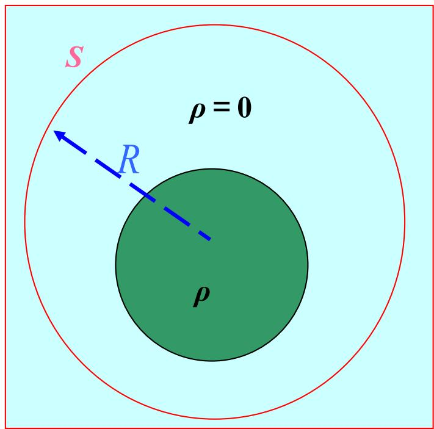

例： 半径为 $\pmb { a }$ 的球形空间内均匀分布有电荷体密度为ρ的电荷，试求静电场能量。

解： 方法一，利用 $W _ { e } = \frac { 1 } { 2 } \int _ { V } \vec { D } \cdot \vec { E } \mathrm { d } V$ 计算

根据高斯定理求得电场强度

$$
\vec {E} _ {1} = \vec {e} _ {r} \frac {\rho r}{3 \varepsilon_ {0}} (r <   a)
$$

$$
\vec {E} _ {2} = \vec {e} _ {r} \frac {\rho a ^ {3}}{3 \varepsilon_ {0} r ^ {2}} (r > a)
$$

故 $W _ { e } = \frac { 1 } { 2 } \int _ { \nu } \vec { D } \cdot \vec { E } \mathrm { d } V = \frac { 1 } { 2 } \int _ { V _ { 1 } } \varepsilon _ { 0 } E _ { 1 } ^ { 2 } \mathrm { d } V + \frac { 1 } { 2 } \int _ { V _ { 2 } } \varepsilon _ { 0 } E _ { 2 } ^ { 2 } \mathrm { d } \mu$ 

$$
= \frac {1}{2} \varepsilon_ {0} \left(\int_ {0} ^ {a} \frac {\rho^ {2} r ^ {2}}{9 \varepsilon_ {0} {} ^ {2}} \cdot 4 \pi r ^ {2} \mathrm {d} r + \int_ {a} ^ {\infty} \frac {\rho^ {2} a ^ {6}}{9 \varepsilon_ {0} {} ^ {2} r ^ {4}} \cdot 4 \pi r ^ {2} \mathrm {d} r\right) = \frac {4 \pi}{1 5 \varepsilon_ {0}} \rho^ {2} a ^ {5}
$$

方法二：利用 $W _ { e } = \frac { 1 } { 2 } \int _ { V } \rho \phi \mathrm { d } V$ 计算

先求出电位分布

$$
\begin{array}{l} \phi_ {1} = \int_ {r} ^ {a} \vec {E} _ {1} \cdot \mathrm {d} \vec {r} + \int_ {a} ^ {\infty} \vec {E} _ {2} \cdot \mathrm {d} \vec {r} = \int_ {r} ^ {a} \frac {\rho r}{3 \varepsilon_ {0}} \mathrm {d} r + \int_ {a} ^ {\infty} \frac {\rho a ^ {3}}{3 \varepsilon_ {0} r ^ {2}} \mathrm {d} r \\ = \frac {\rho}{2 \varepsilon_ {0}} \left(a ^ {2} - \frac {r ^ {2}}{3}\right) \qquad (r \leq a) \\ \end{array}
$$

故 ${ \frac { 1 } { 2 } } \int _ { \nu } \rho \phi _ { 1 } \mathrm { d } V = { \frac { 1 } { 2 } } \cdot { \frac { \rho ^ { 2 } } { 2 \varepsilon _ { 0 } } } \int _ { 0 } ^ { a } { ( a ^ { 2 } - { \frac { r ^ { 2 } } { 3 } } ) } 4 \pi r ^ { 2 } \mathrm { d } r = { \frac { 4 \pi } { 1 5 \varepsilon _ { 0 } } }$ r² -p²a1580

# 3.1.5 静电力

已知带电体的电荷分布，原则上，根据库仑定律可以计算带电体电荷之间的电场力。但对于电荷分布复杂的带电系统，根据库仑定律计算电场力往往是非常困难的，因此通常采用虚位移法来计算静电力。

虚位移法：假设第i个带电导体在电场力Fi的作用下发生位移dgi，则电场力做功 $\mathbf { d } A { = } F _ { i } \mathbf { d } g _ { i } ,$ ，系统的静电能量改变为dWe。根据能量守恒定律，该系统的功能关系

$$
\mathrm {d} W _ {S} = F _ {i} \mathrm {d} g _ {i} + \mathrm {d} W _ {e}
$$

其中 $\mathrm { d } W _ { S }$ 是与各带电体相连接的外电源所提供的能量。

具体计算中，可假定各带电导体的电位不变，或假定各带电导体的电荷不变。

# 各带电导体的电位不变

此时，各带电导体应分别与外电压源连接，外电压源向系统

提供的能量

$$
\mathrm {d} W _ {S} = \sum_ {i = 1} ^ {N} \mathrm {d} (q _ {i} \varphi_ {i}) = \sum_ {i = 1} ^ {N} \varphi_ {i} \mathrm {d} q _ {i}
$$

系统所改变的静电能量 $ \mathrm { d } W _ { e } = \frac { 1 } { 2 } \sum _ { i = 1 } ^ { N } \mathrm { d } ( q _ { i } \varphi _ { i } ) = \frac { 1 } { 2 } \sum _ { i = 1 } ^ { N } \varphi _ { i } \mathrm { d } q _ { i }$ 

即 dWs ${ \begin{array} { l } { = 2 \mathrm { d } W _ { e } \ \Longleftrightarrow \ F _ { i } \mathrm { d } g _ { i } = \mathrm { d } W _ { e } \ \Longrightarrow \ F _ { i } = { \frac { \partial W _ { e } } { \partial g _ { i } } } { \Bigg | } \ \varphi } \end{array} }$ 

# 2. 各带电导体的电荷不变

此时，所有带电体都不和外电源相连接，则 $\mathrm { d } W _ { S } = \mathbf { 0 }$ ，因此

$$
F _ {i} \mathrm {d} g _ {i} = - \mathrm {d} W _ {e} \quad \Longrightarrow \quad F _ {i} = - \frac {\partial W _ {e}}{\partial g _ {i}} \Bigg | _ {q \text {不 变}}
$$

式中的“－”号表示电场力做功是靠减少系统的静电能量来实现的。

例：有一平行金属板电容器，极板面积为 $l \times b$ ，板间距离为 $\pmb { d }$ ，用一块介质片（宽度为b、厚度为 $\pmb { d }$ ，介电常数为ε）部分填充在两极板之间，如图所示。设极板间外加电压为 $U _ { \mathbf { 0 } }$ ，忽略边缘效应，求介质片所受的静电力。

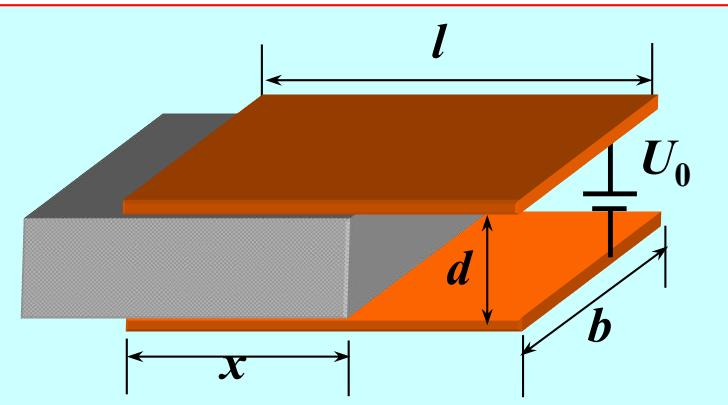

部分填充介质的平行板电容器

解 平行板电容器的电容为

$$
C = \varepsilon_ {0} \frac {(l - x) b}{d} + \varepsilon \frac {b x}{d}
$$

所以电容器内的电场能量为

$$
W _ {e} = \frac {1}{2} C U _ {0} ^ {2} = \frac {b U _ {0} ^ {2}}{2 d} [ \varepsilon_ {0} (l - x) + \varepsilon x ]
$$

由 $F _ { i } = \frac { \partial W _ { e } } { \partial g _ { i } } \bigg | .$ aWegi不变

可求得介质片受到的静电力为

$$
F _ {x} = \frac {\partial W _ {e}}{\partial x} \Bigg | _ {U _ {0} \text {不 变}} = \frac {b (\varepsilon - \varepsilon_ {0}) U _ {0} ^ {2}}{2 d}
$$

由于 $\pmb { \varepsilon } > \pmb { \varepsilon } _ { \mathbf { 0 } }$ ，所以介质片所受到的力有将其拉

进电容器的趋势

此题也可用式 $F _ { i } = - \frac { \partial W _ { e } } { \partial g _ { i } }$ 来计算q不变

设极板上保持总电荷q不变，则

$$
W _ {e} = \frac {q ^ {2}}{2 C} = \frac {d q ^ {2}}{2 b [ \varepsilon_ {0} (l - x) + \varepsilon x ]}
$$

由此可得 $F _ { x } = - \frac { \partial W _ { e } } { \partial x } \bigg \lvert q \mathcal { F } / \frac { } { \mathcal { K } } = \frac { d ( \varepsilon - \varepsilon _ { 0 } ) q ^ { 2 } } { 2 b [ \varepsilon _ { 0 } ( l - x ) + \varepsilon x ] ^ { 2 } }$ q不变 二

由于 $q = C U _ { 0 } = \frac { b U _ { 0 } } { d } [ \varepsilon _ { 0 } ( l - x ) + \varepsilon x ]$ 0 0 [ ( ) ]bU l x x= − + 

同样得到 $F _ { _ x } = { \frac { b ( \varepsilon - \varepsilon _ { 0 } ) U _ { 0 } ^ { 2 } } { 2 d } }$ 

# 3.2 恒定电场分析及应用

由 $J { = } \sigma E$ 可知，导体中若存在恒定电流，则必有维持该电流的电场，虽然导体中产生电场的电荷作定向运动，但导体中的电荷分布是一种不随时间变化的恒定分布，这种恒定分布电荷产生的电场称为恒定电场。

恒定电场和静电场都是有源无旋场，具有相同的性质。

恒定电场与静电场重要区别：

（1）恒定电场可以存在导体内部。

（2）恒定电场中有电场能量的损耗,要维持导体中的恒定电流，就必须有外加电源来不断补充被损耗的电场能量。

在物质空间中,静态电场有两种不同的类别。一种是电量恒定的静止电荷产生的静电场,另一种是导电媒质内部伴随传导电流的恒定电场。两种类别的静态电场在物理特性上有明显差异：

（1）静电场：电荷静止不动;如果存在导体,则其内部电场为零,不存在传导电流,且导体为等势体；

（2）恒定电场：存在于导体中的恒定电场驱动自由电荷匀速率运动形成恒定电流,恒定电场与恒定电流之间的关系符合欧姆定律，此时导体不再是等势体。

由于静电场与恒定电场的显著差异,因此在分析和求解时需要首先识别静态电场的类别。在实际问题中恒定电流通常需要电流回路来维持,所以常常通过导体是孤立存在的还是存在于电流回路中来判别静态电场问题的类别。

# 3.2.1 恒定电场的基本方程和边界条件

# 1.基本方程

电流密度 $\boldsymbol { J } ( \boldsymbol { r } )$ 和电场强度 $\boldsymbol { E } \left( \boldsymbol { r } \right)$ 是恒定电场的基本场矢量。我们讨论的是恒定电流，要维持电流不随时间变化，则空间的电场也必须是恒定不变的，这就要求电荷的空间分布也不随时间变化，所以有 $\frac { \partial \varrho } { \partial t } = 0$ =0。根据电流连续性方程$\int _ { V } \left( { \pmb { \nabla } } \cdot { \pmb { J } } + { \frac { \partial \rho } { \partial t } } \right) \mathrm { d } V = { \pmb { 0 } }$ 

$$
\oint_ {S} \boldsymbol {J} \cdot \mathrm {d} \boldsymbol {S} = 0 \tag {3.2.1a}
$$

相应的微分形式

$$
\nabla \cdot \boldsymbol {J} = 0 \tag {3.2.1b}
$$

式（3.2.1a）表明从闭合面S穿出的电流恒为零，因而闭合面包围的体积内的电量也不随时间改变。故我们可以得出结论：尽管电流是电荷的运动，但在恒定电流的状态下电荷分布并不随时间改变。由此我们可以认定恒定电场也是保守场，电场强度沿任一闭合路径的线积分恒为零，即

恒定电场的基本场矢量是电流密度 $\vec { J } ( \vec { r } )$ 和 电 场 强 度 $\vec { E } ( \vec { r } )$ 

恒定电场的基本方程为

微分形式： $\left\{ \begin{array} { l l } { \nabla \cdot { \vec { J } } = 0 } \\ { \nabla \times { \vec { E } } = 0 } \end{array} \right. \qquad { \stackrel { \triangledown } { \vec { \oplus } } } { \textstyle \overleftrightarrow { \vec { \oplus } } } { \textstyle \overleftrightarrow { \vec { \mp } \vec { \pmb { \mathrm { x } } } ^ { \ominus } } } \equiv { \textstyle \left\{ \begin{array} { l l } { \oint _ { s } { \vec { J } } \cdot d { \vec { S } } = 0 } \\ { \oint _ { C } { \vec { E } } \cdot d { \vec { l } } = 0 } \end{array} \right. }$ $\left\{ \begin{array} { l l } { \nabla \cdot { \vec { J } } = 0 } \\ { \nabla \times { \vec { E } } = 0 } \end{array} \right.$ $\left\{ \begin{array} { l l } { \oint _ { s } \vec { J } \cdot d \vec { S } = 0 } \\ { \oint _ { c } \vec { E } \cdot d \vec { l } = 0 } \end{array} \right.$ 

❖ 线性各向同性导电媒质的本构关系 ${ \vec { J } } = \sigma { \vec { E } }$ 

❖ 若媒质是均匀的，则 $\nabla \cdot \vec { J } = \nabla \cdot ( \sigma \vec { E } ) = \sigma \nabla \cdot \vec { E } = 0 \qquad \nabla \cdot \vec { E } = 0$ 

恒定电场的电位函数

$$
\nabla \times \vec {E} = 0 \Longrightarrow \vec {E} = - \nabla \phi
$$

均匀导电媒质中没有体分布电荷

$$
\nabla \cdot \vec {J} = 0 \Longrightarrow \nabla \cdot (\sigma \nabla \phi) = 0 \Longrightarrow \nabla^ {2} \phi = 0
$$

# 2 恒定电场的边界条件

# ❖ 场矢量的边界条件

$$
\oint_ {S} \vec {J} \cdot d \vec {S} = 0 \quad \Longrightarrow \quad \vec {e} _ {n} \cdot (\vec {J} _ {1} - \vec {J} _ {2}) = 0 \quad \text {即} J _ {1 n} = J _ {2 n}
$$

$$
\oint_ {C} \vec {E} \cdot d \vec {l} = 0 \Longrightarrow \vec {e} _ {n} \times (\vec {E} _ {1} - \vec {E} _ {2}) = 0 \text {即} E _ {1 t} = E _ {2 t}
$$

# 场矢量的折射关系

$$
\frac {\tan \theta_ {1}}{\tan \theta_ {2}} = \frac {E _ {1 t} / E _ {1 n}}{E _ {2 t} / E _ {2 n}} = \frac {\sigma_ {1} / J _ {1 n}}{\sigma_ {2} / J _ {2 n}} = \frac {\sigma_ {1}}{\sigma_ {2}}
$$

# 导电媒质分界面上的电荷面密度

$$
\rho_ {S} = \vec {e} _ {n} \cdot (\vec {D} _ {1} - \vec {D} _ {2}) = \vec {e} _ {n} \cdot (\frac {\varepsilon_ {1}}{\sigma_ {1}} \vec {J} _ {1} - \frac {\varepsilon_ {2}}{\sigma_ {2}} \vec {J} _ {2}) = (\frac {\varepsilon_ {1}}{\sigma_ {1}} - \frac {\varepsilon_ {2}}{\sigma_ {2}}) J _ {n}
$$

❖ 电位的边界条件 $\nonumber \phi _ { 1 } = \phi _ { 2 } , \quad \sigma _ { 1 } \frac { \partial \phi _ { 1 } } { \partial n } = \sigma _ { 2 } \frac { \partial \phi _ { 2 } } { \partial n }$ =02

❖ 说明：

恒定电场同时存在于导体内部和外部，在导体表面上的电场既有法向分量又有切向分量，电场并不垂直于导体表面，因而导体表面不是等位面；

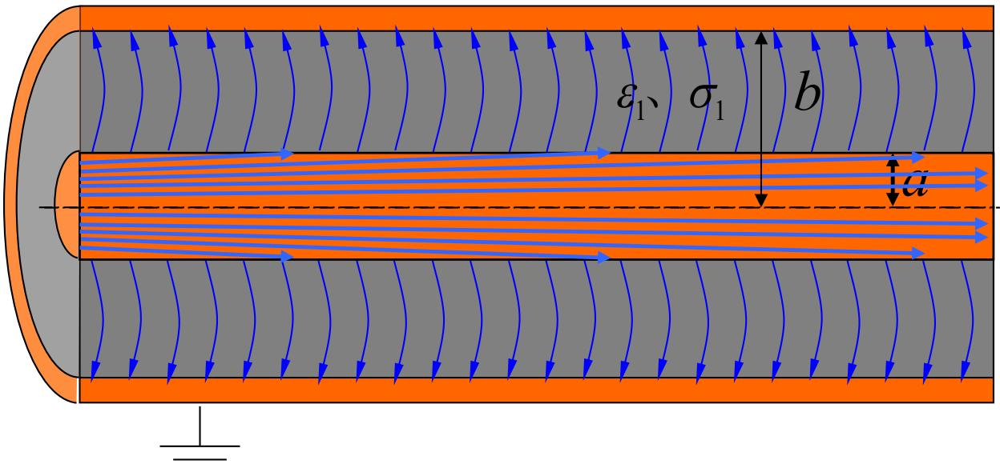

· $\sigma _ { 2 } > > \mathbf { 0 _ { 1 } }$ 、且 $\theta _ { 2 } \neq 9 0 ^ { \circ }$ ，则 $\boldsymbol { \theta } _ { 1 } = \mathbf { 0 }$ ， 即电场线近似垂直于与良导体表面。此时，良导体表面可近似地看作为等

位面； $\frac { ; \tan \theta _ { 1 } } { \tan \theta _ { 2 } } = \frac { E _ { 1 t } / E _ { 1 n } } { E _ { 2 t } / E _ { 2 n } } = \frac { \sigma _ { 1 } / J _ { 1 n } } { \sigma _ { 2 } / J _ { 2 n } } = \frac { \sigma _ { 1 } } { \sigma _ { 2 } }$ 

媒质1为理想介质，即 $\sigma _ { 1 } = \mathbf { 0 }$ ，则${ \cal J } _ { 1 } { = } { \bf 0 }$ ，故 ${ \cal J } _ { 2 \bf n } { } ^ { = } { \bf 0 }$ 且 $E _ { 2 \mathbf { n } } { = } \mathbf { 0 }$ ，即导体中的电流和电场与分界面平行。

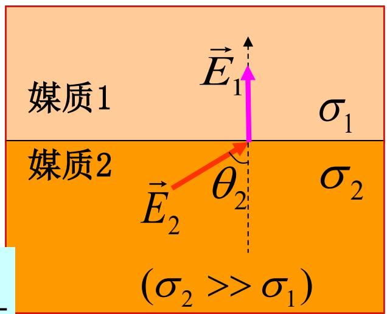

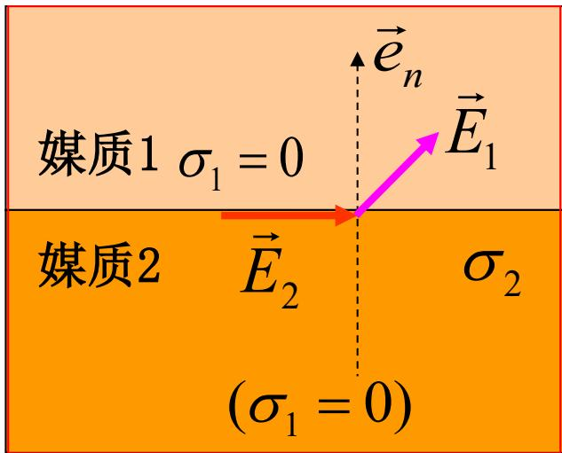

例：一个有两层介质的平行板电容器，其参数分别为 $\pmb { \varepsilon _ { 1 } }$ 、 $\sigma _ { 1 }$ 和$\pmb { \varepsilon } _ { 2 }$ $\sigma _ { 2 }$ ，外加电压U。求介质面上的自由电荷密度。

解：极板是理想导体，为等位面， 电流沿z方向。

由 $J _ { 1 n } = J _ { 2 n } \Rightarrow J _ { 1 } = J _ { 2 } = J$ 

$$
\begin{array}{l} \Rightarrow E _ {1} = \frac {J _ {1}}{\sigma_ {1}} = \frac {J}{\sigma_ {1}}, E _ {2} = \frac {J _ {2}}{\sigma_ {2}} = \frac {J}{\sigma_ {2}} \\ \Rightarrow U = U _ {1} + U _ {2} = E _ {1} d _ {1} + E _ {2} d _ {2} = \left(\frac {d _ {1}}{\sigma_ {1}} + \frac {d _ {2}}{\sigma_ {2}}\right) J \Rightarrow J = U / \left(\frac {d _ {1}}{\sigma_ {1}} + \frac {d _ {2}}{\sigma_ {2}}\right) \\ \end{array}
$$

由 D $D _ { 2 n } = \rho _ { S } \qquad \rho _ { S _ { \perp } } = D _ { 1 } = \frac { \varepsilon _ { 1 } } { \sigma _ { 1 } } J , \rho _ { S _ { \perp } } = - D _ { 2 } = - \frac { \varepsilon _ { 2 } } { \sigma _ { 2 } } J$ 

$$
\rho_ {S _ {\text {介}}} = D _ {2} - D _ {1} = \left(\frac {\varepsilon_ {2}}{\sigma_ {2}} - \frac {\varepsilon_ {1}}{\sigma_ {1}}\right) J = \frac {\sigma_ {1} \varepsilon_ {2} - \sigma_ {2} \varepsilon_ {1}}{\sigma_ {2} d _ {1} + \sigma_ {1} d _ {2}} U
$$

例：填充有两层介质的同轴电缆，内导体半径为 $\pmb { a }$ ，外导体半径为c，介质的分界面半径为b。两层介质的介电常数为 $\pmb { \varepsilon _ { 1 } }$ 和 $\pmb { \varepsilon } _ { 2 }$ 、电导率为 $\sigma _ { 1 }$ 和 $\sigma _ { 2 }$ 。设内导体的电压为 $U _ { \mathbf { 0 } }$ ，外导体接地。求：（1）两导体之间的电流密度和电场强度分布；（2）介质分界面上的自由电荷面密度。

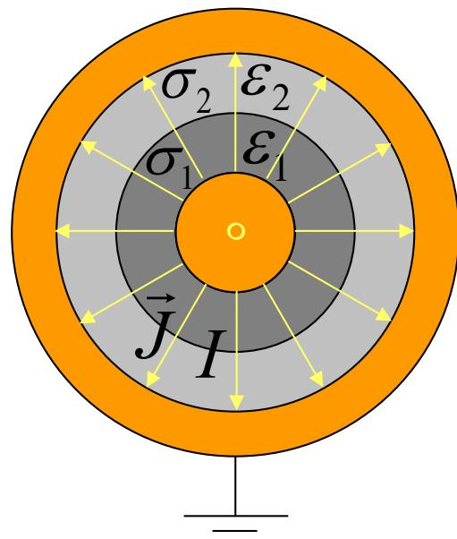

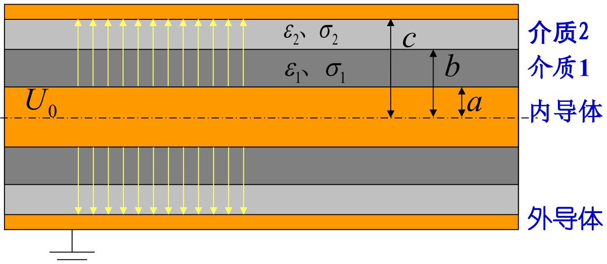

解 电流由内导体流向外导体，在分界面上只有法向分量，所以电流密度成轴对称分布。可先假设电流为I，由求出电流密度的表达式，然后求出 $\vec { E } _ { 1 }$ 和 $\vec { E } _ { 2 }$ ，再由 $U _ { 0 } = \int _ { a } ^ { b } { \vec { E } } _ { 1 } \cdot \mathrm { d } { \vec { \rho } } + \int _ { b } ^ { c } { \vec { E } } _ { 2 } \cdot \mathrm { d } { \vec { \rho } }$ 确定出电流 I。

（1）设同轴电缆中单位长度的径向电流为I,则由 $\int _ { \textrm { S } } \vec { J } { \cdot } \mathrm { d } \vec { S } = I \cdot l .$ 

可得电流密度

$$
\vec {J} = \vec {e} _ {\rho} \frac {I}{2 \pi \rho} (a <   \rho <   c)
$$

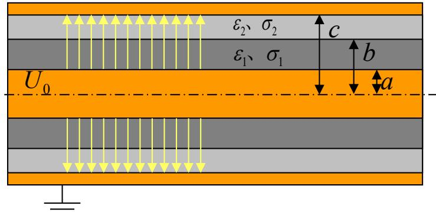

介质中的电场：

$$
\begin{array}{l} \vec {E} _ {1} = \frac {\vec {J}}{\sigma_ {1}} = \vec {e} _ {\rho} \frac {I}{2 \pi \sigma_ {1} \rho} \\ (a <   \rho <   b) \\ \end{array}
$$

$$
\vec {E} _ {2} = \frac {\vec {J}}{\sigma_ {2}} = \vec {e} _ {\rho} \frac {I}{2 \pi \sigma_ {2} \rho}
$$

$$
(b <   \rho <   c)
$$

由于

$$
U _ {0} = \int_ {a} ^ {b} \vec {E} _ {1} \cdot \mathrm {d} \vec {\rho} + \int_ {b} ^ {c} \vec {E} _ {2} \cdot \mathrm {d} \vec {\rho} = \frac {I}{2 \pi \sigma_ {1}} \ln \frac {b}{a} + \frac {I}{2 \pi \sigma_ {2}} \ln \frac {c}{b}
$$

于是得到 $I = \frac { 2 \pi \sigma _ { 1 } \sigma _ { 2 } U _ { 0 } } { \sigma _ { 2 } \ln ( b / a ) + \sigma _ { 1 } \ln ( c / b ) }$ 

故两种介质中的电流密度和电场强度分别为

$$
\vec {J} = \vec {e} _ {\rho} \frac {\sigma_ {1} \sigma_ {2} U _ {0}}{\rho [ \sigma_ {2} \ln (b / a) + \sigma_ {1} \ln (c / b) ]} (a <   \rho <   c)
$$

$$
\vec {E} _ {1} = \vec {e} _ {\rho} \frac {\sigma_ {2} U _ {0}}{\rho [ \sigma_ {2} \ln (b / a) + \sigma_ {1} \ln (c / b) ]} \quad (a <   \rho <   b)
$$

$$
\vec {E} _ {2} = \vec {e} _ {\rho} \frac {\sigma_ {1} U _ {0}}{\rho [ \sigma_ {2} \ln (b / a) + \sigma_ {1} \ln (c / b) ]} (b <   \rho <   c)
$$

（2）由 $\overrightarrow { \rho _ { S } = e _ { n } \cdot D }$ 可得，介质1内表面的电荷面密度为

$$
\rho_ {S 1} = \varepsilon_ {1} \vec {e} _ {\rho} \cdot \left. \vec {E} _ {1} \right| _ {\rho = a} = \frac {\varepsilon_ {1} \sigma_ {2} U _ {0}}{a [ \sigma_ {2} \ln (b / a) + \sigma_ {1} \ln (c / b) ]} \quad \left(\vec {e} _ {n} = \vec {e} _ {\rho}\right)
$$

介质2外表面的电荷面密度为

$$
\rho_ {S 2} = - \varepsilon_ {2} \vec {e} _ {\rho} \cdot \vec {E} _ {2} \Big | _ {\rho = c} = - \frac {\varepsilon_ {2} \sigma_ {1} U _ {0}}{c [ \sigma_ {2} \ln (b / a) + \sigma_ {1} \ln (c / b) ]} \quad (\vec {e} _ {n} = - \vec {e} _ {\rho})
$$

两种介质分界面上的电荷面密度为

$$
\begin{array}{l} \rho_ {S 1 2} = \left(\varepsilon_ {2} \vec {e} _ {\rho} \cdot \vec {E} _ {2} - \varepsilon_ {1} \vec {e} _ {\rho} \cdot \vec {E} _ {1}\right) \bigg | _ {\rho = b} \\ = \frac {(\varepsilon_ {2} \sigma_ {1} - \varepsilon_ {1} \sigma_ {2}) U _ {0}}{b [ \sigma_ {2} \ln (b / a) + \sigma_ {1} \ln (c / b) ]} \\ \end{array}
$$

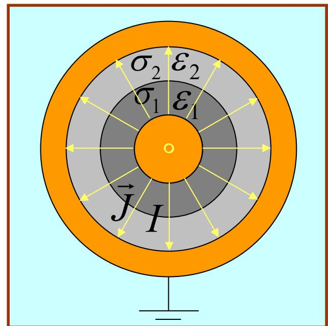

# 3.2.2 恒定电场与静电场的比拟

恒定电场与静电场的比拟

<table><tr><td></td><td>静电场（ρ=0区域）</td><td>恒定电场（电源外）</td></tr><tr><td rowspan="2">基本方程</td><td>ΦS D·dS=0, ΦC E·dI=0</td><td>ΦS J·dS=0, ΦC E·dI=0</td></tr><tr><td>∇·D=0, ∇×E=0</td><td>∇·J=0, ∇×E=0</td></tr><tr><td>本构关系</td><td>D̅ = εE</td><td>J̅ = σE̅</td></tr><tr><td>位函数</td><td>E̅ = -∇φ, ∇2φ=0</td><td>E̅ = -∇φ, ∇2φ=0</td></tr><tr><td rowspan="2">边界条件</td><td>E1t = E2t, D1n = D2n</td><td>E1t = E2t, J1n = J2n</td></tr><tr><td>φ1=φ2, ε1∂φ1/∂n = ε2∂φ2/∂n</td><td>φ1=φ2, σ1∂φ1/∂n = σ2∂φ2/∂n</td></tr></table>

<table><tr><td rowspan="2">对应物理量</td><td>静电场</td><td>E</td><td>D</td><td>φ</td><td>q</td><td>ε</td><td>C</td></tr><tr><td>恒定电场</td><td>E</td><td>J</td><td>φ</td><td>I</td><td>σ</td><td>G</td></tr></table>

如果两种场，在一定条件下，场方程有相同的形式，边界形状相同，边界条件等效，则其解也必有相同的形式，求解这两种场分布必然是同一个数学问题。只需求出一种场的解，就可以用对应的物理量作替换而得到另一种场的解。这种求解场的方法称为比拟法。

# 3.2.3 导体的电阻与电导

工程上常在电容器两极板之间，同轴电缆的芯线与外壳之间，填充不导电的材料作电绝缘。这些绝缘材料的电导率远远小于金属材料的电导率，但毕竟不为零，因而当在电极间加上电压U 时，必定会有微小的漏电流 $J$ 存在。

漏电流与电压之比为漏电导， 即

$$
G = \frac {I}{U}
$$

其倒数称为绝缘电阻，即

$$
R = \frac {1}{G} = \frac {U}{I}
$$

计算电导的方法一：

) 假定两电极间的电流为I；

(2) 计算两电极间的电流密度矢量J；

(3) 由 $J { = } \sigma E$ 得到 E ;

(4) 由 $U = \int _ { 1 . } ^ { 2 } { \vec { E } } \cdot d { \vec { l } }$ ， 求出两导体间的电位差；

(5) 求比值 $G = I / U$ ， 即得出所求电导。

计算电导的方法二：

假定两电极间的电位差为U；

(2) 计算两电极间的电位分布 $\varphi$ ；

(3) 由 $\vec { E } = - \nabla \phi$ 得到E;

(4) 由 $J { = } \sigma E$ 得到J;

(5) 由 $I = \int _ { S } { \vec { J } } \cdot d { \vec { S } }$ ，求出两导体间电流；

(6) 求比值 $G = I / U$ ，即得出所求电导。

计算电导的方法三：

静电比拟法： $\frac { G } { C } = \frac { \sigma } { \varepsilon }$ 

例： 求同轴电缆的绝缘电阻。设内外的半径分别为a、b， 长度为l ，其间媒质的电导率为σ、介电常数为ε。

解：直接用恒定电场的计算方法

设由内导体流向外导体的漏电流为I。

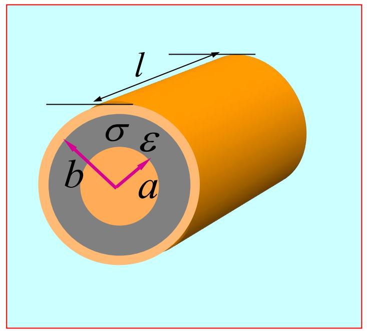

则 $\overrightarrow { \vert } \overrightarrow { \Bigg . } \Bigg \downarrow \Bigg \downarrow \Bigg \downarrow = \frac { J } { \sigma } = \frac { I } { 2 \pi \rho l \sigma }$ E=

$$
U = \int {\vec {E} \cdot d \vec {l}} = \int_ {a} ^ {b} \frac {I}{2 \pi \rho l \sigma} d \rho = \frac {I}{2 \pi \sigma l} \ln \frac {b}{a}
$$

电导 $G = { \frac { I } { U } } = { \frac { 2 \pi \sigma l } { \ln ( b / a ) } }$ 

绝缘电阻 $R = { \frac { 1 } { G } } = { \frac { 1 } { 2 \pi \sigma l } } \ln { \frac { b } { a } }$ 

例： 在一块厚度 $\pmb { h }$ 的导电板上， 由两个半径为 $r _ { 1 }$ 和 $r _ { 2 }$ 的圆弧和夹角为 $\phi _ { 0 }$ 的两半径割出的一段环形导电媒质，如图所示。计算沿方向的两电极之间的电阻。设导电媒质的电导率为σ。

解： 设在沿方向的两电极之间外加电压 $U _ { \mathbf { 0 } }$ ，则电流沿 $\phi$ 方向流动，而且电流密度是随变化的。但容易判定电位 $\varphi$ 只是变量的函数，因此电位函数 $\varphi$ 满足一维拉普拉斯方程

$$
\nabla^ {2} \varphi = \frac {1}{\rho^ {2}} \frac {\partial^ {2} \varphi}{\partial \phi^ {2}} = 0
$$

方程通解为

$$
\varphi = C _ {1} \phi + C _ {2}
$$

代入边界条件

$$
\varphi \big | _ {\phi = 0} = U _ {0}, \quad \varphi \big | _ {\phi = \phi_ {0}} = 0
$$

可以得到

$$
C _ {1} = - U _ {0} / \phi_ {0}, C _ {2} = U _ {0}
$$

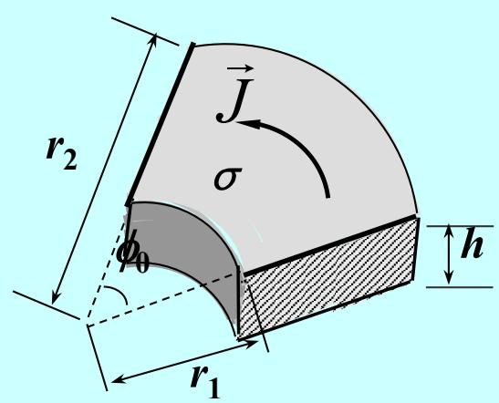

环形导电媒质块

所以 $\varphi = U _ { \mathrm { 0 } } - \frac { U _ { \mathrm { 0 } } } { \phi _ { \mathrm { 0 } } } \phi$ 

$$
\vec {E} = - \nabla \varphi = - \vec {e} _ {\phi} \frac {\partial \varphi}{\rho \partial \phi} = \vec {e} _ {\phi} \frac {U _ {0}}{\rho \phi_ {0}}
$$

电流密度 J=gE=e $\vec { J } = \sigma \vec { E } = \vec { e } _ { \phi } \frac { \sigma U _ { \mathrm { 0 } } } { \rho \phi _ { \mathrm { 0 } } }$ 

两电极之间的电流

$$
I = \int_ {S} \vec {J} \cdot \mathrm {d} \vec {S} = \int_ {r _ {1}} ^ {r _ {2}} \vec {e} _ {\phi} \frac {\sigma U _ {0}}{\rho \phi_ {0}} \cdot \vec {e} _ {\phi} h \mathrm {d} \rho = \frac {\sigma U _ {0} h}{\phi_ {0}} \ln \frac {r _ {2}}{r _ {1}}
$$

故沿方向的两电极之间的电阻为

$$
R = \frac {U _ {0}}{I} = \frac {\phi_ {0}}{\sigma h \ln (r _ {2} / r _ {1})} \quad (\Omega)
$$

# 3.3 恒定磁场分析及应用

3.3.1 恒定磁场的基本方程和边界条件

3.3.2 恒定磁场的矢量磁位和标量磁位

3.3.3 电感

3.3.4 恒定磁场的能量

3.3.5 磁场力（恒定磁场中载流体的受力）

# 3.3.1 恒定磁场的基本方程和边界条件

基本方程

微分形式:

$$
\left\{ \begin{array}{l} \nabla \times \vec {H} = \vec {J} \\ \nabla \cdot \vec {B} = 0 \end{array} \right.
$$

积分形式:

$$
\left\{ \begin{array}{l} \oint_ {\mathrm {C}} \vec {H} \cdot \mathrm {d} \vec {l} = \int_ {\mathrm {S}} \vec {J} \cdot \mathrm {d} \vec {S} \\ \oint_ {\mathrm {S}} \vec {B} \cdot \mathrm {d} \vec {S} = 0 \end{array} \right.
$$

本构关系： $\vec { B } = \mu \vec { H }$ 

2. 边界条件

$$
\left\{ \begin{array}{l} \vec {e} _ {n} \cdot (\vec {B} _ {1} - \vec {B} _ {2}) = 0 \\ \vec {e} _ {n} \times (\vec {H} _ {1} - \vec {H} _ {2}) = \vec {J} _ {S} \end{array} \right.
$$

或

$$
\left\{ \begin{array}{l} B _ {1 n} - B _ {2 n} = 0 \\ H _ {1 t} - H _ {2 t} = J _ {S} \end{array} \right.
$$

若分界面上不存在面电流，即 $J _ { \mathrm { { S } } } = 0$ ，则

$$
\left\{ \begin{array}{l} \vec {e} _ {n} \cdot (\vec {B} _ {1} - \vec {B} _ {2}) = 0 \\ \vec {e} _ {n} \times (\vec {H} _ {1} - \vec {H} _ {2}) = 0 \end{array} \right.
$$

或

$$
\left\{ \begin{array}{l} B _ {1 n} - B _ {2 n} = 0 \\ H _ {1 t} - H _ {2 t} = 0 \end{array} \right.
$$

# 3.3.2 恒定磁场的矢量磁位和标量磁位

# 1.恒定磁场的矢量磁位

# 矢量磁位的定义

由

$$
\nabla \cdot \vec {B} = 0 \quad \Longrightarrow \quad \vec {B} = \nabla \times \vec {A}
$$

矢量磁位或称磁矢位

恒定磁场可以用一个矢量函数的旋度来表示。

# 磁矢位的任意性

与电位一样，磁矢位也不是惟一确定的，它加上任意一个标量 的梯度以后，仍然表示同一个磁场，即

$$
\vec {A} ^ {\prime} = \vec {A} + \nabla \psi \Longrightarrow \nabla \times \vec {A} ^ {\prime} = \nabla \times \vec {A} + \nabla \times (\nabla \psi) = \nabla \times \vec {A}
$$

磁矢位的任意性是因为只规定了它的旋度，没有规定其散度造成的。为了得到确定的A，可以对A的散度加以限制，在恒定磁场中通常规定 $\nabla \cdot { \overset { \vartriangle } { \boldsymbol { A } } } = 0$ ，并称为库仑规范。

矢位的微分方程

$$
\begin{array}{l} \vec {B} = \nabla \times \vec {A} \\ \nabla \times \vec {H} = \vec {J} \\ \end{array}
$$

$$
\Longrightarrow \nabla \times \nabla \times \vec {A} = \mu \vec {J} \Longrightarrow \nabla (\nabla \cdot \vec {A}) - \nabla^ {2} \vec {A} = \mu \vec {J}
$$

$$
\nabla \cdot \vec {A} = 0 \quad \Longrightarrow \quad \nabla^ {2} \vec {A} = - \mu \vec {J} \quad \text {矢 量 泊 松 方 程}
$$

无源区：

$$
\vec {J} = 0 \quad \Longrightarrow \quad \nabla^ {2} \vec {A} = 0 \quad \text {矢 量 拉 普 拉 斯 方 程}
$$

$$
\text {矢 量 磁 位 的 表 达 式} \quad \frac {\vec {R}}{R ^ {3}} = - \nabla (\frac {1}{R})
$$

$$
\begin{array}{l} \vec {B} (\vec {r}) = \frac {\mu}{4 \pi} \int_ {V} \frac {\vec {J} (\vec {r} ^ {\prime}) \times \vec {R}}{R ^ {3}} \mathrm {d} V ^ {\prime} = - \frac {\mu}{4 \pi} \int_ {V} \vec {J} (\vec {r} ^ {\prime}) \times \nabla \left(\frac {1}{R}\right) \mathrm {d} V ^ {\prime} \\ = \nabla \times [ \frac {\mu}{4 \pi} \int_ {V} \vec {J} (\vec {r} ^ {\prime}) (\frac {1}{R}) \mathrm {d} V ^ {\prime} ] \\ \end{array}
$$

$$
\nabla \times \left(\frac {\vec {J} (\vec {r} ^ {\prime})}{R}\right) = - \vec {J} (\vec {r} ^ {\prime}) \times \nabla \left(\frac {1}{R}\right) + \frac {1}{R} \nabla \times \vec {J} (\vec {r} ^ {\prime}) = - \vec {J} (\vec {r} ^ {\prime}) \times \nabla \left(\frac {1}{R}\right)
$$

由此可得出 $\vec { A } ( \vec { r } ) = \frac { \mu } { 4 \pi } \int _ { V } \frac { \vec { J } ( \vec { r } ^ { \prime } ) } { R } \mathrm { d } V ^ { \prime }$ （可以证明满足 ）

对于面电流和细导线电流回路，磁矢位分别为

面电流： $\vec { A } ( \vec { r } ) = \frac { \mu } { 4 \pi } \int _ { S } \frac { \vec { J } _ { s } ( \vec { r } ^ { \prime } ) } { R } \mathrm { d } S ^ { \prime }$ 细线电流： $\vec { A } ( \vec { r } ) = \frac { \mu I } { 4 \pi } \oint _ { C } \frac { { \mathrm { d } } \vec { l ^ { \prime } } } { R }$ 

利用磁矢位计算磁通量： $\varPhi = \int _ { S } \vec { B } \cdot \mathrm { d } \vec { S } = \int _ { S } \nabla \times \vec { A } \cdot \mathrm { d } \vec { S } = \oint _ { C } \vec { A } \cdot \mathrm { d } \vec { l }$ 

磁矢位的边界条件

$$
\left. \begin{array}{l} \oint_ {C} \vec {A} \cdot \mathrm {d} \vec {l} = \int_ {S} \vec {B} \cdot \mathrm {d} \vec {S} \quad \Longrightarrow A _ {1 t} = A _ {2 t} \\ \nabla \cdot \vec {A} = 0 \Longrightarrow \oint_ {S} \vec {A} \cdot \mathrm {d} \vec {S} = 0 \Longrightarrow A _ {1 n} = A _ {2 n} \end{array} \right\} \Longrightarrow \vec {A} _ {1} = \vec {A} _ {2}
$$

$$
\left. \begin{array}{l} \vec {e} _ {n} \times (\vec {H} _ {1} - \vec {H} _ {2}) = \vec {J} _ {S} \\ \vec {H} = \nabla \times \vec {A} / \mu \end{array} \right\} \Longrightarrow \vec {e} _ {n} \times (\frac {1}{\mu_ {1}} \nabla \times \vec {A} _ {1} - \frac {1}{\mu_ {2}} \nabla \times \vec {A} _ {2}) = \vec {J} _ {S}
$$

$$
\vec {B} = \nabla \times \vec {A} \quad \text {代 入} \hat {e} _ {n} \cdot (\vec {B} _ {1} - \vec {B} _ {2}) = 0 \quad \text {得}
$$

$$
\begin{array}{l} 0 = \hat {e} _ {n} \cdot (\nabla \times \vec {A} _ {1} - \nabla \times \vec {A} _ {2}) = \nabla \cdot (\vec {A} _ {1} \times \hat {e} _ {n}) - \nabla \cdot (\vec {A} _ {2} \times \hat {e} _ {n}) \\ \therefore \nabla \cdot (\hat {\boldsymbol {e}} _ {n} \times \vec {A} _ {1}) = \nabla \cdot (\hat {\boldsymbol {e}} _ {n} \times \vec {A} _ {2}) \\ \hat {e} _ {n} \times \vec {A} _ {1}? \hat {e} _ {n} \times \vec {A} _ {2} \\ \nabla \cdot (\nabla \times \vec {A} _ {2}) \equiv 0 \\ \Rightarrow \hat {e} _ {n} \times \vec {A} _ {1} = \hat {e} _ {n} \times \vec {A} _ {2} + \nabla \times \vec {A} _ {2}? \\ \end{array}
$$

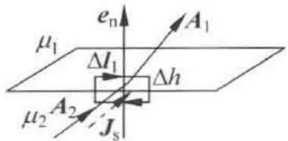

(a)切向分量

# 1.矢量磁位的边界条件

如图3-15（a）所示，在媒质分界面两侧构建足够小的矩形积分回路，其高度△h趋于零，回路所包围的面积也趋于零，因此通过回路面积的磁通量 $\varPhi _ { \mathrm { m } }$ 分析，矢量磁位A的沿线积分结果为

$$
\Phi_ {\mathrm {m}} = \int_ {S} \boldsymbol {B} \cdot \mathrm {d} \boldsymbol {S} = \int_ {S} (\nabla \times A) \cdot \mathrm {d} \boldsymbol {S} = \oint_ {l} \boldsymbol {A} \cdot \mathrm {d} l ^ {\Delta h \rightarrow 0} = \boldsymbol {A} _ {1} \cdot \Delta l _ {1} + \boldsymbol {A} _ {2} \cdot \Delta l _ {2} = 0
$$

$\Delta l _ { 1 } = - \Delta l _ { 2 } = \Delta l = e , \Delta l ,$ 

$$
A _ {1 t} = A _ {2 t}
$$

矢量磁位的引入 B A= 

库仑规范 V.A=0

矢量磁位的表达式 ( )d ( ) J rA r =  $\mathrm { d } \vec { A } ( \vec { r } ) = \frac { \mu } { 4 \pi } \frac { \vec { J } ( \vec { r } ^ { \prime } ) } { R } \mathrm { d } V ^ { \prime }$ 

矢量磁位的边界条件 $\vec { A } _ { 1 } = \vec { A } _ { 2 }$ 

利用矢量磁位计算磁通量：

$$
\boldsymbol {\varPhi} = \int_ {S} \vec {B} \cdot \mathrm {d} \vec {S} = \int_ {S} \nabla \times \vec {A} \cdot \mathrm {d} \vec {S} = \oint_ {C} \vec {A} \cdot \mathrm {d} \vec {l}
$$

$$
\vec {A} (\vec {r}) = \frac {\mu I}{4 \pi} \oint_ {C} \frac {\mathrm {d} \vec {l ^ {\prime}}}{R}
$$

例 ： 求无限长线电流 $\boldsymbol { I }$ 的磁矢位，设电流沿 ${ \bf + \mathbf { z } }$ 方向流动。

解：先长度为2L的直线电流的磁矢位。电流元 $I \mathrm { d } \vec { l ^ { \prime } } = \vec { e } _ { z } I \mathrm { d } z ^ { \prime }$ 到

点 $P ( \rho , \phi , z )$ 的距离 $R = \sqrt { \rho ^ { 2 } + ( z - z ^ { \prime } ) _ { \circ } ^ { 2 } }$ 。则

$$
\begin{array}{l} \vec {A} (\vec {r} ^ {\prime}) = \vec {e} _ {z} \frac {\mu_ {0} I}{4 \pi} \int_ {- L} ^ {L} \frac {1}{\sqrt {\rho^ {2} + (z - z ^ {\prime}) ^ {2}}} \mathrm {d} z ^ {\prime} \\ = \vec {e} _ {z} \frac {\mu_ {0} I}{4 \pi} \ln [ z ^ {\prime} - z + \sqrt {\rho^ {2} + (z - z ^ {\prime}) ^ {2}} ] \Bigg | _ {- L} ^ {L} \\ = \vec {e} _ {z} \frac {\mu_ {0} I}{4 \pi} \ln \frac {\sqrt {\rho^ {2} + (z - L) ^ {2}} - (z - L)}{\sqrt {\rho^ {2} + (z + L) ^ {2}} - (z + L)} \\ \end{array}
$$

与计算无限长线电荷的电位一样，令 可得到无限长线电流L → 

的磁矢位

$$
\vec {A} (\vec {r}) = \vec {e} _ {z} \frac {\mu_ {0} I}{2 \pi} \ln \frac {\rho_ {0}}{\rho}
$$

$$
\vec {A} (\vec {r}) = \frac {\mu I}{4 \pi} \oint_ {C} \frac {\mathrm {d} \vec {l ^ {\prime}}}{R}
$$

例 求小圆环电流回路的远区矢量磁位与磁场。小圆形回路的

半径为a， 回路中的电流为I 。

解 如图所示，由于具有轴对称性，矢量磁位和磁场均与无关，计算xz平面上的矢量磁位与磁场将不失一般性。

$$
\vec {r} = \vec {e} _ {r} r = r (\vec {e} _ {x} \sin \theta + \vec {e} _ {z} \cos \theta)
$$

$$
\vec {r} ^ {\prime} = \vec {e} _ {r} ^ {\prime} a = a (\vec {e} _ {x} \cos \phi^ {\prime} + \vec {e} _ {z} \sin \phi^ {\prime})
$$

$$
\mathrm {d} \vec {l} ^ {\prime} = \vec {e} _ {\phi} ^ {\prime} a \mathrm {d} \phi^ {\prime} = (- \vec {e} _ {x} \sin \phi^ {\prime} + \vec {e} _ {y} \cos \phi^ {\prime}) a \mathrm {d} \phi^ {\prime}
$$

$$
\begin{array}{l} \left| \vec {r} - \vec {r} ^ {\prime} \right| = \left[ \left(r \sin \theta - a \cos \phi^ {\prime}\right) ^ {2} + a ^ {2} \sin^ {2} \phi^ {\prime} + r ^ {2} \cos^ {2} \theta) \right] ^ {1 / 2} \\ = [ r ^ {2} + a ^ {2} - 2 a r \sin \theta \cos \phi^ {\prime} ] ^ {1 / 2} \\ \end{array}
$$

$$
\vec {A} (\vec {r}) = \frac {\mu I}{4 \pi} \oint_ {C} \frac {\mathrm {d} \vec {l ^ {\prime}}}{R}
$$

对于远区， 有 $r > > a$ ，所以

$$
\begin{array}{l} \frac {1}{| \vec {r} - \vec {r ^ {\prime}} |} = \frac {1}{r} [ 1 + (\frac {a}{r}) ^ {2} - \frac {2 a}{r} \sin \theta \cos \phi^ {\prime} ] ^ {- 1 / 2} \approx \frac {1}{r} [ 1 - \frac {2 a}{r} \sin \theta \cos \phi^ {\prime} ] ^ {- 1 / 2} \\ \approx \frac {1}{r} (1 + \frac {a}{r} \sin \theta \cos \phi^ {\prime}) \\ \end{array}
$$

于是得到

$$
\begin{array}{l} \vec {A} (\vec {r}) = \frac {\mu_ {0} I a}{4 \pi} \int_ {0} ^ {2 \pi} \frac {1}{r} (1 + \frac {a}{r} \sin \theta \cos \phi^ {\prime}) (- \vec {e} _ {x} \sin \phi^ {\prime} + \vec {e} _ {y} \cos \phi^ {\prime}) d \phi^ {\prime} \\ = \vec {e} _ {y} \frac {\mu_ {0} I \pi a ^ {2}}{4 \pi r ^ {2}} \sin \theta \\ \end{array}
$$

由于在 ${ \bf \nabla } \phi = \bf 0$ 面上 $\vec { e } _ { y } = \vec { e } _ { \phi }$ e， 所以上式可写成

$$
\vec {A} (\vec {r}) = \vec {e} _ {\phi} \frac {\mu_ {0} I \pi a ^ {2}}{4 \pi r ^ {2}} \sin \theta = \vec {e} _ {\phi} \frac {\mu_ {0} I S}{4 \pi r ^ {2}} \sin \theta
$$

小圆环电流

$$
\begin{array}{l} \vec {B} = \nabla \times \vec {A} = \vec {e} _ {r} \frac {1}{r \sin \theta} \frac {\partial}{\partial \theta} (\sin \theta A _ {\phi}) - \vec {e} _ {\theta} \frac {1}{r} \frac {\partial}{\partial r} (r A _ {\phi}) \\ = \frac {\mu_ {0} I S}{4 \pi r ^ {3}} (\vec {e} _ {r} 2 \cos \theta + \vec {e} _ {\theta} \sin \theta) \\ \end{array}
$$

式中 $S = \pi a ^ { 2 }$ 是小圆环的面积。

载流小圆环可看作为磁偶极子， ${ \vec { p } } _ { m } = I { \vec { S } }$ 为磁偶极子的磁矩（或磁偶极矩），则

$$
\vec {A} (\vec {r}) = \vec {e} _ {\phi} \frac {\mu_ {0} p _ {m}}{4 \pi r ^ {2}} \sin \theta \quad \text {或} \quad \vec {A} (\vec {r}) = \frac {\mu_ {0}}{4 \pi r ^ {3}} \vec {p} _ {m} \times \vec {r}
$$

$$
\vec {B} (\vec {r}) = \frac {\mu_ {0} p _ {m}}{4 \pi r ^ {3}} (\vec {e} _ {r} 2 \cos \theta + \vec {e} _ {\theta} \sin \theta)
$$

# 2.恒定磁场的标量磁位

由磁场环路定律得

$$
\oint_ {L} \boldsymbol {H} \cdot \mathrm {d} \boldsymbol {l} = \int_ {S} \boldsymbol {J} \cdot \mathrm {d} \boldsymbol {S}
$$

其中 $L$ 为 $S$ 的边界.如果回路 $L$ 链环着电流，即有电流穿过 $L$ 所围曲面S，则

$$
\oint_ {L} \boldsymbol {H} \cdot \mathrm {d} \boldsymbol {l} \neq 0
$$

在这种情形下 $\pmb { H }$ 和力学中的非保守力场相似，因而不能引人标势.但是在很多实际问题中，我们不必求出整个空间中的磁场，而只需求出某个局部区域的磁场.在这局部区域内，如果所有回路 $L$ 都没有链环着电流，则

$$
\oint_ {L} \boldsymbol {H} \cdot \mathrm {d} \boldsymbol {l} = 0
$$

# 标量磁位

一般情况下，恒定磁场引入矢量磁位来描述，但在无传导电流$( J = 0 )$ ）的空间 中，则有 标量磁位或磁标位

$$
\nabla \times \vec {H} = 0 \quad \Longrightarrow \quad \vec {H} = - \nabla \varphi_ {m}
$$

在无传导电流（ $\mathbf { \bar { \rho } } _ { J = \mathbf { 0 } } \mathbf { \dot { \varepsilon } } _ { \ \mathrm { ~ } }$ ）的空间中，可以引入一个标量位函数来描述磁场。  = −P p

磁标位的微分方程 等效磁荷体密度

$$
\nabla \cdot \vec {B} = 0, \vec {B} = \mu_ {0} (\vec {H} + \vec {M}) \Longrightarrow \nabla \cdot \vec {H} = - \nabla \cdot \vec {M} = \frac {\rho_ {m}}{\mu_ {0}}
$$

将 ${ \vec { H } } = - \nabla \varphi _ { m }$ 代入 $\nabla \cdot \vec { H } = \frac { \rho _ { m } } { \mu _ { 0 } } \mathop { \longrightarrow } \nabla ^ { 2 } \varphi _ { m } = - \frac { \rho _ { m } } { \mu _ { 0 } }$ √

在线性、 各向同性的均匀媒质中

$$
\vec {B} = \mu \vec {H} 、 \vec {H} = - \nabla \varphi_ {m} 、 \nabla \cdot \vec {B} = 0 \quad \Longrightarrow \nabla^ {2} \varphi_ {m} = 0
$$

标量磁位的表达式

与静电位相比较， 有

$$
\varphi (\vec {r}) = \frac {1}{4 \pi \varepsilon_ {0}} \int_ {V} \frac {\rho (\vec {r} ^ {\prime})}{R} \mathrm {d} V ^ {\prime} \quad \Longrightarrow \quad \varphi_ {m} (\vec {r}) = \frac {1}{4 \pi \mu_ {0}} \int_ {V} \frac {\rho_ {m} (\vec {r} ^ {\prime})}{R} \mathrm {d} V ^ {\prime}
$$

标量磁位的边界条件

$$
\varphi_ {m 1} = \varphi_ {m 2} \quad \text {和} \quad \mu_ {1} \frac {\partial \varphi_ {m 1}}{\partial n} = \mu_ {2} \frac {\partial \varphi_ {m 2}}{\partial n}
$$

或 $\varphi _ { m 1 } = \varphi _ { m 2 }$ 和 $\frac { \partial { \varphi _ { m 2 } } } { \partial { n } } - \frac { \partial { \varphi _ { m 1 } } } { \partial { n } } = - \frac { \rho _ { m S } } { \mu _ { 0 } }$ 

式中： $\rho _ { m S } = - \mu _ { 0 } \vec { e } _ { n } { \bullet } ( \vec { M } _ { 1 } - \vec { M } _ { 2 } )$ 等效磁荷面密度

# 恒定磁场标量磁位与静电场电位函数的比较

电位

标量磁位

$$
\begin{array}{l} \nabla \times \vec {E} = 0, \nabla \cdot \vec {D} = \rho \quad \nabla \times \vec {H} = 0, \nabla \cdot \vec {B} = 0 \\ \vec {E} = - \nabla \varphi \quad \vec {H} = - \nabla \varphi_ {m} \\ \end{array}
$$

$$
\begin{array}{l} \nabla^ {2} \varphi = - (\rho + \rho_ {P}) / \varepsilon_ {0} \qquad \nabla^ {2} \varphi_ {m} = - \rho_ {m} / \mu_ {0} \\ \rho_ {P} = - \nabla \cdot \vec {P} \rho_ {m} = - \mu_ {0} \nabla \cdot \vec {M} \\ \rho_ {P S} = - \vec {e} _ {n} \bullet (\vec {P} _ {1} - \vec {P} _ {2}) \rho_ {m S} = - \mu_ {0} \vec {e} _ {n} \bullet (\vec {M} _ {1} - \vec {M} _ {2}) \\ \end{array}
$$

$$
\varphi_ {1} = \varphi_ {2}, \varepsilon_ {1} \frac {\partial \varphi_ {1}}{\partial n} = \varepsilon_ {2} \frac {\partial \varphi_ {2}}{\partial n} \quad \varphi_ {m 1} = \varphi_ {m 2}, \mu_ {1} \frac {\partial \varphi_ {m 1}}{\partial n} = \mu_ {2} \frac {\partial \varphi_ {m 2}}{\partial n}
$$

电位

$$
\begin{array}{c c c c c c c} \vec {E} & \vec {D} & \vec {P} & \varphi & \varepsilon_ {0} & \rho_ {P} \end{array}
$$

标量磁位

$$
\begin{array}{c c c c c c} \vec {H} & \vec {B} & \mu_ {0} \vec {M} & \varphi_ {m} & \mu_ {0} & \rho_ {\mathbf {m}} \end{array}
$$

例 半径为 $\pmb { a }$ 、长为l的圆柱永磁体，沿轴向均匀磁化，其磁化强度为 $\vec { M } = \vec { e } _ { z } M _ { 0 }$ 。求远区的磁感应强度。

解： $M _ { \pmb { \theta } }$ 为常数， ${ \rho _ { \mathrm { m } } } \mathrm { { = } } \mathbf { 0 }$ ，柱内没有磁荷。在柱的两个端面上，磁化磁荷为 $\rho _ { m \perp } = \mu _ { 0 } M _ { 0 } , \ \rho _ { m \perp } = - \mu _ { 0 } M _ { 0 }$ 

$$
\Rightarrow q _ {m \text {上}} = \mu_ {0} \pi a ^ {2} M _ {0}, q _ {m \text {下}} = - \mu_ {0} \pi a ^ {2} M _ {0} = - q _ {m \text {上}}
$$

当 $r > > l$ 时，可将磁柱体等效成磁偶极子，则利用与静电场中电偶极子的比较，有

$$
\varphi = \frac {1}{4 \pi \varepsilon_ {0}} \frac {\vec {p} \cdot \vec {r}}{r ^ {3}} \Rightarrow \varphi_ {m} = \frac {1}{4 \pi \mu_ {0}} \frac {\vec {p} _ {m} \cdot \vec {r}}{r ^ {3}}
$$

真中： $\begin{array} { r } { \vec { p } = q \vec { l } \vec { \quad } \vec { p } _ { m } = q _ { m } \vec { l } = \vec { e } _ { z } \pi a ^ { 2 } \mu _ { 0 } M _ { 0 } l } \end{array}$ 

$$
\Rightarrow \vec {B} = - \mu_ {0} \nabla \varphi_ {m}
$$

# 3.3.3 电感

# 磁通与磁链

单匝线圈形成的回路的磁链定义为穿过该回路的磁通量

$$
\psi = \Phi
$$

多匝线圈形成的导线回路的磁链定义为所有线圈的磁通总

和 $\psi = \sum _ { i } \phi _ { i }$ 

粗导线构成的回路， 磁链分为两部分：一部分是粗导线包围的、磁力

线不穿过导体的外磁链 $\Psi _ { o }$ ；另一部分是磁力线穿过导体、只有粗导线的一部分包围的内磁链 $\boldsymbol { \varPsi _ { i } }$ 。

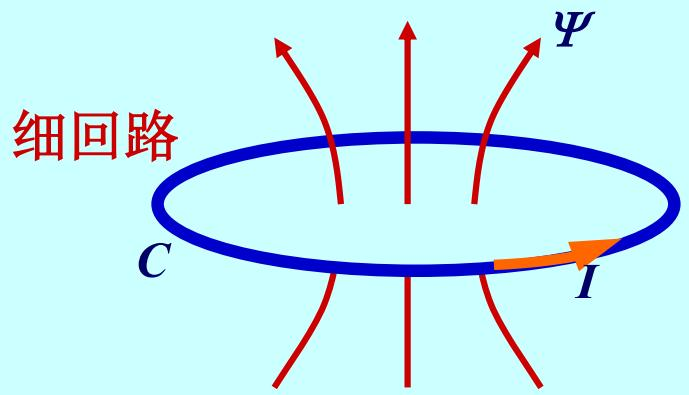

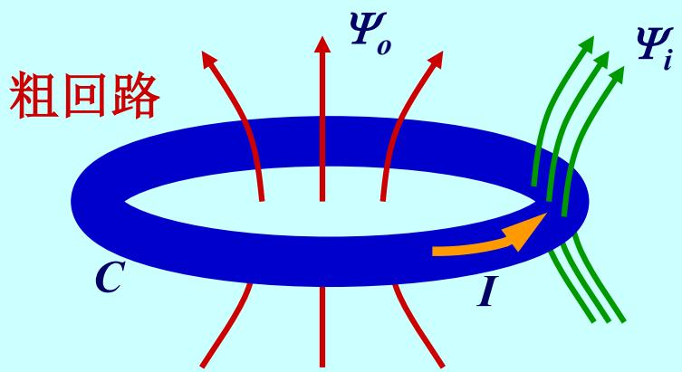

# 2.自感

设回路C中的电流为I，所产生的磁场与回路 C 交链的磁链为，则磁链 与回路 $C$ 中的电流 $I$ 有正比关系，其比值

$$
L = \frac {\Psi}{I}
$$

称为回路 C 的自感系数， 简称自感。

粗导体回路的自感： ${ \cal L } = { \cal L } _ { i } + { \cal L } _ { o }$ 

$$
L _ {i} = \frac {\Psi_ {i}}{I} — — \text {内 自 感}; L _ {o} = \frac {\Psi_ {o}}{I} — — \text {外 自 感}
$$

# 自感的特点：

自感只与回路的几何形状、尺寸以及周围磁介质有关，与电流、磁通量无关。

解：先求内导体的内自感。设同轴线中的电流为I，由安培环路定理

$$
\oint_ {C} \vec {H} _ {i} \cdot \mathrm {d} \vec {l} = I ^ {\prime} = \frac {I}{\pi a ^ {2}} \pi \rho^ {2} = \frac {I}{a ^ {2}} \rho^ {2}
$$

得 $H _ { i } = { \frac { I } { 2 \pi a ^ { 2 } } } \rho , \ B _ { i } = { \frac { \mu _ { 0 } I } { 2 \pi a ^ { 2 } } } \rho ( 0 \leq \rho \leq a )$ 2πa²p,B= 2πa² μI

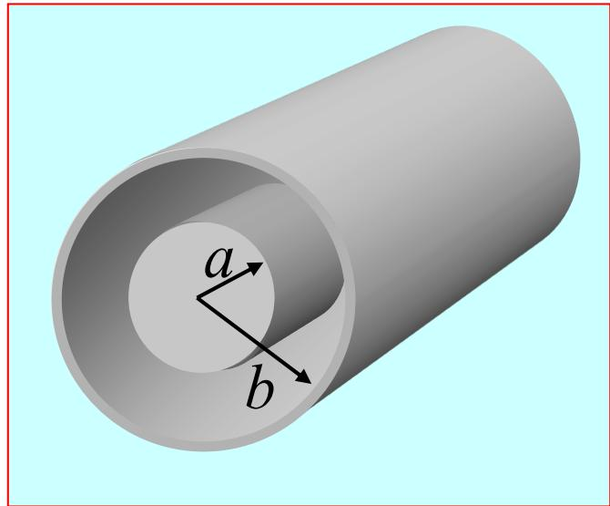

穿过沿轴线单位长度的矩形面积元 $\mathbf { d } S { \mathbf { = } } \mathbf { d } \rho$ 

的磁通为 d=Bds= $\mathrm { d } \mathbf { \varPhi } _ { i } = B _ { _ i } \cdot \mathrm { d } S = \frac { \mu _ { 0 } I } { 2 \pi a ^ { 2 } } \rho \mathrm { d } \rho$ 2πa²pdp

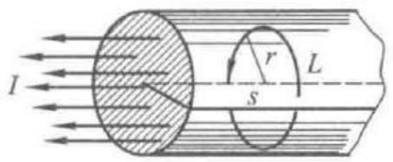

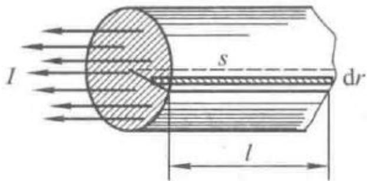

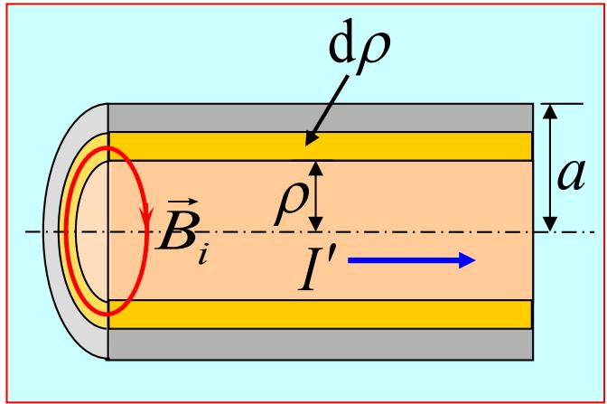

与dΦi交链的电流(环路包围的电流)为

$$
I ^ {\prime} = \frac {I}{\pi a ^ {2}} \pi \rho^ {2}
$$

设对应的等效匝数为N，则

$$
N = \frac {I ^ {\prime}}{I} = \frac {\rho^ {2}}{a ^ {2}}
$$

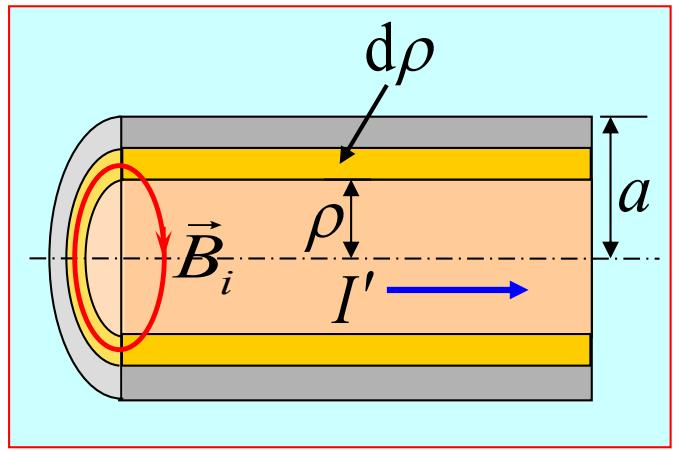

则与dΦi相应的磁链为

$$
\mathrm {d} \Psi_ {i} = N \mathrm {d} \Phi_ {i} = \frac {\mu_ {0} I \rho^ {3}}{2 \pi a ^ {4}} \mathrm {d} \rho
$$

$a \neq 0$ 

因此内导体中总的内磁链为

$$
\Psi_ {i} = \int \mathrm {d} \Psi_ {i} = \int_ {0} ^ {a} \frac {\mu_ {0} I \rho^ {3}}{2 \pi a ^ {4}} \mathrm {d} \rho = \frac {\mu_ {0} I}{8 \pi}
$$

故单位长度的内自感为 L=i=H0 $L _ { i } = \frac { \psi _ { i } } { I } = \frac { \mu _ { 0 } } { 8 \pi }$ 

再求内、外导体间的外自感。

$$
B = \frac {\mu_ {0} I}{2 \pi \rho} \quad \Longrightarrow \mathrm {d} \Psi_ {o} = \mathrm {d} \Phi_ {o} = \frac {\mu_ {0} I}{2 \pi \rho} d \rho
$$

则 $\boldsymbol { \varPsi } _ { o } = \int \mathrm { d } \boldsymbol { \varPsi } _ { o } = \int _ { a } ^ { b } \frac { \mu _ { 0 } I } { 2 \pi \rho } \mathrm { d } \rho = \frac { \mu _ { 0 } I } { 2 \pi } \ln \frac { b } { a }$ 

故单位长度的外自感为 $L _ { o } = \frac { \psi _ { o } } { I } = \frac { \mu _ { \scriptscriptstyle 0 } } { 2 \pi } \ln \frac { b } { a }$ 0 ln  b

单位长度的总自感为 ${ \cal L } = { \cal L } _ { i } + { \cal L } _ { o } = { \frac { \mu _ { 0 } } { 8 \pi } } + { \frac { \mu _ { 0 } } { 2 \pi } } \ln { \frac { b } { a } }$ 

# 例题9-10

$$
\text {单 位 长 度 的 内 自 感} \quad L _ {i} = \frac {\psi_ {i}}{I} = \frac {\mu_ {0}}{8 \pi}
$$

$R _ { 1 }$ $R _ { 2 }$ $I ,$ 

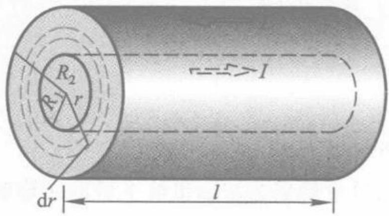

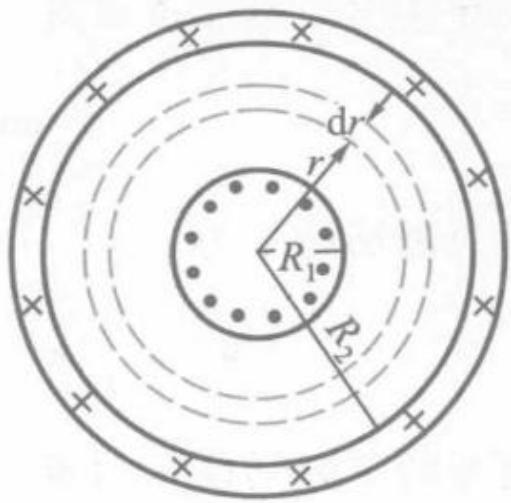

(b）同轴电缆的横截面

$L = { \frac { \phi } { I } }$ 

例 计算平行双线传输线单位的长度的自感。设导线的半径为a， 两导线的间距为D，且 $\pmb { D } > > \pmb { a }$ 。导线及周围媒质的磁导率为 $\mu _ { 0 }$ 。

解 设两导线流过的电流为I 。由于 $\pmb { D } > > \pmb { a }$ ，故可近似地认为导线中的电流是均匀分布的。应用安培环路定理和叠加原理， 可得到两导线之间的平面上任一点P 的磁感应强度为

$$
\vec {B} (x) = \vec {e} _ {y} \frac {\mu_ {0} I}{2 \pi} (\frac {1}{x} + \frac {1}{D - x})
$$

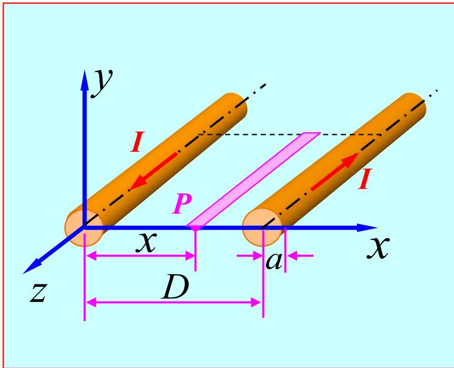

穿过两导线之间沿轴线方向为单位长度的面积的外磁链为

$$
\Psi_ {o} = \int \vec {B} \cdot \mathrm {d} \vec {S} = \frac {\mu_ {0} I}{2 \pi} \int_ {a} ^ {D - a} (\frac {1}{x} + \frac {1}{D - x}) \mathrm {d} x = \frac {\mu_ {0} I}{\pi} \ln \frac {D - a}{a}
$$

# 于是得到平行双线传输线单位的长度的外自感

$$
L _ {o} = \frac {\Psi_ {o}}{I} = \frac {\mu_ {0}}{\pi} \ln \frac {D - a}{a} \approx \frac {\mu_ {0}}{\pi} \ln \frac {D}{a}
$$

# 两根导线单位的长度的内自感为

$$
L _ {i} = 2 \times \frac {\mu_ {0}}{8 \pi} = \frac {\mu_ {0}}{4 \pi}
$$

# 故得到平行双线传输线单位的长度的自感为

$$
L = L _ {i} + L _ {o} = \frac {\mu_ {0}}{4 \pi} + \frac {\mu_ {0}}{\pi} \ln \frac {D}{a}
$$

# 3. 互感

对两个彼此邻近的闭合回路$C _ { 1 }$ 和回路 $C _ { 2 }$ ，当回路 $C _ { 1 }$ 中通过电流 $I _ { 1 }$ 时，不仅回路 $C _ { 1 }$ 交链的磁链与 $I _ { 1 }$ 成正比， 而且回路 $C _ { 2 }$ 交链的磁链 $\varPsi _ { 1 2 }$ 也与 $I _ { 1 }$ 成正比，其比例系数

$$
M _ {1 2} = \frac {\Psi_ {1 2}}{I _ {1}}
$$

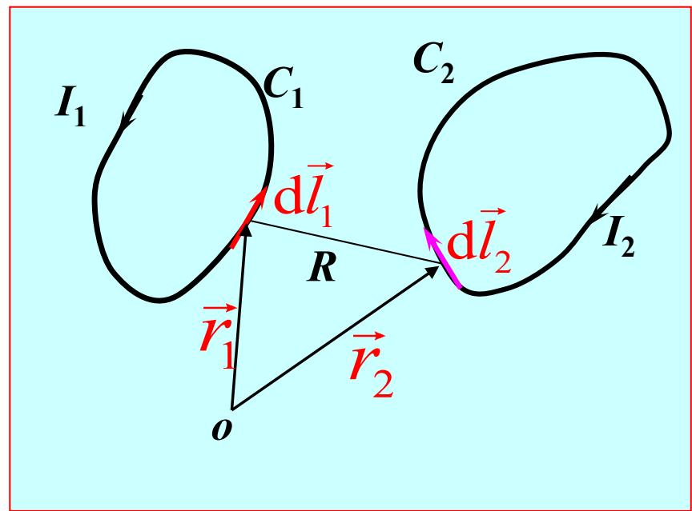

称为回路 $C _ { 1 }$ 对回路 $C _ { 2 }$ 的互感系数，简称互感。

同理，回路 $C _ { 2 }$ 对回路 $C _ { 1 }$ 的互感为 $M _ { 2 1 } = \frac { \Psi _ { 2 1 } } { I _ { 2 } }$ 21M =

互感的特点：

互感只与回路的几何形状、尺寸、两回路的相对位置以及周围磁介质有关，而与电流无关。

满足互易关系， 即 $M _ { 1 2 } \mathrm { = } M _ { 2 1 }$ 

当与回路交链的互感磁通与自感磁通方向相同时，互感系数M为正值；反之，则互感系数M为负值。

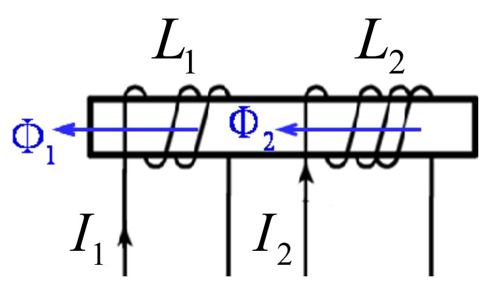

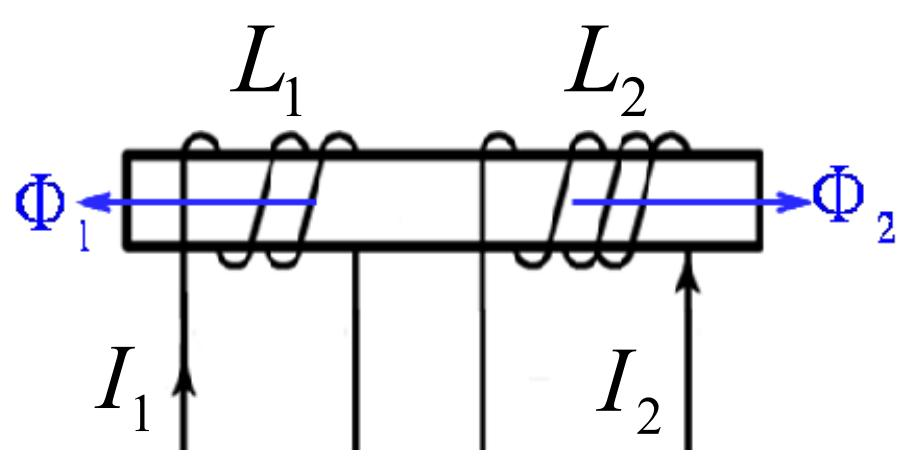

（a）两电流的磁通互相加强

（b）两电流的磁通互相削弱

# 4. 纽曼公式

如图所示的两个回路 $C _ { 1 }$ 和回路 $C _ { 2 }$ ，回路 $C _ { 1 }$ 中的电流 $I _ { 1 }$ 在回路 $C _ { 2 }$ 上的任一点产生的矢量磁位

$$
\vec {A} _ {1} (\vec {r} _ {2}) = \frac {\mu_ {0} I _ {1}}{4 \pi} \oint_ {C _ {1}} \frac {\mathrm {d} \vec {l} _ {1}}{R}
$$

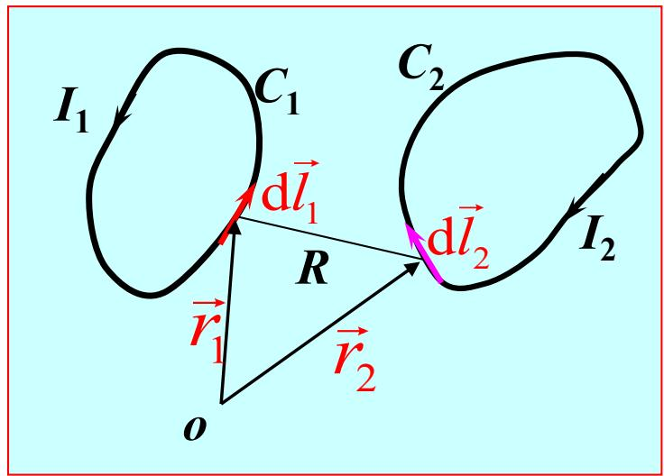

回路 $C _ { 1 }$ 中的电流 $I _ { 1 }$ 产生的磁场与回路 $C _ { 2 }$ 交链的磁链为

$$
\Psi_ {1 2} = \int_ {S _ {2}} \vec {B} _ {1} \cdot \mathrm {d} \vec {S} _ {2} = \oint_ {C _ {2}} \vec {A} _ {1} \cdot \mathrm {d} \vec {l} _ {2} = \frac {\mu_ {0} I _ {1}}{4 \pi} \oint_ {C _ {2}} \oint_ {C _ {1}} \frac {\mathrm {d} \vec {l} _ {2} \cdot \mathrm {d} \vec {l} _ {1}}{R}
$$

故得 $M _ { _ { 1 2 } } = \frac { \mu _ { _ { 0 } } } { 4 \pi } \oint _ { C _ { 2 } } \oint _ { C _ { 1 } } \frac { \mathrm { d } \vec { l _ { 1 } } \cdot \mathrm { d } \vec { l _ { 2 } } } { R }$ 

同理 M= 有磁介质时μ 也写为μ =M=·d 4πGcR4πccR

纽曼公式

例 如图所示，长直导线与三角形导体回路共面，求它们之间的互感。

解 设长直导线中的电流为I，根据安培环路定律，得到

$$
\vec {B} = \vec {e} _ {\phi} \frac {\mu_ {0} I}{2 \pi \rho}
$$

穿过三角形回路面积的磁通为

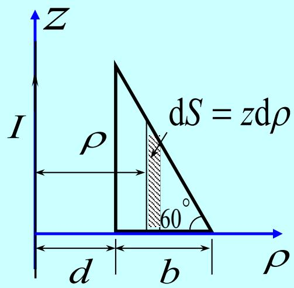

长直导线与三角形回路

$$
\Psi = \int_ {S} \vec {B} \cdot \mathrm {d} \vec {S} = \int_ {d} ^ {d + b} \left(\frac {\mu_ {0} I}{2 \pi} \frac {1}{\rho}\right) \cdot z \mathrm {d} \rho
$$

由图中可知 $z = [ ( b + d ) - \rho ] \tan ( \pi / 3 ) = \sqrt { 3 } [ ( b + d ) - \rho ]$ 

因此

$$
\begin{array}{l} \Psi = \frac {\sqrt {3} \mu_ {0} I}{2 \pi} \int_ {d} ^ {d + b} \frac {1}{\rho} [ (b + d) - \rho ] \mathrm {d} \rho \\ = \frac {\sqrt {3} \mu_ {0} I}{2 \pi} [ (b + d) \ln (1 + \frac {b}{d}) - b ] \\ \end{array}
$$

故长直导线与三角形导体回路的互感为

$$
M = \frac {\Psi}{I} = \frac {\sqrt {3} \mu_ {0}}{2 \pi} [ (b + d) \ln (1 + \frac {b}{d}) - b ]
$$

例 如图所示，两个互相平行且共轴的圆形线圈 $C _ { 1 }$ 和 $C _ { 2 }$ ，半径分别为 ${ \pmb a } _ { 1 }$ 和 ${ \pmb a } _ { 2 }$ ，中心相距为d。求它们之间的互感。

# 解 利用纽曼公式来计算， 则有

$$
M = \frac {\mu_ {0}}{4 \pi} \oint_ {C _ {1}} \oint_ {C _ {2}} \frac {\mathrm {d} \vec {l} _ {2} \cdot \mathrm {d} \vec {l} _ {1}}{\left| \vec {r} _ {2} - \vec {r} _ {1} \right|} = \frac {\mu_ {0}}{4 \pi} \oint_ {C _ {1}} \oint_ {C _ {2}} \frac {\mathrm {d} l _ {2} \mathrm {d} l _ {1} \cos \theta}{\left| \vec {r} _ {2} - \vec {r} _ {1} \right|}
$$

式中 $\theta { = } \phi _ { 2 } - \phi _ { 1 }$ 为 $\mathrm { d } \vec { l } _ { 1 } \equiv \mathrm { d } \vec { l _ { 2 } }$ 之间的夹角，$\mathbf { d } l _ { 1 } { = } a _ { 1 } \mathbf { d } \phi _ { 1 }$ 、 $\mathrm { d } { \cal I } _ { 2 } { = } a _ { 2 } \mathrm { d } \phi _ { 2 }$ ，且

$$
\left| \vec {r} _ {2} - \vec {r} _ {1} \right| = [ d ^ {2} + a _ {1} ^ {2} + a _ {2} ^ {2} - 2 a _ {1} a _ {2} \cos (\phi_ {2} - \phi_ {1}) ] ^ {1 / 2}
$$

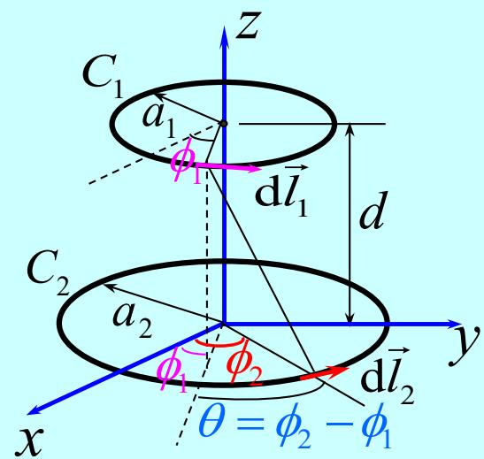

两个平行且共轴的线圈

于是有 M = μ0 [²π p2π $M = \frac { \mu _ { 0 } } { 4 \pi } \int _ { 0 } ^ { 2 \pi } \int _ { 0 } ^ { 2 \pi } \frac { a _ { 1 } a _ { 2 } \cos ( \phi _ { 2 } - \phi _ { 1 } ) \mathrm { d } \phi _ { 2 } \mathrm { d } \phi _ { 1 } } { [ d ^ { 2 } + a _ { 1 } ^ { 2 } + a _ { 2 } ^ { 2 } - 2 a _ { 1 } a _ { 2 } \cos ( \phi _ { 2 } - \phi _ { 1 } ) ] ^ { 1 / 2 } }$ 

$$
= \frac {\mu_ {0} a _ {1} a _ {2}}{2} \int_ {0} ^ {2 \pi} \frac {\cos \theta \mathrm {d} \theta}{[ d ^ {2} + a _ {1} ^ {2} + a _ {2} ^ {2} - 2 a _ {1} a _ {2} \cos \theta ] ^ {1 / 2}}
$$

一般情况下，上述积分只能用椭圆积分来表示。但是若 $d > > a _ { 1 }$ 或 $\mathbf { \nabla } d > > a _ { 2 }$ 时，可进行近似计算。

若 $\pmb { d } > > \pmb { a } _ { 1 }$ ，则

$$
\begin{array}{l} [ d ^ {2} + a _ {1} ^ {2} + a _ {2} ^ {2} - 2 a _ {1} a _ {2} \cos \theta ] ^ {- 1 / 2} \approx [ d ^ {2} + a _ {2} ^ {2} ] ^ {- 1 / 2} [ 1 - \frac {2 a _ {1} a _ {2} \cos \theta}{d ^ {2} + a _ {2} ^ {2}} ] ^ {- 1 / 2} \\ \approx [ d ^ {2} + a _ {2} ^ {2} ] ^ {- 1 / 2} [ 1 + \frac {a _ {1} a _ {2} \cos \theta}{d ^ {2} + a _ {2} ^ {2}} ] \\ \end{array}
$$

于是

$$
M \approx \frac {\mu_ {0} a _ {1} a _ {2}}{2 \sqrt {d ^ {2} + a _ {2} ^ {2}}} \int_ {0} ^ {2 \pi} [ 1 + \frac {a _ {1} a _ {2} \cos \theta}{d ^ {2} + a _ {2} ^ {2}} ] \cos \theta \mathrm {d} \theta = \frac {\mu_ {0} \pi a _ {1} ^ {2} a _ {2} ^ {2}}{2 [ d ^ {2} + a _ {2} ^ {2} ] ^ {3 / 2}}
$$

本题还可以在 $d \gg a _ { 1 }$ 的条件下,利用例3.3.1的结果来求得互感 $M$ 。半径为 $\pmb { a } _ { 1 }$ 的小圆线圈中有电流 $I _ { 1 }$ 时,它在远区的矢量磁位为

$$
A _ {1} = e _ {\phi} \frac {\mu_ {0}}{4 \pi} \left(\frac {\pi a _ {1} ^ {2} I _ {1}}{R ^ {2}}\right) \sin \theta
$$

在半径为 $\alpha _ { 2 }$ 的线圈上， $\mathbf { A } _ { \textrm { l } }$ 的值为常数,故

$$
\psi_ {1 2} = \oint_ {C _ {2}} \boldsymbol {A} _ {1} \cdot d l _ {2} = A _ {1} 2 \pi a _ {2} = \left(\frac {\mu_ {0} \pi a _ {1} ^ {2} I _ {1}}{4 \pi R ^ {2}} \sin \theta\right) 2 \pi a _ {2}
$$

式中的 $R = { \sqrt { d ^ { 2 } + \alpha _ { 2 } ^ { 2 } } } , \sin \theta = { \frac { \alpha _ { 2 } } { \sqrt { d ^ { 2 } + \alpha ^ { 2 } } } }$ $R = \sqrt { d ^ { 2 } + \alpha _ { 2 } ^ { 2 } }$ $\theta = \frac { \alpha _ { 2 } } { \sqrt { d ^ { 2 } + a ^ { 2 } } }$ a2 ,故

$$
M = \frac {\psi_ {1 2}}{I _ {1}} = \frac {\mu_ {0} \pi a _ {1} ^ {2} a _ {2} ^ {2}}{2 \left[ d ^ {2} + a _ {2} ^ {2} \right] ^ {3 / 2}}
$$

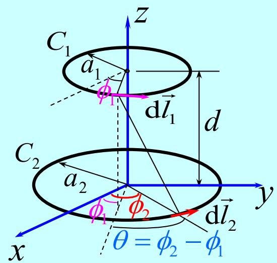

两个平行且共轴的线圈

# 例题9-9

$I _ { 1 } = I _ { 0 } \cos \omega t ,$ 

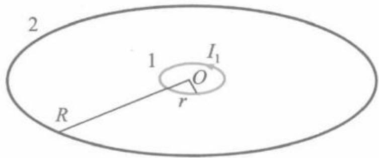

$\phi _ { 1 2 } ,$ $( 9 - 1 7 )$ $M .$ $I _ { 2 }$ 

$$
B = \frac {\mu_ {0} I _ {2}}{2 R}
$$

$B$ 

$$
\Phi_ {1 2} = B S = \frac {\mu_ {0} I _ {2}}{2 R} \pi r ^ {2}
$$

$I _ { \ u _ { 1 } }$ 

# 3.3.4 恒定磁场的能量

# 1.磁场能量

电流回路在恒定磁场中受到磁场力的作用而运动，表明恒定磁场具有能量。

磁场能量是在建立电流的过程中，由电源供给的。当电流从零开始增加时，回路中的感应电动势要阻止电流的增加，因而必须有外加电压克服回路中的感应电动势。

假定建立并维持恒定电流时，没有热损耗。

假定在恒定电流建立过程中，电流的变化足够缓慢，没有辐射损耗。

在恒定磁场建立过程中，电源克服感应电动势作功所供给的能量，就全部转化成磁场能量。

设回路从零开始充电，最终的电流为 $I$ 、交链的磁链为 $\varPsi _ { \circ }$ 在时刻t 的电流为 $\mathbf { \nabla } _ { i } = \alpha I .$ 、磁链为 $\psi { = } \alpha \psi$ 。 $( 0 { \leq } 0 { \leq } 1 )$ 

当α增加为 $( a + \mathbf { d } a )$ 时，回路中的感应电动势: $\varepsilon _ { i } = - { \frac { \mathrm { d } { \boldsymbol { \psi } } } { \mathrm { d } t } }$ 

外加电压应为 ${ \boldsymbol { u } } = - { \boldsymbol { \varepsilon } } _ { i } = { \cfrac { \mathrm { d } { \boldsymbol { \psi } } } { \mathrm { d } t } }$ 

所做的功 $\mathrm { d } W = u \mathrm { d } q = { \frac { \mathrm { d } \psi } { \mathrm { d } t } } i \mathrm { d } t = i \mathrm { d } \psi = \alpha I \psi \mathrm { d } \alpha$ 

对α从0 到 1 积分，即得到外电源所做的总功为

$$
W = \int \mathrm {d} W = \int_ {0} ^ {1} \alpha I \Psi \mathrm {d} \alpha = \frac {1}{2} I \Psi
$$

根据能量守恒定律，此功也就是电流为 $I$ 的载流回路具有的磁场能量 $W _ { m }$ ，即 $W _ { _ m } = { \frac { 1 } { 2 } } I { \mathcal { V } } = { \frac { 1 } { 2 } } I { \oint _ { C } { \vec { A } \cdot \mathrm { d } \vec { l } } } = { \frac { 1 } { 2 } } L I ^ { 2 }$ 

$$
W _ {m} = \frac {1}{2} I \Psi = \frac {1}{2} I \oint_ {C} \vec {A} \cdot \mathrm {d} \vec {l}
$$

$$
W _ {m} = \frac {1}{2} \sum_ {j = 1} ^ {N} I _ {j} \Psi_ {j} = \frac {1}{2} \sum_ {j = 1} ^ {N} I _ {j} \oint_ {C _ {j}} \left(\sum_ {i = 1} ^ {N} \vec {A} _ {i}\right) \cdot \mathrm {d} \vec {l} _ {j}
$$

例如，两个电流回路 $C _ { 1 }$ 和回路 $C _ { 2 }$ 

$$
\begin{array}{l} W _ {m} = \frac {1}{2} I _ {1} \oint_ {C _ {1}} (\vec {A} _ {1} + \vec {A} _ {2}) \cdot \mathrm {d} \vec {l} _ {1} + \frac {1}{2} I _ {2} \oint_ {C _ {2}} (\vec {A} _ {1} + \vec {A} _ {2}) \cdot \mathrm {d} \vec {l} _ {2} \\ = \frac {1}{2} I _ {1} \Psi_ {1 1} + \frac {1}{2} I _ {1} \Psi_ {2 1} + \frac {1}{2} I _ {2} \Psi_ {1 2} + \frac {1}{2} I _ {2} \Psi_ {2 2} \\ = \frac {1}{2} L _ {1} I _ {1} ^ {2} + \frac {1}{2} L _ {2} I _ {2} ^ {2} + M I _ {1} I _ {2} \quad C _ {1} \text {和} C _ {2} \text {的 互 能} \\ \end{array}
$$

回路C1的自有能

回路 $C _ { 2 }$ 的自有能

对于体分布电流，则有

$$
W _ {m} = \frac {1}{2} \int_ {V} \vec {J} \cdot \vec {A} \mathrm {d} V
$$

$$
W _ {m} = \frac {1}{2} \int_ {V} \vec {J} \cdot \vec {A} \mathrm {d} V
$$

# 2 磁场能量密度

从场的观点来看，磁场能量分布于磁场所在的整个空间。

磁场能量密度： $w _ { m } = \frac { 1 } { 2 } \vec { B } \cdot \vec { H }$ 

磁场的总能量： Wm =2JB.HAv

对于线性、各向同性介质，则有

积分区域为磁场所在的整个空间

$$
w _ {m} = \frac {1}{2} \vec {B} \cdot \vec {H} = \frac {1}{2} \mu \vec {H} \cdot \vec {H} = \frac {1}{2} \mu H ^ {2}
$$

$$
W _ {m} = \frac {1}{2} \int_ {V} \vec {B} \cdot \vec {H} \mathrm {d} V = \frac {1}{2} \int_ {V} \mu \vec {H} \cdot \vec {H} \mathrm {d} V = \frac {1}{2} \int_ {V} \mu H ^ {2} \mathrm {d} V
$$

$$
\begin{array}{r l} & {\text {推 证}: \quad \vec {J} = \nabla \times \vec {H}} \\ & {W _ {e} = \frac {1}{2} \int_ {V} \vec {J} \cdot \vec {A} \mathrm {d} V = \frac {1}{2} \int_ {V} \nabla \times \vec {H} \cdot \vec {A} \mathrm {d} V, \quad \int_ {V} \nabla \cdot (\vec {A} \times \vec {H}) \mathrm {d} V = \oint_ {S} (\vec {A} \times \vec {H}) \cdot \mathrm {d} \vec {S}} \\ & {\quad = \frac {1}{2} \int_ {V} [ \nabla \times \vec {A} \cdot \vec {H} - \nabla \cdot (\vec {A} \times \vec {H}) ] \mathrm {d} V,} \\ & {\quad = \frac {1}{2} \int_ {V} \vec {B} \cdot \vec {H} \mathrm {d} V - \frac {1}{2} \oint_ {S} (\vec {A} \times \vec {H}) \cdot \mathrm {d} \vec {S}} \end{array}
$$

电流分布在有限区域内， 当闭合面S无限扩大时，则有

$$
A \sim \mathrm {O} (\frac {1}{R}) 、 H \sim \mathrm {O} (\frac {1}{R ^ {2}})
$$

$\oint _ { S } \Bigl ( \vec { A } \times \vec { H } \Bigr ) \cdot \mathrm { d } \vec { S } \sim \mathrm { O } ( \oint _ { S } \frac { 1 } { R } \cdot \frac { 1 } { R ^ { 2 } } \mathrm { d } S ) \sim \mathrm { O } ( \frac { 1 } { R } ) \to 0$ 

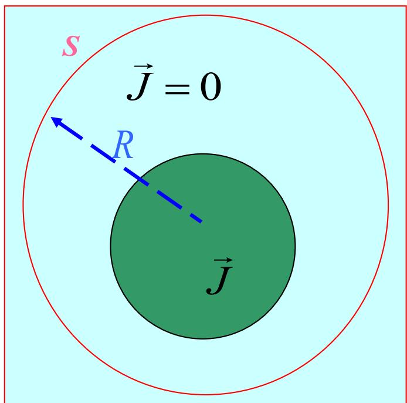

$$
W _ {m} = \frac {1}{2} I \Psi = \frac {1}{2} I \oint_ {C} \vec {A} \cdot \mathrm {d} \vec {l} = \frac {1}{2} L I ^ {2} \quad W _ {m} = \frac {1}{2} \int_ {V} \vec {B} \cdot \vec {H} \mathrm {d} V
$$

例 同轴电缆的内导体半径为a， 外导体的内、外半径分别为b和c，如图所示。导体中通有电流 $I$ ，试求同轴电缆中单位长度储存的磁场能量与总自感。

解：由安培环路定律， 得

$$
\vec {H} = \left\{ \begin{array}{l l} \vec {e} _ {\phi} \frac {\rho I}{2 \pi a ^ {2}} & 0 <   \rho <   a \\ \vec {e} _ {\phi} \frac {I}{2 \pi \rho} & a <   \rho <   b \\ \vec {e} _ {\phi} \frac {I}{2 \pi \rho} \frac {c ^ {2} - \rho^ {2}}{c ^ {2} - b ^ {2}} & b <   \rho <   c \\ 0 & \rho > c \end{array} \right.
$$

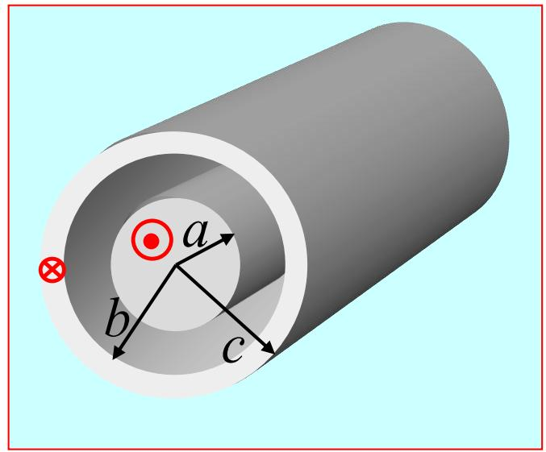

# 三个区域单位长度内的磁场能量分别为

$$
W _ {m 1} = \frac {\mu_ {0}}{2} \int_ {0} ^ {a} (\frac {\rho I}{2 \pi a ^ {2}}) 2 \pi \rho \mathrm {d} \rho = \frac {\mu_ {0} I ^ {2}}{1 6 \pi}
$$

$$
W _ {m 2} = \frac {\mu_ {0}}{2} \int_ {a} ^ {b} \left(\frac {I}{2 \pi \rho}\right) ^ {2} 2 \pi \rho \mathrm {d} \rho = \frac {\mu_ {0} I ^ {2}}{4 \pi} \ln \frac {b}{a}
$$

$$
\begin{array}{l} W _ {m 3} = \frac {\mu_ {0}}{2} \int_ {b} ^ {c} \left(\frac {I}{2 \pi \rho}\right) ^ {2} \left(\frac {c ^ {2} - \rho^ {2}}{c ^ {2} - b ^ {2}}\right) ^ {2} 2 \pi \rho d \rho \\ = \frac {\mu_ {0} I ^ {2}}{4 \pi} \left[ \frac {c ^ {4}}{(c ^ {2} - b ^ {2}) ^ {2}} \ln \frac {c}{b} - \frac {3 c ^ {2} - b ^ {2}}{4 (c ^ {2} - b ^ {2})} \right] \\ \end{array}
$$

# 单位长度内总的磁场能量为

$$
\begin{array}{l} W _ {m} = W _ {m 1} + W _ {m 2} + W _ {m 3} \\ = \frac {\mu_ {0} I ^ {2}}{1 6 \pi} + \frac {\mu_ {0} I ^ {2}}{4 \pi} \ln \frac {b}{a} + \frac {\mu_ {0} I ^ {2}}{4 \pi} \left[ \frac {c ^ {4}}{(c ^ {2} - b ^ {2}) ^ {2}} \ln \frac {c}{b} - \frac {3 c ^ {2} - b ^ {2}}{4 (c ^ {2} - b ^ {2})} \right] \\ \end{array}
$$

# 单位长度的总自感

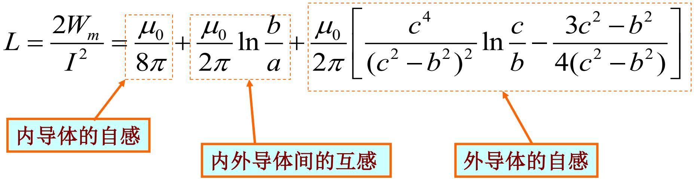

# 3.3.5 磁场力

# 虚位移原理

假定第i 个回路在磁场力的作用下产生一个虚位移dgi 。此时，磁场力做功 $\mathrm { d } A { = } F _ { i } \mathrm { d } g _ { i } $ ，系统的能量变化 $\mathrm { d } W _ { m }$ 。根据能量守恒定律，有

$$
\mathrm {d} W _ {S} = F _ {i} \mathrm {d} g _ {i} + \mathrm {d} W _ {m}
$$

式中dWS是与各电流回路相连接的外电源提供的能量。

具体计算过程中，可假定各回路电流维持不变，或假定与各回路交链的磁链（磁通）维持不变。

# 1 . 各回路电流维持不变

若假定各回路中电流不改变，则回路中的磁链必定发生改变，因此N个回路都有感应电动势。此时，外接电源必然要做功来克服感应电动势以保持各回路中电流不变。因此，电源提供的能量

$$
\mathrm {d} W _ {S} = \sum_ {i = 1} ^ {N} \frac {\mathrm {d} \Psi_ {i}}{\mathrm {d} t} \mathrm {d q} _ {i} = \sum_ {i = 1} ^ {N} I _ {i} \mathrm {d} \Psi_ {i}
$$

系统增加的磁能 $ \mathrm { d } W _ { m } = \frac { 1 } { 2 } \sum _ { i = 1 } ^ { N } \mathrm { d } ( I _ { i } \varPsi _ { i } ) = \frac { 1 } { 2 } \sum _ { i = 1 } ^ { N } I _ { i } \mathrm { d } \varPsi _ { i }$  利用（3.3.50）式

即 $\mathrm { d } W _ { s } = 2 \mathrm { d } W _ { m }$ 

于是有 $F _ { i } \mathbf { d } g _ { i } = \mathbf { d } W _ { m }$ 

故得到

$$
F _ {i} = \frac {\partial W _ {m}}{\partial g _ {i}} \Bigg | _ {I \text {不 变}}
$$

# 2. 各回路的磁链 （磁通） 不变

由于各回路的磁链不变，回路中都没有感应电动势，故与回路相连接的电源不对回路输入能量，即 $\mathrm { d } W _ { S } { = } 0$ ，因此

$$
F _ {i} \mathrm {d} g _ {i} = - \mathrm {d} W _ {m}
$$

故得到

$$
F _ {i} = - \frac {\partial W _ {m}}{\partial g _ {i}} \Bigg | _ {\Psi \mathrm {不 变}}
$$

式中的“－”号表示磁场力做功是靠减少系统的磁场能量来实现的 。需要注意的是，若假定各回路的磁链不变，则各回路中的电流必定发生改变。

例 如图所示的一个电磁铁，由铁轭（绕有 $\mathbf { \partial } \cdot \mathbf { N }$ 匝线圈的铁芯）和衔铁构成。铁轭和衔铁的横截面积均为 $\pmb { S }$ ，平均长度分别为 $l _ { 1 }$ 和 $\boldsymbol { l } _ { 2 }$ 。铁轭与衔铁之间有一很小的空气隙，其长度为x 。设线圈中的电流为I，铁轭和衔铁的磁导率为 $\mu$ 。若忽略漏磁和边缘效应，求铁轭对衔铁的吸引力。

解 在忽略漏磁和边缘效应的情况下，若保持磁通Ψ不变，

则B和H不变， 储存在铁轭和衔铁中的磁场能量也不变，而空气隙中的磁场能量则要变化。于是作用在衔铁上的磁场力为

$$
\begin{array}{l} F _ {i} = - \frac {\partial W _ {m}}{\partial x _ {i}} \Big | _ {\Psi \text {不}} = - \frac {\partial}{\partial x} \left[ \frac {1}{2} \int_ {\text {气 隙}} \vec {B} _ {0} \cdot \vec {H} _ {0} \mathrm {d} V \right] \\ = - \frac {1}{2} \frac {\partial}{\partial x} \int_ {0} ^ {x} 2 S \frac {B _ {0} ^ {2}}{\mu_ {0}} d x = - \frac {S B _ {0} ^ {2}}{\mu_ {0}} \\ \end{array}
$$

根据安培环路定律，有 $H ( l _ { 1 } + l _ { 2 } ) + 2 H _ { 0 } x = N I$ 

由于 和 $H = \frac { B } { \mu }$ 和 $H _ { 0 } = \frac { B _ { 0 } } { \mu _ { 0 } }$ ， 考虑到 $B = B _ { 0 }$ ，可得到

$$
B _ {0} = \frac {\mu_ {0} \mu N I}{(l _ {1} + l _ {2}) \mu_ {0} + 2 \mu x} \Longrightarrow F _ {x} = - \frac {S B _ {0} ^ {2}}{\mu_ {0}} = - \frac {\mu_ {0} \mu^ {2} N ^ {2} I ^ {2} S}{[ (l _ {1} + l _ {2}) \mu_ {0} + 2 \mu x ] ^ {2}}
$$

若采用式 $F _ { i } = \frac { \partial W _ { m } } { \partial x _ { i } } \vert _ { I }$ 0Wm 计算，由储存在系统中的磁场能量xi

$$
W _ {m} = \frac {1}{2} N I S B _ {0} = \frac {\mu_ {0} \mu S N ^ {2} I ^ {2}}{2 [ (l _ {1} + l _ {2}) \mu_ {0} + 2 \mu x ]}
$$

同样得到铁轭对衔铁的吸引力为

$$
F _ {x} = \frac {\partial W _ {m}}{\partial x} \Big | _ {I \text {不 变}} = - \frac {\mu_ {0} \mu^ {2} N ^ {2} I ^ {2} S}{[ (l _ {1} + l _ {2}) \mu_ {0} + 2 \mu x ] ^ {2}}
$$

$$
F _ {\chi} = \frac {\partial W _ {m}}{\partial \chi} \Big | _ {I = \text {常 数}}
$$

因两个电流回路的磁场能量为

$$
W _ {m} = \frac {1}{2} L _ {1} I _ {1} ^ {2} + \frac {1}{2} L _ {2} I _ {2} ^ {2} + M I _ {1} I _ {2}
$$

将其代人 $F _ { y }$ 中，得

$$
F _ {\chi} = \frac {\partial W _ {\mathrm {m}}}{\partial \chi} \Big | _ {I = \text {常 数}} = I _ {1} I _ {2} \frac {\partial M}{\partial \chi}
$$

上式表明，在 $I _ { 1 }$ 和 $I _ { 2 }$ 不变的情况下，磁场能量的改变（即磁力）仅是由于互感M的改变引起的。

例3.3.9两个互相平行且共轴的圆形线圈，距离为 $d$ ，半径分别为 $\alpha _ { 1 }$ 和$a _ { 2 }$ ,其中 $a _ { 1 } \ll d$ 。两线圈中分别载有电流 $I _ { 1 }$ 和 $I _ { 2 }$ ，如图3.3.10所示。求两线圈间的磁场力。

解：利用例3.3.6的结果，当 $a _ { 1 } \ll d$ 时，两线圈的互感为

$$
M = \frac {\pi \mu_ {0} a _ {1} ^ {2} a _ {2} ^ {2}}{2 \left(a _ {2} ^ {2} + d ^ {2}\right) ^ {3 / 2}}
$$

根据式（3.3.51）得两线圈间的磁场力为

$$
F _ {2 1} = I _ {1} I _ {2} \frac {\partial M}{\partial d} \Big | _ {I = \text {常 数}} = - \frac {3 \pi I _ {1} I _ {2} \mu_ {0} a _ {1} ^ {2} a _ {2} ^ {2} d}{2 (a _ {2} ^ {2} + d ^ {2}) ^ {5 / 2}}
$$

图3.3.10共轴的圆形线圈

式中的负号表示当 $I _ { 1 }$ 与 $I _ { 2 }$ 的方向相同时， $F _ { 2 1 }$ 为吸引力；当 $I _ { 1 }$ $I _ { 2 }$ 方向相反时， $F _ { 2 1 }$ 为排斥力。

# 3.4 静态场的边值问题及解的惟一性定理

静态场问题：分布型问题和边值型问题

边值问题分类：解析法（镜像法和分离变量法）数值法（有限差分法）

边值问题定义：在给定的边界条件下，求解位函数的泊松方程或拉普拉斯方程

# 3.4.1 边值问题的类型

中 第一类边值问题（或狄里赫利问题）

已知场域边界面上的位函数值，即

$$
\varphi \mid_ {S} = f _ {1} (S)
$$

第二类边值问题 （或纽曼问题）

已知场域边界面上的位函数的法向导数值，即

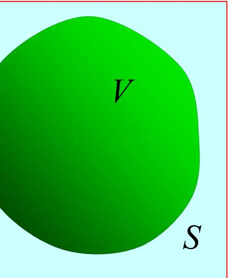

$$
\frac {\partial \varphi}{\partial n} | _ {S} = f _ {2} (S)
$$

第三类边值问题（或混合边值问题）

已知场域一部分边界面上的位函数值，而另一部分边界面上则已知位函数的法向导数值，即 $\varphi | _ { S _ { 1 } } = f _ { 1 } ( S _ { 1 } ) \setminus \frac { \partial \varphi } { \partial n } | _ { S _ { 2 } } = f _ { 2 } ( S _ { 2 } )$ 

周期边界条件

$$
\varphi \big | _ {\phi} = \varphi \big | _ {(\phi + 2 \pi)}
$$

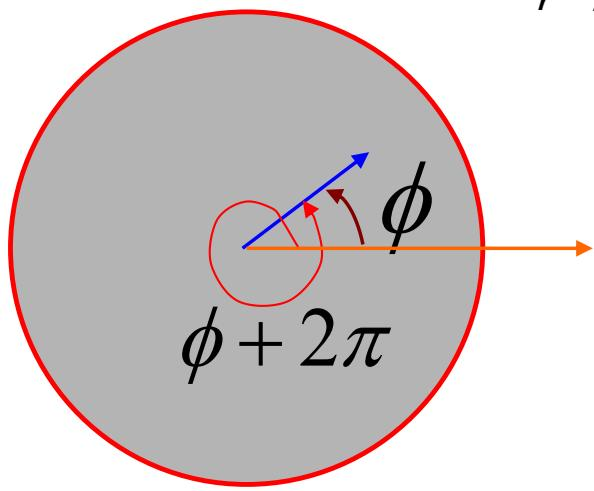

中 自然边界条件 （无界空间）

$\operatorname* { l i m } _ { r \to \infty } r \varphi =$ 有限值

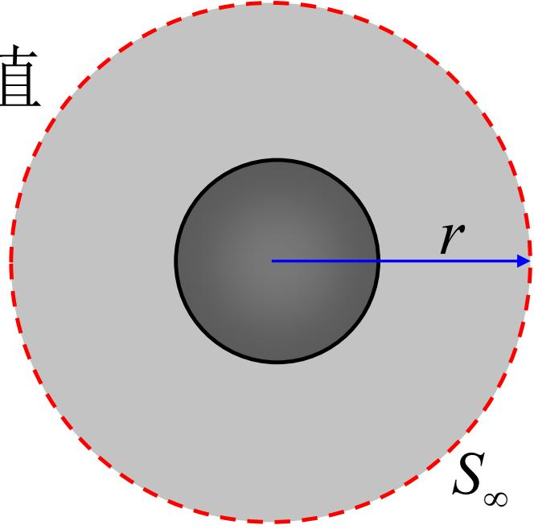

衔接条件 （连续性条件）

不同媒质分界面上的边界条件，如

$$
\varphi_ {1} = \varphi_ {2}, \varepsilon_ {1} \frac {\partial \varphi_ {1}}{\partial n} = \varepsilon_ {2} \frac {\partial \varphi_ {2}}{\partial n}
$$

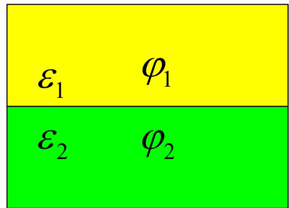

例：

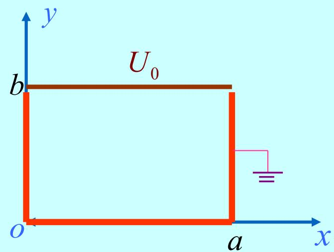

$$
\frac {\partial^ {2} \varphi}{\partial x ^ {2}} + \frac {\partial^ {2} \varphi}{\partial y ^ {2}} = 0
$$

$$
\varphi (0, y) = 0, \varphi (a, y) = 0
$$

$$
\varphi (x, 0) = 0, \varphi (x, b) = U _ {0}
$$

# （第一类边值问题）

例：

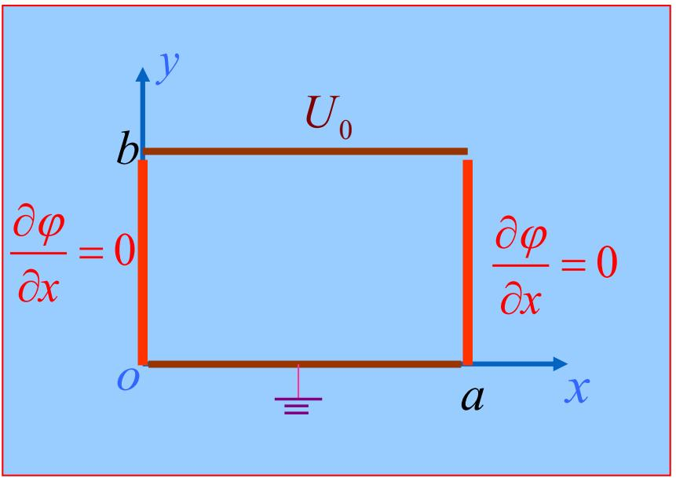

$$
\frac {\partial^ {2} \varphi}{\partial x ^ {2}} + \frac {\partial^ {2} \varphi}{\partial y ^ {2}} = 0
$$

$$
\left. \frac {\partial \varphi}{\partial x} \right| _ {x = 0} = 0, \left. \frac {\partial \varphi}{\partial x} \right| _ {x = a} = 0
$$

$$
\varphi (x, 0) = 0, \varphi (x, b) = U _ {0}
$$

# （第三类边值问题）

# 3.4.2 静电场的惟一性定理

惟一性定理的表述

在场域V 的边界面S上给定 $\varphi$ 或 n 的值，则泊松方程或拉普拉斯方程在场域V具有惟一解。

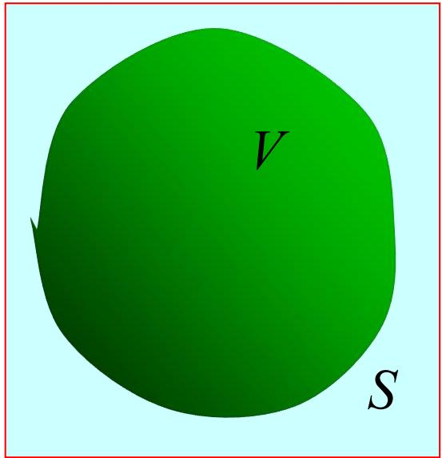

惟一性定理的重要意义

给出了静态场边值问题具有惟一解的条件

为静态场边值问题的各种求解方法提供了理论依据

为求解结果的正确性提供了判据

惟一性定理的证明 （以静电场为例）

反证法：假设解不惟一，则有两个位函数 $\varphi _ { 1 }$ 和 $\varphi _ { 2 }$ 在场域V内满足同样的方程，即

$$
\nabla^ {2} \varphi_ {1} = f, \qquad \nabla^ {2} \varphi_ {2} = f
$$

且在边界面S 上满足同样的边界条件。

令 $\varphi _ { 0 } = \varphi _ { 1 } - \varphi _ { 2 }$ 则在场域V内

$$
\nabla^ {2} \varphi_ {0} = \nabla^ {2} \varphi_ {1} - \nabla^ {2} \varphi_ {2} = f - f = 0
$$

且在边界面S 上有

$\varphi _ { 0 }  _ { s } = \varphi _ { 1 }  _ { s } - \varphi _ { 2 }  _ { s } = 0$ 或

或 $\varphi _ { 0 } | _ { S _ { 1 } } = \varphi _ { 1 } | _ { S _ { 1 } } - \varphi _ { 2 } | _ { S _ { 1 } } = 0 ,$ 2 2|s=0

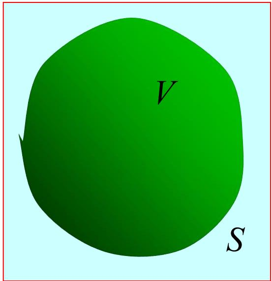

# 由格林第一恒等式

$$
\int_ {V} \left(\psi \nabla^ {2} \varphi + \nabla \psi \cdot \nabla \varphi\right) \mathrm {d} V = \oint_ {S} \psi \frac {\partial \varphi}{\partial n} \mathrm {d} S
$$

可得到 $\int _ { \cal { V } } \left( { \nabla } \varphi _ { \mathrm { { 0 } } } \right) ^ { 2 } \mathrm { d } V = \oint _ { \cal { S } } \varphi _ { \mathrm { { 0 } } } \frac { \partial \varphi _ { \mathrm { { 0 } } } } { \partial n } \mathrm { d } S = 0$ φods =0

$$
\Longrightarrow (\nabla \varphi_ {0}) ^ {2} = 0 \Longrightarrow \nabla \varphi_ {0} = 0 \Longrightarrow \varphi_ {0} = C
$$

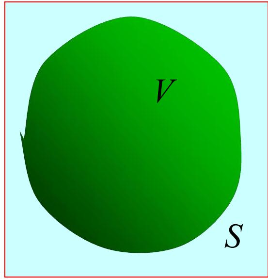

对于第一类边界条件： $\varphi _ { 0 } \big | _ { S } = 0$ C = 0  1 2

对于第二类边界条件：若 $\varphi _ { 1 }$ 和 $\varphi _ { 2 }$ 取同一点Q为参考点 ，则

$$
\varphi_ {0} \Big | _ {Q} = 0 \quad \Longrightarrow \quad C = 0 \quad \Longrightarrow \quad \varphi_ {1} = \varphi_ {2}
$$

对于第三类边界条件： $\varphi _ { 0 } \big | _ { S _ { 1 } } = 0 \longmapsto C = 0 \longmapsto \varphi _ { 1 } = \varphi _ { 2 }$ 

# 3.5 镜像法求解高维问题

# ❖ 问题的提出

当有电荷（这里称为原点荷）存在于导体表面附近时，导体表面会出现感应电荷，而感应电荷将影响场的分布。

# 几个实例

中 接地导体板附近有一个点电荷，如图所示。

非均匀感应电荷

等效电荷

非均匀感应电荷产生的电位很难求解，可以用等效电荷的电位替代

接地导体球附近有一个点电荷，如图。

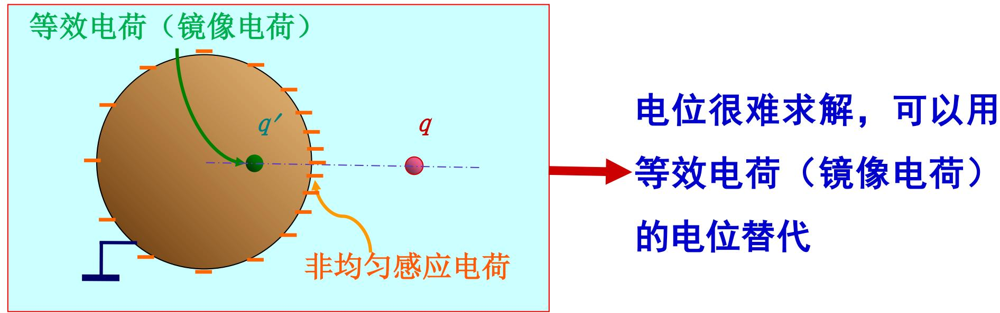

中 接地导体柱附近有一个同轴的线电荷分布，情况与上面平板或球的类似，但等效电荷为线电荷。

结论：所谓镜像法是将不均匀电荷分布的作用等效为点电荷或线电荷的作用。

问题：这种等效电荷是否存在？ 这种等效是否合理？

# 镜像法的基本思想

用位于场域边界外虚设的较简单的镜像电荷分布来等效替代该边界上未知的较为复杂的电荷分布，从而可以将原含该边界的非均匀媒质空间变换成无限大单一均匀媒质的空间，使分析计算过程得以明显简化的一种间接求解法。

# 镜像法的理论基础— 解的惟一性定理

在导体形状、几何尺寸、带电状况和媒质几何结构、特性不变的前提条件下，根据惟一性定理，只要找出的解答满足在同一泛定方程下问题所给定的边界条件，那就是该问题的解答，并且是惟一的解答。镜像法正是巧妙地应用了这一基本原理、面向多种典型结构的工程电磁场问题所构成的一种有效的解析求解法。

# 镜像法应用的关键点

中 镜像电荷的确定

镜像电荷的个数、位置及其电量大小— “三要素” ；

中 等效求解的 “有效场域” 确定

# 确定镜像电荷的两条原则

中 镜像电荷必须位于所求解的场区域以外的空间中；

中 镜像电荷的个数、位置及电荷量的大小以满足所求解的场区域的边界条件为基本准则来进行确定。

不同介质分界面问题 恒定磁场问题

# 3.5.1 接地导体平面的镜像

# 1. 点电荷对无限大接地导体平面的镜像

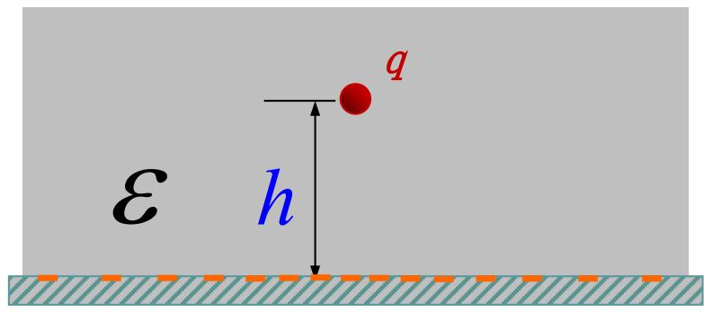

方程： $\nabla ^ { 2 } \varphi = - \frac { q } { \varepsilon } \delta \big ( x , y , z - h \big ) , z > 0$ 

边界条件

$$
\varphi \mid_ {z = 0} = 0
$$

# 3.5.1 接地导体平面的镜像

# 1. 点电荷对无限大接地导体平面的镜像

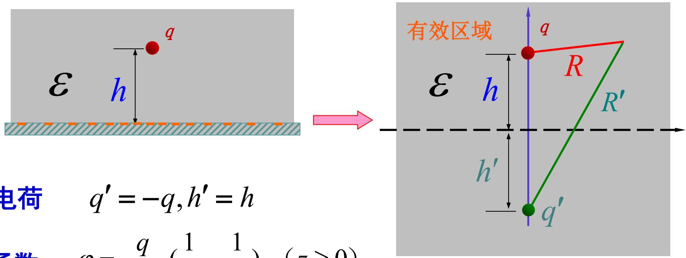

镜像电

电位函数 $\psi - \overline { { { 4 \pi \varepsilon } } } ^ { \mathrm { ( } } \overline { { { R } } } ^ { \mathrm { - } } \overline { { { R ^ { \prime } } } } ^ { \mathrm { ) } } \quad \setminus \varepsilon \mathrm { \subset U } ^ { \mathrm { } }$ 

因 $z = 0$ 时， $\begin{array} { r l } { R = R ^ { \prime } } & { { } \varphi \big | _ { z = 0 } = 0 } \end{array}$ 

满足原问题的边界条件，所得的结果是正确的。

上半空间( z≥0 ） 的电位函数

$$
\varphi (x, y, z) = \frac {q}{4 \pi \varepsilon} [ \frac {1}{\sqrt {x ^ {2} + y ^ {2} + (z - h) ^ {2}}} - \frac {1}{\sqrt {x ^ {2} + y ^ {2} + (z + h) ^ {2}}} ] \quad (z \geq 0)
$$

导体平面上的感应电荷面密度为

$$
\rho_ {S} = - \varepsilon \frac {\partial \varphi}{\partial z} \bigg | _ {z = 0} = - \frac {q h}{2 \pi (x ^ {2} + y ^ {2} + h ^ {2}) ^ {3 / 2}}
$$

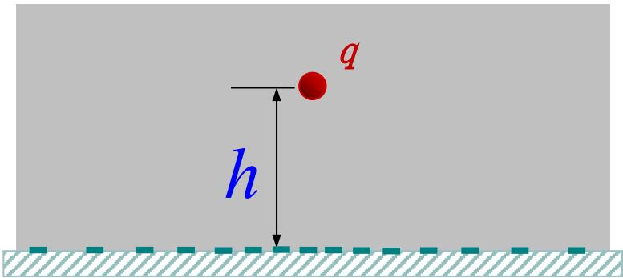

导体平面上的总感应电荷为

$$
\begin{array}{l} q _ {i n} = \int_ {S} \rho_ {S} \mathrm {d} S = - \frac {q h}{2 \pi} \int_ {- \infty} ^ {\infty} \int_ {- \infty} ^ {\infty} \frac {\mathrm {d} x \mathrm {d} y}{\left(x ^ {2} + y ^ {2} + h ^ {2}\right) ^ {3 / 2}} \\ = - \frac {q h}{2 \pi} \int_ {0} ^ {2 \pi} \int_ {0} ^ {\infty} \frac {\rho \mathrm {d} \rho \mathrm {d} \phi}{\left(\rho^ {2} + h ^ {2}\right) ^ {3 / 2}} = - q \\ \end{array}
$$

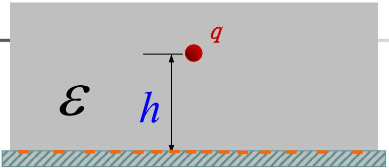

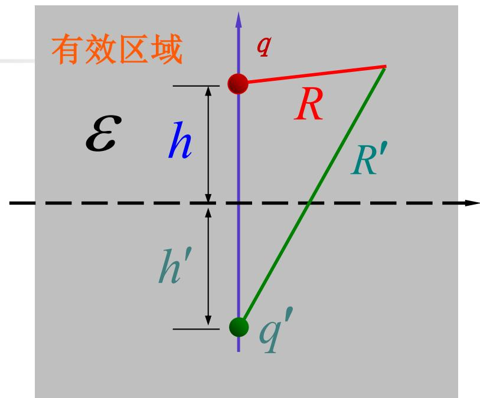

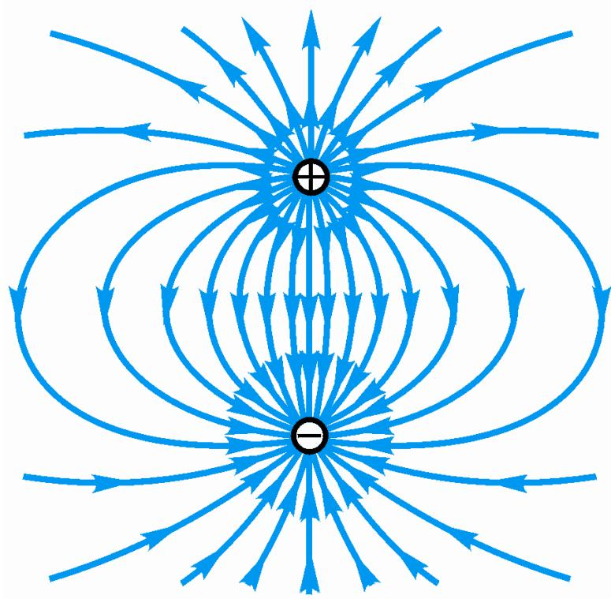

(d）两个等值异号电荷

2.线电荷对无限大接地导体平面的镜像原问题

方程 $\nabla ^ { 2 } \varphi = - \frac { \rho _ { l } } { \varepsilon } \delta \big ( x , z - h \big ) , z > 0 ;$ 

边界条件φ =0Iz=0

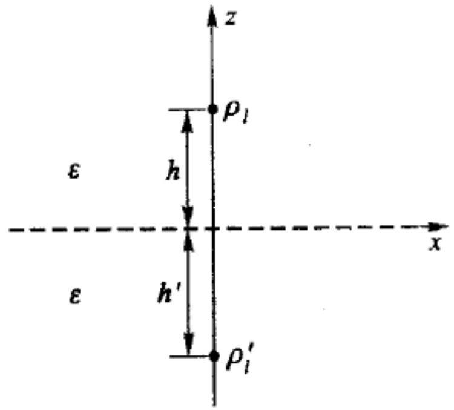

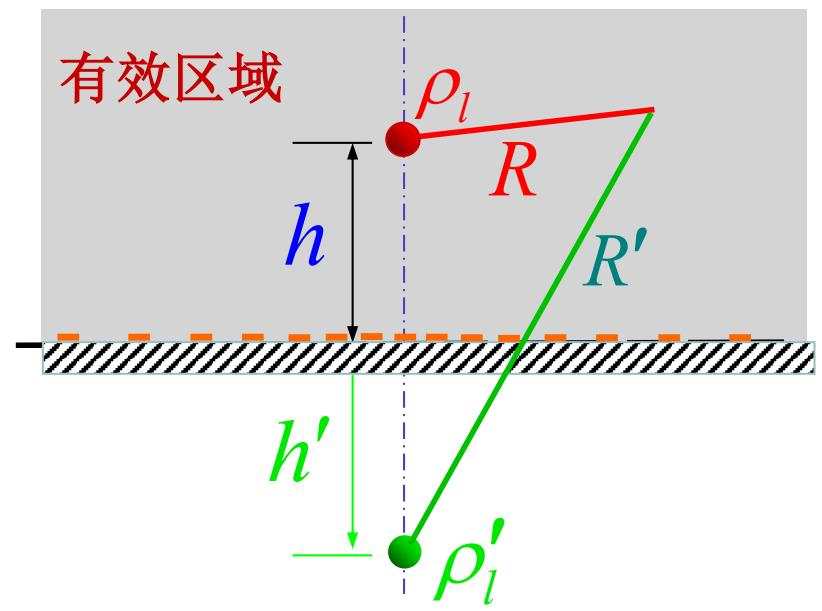

# 2. 线电荷对无限大接地导体平面的镜像

镜像线电荷： $\rho _ { l } ^ { \prime } = - \rho _ { l } , z ^ { \prime } = - h$ 

电位函数 $\varphi = \frac { \rho _ { l } } { 2 \pi \varepsilon } \ln \frac { R ^ { \prime } } { R } \quad ( z \geq 0 )$ Pln

当z=0时， $R ^ { \prime } = R \enspace \longrightarrow \enspace \varphi = 0$ 

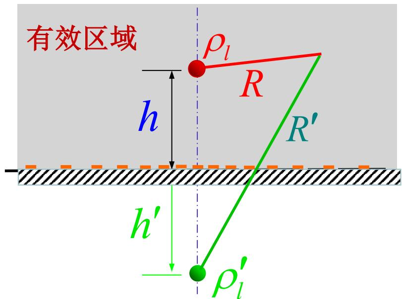

满足原问题的边界条件，所得的解是正确的。

# 3. 点电荷对相交半无限大接地导体平面的镜像

如图所示，两个相互垂直相连的半无限大接地导体平板，点电荷q 位于(d1, ${ \bf d } _ { 2 }$ )处。

方程： $\nabla ^ { 2 } \varphi = - \frac { q } { \varepsilon } \delta \big ( x - d _ { 1 } , y - d _ { 2 } , z \big ) , ( x > 0 , y > 0 )$ 

边界条件 $\varphi \big | _ { x = 0 } = 0$ 

$$
\varphi \left| _ {y = 0} \right. = 0
$$

$$
\varphi \left| _ {\sqrt {x ^ {2} + y ^ {2} + z ^ {2}} \rightarrow \infty} = 0 \right.
$$

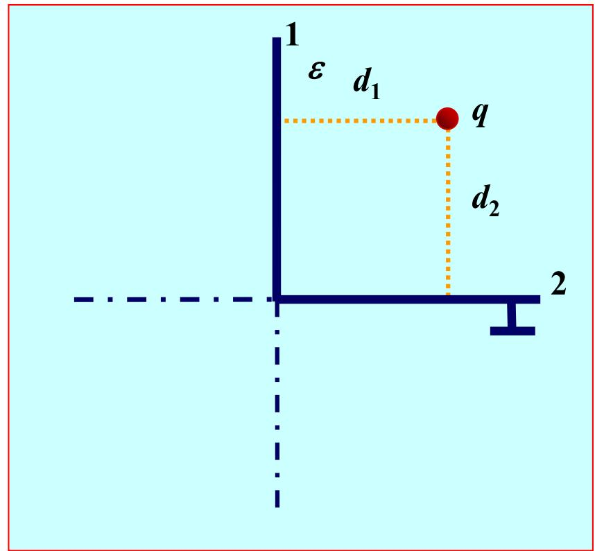

# 3. 点电荷对相交半无限大接地导体平面的镜像

对于平面1，有镜像电荷q1=－q，对于平面2，有镜像电荷 $q _ { 2 } { = } - \mathbf { q }$ d1, d2 )，位于 $( d _ { 1 } , \ : - d _ { 2 } )$ 

显然， $\pmb q _ { 1 }$ 对平面 2 以及 $\pmb { q } _ { 2 }$ 对平面 1 均不能满足边界条件。

只有在 $( - d _ { 1 } , \textrm { -- } d _ { 2 } )$ 处再设置一镜像电荷 $q _ { 3 } = q$ ，所有边界条件才能得到满足。

$\varphi = \frac { q } { 4 \pi \varepsilon } ( \frac { 1 } { R } - \frac { 1 } { R _ { 1 } } - \frac { 1 } { R _ { 2 } } + \frac { 1 } { R _ { 3 } } )$ 1电位函数

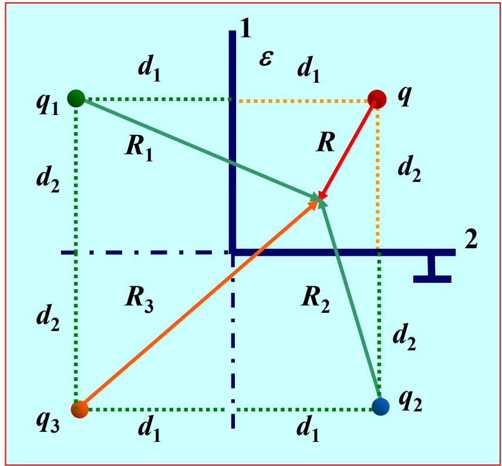

如果两导体平面不是相互垂直，而是相

交成 $a$ 角，只要 $\dot { \alpha } = \frac { \pi } { n }$ ，这里的n为整数，就

能用镜像法求解，其镜像电荷数为有限的 $( 2 n - 1 )$ 个。

（第六版）3.5节习题1： 一个点电荷q与无限大的接地导体平面距离为d，如果把它移至无穷远处，需要做多少功？

解：移动电荷q时，外力需要克服电场力做功，而电荷q受的电场力来源于导体板上的感应电荷。可以求电荷q 移至无穷远

时电场力所做的功。

由镜像法， 感应电荷的电场可以用像电荷 $q ^ { \prime } { = } { - } q$ 替代。当电荷q 移至x时，像电荷 $\pmb q$ '应位于－x，则有

$$
\vec {E} ^ {\prime} (x) = \vec {\pmb {e}} _ {x} \frac {- q}{4 \pi \varepsilon_ {0} (2 x) ^ {2}}
$$

$$
\begin{array}{l} \rightarrow W _ {e} = \int_ {d} ^ {\infty} q \vec {E} ^ {\prime} (x) \cdot \mathrm {d} \vec {x} = \frac {- q ^ {2}}{4 \pi \varepsilon_ {0}} \int_ {d} ^ {\infty} \frac {1}{(2 x) ^ {2}} \mathrm {d} x = - \frac {q ^ {2}}{1 6 \pi \varepsilon_ {0} d} \\ \longrightarrow W _ {o} = - W _ {e} = \frac {q ^ {2}}{1 6 \pi \varepsilon_ {0} d} \\ \end{array}
$$

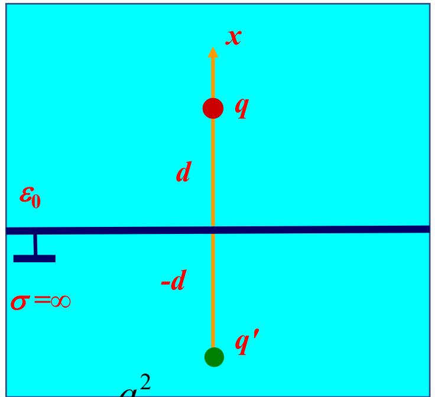

# 3.5.2 导体球面的镜像

点电荷对接地导体球面的镜像如图所示，点电荷q 位于半径为a 的接地导体球外，距球心为d 求电势

方程 $\nabla ^ { 2 } \varphi = - \frac { q } { \varepsilon } \delta \left( r - d , \theta , \phi \right)$ 

边界条件φ丨a $\varphi \bigm | _ { r = a } = 0$ 

$$
\varphi \left. \right.\left. \right\rVert_ {r \rightarrow \infty} = 0
$$

球面上的感应电荷可用镜像电荷q'来等效。q'应位于导体球内（显然不影响原方程），且在点电荷q与球心的连线上，距球心为d'。则有

$$
\varphi = \frac {1}{4 \pi \varepsilon} \left(\frac {q}{R} + \frac {q ^ {\prime}}{R ^ {\prime}}\right)
$$

问题： $d ^ { \prime } = ? q ^ { \prime } = ?$ 

方法：利用导体球面上电位为零确定 $d ^ { \prime }$ 和 ${ \pmb q } ^ { \prime }$ 。

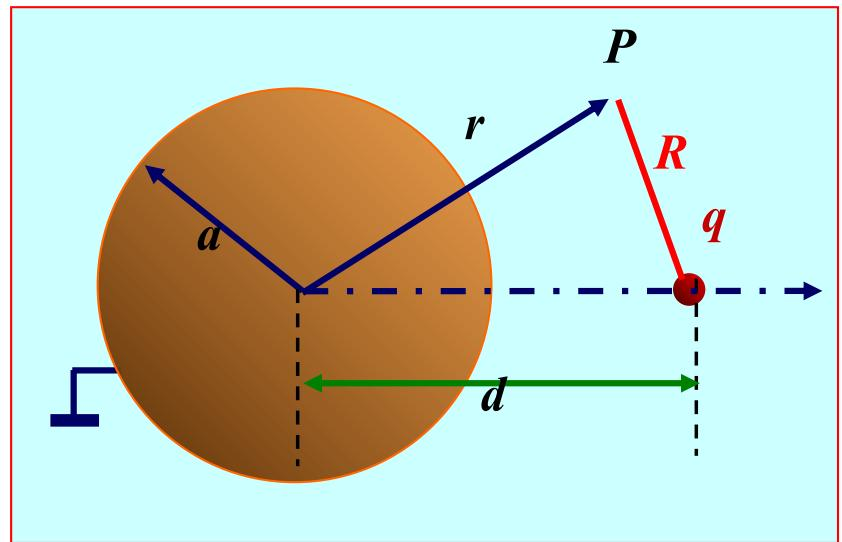

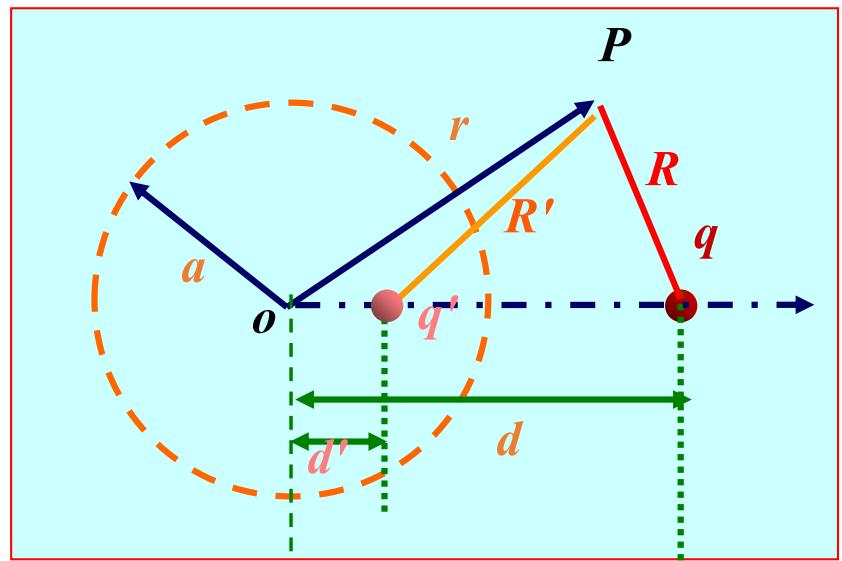

$$
\varphi = \frac {1}{4 \pi \varepsilon} \left[ \frac {q}{\sqrt {r ^ {2} + d ^ {2} - 2 r d \cos \theta}} + \frac {q ^ {\prime}}{\sqrt {r ^ {2} + d ^ {\prime 2} - 2 r d ^ {\prime} \cos \theta}} \right]
$$

由于导体球接地,在球面 $r = a$ 处， $\varphi = 0$ 。于是有

$$
\frac {1}{4 \pi \varepsilon} \left[ \frac {q}{\sqrt {a ^ {2} + d ^ {2} - 2 a d \cos \theta}} + \frac {q ^ {\prime}}{\sqrt {a ^ {2} + d ^ {\prime 2} - 2 a d ^ {\prime} \cos \theta}} \right] = 0
$$

由此得

$$
(a ^ {2} + d ^ {2}) q ^ {\prime 2} - (a ^ {2} + d ^ {\prime 2}) q ^ {2} - 2 a \cos \theta \left(d q ^ {\prime 2} - d ^ {\prime} q ^ {2}\right) = 0
$$

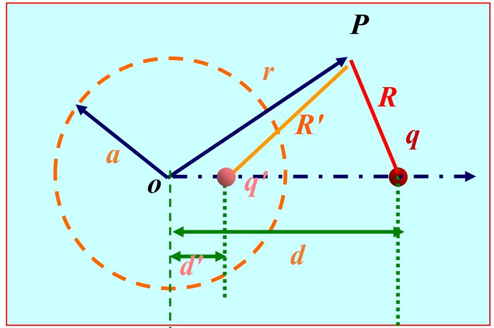

因上式对任意的 $\theta$ 都成立，所以

$$
\left\{ \begin{array}{l} (a ^ {2} + d ^ {2}) q ^ {\prime 2} - (a ^ {2} + d ^ {\prime 2}) q ^ {2} = 0 \\ d q ^ {\prime 2} - d ^ {\prime} q ^ {2} = 0 \end{array} \right.
$$

由此解得

$$
q ^ {\prime} = - \frac {a}{d} q, \quad d ^ {\prime} = \frac {a ^ {2}}{d} \tag {3.5.6}
$$

和

$q ^ { ' } = - \ q$ $\ d ^ { \prime } = d$ (无意义，舍去)

令r＝a， 由球面上电位为零，即 ${ \boldsymbol { \varphi } } = \mathbf { 0 }$ ，得

$$
\frac {q}{R} + \frac {q ^ {\prime}}{R ^ {\prime}} = 0 \rightarrow \frac {R ^ {\prime}}{R} = - \frac {q ^ {\prime}}{q} = \text {常 数}
$$

此式应在整个球面上都成立。

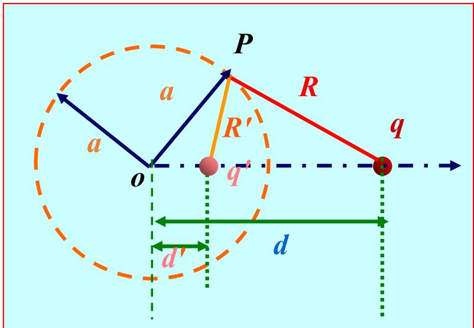

条件：若 $\Delta o q P \sim \Delta o P q ^ { \prime }  \frac { R ^ { \prime } } { R } = \frac { d ^ { \prime } } { a } = \frac { a } { d } =$ d'==常数

$$
\Rightarrow d ^ {\prime} = \frac {a ^ {2}}{d} \leftarrow \dots \dots \dots \dots \dots \dots \dots \dots \dots \dots \dots \dots \dots \dots \dots \dots \dots \dots \dots \dots \dots \dots \dots \dots \dots \dots \dots \dots \dots \dots \dots \dots \dots \dots \dots \dots \dots \dots \dots \dots \dots \dots \dots \dots \dots \dots \dots \dots \dots \dots \tag {像电荷的位置}
$$

$$
\frac {q ^ {\prime}}{R ^ {\prime}} + \frac {q}{R} = 0 \Rightarrow q ^ {\prime} = - \frac {R ^ {\prime}}{R} q = - \frac {a}{d} q \quad \text {像 电 荷 的 电 量}
$$

$$
\frac {a}{d} <   1 \longrightarrow | q ^ {\prime} | <   | q |
$$

# 球外的电位函数为

$$
\varphi = \frac {q}{4 \pi \varepsilon} \left[ \frac {1}{\sqrt {r ^ {2} + d ^ {2} - 2 r d \cos \theta}} - \frac {a}{d \sqrt {r ^ {2} + (a ^ {2} / d) ^ {2} - 2 r (a ^ {2} / d) \cos \theta}} \right] \quad (r \geq a)
$$

球面上的感应电荷面密度为

$$
\rho_ {S} = - \varepsilon \frac {\partial \varphi}{\partial r} \bigg | _ {r = a} = - \frac {q (d ^ {2} - a ^ {2})}{4 \pi a (a ^ {2} + d ^ {2} - 2 a d \cos \theta) ^ {3 / 2}}
$$

导体球面上的总感应电荷为

$$
q _ {i n} = \int_ {S} \rho_ {S} \mathrm {d} S = - \frac {q (d ^ {2} - a ^ {2})}{4 \pi a} \int_ {0} ^ {2 \pi} \int_ {0} ^ {\pi} \frac {a ^ {2} \sin \theta \mathrm {d} \theta \mathrm {d} \phi}{(a ^ {2} + d ^ {2} - 2 a d \cos \theta) ^ {3 / 2}} = - \frac {a}{d} q
$$

可见，导体球面上的总感应电荷也与所设置的镜像电荷相等。

# 点电荷对接地空心导体球壳的镜像

如图所示接地空心导体球壳的内半径为a ，点电荷q 位于球壳内，与球心相距为 $d ( d < a )$ 。

由于球壳接地， 感应电荷分布在球壳的表面上。 镜像电荷q应放置在导体球壳外，且在点电荷q与球心的连线的延长线上。与点荷位于接地导体球外同样的分析，可得到

$$
q ^ {\prime} = - \frac {a}{d} q, \quad d ^ {\prime} = \frac {a ^ {2}}{d}
$$

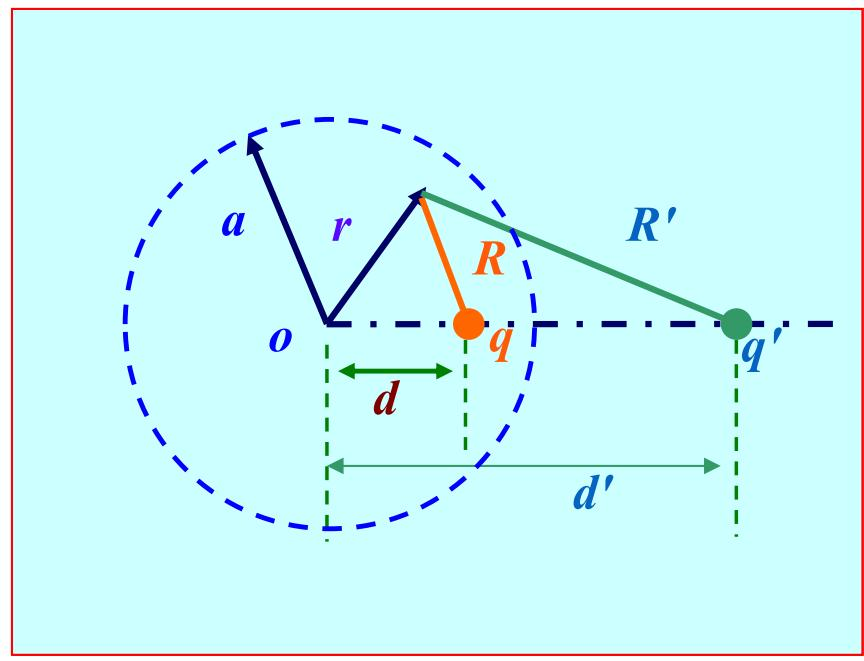

中 | q'|>|q|，可见镜像电荷的电荷量大于点电荷的电荷量

# 球壳内的电位

$$
\varphi = \frac {q}{4 \pi \varepsilon_ {0}} \left[ \frac {1}{\sqrt {r ^ {2} + d ^ {2} - 2 r d \cos \theta}} - \frac {a}{d \sqrt {r ^ {2} + (a ^ {2} / d) ^ {2} - 2 r (a ^ {2} / d) \cos \theta}} \right] (r \le a)
$$

感应电荷分布在导体球面的内表面上，电荷面密度为

$$
\rho_ {S} = \varepsilon \frac {\partial \varphi}{\partial r} \bigg | _ {r = a} = - \frac {q (a ^ {2} - d ^ {2})}{4 \pi a (a ^ {2} + d ^ {2} - 2 a d \cos \theta) ^ {3 / 2}}
$$

导体球面的内表面上的总感应电荷为

$$
q _ {i n} = \int_ {S} \rho_ {S} \mathrm {d} S = - \frac {q (a ^ {2} - d ^ {2})}{4 \pi a} \int_ {0} ^ {2 \pi} \int_ {0} ^ {\pi} \frac {a ^ {2} \sin \theta \mathrm {d} \theta \mathrm {d} \phi}{(a ^ {2} + d ^ {2} - 2 a d \cos \theta) ^ {3 / 2}} = - q
$$

可见，在这种情况下，镜像电荷与感应电荷的电荷量不相等。

# 2 点电荷对不接地导体球的镜像

点电荷q 位于一个半径为 $\pmb { a }$ 的不接地导体球外，距球心为d 。 

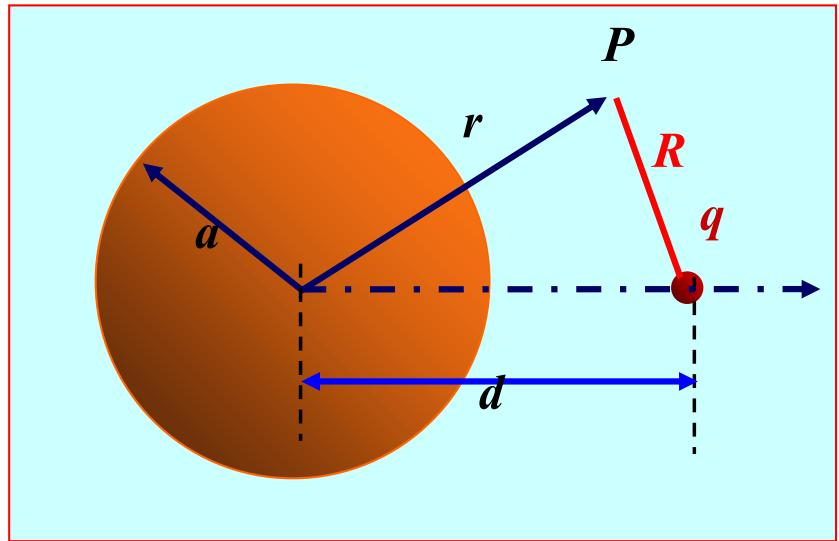

导体球不接地时的特点：

❖ 导体球面是电位不为零的等位面

❖球面上既有感应负电荷分布也有感应正电荷分布，但总的感应电荷为零

采用叠加原理来确定镜像电荷

先设想导体球是接地的，则球面上只有总电荷量为q'的感应电荷分布，则

$$
q ^ {\prime} = - \frac {a}{d} q, d ^ {\prime} = \frac {a ^ {2}}{d}
$$

然后断开接地线，并将电荷－q'加于导体球上，从而使总电荷为零。为保持导体球面为等位面，所加的电荷－ $q ^ { \prime }$ 可用一个位于球心的镜像电荷q"来替代，即

$$
\boldsymbol {q} ^ {\prime \prime} = - \boldsymbol {q} ^ {\prime} = \frac {\boldsymbol {a}}{d} \boldsymbol {q}, d ^ {\prime \prime} = \mathbf {0}
$$

球外任意点的电位为

$$
\varphi = \frac {1}{4 \pi \varepsilon_ {0}} \left(\frac {q}{R} + \frac {q ^ {\prime}}{R ^ {\prime}} + \frac {q ^ {\prime \prime}}{r}\right)
$$

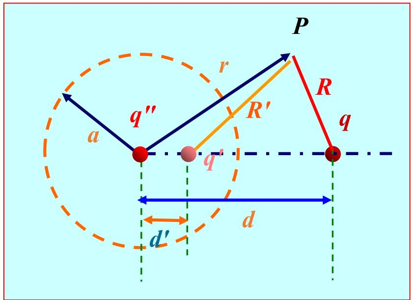

# 3.5.2 导体圆柱面的镜像

线电荷对接地导体圆柱面的镜像问题：如图 1 所示，一根电荷线密度为 $\rho _ { l }$ 的无限长线电荷位于半径为 $\pmb { a }$ 的无限长接地导体圆柱面外，与圆柱的轴线平行且到轴线的距离为d。

特点：在导体圆柱面上有感应电荷，圆轴外的电位由线电荷与感应电荷共同产生。 

分析方法：镜像电荷是圆柱面内部与轴线平行的无限长线电荷，如图2所示。

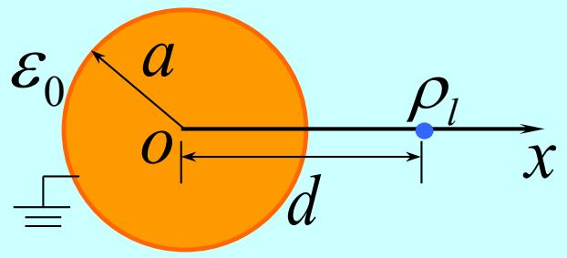

图1 线电荷与导体圆柱

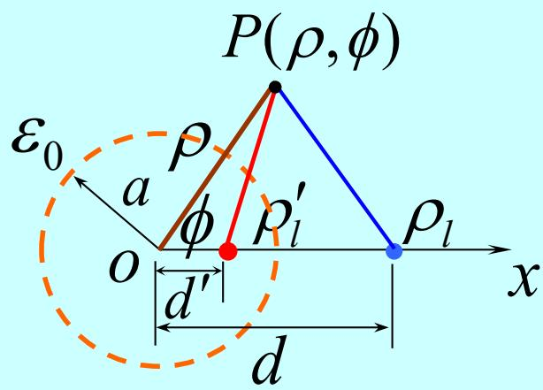

图2 线电荷与导体圆柱的镜像

# 3.5.2 导体圆柱面的镜像

方程 $\nabla ^ { 2 } \varphi = - \frac { \rho _ { l } } { \varepsilon } \delta \big ( \rho - d , \phi \big ) ,$ 

边界条件 $\varphi \mid _ { \rho = a } = 0$ 

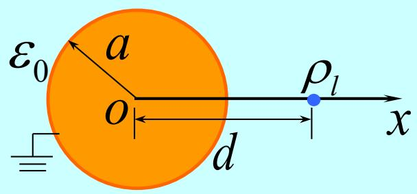

图1 线电荷与导体圆柱

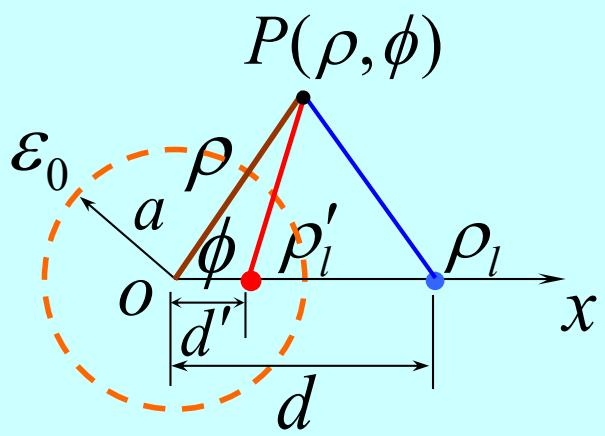

图2 线电荷与导体圆柱的镜像

例 求长度为2L、电荷线密度为 $\rho _ { l 0 }$ 的均匀带电线的电位。

解 采用圆柱面坐标系，令线电荷与 z 轴相重合，中点位于坐标原点。由于轴对称性，电位与 $\phi$ 无关。

在带电线上位于 $z ^ { \prime }$ 处的线元 $\mathrm { d } l ^ { \prime } = \mathrm { d } z ^ { \prime }$ ，它到点 $P ( \rho , \phi , z )$ 的距离 $R = \sqrt { \rho ^ { 2 } + ( z - z ^ { \prime } ) ^ { 2 } }$ 

则

$$
\begin{array}{l} \varphi (\vec {r} ^ {\prime}) = \frac {\rho_ {l 0}}{4 \pi \varepsilon_ {0}} \int_ {- L} ^ {L} \frac {1}{\sqrt {\rho^ {2} + (z - z ^ {\prime}) ^ {2}}} \mathrm {d} z ^ {\prime} \\ = \frac {\rho_ {l 0}}{4 \pi \varepsilon_ {0}} \ln [ z ^ {\prime} - z + \sqrt {\rho^ {2} + (z - z ^ {\prime}) ^ {2}} ] \Bigg | _ {- L} ^ {L} \\ = \frac {\rho_ {l 0}}{4 \pi \varepsilon_ {0}} \ln \frac {\sqrt {\rho^ {2} + (z - L) ^ {2}} - (z - L)}{\sqrt {\rho^ {2} + (z + L) ^ {2}} - (z + L)} \\ \end{array}
$$

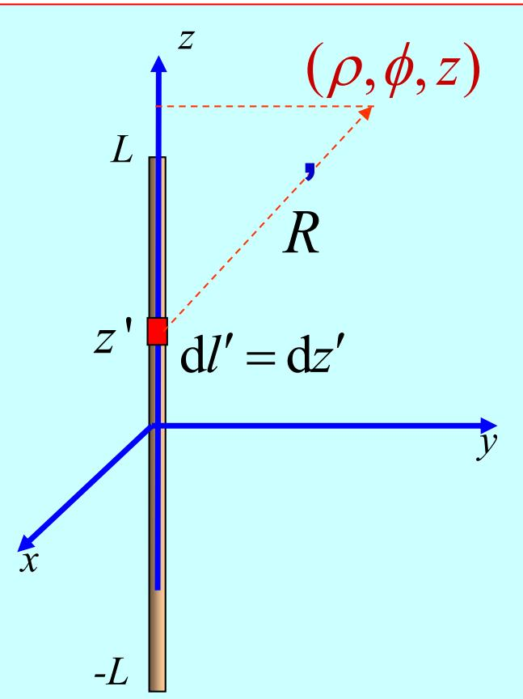

在上式中若令 ，则可得到无限长直线电荷的电位。当L>>R 时，上式可写为

$$
\varphi (\vec {r}) \approx \frac {\rho_ {l 0}}{4 \pi \varepsilon_ {0}} \ln \frac {\sqrt {\rho^ {2} + L ^ {2}} + L}{\sqrt {\rho^ {2} + L ^ {2}} - L} = \frac {\rho_ {l 0}}{4 \pi \varepsilon_ {0}} \ln \frac {2 L}{\rho^ {2} / 2 L} \approx \frac {\rho_ {l 0}}{2 \pi \varepsilon_ {0}} \ln \frac {2 L}{\rho}
$$

当 $L \to \infty$ 时，上式变为无穷大，这是因为电荷不是分布在有限区域内，而将电位参考点选在无穷远点之故。这时可在上式中加上一个任意常数，则有 $\varphi ( \vec { r } ) = \frac { \rho _ { l 0 } } { 2 \pi \varepsilon _ { 0 } } \ln \frac { 2 L } { \rho } + C$ P

并选择有限远处为电位参考点。例如，选择ρ= a的点为电位参考点，则有$C = - \frac { \rho _ { l 0 } } { 2 \pi \varepsilon _ { 0 } } \ln \frac { 2 L } { a } \qquad \varphi ( \vec { r } ) = \frac { \rho _ { l 0 } } { 2 \pi \varepsilon _ { 0 } } \ln \frac { a } { \rho }$ 2πε。

设镜像电荷的线密度为 $\rho _ { l } ^ { \prime }$ ， 且距圆柱的轴线为 $d ^ { \prime }$ ，则由 $\rho _ { l }$ 和 $\rho _ { l } ^ { \prime }$ 共同产生的电位函数

$$
\varphi = \frac {\rho_ {l}}{2 \pi \varepsilon} \ln \frac {1}{\sqrt {\rho^ {2} + d ^ {2} - 2 \rho d \cos \phi}} + \frac {\rho_ {l} ^ {\prime}}{2 \pi \varepsilon} \ln \frac {1}{\sqrt {\rho^ {2} + d ^ {\prime 2} - 2 \rho d ^ {\prime} \cos \phi}} + C
$$

由于导体圆柱接地，所以当 $\rho = a$ 时，电位应为零，即

$$
\frac {\rho_ {l}}{2 \pi \varepsilon} \ln \frac {1}{a \sqrt {a ^ {2} + d ^ {2} - 2 a d \cos \phi}} + \frac {\rho_ {l} ^ {\prime}}{2 \pi \varepsilon} \ln \frac {1}{\sqrt {a ^ {2} + d ^ {\prime 2} - 2 a d ^ {\prime} \cos \phi}} + C = 0
$$

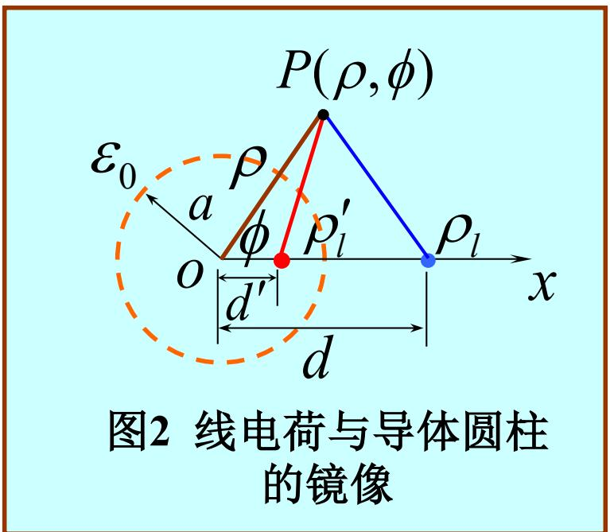

$$
\frac {\rho_ {l}}{2 \pi \varepsilon} \ln \frac {1}{a \sqrt {a ^ {2} + d ^ {2} - 2 a d \cos \phi}} + \frac {\rho_ {l} ^ {\prime}}{2 \pi \varepsilon} \ln \frac {1}{\sqrt {a ^ {2} + d ^ {\prime 2} - 2 a d ^ {\prime} \cos \phi}} + C = 0
$$

由于上式对任意的都成立，因此，将上式对φ求导，可以得到

$$
\rho_ {l} d \left(a ^ {2} + d ^ {2}\right) + \rho_ {l} ^ {\prime} d ^ {\prime} \left(a ^ {2} + d ^ {\prime 2}\right) - 2 a d d ^ {\prime} \left(\rho_ {l} + \rho_ {l} ^ {\prime}\right) \cos \phi = 0
$$

所以有 $ \begin{array} { l } { { \rho _ { l } d ( a ^ { 2 } + d ^ { 2 } ) + \rho _ { l } ^ { \prime } d ^ { \prime } ( a ^ { 2 } + d ^ { \prime } { } ^ { 2 } ) = 0 } } \\ { { \rho _ { l } + \rho _ { l } ^ { \prime } = 0 } } \end{array} \} \overset { \rho _ { l } ^ { \prime } = - } { \underset { d ^ { \prime } = \frac { d } { \delta } } { \longrightarrow } } \{ \begin{array} { l l } { { \rho _ { l } ^ { \prime } = - { } \rho _ { l } ^ { \prime } d ^ { \prime } ( a ^ { 2 } + d ^ { \prime } { } ^ { 2 } ) = 0 } } & { { \quad - \{ \begin{array} { l l } { { \rho _ { l } ^ { \prime } = - \rho _ { l } ^ { \prime } d ^ { \prime } ( a ^ { 2 } + d ^ { \prime } { } ^ { 2 } ) = 0 } } & { { \quad - \{ \begin{array} { l l } { { \rho _ { l } ^ { \prime } = - \rho _ { l } ^ { \prime } d ^ { \prime } } } \\ { { d ^ { \prime } = { } \frac { d ^ { \prime } } { d ^ { \prime } } } } } & { { { \quad - \{ \begin{array} { l l } { { d ^ { \prime } } } \end{array} } \} } } \end{array} } } }   \end{array}  \end{array}$ l −d  = ad

导体圆柱面外的电位函数 =PnVd²p²+a²-2pda²cos +C2π d√p²+d²-2pd cosΦ

由 $\rho = a$ 时， ln 2π8 a

故 =Pn√p²+-2pda²cos $\varphi = \frac { \rho _ { l } } { 2 \pi \varepsilon } \mathrm { l n } \frac { \sqrt { d ^ { 2 } \rho ^ { 2 } + a ^ { 4 } - 2 \rho d a ^ { 2 } \cos \phi } } { \sqrt { a ^ { 2 } \rho ^ { 2 } + a ^ { 2 } d ^ { 2 } - 2 \rho d a ^ { 2 } \cos \phi } }$ 

导体圆柱面上的感应电荷面密度为

$$
\rho_ {S} = - \varepsilon \frac {\partial \varphi}{\partial \rho} \bigg | _ {\rho = a} = - \frac {\rho_ {l} (d ^ {2} - a ^ {2})}{2 \pi a (a ^ {2} + d ^ {2} - 2 a d \cos \phi)}
$$

导体圆柱面上单位长度的感应电荷为

高数（第七版）上册381页（105式）

$$
\rho_ {i n} = \int_ {S} \rho_ {S} \mathrm {d} S = - \frac {\rho_ {l} (d ^ {2} - a ^ {2})}{2 \pi a} \int_ {0} ^ {2 \pi} \frac {a \mathrm {d} \phi}{a ^ {2} + d ^ {2} - 2 a d \cos \phi} = - \rho_ {l}
$$

导体圆柱面上单位长度的感应电荷与所设置的镜像电荷相等。

# 两平行圆柱导体的电轴

问题：如图1所示， 两平行导体圆柱的半径均为 $\pmb { a }$ ，两导体轴线间距为 $2 h$ ，单位长度分别带电荷 $\rho _ { l }$ 和 $- \rho _ { l }$ o

特点：由于两圆柱带电导体的电场互相影响，使导体表面的电荷分布不均匀，相对的一侧电荷密度大， 而相背的一侧电荷密度较小。

分析方法：将导体表面上的电荷用线密度分别为 $\pm \rho _ { l }$ 、 且相距为2b 的两根无限长带电细线来等效替代， 如图 2所示。

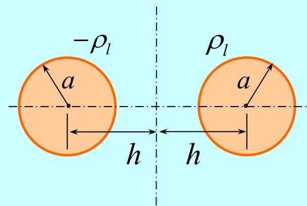

图1 两平行圆柱导体

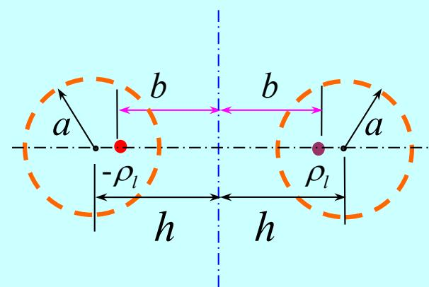

图2 两平行圆柱导体的电轴

# 利用线电荷与接地导体圆柱面的镜像确定

由 $d ^ { \prime } = \frac { a ^ { 2 } } { d } \Longrightarrow \ ( h - b ) ( h + b ) = a ^ { 2 }$ 

$$
\Longrightarrow b = \sqrt {h ^ {2} - a ^ {2}}
$$

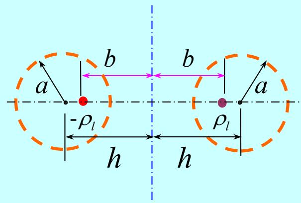

图2 两平行圆柱导体的电轴

通常将带电细线的所在的位置称为圆柱导体的电轴，因而这种方法又称为电轴法。

思考：能否用电轴法求解半径不同的两平行圆柱导体问题？

例3.5.3一根与地面平行架设的圆柱导体,半径为 $a$ ,悬挂高度为 $h$ ，如图3.5.16所示。（1）证明：单位长度上圆柱导线与地面间的电容为 $C _ { 0 } =$ ar(/a)；（2）若导线与地面间的电压为Un，证明：地面对单位长度导线的 $\frac { 2 \pi \varepsilon _ { 0 } } { \operatorname { a r c c o s h } ( h / a ) }$ $U _ { \mathfrak { d } }$ 

作用力 $F _ { 0 } = \frac { \pi \epsilon _ { 0 } U _ { 0 } ^ { 2 } } { [ \operatorname { a r c c o s h } ( h / a ) ] ^ { 2 } ( h ^ { 2 } - a ^ { 2 } ) ^ { 1 / 2 } } \circ$ 

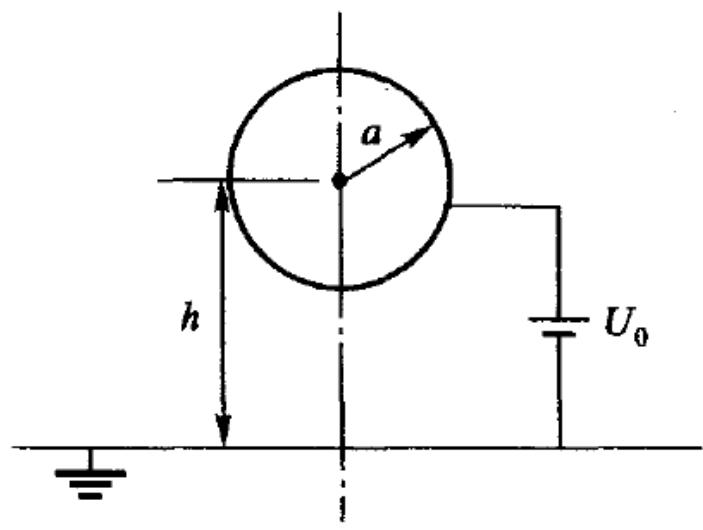

图3.5.16平行于地面的

圆柱导线

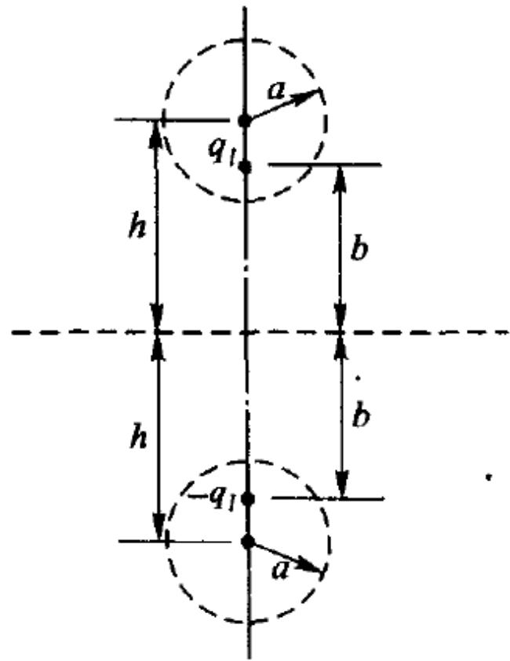

图3.5.17平行于地面的圆

柱导线的镜像

$$
\begin{array}{l} \varphi_ {0} = \frac {q _ {l}}{2 \pi \varepsilon_ {0}} \ln \frac {1}{a - (h - b)} - \frac {q _ {l}}{2 \pi \varepsilon_ {0}} \ln \frac {1}{b + (h - a)} \\ = \frac {q _ {l}}{2 \pi \varepsilon_ {0}} \ln \frac {\sqrt {h ^ {2} - a ^ {2}} + (h - a)}{\sqrt {h ^ {2} - a ^ {2}} - (h - a)} \\ = \frac {q _ {l}}{2 \pi \varepsilon_ {0}} \ln \frac {\sqrt {h ^ {2} - a ^ {2}} + h}{a} = \frac {q _ {l}}{2 \pi \varepsilon_ {0}} \ln \left[ \sqrt {\left(\frac {h}{a}\right) ^ {2} - 1} + \frac {h}{a} \right] \\ \end{array}
$$

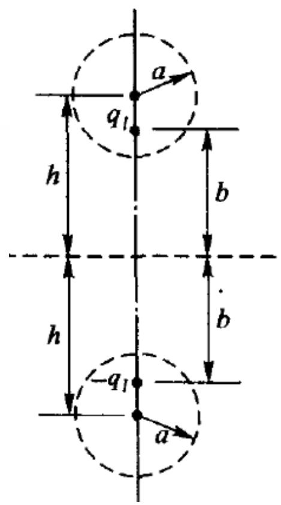

因 $x > 1$ 时,有 $\ln ( { \sqrt { x ^ { 2 } - 1 } } + x ) = \operatorname { a r c c o s h } ( x )$ ,故上式可改写为

$$
\varphi_ {0} = \frac {q _ {l}}{2 \pi \varepsilon_ {0}} \operatorname {a r c c o s h} \left(\frac {h}{a}\right)
$$

$$
C _ {0} = \frac {q _ {l}}{\varphi_ {0}} = \frac {2 \pi \varepsilon_ {0}}{\operatorname {a r c c o s h} (h / a)}
$$

（2）导线单位长度上的电场能量为

$$
W _ {\mathrm {e}} = \frac {1}{2} C _ {0} U _ {0} ^ {2} = \frac {\pi \varepsilon_ {0} U _ {0} ^ {2}}{\operatorname {a r c c o s h} (h / a)}
$$

利用虚位移法，可得地面对导线单位长度的作用力为

$$
\begin{array}{l} F _ {0} = \left. \frac {\partial W _ {\mathrm {e}}}{\partial h} \right| _ {U _ {0} \text {不 变}} = \frac {\partial}{\partial h} \left[ \frac {\pi \varepsilon_ {0} U _ {0} ^ {2}}{\operatorname {a r c c o s h} (h / a)} \right] \\ = \frac {\pi \varepsilon_ {0} U _ {0} ^ {2}}{\left[ \operatorname {a r c c o s h} (h / a) \right] ^ {2} \left(h ^ {2} - a ^ {2}\right) ^ {1 / 2}} \\ \end{array}
$$

# 点电荷与无限大电介质平面的镜像

问题：如图 1 所示，介电常数分别为 $\varepsilon _ { 1 }$ 和 $\varepsilon _ { 2 }$ 的两种不同电介质的分界面是无限大平面，在电介质 1 中有一个点电荷q，距分界平面为h 。

特点：在点电荷的电场作用下，电介质产生极化，在介质分界面上形成极化电荷分布。此时，空间中任一点的电场由点电荷与极化电荷共同产生。

分析方法：计算电介质 1 中的电位时，用位于介质 2 中的镜像电荷来代替分界面上的极化电荷，并把整个空间看作充满介电常数为 $\mathcal { E } _ { 1 }$ 的均匀介质，如图2所示。

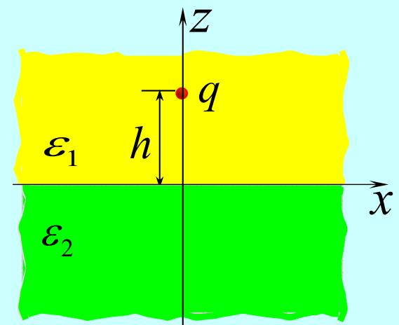

图1 点电荷与电介质分界平面

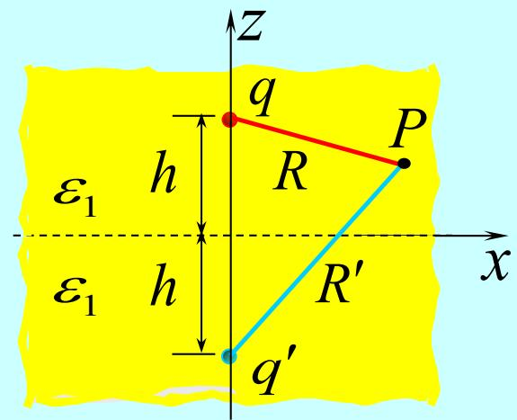

图2 介质1的镜像电荷

$\frac { \partial } { \partial x } \frac { \partial } { \partial { \boldsymbol { \Sigma } } } : \nabla ^ { 2 } \varphi _ { 1 } = - \frac { \rho } { \varepsilon } \delta \big ( \boldsymbol { x } , \boldsymbol { y } , z - h \big ) , ( z \geq 0 )$ 

方程 $\nabla ^ { 2 } \varphi _ { 2 } = 0 , ( z \leq 0 )$ 

边界条件 lx²+y²+2²→ $\varphi { \frac { \scriptstyle } { 1 { \boldsymbol { x } } ^ { 2 } + y ^ { 2 } + z ^ { 2 } \to \infty } } = 0$ 

$$
\varphi_ {1} \big | _ {z = 0} = \varphi_ {2} \big | _ {z = 0}
$$

$$
\left. \varepsilon_ {1} \frac {\partial \varphi_ {1}}{\partial z} \right| _ {z = 0} = \left. \varepsilon_ {2} \frac {\partial \varphi_ {2}}{\partial z} \right| _ {z = 0}
$$

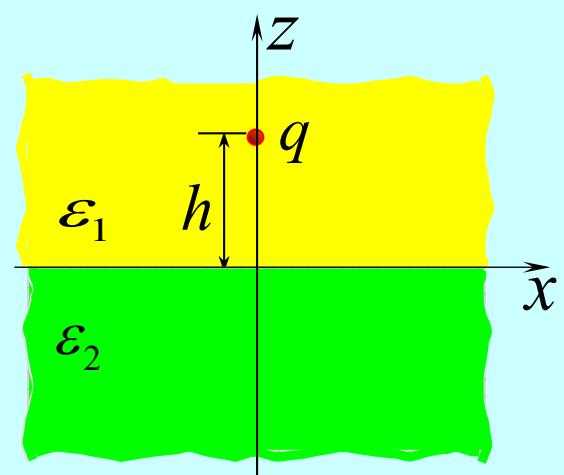

图1 点电荷与电介质分界平面

# 介质1中的电位为

$$
\varphi_ {1} (x, y, z) = \frac {1}{4 \pi \varepsilon_ {1}} \left[ \frac {q}{\sqrt {x ^ {2} + y ^ {2} + (z - h) ^ {2}}} + \frac {q ^ {\prime}}{\sqrt {x ^ {2} + y ^ {2} + (z + h) ^ {2}}} \right] \qquad (z \geq 0)
$$

计算电介质 2 中的电位时，用位于介质 1 中的镜像电荷来代替分界面上的极化电荷，并把整个空间看作充满介电常数为 $ { \varepsilon } _ { 2 }$ 的均匀介质，如图 3所示。介质2中的电位为

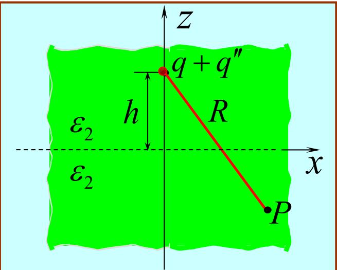

图3 介质2的镜像电荷

$$
\varphi_ {2} (x, y, z) = \frac {1}{4 \pi \varepsilon_ {2}} \frac {q + q ^ {\prime \prime}}{\sqrt {x ^ {2} + y ^ {2} + (z - h) ^ {2}}} \quad (z \leq 0)
$$

利用电位满足的边界条件

$$
\left. \varphi_ {1} \right| _ {z = 0} = \left. \varphi_ {2} \right| _ {z = 0} \qquad \left. \varepsilon_ {1} \frac {\partial \varphi_ {1}}{\partial z} \right| _ {z = 0} = \left. \varepsilon_ {2} \frac {\partial \varphi_ {2}}{\partial z} \right| _ {z = 0}
$$

${ \left\{ \begin{array} { l l } { { \cfrac { 1 } { \varepsilon _ { 1 } } } ( q + q ^ { \prime } ) = { \cfrac { 1 } { \varepsilon _ { 2 } } } ( q + q ^ { \prime \prime } ) } \\ { q - q ^ { \prime } = q + q ^ { \prime \prime } } \end{array} \right. } \Longrightarrow { \left\{ \begin{array} { l l l } { q ^ { \prime } = { \cfrac { \varepsilon _ { 1 } - \varepsilon _ { 2 } } { \varepsilon _ { 1 } + \varepsilon _ { 2 } } } q } \\ { q ^ { \prime \prime } = - { \cfrac { \varepsilon _ { 1 } - \varepsilon } { \varepsilon _ { 1 } + \varepsilon } } q } \end{array} \right. }$ a可得到 ε2

说明：对位于无限大平表面介质分界面附近、且平行于分界面的无限长线电荷（单位长度带），其镜像电荷为

$$
\rho_ {l} ^ {\prime} = \frac {\varepsilon_ {1} - \varepsilon_ {2}}{\varepsilon_ {1} + \varepsilon_ {2}} \rho_ {l}, \rho_ {l} ^ {\prime \prime} = - \frac {\varepsilon_ {1} - \varepsilon_ {2}}{\varepsilon_ {1} + \varepsilon_ {2}} \rho_ {l}
$$

# 线电流与无限大磁介质平面的镜像

问题：如图1所示，磁导率分别为 $\mu _ { 1 }$ 和 $\mu _ { 2 }$ 的两种均匀磁介质的分界面是无限大平面，在磁介质1中有一根无限长直线电流平行于分界平面，且与分界平面相距为h。

特点：在直线电流I 产生的磁场作用下，磁介质被磁化，在分界面上有磁化电流分布，空间中的磁场由线电流和磁化电流共同产生。

分析方法：在计算磁介质1中的磁场时，用置于介质2中的镜像线电流来代替分界面上的磁化电流，并把整个空间看作充满磁导率为 $\mu _ { 1 }$ 的均匀介质，如图2所示。

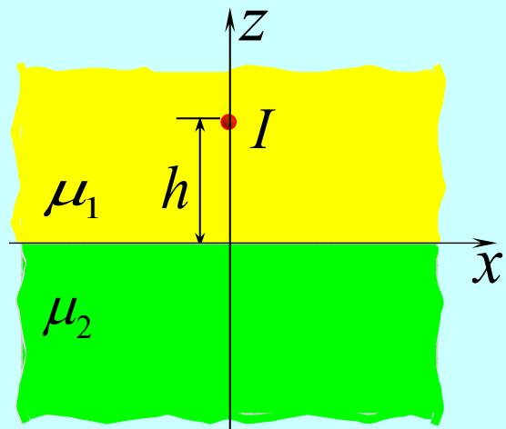

图1 线电流与磁介质分界平面

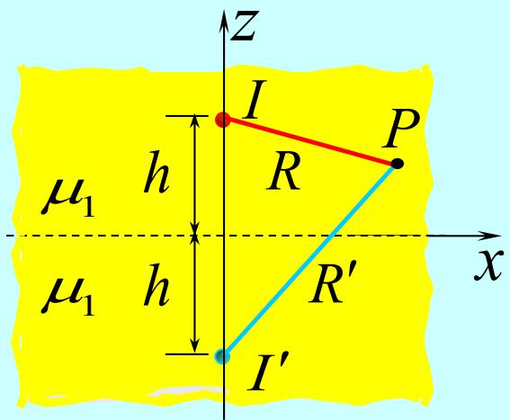

图2 磁介质1的镜像线电流

在计算磁介质2中的磁场时， 用置于介质1中的镜像线电流来代替分界面上的磁化电流，并把整个空间看作充满磁导率为 $\mu _ { 2 }$ 的均匀介质，如图3所示。

因为电流沿y轴方向流动，所以矢量磁位只有y分量，则磁介质1和磁介质2中任一点的矢量磁位分别为

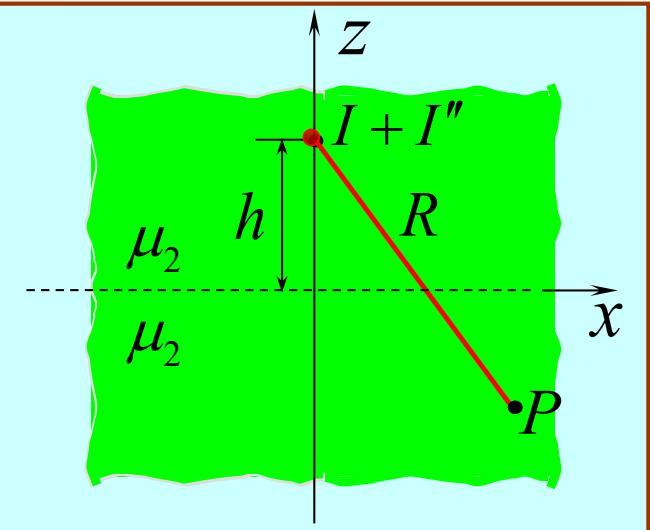

图3 磁介质2的镜像线电流

$$
\begin{array}{l} A _ {1} = \frac {\mu_ {1} I}{2 \pi} \ln \frac {1}{\sqrt {x ^ {2} + (z - h) ^ {2}}} + \frac {\mu_ {1} I ^ {\prime}}{2 \pi} \ln \frac {1}{\sqrt {x ^ {2} + (z + h) ^ {2}}} (z \geq 0) \\ A _ {2} = \frac {\mu_ {2} (I + I ^ {\prime \prime})}{2 \pi} \ln \frac {1}{\sqrt {x ^ {2} + (z - h) ^ {2}}} \quad (z \leq 0) \\ \end{array}
$$

# 利用矢量磁位满足的边界条件

$$
\left. A _ {1} \right| _ {z = 0} = \left. A _ {2} \right| _ {z = 0}, \left. \frac {1}{\mu_ {1}} \frac {\partial A _ {1}}{\partial z} \right| _ {z = 0} = \left. \frac {1}{\mu_ {2}} \frac {\partial A _ {2}}{\partial z} \right| _ {z = 0}
$$

1 2( ) ( )I I I I + = +  $\left\{ { \begin{array} { l } { { \boldsymbol { I } } ^ { \prime } = { \frac { \mu _ { 2 } - \mu _ { 1 } } { \mu _ { 2 } + \mu _ { 1 } } } { \boldsymbol { I } } } \\ { { \boldsymbol { I } } ^ { \prime \prime } = - { \frac { \mu _ { 2 } - \mu _ { 1 } } { \mu _ { 2 } + \mu _ { 1 } } } { \boldsymbol { I } } } \end{array} } \right.$ 可得到I I I I − = + 

故 A $\mathsf { \Pi } _ { 1 } = \frac { \mu _ { 1 } I } { 2 \pi } \ln \frac { 1 } { \sqrt { x ^ { 2 } + \left( z - h \right) ^ { 2 } } } + \frac { \mu _ { 1 } ( \mu _ { 2 } - \mu _ { 1 } ) I } { 2 \pi ( \mu _ { 2 } + \mu _ { 1 } ) } \ln \frac { 1 } { \sqrt { x ^ { 2 } + \left( z + h \right) ^ { 2 } } }$ n (z≥0)

$$
A _ {2} = \frac {\mu_ {1} \mu_ {2} I}{\pi \left(\mu_ {2} + \mu_ {1}\right)} \ln \frac {1}{\sqrt {x ^ {2} + (z - h) ^ {2}}} \quad (z \leq 0)
$$

相应的磁场可由 $\overrightarrow { B } = \nabla \times \overrightarrow { A }$ 求得。

例3.5.4空气中有一根通有电流I的直导线平行于铁板平面,与铁表面距离为 $h$ ,如图3.5.24所示。求空气中任意一点的磁场。

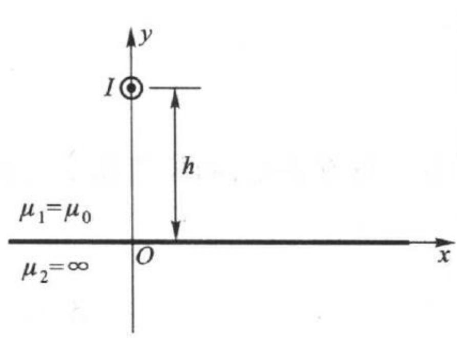

图3.5.24直线电流与铁板平面

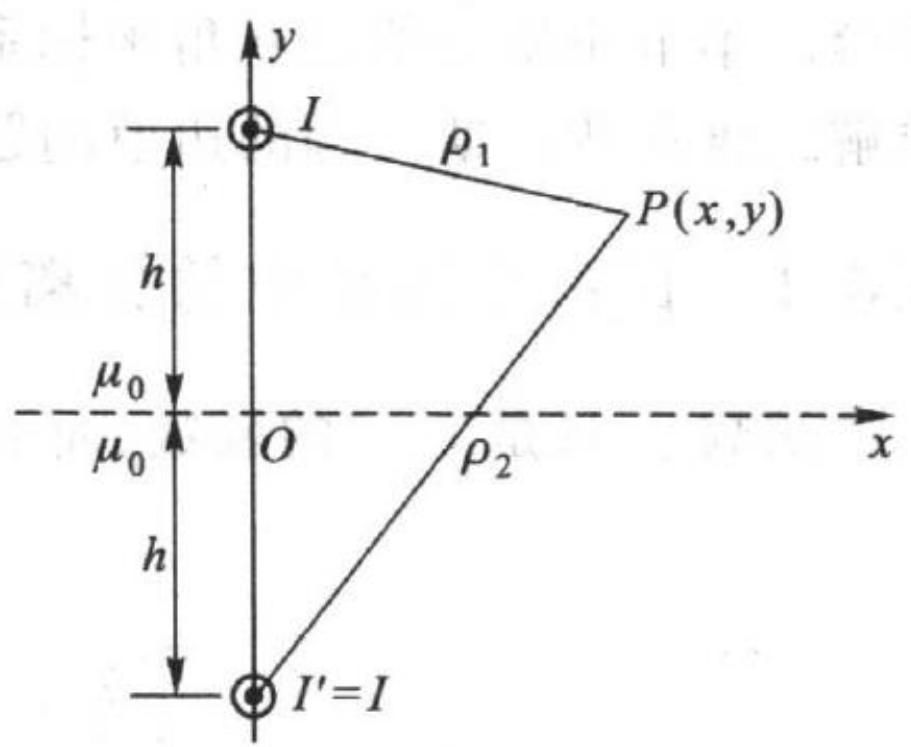

3.5.25直线电流对无限大铁板平面的镜像

# 利用例3.3.2得出的一根无限长直线电流的矢量磁位计算公式

$$
\boldsymbol {A} = e _ {z} \frac {\mu_ {0} I}{2 \pi} \ln \left(\frac {\rho_ {0}}{\rho}\right)
$$

得到任意一点 $P ( x , y )$ 的矢量磁位为

$$
\boldsymbol {A} = e _ {z} \frac {\mu_ {0} I}{2 \pi} \ln \left(\frac {\rho_ {0}}{\rho_ {1}}\right) + e _ {z} \frac {\mu_ {0} I}{2 \pi} \ln \left(\frac {\rho_ {0}}{\rho_ {2}}\right) = e _ {z} \frac {\mu_ {0} I}{2 \pi} \ln \frac {\rho_ {0} ^ {2}}{\rho_ {1} \rho_ {2}}
$$

式中

$$
\rho_ {1} = \left[ x ^ {2} + (y - h) ^ {2} \right] ^ {1 / 2}, \quad \rho_ {2} = \left[ x ^ {2} + (y + h) ^ {2} \right] ^ {1 / 2}
$$

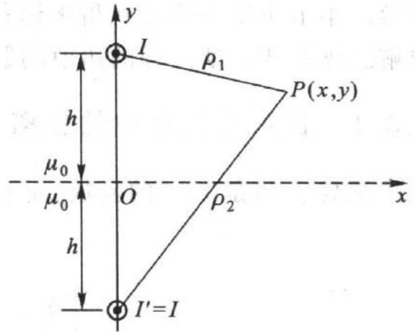

因此，点 $P ( x , y )$ 的磁感应强度为

$$
\begin{array}{l} \boldsymbol {B} = \boldsymbol {\nabla} \times \boldsymbol {A} = e _ {x} \frac {\partial A _ {z}}{\partial y} - e _ {y} \frac {\partial A _ {z}}{\partial x} \\ \mu_ {0} I \begin{array}{l} = - e _ {x} \frac {\mu I _ {0}}{2 \pi} \left[ \frac {y + h}{x ^ {2} + (y + h) ^ {2}} + \frac {y - h}{x ^ {2} + (y - h) ^ {2}} \right] + \\ e _ {y} \frac {\mu I _ {0}}{2 \pi} \left[ \frac {x}{x ^ {2} + (y + h) ^ {2}} + \frac {x}{x ^ {2} + (y - h) ^ {2}} \right] \end{array} \\ \end{array}
$$

+ 分离变量法是求解边值问题的一种经典方法

分离变量法解题的基本思路：

将偏微分方程中含有n个自变量的待求函数表示成n个各自只含一个变量的函数的乘积，把偏微分方程分解成n个常微分方程，求出各常微分方程的通解后，把它们线性叠加起来，得到级数形式解，并利用给定的边界条件确定待定常数。

中 分离变量法的理论依据是惟一性定理

# 3.6.1 直角坐标系中的分离变量法

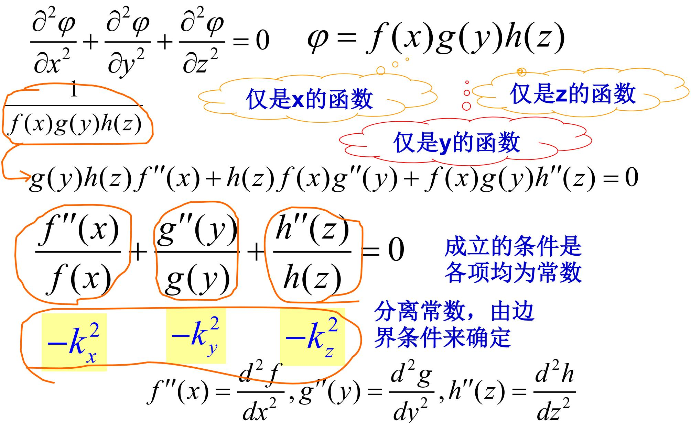

$$
\frac {d ^ {2} f}{d x ^ {2}} = - k _ {x} ^ {2} f, \frac {d ^ {2} g}{d y ^ {2}} = - k _ {y} ^ {2} g, \frac {d ^ {2} h}{d z ^ {2}} = - k _ {z} ^ {2} h
$$

$$
k _ {x} ^ {2} + k _ {y} ^ {2} + k _ {z} ^ {2} = 0 \quad \frac {d ^ {2} f}{d x ^ {2}} = - k _ {x} ^ {2} f
$$

$$
f (x) = \left\{ \begin{array}{c c} A _ {1} x + A _ {2} & k _ {x} = \mathbf {0} \\ A _ {1} \sin k _ {x} x + A _ {2} \cos k _ {x} x & k _ {x} ^ {2} > \mathbf {0} \\ A _ {1} \overline {{\sinh | k _ {x} | x}} + A _ {2} \overline {{\cosh | k _ {x} | x}} = A _ {1} ^ {\prime} e ^ {| k _ {x} | x} + A _ {2} ^ {\prime} e ^ {- | k _ {x} | x} & k _ {x} ^ {2} <   \mathbf {0} \end{array} \right.
$$

双曲正弦

双曲余弦

同样对于 $g ( y )$ 和 $h ( z )$ 也有同样形式的解。

则拉普拉斯方程的解为：

$$
\varphi (x, y, z) = f (x) g (y) h (z)
$$

$\overline { { k _ { x } ^ { 2 } , k _ { y } ^ { 2 } , k _ { z } ^ { 2 } } }$ 不能同时为正，或者为负， $f ( x ) , g ( y ) , h ( z )$ 不能都取相同形式的解。

在具体问题中，通常根据边界条件来选择函数 $f ( x ) , g ( y ) , h ( z )$ 的表达式形式，有以下几种情况：

（1）对于有两个零值边界的方向，其对应的函数一般可以取三角函数形式。

（2）对于单零值边界的方向，对应的函数一般取双曲函数形式。

（3）有无限远边界的方向，一般取指数函数形式。

（4）若位函数与某一坐标变量无关，则该变量对应的函数应取成常数，考虑到其他变量对应解中均含有待定系数，故该常数一般取作1。

# 满足齐次边界条件的分离常数可以取一系列的特殊值

$$
k _ {x i}, k _ {y i}, k _ {z i} \quad (i = 1, 2, 3 \dots)
$$

这些特殊值称为本征值，本征值对应的函数称为本征函数或本征解。根据叠加原理，所有本征解的线性叠加构成满足拉普拉斯方程的通解。

$$
\varphi (x, y, z) = \sum_ {i = 1} ^ {n} \varphi_ {i} (x, y, z) = \sum_ {i = 1} ^ {n} f _ {i} (x) g _ {i} (y) h _ {i} (z)
$$

在许多问题中，单一本征函数不能满足所给边界条件，而级数形式的通解则可以满足单个解函数所无法满足的边界条件。

（1）若 $\varphi = \varphi ( x , y )$ 

$$
\left\{ \begin{array}{l} \frac {d ^ {2} X}{d x ^ {2}} + \alpha X = 0 \\ \frac {d ^ {2} Y}{d y ^ {2}} + \beta Y = 0 \end{array} \right.
$$

$$
\alpha = - k ^ {2}, \beta = k ^ {2} \quad \alpha + \beta = 0
$$

$$
X (x) = A e ^ {k x} + B e ^ {- k x}
$$

$$
Y (y) = C \sin k y + D \cos k y
$$

（2）若 $\varphi = \varphi ( x )$ ，与 无关。

$$
\frac {d ^ {2} \varphi}{d x ^ {2}} = 0 \quad \varphi = A x + B
$$

# ❖ 解题步骤

1.选择坐标系和电势参考点

坐标系选择主要根据区域中分界面形状，参考点主要根据电荷分布是有限还是无限；

2.分析对称性、分区写出拉普拉斯方程在所选坐标系中的通解；

3. 根据具体条件确定常数

（1）外边界条件： 电荷分布有限 $\left. \varphi \right| _ { \infty } = 0$ 

注意：边界条件和边值关系是相对的。导体边界可视为外边界，给定 $\left. \varphi \right| _ { S }$ （接地 $\varphi _ { \vert _ { S } } = 0 )$ ，或给定总电荷 Q，或给定 

电荷分布无限，电势参考点一般选在有限区。如均匀场中， $\begin{array} { r l } { \vec { E } = E _ { 0 } \vec { e } _ { z } } & { { } \varphi \big \rvert _ { \infty }  - E _ { 0 } r \cos \theta = - E _ { 0 } z } \end{array}$ $\vec { E } = E _ { 0 } \vec { e } _ { z }$ （直角坐标或柱坐标） ? 电势可选在坐标原点。

（2）内部边值关系：介质分界面上

$$
\left. \varphi_ {1} \right| _ {S} = \left. \varphi_ {2} \right| _ {S} \qquad \left. \varepsilon_ {1} \frac {\partial \varphi_ {1}}{\partial n} \right| _ {S} = \left. \varepsilon_ {2} \frac {\partial \varphi_ {2}}{\partial n} \right| _ {S}
$$

一般讨论分界面无自由电荷的情况

例3.6.1 无限长的矩形金属导体槽上有一盖板，盖板与金属槽绝缘，盖板电位为 $U _ { \mathbf { 0 } }$ ，金属槽接地，横截面如图所示，试计算此导体槽内的电位分布。

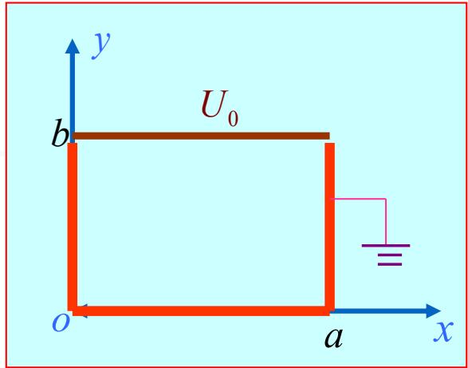

# 3.6.2 圆柱坐标系中的分离变量法

$$
\frac {1}{r} \frac {\partial}{\partial r} (r \frac {\partial \varphi}{\partial r}) + \frac {1}{r ^ {2}} \frac {\partial^ {2} \varphi}{\partial \theta^ {2}} + \boxed {\frac {\partial^ {2} \varphi}{\partial z ^ {2}}} = 0
$$

只讨论二维平面场

$$
\frac {1}{r} \frac {\partial}{\partial r} (r \frac {\partial \varphi}{\partial r}) + \frac {1}{r ^ {2}} \frac {\partial^ {2} \varphi}{\partial \theta^ {2}} = 0
$$

设解的形式为：

$$
\varphi = f (r) g (\theta)
$$

$$
\frac {g (\theta)}{r} \frac {\partial}{\partial r} (r \frac {f (r)}{\partial r}) + \frac {f (r)}{r ^ {2}} \frac {\partial^ {2} g (\theta)}{\partial \theta^ {2}} = 0
$$

$$
\left(\frac {r ^ {2}}{f (r) g (\theta)} \right.
$$

$$
\frac {\frac {r}{f (r)} \frac {\partial}{\partial r} (r \frac {f (r)}{\partial r}) + \frac {1}{g (\theta)} \frac {\partial^ {2} g (\theta)}{\partial \theta^ {2}} = 0}{\downarrow_ {\gamma^ {2}}}
$$

$$
\frac {d ^ {2} g (\theta)}{d \theta^ {2}} + \gamma^ {2} g (\theta) = 0 \Longrightarrow g (\theta) = A \sin (\gamma \theta) + B \cos (\gamma \theta)
$$

$$
\varphi \left[ \gamma (\theta + 2 \pi) \right] = \varphi (\gamma \theta) \quad \gamma = n \quad n \text {为 整 数}
$$

$$
g (\theta) = A \sin (n \theta) + B \cos (n \theta) \quad r \frac {a}{d r} \left(r \frac {f (r)}{d r}\right) - n ^ {2} f (r) = 0
$$

$$
\begin{array}{l} r ^ {2} \frac {d ^ {2} f (r)}{d r ^ {2}} + r \frac {d f (r)}{d r} - n ^ {2} f (r) = 0 \\ n = 0 \quad f (r) = C _ {0} + D _ {0} \ln r \end{array} \quad \begin{array}{l} f (r) = C r ^ {n} + D r ^ {- n} \\ \text {欧 拉 方 程} \end{array}
$$

$$
\varphi = \sum_ {n = 1} ^ {\infty} \left[ A _ {n} \sin (n \theta) + B _ {n} \cos (n \theta) \right] \left(C _ {n} r ^ {n} + D _ {n} r ^ {- n}\right)
$$

例：一半径为 a，介电常数为 $\mathcal { E }$ 的无 限长电介质圆柱，柱轴沿 $\vec { e } _ { z }$ 方向， $\vec { e } _ { x }$ ex 方向上有一外加均匀电场 $\vec { E } _ { 0 }$ ，求空间电势分布和柱面上的束缚电荷分布。

解：(1)边界为柱面,选柱坐标系。均匀场电势在无穷远处不为零，故参考点选在有限区域，例如可选在坐标原点

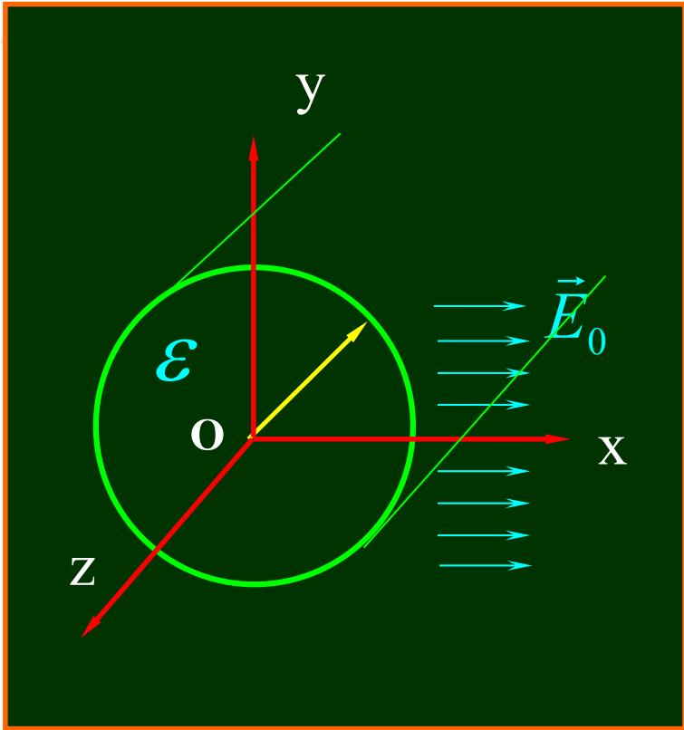

(2) 考虑对称性电势与z无关，设柱内电势为 $\varphi _ { 1 }$ ，柱外为 $\varphi _ { 2 }$ 它们分别满足 $\nabla ^ { 2 } \varphi _ { 1 } = 0 ( 0 < r < a )$ , $\nabla ^ { 2 } \varphi _ { 2 } = 0 \ ( r > a )$ 。通解为：

$$
\varphi_ {1} = \sum_ {n = 1} ^ {\infty} \left[ r ^ {n} \left(A _ {n} ^ {(1)} \sin n \theta + B _ {n} ^ {(1)} \cos n \theta\right) + r ^ {- n} \left(C _ {n} ^ {(1)} \sin n \theta + D _ {n} ^ {(1)} \cos n \theta\right) \right]
$$

$$
\varphi_ {1} = \sum_ {n = 1} ^ {\infty} [ r ^ {n} (A _ {n} ^ {(1)} \sin n \theta + B _ {n} ^ {(1)} \cos n \theta) + r ^ {- n} (C _ {n} ^ {(1)} \sin n \theta + D _ {n} ^ {(1)} \cos n \theta) ]
$$

a<r<8 

$$
\varphi_ {2} = \sum_ {n = 1} ^ {\infty} \left[ r ^ {n} \left(A _ {n} ^ {(2)} \sin n \theta + B _ {n} ^ {(2)} \cos n \theta\right) + r ^ {- n} \left(C _ {n} ^ {(2)} \sin n \theta + D _ {n} ^ {(2)} \cos n \theta\right) \right]
$$

(3) 确定常数

$\textcircled{1}$ 因为有外加均匀场，它们对x轴对称，可考虑 $\varphi _ { 1 }$ 、 $\varphi _ { 2 }$ 也相对x轴对称（ $\varphi ( \theta )$ 为偶函数），所以 $\varphi _ { 1 } ~ \varphi _ { 2 }$ 中不应包含 项，故： $A _ { n } ^ { ( 1 ) } , A _ { n } ^ { ( 2 ) } , C _ { n } ^ { ( 1 ) } , C _ { n } ^ { ( 2 ) }$ Y 均为零。

$\textcircled { 2 } \ r = 0 \ \textcircled { \varphi _ { 1 } = }$ ② $\varphi _ { 1 } =$ 常数（或零），有限，故 $\varphi _ { 1 }$ 中不应有 $r ^ { - n }$ 项 $\Rightarrow D _ { n } ^ { ( 1 ) } \equiv 0$ o $r \to \infty \ \varphi _ { 2 } \to - E _ { 0 } r \cos \theta$ （均匀场电势）

因此 $\varphi _ { 2 }$ 中不含 $r ^ { n }$ 项（ $n \neq 1 )$ ，得 $B _ { 1 } ^ { ( 2 ) } = - E _ { 0 }$ B（2） $B _ { n } ^ { ( 2 ) } \equiv 0$ 

$$
\left\{ \begin{array}{l l} \varphi_ {1} = \sum_ {n = 1} ^ {\infty} B _ {n} ^ {(1)} r ^ {n} \cos n \theta & 0 <   r <   a \\ \varphi_ {2} = - E _ {0} r \cos \theta + \sum_ {n = 1} ^ {\infty} D _ {n} ^ {(2)} r ^ {- n} \cos n \theta & a <   r <   \infty \end{array} \right.
$$

③r=a 时，

$$
\begin{array}{l} \left. \varphi_ {1} \right| _ {r = a} = \left. \varphi_ {2} \right| _ {r = a} \quad \left. \varepsilon \frac {\partial \varphi_ {1}}{\partial r} \right| _ {r = a} = \left. \varepsilon \frac {\partial \varphi_ {2}}{\partial r} \right| _ {r = a} \\ \left\{ \begin{array}{l} \sum_ {n = 1} ^ {\infty} B _ {n} ^ {(1)} a ^ {n} \cos n \theta = - E _ {0} a \cos \theta + \sum_ {n = 1} ^ {\infty} D _ {n} ^ {(2)} a ^ {- n} \cos n \theta \\ \varepsilon \sum_ {n = 1} ^ {\infty} n B _ {n} ^ {(1)} a ^ {n - 1} \cos n \theta = - \varepsilon_ {0} E _ {0} \cos \theta + \varepsilon_ {0} \sum_ {n = 1} ^ {\infty} (- n) D _ {n} ^ {(2)} a ^ {- (n + 1)} \cos n \theta \end{array} \right. \\ \end{array}
$$

两边 为任意值，cos $\theta$ 前系数应相等（ $n = 1 , 2 , \cdots )$ 

$$
\begin{array}{l} \begin{array}{r l} {n = 1} & {\left\{ \begin{array}{l l} B _ {1} ^ {(1)} a = - E _ {0} a + D _ {1} ^ {(2)} a ^ {- 1} \\ \varepsilon B _ {1} ^ {(1)} = - \varepsilon_ {0} E _ {0} - \varepsilon_ {0} D _ {1} ^ {(2)} a ^ {- 2} \end{array} \right. \Rightarrow \left\{ \begin{array}{l l} D _ {1} ^ {(2)} = \frac {\varepsilon - \varepsilon_ {0}}{\varepsilon + \varepsilon_ {0}} E _ {0} a ^ {2} \\ B _ {1} ^ {(1)} = \frac {- 2 \varepsilon_ {0}}{\varepsilon + \varepsilon_ {0}} E _ {0} \end{array} \right.} \end{array} \\ n \neq 1 (n > 1) \left\{ \begin{array}{l} B _ {n} ^ {(1)} a ^ {n} = D _ {n} ^ {(2)} a ^ {- n} \\ \varepsilon n B _ {n} ^ {(1)} a ^ {n - 1} = - \varepsilon_ {0} n D _ {n} ^ {(2)} a ^ {- (n + 1)} \Rightarrow \left\{ \begin{array}{l} B _ {n} ^ {(1)} = 0 \\ D _ {n} ^ {(2)} = 0 \end{array} \right. (n > 1) \end{array} \right. \\ \end{array}
$$

（4）解为

$$
\left\{ \begin{array}{l} \varphi_ {1} = - \frac {2 \varepsilon_ {0}}{\varepsilon + \varepsilon_ {0}} E _ {0} r \cos \theta \quad 0 <   r <   a \\ \varphi_ {2} = - E _ {0} r \cos \theta + \frac {\varepsilon - \varepsilon_ {0}}{\varepsilon + \varepsilon_ {0}} \frac {a ^ {2}}{r} E _ {0} \cos \theta \quad a <   r <   \infty \end{array} \right.
$$

（5）求柱内电场： $\varphi _ { 1 } = - { \frac { 2 \varepsilon _ { 0 } } { \varepsilon + \varepsilon _ { 0 } } } E _ { 0 } x \qquad ( r \cos \theta = x )$ 280Eox

$$
E _ {1 x} = \frac {2 \varepsilon_ {0}}{\varepsilon + \varepsilon_ {0}} E _ {0} \qquad E _ {1 y} = E _ {1 z} = 0
$$

$$
\vec {E} _ {1} = + \frac {2 \varepsilon_ {0}}{\varepsilon + \varepsilon_ {0}} \vec {E} _ {0} \text {仍 沿} \mathbf {x} \text {方 向}
$$

$$
\because \quad \frac {2 \varepsilon_ {0}}{\varepsilon + \varepsilon_ {0}} <   1 \therefore E _ {1} <   E _ {0}
$$

$$
\overrightarrow {E} _ {P} = \overrightarrow {E} _ {1} - \overrightarrow {E} _ {0} = \frac {\varepsilon_ {0} - \varepsilon}{\varepsilon_ {0} + \varepsilon} \overrightarrow {E} _ {0} = - \frac {\varepsilon - \varepsilon_ {0}}{\varepsilon + \varepsilon_ {0}} \overrightarrow {E} _ {0}
$$

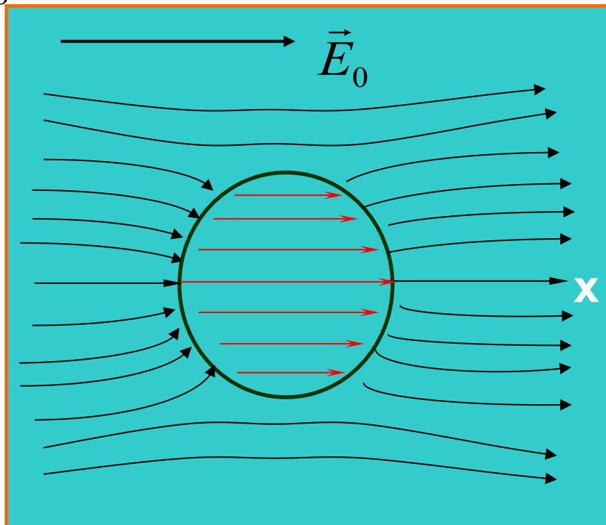

# （6）柱面上束缚面电荷分布

$$
\frac {\boldsymbol {\sigma} + \boldsymbol {\sigma} _ {P}}{\varepsilon_ {0}} = \vec {n} \cdot (\vec {E} _ {2} - \vec {E} _ {1}) \quad \boldsymbol {\sigma} = 0
$$

$$
\sigma_ {P} = \varepsilon_ {0} (E _ {2 n} - E _ {1 n}) = \varepsilon_ {0} (- \frac {\partial \varphi_ {2}}{\partial r} + \frac {\partial \varphi_ {1}}{\partial r}) _ {r = a}
$$

$$
\begin{array}{l} = \varepsilon_ {0} [ E _ {0} \cos \theta + \frac {\varepsilon - \varepsilon_ {0}}{\varepsilon + \varepsilon_ {0}} E _ {0} \cos \theta - \frac {2 \varepsilon_ {0}}{\varepsilon + \varepsilon_ {0}} E _ {0} \cos \theta ] \\ = \frac {2 \varepsilon_ {0} (\varepsilon - \varepsilon_ {0})}{\varepsilon + \varepsilon_ {0}} E _ {0} \cos \theta \\ \end{array}
$$

（7）若圆柱为导体，可用上述方法重新求解，或令

$$
\left\{ \begin{array}{l} \varphi_ {1} = 0 \\ \varphi_ {2} = - E _ {0} r \cos \theta + \frac {a ^ {2}}{r} E _ {0} \cos \theta \\ \sigma = 2 \varepsilon_ {0} E _ {0} \cos \theta \end{array} \right.
$$

# 3.6.3 球坐标系中的分离变量法

$$
\frac {1}{r ^ {2}} \frac {\partial}{\partial r} \left(r ^ {2} \frac {\partial \varphi}{\partial r}\right) + \frac {1}{r ^ {2} \sin \theta} \frac {\partial}{\partial \theta} \left(\sin \theta \frac {\partial \varphi}{\partial \theta}\right) + \overbrace {r ^ {2} \sin^ {2} \theta} ^ {1} \frac {\partial^ {2} \varphi}{\partial \phi^ {2}} = 0
$$

$$
\frac {1}{r ^ {2}} \frac {\partial}{\partial r} (r ^ {2} \frac {\partial \varphi}{\partial r}) + \frac {1}{r ^ {2} \sin \theta} \frac {\partial}{\partial \theta} (\sin \theta \frac {\partial \varphi}{\partial \theta}) = 0 \quad \varphi = f (r) g (\theta)
$$

$$
\frac {g (\theta)}{r ^ {2}} \frac {\partial}{\partial r} \left[ r ^ {2} \frac {\partial f (r)}{\partial r} \right] + \frac {f (r)}{r ^ {2} \sin \theta} \frac {\partial}{\partial \theta} \left[ \sin \theta \frac {\partial g (\theta)}{\partial \theta} \right] = 0 \Longleftrightarrow \frac {r ^ {2}}{f (r) g (\theta)}
$$

$$
\frac {1}{f (r)} \frac {\partial}{\partial r} \left[ r ^ {2} \frac {\partial f (r)}{\partial r} \right] + \frac {1}{g (\theta) \sin \theta} \frac {\partial}{\partial \theta} \left[ \sin \theta \frac {\partial g (\theta)}{\partial \theta} \right] = 0
$$

$$
m (m + 1)
$$

$$
\frac {d}{d r} \left(r ^ {2} \frac {d f (r)}{d r}\right) - m (m + 1) f (r) = 0
$$

$$
- m (m + 1)
$$

欧拉型方程

$$
f (r) = A _ {m} r ^ {m} + B _ {m} r ^ {- (m + 1)}
$$

$$
\frac {1}{\sin \theta} \frac {d}{d \theta} \left(\sin \theta \frac {d g (\theta)}{d \theta}\right) + m (m + 1) g (\theta) = 0
$$

引入新的自变量x令 x =cos0

$$
\frac {d}{d \theta} = \frac {d}{d x} \frac {d x}{d \theta} = - \sin \theta \frac {d}{d x}
$$

$$
\frac {d}{d x} \left[ \left(1 - x ^ {2}\right) \frac {d g (x)}{d x} \right] + \lambda g (x) = 0
$$

注意：x只是一个记号，并不是直角坐标系中的x。

勒让德方程

研究 $0 \leq \theta \leq \pi$ 即-1≤x≤1

则此时的勒让德方程只有一个有界解，它为m阶多项式，记作$\mathrm { P } _ { m } \left( x \right)$ 

当m为偶数时， $P _ { m } ( x )$ 只有偶次项，当为奇数时，则只有奇数项。

$$
\begin{array}{r l} & \mathrm {P} _ {0} (x) = 1 \\ & \mathrm {P} _ {1} (x) = x = \cos \theta \\ & \mathrm {P} _ {2} (x) = \frac {1}{2} (3 x ^ {2} - 1) = \frac {1}{2} (3 \cos^ {2} \theta - 1) \\ & \mathrm {P} _ {3} (x) = \frac {1}{2} (5 x ^ {2} - 3 x) = \frac {1}{2} (5 \cos^ {3} \theta - 3 \cos \theta) \\ & \mathrm {P} _ {4} (x) = \frac {1}{8} (3 5 x ^ {4} - 3 0 x ^ {2} + 3) \\ & = \frac {1}{8} (3 5 \cos^ {4} \theta - 3 0 \cos^ {2} \theta + 3) \\ & \mathrm {P} _ {5} (x) = \frac {1}{8} (6 3 x ^ {5} + 7 0 x ^ {3} + 1 5 x) \\ & = \frac {1}{8} (6 3 \cos^ {5} \theta - 7 0 \cos^ {3} \theta + 1 5 \cos \theta) \end{array}
$$

# 让德多项

对于任意m， $P _ { m } ( x )$ 可用下式计算：

勒让德多项式具有正交性： $\mathrm { P } _ { m } ( x ) = \frac { 1 } { 2 ^ { m } m ! } \frac { d ^ { m } } { d x ^ { m } } ( x ^ { 2 } - 1 ) ^ { m }$ 

$$
\int_ {0} ^ {\pi} \mathrm {P} _ {m} (\cos \theta) \mathrm {P} _ {n} (\cos \theta) \sin \theta d \theta = \int_ {- 1} ^ {1} \mathrm {P} _ {m} (x) \mathrm {P} _ {n} (x) d x = 0
$$

$$
\int_ {0} ^ {\pi} \left[ \mathrm {P} _ {m} (\cos \theta) \right] ^ {2} \sin \theta d \theta = \int_ {- 1} ^ {1} \left[ \mathrm {P} _ {m} (x) \right] ^ {2} d x = \frac {2}{2 m + 1}
$$

球面坐标系中的电位解为：

$$
\varphi (r, \theta) = \sum_ {m = 0} ^ {\infty} \left(A _ {m} r ^ {m} + B _ {m} r ^ {- (m + 1)}\right) P _ {m} (\cos \theta)
$$

# 例 3.6.3 设半径为 $a$ ，介电常数为 的介质球放在无限大的真

空中，受到均匀电场 $E _ { 0 }$ 的作用，如图所示。试求介质球内的电场强度。

解 取球坐标系， 令 $E _ { 0 }$ 的方向与 $Z$ 轴一致，即 $\vec { E } _ { 0 } = \vec { e } _ { z } E _ { 0 }$ 。 显然，此时场分布以 $Z$ 轴为旋转对称，因此与 $\phi$ 无关。这样，球内外的电位分布函数可取为

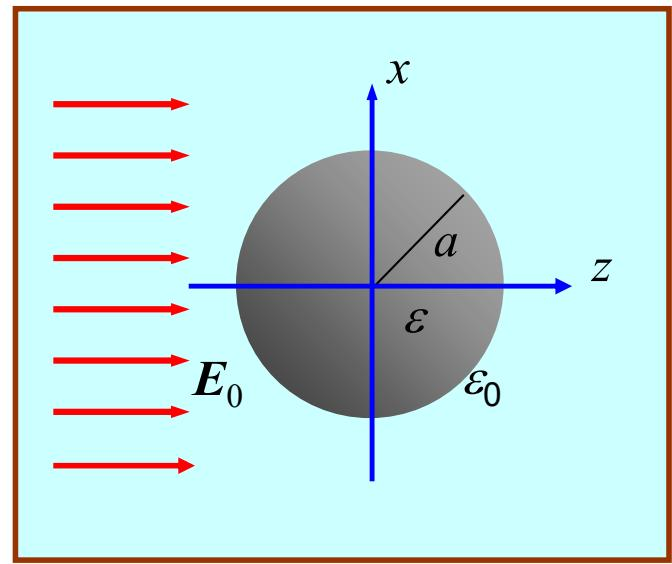

$$
\phi (r, \theta) = \sum_ {n = 0} ^ {\infty} \left(C _ {n} r ^ {n} + D _ {n} r ^ {- (n + 1)}\right) P _ {n} (\cos \theta)
$$

则球内外电位分别为

$$
\phi_ {i} (r, \theta) = \sum_ {n = 0} ^ {\infty} C _ {n} r ^ {n} \mathrm {P} _ {n} (\cos \theta) + \sum_ {n = 0} ^ {\infty} D _ {n} r ^ {- (n + 1)} \mathrm {P} _ {n} (\cos \theta) \qquad (r <   a)
$$

$$
\phi_ {o} (r, \theta) = \sum_ {n = 0} ^ {\infty} A _ {n} r ^ {n} \mathrm {P} _ {n} (\cos \theta) + \sum_ {n = 0} ^ {\infty} B _ {n} r ^ {- (n + 1)} \mathrm {P} _ {n} (\cos \theta) \quad (r > a)
$$

# 球内外电位函数应该满足下列边界条件：

$\textcircled{1}$ 球心电位 $\varphi _ { \mathrm { i } } ( 0 , \theta )$ 应为有限值；

$\textcircled{2}$ 无限远处电场未受干扰，因此电位应为

$$
\varphi_ {\mathrm {o}} (\infty , \theta) = - E _ {0} r \cos \theta = - E _ {0} r P _ {1} (\cos \theta)
$$

$\textcircled{3}$ 球内电位与球外电位在球面上应该连续，即

$$
\varphi_ {\mathrm {i}} (a, \theta) = \varphi_ {\mathrm {o}} (a, \theta)
$$

$\textcircled{4}$ 根据边界上电位移法向分量的连续性，获知球面上内外电位的法向导数应满足

$$
\varepsilon \frac {\partial \phi_ {\mathrm {i}}}{\partial r} \bigg | _ {r = a} = \varepsilon_ {0} \frac {\partial \phi_ {\mathrm {o}}}{\partial r} \bigg | _ {r = a}
$$

考虑到边界条件 $\textcircled{1}$ ，系数 $\underset { \infty } { \cal D } { } _ { n }$ 应为零，即

$$
\phi_ {\mathrm {i}} (r, \theta) = \sum_ {n = 0} C _ {n} r ^ {n} P _ {n} (\cos \theta)
$$

为了满足边界条件 $\textcircled{2}$ ，除了 $\textstyle { \mathcal { A } } _ { 1 }$ 以外的系数 $A _ { n } = \mathbf { 0 }$ ，且 $A _ { 1 } = - E _ { 0 }$ ，即

$$
\phi_ {\mathrm {o}} (r, \theta) = - E _ {0} r P _ {1} (\cos \theta) + \sum_ {n = 0} ^ {\infty} B _ {n} r ^ {- (n + 1)} P _ {n} (\cos \theta)
$$

再考虑到边界条件 $\textcircled{3}$ ，得

$$
\sum_ {n = 0} ^ {\infty} C _ {n} a ^ {n} P _ {n} (\cos \theta) = - E _ {0} a P _ {1} (\cos \theta) + \sum_ {n = 0} ^ {\infty} B _ {n} a ^ {- (n + 1)} P _ {n} (\cos \theta)
$$

为了进一步满足边界条件 $\textcircled{4}$ ，得

$$
\sum_ {n = 0} ^ {\infty} \varepsilon_ {r} n C _ {n} a ^ {n - 1} P _ {n} (\cos \theta) = - E _ {0} P _ {1} (\cos \theta) - \sum_ {n = 0} ^ {\infty} (n + 1) B _ {n} a ^ {- (n + 2)} P _ {n} (\cos \theta)
$$

式中 $\varepsilon _ { r } = \varepsilon / \varepsilon _ { 0 }$ 

由于上两式对于所有的 $\theta$ 值均应满足，因此等式两边对应的各项系数应该相等。由此获知各系数分别为

$$
B _ {0} = C _ {0} = 0 B _ {1} = E _ {0} a ^ {3} \left(\frac {\varepsilon_ {r} - 1}{\varepsilon_ {r} + 2}\right)
$$

$$
C _ {1} = - \frac {3 E _ {0}}{\varepsilon_ {r} + 2} \quad B _ {n} = C _ {n} = 0, \quad (n \geq 2)
$$

代入前式，求得球内外电位分别为

$$
\phi_ {\mathrm {i}} (r, \theta) = - \frac {3 E _ {0}}{\varepsilon_ {r} + 2} r \cos \theta = - \frac {3 E _ {0}}{\varepsilon_ {r} + 2} z
$$

$$
\phi_ {\mathrm {o}} (r, \theta) = - E _ {0} r \cos \theta + \frac {\varepsilon_ {r} - 1}{\varepsilon_ {r} + 2} \frac {E _ {0} a ^ {3}}{r ^ {2}} \cos \theta
$$

值得注意的是球内的电场分布。已知 $\vec { E } = - \nabla \varphi ,$ ，求得球内的电场为

$$
\boldsymbol {E} _ {\mathrm {i}} = - \frac {\partial \varphi_ {\mathrm {i}}}{\partial z} = \frac {3 E _ {0} \varepsilon_ {0}}{\varepsilon + 2 \varepsilon_ {0}} = \frac {3 E _ {0}}{\varepsilon_ {r} + 2} <   E _ {0}
$$

可见，球内电场仍然为均匀电场，而且球内场强低于球外场强。

球内外的电场线如图示。

如果在无限大的介电常数为 $\varepsilon$ 的均匀介质中存在球形气泡，那么当外加均匀电场时，气泡内的电场强度应为

$$
\boldsymbol {E} _ {i} = \frac {3 \varepsilon E _ {0}}{\varepsilon_ {0} + 2 \varepsilon} = \frac {3 \varepsilon_ {r} E _ {0}}{1 + 2 \varepsilon_ {r}} > E _ {0}
$$

那么，泡内的场强高于泡外的场强。

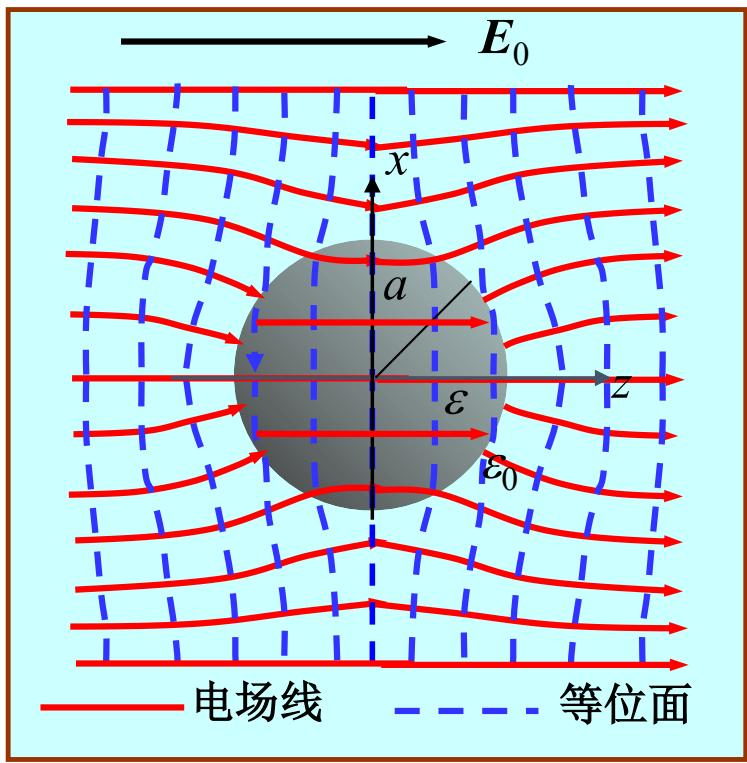
