# 第1章 场及其分析方法

# 主要内容:

1.1 物理量与场  
1.2 标量场分析  
1.3 矢量场分析

# 物理量与场

# 标量和矢量

标量：一个只用大小描述的物理量。

矢量：一个既有大小又有方向特性的物理量，常用黑体字母或带箭头的字母表示。

矢量的几何表示：一个矢量可用一条有方向的线段来表示

矢量的代数表示： $\vec{A} = \vec{e}_A A = \vec{e}_A |\vec{A}|$

矢量的大小或模： $A = |\vec{A}|$

矢量的单位矢量: $\vec{e}_{A} = \frac{\vec{A}}{A}$

常矢量：大小和方向均不变的矢量。

注意：单位矢量不一定是常矢量。

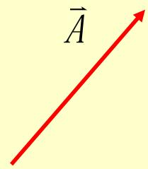

text_image

A⃗

矢量的几何表示

# 矢量代数

矢量用坐标分量表示

$$
\vec {A} = A _ {x} \vec {e} _ {x} + A _ {y} \vec {e} _ {y} + A _ {z} \vec {e} _ {z}
$$

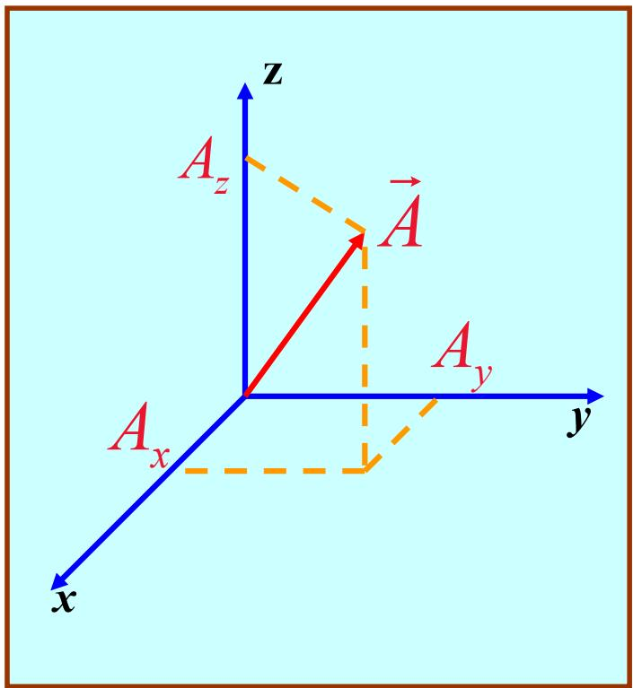

text_image

z
Az
A
Ax
Ay
y
x

$$
A _ {x} = A \cos \alpha
$$

$$
A _ {y} = A \cos \beta
$$

$$
A _ {z} = A \cos \gamma
$$

$$
\vec {A} = A (\vec {e} _ {x} \cos \alpha + \vec {e} _ {y} \cos \beta + \vec {e} _ {z} \cos \gamma)
$$

$$
\vec {e} _ {_ A} = \vec {e} _ {_ X} \cos \alpha + \vec {e} _ {_ Y} \cos \beta + \vec {e} _ {_ Z} \cos \gamma
$$

# 矢量代数

# 矢量的代数运算

# (1) 矢量的加减法

两矢量的加减在几何上是以这两矢量为邻边的平行四边形的对角线, 如图所示。

在直角坐标系中两矢量的加法和减法：

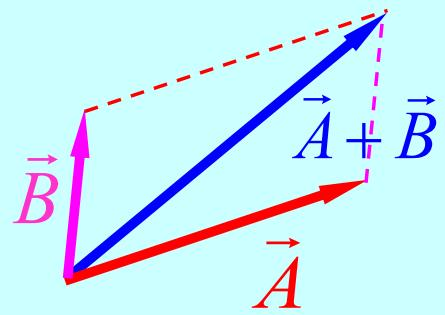

text_image

B
A + B
A

矢量的加法

$$
\vec {A} \pm \vec {B} = \vec {e} _ {x} (A _ {x} \pm B _ {x}) + \vec {e} _ {y} (A _ {y} \pm B _ {y}) + \vec {e} _ {z} (A _ {z} \pm B _ {z})
$$

矢量的加减符合交换律和结合律

交换律 $\vec{A}+\vec{B}=\vec{B}+\vec{A}$

结合律 $\vec{A}+(\vec{B}+\vec{C})=(\vec{A}+\vec{B})+\vec{C}$

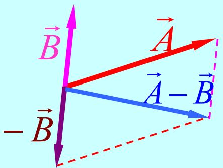

text_image

→
→
A
→
A - →
→
→
- →
→

矢量的减法

# 矢量代数

(2) 标量乘矢量

$$
k \vec {A} = \vec {e} _ {x} k A _ {x} + \vec {e} _ {y} k A _ {y} + \vec {e} _ {z} k A _ {z}
$$

(3) 矢量的标积（点积）

$$
\vec {A} \cdot \vec {B} = A B \cos \theta = A _ {x} B _ {x} + A _ {y} B _ {y} + A _ {z} B _ {z}
$$

$$
\vec {A} \cdot \vec {B} = \vec {B} \cdot \vec {A}
$$

——矢量的标积符合交换律

$$
\vec {A} \perp \vec {B} \Longrightarrow \vec {A} \cdot \vec {B} = 0
$$

$$
\vec {A} \mathbin {\text {/}} / \vec {B} \quad \Longrightarrow \vec {A} \cdot \vec {B} = A B
$$

$$
\vec {e} _ {x} \cdot \vec {e} _ {y} = \vec {e} _ {y} \cdot \vec {e} _ {z} = \vec {e} _ {z} \cdot \vec {e} _ {x} = 0
$$

$$
\vec {e} _ {x} \cdot \vec {e} _ {x} = \vec {e} _ {y} \cdot \vec {e} _ {y} = \vec {e} _ {z} \cdot \vec {e} _ {z} = 1
$$

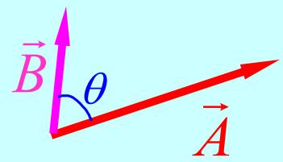

text_image

B
θ
A

矢量 $\vec{A}$ 与 $\vec{B}$ 的夹角

# 矢量代数

(4) 矢量的矢积（叉积） $\vec{A} \times \vec{B} = \vec{e}_{n} AB \sin \theta$

用坐标分量表示为

$$
\vec {A} \times \vec {B} = \vec {e} _ {x} (A _ {y} B _ {z} - A _ {z} B _ {y}) + \vec {e} _ {y} (A _ {z} B _ {x} - A _ {x} B _ {z}) + \vec {e} _ {z} (A _ {x} B _ {y} - A _ {y} B _ {x})
$$

写成行列式形式为

$$
\vec {A} \times \vec {B} = \left| \begin{array}{c c c} \vec {e} _ {x} & \vec {e} _ {y} & \overleftarrow {e} _ {z} \\ A _ {x} & A _ {y} & A _ {z} \\ B _ {x} & B _ {y} & B _ {z} \end{array} \right|
$$

$$
\vec {A} \times \vec {B} = - \vec {B} \times \vec {A}
$$

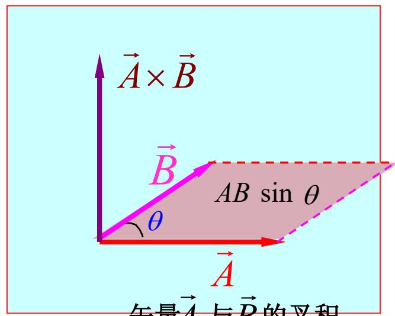

text_image

A×B
B
AB sin θ
θ
A
矢量A与B的叉积

矢量 $\vec{A}$ 与 $\vec{B}$ 的叉积

若 $\vec{A} \perp \vec{B}$ ，则 $|\vec{A} \times \vec{B}| = AB$

若 $\vec{A} / / \vec{B}$ ，则 $|\vec{A} \times \vec{B}| = 0$

# 矢量代数

# (5) 矢量的混合运算

$$
(\vec {A} + \vec {B}) \cdot \vec {C} = \vec {A} \cdot \vec {C} + \vec {B} \cdot \vec {C} - \text {分配律}
$$

$$
(\vec {A} + \vec {B}) \times \vec {C} = \vec {A} \times \vec {C} + \vec {B} \times \vec {C} - \text {分配律}
$$

$$
\vec {A} \cdot (\vec {B} \times \vec {C}) = \vec {B} \cdot (\vec {C} \times \vec {A}) = \vec {C} \cdot (\vec {A} \times \vec {B}) — — \text {标量三重积}
$$

$$
\vec {A} \times (\vec {B} \times \vec {C}) = (\vec {A} \cdot \vec {C}) \vec {B} - (\vec {A} \cdot \vec {B}) \vec {C} \quad — — \text {矢量三重积}
$$

# 常用正交坐标系

□ 三维空间任意一点的位置可通过三条相互正交曲线的交点来确定。  
☐ 三条正交曲线组成的确定三维空间任意点位置的体系，称为正交曲线坐标系；三条正交曲线称为坐标轴；描述坐标轴的量称为坐标变量。  
☐ 在电磁场与电磁波理论中，三种常用的正交曲线坐标系为：直角坐标系、圆柱坐标系和球面坐标系。

# 常用正交坐标系

# 直角坐标系

坐标变量 X, Y, Z

坐标单位矢量 $\vec{e}_{x}, \vec{e}_{y}, \vec{e}_{z}$

位置矢量 $\vec{r} = \vec{e}_x x + \vec{e}_y y + \vec{e}_z z$

线元矢量 $d\vec{l} = \vec{e}_{x}dx + \vec{e}_{y}dy + \vec{e}_{z}dz$

面元矢量 $\mathrm{d}\vec{S}_x = \vec{e}_x\mathrm{d}l_y\mathrm{d}l_z = \vec{e}_xdy\mathrm{d}z$

$$
\mathrm{d} \vec {S} _ {y} = \vec {e} _ {y} \mathrm{d} l _ {x} \mathrm{d} l _ {z} = \vec {e} _ {y} \mathrm{d} x \mathrm{d} z
$$

$$
\mathrm{d} \vec {S} _ {z} = \vec {e} _ {z} \mathrm{d} l _ {x} \mathrm{d} l _ {y} = \vec {e} _ {z} \mathrm{d} x \mathrm{d} y
$$

体积元 $\mathrm{d}V = \mathrm{d}x\mathrm{d}y\mathrm{d}z$

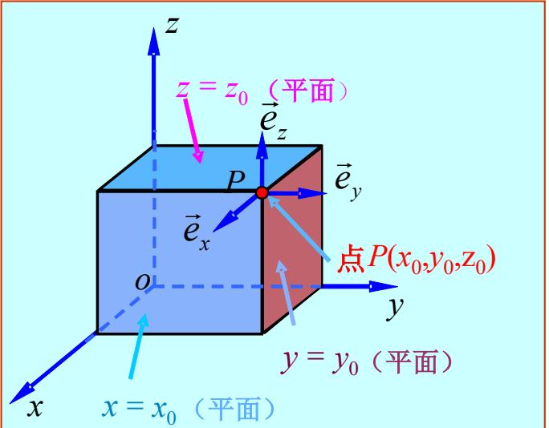

text_image

z
z = z₀ (平面)
e_z
P
e_y
e_x
点P(x₀,y₀,z₀)
y
y = y₀ (平面)
x = x₀ (平面)

直角坐标系

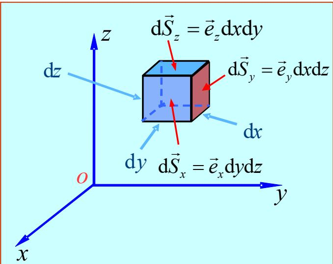

text_image

d\vec{S}_z = \vec{e}_z \mathrm{d}x \mathrm{d}y
d\vec{S}_y = \vec{e}_y \mathrm{d}x \mathrm{d}z
dz
dx
dy
d\vec{S}_x = \vec{e}_x \mathrm{d}y \mathrm{d}z
O
y
x

直角坐标系的长度元、面积元、体积元

# 常用正交坐标系

# 圆柱坐标系

- 坐标变量 $\rho, \varphi, z$   
- 坐标单位矢量 $\vec{e}_{\rho}, \vec{e}_{\varphi}, \vec{e}_{z}$

位置矢量 $\vec{r} = \vec{e}_{\rho}\rho + \vec{e}_{z}z$

\- 线元矢量 $\mathrm{d}\vec{l} = \vec{e}_{\rho}\mathrm{d}\rho +\vec{e}_{\varphi}\rho \mathrm{d}\varphi +\vec{e}_{z}\mathrm{d}z$

面元矢量 $\mathrm{d}S_{\rho} = \vec{e}_{\rho}\mathrm{d}l_{\varphi}\mathrm{d}l_{z} = \vec{e}_{\rho}\rho \mathrm{d}\varphi \mathrm{d}z$

$$
\mathrm{d} \vec {S} _ {\varphi} = \vec {e} _ {\varphi} \mathrm{d} l _ {\rho} \mathrm{d} l _ {z} = \vec {e} _ {\varphi} \mathrm{d} \rho \mathrm{d} z
$$

$$
\mathrm{d} \vec {S} _ {z} = \vec {e} _ {z} \mathrm{d} l _ {\rho} \mathrm{d} l _ {\varphi} = \vec {e} _ {z} \rho \mathrm{d} \rho \mathrm{d} \varphi
$$

体积元 $\mathrm{d}V = \rho \mathrm{d}\rho \mathrm{d}\varphi \mathrm{d}z$

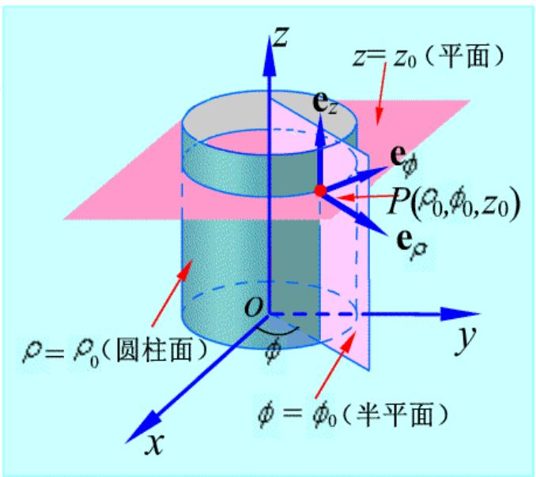

text_image

z=z₀(平面)
e_z
e_φ
P(ρ₀,φ₀,z₀)
e_ρ
O
y
ρ=ρ₀(圆柱面)
φ
φ=φ₀(半平面)
x

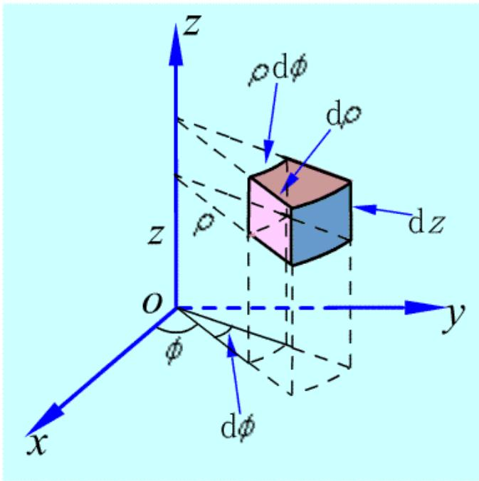

text_image

z
ρdφ
dφ
dz
z
O
y
φ
dφ
x

# 常用正交坐标系

# 球面坐标系

坐标变量 r, $\theta$ , $\varphi$

坐标单位矢量 $\vec{e}_r, \vec{e}_\theta, \vec{e}_\varphi$

位置矢量 $\vec{r} = \vec{e}_r r$

线元矢量 $\mathrm{d}\vec{l} = \vec{e}_r\mathrm{d}r + \vec{e}_\theta r\mathrm{d}\theta +\vec{e}_\varphi r\sin \theta \mathrm{d}\varphi$

面元矢量 $\mathrm{d}\vec{S}_r = \vec{e}_r\mathrm{d}l_\theta \mathrm{d}l_\varphi = \vec{e}_r r^2\sin \theta \mathrm{d}\theta \mathrm{d}\varphi$

$$
\mathrm{d} \vec {S} _ {\theta} = \vec {e} _ {\theta} \mathrm{d} l _ {r} \mathrm{d} l _ {\varphi} = \vec {e} _ {z} r \sin \theta \mathrm{d} r \mathrm{d} \varphi
$$

$$
\mathrm{d} \vec {S} _ {\varphi} = \vec {e} _ {\varphi} \mathrm{d} l _ {r} \mathrm{d} l _ {\theta} = \vec {e} _ {\varphi} r \mathrm{d} r \mathrm{d} \theta
$$

体积元 $\mathrm{d}V = r^2\sin \theta \mathrm{d}r\mathrm{d}\theta \mathrm{d}\varphi$

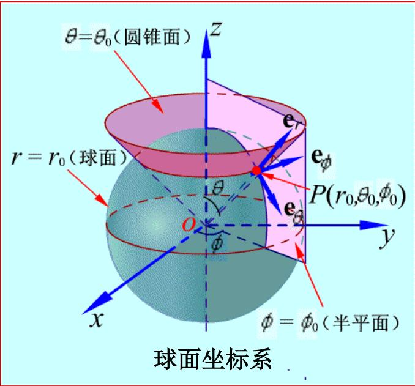

text_image

θ=θ₀(圆锥面)
r = r₀(球面)
z
eᵣ
eφ
P(r₀,θ₀,φ₀)
θ
eθ
y
x
φ = φ₀(半平面)
球面坐标系

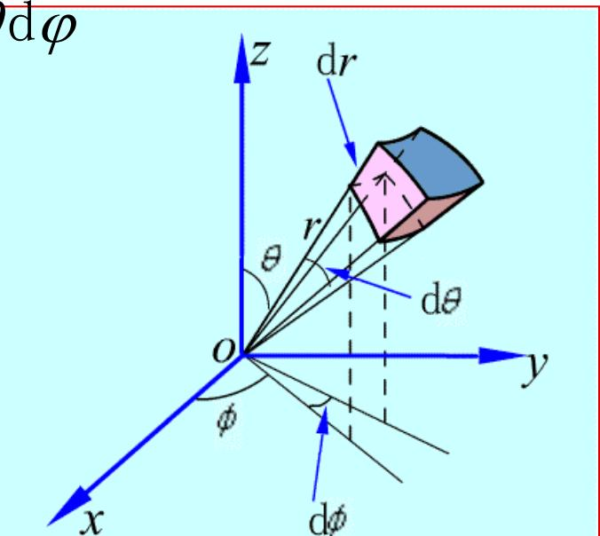

text_image

dφ
z
dr
r
θ
dθ
o
y
φ
x
dφ

球坐标系中的线元、面元和体积元

# 常用正交坐标系

坐标单位矢量之间的关系  
直角坐标与圆柱坐标系

<table><tr><td></td><td> $\vec{e}_x$ </td><td> $\vec{e}_y$ </td><td> $\vec{e}_z$ </td></tr><tr><td> $\vec{e}_\rho$ </td><td> $\cos\phi$ </td><td> $\sin\phi$ </td><td>0</td></tr><tr><td> $\vec{e}_\phi$ </td><td> $-\sin\phi$ </td><td> $\cos\phi$ </td><td>0</td></tr><tr><td> $\vec{e}_z$ </td><td>0</td><td>0</td><td>1</td></tr></table>

圆柱坐标与
球坐标系

<table><tr><td></td><td> $\vec{e}_{\rho}$ </td><td> $\vec{e}_{\phi}$ </td><td> $\vec{e}_{z}$ </td></tr><tr><td> $\vec{e}_{r}$ </td><td>sin θ</td><td>0</td><td>cos θ</td></tr><tr><td> $\vec{e}_{\theta}$ </td><td>cos θ</td><td>0</td><td>-sin θ</td></tr><tr><td> $\vec{e}_{\phi}$ </td><td>0</td><td>1</td><td>0</td></tr></table>

直角坐标与
球坐标系

<table><tr><td></td><td> $\vec{e}_x$ </td><td> $\vec{e}_y$ </td><td> $\vec{e}_z$ </td></tr><tr><td> $\vec{e}_r$ </td><td>sin θ cos φ</td><td>sin θ sin φ</td><td>cos θ</td></tr><tr><td> $\vec{e}_{\theta}$ </td><td>- cos θ sin φ</td><td>cos θ sin φ</td><td>- sin θ</td></tr><tr><td> $\vec{e}_{\phi}$ </td><td>- sin φ</td><td>cos φ</td><td>0</td></tr></table>

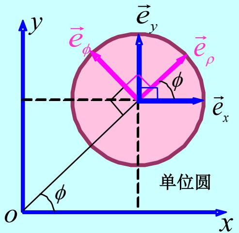

text_image

y
→eφ
→eγ
→eρ
φ
→eₓ
单位圆
φ
O
x

直角坐标系与柱坐标系之间
坐标单位矢量的关系

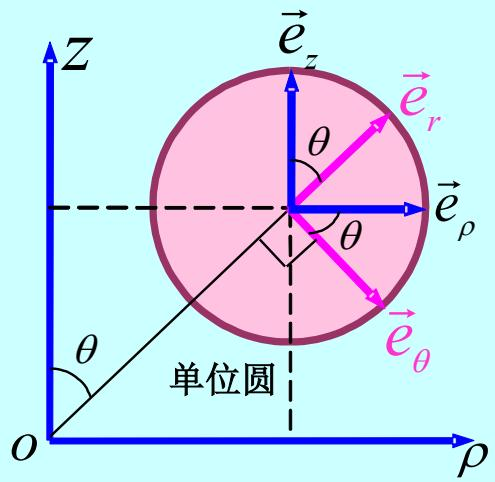

text_image

z
e_z
θ
e_r
θ
e_ρ
θ
e_θ
单位圆
O
ρ

柱坐标系与求坐标系之间坐标单位矢量的关系

# 矢量的运算

若： $\vec{A} = \vec{e}_xA_x + \vec{e}_yA_y + \vec{e}_zA_z$ $\vec{B} = \vec{e}_xB_x + \vec{e}_yB_y + \vec{e}_zB_z$

则： $\vec{A} \pm \vec{B} = \vec{e}_x(A_x \pm B_x) + \vec{e}_y(A_y \pm B_y) + \vec{e}_z(A_z \pm B_z)$

$$
\vec {A} \cdot \vec {B} = | \vec {A} | | \vec {B} | \cos \theta_ {A B} = A _ {x} B _ {x} + A _ {y} B _ {y} + A _ {z} B _ {z}
$$

$$
\vec {A} \times \vec {B} = \left| \begin{array}{c c c} \vec {e} _ {x} & \vec {e} _ {y} & \vec {e} _ {z} \\ A _ {x} & A _ {y} & A _ {z} \\ B _ {x} & B _ {y} & B _ {z} \end{array} \right|
$$

$$
= \vec {e} _ {x} (A _ {y} B _ {z} - A _ {z} B _ {y}) + \vec {e} _ {y} (A _ {z} B _ {x} - A _ {x} B _ {z}) + \vec {e} _ {z} (A _ {x} B _ {y} - A _ {y} B _ {x})
$$

说明：矢量间不存在除法运算。

# 矢量的运算

# 注意几个问题:

1. 矢量与标量不能相等;  
2. 两矢量标积(点积)结果为标量;   
3. 两矢量矢积(叉积)结果为矢量, 并且该矢量垂直于原来两个矢量组成的平面;  
4. 两矢量作乘法, 中间必须有符号;  
5. 两矢量的夹角: $0 \leq \theta \leq \pi$

# 标量场分析

# 标量场和矢量场

确定空间区域上的每一点都有确定物理量与之对应，称在该区域上定义了一个场。

☐ 如果物理量是标量，称该场为标量场。

例如：温度场、电位场、高度场等。

☐ 如果物理量是矢量，称该场为矢量场。

例如：流速场、重力场、电场、磁场等。

☐ 如果场与时间无关，称为静态场，反之为时变场。从数学上看，场是定义在空间区域上的函数：

静态标量场和矢量场可分别表示为： $u(x,y,z)$ $\vec{F}(x,y,z)$

时变标量场和矢量场可分别表示为: $u(x,y,z,t)\quad\vec{F}(x,y,z,t)$

# 标量场分析

# 标量场的等值面

等值面：标量场取得同一数值的点在空间形成的曲面

意义：形象直观地描述了物理量在空间的分布状态。

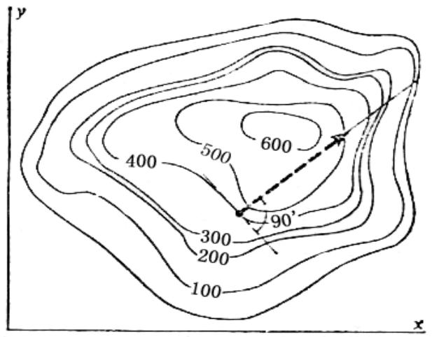

contour

| Contour Value |
|---------------|
| 600           |
| 500           |
| 400           |
| 300           |
| 200           |
| 100           |

标量场的等值线(面)

等值面方程： $u(x,y,z) = C$

等值面的特点：

- 常数C 取一系列不同的值，就得到一系列不同的等值面，形成等值面族；  
- 标量场的等值面充满场所在的整个空间；  
- 标量场的等值面互不相交。

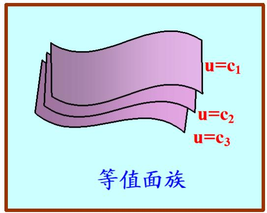

text_image

u=c₁
u=c₂
u=c₃
等值面族

概念: $\left.\frac{\partial u}{\partial l}\right|_{M_0} = \lim_{\Delta l \to 0} \frac{\Delta u}{\Delta l} = \frac{\partial u}{\partial x} \cos \alpha + \frac{\partial u}{\partial y} \cos \beta + \frac{\partial u}{\partial z} \cos \gamma$

式中： $\cos\alpha\quad\cos\beta\quad\cos\gamma$ —— $\Delta\vec{l}$ 的方向余弦。

意义：方向性导数表示场沿某方向的空间变化率。

- $\frac{\partial u}{\partial l} > 0$ —— $\mathbf{u}(\mathbb{M})$ 沿 $\vec{l}$ 方向增加；  
- $\frac{\partial u}{\partial l} < 0$ —— u(M) 沿 $\vec{l}$ 方向减小；  
- $\frac{\partial u}{\partial l} = 0$ —— $u(M)$ 沿 $\vec{l}$ 方向无变化。

特点: 方向性导数既与点Mo有关, 也与 $\vec{l}$ 方向有关。

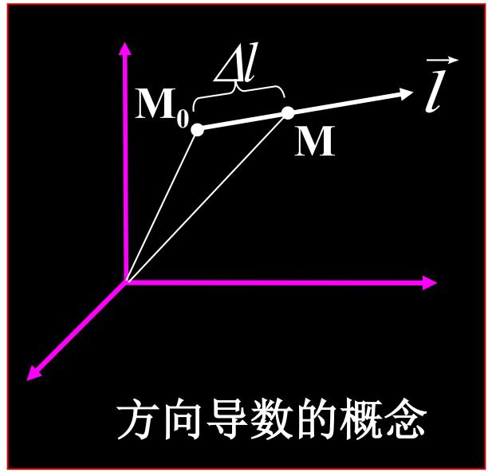

text_image

M₀
Δl
M
l
方向导数的概念

问题：在什么方向上变化率最大、其最大的变化率为多少？

# 标量场分析

标量场 $u(x,y,z,)$ 在P点的梯度是一个矢量

大小：最大方向性导数
方向：最大方向性导数所在的方向

直角坐标系中的梯度公式： $\operatorname{grad} u = \frac{\partial u}{\partial x} \vec{e}_x + \frac{\partial u}{\partial y} \vec{e}_y + \frac{\partial u}{\partial z} \vec{e}_z = \nabla u$

◇ 由方向性导数的定义可知：沿等值面法线 $e_{n}$ 的方向性导数最大。

故 $\operatorname{grad} u = \vec{e}_{n} \frac{\partial u}{\partial n}$ 可得 $\frac{\partial u}{\partial l} = \operatorname{grad} u \cdot \vec{e}_{l} \Rightarrow \left\{ \begin{aligned} & \frac{\partial u}{\partial x} = \operatorname{grad} u \cdot \vec{e}_{x} \\ & \frac{\partial u}{\partial y} = \operatorname{grad} u \cdot \vec{e}_{y} \\ & \frac{\partial u}{\partial z} = \operatorname{grad} u \cdot \vec{e}_{z} \end{aligned} \right.$

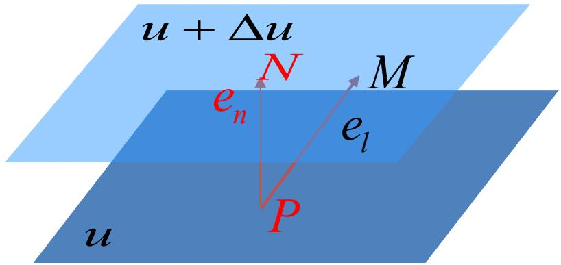

text_image

u + \u03b4u
N
e_n
M
e_l
P
u

# 标量场分析

# 梯度的运算

直角坐标系中

$$
g r a d u = \frac {\partial u}{\partial x} \vec {e} _ {x} + \frac {\partial u}{\partial y} \vec {e} _ {y} + \frac {\partial u}{\partial z} \vec {e} _ {z}
$$

$$
= (\frac {\partial}{\partial x} \vec {e} _ {x} + \frac {\partial}{\partial y} \vec {e} _ {y} + \frac {\partial}{\partial z} \vec {e} _ {z}) u = \nabla u
$$

柱面坐标系中

$$
\nabla u = \frac {\partial u}{\partial r} \vec {e} _ {r} + \frac {1}{r} \frac {\partial u}{\partial \varphi} \vec {e} _ {\varphi} + \frac {\partial u}{\partial z} \vec {e} _ {z}
$$

球面坐标系中

$$
\nabla u = \frac {\partial u}{\partial r} \vec {e} _ {r} + \frac {1}{r} \frac {\partial u}{\partial \theta} \vec {e} _ {\theta} + \frac {1}{r \sin \theta} \frac {\partial u}{\partial \varphi} \vec {e} _ {\varphi}
$$

# 标量场分析

☐ 梯度的重要性质 $\nabla \times \nabla u \equiv 0$ → 标量场的梯度的旋度恒等于零。

证明：左边 $= (\frac{\partial}{\partial x}\vec{e}_x + \frac{\partial}{\partial y}\vec{e}_y + \frac{\partial}{\partial z}\vec{e}_z)\times [\frac{\partial u}{\partial x}\vec{e}_x + \frac{\partial u}{\partial z} y\vec{e}_y + \frac{\partial u}{\partial z}\vec{e}_z]$

$$
= [ (\frac {\partial^ {2} u}{\partial y \partial z} - \frac {\partial^ {2} u}{\partial z \partial y}) \vec {e} _ {x} + (\frac {\partial^ {2} u}{\partial z \partial x} - \frac {\partial^ {2} u}{\partial x \partial z}) \vec {e} _ {y} + (\frac {\partial^ {2} u}{\partial x \partial y} - \frac {\partial^ {2} u}{\partial y \partial x}) \vec {e} _ {z} ]
$$

$$
= 0
$$

□ 梯度的物理意义

(1) 标量场的梯度是一个矢量, 是空间坐标点的函数;  
(2) 梯度的大小为该点标量函数 $\mathcal{U}$ 的最大变化率，即该点最大方向导数；  
(3) 梯度的方向为该点最大方向导数的方向, 即与等值线（面）相垂直的方向, 它指向函数的增加方向.

# 标量场分析

# 举例：电位场的梯度

- 与过该点的等位线垂直；  
- 数值等于该点的最大方向导数；  
- 指向电位增加的方向。

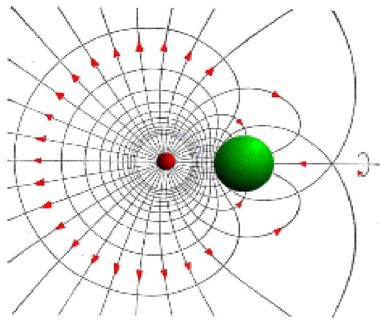

natural_image

Diagram showing magnetic field lines around a central green sphere, with red arrows indicating direction (no text or labels)

# 标量场分析

例1设一标量函数 $\varphi (x,y,z) = x^{2} + y^{2} - z$ 描述了空间标量场。试求：

(1) 该函数 $\varphi$ 在点 $P(1,1,1)$ 处的梯度，以及表示该梯度方向的单位矢量；  
(2) 求该函数 $\varphi$ 沿单位矢量 $\vec{e}_{l} = \vec{e}_{x} \cos 60^{\circ} + \vec{e}_{y} \cos 45^{\circ} + \vec{e}_{z} \cos 60^{\circ}$ 方向的方向导数，并以点 $P(1,1,1)$ 处的方向导数值与该点的梯度值作以比较，得出相应结论。

解 (1)由梯度计算公式, 可求得P点的梯度为

$$
\begin{array}{l} \left. \nabla \varphi \right| _ {P} = \left[ (\vec {\boldsymbol {e}} _ {x} \frac {\partial}{\partial x} + \vec {\boldsymbol {e}} _ {y} \frac {\partial}{\partial y} + \vec {\boldsymbol {e}} _ {z} \frac {\partial}{\partial z}) (x ^ {2} + y ^ {2} - z) \right] _ {P} \\ = (\vec {e} _ {x} 2 x + \vec {e} _ {y} 2 y - \vec {e} _ {z}) \Big | _ {(1, 1, 1)} = \vec {e} _ {x} 2 + \vec {e} _ {y} 2 - \vec {e} _ {z} \\ \end{array}
$$

# 标量场分析

表征其方向的单位矢量

$$
\left. \vec {e} _ {l} \right| _ {P} = \frac {\nabla \varphi}{| \nabla \varphi |} \bigg | _ {P} = \frac {\vec {e} _ {x} 2 x + \vec {e} _ {y} 2 y - \vec {e} _ {z}}{\sqrt {(2 x) ^ {2} + (2 y) ^ {2} + (- 1) ^ {2}}} \bigg | _ {(1, 1, 1)} = \vec {e} _ {x} \frac {2}{3} + \vec {e} _ {y} \frac {2}{3} - \vec {e} _ {z} \frac {1}{3}
$$

2）由方向导数与梯度之间的关系式可知，沿 $e_{l}$ 方向的方向导数为

$$
\frac {\partial \varphi}{\partial l} = \nabla \varphi \bullet \vec {e} _ {l} = (\vec {e} _ {x} 2 x + \vec {e} _ {y} 2 y - \vec {e} _ {z}) \bullet (\vec {e} _ {x} \frac {1}{2} + \vec {e} _ {y} \frac {\sqrt {2}}{2} + \vec {e} _ {z} \frac {1}{2})
$$

$$
= x + \sqrt {2} y - \frac {1}{2}
$$

对于给定的P点，上述方向导数在该点取值为

$$
\left. \frac {\partial \varphi}{\partial l} \right| _ {P} = x + \sqrt {2} y - \frac {1}{2} \bigg | _ {(1, 1, 1)} = \frac {1 + 2 \sqrt {2}}{2}
$$

# 标量场分析

而该点的梯度值为

$$
\left| \nabla \varphi \right| _ {P} = \sqrt {(2 x) ^ {2} + (2 y) ^ {2} + (- 1) ^ {2}} \Bigg | _ {(1, 1, 1)} = 3
$$

显然，梯度 $\left|\nabla\varphi\right|_{P}$ 描述了P点处标量函数 $\varphi$ 的最大变化率，即最大的方向导数，故 $\left.\frac{\partial\varphi}{\partial l}\right|_{P}<\left|\nabla\varphi\right|_{P}$ 恒成立。

例1.3.1 已知 $\pmb{R} = \pmb{e}_x(x - x') + \pmb{e}_y(y - y') + \pmb{e}_z(z - z')$ , $R = |\pmb{R}|$ 。证明：

(1) $\nabla R = \frac{R}{R}$ ; (2) $\nabla \left(\frac{1}{R}\right) = -\frac{R}{R^3}$ ; (3) $\nabla f(R) = -\nabla'f(R)$ 。

其中： $\nabla=e_{x}\frac{\partial}{\partial x}+e_{y}\frac{\partial}{\partial y}+e_{z}\frac{\partial}{\partial z}$ 表示对 x、y、z 的运算， $\nabla^{\prime}=e_{x}\frac{\partial}{\partial x^{\prime}}+e_{y}\frac{\partial}{\partial y^{\prime}}+e_{z}\frac{\partial}{\partial z^{\prime}}$ 表示对 $x^{\prime}$ 、 $y^{\prime}$ 、 $z^{\prime}$ 的运算。

解：(1) 将 $R = |\mathbf{R}| = \sqrt{(x - x')^2 + (y - y')^2 + (z - z')^2}$ 代入式(1.3.7)，得

$$
\begin{array}{l} \nabla R = \boldsymbol {e} _ {x} \frac {\partial R}{\partial x} + \boldsymbol {e} _ {y} \frac {\partial R}{\partial y} + \boldsymbol {e} _ {z} \frac {\partial R}{\partial z} \\ = \frac {e _ {x} (x - x ^ {\prime}) + e _ {y} (y - y ^ {\prime}) + e _ {z} (z - z ^ {\prime})}{\sqrt {(x - x ^ {\prime}) ^ {2} + (y - y ^ {\prime}) ^ {2} + (z - z ^ {\prime}) ^ {2}}} = \frac {R}{R} \\ \end{array}
$$

# 标量场及其梯度

(2) 将 $\frac{1}{R} = \frac{1}{\sqrt{(x - x')^2 + (y - y')^2 + (z - z')^2}}$ 代入式(1.3.7)，得

$$
\nabla \left(\frac {1}{R}\right) = e _ {x} \frac {\partial}{\partial x} \left(\frac {1}{R}\right) + e _ {y} \frac {\partial}{\partial y} \left(\frac {1}{R}\right) + e _ {z} \frac {\partial}{\partial z} \left(\frac {1}{R}\right)
$$

$$
= - \frac {\mathbf {e} _ {x} (x - x ^ {\prime}) + \mathbf {e} _ {y} (y - y ^ {\prime}) + \mathbf {e} _ {z} (z - z ^ {\prime})}{[ \sqrt {(x - x ^ {\prime}) ^ {2} + (y - y ^ {\prime}) ^ {2} + (z - z ^ {\prime}) ^ {2}} ] ^ {3}} = - \frac {\mathbf {R}}{R ^ {3}}
$$

# 标量场及其梯度

(3) 根据梯度的运算公式(1.3.7), 得到

$$
\begin{array}{l} \nabla f (R) = \boldsymbol {e} _ {x} \frac {\partial f (R)}{\partial x} + \boldsymbol {e} _ {y} \frac {\partial f (R)}{\partial y} + \boldsymbol {e} _ {z} \frac {\partial f (R)}{\partial z} \\ = \boldsymbol {e} _ {x} \frac {\mathrm{d} f (R)}{\mathrm{d} R} \frac {\partial R}{\partial x} + \boldsymbol {e} _ {y} \frac {\mathrm{d} f (R)}{\mathrm{d} R} \frac {\partial R}{\partial y} + \boldsymbol {e} _ {z} \frac {\mathrm{d} f (R)}{\mathrm{d} R} \frac {\partial R}{\partial z} \\ = \frac {\mathrm{d} f (R)}{\mathrm{d} R} \nabla R = \frac {\mathrm{d} f (R)}{\mathrm{d} R} \frac {R}{R} \\ \end{array}
$$

(3) 根据梯度的运算公式(1.3.7), 得到

# 标量场及其梯度

同理

$$
\begin{array}{l} \nabla^ {\prime} f (R) = \frac {\mathrm{d} f (R)}{\mathrm{d} R} \nabla^ {\prime} R \\ = \frac {\mathrm{d} f (R)}{\mathrm{d} R} \frac {- e _ {x} \left(x - x ^ {\prime}\right) - e _ {y} \left(y - y ^ {\prime}\right) - e _ {z} \left(z - z ^ {\prime}\right)}{\sqrt {(x - x ^ {\prime}) ^ {2} + (y - y ^ {\prime}) ^ {2} + (z - z ^ {\prime}) ^ {2}}} \\ = - \frac {\mathrm{d} f (R)}{\mathrm{d} R} \frac {R}{R} \\ \end{array}
$$

故得

$$
\nabla f (R) = - \nabla^ {\prime} f (R)
$$

在电磁场中,通常以 $(x',y',z')$ 表示源点的坐标,以 $(x,y,z)$ 表示场点的坐标,因此上述运算结果在电磁场中非常有用。

# 矢量线

概念：矢量线是这样的曲线，其上每一点的切线方向代表了该点矢量场的方向。

意义：形象直观地描述了矢量场的空间分布状态。

矢量线方程:

$$
\frac {\mathrm{d} x}{F _ {x} (x , y , z)} = \frac {\mathrm{d} y}{F _ {y} (x , y , z)} = \frac {\mathrm{d} z}{F _ {z} (x , y , z)}
$$

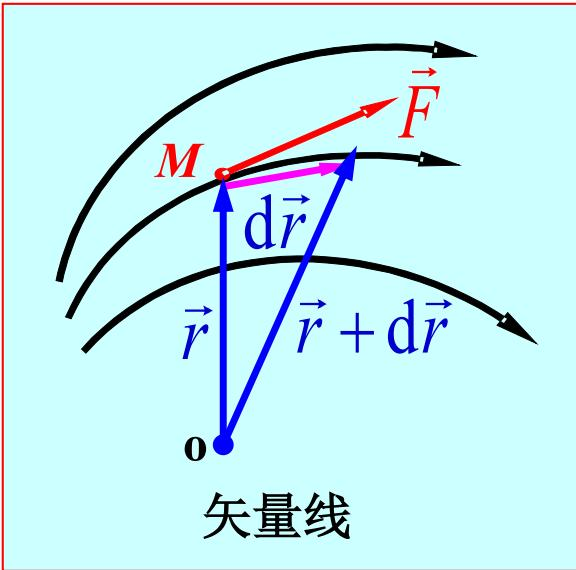

text_image

M
F
d r⃗
r⃗ + d r⃗
0
矢量线

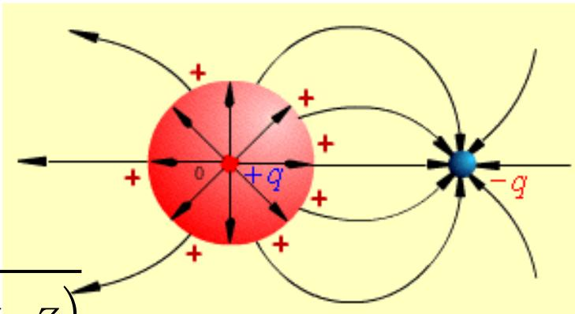

text_image

Diagram illustrating electric field lines around a positive and negative point charge, with labeled charges and directional arrows.

矢量线图

力线上任意点的切线方向必定与该点的矢量方向相同。

$$
\overrightarrow {F} (\vec {r}) \times \frac {d \vec {r}}{d l} = 0
$$

$$
\overrightarrow {F} (\vec {r}) \times d \vec {r} = 0
$$

在直角坐标系内可以表示为:

$$
\frac {\mathrm{d} x}{F _ {x} (\vec {r})} = \frac {\mathrm{d} y}{F _ {y} (\vec {r})} = \frac {\mathrm{d} z}{F _ {z} (\vec {r})}
$$

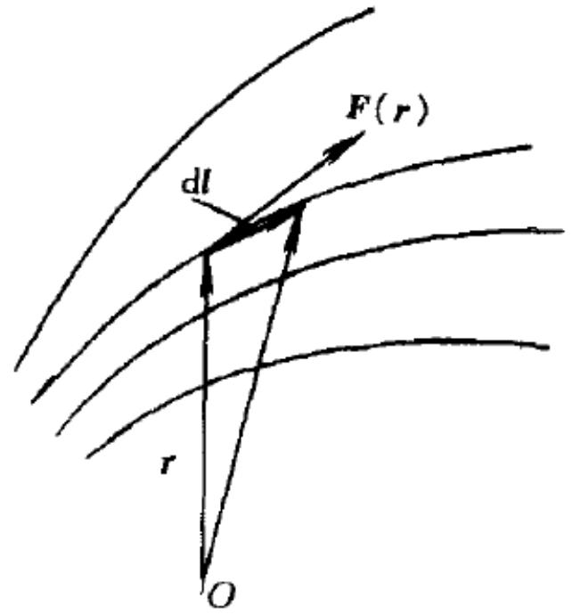

text_image

F(r)
dl
r
O

矢量线的疏密表征矢量场的大小  
矢量线上每点的切向代表该处矢量场的方向

例2 有一个二维矢量场 $\vec{F} (\vec{r}) = \vec{F}(x,y) = \vec{e}_x(-y) + \vec{e}_y(x)$

求力线方程，并定性绘制该矢量场图形。

解：由 $-\frac{dx}{y}=\frac{dy}{x}$ 或 -xdx=ydy

两边积分得到： $x^{2} + y^{2} = C^{2}$

上式为圆方程, $C^2$ 为积分常数,

$$
\vec {F} (\vec {r}) = \vec {e} _ {r} F (\vec {r}), \text {而大小为} F (\vec {r}) = \sqrt {x ^ {2} + y ^ {2}}
$$

矢量场的单位矢量：

$$
\vec {e} = \vec {e} _ {x} \cos \alpha + \vec {e} _ {y} \cos \phi = \vec {e} _ {x} \frac {- y}{r} + \vec {e} _ {y} \frac {x}{r}
$$

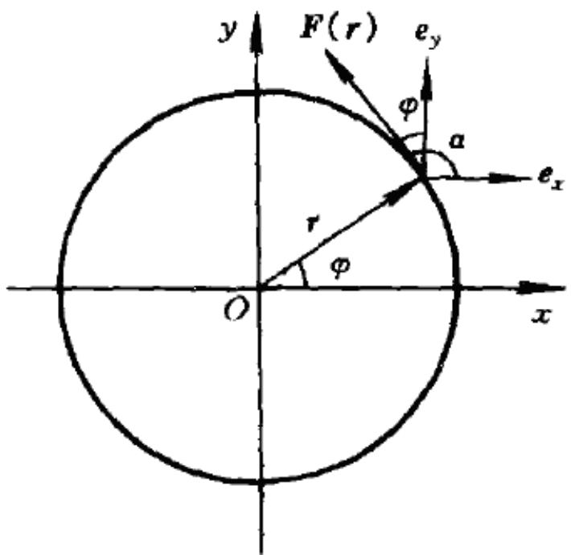

text_image

y
F(r) e_y
φ
a
e_x
r
φ
O
x

图 1.2.1 $F(r)$ 的力线

# 矢量场的通量

问题：如何定量描述矢量场的大小？引入通量的概念。

通量的概念: $\psi = \int d\psi = \int_{S} \vec{F} \cdot d\vec{S} = \int_{S} \vec{F} \cdot \vec{e}_{n} dS$ 其中： $d\vec{S}=\vec{e}_{n}dS$ ——面积元矢量；

$\vec{e}_{n}$ ——面积元的法向单位矢量；

$\mathrm{d}\psi = \vec{F} \cdot \vec{e}_n \mathrm{~d}S$ 穿过面积元 $\mathrm{d}\vec{S}$ 的通量；

如果曲面 S 是闭合的，则规定曲面法矢由闭合曲面内指向外，矢量场对闭合曲面的通量是：

$$
\psi = \oint_ {S} \vec {F} \cdot \mathrm{d} \vec {S} = \oint_ {S} \vec {F} \cdot \vec {e} _ {n} \mathrm{d} S
$$

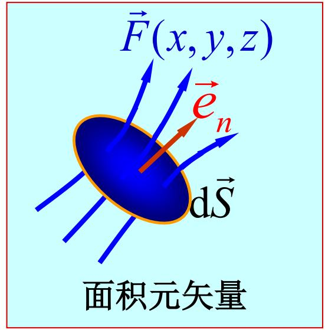

text_image

F(x,y,z)
e_n
dS
面积元矢量

# 通量的物理意义

# 矢量场通过闭合曲面通量的三种可能结果

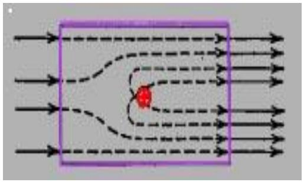

natural_image

Diagram showing parallel arrows entering a rectangular boundary with a central red object, no text or symbols present

$$
\psi > 0
$$

通过闭合曲面有净的矢量线穿出

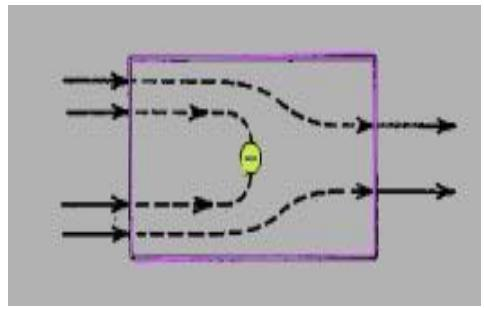

flowchart

```mermaid
graph TD
    A["Input"] --> B["Process"]
    C["Input"] --> B
    D["Input"] --> B
    B --> E["Output"]
    F["Decision Node"] --> G["Feedback Loop"]
    G --> B
    style F fill:#ffcccc,stroke:#333
```

$$
\psi <   0
$$

有净的矢量线进入

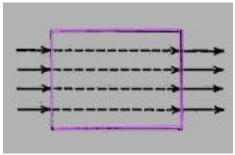

natural_image

Diagram showing parallel dashed arrows entering a rectangular frame (no text or symbols)

$$
\psi = 0
$$

进入与穿出闭合曲面的矢量线相等

闭合曲面的通量从宏观上建立了矢量场通过闭合曲面的通量与曲面内产生矢量场的源的关系。

# 思考:矢量场为什么讨论散度问题?

矢量场的通量讨论了一定曲面所包围的体积内场的性质, 要讨论空间中每一点场的性质, 必须引入散度的概念。

# 散度

如果包围点P 的闭合面 $\Delta S$ 所围区域 $\Delta\tau$ 以任意方式缩小为点P 时，通量与体积之比的极限存在，定义该极限为矢量场A（教材为矢量F）在P 点的散度。即 $\oint\vec{A}\cdot d\vec{S}$

$$
\operatorname{div} \vec {A} = \lim _ {\Delta \tau \rightarrow 0} \frac {\oint_ {s} \vec {A} \cdot \mathrm{d} \vec {S}}{\Delta \tau}
$$

它表示了从该点单位面积内散发出来的A(r)的通量。

左右一对表面传出的净通量：

$$
- A _ {y} \Delta z \Delta x + (A _ {y} + \frac {\partial A _ {y}}{\partial y} \Delta y) \Delta z \Delta x = \frac {\partial A _ {y}}{\partial y} \Delta x \Delta y \Delta z
$$

上下一对表面传出的净通量：

$$
- A _ {z} \Delta x \Delta y + (A _ {z} + \frac {\partial A _ {z}}{\partial z} \Delta z) \Delta x \Delta y = \frac {\partial A _ {z}}{\partial z} \Delta x \Delta y \Delta z
$$

前后一对表面传出的净通量：

$$
- A _ {x} \Delta y \Delta z + (A _ {x} + \frac {\partial A _ {x}}{\partial x} \Delta x) \Delta y \Delta z = \frac {\partial A _ {x}}{\partial x} \Delta x \Delta y \Delta z
$$

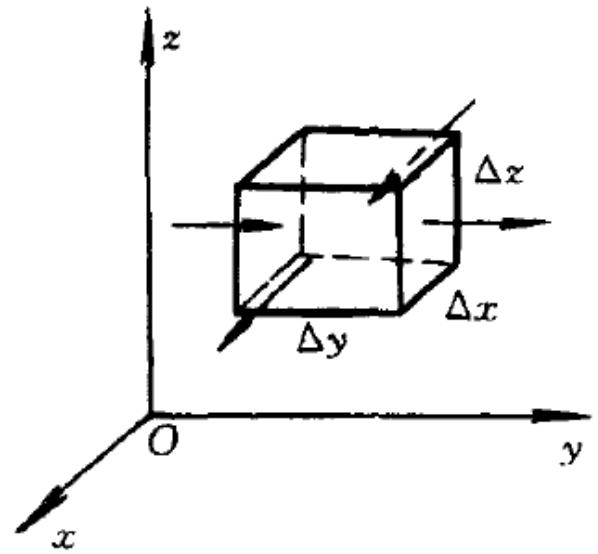

text_image

z
Δx
Δy
O
y
x

图 1.3.3 直角坐标内计算 divA

$$
\lim _ {\Delta \tau \rightarrow 0} \frac {\oint_ {s} \vec {A} \cdot \mathrm{d} \vec {S}}{\Delta \tau} = \frac {\partial A _ {x}}{\partial \mathbf {x}} + \frac {\partial A _ {y}}{\partial \mathbf {y}} + \frac {\partial A _ {z}}{\partial \mathbf {z}}
$$

$$
d i v \vec {A} = \frac {\partial A _ {x}}{\partial x} + \frac {\partial A _ {y}}{\partial y} + \frac {\partial A _ {z}}{\partial z}
$$

哈密顿算符： $\nabla = \vec{e}_x\frac{\partial}{\partial x} +\vec{e}_y\frac{\partial}{\partial y} +\vec{e}_z\frac{\partial}{\partial z}$

$$
\left(\vec {e} _ {x} \frac {\partial}{\partial x} + \vec {e} _ {y} \frac {\partial}{\partial y} + \vec {e} _ {z} \frac {\partial}{\partial z}\right) \cdot \left(\vec {e} _ {x} A _ {x} + \vec {e} _ {y} A _ {y} + \vec {e} _ {z} A _ {z}\right)
$$

$$
= \nabla \cdot \vec {A} = d i v \vec {A}
$$

直角坐标系中的散度计算公式：

$$
\operatorname{div} \vec {A} = \nabla \cdot \vec {A} = \frac {\partial A _ {x}}{\partial \mathbf {x}} + \frac {\partial A _ {y}}{\partial \mathbf {y}} + \frac {\partial A _ {z}}{\partial \mathbf {z}}
$$

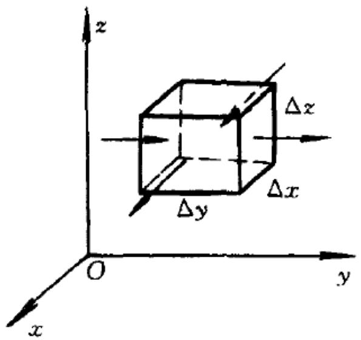

text_image

z
Δz
Δx
Δy
O
y
x

圆柱坐标系下:

$$
\nabla = (\vec {e} _ {r} \frac {\partial}{\partial r} + \vec {e} _ {\varphi} \frac {1}{r} \frac {\partial}{\partial \varphi} + \vec {e} _ {z} \frac {\partial}{\partial z})
$$

$$
\nabla \bullet \vec {A} (\vec {r}) = \frac {1}{r} \frac {\partial (r A _ {r})}{\partial r} + \frac {1}{r} \frac {\partial A _ {\varphi}}{\partial \varphi} + \frac {\partial A _ {z}}{\partial z}
$$

球面坐标系下:

$$
\nabla = (\vec {e} _ {r} \frac {\partial}{\partial r} + \vec {e} _ {\theta} \frac {1}{r} \frac {\partial}{\partial \theta} + \vec {e} _ {\varphi} (\frac {1}{r \sin \theta}) \frac {\partial}{\partial \varphi})
$$

$$
\nabla \bullet \vec {A} (\vec {r}) = \frac {1}{r ^ {2}} \frac {\partial}{\partial r} (r ^ {2} A _ {r}) + \frac {1}{r \sin \theta} \frac {\partial}{\partial \theta} (\sin \theta A _ {\theta}) + \frac {1}{r \sin \theta} \frac {\partial A _ {\varphi}}{\partial \varphi}
$$

# 散度的物理意义

✿ 矢量的散度是一个标量，是空间坐标点的函数。  
✿ 散度代表矢量场的通量源的分布特性。  
✿ 矢量场的散度值表征空间中通量源的密度

$$
\nabla \cdot \vec {A} = 0 (\text {无源})
$$

$$
\nabla \cdot \vec {A} = \rho > 0 \quad (\text {正源})
$$

$$
\nabla \cdot \vec {A} = - \rho <   0 (\text { 负   源 })
$$

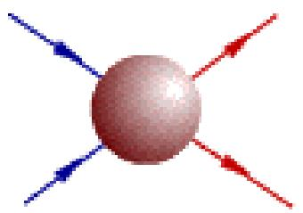

natural_image

Diagram showing a central red sphere with four outward-pointing arrows pointing outward (no text or symbols)

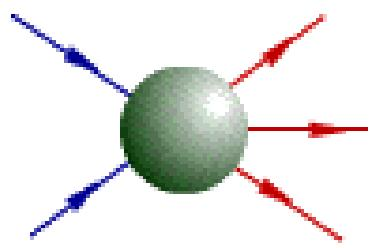

natural_image

Simple diagram of a green sphere with four red arrows pointing outward from its center, surrounded by blue directional arrows (no text or symbols)

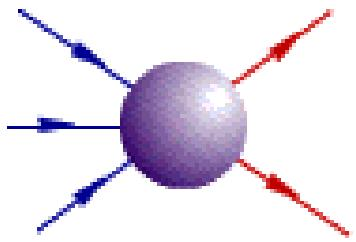

natural_image

Diagram of a sphere with four directional arrows pointing outward from its center, no text or symbols present.

在矢量场中，若 $\nabla\cdot A=\rho\neq0$ ，称之为有源场， $\rho$ 称为(通量)源密度；若矢量场中处处 $\nabla\cdot A=0$ ，称之为无源场。

# 高斯定理(散度定理)

$$
\operatorname{div} \vec {A} = \lim _ {\Delta \tau \rightarrow 0} \frac {1}{\Delta \tau} \oint_ {S} \vec {A} \cdot \mathrm{d} \vec {S}
$$

$$
\operatorname{div} \vec {A} \Delta \tau = \lim _ {\Delta \tau \rightarrow 0} \oint_ {S} \vec {A} \cdot \mathrm{d} \vec {S}
$$

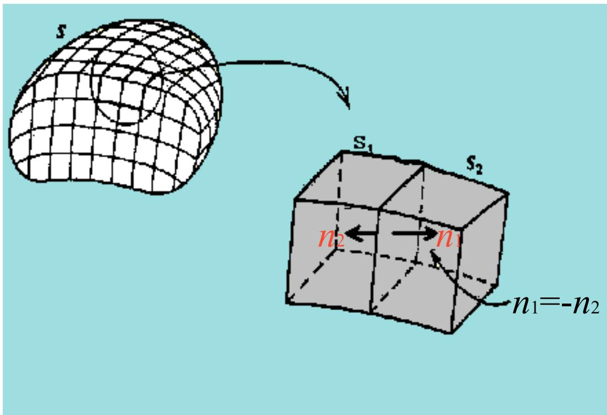

text_image

S
S₁ S₂
n₂ n₁
n₁=-n₂

对于有限大体积 $\tau$ ，可将其按如图方式进行分割，对每一小体积元有：

$$
\operatorname{div} \vec {A} \Delta \tau_ {1} = \oint_ {S _ {1}} \vec {A} \cdot \mathrm{d} \vec {S} _ {1}
$$

$$
\operatorname{div} \vec {A} \Delta \tau_ {2} = \oint_ {S _ {2}} \vec {A} \cdot \mathrm{d} \vec {S} _ {2}
$$

●
●
●

$$
+)
$$

$$
\int_ {V} \operatorname{div} \vec {A} \mathrm{d} \tau = \oint_ {S} \vec {A} \cdot \mathrm{d} \vec {S}
$$

高斯定理

$$
\oint_ {S} \vec {A} \cdot \mathrm{d} \vec {S} = \int_ {v} \operatorname{div} \vec {A} \mathrm{d} \tau = \int_ {v} \nabla \cdot \vec {A} \mathrm{d} \tau
$$

式中S 为 $\tau$ 的外表面

闭合曲面积分与体积分之间的一个变换关系，在电磁理论中有着广泛的应用。

例题：已知矢量场的表达式为 $\vec{A}(\vec{r}) = \vec{r}$

计算它穿过一个球心在原点, 半径为a的球面的通量, 并计算该矢量场的散度。

解：根据通量公式

$$
\begin{array}{l} \oint_ {s} \vec {A} (\vec {r}) \cdot d \vec {S} = \oint_ {s} \vec {r} \cdot d \vec {S} \\ = \oint_ {S} r d S \cos 0 ^ {0} = \oint_ {S} r d S \\ \end{array}
$$

积分变元ds只在球面上移动,而r是矢量场在球面上的取值,

因此与积分变元无关, 可以从积分中提出来, 即:

$$
= r \oint_ {s} d S = a \oint_ {s} d S = a \times 4 \pi a ^ {2} = 4 \pi a ^ {3}
$$

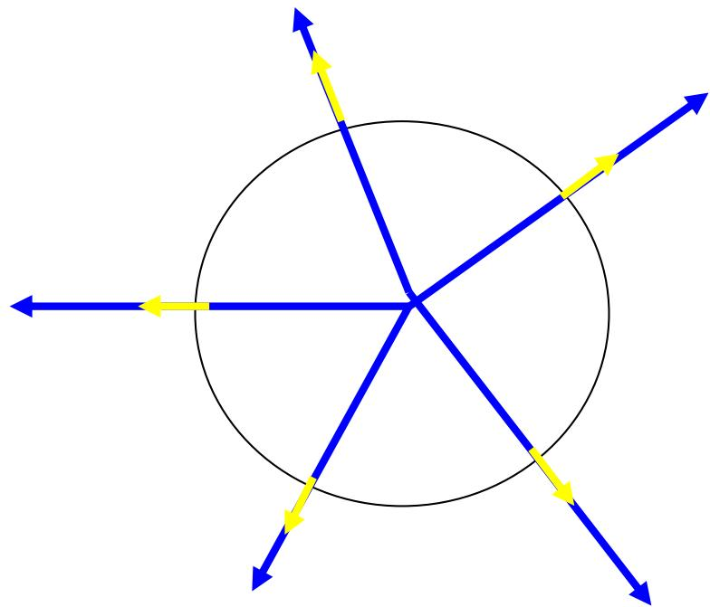

natural_image

Diagram showing four blue arrows pointing outward from a black circle, with yellow arrows indicating direction (no text or symbols)

该矢量场的散度, 在直角坐标系下:

$$
\nabla = \vec {e} _ {x} \frac {\partial}{\partial x} + \vec {e} _ {y} \frac {\partial}{\partial y} + \vec {e} _ {z} \frac {\partial}{\partial z}
$$

$$
\vec {A} (\vec {r}) = \vec {r} = \vec {e} _ {x} x + \vec {e} _ {y} y + \vec {e} _ {z} z
$$

$$
\nabla \cdot \vec {A} = \frac {\partial A _ {x}}{\partial x} + \frac {\partial A _ {y}}{\partial y} + \frac {\partial A _ {z}}{\partial z} = \frac {\partial (x)}{\partial x} + \frac {\partial (y)}{\partial y} + \frac {\partial (z)}{\partial z} = 3
$$

# 矢量场的环流

不是所有的矢量场都由通量源激发。存在另一类不同于通量源的矢量源，它所激发的矢量场的力线是闭合的，它对于任何闭合曲面的通量为零。但在场所定义的空间中闭合路径的积分不为零。

✿ 如磁场沿任意闭合曲线的积分与通过闭合曲线所围曲面的电流成正比，即：

$$
\oint_ {\mathcal {C}} \vec {B} (x, y, z) \cdot \mathrm{d} \vec {I} = \mu_ {0} I = \mu_ {0} \int_ {S} \vec {J} (x, y, z) \cdot \mathrm{d} \vec {S}
$$

上式建立了磁场的环流与电流的关系。

# 环流的概念

矢量场对于闭合曲线C 的环流定义为该矢量对闭合曲线C 的线积分，即

$$
\Gamma = \oint_ {C} \vec {F} (x, y, z) \cdot \mathrm{d} \vec {l}
$$

□ 如果矢量场的任意闭合回路的环流恒为零，称该矢量场为无旋场，又称为保守场。  
☐ 如果矢量场对于任何闭合曲线的环流不为零，称该矢量场为有旋矢量场，能够激发有旋矢量场的源称为旋涡源。电流是磁场的旋涡源。

$$
\oint_ {1 2 3 4} \vec {A} \cdot \mathrm{d} \vec {l} = A _ {y} \Delta y + \left(A _ {z} + \frac {\partial A _ {z}}{\partial y} \Delta y\right) \Delta z
$$

$$
- \left(A _ {y} + \frac {\partial A _ {y}}{\partial z} \Delta z\right) \Delta y - A _ {z} \Delta z
$$

$$
= \left(\frac {\partial A _ {z}}{\partial y} - \frac {\partial A _ {y}}{\partial z}\right) \Delta y \Delta z
$$

$$
\lim _ {\Delta S _ {x} \rightarrow 0} \frac {\oint \vec {A} \cdot d \vec {l}}{\Delta S _ {x}} = \frac {\partial A _ {z}}{\partial y} - \frac {\partial A _ {y}}{\partial z} = r o t _ {x} \vec {A}
$$

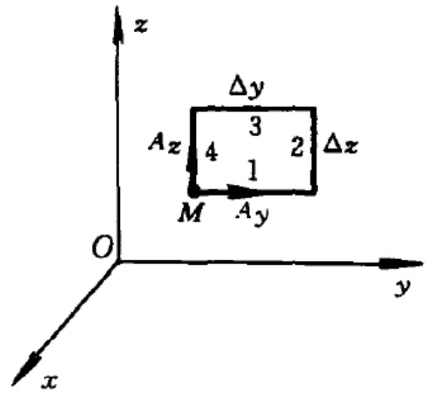

text_image

z
Δy
Az 3 2 Δz
4 1
M Ay
O
y
x

图1.4.2 直角坐标系内计算rot $\pmb{A}$

$$
\lim _ {\Delta S _ {y} \rightarrow 0} \frac {\oint \vec {A} \cdot d \vec {l}}{\Delta S _ {y}} = \frac {\partial A _ {x}}{\partial z} - \frac {\partial A _ {z}}{\partial x} = r o t _ {y} \vec {A}
$$

$$
\lim _ {\Delta S _ {z} \rightarrow 0} \frac {\oint \vec {A} \cdot d \vec {l}}{\Delta S _ {z}} = \frac {\partial A _ {y}}{\partial x} - \frac {\partial A _ {x}}{\partial y} = r o t _ {z} \vec {A}
$$

# 2. 旋度

旋度是一个矢量，模值等于环量密度的最大值；方向为最大环量密度的方向。用 rot $\vec{A}$ 表示

$$
r o t \vec {A} = \vec {e} _ {x} \left(\frac {\partial A _ {z}}{\partial y} - \frac {\partial A _ {y}}{\partial z}\right) + \vec {e} _ {y} \left(\frac {\partial A _ {x}}{\partial z} - \frac {\partial A _ {z}}{\partial x}\right) + \vec {e} _ {z} \left(\frac {\partial A _ {y}}{\partial x} - \frac {\partial A _ {x}}{\partial y}\right)
$$

它与环流密度的关系为： $\lim_{\Delta S\to 0}\frac{\oint_c\vec{A}\cdot\mathrm{d}\vec{l}}{\Delta S} = (\operatorname {rot}\vec{A})\cdot \vec{e}_n$

在直角坐标系下： $\operatorname{rot}\vec{A} = \left| \begin{array}{lll}\vec{e}_x & \vec{e}_y & \vec{e}_z\\ \frac{\partial}{\partial x} & \frac{\partial}{\partial y} & \frac{\partial}{\partial z}\\ A_x & A_y & A_z \end{array} \right| = \nabla \times \vec{A}$

# 旋度的物理意义

✿ 矢量的旋度仍为矢量，是空间坐标点的函数。  
点P的旋度的大小是该点环流密度的最大值。  
点P的旋度的方向是该点最大环流密度的方向。

# 斯托克斯定理

由旋度的定义

$$
\lim _ {\Delta S \rightarrow 0} \frac {\oint_ {c} \vec {A} \cdot \mathrm{d} \vec {l}}{\Delta S} = (\operatorname{rot} \vec {A}) \cdot \vec {e} _ {n}
$$

$$
\oint_ {c} \vec {A} \cdot \mathrm{d} \vec {l} = (\nabla \times \vec {A}) \cdot \mathrm{d} \vec {S}
$$

对于有限大面积S，可将其按如图方式进行分割，对每一小面积元有

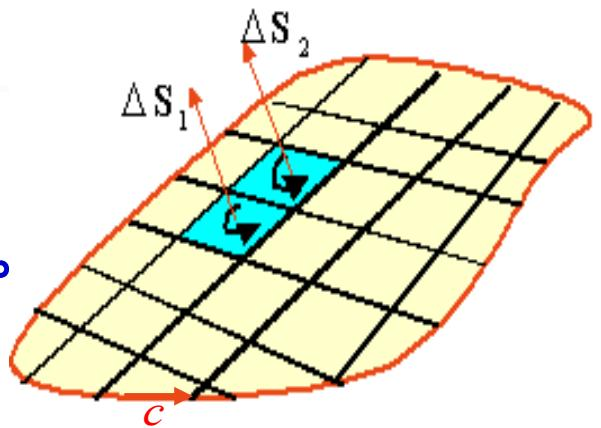

text_image

ΔS₁
ΔS₂
c

$$
\begin{array}{l} \oint_ {c _ {1}} \vec {A} \cdot \mathrm{d} \vec {l} = (\nabla \times \vec {A}) \cdot \mathrm{d} \vec {S} _ {1} \\ \oint_ {c _ {2}} \vec {A} \cdot \mathrm{d} \vec {l} = (\nabla \times \vec {A}) \cdot \mathrm{d} \vec {S} _ {2} \\ \oint_ {c} \vec {A} \cdot \mathrm{d} \vec {l} = \int_ {S} (\nabla \times \vec {A}) \cdot \mathrm{d} \vec {S} \\ \end{array}
$$

+)

斯托克斯定理

$$
\oint_ {l} \vec {\mathbf {A}} \cdot \mathrm{d} \vec {l} = \int_ {S} (\nabla \times \vec {\mathbf {A}}) \cdot \mathrm{d} \vec {\mathbf {S}}
$$

# 矢量场旋度的重要性质

$$
\nabla \bullet (\nabla \times \vec {F}) \equiv 0
$$

# 任意矢量场旋度的散度等于零。

证明：左边 $= \left(\frac{\partial}{\partial x}\vec{e}_x + \frac{\partial}{\partial y}\vec{e}_y + \frac{\partial}{\partial z}\vec{e}_z\right)\bullet$

$$
\begin{array}{l} [ (\frac {\partial F _ {z}}{\partial y} - \frac {\partial F _ {y}}{\partial z}) \vec {e} _ {x} + (\frac {\partial F _ {x}}{\partial z} - \frac {\partial F _ {z}}{\partial x}) \vec {e} _ {y} + (\frac {\partial F _ {y}}{\partial x} - \frac {\partial F _ {x}}{\partial y}) \vec {e} _ {z} ] \\ = [ (\frac {\partial^ {2} F _ {z}}{\partial x \partial y} - \frac {\partial^ {2} F _ {y}}{\partial x \partial z}) + (\frac {\partial^ {2} F _ {x}}{\partial y \partial z} - \frac {\partial^ {2} F _ {z}}{\partial y \partial x}) + (\frac {\partial^ {2} F _ {y}}{\partial z \partial x} - \frac {\partial^ {2} F _ {x}}{\partial z \partial y}) ] \\ = 0 \\ \end{array}
$$

环流是否为零可以判断矢量场是有旋场还是无旋场

$$
\Gamma = \oint_ {L} \vec {\mathbf {A}} \cdot d \vec {l} \equiv 0
$$

上式对于任意闭合回路均成立, 则该矢量场是无旋场

例如普通物理中的重力场、万有引力场、弹性力场，只有在保守场中可以引入“势能”的概念。

这种积分就是高等数学中与路径无关的积分问题。

$$
\Gamma = \oint_ {L} \vec {\mathbf {A}} \cdot d \vec {l} \neq 0, \text {则该矢量场是有旋场}
$$

在非保守场中不能引入“势能”的概念。因此在普通物理中摩擦力作功与路径有关，也就没有“摩擦势能”之说。

为了知道空间中每点附近的环流状态, 即产生环流的源, 必须引入 “旋度” 的概念。

旋度有一个重要的性质, 就是它的散度恒等于零。即:

$$
\operatorname{div} (\operatorname{rot} \vec {\mathrm{A}}) = \nabla \cdot (\nabla \times \vec {\mathrm{A}}) \equiv 0
$$

例4 求矢量场 $\vec{A}(\vec{r})=\vec{e}_{x}x^{2}+\vec{e}_{y}y^{2}+\vec{e}_{y}z^{2}$ 沿着 xy

面内一个闭合路径 C 的线积分，此闭合路径由 $(0,0)$ 和 $(2,\sqrt{2})$ 之间的一段抛物线 $y^{2}=x$ 和两段直线坐标轴组成，如图所示。再计算 $\overrightarrow{A}$ 的旋度。

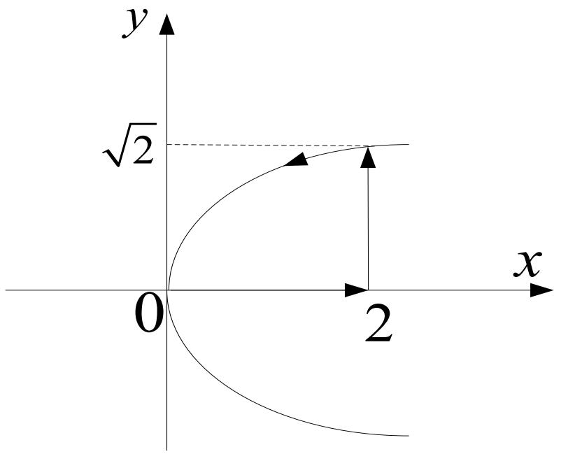

text_image

y
√2
x
0
2

✿ 矢量场在无限空间中处处单值，且其导数连续有界，源分布在有限区域中，则当矢量场的散度及旋度给定后，该矢量场可表示为

$$
\vec {F} (\vec {r}) = - \nabla u (\vec {r}) + \nabla \times \vec {A} (\vec {r})
$$

✿亥姆霍兹定理说明：在无界空间区域，矢量场可由其散度及旋度确定。  
✿ 在有界区域，矢量场不但与该区域中的散度和旋度有关，还与区域边界上矢量场的切向分量和法向分量有关。

# 矢量场的分类

# 1、矢量场的源

散度源：是标量，产生的矢量场在包围源的封闭面上的通量等于（或正比于）该封闭面内所包围的源的总和，源在一给定点的（体）密度等于（或正比于）矢量场在该点的散度；

旋度源：是矢量，产生的矢量场具有涡旋性质，穿过一曲面的旋度源等于（或正比于）沿此曲面边界的闭合回路的环量，在给定点上，这种源的（面）密度等于（或正比于）矢量场在该点的旋度。

# 2、矢量场按源的分类

(1) 无旋场

仅有散度源而无旋度源的矢量场， $\nabla \times \vec{F} \equiv 0$

性质： $\oint_{C} \vec{F} \cdot \mathrm{d}\vec{l} = 0$ ，线积分与路径无关，是保守场。

无旋场可以用标量场的梯度表示为

$$
\begin{array}{r l} \vec {F} & = - \nabla u \\ & \quad \boxed {\nabla \times \vec {F} = - \nabla \times (\nabla u) \equiv 0} \end{array}
$$

例如：静电场

$$
\nabla \times \vec {E} \equiv 0 \Rightarrow \vec {E} = - \nabla \phi
$$

(2) 无散场

仅有旋度源而无散度源的矢量场，即 $\nabla \cdot \vec{F} \equiv 0$

性质： $\oint_{S}\vec{F}\cdot \mathrm{d}\vec{S} = 0$

无散场可以表示为另一个矢量场的旋度

$$
\vec {F} = \nabla \times \vec {A}
$$

$$
\nabla \bullet \vec {F} = \nabla \bullet (\nabla \times \vec {A}) \equiv 0
$$

例如，恒定磁场

$$
\nabla \cdot \vec {B} = 0 \Rightarrow \vec {B} = \nabla \times \vec {A}
$$

3）无旋、无散场 （源在所讨论的区域之外）

$$
\nabla \times \vec {F} = 0 \Longrightarrow \vec {F} = - \nabla u
$$

$$
\begin{array}{c} \nabla \cdot \vec {F} = 0 \quad \Longrightarrow \nabla \cdot (- \nabla u) = 0 \\ \Biggl \downarrow \\ \nabla^ {2} u = 0 \end{array}
$$

4）有散、有旋场

这样的场可分解为两部分：无旋场部分和无散场部分

$$
\vec {F} (\vec {r}) = \vec {F} _ {l} (\vec {r}) + \vec {F} _ {C} (\vec {r}) = - \nabla u (\vec {r}) + \nabla \times \vec {A} (\vec {r})
$$

无旋场部分

无散场部分

# 拉普拉斯运算

标量拉普拉斯运算 $\nabla^{2}u$

概念： $\nabla \cdot (\nabla u) = \nabla^{2}u$ $\nabla^{2}$ —— 拉普拉斯算符

计算公式:

直角坐标系 $\nabla^2 u = \frac{\partial^2u}{\partial x^2} +\frac{\partial^2u}{\partial y^2} +\frac{\partial^2u}{\partial z^2}$

圆柱坐标系 $\nabla^{2}u=\frac{1}{\rho}\frac{\partial}{\partial\rho}(\rho\frac{\partial u}{\partial\rho})+\frac{1}{\rho^{2}}\frac{\partial^{2}u}{\partial\phi^{2}}+\frac{\partial^{2}u}{\partial z^{2}}$

球坐标系 $\nabla^2 u = \frac{1}{r^2}\frac{\partial}{\partial r}(r^2\frac{\partial u}{\partial r}) + \frac{1}{r^2\sin\theta}\frac{\partial}{\partial\theta} (\sin \theta \frac{\partial u}{\partial\theta}) + \frac{1}{r^2\sin^2\theta}\frac{\partial^2u}{\partial\phi^2}$

# 拉普拉斯运算

矢量拉普拉斯运算 $\nabla^{2}\vec{F}$

概念： $\nabla^2\vec{F} = \nabla (\nabla \bullet \vec{F}) - \nabla \times (\nabla \times \vec{F})$

直角坐标系中： $\nabla^2\vec{F} = \vec{e}_x\nabla^2 F_x + \vec{e}_y\nabla^2 F_y + \vec{e}_z\nabla^2 F_z$

即 $(\nabla^2\vec{F})_i = \nabla^2 F_i$ （ $i = x,y,z)$

注意：对于非直角分量， $(\nabla^{2}\vec{F})_{i}\neq\nabla^{2}F_{i}$

如： $(\nabla^{2}\vec{F})_{\phi}\neq \nabla^{2}F_{\phi}$

# 格林定理

格林定理又称为格林恒等式,是由散度定理导出的重要数学恒等式。在散度定理

$$
\int_ {V} \nabla \cdot \boldsymbol {F} \mathrm{d} V = \oint_ {S} \boldsymbol {F} \cdot \boldsymbol {e} _ {\mathrm{n}} \mathrm{d} S
$$

中，令 $F = \varphi \nabla \psi$ ，其中 $\varphi$ 和 $\psi$ 是体积 V 内的两个任意标量函数，则有

$$
\int_ {V} \boldsymbol {\nabla} \cdot (\varphi \boldsymbol {\nabla} \psi) \mathrm{d} V = \oint_ {S} (\varphi \boldsymbol {\nabla} \psi) \cdot \mathrm{d} S
$$

由于

$$
\nabla \cdot (\varphi \nabla \psi) = \varphi \nabla^ {2} \psi + \nabla \varphi \cdot \nabla \psi , \varphi \nabla \psi \cdot e _ {n} = \varphi \frac {\partial \psi}{\partial n}
$$

于是得到格林第一恒等式

$$
\int_ {V} (\varphi \nabla^ {2} \psi + \nabla \varphi \cdot \nabla \psi) \mathrm{d} V = \oint_ {S} \varphi \frac {\partial \psi}{\partial n} \mathrm{d} S \tag {1.7.6}
$$

式中 $\partial\psi/\partial n$ 是闭合曲面S上的外法向导数。

# 格林定理

于是得到格林第一恒等式

$$
\int_ {V} (\varphi \nabla^ {2} \psi + \nabla \varphi \cdot \nabla \psi) \mathrm{d} V = \oint_ {S} \varphi \frac {\partial \psi}{\partial n} \mathrm{d} S \tag {1.7.6}
$$

式中 $\partial\psi/\partial n$ 是闭合曲面S上的外法向导数。

将式(1.7.6)中的 $\varphi$ 与 $\psi$ 对调一下, 则有

$$
\int_ {V} (\psi \nabla^ {2} \varphi + \nabla \psi \cdot \nabla \varphi) \mathrm{d} V = \oint_ {S} \psi \frac {\partial \varphi}{\partial n} \mathrm{d} S \tag {1.7.7}
$$

将式(1.7.6)与式(1.7.7)相减,即得到格林第二恒等式

$$
\int_ {V} (\varphi \nabla^ {2} \psi - \psi \nabla^ {2} \varphi) \mathrm{d} V = \oint_ {S} \left(\varphi \frac {\partial \psi}{\partial n} - \psi \frac {\partial \varphi}{\partial n}\right) \mathrm{d} S \tag {1.7.8}
$$

格林定理描述了两个标量场之间满足的关系,如果已知其中一个场的分布,可以利用格林定理求解另一个场的分布。因此,格林定理在电磁场中有着广泛的应用。