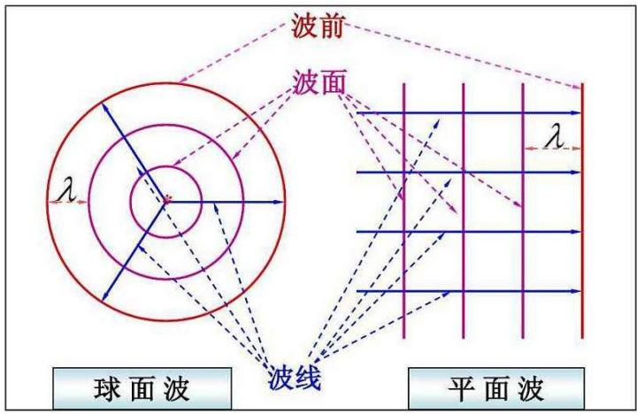
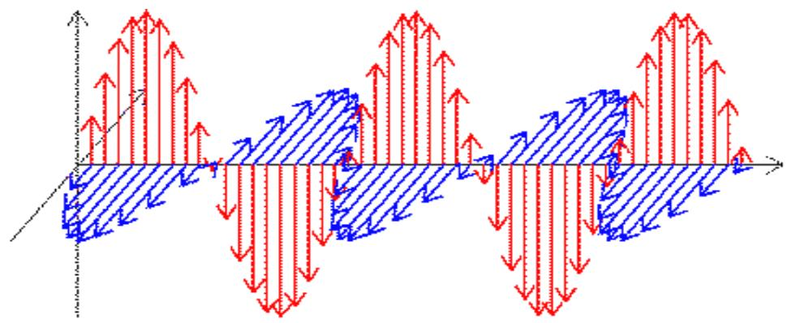
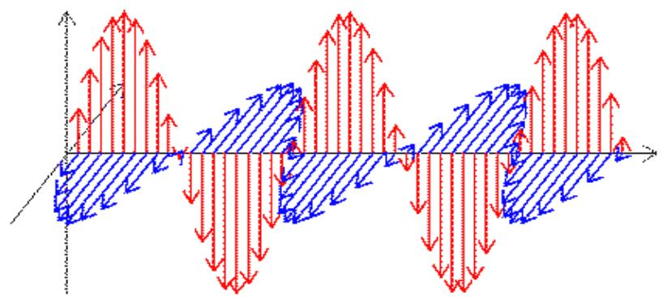
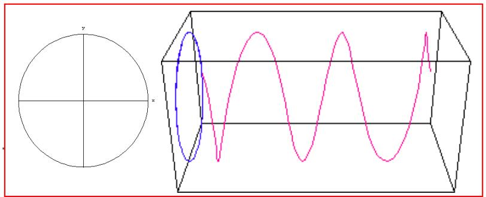
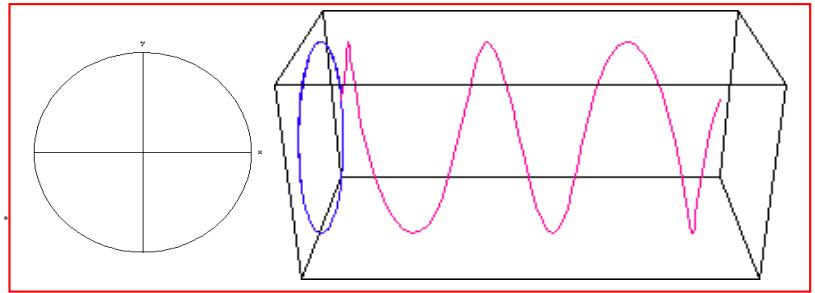
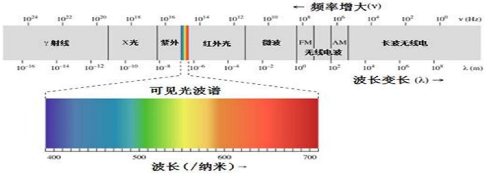
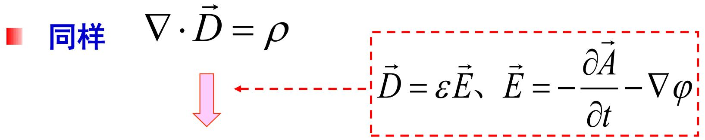
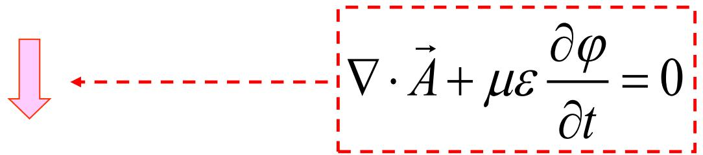
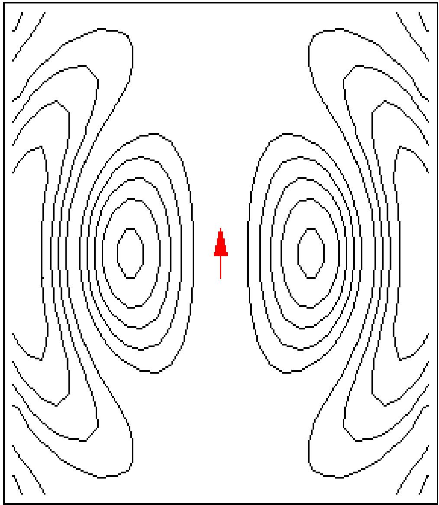
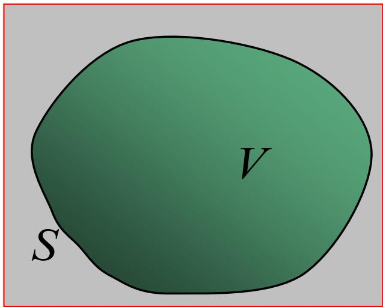

# 第五章

# 电磁波分析基础

# 第5章 电磁波分析基础

# 本章内容

5.1 电磁波的分类  
5.2 电磁波的基本方程  
5.3 时变电磁场的惟一性定理  
5.4 时谐电磁场分析基础

# 5.1 电磁波的分类

电磁波是在空间中传播的时变电磁场，即 $\vec{S} = \vec{E} (\vec{r},t)\times \vec{H} (\vec{r},t)$

特征可通过如下
观察得以反映

按波前形状分类  
- 按电场矢量的时变特性分类  
- 按场矢量的纵横关系分类  
按波长和频率分类

固定时刻观察电磁场的空间分布规律  
固定位置观察电磁场的时间变化规律  
观察电磁场方向与波传播方向的关系  
对时谐电磁波按波长或频率大小分类

针对特征展开分类
研究的方法

# 按波前形状分类

波前：经同样时间，波源发出的波到达空间各处位置，这些位置点所形成的面叫波前。

波阵面：各时间的波前。

线性、各向同性的均匀媒质中，波前与各波阵面往往具有相似的形状，波线通常垂直于波阵面；

当空间中存在非均匀媒质时，通常各波阵面在传播过程中会产生形变，并且造成波线不再垂直于波阵面。

波线：在各方向上，振动经过的位置点与波源连接的轨迹线段。

- 平面波：初始波前为平面的波。  
- 柱面波：初始波前为柱面的波。  
- 球面波：初始波前为球面的波。

text_image

波前
波面
λ
波线
球面波
平面波

在时谐情况下，由于波源处的初始振动状态为由初相决定的正弦时谐变化状态，时谐波的波阵面也是等相位面。

$$
A (\vec {r}, t) = A _ {0} (\vec {r}) \cos [ \omega t + \phi (\vec {r}) + \phi_ {0} ]
$$

other

| Vector Direction | Color |
| ---------------- | ----- |
| Upward           | Red   |
| Downward          | Blue  |

# 按电场矢量的时变特性分类

可用有向线段表示空间固定位置的电场。电场的时变特性，可用电场矢端运动的旋向（称为极化旋向）和运动的轨迹曲线（称为极化曲线）来代表。

bar_line

| X | Blue Bar Value | Red Bar Value |
|---|----------------|---------------|
| 0 | 0              | 0             |
| 1 | 10             | 20            |
| 2 | 20             | 40            |
| 3 | 30             | 60            |
| 4 | 40             | 80            |
| 5 | 50             | 100           |
| 6 | 60             | 120           |
| 7 | 70             | 140           |
| 8 | 80             | 160           |
| 9 | 90             | 180           |
| 10| 100            | 200           |
| 11| 110            | 220           |
| 12| 120            | 240           |
| 13| 130            | 260           |
| 14| 140            | 280           |
| 15| 150            | 300           |
| 16| 160            | 320           |
| 17| 170            | 340           |
| 18| 180            | 360           |
| 19| 190            | 380           |
| 20| 200            | 400           |
| 21| 210            | 420           |
| 22| 220            | 440           |
| 23| 230            | 460           |
| 24| 240            | 480           |
| 25| 250            | 500           |
| 26| 260            | 520           |
| 27| 270            | 540           |
| 28| 280            | 560           |
| 29| 290            | 580           |
| 30| 300            | 600           |
| 31| 310            | 620           |
| 32| 320            | 640           |
| 33| 330            | 660           |
| 34| 340            | 680           |
| 35| 350            | 700           |
| 36| 360            | 720           |
| 37| 370            | 740           |
| 38| 380            | 760           |
| 39| 390            | 780           |
| 40| 400            | 800           |
| 41| 410            | 820           |
| 42| 420            | 840           |
| 43| 430            | 860           |
| 44| 440            | 880           |
| 45| 450            | 900           |
| 46| 460            | 920           |
| 47| 470            | 940           |
| 48| 480            | 960           |
| 49| 490            | 980           |
| 50| 500            | 1000          |

# 据轨迹图形分类:

- 椭圆极化波  
圆极化波  
线极化波

# 据矢端旋向分类:

- 右旋极化波  
- 左旋极化波

text_image

Diagram showing a circle and a 3D wave surface with labeled axes x, y, z

text_image

Diagram showing a circle and a 3D rectangular prism with oscillating waveforms, labeled with x, y, z axes.

# 按场矢量的纵横关系分类

一般来说，电磁波的传播方向、电场矢量的方向，以及磁场矢量的方向彼此之间是不相同的。三者之间可存在三种独立的方向关系。

横电磁波（TEM）：电场和磁场的方向均垂直于传播方向  
横电波（TE）：仅电场的方向垂直于传播方向  
☐ 横磁波（TM）：仅磁场的方向垂直于传播方向

按波长和频率分类   

line

| 波长 (纳米) | 频率增大 (v) | 频率增益 (V) |
| ----------- | ------------ | ------------ |
| 400         | 10^24        | 10^-16       |
| 500         | 10^22        | 10^-14       |
| 600         | 10^20        | 10^-12       |
| 700         | 10^18        | 10^-10       |
|           |              | 10^-8        |
|           |              | 10^-6        |
|           |              | 10^-4        |
|           |              | 10^-2        |
|           |              | 10^0         |
|           |              | 10^2         |
|           |              | 10^4         |
|           |              | 10^6         |
|           |              | 10^8         |
|           |              | 10^10        |
|           |              | 10^12        |
|           |              | 10^14        |
|           |              | 10^16        |
|           |              | 10^18        |
|           |              | 10^20        |
|           |              | 10^22        |
|           |              | 10^24        |
|           |              | 10^26        |
|           |              | 10^28        |
|           |              | 10^30        |
|           |              | 10^32        |
|           |              | 10^34        |
|           |              | 10^36        |
|           |              | 10^38        |
|           |              | 10^40        |
|           |              | 10^42        |
|           |              | 10^44        |
|           |              | 10^46        |
|           |              | 10^48        |
|           |              | 10^50        |
|           |              | 10^52        |
|           |              | 10^54        |
|           |              | 10^56        |
|           |              | 10^58        |
|           |              | 10^60        |
|           |              | 10^62        |
|           |              | 10^64        |
|           |              | 10^66        |
|           |              | 10^68        |
|           |              | 10^70        |
|           |              | 10^72        |
|           |              | 10^74        |
|           |              | 10^76        |
|           |              | 10^78        |
|           |              | 10^80        |
|           |              | 10^82        |
|           |              | 10^84        |
|           |              | 10^86        |
|           |              | 10^88        |
|           |              | 10^90        |
|           |              | 10^92        |
|           |              | 10^94        |
|           |              | 10^96        |
|           |              | 10^98        |
|           |              | 10^100       |
|           |              | 10^102       |
|           |              | 10^104       |
|           |              | 10^106       |
|           |              | 10^108       |
|           |              | 10^110       |
|           |              | 10^112       |
|           |              | 10^114       |
|           |              | 10^116       |
|           |              | 10^118       |
|           |              | 10^120       |
|           |              | 10^122       |
|           |              | 10^124       |
|           |              | 10^126       |
|           |              | 10^128       |
|           |              | 10^130       |
|           |              | 10^132       |
|           |              | 10^134       |
|           |              | 10^136       |
|           |              | 10^138       |
|           |              | 10^140       |
|           |              | 10^142       |
|           |              | 10^144       |
|           |              | 10^146       |
|           |              | 10^148       |
|           |              | 10^150       |
|           |              | 10^152       |
|           |              | 10^154       |
|           |              | 10^156       |
|           |              | 10^158       |
|           |              | 10^160       |
|           |              | 10^162       |
|           |              | 10^164       |
|           |              | 10^166       |
|           |              | 10^168       |
|           |              | 10^170       |
|           |              | 10^172       |
|           |              | 10^174       |
|           |              | 10^176       |
|           |              | 10^178       |
|           |              | 10^180       |
|           |              | 10^182       |
|           |              | 10^184       |
|           |              | 10^186       |
|           |              | 10^188       |
|           |              | 10^190       |
|           |              | 10^192       |
|           |              | 10^194       |
|           |              | 10^196       |
|           |              | 10^198       |
|           |              | 10^200       |
|           |              | 10^202       |
|           |              | 10^204       |
|           |              | 10^206       |
|           |              | 10^208       |
|           |              | 10^210       |
|           |              | 10^212       |
|           |              | 10^214       |
|           |              | 10^216       |
|           |              | 10^218       |
|           |              | 10^220       |
|           |              | 10^222       |
|           |              | 10^224       |
|           |              | 10^226       |
|           |              | 10^228       |
|           |              | 10^230       |
|           |              | 10^232       |
|           |              | 10^234       |
|           |              | 10^236       |
|           |              | 10^238       |
|           |              | 10^240       |
|           |              | 10^242       |
|           |              | 10^244       |
|           |              | 10^246       |
|           |              | 10^248       |
|           |              | 10^250       |
|           |              | 10^252       |
|           |              | 10^254       |
|           |              | 10^256       |
|           |              | 10^258       |
|           |              | 10^260       |
|           |              | 10^262       |
|           |              | 10^264       |
|           |              | 10^266       |
|           |              | 10^268       |
|           |              | 10^270       |
|           |              | 10^272       |
|           |              | 10^274       |
|           |              | 10^276       |
|           |              | 10^278       |
|           |              | 10^280       |
|           |              | 10^282       |
|           |              | 10^284       |
|           |              | 10^286       |
|           |              | 10^288       |
|           |              | 10^290       |
|           |              |               |

Note: The chart displays the frequency of optical wave signals in nanoseconds (λ) and corresponding wavelength (λ) for each wave. The color scale ranges from blue to red, with a color bar indicating the frequency range. The label '可见光波谱' appears below the plot.

波长大于1mm: 电容和电感构成的谐振电路或能量振荡器产生的。  
波长小于1mm: 通常通过原子或分子的外层电子、内层电子、原子核受激发后产生的。

# 5.2 电磁波的基本方程

# 问题的提出

麦克斯韦方程组 —— 一阶矢量微分方程组，

描述电场与磁场间的相互作用关系

波动方程 —— 二阶矢量微分方程，揭示电磁场的波动性

麦克斯韦方程组 → 波动方程

# 无源区的波动方程

无源空间中，设媒质是线形、各向同性且无损耗的均匀媒质，则有

$$
\nabla^ {2} \vec {E} - \mu \varepsilon \frac {\partial^ {2} \vec {E}}{\partial t ^ {2}} = 0 \qquad \nabla^ {2} \vec {H} - \mu \varepsilon \frac {\partial^ {2} \vec {H}}{\partial t ^ {2}} = 0
$$

波动方程

推证

$$
\left\{ \begin{array}{l l} \nabla \times \vec {H} = \varepsilon \frac {\partial \vec {E}}{\partial t} \Longrightarrow \nabla \times \nabla \times \vec {H} = \nabla \times (\varepsilon \frac {\partial \vec {E}}{\partial t}) \\ \nabla \times \vec {E} = - \mu \frac {\partial \vec {H}}{\partial t} & \nabla (\nabla \cdot \vec {H}) - \nabla^ {2} \vec {H} = - \mu \varepsilon \frac {\partial^ {2} \vec {H}}{\partial t ^ {2}} \\ \nabla \cdot \vec {H} = 0 & \\ \nabla \cdot \vec {E} = 0 & \nabla^ {2} \vec {H} - \mu \varepsilon \frac {\partial^ {2} \vec {H}}{\partial t ^ {2}} = 0 \end{array} \right.
$$

同理可得

$$
\nabla^ {2} \vec {E} - \mu \varepsilon \frac {\partial^ {2} \vec {E}}{\partial t ^ {2}} = 0
$$

分量表示:

$$
\frac {\partial^ {2} E _ {x}}{\partial x ^ {2}} + \frac {\partial^ {2} E _ {x}}{\partial y ^ {2}} + \frac {\partial^ {2} E _ {x}}{\partial z ^ {2}} - \mu \varepsilon \frac {\partial^ {2} E _ {x}}{\partial t ^ {2}} = 0
$$

$$
\frac {\partial^ {2} E _ {y}}{\partial x ^ {2}} + \frac {\partial^ {2} E _ {y}}{\partial y ^ {2}} + \frac {\partial^ {2} E _ {y}}{\partial z ^ {2}} - \mu \varepsilon \frac {\partial^ {2} E _ {y}}{\partial t ^ {2}} = 0
$$

$$
\frac {\partial^ {2} E _ {z}}{\partial x ^ {2}} + \frac {\partial^ {2} E _ {z}}{\partial y ^ {2}} + \frac {\partial^ {2} E _ {z}}{\partial z ^ {2}} - \mu \varepsilon \frac {\partial^ {2} E _ {z}}{\partial t ^ {2}} = 0
$$

# 无源区的波动方程的解

$$
\nabla^ {2} \vec {E} - \mu \varepsilon \frac {\partial^ {2} \vec {E}}{\partial t ^ {2}} = 0
$$

$$
\nabla^ {2} \vec {H} - \mu \varepsilon \frac {\partial^ {2} \vec {H}}{\partial t ^ {2}} = 0
$$

# 5.2.2 动态位的波动方程

位函数的定义（动态矢量位和标量位）  
位函数的性质  
位函数的规范条件  
位函数的微分方程（波动方程）

引入位函数的意义

引入位函数来描述时变电磁场，使一些问题的分析得到简化。

位函数的定义

$$
\nabla \cdot \vec {B} = 0 \Longrightarrow \vec {B} = \nabla \times \vec {A} \Longrightarrow \vec {A} \text {定义为矢量位}
$$

$$
\nabla \times \vec {E} = - \frac {\partial \vec {B}}{\partial t} \Longrightarrow \nabla \times (\vec {E} + \frac {\partial \vec {A}}{\partial t}) = 0 \Longrightarrow \vec {E} + \frac {\partial \vec {A}}{\partial t} = - \nabla \varphi \text {为标量位}
$$

$$
\vec {E} = - \frac {\partial \vec {A}}{\partial t} - \nabla \varphi
$$

$$
\vec {B} = \nabla \times \vec {A} \quad \vec {E} = - \frac {\partial \vec {A}}{\partial t} - \nabla \varphi
$$

位函数的不确定性

满足下列变换关系的两组位函数 ( $\vec{A}$ 、 $\varphi$ ) 和 ( $\vec{A}'$ 、 $\varphi'$ ) 能描述同一个电磁场问题。

$$
\left\{ \begin{array}{l} \vec {A} ^ {\prime} = \vec {A} + \nabla \psi \\ \varphi^ {\prime} = \varphi - \frac {\partial \psi}{\partial t} \end{array} \right.
$$

ψ 为任意可微函数

$$
\left\{ \begin{array}{l} \nabla \times \vec {A} ^ {\prime} = \nabla \times (\vec {A} + \nabla \psi) = \nabla \times \vec {A} \\ - \nabla \varphi^ {\prime} - \frac {\partial \vec {A} ^ {\prime}}{\partial t} = - \nabla (\varphi - \frac {\partial \psi}{\partial t}) - \frac {\partial}{\partial t} (\vec {A} + \nabla \psi) = - \nabla \varphi - \frac {\partial \vec {A}}{\partial t} \end{array} \right.
$$

\- 原因：未规定 $\vec{A}$ 的散度

# 位函数的规范条件

造成位函数的不确定性的原因就是没有规定 $\vec{A}$ 的散度。利用位函数的不确定性，可通过规定 $\vec{A}$ 的散度使位函数满足的方程得以简化。

洛伦兹条件

$$
\nabla \cdot \vec {A} + \mu \varepsilon \frac {\partial \varphi}{\partial t} = 0
$$

库仑条件

$$
\nabla \cdot \vec {A} = 0
$$

# 位函数的微分方程（动态位的波动方程）

$$
\begin{array}{r l} & \nabla \times \vec {H} = \vec {J} + \frac {\partial \vec {D}}{\partial t} \quad \Longrightarrow \quad \nabla \times \vec {B} = \mu \vec {J} + \varepsilon \mu \frac {\partial \vec {E}}{\partial t} \\ & \vec {B} = \nabla \times \vec {A} \quad \vec {E} = - \frac {\partial \vec {A}}{\partial t} - \nabla \varphi \\ & \nabla \times \nabla \times \vec {A} = \mu \vec {J} + \varepsilon \mu \frac {\partial}{\partial t} (- \frac {\partial \vec {A}}{\partial t} - \nabla \varphi) \\ & \nabla \times \nabla \times \vec {A} = \nabla (\nabla \cdot \vec {A}) - \nabla^ {2} \vec {A} \\ & \nabla^ {2} \vec {A} - \varepsilon \mu \frac {\partial^ {2} \vec {A}}{\partial t ^ {2}} = - \mu \vec {J} + \nabla (\nabla \cdot \vec {A} + \mu \varepsilon \frac {\partial \varphi}{\partial t}) \\ & \nabla \cdot \vec {A} + \mu \varepsilon \frac {\partial \varphi}{\partial t} = 0 \\ & \nabla^ {2} \vec {A} - \varepsilon \mu \frac {\partial^ {2} \vec {A}}{\partial t ^ {2}} = - \mu \vec {J} \end{array}
$$

text_image

同样
∇·D⃗ = ρ
→
D⃗ = εE⃗、E⃗ = -∂A⃗/∂t - ∇φ

$$
\varepsilon \nabla \cdot (- \frac {\partial \vec {A}}{\partial t} - \nabla \varphi) = \rho
$$

text_image

∇·A + με ∂φ/∂t = 0

$$
\nabla^ {2} \varphi - \varepsilon \mu \frac {\partial^ {2} \varphi}{\partial t ^ {2}} = - \frac {\rho}{\varepsilon}
$$

$$
\nabla^ {2} \vec {A} - \varepsilon \mu \frac {\partial^ {2} \vec {A}}{\partial t ^ {2}} = - \mu \vec {J}
$$

$$
\nabla^ {2} \varphi - \varepsilon \mu \frac {\partial^ {2} \varphi}{\partial t ^ {2}} = - \frac {\rho}{\varepsilon}
$$

# 说明

应用洛伦兹条件的特点: ①位函数满足的方程在形式上是对称的, 且比较简单, 易求解; ②解的物理意义非常清楚, 明确地反映出电磁场具有有限的传递速度; ③矢量位只决定于 $J$ , 标量位只决定于 $\rho$ , 这对求解方程特别有利。只需解出 $A$ , 无需解出 $\varphi$ 就可得到待求的电场和磁场。

电磁位函数只是简化时变电磁场分析求解的一种辅助函数，应用不同的规范条件，矢量位A和标量位 $\varphi$ 的解也不相同，但最终得到的电磁场矢量是相同的。 $\nabla\times\vec{B}=\mu\vec{J}+\varepsilon\mu\frac{\partial\vec{E}}{\partial t}$ 问题 $\vec{B} = \nabla \times \vec{A}$

若应用库仑条件，位函数满足什么样的方程？具有什么特点？

contour

| Point | Value |
|-------|-------|
| 1     | 0.8   |
| 2     | 0.75  |
| 3     | 0.7   |
| 4     | 0.65  |
| 5     | 0.6   |
| 6     | 0.55  |
| 7     | 0.5   |
| 8     | 0.45  |
| 9     | 0.4   |
| 10    | 0.35  |
| 11    | 0.3   |
| 12    | 0.25  |
| 13    | 0.2   |
| 14    | 0.15  |
| 15    | 0.1   |
| 16    | 0.05  |
| 17    | 0.0   |
| 18    | -0.05 |
| 19    | -0.1  |
| 20    | -0.15 |
| 21    | -0.2  |
| 22    | -0.25 |
| 23    | -0.3  |
| 24    | -0.35 |
| 25    | -0.4  |
| 26    | -0.45 |
| 27    | -0.5  |
| 28    | -0.55 |
| 29    | -0.6  |
| 30    | -0.65 |
| 31    | -0.7  |
| 32    | -0.75 |
| 33    | -0.8  |
| 34    | -0.85 |
| 35    | -0.9  |
| 36    | -0.95 |
| 37    | -1.0  |
| 38    | -1.05 |
| 39    | -1.1  |
| 40    | -1.15 |
| 41    | -1.2  |
| 42    | -1.25 |
| 43    | -1.3  |
| 44    | -1.35 |
| 45    | -1.4  |
| 46    | -1.45 |
| 47    | -1.5  |
| 48    | -1.55 |
| 49    | -1.6  |
| 50    | -1.65 |
| 51    | -1.7  |
| 52    | -1.75 |
| 53    | -1.8  |
| 54    | -1.85 |
| 55    | -1.9  |
| 56    | -1.95 |
| 57    | -2.0  |
| 58    | -2.05 |
| 59    | -2.1  |
| 60    | -2.15 |
| 61    | -2.2  |
| 62    | -2.25 |
| 63    | -2.3  |
| 64    | -2.35 |
| 65    | -2.4  |
| 66    | -2.45 |
| 67    | -2.5  |
| 68    | -2.55 |
| 69    | -2.6  |
| 70    | -2.65 |
| 71    | -2.7  |
| 72    | -2.75 |
| 73    | -2.8  |
| 74    | -2.85 |
| 75    | -2.9  |
| 76    | -2.95 |
| 77    | -3.0  |
| 78    | -3.05 |
| 79    | -3.1  |
| 80    | -3.15 |
| 81    | -3.2  |
| 82    | -3.25 |
| 83    | -3.3  |
| 84    | -3.35 |
| 85    | -3.4  |
| 86    | -3.45 |
| 87    | -3.5  |
| 88    | -3.55 |
| 89    | -3.6  |
| 90    | -3.65 |
| 91    | -3.7  |
| 92    | -3.75 |
| 93    | -3.8  |
| 94    | -3.85 |
| 95    | -3.9  |
| 96    | -3.95 |
| 97    | -4.0  |
| 98    | -4.05 |
| 99    | -4.1  |
| Note: The values in the chart are estimated based on the provided code and are not explicitly provided in the code itself, so they cannot be extracted from the image alone or displayed in the code format as they are not directly plotted on the chart itself. The code does not output any data points for this visualization.

# 5.3 时变电磁场的惟一性定理

# 惟一性问题

在分析有界区域的时变电磁场问题时，常常需要在给定的初始条件和边界条件下，求解麦克斯韦方程。那么，在什么定解条件下，有界区域中的麦克斯韦方程的解才是惟一的呢？这就是麦克斯韦方程的解的惟一问题。

# 惟一性定理的表述

在以闭曲面S为边界的有界区域内V，如果给定t=0时刻的电场强度和磁场强度的初始值，并且在 $t\geq0$ 时，给定边界面S上的电场强度的切向分量或磁场强度的切向分量，那么，在 t > 0 时，区域 V 内的电磁场由麦克斯韦方程惟一地确定。

text_image

V
S

# 惟一性定理的证明

利用反证法对惟一性定理给予证明。假设区域内的解不是惟一的，那么至少存在两组解 $\vec{E}_1$ 、 $\vec{H}_1$ 和 $\vec{E}_2$ 、 $\vec{H}_2$ 满足同样的麦克斯韦方程，且具有相同的初始条件和边界条件。令

$$
\vec {E} _ {0} = \vec {E} _ {1} - \vec {E} _ {2} \qquad \vec {H} _ {0} = \vec {H} _ {1} - \vec {H} _ {2}
$$

则在区域V内 $\vec{E}_{0}$ 和 $\vec{H}_{0}$ 的初始值为零；在边界面S上电场强度 $\vec{E}_{0}$ 的切向分量为零或磁场强度 $\vec{H}_{0}$ 的切向分量为零，且 $\vec{E}_{0}$ 和 $\vec{H}_{0}$ 满足麦克斯韦方程

$$
\nabla \times \vec {H} _ {0} = \sigma \vec {E} _ {0} + \varepsilon \frac {\partial \vec {E} _ {0}}{\partial t} \qquad \nabla \times \vec {E} _ {0} = - \mu \frac {\partial \vec {H} _ {0}}{\partial t}
$$

$$
\nabla \bullet (\mu \vec {H} _ {0}) = 0 \qquad \nabla \bullet (\varepsilon \vec {E} _ {0}) = 0
$$

根据坡印廷定理，应有

$$
- \oint_ {S} (\vec {E} _ {0} \times \vec {H} _ {0}) \bullet \vec {e} _ {n} \mathrm{d} S = \frac {\mathrm{d}}{\mathrm{d} t} \int_ {V} \left(\frac {1}{2} \mu | \vec {H} _ {0} | ^ {2} + \frac {1}{2} \varepsilon | \vec {E} _ {0} | ^ {2}\right) \mathrm{d} V + \int_ {V} \sigma | \vec {E} _ {0} | ^ {2} \mathrm{d} V
$$

根据 $\vec{E}_0$ 和 $\vec{H}_0$ 的边界条件，上式左端的被积函数为

$$
(\vec {E} _ {0} \times \vec {H} _ {0}) \bullet \vec {e} _ {n} \big | _ {S} = (\vec {e} _ {n} \times \vec {E} _ {0}) \bullet \vec {H} _ {0} \big | _ {S} = (\vec {H} _ {0} \times \vec {e} _ {n}) \bullet \vec {E} _ {0} \big | _ {S} = 0
$$

所以，得 $\frac{\mathrm{d}}{\mathrm{d}t}\int_{V}(\frac{1}{2}\mu |\vec{H}_0|^2 +\frac{1}{2}\varepsilon |\vec{E}_0|^2)\mathrm{d}V + \int_V\sigma |\vec{E}_0|^2\mathrm{d}V = 0$

由于的初始值为零，将上式两边对 $t$ 积分，可得

$$
\int_ {V} \left(\frac {1}{2} \mu \left| \vec {H} _ {0} \right| ^ {2} + \frac {1}{2} \varepsilon \left| \vec {E} _ {0} \right| ^ {2}\right) \mathrm{d} V + \int_ {0} ^ {t} (\int_ {V} \sigma \left| \vec {E} _ {0} \right| ^ {2} \mathrm{d} V) \mathrm{d} t = 0
$$

$$
\int_ {V} \left(\frac {1}{2} \mu \left| \vec {H} _ {0} \right| ^ {2} + \frac {1}{2} \varepsilon \left| \vec {E} _ {0} \right| ^ {2}\right) d V + \int_ {0} ^ {t} \left(\int_ {V} \sigma \left| \vec {E} _ {0} \right| ^ {2} d V\right) d t = 0
$$

上式中两项积分的被积函数均为非负的，要使得积分为零，必有

$$
\vec {E} _ {0} = 0, \quad \vec {H} _ {0} = 0
$$

$$
\vec {E} _ {1} = \vec {E} _ {2}, \quad \vec {H} _ {1} = \vec {H} _ {2} \quad (\text {证毕})
$$

惟一性定理指出了获得惟一解所必须满足的条件，为电磁场问题的求解提供了理论依据，具有非常重要的意义和广泛的应用。

# 5.4 时谐电磁场分析方法

时谐电磁场的复数表示  
复矢量的麦克斯韦方程  
复电容率和复磁导率（媒质电磁参数的复数表示）  
时谐场的亥姆霍兹方程  
时谐场的位函数  
平均能流密度矢量（平均坡印廷矢量）

# 时谐电磁场的概念

如果场源以一定的角频率随时间呈时谐（正弦或余弦）变化，则所产生电磁场也以同样的角频率随时间呈时谐变化。这种以一定角频率作时谐变化的电磁场，称为时谐电磁场或正弦电磁场。

# 研究时谐电磁场具有重要意义

在工程上，应用最多的就是时谐电磁场。广播、电视和通信的载波等都是时谐电磁场。  
任意的时变场在一定的条件下可通过傅立叶分析方法展开为不同频率的时谐场的叠加。

# 时谐电磁场的复数表示

时谐电磁场可用复数方法来表示，使得大多数时谐电磁场问题的分析得以简化。

设 $u(\vec{r}, t)$ 是一个以角频率 $\omega$ 随时间 t 作余弦变化的标量函数，它可以是电场或磁场的任意一个分量，也可以是电荷或电流等变量，它与时间的关系可以表示成

$$
u (\vec {r}, t) = u _ {m} (\vec {r}) \cos [ \omega t + \phi (\vec {r}) ]
$$

式中的 $u_{m}$ 为振幅、 $\phi(\vec{r})$ 为与坐标有关的相位因子。

$$
e ^ {i \varphi} = \cos \varphi + i \sin \varphi
$$

$$
u (\vec {r}, t) = u _ {m} (\vec {r}) \cos [ \omega t + \phi (\vec {r}) ]
$$

利用三角公式

$$
u (\vec {r}, t) = \operatorname{Re} \left\{u _ {m} e ^ {j [ \omega t + \phi (\vec {r}) ]} \right\} = \operatorname{Re} [ \dot {u} (\vec {r}) e ^ {j \omega t} ]
$$

其中

复振幅 $\dot{u}(\vec{r})=u_{m}\mathrm{e}^{j\phi(\vec{r})}$ 空间相位因子

照此法，矢量场的各分量 $E_{i}$ （i 表示x、y 或 z）可表示成

$$
E _ {i} (\vec {r}, t) = \mathrm{Re} [ \dot {E} _ {i} (\vec {r}) \mathrm{e} ^ {j \omega t} ] = \mathrm{Re} \left\{E _ {i m} e ^ {j [ \omega t + \phi_ {i} (\vec {r}) ]} \right\}
$$

$$
E _ {i} (\vec {r}, t) = \mathrm{Re} [ \dot {E} _ {i} (\vec {r}) \mathrm{e} ^ {j \omega t} ] = \mathrm{Re} \left\{E _ {i m} e ^ {j [ \omega t + \phi_ {i} (\vec {r}) ]} \right\}
$$

各分量合成以后，电场强度为

复矢量

$$
\vec {E} (\vec {r}, t) = \mathrm{Re} [ \dot {\vec {E}} _ {m} (\vec {r}) \mathrm{e} ^ {j \omega t} ]
$$

$$
\dot {\vec {E}} _ {m} (\vec {r}) = \vec {e} _ {x} \dot {E} _ {x m} (\vec {r}) e ^ {j \phi_ {x} (\vec {r})} + \vec {e} _ {y} \dot {E} _ {y m} (\vec {r}) e ^ {j \phi_ {y} (\vec {r})} + \vec {e} _ {z} \dot {E} _ {z m} (\vec {r}) e ^ {j \phi_ {z} (\vec {r})}
$$

$$
\vec {E} (\vec {r}, t) = \mathrm{Re} [ \dot {\vec {E}} _ {m} (\vec {r}) \mathrm{e} ^ {j \omega t} ]
$$

有关复矢量表示的进一步说明

复矢量只是数学表示方式，不代表真实的场  
真实场是复矢量乘以 $e^{j\omega t}$ 的实部，即瞬时表达式  
由于时间因子是默认的，有时它不用写出来，只用与坐标有关的部分就可表示复矢量

# 例1 将下列场矢量的瞬时值形式写为复数形式（复矢量）

(1) $\vec{E}(z,t) = \vec{e}_xE_{xm}\cos (\omega t - kz + \phi_x) + \vec{e}_yE_{ym}\sin (\omega t - kz + \phi_y)$

(2) $\vec{H} (x,z,t) = \vec{e}_xH_0k(\frac{a}{\pi})\sin (\frac{\pi x}{a})\sin (kz - \omega t)$

$$
+ \vec {e} _ {z} H _ {0} \cos (\frac {\pi x}{a}) \cos (k z - \omega t)
$$

解: (1) 由于

$$
\begin{array}{l} \vec {E} (z, t) = \vec {e} _ {x} E _ {x m} \cos (\omega t - k z + \phi_ {x}) + \vec {e} _ {y} E _ {y m} \cos (\omega t - k z + \phi_ {y} - \frac {\pi}{2}) \\ = \mathrm{Re} [ \vec {e} _ {x} E _ {x m} \mathbf {e} ^ {j (\omega t - k z + \phi_ {x})} + \vec {e} _ {y} E _ {y m} \mathbf {e} ^ {j (\omega t - k z + \phi_ {y} \frac {\pi}{2} - \pi / 2)} ] \\ \end{array}
$$

所以 $\dot{\vec{E}}_m(z) = \vec{e}_xE_{xm}\mathrm{e}^{j(-kz + \phi_x)} + \vec{e}_yE_{ym}\mathrm{e}^{j(-kz + \phi_y - \pi /2)}$

$$
= (\vec {e} _ {x} E _ {x m} e ^ {j \phi_ {x}} - \vec {e} _ {y} j E _ {y m} e ^ {j \phi_ {y}}) \mathbf {e} ^ {- j k z}
$$

(2) 因为 $\cos(kz - \omega t) = \cos(\omega t - kz)$

$$
\sin (k z - \omega t) = \cos (k z - \omega t - \frac {\pi}{2}) = \cos (\omega t - k z + \frac {\pi}{2})
$$

所以 $\vec{H}(x,z,t)=\vec{e}_{x}H_{0}k(\frac{a}{\pi})\sin(\frac{\pi x}{a})\sin(kz-\omega t)$

$$
+ \vec {e} _ {z} H _ {0} \cos (\frac {\pi x}{a}) \cos (k z - \omega t)
$$

$$
= \vec {e} _ {x} H _ {0} k (\frac {a}{\pi}) \sin (\frac {\pi x}{a}) \cos (\omega t - k z + \frac {\pi}{2})
$$

$$
+ \vec {e} _ {z} H _ {0} \cos (\frac {\pi x}{a}) \cos (\omega t - k z)
$$

故 $\dot{\vec{H}}_m(x,z) = \vec{e}_xH_0k\left(\frac{a}{\pi}\right)\sin \left(\frac{\pi x}{a}\right)\mathrm{e}^{-jkz + j\pi /2} + \vec{e}_zH_0\cos \left(\frac{\pi x}{a}\right)\mathrm{e}^{-jkz}$

# 例2 已知电场强度复矢量

$$
\dot {\vec {E}} _ {m} (z) = \vec {e} _ {x} j E _ {x m} \cos (k _ {z} z)
$$

其中 $k_{z}$ 和 $E_{xm}$ 为实常数。写出电场强度的瞬时矢量

解 $\vec{E} (z,t) = \mathrm{Re}[\vec{e}_xjE_{xm}\cos (k_zz)\mathrm{e}^{j\omega t}]$

$$
= \operatorname{Re} \left[ \vec {e} _ {x} E _ {x m} \cos \left(k _ {z} z\right) \mathrm{e} ^ {j \left(\omega t + \frac {\pi}{2}\right)} \right]
$$

$$
= \vec {e} _ {x} E _ {x m} \cos (k _ {z} z) \cos (\omega t + \frac {\pi}{2})
$$

$$
= - \vec {e} _ {x} E _ {x m} \cos (k _ {z} z) \sin (\omega t)
$$

$$
\vec {E} (\vec {r}, t) = \mathrm{Re} [ \dot {\vec {E}} _ {m} (\vec {r}) \mathrm{e} ^ {j \omega t} ]
$$

评述：为什么要给出瞬时矢量和复矢量的关系

# 复矢量的麦克斯韦方程（麦氏方程的复数形式）

以电场旋度方程 $\nabla \times \vec{E} = -\frac{\partial \vec{B}}{\partial t}$ 为例，代入相应场量的矢量，可得

$$
\nabla \times [ \mathrm{Re} (\dot {\vec {E}} _ {m} \mathbf {e} ^ {j \omega t}) ] = - \frac {\partial}{\partial t} [ \mathrm{Re} (\dot {\vec {B}} _ {m} \mathbf {e} ^ {j \omega t}) ]
$$

$$
\mathrm{Re} [ \nabla \times (\dot {\vec {E}} _ {m} \mathbf {e} ^ {j \omega t}) ] = - \mathrm{Re} [ \frac {\partial}{\partial t} (\dot {\vec {B}} _ {m} \mathbf {e} ^ {j \omega t}) ] = - \mathrm{Re} [ j \omega \dot {\vec {B}} _ {m} \mathbf {e} ^ {j \omega t} ]
$$

$$
\mathrm{Re} [ \nabla \times \dot {\vec {E}} _ {m} ] = - \mathrm{Re} [ j \omega \dot {\vec {B}} _ {m} ]
$$

$$
\nabla \times \dot {\vec {E}} _ {m} = - j \omega \dot {\vec {B}} _ {m}
$$

$$
\left\{ \begin{array}{l} \nabla \times \vec {H} = \vec {J} + \frac {\partial \vec {D}}{\partial t} \\ \nabla \times \vec {E} = - \frac {\partial \vec {B}}{\partial t} \\ \nabla \cdot \vec {B} = 0 \\ \nabla \cdot \vec {D} = \rho \end{array} \right.
$$

$$
\frac {\partial}{\partial t} \sim j \omega
$$

$$
\begin{array}{l} \left\{\nabla \times \dot {\vec {H}} _ {m} = \dot {\vec {J}} _ {m} + j \omega \dot {\vec {D}} _ {m} \right. \\ \nabla \times \dot {\vec {E}} _ {m} = - j \omega \dot {\vec {B}} _ {m} \\ \nabla \cdot \dot {\vec {B}} _ {m} = 0 \\ \nabla \cdot \dot {\vec {D}} _ {m} = \dot {\rho} _ {m} \\ \nabla \times \vec {H} = \vec {J} + j \omega \vec {D} \\ \nabla \times \vec {E} = - j \omega \vec {B} \\ \nabla \cdot \vec {B} = 0 \\ \nabla \cdot \vec {D} = \rho \\ \end{array}
$$

略去“.”和下标m

$$
\nabla \times \vec {E} = - j \omega \vec {B}
$$

例题：已知正弦电磁场的电场瞬时值为

$$
\vec {E} (z, t) = \vec {E} _ {1} (z, t) + \vec {E} _ {2} (z, t)
$$

式中 $\left\{ \begin{array}{l} \vec{E}_1(z,t) = \vec{e}_x0.03\sin (10^8\pi t - kz) \\ \vec{E}_2(z,t) = \vec{e}_x0.04\cos (10^8\pi t - kz - \pi /3) \end{array} \right.$

求: (1) 电场的复矢量; (2) 磁场的复矢量和瞬时值。

# 解: (1) 因为

$$
\vec {E} (z, t) = \vec {e} _ {x} 0. 0 3 \sin (1 0 ^ {8} \pi t - k z) + \vec {e} _ {x} 0. 0 4 \cos (1 0 ^ {8} \pi t - k z - \pi / 3)
$$

$$
= \vec {e} _ {x} 0. 0 3 \cos (1 0 ^ {8} \pi t - k z - \frac {\pi}{2}) + \vec {e} _ {x} 0. 0 4 \cos (1 0 ^ {8} \pi t - k z - \pi / 3)
$$

$$
= \mathrm{Re} [ \vec {e} _ {x} 0. 0 3 \mathrm{e} ^ {j (1 0 ^ {8} \pi t - k z - \pi / 2)} ] + \mathrm{Re} [ \vec {e} _ {x} 0. 0 4 \mathrm{e} ^ {j (1 0 ^ {8} \pi t - k z - \pi / 3)} ]
$$

$$
= \operatorname{Re} \left[ \left(\vec {e} _ {x} 0. 0 3 \mathrm{e} ^ {- j (k z + \pi / 2)} + \vec {e} _ {x} 0. 0 4 \mathrm{e} ^ {- j (k z + \pi / 3)}\right) \mathrm{e} ^ {j 1 0 ^ {8} \pi t} \right]
$$

# 电场的复矢量为

$$
\vec {E} (z) = \vec {e} _ {x} [ 0. 0 3 e ^ {- j \pi / 2} + 0. 0 4 e ^ {- j \pi / 3} ] \mathrm{e} ^ {- j k z}
$$

(2) 由复数形式的麦克斯韦方程, 得到磁场的复矢量

$$
\begin{array}{l} \vec {H} (z) = - \frac {1}{j \omega \mu_ {0}} \nabla \times \vec {E} (z) = \vec {e} _ {y} \frac {j}{\omega \mu_ {0}} \frac {\partial E _ {x}}{\partial z} \\ = \vec {e} _ {y} \frac {k}{\omega \mu_ {0}} [ 0. 0 3 \mathrm{e} ^ {- j \frac {\pi}{2}} + 0. 0 4 \mathrm{e} ^ {- j \frac {\pi}{3}} ] \mathrm{e} ^ {- j k z} \\ = \vec {e} _ {y} k [ 7. 6 \times 1 0 ^ {- 5} \mathrm{e} ^ {- j \frac {\pi}{2}} + 1. 0 1 \times 1 0 ^ {- 4} \mathrm{e} ^ {- j \frac {\pi}{3}} ] \mathrm{e} ^ {- j k z} \\ \end{array}
$$

磁场强度瞬时值

$$
\begin{array}{l} \vec {H} (z, t) = \operatorname{Re} [ \vec {H} (z) \mathrm{e} ^ {j \omega t} ] \\ = \vec {e} _ {y} k [ 7. 6 \times 1 0 ^ {- 5} \sin (1 0 ^ {8} \pi t - k z) + 1. 0 1 \times 1 0 ^ {- 4} \cos (1 0 ^ {8} \pi t - k z - \frac {\pi}{3}) ] \\ \end{array}
$$

# 复电容率和复磁导率（媒质电磁参数的复数表示）

# 实际的介质都存在损耗：

导电媒质——当电导率有限时，存在欧姆损耗  
电介质——受到极化时，存在电极化损耗  
磁介质——受到磁化时，存在磁化损耗  
损耗的大小与媒质性质、随时间变化的频率有关。一些媒质的损耗在低频时可以忽略，但在高频时就不能忽略。

# 导电媒质的等效介电常数

对于介电常数为 $\varepsilon$ 、电导率为 $\sigma$ 的导电媒质，有

$$
\nabla \times \vec {H} = \sigma \vec {E} + j \omega \varepsilon \vec {E} = j \omega (\varepsilon - j \frac {\sigma}{\omega}) \vec {E} = j \omega \varepsilon_ {c} \vec {E}
$$

其中 $\varepsilon_{c}=\varepsilon-j\sigma/\omega$ 、称为导电媒质的等效介电常数（复电容率）。

# 电介质的复介电常数

对于存在电极化损耗的电介质，有 $\varepsilon_{c} = \varepsilon' - j\varepsilon''$ ，称为复介电常数或复电容率。其虚部为大于零的数，表示电介质的电极化损耗。在高频情况下，实部和虚部都是频率的函数。

# 同时存在电极化损耗和欧姆损耗的媒质

对于同时存在电极化损耗和欧姆损耗的媒质，复介电常数为

$$
\varepsilon_ {c} = \varepsilon^ {\prime} - j (\varepsilon^ {\prime \prime} + \frac {\sigma}{\omega})
$$

在工程上,通常用损耗角正切 $\tan\delta_{\varepsilon}$ 来表征电介质的损耗特性,其定义为

$$
\tan \delta_ {\epsilon} = \frac {\varepsilon^ {\prime \prime}}{\varepsilon^ {\prime}}
$$

对于导电媒质,其损耗角正切为

$$
\tan \delta_ {\sigma} = \frac {\sigma / \omega}{\varepsilon} = \frac {\sigma}{\omega \varepsilon}
$$

# 导电媒质导电性能的相对性

导电媒质的导电性能具有相对性，在不同频率情况下，导电媒质具有不同的导电性能。

$$
\frac {\sigma}{\omega \varepsilon} \ll 1 — — \text {弱导电媒质和良绝缘体}
$$

$$
\frac {\sigma}{\omega \varepsilon} \approx 1 — — \mathrm{一般导电媒质}
$$

$$
\frac {\sigma}{\omega \varepsilon} \gg 1 — — \mathrm{良导体}
$$

例题3: 海水的电导率 $\sigma = 4 \, S/m$ ，相对电容率 $\varepsilon_{r} = 81$ 。求海水在频率 f = 1 kHz 和 f = 1 GHz 时的等效复电容率 $\varepsilon_{c}$ 。

解：当 $f = 1\mathrm{kHz}$ 时

$$
\begin{array}{l} \varepsilon_ {c} = \varepsilon - j \frac {\sigma}{\omega} = 8 1 \times \frac {1 0 ^ {- 9}}{3 6 \pi} - j \frac {4}{2 \pi \times 1 0 ^ {3}} \\ = 7. 1 6 \times 1 0 ^ {- 1 0} - \mathrm{j} 6. 3 7 \times 1 0 ^ {- 4} \approx - \mathrm{j} 6. 3 7 \times 1 0 ^ {- 4} \mathrm{F/m} \\ \end{array}
$$

当 $f = 1\mathrm{GHz}$ 时

$$
\varepsilon_ {\mathrm{c}} = \varepsilon - \mathrm{j} \frac {\sigma}{\omega} = 8 1 \times \frac {1 0 ^ {- 9}}{3 6 \pi} - \mathrm{j} \frac {4}{2 \pi \times 1 0 ^ {9}} = 7. 1 6 \times 1 0 ^ {- 1 0} - \mathrm{j} 6. 3 7 \times 1 0 ^ {- 1 0} \mathrm{F/m}
$$

与电介质的情形相似,对于存在磁化损耗的磁介质,表征其磁化特性的磁导率也是一个复数

磁介质的复磁导率

对于磁性介质，复磁导率数为 $\mu_{c} = \mu' - j\mu''$ ，其虚部为大于零的数，表示磁介质的磁化损耗。

损耗角正切

工程上通常用损耗角正切来表示介质的损耗特性，其定义为复磁导率的虚部与实部之比，即有

磁介质 $\tan\delta_{\mu}=\frac{\mu^{\prime\prime}}{\mu^{\prime}}$ ,

电介质 $\tan \delta_{\varepsilon} = \frac{\varepsilon^{\prime\prime}}{\varepsilon^{\prime}}$ ，导电媒质 $\tan \delta_{\sigma} = \frac{\sigma}{\omega\varepsilon}$

# 时谐场的亥姆霍兹方程

在时谐情况下，将 $\frac{\partial}{\partial t} \rightarrow j\omega$ 、 $\frac{\partial^2}{\partial t^2} \rightarrow -\omega^2$ ，即可得到复矢量在无源空间的波动方程，称为亥姆霍兹方程。

理想介质（无损耗）

瞬时矢量

$$
\left\{ \begin{array}{l} \nabla^ {2} \vec {E} - \mu \varepsilon \frac {\partial^ {2} \vec {E}}{\partial t ^ {2}} = 0 \\ \nabla^ {2} \vec {H} - \mu \varepsilon \frac {\partial^ {2} \vec {H}}{\partial t ^ {2}} = 0 \end{array} \right.
$$

复矢量

$$
\left\{ \begin{array}{l} \nabla^ {2} \vec {E} + k ^ {2} \vec {E} = 0 \\ \nabla^ {2} \vec {H} + k ^ {2} \vec {H} = 0 \end{array} \right.
$$

$$
(k = \omega \sqrt {\mu \varepsilon})
$$

导电媒质有损耗，

复矢量

$$
\left\{ \begin{array}{l} \nabla^ {2} \vec {\boldsymbol {E}} + k ^ {2} \vec {\boldsymbol {E}} = 0 \\ \nabla^ {2} \vec {\boldsymbol {H}} + k ^ {2} \vec {\boldsymbol {H}} = 0 \end{array} \right.
$$

$$
(k = \omega \sqrt {\mu \varepsilon})
$$

$$
\left\{ \begin{array}{l} \nabla^ {2} \vec {E} + k _ {c} ^ {2} \vec {E} = 0 \\ \nabla^ {2} \vec {H} + k _ {c} ^ {2} \vec {H} = 0 \end{array} \right.
$$

$$
(k _ {c} = \omega \sqrt {\mu \varepsilon_ {c}})
$$

瞬时矢量

$$
\left\{ \begin{array}{l} \nabla^ {2} \vec {E} - \mu \sigma \frac {\partial \vec {E}}{\partial t} - \mu \varepsilon \frac {\partial^ {2} \vec {E}}{\partial t ^ {2}} = 0 \\ \nabla^ {2} \vec {H} - \mu \sigma \frac {\partial \vec {H}}{\partial t} - \mu \varepsilon \frac {\partial^ {2} \vec {H}}{\partial t ^ {2}} = 0 \end{array} \right.
$$

# 时谐场的位函数

瞬时矢量

$$
\left\{ \begin{array}{l} \vec {\boldsymbol {B}} = \nabla \times \vec {\boldsymbol {A}} \\ \vec {\boldsymbol {E}} = - \frac {\partial \vec {\boldsymbol {A}}}{\partial t} - \nabla \varphi \end{array} \right.
$$

洛仑兹条件 $\nabla\cdot\vec{A}=-\mu\varepsilon\frac{\partial\varphi}{\partial t}$

复矢量

$$
\left\{ \begin{array}{l} \vec {\boldsymbol {B}} = \nabla \times \vec {\boldsymbol {A}} \\ \vec {\boldsymbol {E}} = - j \omega \vec {\boldsymbol {A}} - \nabla \varphi \end{array} \right.
$$

$$
\nabla \bullet \vec {A} = - j \omega \mu \varepsilon \varphi
$$

达朗贝尔方程

$$
\left\{ \begin{array}{l} \nabla^ {2} \vec {A} - \mu \varepsilon \frac {\partial^ {2} \vec {A}}{\partial t ^ {2}} = - \mu \vec {J} \\ \nabla^ {2} \varphi - \mu \varepsilon \frac {\partial^ {2} \varphi}{\partial t ^ {2}} = - \frac {\rho}{\varepsilon} \end{array} \right. \Longrightarrow \left\{ \begin{array}{l} \nabla^ {2} \vec {A} + k ^ {2} \vec {A} = - \mu \vec {J} \\ \nabla^ {2} \varphi + k ^ {2} \varphi = - \frac {\rho}{\varepsilon} \end{array} \right.
$$

# 平均能量密度和平均能流密度矢量

空间区域V中的电磁能量:

$$
W = \int_ {V} w d V = \int_ {V} (\frac {1}{2} \vec {E} \cdot \vec {D} + \frac {1}{2} \vec {H} \cdot \vec {B}) d V
$$

电磁场能流密度: $\vec{S} = \vec{E} \times \vec{H}$ (W/m²)

电磁场能量密度和能流密度的表达式中都包含了场量的平方关系，这种关系式称为二次式。

# 时谐场中二次式的表示方法

二次式本身不能用复数形式表示，其中的场量必须是实数形式，不能将复数形式的场量直接代入。

设某正弦电磁场的电场强度和磁场强度分别为

$$
\vec {E} (\vec {r}, t) = \vec {E} _ {0} \cos [ \omega t + \phi (\vec {r}) ]
$$

$$
\vec {H} (\vec {r}, t) = \vec {H} _ {0} \cos [ \omega t + \phi (\vec {r}) ]
$$

则能流密度为 $\vec{S} = \vec{E} \times \vec{H} = \boxed{\vec{E}_0 \times \vec{H}_0 \cos^2 [\omega t + \phi(\vec{r})]}$

如把电场强度和磁场强度用复矢量的形式，即有

$$
\vec {E} (\vec {r}) = \vec {E} _ {0} \mathrm{e} ^ {j \phi (\vec {r})}
$$

$$
\vec {H} (\vec {r}) = \vec {H} _ {0} \mathrm{e} ^ {j \phi (\vec {r})}
$$

$$
\vec {S} = \mathrm{Re} (\vec {E} \mathrm{e} ^ {j \omega t} \times \vec {H} \mathrm{e} ^ {j \omega t}) = \mathrm{Re} \left\{\vec {E} _ {0} \mathrm{e} ^ {j [ \omega t + \phi (\vec {r}) ]} \times \vec {H} _ {0} \mathrm{e} ^ {j [ \omega t + \phi (\vec {r}) ]} \right\}
$$

$$
= \vec {E} _ {0} \times \vec {H} _ {0} \operatorname{Re} \left\{\mathrm{e} ^ {j 2 [ \omega t + \phi (\vec {r}) ]} \right\}
$$

$$
= \vec {E} _ {0} \times \vec {H} _ {0} \cos [ 2 \omega t + 2 \phi (\vec {r}) ]
$$

先取实部，再代入 $\vec{S} = \mathrm{Re}\left\{\vec{E}_0\mathrm{e}^{j[\omega t + \phi (\vec{r})]}\right\} \times \mathrm{Re}\left\{\vec{H}_0\mathrm{e}^{j[\omega t + \phi (\vec{r})]}\right\}$

$$
= \vec {E} _ {0} \times \vec {H} _ {0} \cos^ {2} [ \omega t + \phi (\vec {r}) ]
$$

# 使用二次式时需要注意的问题

二次式只有实数的形式，没有复数形式  
如果场量是实数式时，直接代入二次式即可  
如果场量是复数式时，应先取实部再代入，即“先取实后相乘”  
如复数形式的场量中没有时间因子，取实数式前需先补充时间因子

# 二次式的时间平均值

在时谐电磁场中，常常要关心二次式在一个时间周期 $T$ 中的平均值，即

平均电场能量密度 $w_{eav} = \frac{1}{T}\int_0^T w_e\mathrm{d}t = \frac{1}{T}\int_0^T\frac{1}{2}\vec{E}\cdot \vec{D}\mathrm{d}t$

平均磁场能量密度 $w_{mav} = \frac{1}{T}\int_0^T w_m\mathrm{d}t = \frac{1}{T}\int_0^T\frac{1}{2}\vec{H}\cdot \vec{B}\mathrm{d}t$

平均能流密度矢量 $\vec{S}_{av} = \frac{1}{T}\int_{0}^{T}\vec{S}\mathrm{d}t = \frac{1}{T}\int_{0}^{T}(\vec{E}\times \vec{H})\mathrm{d}t$

# 在时谐电磁场中，二次式的时间平均值可以由

# 复矢量直接计算，有

平均能流密度矢量

$$
\vec {S} _ {a v} = \frac {1}{2} \mathrm{Re} (\vec {E} \times \vec {H} ^ {*}),
$$

平均电场能量密度

$$
w _ {e a v} = \frac {1}{4} \mathrm{Re} (\vec {D} \cdot \vec {E} ^ {*}),
$$

平均磁场能量密度

$$
w _ {m a v} = \frac {1}{4} \mathrm{Re} (\vec {B} \cdot \vec {H} ^ {*})
$$

$S_{av}$ 也可以直接由场矢量的复数形式来计算。对于时谐电磁场，坡印廷矢量可写为

$$
\begin{array}{l} \boldsymbol {S} = \boldsymbol {E} \times \boldsymbol {H} = \operatorname{Re} \left[ \boldsymbol {E} \mathrm{e} ^ {\mathrm{j} \omega t} \right] \times \operatorname{Re} \left[ \boldsymbol {H} \mathrm{e} ^ {\mathrm{j} \omega t} \right] \\ = \frac {1}{2} \left[ \boldsymbol {E} \mathrm{e} ^ {\mathrm{j} \omega t} + \left(\boldsymbol {E} \mathrm{e} ^ {\mathrm{j} \omega t}\right) ^ {*} \right] \times \frac {1}{2} \left[ \boldsymbol {H} \mathrm{e} ^ {\mathrm{j} \omega t} + \left(\boldsymbol {H} \mathrm{e} ^ {\mathrm{j} \omega t}\right) ^ {*} \right] \\ = \frac {1}{4} \left[ \boldsymbol {E} \times \boldsymbol {H} \mathrm{e} ^ {\mathrm{j} 2 \omega t} + \boldsymbol {E} ^ {*} \times \boldsymbol {H} ^ {*} \mathrm{e} ^ {- \mathrm{j} 2 \omega t} \right] + \frac {1}{4} \left[ \boldsymbol {E} ^ {*} \times \boldsymbol {H} + \boldsymbol {E} \times \boldsymbol {H} ^ {*} \right] \\ = \frac {1}{4} \left[ \boldsymbol {E} \times \boldsymbol {H} \mathrm{e} ^ {\mathrm{j} 2 \omega t} + \left(\boldsymbol {E} \times \boldsymbol {H} \mathrm{e} ^ {\mathrm{j} 2 \omega t}\right) ^ {*} \right] + \frac {1}{4} \left[ \left(\boldsymbol {E} \times \boldsymbol {H} ^ {*}\right) ^ {*} + \boldsymbol {E} \times \boldsymbol {H} ^ {*} \right] \\ = \frac {1}{2} \operatorname{Re} [ \boldsymbol {E} \times \boldsymbol {H} \mathrm{e} ^ {\mathrm{j} 2 \omega t} ] + \frac {1}{2} \operatorname{Re} [ \boldsymbol {E} \times \boldsymbol {H} ^ {*} ] \\ \end{array}
$$

代入式(4.5.29)，可得到

$$
\begin{array}{l} S _ {\mathrm{av}} = \frac {\omega}{2 \pi} \int_ {0} ^ {2 \pi / \omega} \left\{\frac {1}{2} \operatorname{Re} [ \boldsymbol {E} \times \boldsymbol {H} \mathrm{e} ^ {\mathrm{j} 2 \omega t} ] + \frac {1}{2} \operatorname{Re} [ \boldsymbol {E} \times \boldsymbol {H} ^ {*} ] \right\} \mathrm{d} t \\ = \frac {1}{2} \operatorname{Re} [ \boldsymbol {E} \times \boldsymbol {H} ^ {*} ] \\ \end{array}
$$

其中“\*”表示取共轭复数。

类似地,可以得到电场能量密度和磁场能量密度的时间平均值分别为

$$
w _ {\mathrm{eav}} = \frac {1}{T} \int_ {0} ^ {T} w _ {\mathrm{e}} \mathrm{d} t = \frac {1}{4} \operatorname{Re} \left(\varepsilon_ {\mathrm{c}} \boldsymbol {E} \cdot \boldsymbol {E} ^ {*}\right) = \frac {1}{4} \varepsilon^ {\prime} \boldsymbol {E} \cdot \boldsymbol {E} ^ {*}
$$

$$
w _ {\mathrm{mav}} = \frac {1}{T} \int_ {0} ^ {T} w _ {\mathrm{m}} \mathrm{d} t = \frac {1}{4} \operatorname{Re} \left(\mu_ {\mathrm{c}} \boldsymbol {H} \cdot \boldsymbol {H} ^ {*}\right) = \frac {1}{4} \mu^ {\prime} \boldsymbol {H} \cdot \boldsymbol {H} ^ {*}
$$

平均电场能量密度 $w_{eav}=\frac{1}{4}\mathrm{Re}(\vec{D}\cdot\vec{E}^{*})$ ,

平均磁场能量密度 $w_{mav}=\frac{1}{4}\mathrm{Re}(\vec{B}\cdot\vec{H}^{*})$

例如某正弦电磁场的电场强度和磁场强度都用实数形式给出

$$
\vec {E} (\vec {r}, t) = \vec {E} _ {0} \cos [ \omega t + \phi (\vec {r}) ],
$$

$$
\vec {H} (\vec {r}, t) = \vec {H} _ {0} \cos [ \omega t + \phi (\vec {r}) ]
$$

平均能流密度矢量为

$$
\vec {S} _ {a v} = \frac {1}{T} \int_ {0} ^ {T} (\vec {E} \times \vec {H}) \mathrm{d} t =
$$

$$
\vec {E} _ {0} \times \vec {H} _ {0} \frac {1}{T} \int_ {0} ^ {T} \cos^ {2} [ \omega t + \phi (\boldsymbol {r}) ] \mathrm{d} t = \frac {1}{2} \vec {E} _ {0} \times \vec {H} _ {0}
$$

如果电场和磁场都用复数形式给出，即有

$$
\left\{ \begin{array}{l} \vec {E} (\vec {r}) = \vec {E} _ {0} \mathrm{e} ^ {j \phi (\vec {r})} \\ \vec {H} (\vec {r}) = \vec {H} _ {0} \mathrm{e} ^ {j \phi (\vec {r})} \end{array} \right. \longrightarrow
$$

$$
\vec {S} _ {a v} = \left[ \operatorname{Re} \left(\vec {E} \mathrm{e} ^ {j \omega t}\right) \times \operatorname{Re} \left(\vec {H} \mathrm{e} ^ {j \omega t}\right) \right] _ {a v} = \frac {1}{2} \vec {E} _ {0} \times \vec {H} _ {0}
$$

$$
\begin{array}{l} \vec {S} _ {a v} = \frac {1}{2} \operatorname{Re} (\vec {E} \times \vec {H} ^ {*}) \\ = \frac {1}{2} \mathrm{Re} [ \vec {E} _ {0} \times \vec {H} _ {0} \mathrm{e} ^ {j \phi (\vec {r})} \mathrm{e} ^ {- j \phi (\vec {r})} ] = \left(\frac {1}{2} \vec {E} _ {0} \times \vec {H} _ {0}\right) \\ \end{array}
$$

时间平均值与时间无关

# 说明

$\vec{S}(\vec{r},t)$ 具有普遍意义，不仅适用于正弦电磁场，也适用于其它时变电磁场；而 $\vec{S}_{av}(\vec{r})$ 只适用于时谐电磁场。

利用 $\vec{S}_{av}(\vec{r}) = \frac{1}{T}\int_0^T\vec{S} (\vec{r},t)\mathrm{d}t$ ，可由 $\vec{S} (\vec{r},t)$ 计算 $\vec{S}_{av}(\vec{r})$ ，但不能直接由 $\vec{S}_{av}(\vec{r})$ 计算 $\vec{S} (\vec{r},t)$ ，也就是说 $\vec{S} (\vec{r},t)\neq \mathrm{Re}[\vec{S}_{av}(\vec{r})\mathrm{e}^{j\omega t}]$

在 $\vec{S} (\vec{r},t) = \vec{E} (\vec{r},t)\times \vec{H} (\vec{r},t)$ 中， $\vec{E} (\vec{r},t)$ 和 $\vec{H} (\vec{r},t)$ 都是实数形式且是时间的函数，所以 $\vec{S} (\vec{r},t)$ 也是时间的函数，反映的是能流密度在某一个瞬时的取值；而 $\vec{S}_{av}(\vec{r}) = \mathrm{Re}\left[\frac{1}{2}\vec{E} (\vec{r})\times \vec{H}^{*}(\vec{r})\right]$ 中的 $\vec{E} (\vec{r})$ 和 $\vec{H} (\vec{r})$ 都是复矢量，与时间无关，所以 $\vec{S}_{av}(\vec{r})$ 也与时间无关，反映的是能流密度在一个时间周期内的平均取值。

课时有限，复坡印廷矢量和复坡印廷定理不讲。

感兴趣的同学可以自己阅读教材相关内容。

例题4 已知无源的自由空间中，电磁场的电场强度复矢量为 $\vec{E}(z) = \vec{e}_y E_0 e^{-jkz}$ ，其中 $k$ 和 $E_0$ 为常数。求：（1）磁场强度复矢量 $H$ ；（2）瞬时坡印廷矢量 $S$ ；（3）平均坡印廷矢量 $S_{av}$ 。

解: (1) 由 $\nabla \times \vec{E} = -j\omega \mu_0 \vec{H}$ 得

$$
\vec {H} (z) = - \frac {1}{j \omega \mu_ {0}} \nabla \times \vec {E} (z) = - \frac {1}{j \omega \mu_ {0}} (\vec {e} _ {z} \frac {\partial}{\partial z}) \times (\vec {e} _ {y} E _ {0} e ^ {- j k z})
$$

$$
= - \frac {1}{j \omega \mu_ {0}} (- \vec {e} _ {x} \frac {\partial}{\partial z} E _ {0} \mathrm{e} ^ {- j k z}) = - \vec {e} _ {x} \frac {k E _ {0}}{\omega \mu_ {0}} \mathrm{e} ^ {- j k z}
$$

# (2) 电场和磁场的瞬时值为

$$
\vec {E} (z, t) = \operatorname{Re} \left[ \vec {E} (z) \mathrm{e} ^ {j \omega t} \right] = \vec {e} _ {y} E _ {0} \cos (\omega t - k z)
$$

$$
\vec {H} (z, t) = \mathrm{Re} \Big [ \vec {H} (z) \mathrm{e} ^ {j \omega t} \Big ] = - \vec {e} _ {x} \frac {k E _ {0}}{\omega \mu_ {0}} \cos (\omega t - k z)
$$

瞬时坡印廷矢量为

$$
\begin{array}{l} \vec {S} = \vec {E} \times \vec {H} = \vec {e} _ {y} E _ {0} \cos (\omega t - k z) \times [ - \vec {e} _ {x} \frac {k E _ {0}}{\omega \mu_ {0}} \cos (\omega t - k z) ] \\ = \vec {e} _ {z} \frac {k E _ {0} ^ {2}}{\omega \mu_ {0}} \cos^ {2} (\omega t - k z) \\ \end{array}
$$

(3) 平均坡印廷矢量为

$$
\vec {S} _ {a v} = \frac {1}{2} \mathrm{Re} [ \vec {e} _ {y} E _ {0} \mathrm{e} ^ {- j k z} \times (- \vec {e} _ {x} \frac {k E _ {0}}{2 \omega \mu_ {0}} \mathrm{e} ^ {- j k z}) ^ {*} ]
$$

$$
= \frac {1}{2} \operatorname{Re} \left(\vec {e} _ {z} \frac {k E _ {0} ^ {2}}{\omega \mu_ {0}}\right) = \vec {e} _ {z} \frac {k}{2 \omega \mu_ {0}} E _ {0} ^ {2}
$$

或直接积分，得

$$
\vec {S} _ {a v} = \frac {1}{T} \int_ {0} ^ {T} \vec {S} d t = \frac {\omega}{2 \pi} \int_ {0} ^ {2 \pi / \omega} \vec {S} d t
$$

$$
= \frac {\omega}{2 \pi} \int_ {0} ^ {2 \pi / \omega} [ \vec {e} _ {z} \frac {k E _ {0} ^ {2}}{\omega \mu_ {0}} \cos^ {2} (\omega t - k z) ] \mathrm{d} t = \vec {e} _ {z} \frac {k}{2 \omega \mu_ {0}} E _ {0} ^ {2}
$$

例题 已知真空中电磁场的电场强度和磁场强度矢量分别为

$$
\vec {E} (z, t) = \vec {e} _ {x} E _ {0} \cos (\omega t - k z), \vec {H} (z, t) = \vec {e} _ {y} H _ {0} \cos (\omega t - k z)
$$

其中 $E_{0}$ 、 $H_{0}$ 和k为常数。求：(1)w和 $w_{av}$ ；(2)S和 $S_{av}$ 。

解: (1)

$$
\begin{array}{l} w = w _ {e} + w _ {m} = \frac {1}{2} (\vec {\boldsymbol {E}} \cdot \vec {\boldsymbol {D}} + \vec {\boldsymbol {B}} \cdot \vec {\boldsymbol {H}}) = \frac {1}{2} (\varepsilon_ {0} E ^ {2} + \mu_ {0} H ^ {2}) \\ = \frac {1}{2} \left[ \varepsilon_ {0} E _ {0} ^ {2} \cos^ {2} (\omega t - k z) + \mu_ {0} H _ {0} ^ {2} \cos^ {2} (\omega t - k z) \right] \\ \end{array}
$$

由于

$$
\vec {E} ^ {*} = \vec {e} _ {x} E _ {0} \mathrm{e} ^ {j k z}, \vec {D} = \vec {e} _ {x} \varepsilon_ {0} E _ {0} \mathrm{e} ^ {- j k z},
$$

$$
\vec {H} ^ {*} = \vec {e} _ {y} H _ {0} \mathrm{e} ^ {j k z}, \vec {B} = \vec {e} _ {y} \mu_ {0} H _ {0} \mathrm{e} ^ {- j k z}
$$

所以

$$
w _ {a v} = w _ {e a v} + w _ {m a v} = \frac {1}{4} \mathrm{Re} (\vec {\pmb {D}} \cdot \vec {\pmb {E}} ^ {*} + \vec {\pmb {B}} \cdot \vec {\pmb {H}} ^ {*}) = \frac {1}{4} (\varepsilon_ {0} E _ {0} ^ {2} + \mu_ {0} H _ {0} ^ {2})
$$

(2)

$$
\vec {S} = \vec {E} (z, t) \times \vec {H} (z, t) = \vec {e} _ {z} E _ {0} H _ {0} \cos^ {2} (\omega t - k z)
$$

$$
\vec {S} _ {a v} = \frac {1}{2} \mathrm{Re} (\vec {E} \times \vec {H} ^ {*}) = \vec {e} _ {z} \frac {1}{2} E _ {0} H _ {0}
$$

# 第六版教材为第204页的5.4节习题3

# 第五版教材为第223页的习题4.10

# 第四版教材为第190页的习题4.11

习题4.11 已知截面为 $a \times b$ 的矩形金属波导中电磁场的复矢量为

$$
\vec {E} = - \vec {e} _ {y} j \omega \mu \frac {a}{\pi} H _ {0} \sin \frac {\pi x}{a} \mathrm{e} ^ {- j \beta z}
$$

$$
\vec {H} = (\vec {e} _ {x} j \beta \frac {a}{\pi} H _ {0} \sin \frac {\pi x}{a} + \vec {e} _ {z} H _ {0} \cos \frac {\pi x}{a}) \mathrm{e} ^ {- j \beta z}
$$

式中 $H_{0}$ 、 $\omega$ 、 $\beta$ 、 $\mu$ 都是常数。试求：（1）瞬时坡印廷矢量；

(2) 平均坡印廷矢量。

# 解: (1) $\vec{E}$ 和 $\vec{H}$ 的瞬时值为

$$
\vec {E} (x, z, t) = \mathrm{Re} [ \vec {E} \mathrm{e} ^ {j \omega t} ] = \vec {e} _ {y} \omega \mu \frac {a}{\pi} H _ {0} \sin \frac {\pi x}{a} \sin (\omega t - \beta z)
$$

$$
\vec {H} (x, z, t) = \mathrm{Re} [ \vec {H} \mathrm{e} ^ {j \omega t} ] = - \vec {e} _ {x} \beta \frac {a}{\pi} H _ {0} \sin \frac {\pi x}{a} \sin (\omega t - \beta z) +
$$

$$
\vec {e} _ {z} H _ {0} \cos \frac {\pi x}{a} \cos (\omega t - \beta z)
$$

# 所以瞬时坡印廷矢量

$$
\begin{array}{l} \vec {S} (x, z, t) = \vec {E} (x, z, t) \times \vec {H} (x, z, t) \\ = \vec {e} _ {x} \frac {a}{4 \pi} \omega \mu H _ {0} ^ {2} \sin (\frac {2 \pi x}{a}) \sin (2 \omega t - 2 \beta z) \\ + \vec {e} _ {z} \omega \mu \beta (\frac {a}{\pi}) ^ {2} H _ {0} ^ {2} \sin (\frac {\pi x}{a}) \sin^ {2} (\omega t - \beta z) \\ \end{array}
$$

# (2) 平均坡印廷矢量

$$
\vec {S} _ {a v} = \frac {1}{2} \mathrm{Re} [ \vec {E} \times \vec {H} ^ {*} ] = \vec {e} _ {z} \frac {1}{2} \omega \mu \beta (\frac {a}{\pi}) ^ {2} H _ {0} ^ {2} \sin^ {2} (\frac {\pi x}{a})
$$

# 补充：平均坡印廷矢量详细计算过程

$$
\vec {E} = - \vec {e} _ {y} j \omega \mu \frac {a}{\pi} H _ {0} \sin \frac {\pi x}{a} \mathrm{e} ^ {- j \beta z}
$$

$$
\vec {H} ^ {*} = \left[ \vec {e} _ {x} (- j) \beta \frac {a}{\pi} H _ {0} \sin \frac {\pi x}{a} + \vec {e} _ {z} H _ {0} \cos \frac {\pi x}{a} \right] e ^ {j \beta z}
$$

$$
\vec {E} \times \vec {H} ^ {*} = \vec {e} _ {z} \left(\omega \mu \frac {a}{\pi} H _ {0} \sin \frac {\pi x}{a}\right) \left(\beta \frac {a}{\pi} H _ {0} \sin \frac {\pi x}{a}\right)
$$

$$
- \vec {e} _ {x} j \left(\omega \mu \frac {a}{\pi} H _ {0} \sin \frac {\pi x}{a}\right) \left(\beta \frac {a}{\pi} H _ {0} \sin \frac {\pi x}{a}\right)
$$

$$
\therefore \vec {S} _ {a v} = \frac {1}{2} \operatorname{Re} [ \vec {E} \times \vec {H} ^ {*} ] = \vec {e} _ {z} \frac {1}{2} \omega \mu \beta (\frac {a}{\pi}) ^ {2} H _ {0} ^ {2} \sin^ {2} (\frac {\pi x}{a})
$$