# 第六章

# 均匀平面电磁波的空间传播分析

# 均匀平面波的概念

- 波阵面：空间相位相同的点构成的曲面，即等相位面  
平面波：等相位面为无限大平面的电磁波

均匀平面波：等相位面上电场和磁场的方向、振幅和相位都保持不变的平面波

均匀平面波是电磁波的一种理想情况，其分析方法简单，但又表征了电磁波的重要特性。

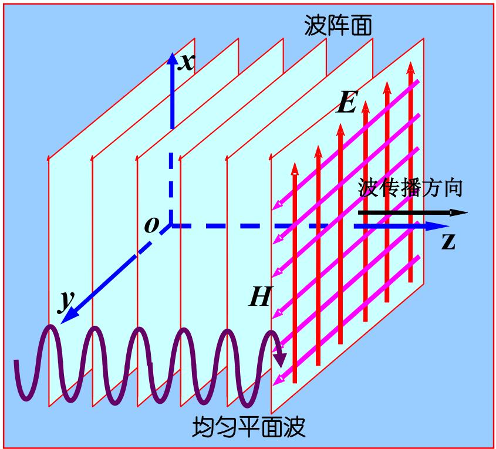

text_image

波阵面
x
E
O
y
H
Z
波传播方向
均匀平面波

# 6.1 理想介质中的均匀平面电磁波

6.1.1 理想介质中的均匀平面波函数  
6.1.2 理想介质中均匀平面波的传播特点  
6.1.3 沿任意方向传播的均匀平面波

注：第五版教材为5.1节内容，第六版教材为6.1节。

# 6.1.1 理想介质中的均匀平面波函数

假设讨论的区域为无源区域，即 $\rho = 0$ ， $\vec{J} = 0$

且该无源空间充满线性、各向同性的均匀理想介质。则时

谐电磁场满足齐次亥姆霍兹方程（4.5.4节内容）

$$
\nabla^ {2} \vec {E} + k ^ {2} \vec {E} = 0, \nabla^ {2} \vec {H} + k ^ {2} \vec {H} = 0
$$

均匀平面波沿 z 轴传播，则电磁强度和磁场强度均不是 x 和 y 的函数，即

$$
\frac {\partial \vec {E}}{\partial x} = \frac {\partial \vec {E}}{\partial y} = 0, \frac {\partial \overrightarrow {H}}{\partial x} = \frac {\partial \overrightarrow {H}}{\partial y} = 0
$$

$$
\Longrightarrow \frac {\mathrm{d} ^ {2} \vec {E}}{\mathrm{d} z ^ {2}} + k ^ {2} \vec {E} = 0, \frac {\mathrm{d} ^ {2} \vec {H}}{\mathrm{d} z ^ {2}} + k ^ {2} \vec {H} = 0
$$

$$
\begin{array}{r l} & {\text {由于} \nabla \bullet \vec {E} = \frac {\partial E _ {x}}{\partial x} + \frac {\partial E _ {y}}{\partial y} + \frac {\partial E _ {z}}{\partial z} = 0 \quad \Longrightarrow \frac {\partial E _ {z}}{\partial z} = 0 \quad \Longrightarrow \quad E _ {z} = 0} \\ & {\text {同理} \nabla \bullet \vec {H} = \frac {\partial H _ {x}}{\partial x} + \frac {\partial H _ {y}}{\partial y} + \frac {\partial H _ {z}}{\partial z} = 0 \quad \Longrightarrow \quad H _ {z} = 0} \end{array}
$$

结论：均匀平面波的电场强度和磁场强度都垂直于波的传播方向——横电磁波（TEM波）

$$
\frac {\mathrm{d} ^ {2} E _ {x}}{\mathrm{d} z ^ {2}} + k ^ {2} E _ {x} = 0
$$

$$
\frac {\mathrm{d} ^ {2} E _ {y}}{\mathrm{d} z ^ {2}} + k ^ {2} E _ {y} = 0
$$

$$
\frac {\mathrm{d} ^ {2} H _ {x}}{\mathrm{d} z ^ {2}} + k ^ {2} H _ {x} = 0
$$

$$
\frac {\mathrm{d} ^ {2} H _ {y}}{\mathrm{d} z ^ {2}} + k ^ {2} H _ {y} = 0
$$

$$
\frac {\mathrm{d} ^ {2} E _ {x} (z)}{\mathrm{d} z ^ {2}} + k ^ {2} E _ {x} (z) = 0 \qquad k = \omega \sqrt {\mu \varepsilon}
$$

其解为： $E_{x}(z)=A_{1}\mathrm{e}^{-jkz}+A_{2}\mathrm{e}^{jkz}$

# 解的物理意义

# 第一项

$$
E _ {1 x} (z) = A _ {1} \mathrm{e} ^ {- j k z} = E _ {1 x m} \mathrm{e} ^ {j \phi_ {1 x}} \mathrm{e} ^ {- j k z}
$$

line

| kπ       | Ex     |
| -------- | ------ |
| π/2      | ∞      |
| π        | ∞      |
| 3π/2     | ∞      |
| 2π       | ∞      |
| 5π/2     | ∞      |
| 3π       | ∞      |
| 7π/2     | ∞      |
| 4π       | ∞      |

$E_{1x} = E_m\cos (\omega t - kz)$ 的波形

$$
E _ {1 x} (z, t) = \operatorname{Re} \left[ E _ {1 x m} \mathrm{e} ^ {j \phi_ {1 x}} \mathrm{e} ^ {- j k z} \mathrm{e} ^ {j \omega t} \right] = E _ {1 x m} \cos (\omega t - k z + \phi_ {1 x})
$$

可见, $A_{1}e^{-jkz}$ 表示沿+z方向传播的波。

第二项 $E_{2x}(z) = A_2\mathrm{e}^{jkz} = E_{2xm}\mathrm{e}^{j\phi_{2x}}\mathrm{e}^{jkz}$

沿 -z 方向传播的波

$$
E _ {2 x} (z, t) = \operatorname{Re} [ E _ {2 x m} \mathrm{e} ^ {j \phi_ {2 x}} \mathrm{e} ^ {j k z} \mathrm{e} ^ {j \omega t} ] = E _ {2 x m} \cos (\omega t + k z + \phi_ {2 x})
$$

# 相伴的磁场

由 $\nabla \times \vec{E} = -j\omega\mu\vec{H}$ ，可得

磁场与电场相互垂直，且同相位

$$
\vec {H} _ {1 y} = \vec {e} _ {y} \frac {j}{\omega \mu} \frac {\partial E _ {1 x}}{\partial z} = \vec {e} _ {y} \frac {k}{\omega \mu} E _ {1 x} = \sqrt {\frac {\varepsilon}{\mu}} \vec {e} _ {z} \times \vec {e} _ {x} E _ {1 x} = \frac {1}{\eta} \vec {e} _ {z} \times \vec {E} _ {1 x}
$$

其中 $\eta = \frac{E_{1x}}{H_{1y}} = \sqrt{\frac{\mu}{\varepsilon}} (\Omega)$ 称为媒质的本征阻抗。在真空中

$$
\eta = \eta_ {0} = \sqrt {\frac {\mu_ {0}}{\varepsilon_ {0}}} = 1 2 0 \pi \approx 3 7 7 \Omega
$$

同理，对于 $\vec{E}_2 = \vec{e}_xE_{2x} = \vec{e}_xA_2\mathrm{e}^{jkz}\Rightarrow \vec{\mathbf{H}}_{2y} = \frac{1}{\eta} (-\vec{e}_z)\times \vec{E}_{2x}$

磁场与电场之间满足关系

$$
\boldsymbol {H} = \frac {1}{\eta} \boldsymbol {e} _ {z} \times \boldsymbol {E}
$$

或者写为

$$
\boldsymbol {E} = \eta \boldsymbol {H} \times \boldsymbol {e} _ {z}
$$

由此可见，电场 $\pmb{E}$ 、磁场 $\pmb{H}$ 与传播方向 $e_z$ 之间相互垂直，且遵循右手螺旋关系，

text_image

x
E
O
H
y
z

理想介质中均匀平面波的 E 和 H

结论：在理想介质中，均匀平面波的电场强度与磁场强度相互垂直，且同相位。

# 6.1.2 理想介质中均匀平面波的传播特点

# 1、均匀平面波的传播参数

# (1) 角频率、频率和周期

角频率 $\omega$ ：表示单位时间内的相位变化，单位为rad/s

周期T：时间相位变化 $2 \pi$ 的时间间隔，即

$$
\omega T = 2 \pi \Longrightarrow T = \frac {2 \pi}{\omega} \quad (\mathrm{s})
$$

频率 f : $f = \frac{1}{T} = \frac{\omega}{2\pi}$ (Hz)

line

| t    | Ex   |
| ---- | ---- |
| 0    | High |
| T    | Low  |

$$
E _ {x} (0, t) = E _ {m} \cos \omega t \text {的曲线}
$$

# (2) 相位常数和波长

相位常数 k：表示波传播单位距离的相位变化

$$
k = \frac {2 \pi}{\lambda} \quad (\mathrm{rad/m})
$$

k 的大小等于空间距离 $2\pi$ 内所包含的波长数目，因此也称为波数。

line

| z    | Ex     |
| ---- | ------ |
| 0    | max    |
| λ    | min    |
| max  | max    |

波长 $\lambda$ ：空间相位差为 $2 \pi$ 的两个波阵面的间距，即

$$
k \lambda = 2 \pi \Longrightarrow \lambda = \frac {2 \pi}{k} = \frac {1}{f \sqrt {\mu \varepsilon}} (\mathrm{m})
$$

(3) 相速（波速）

相速 $v_{p}$ ：电磁波的等相位面在空间中的移动速度

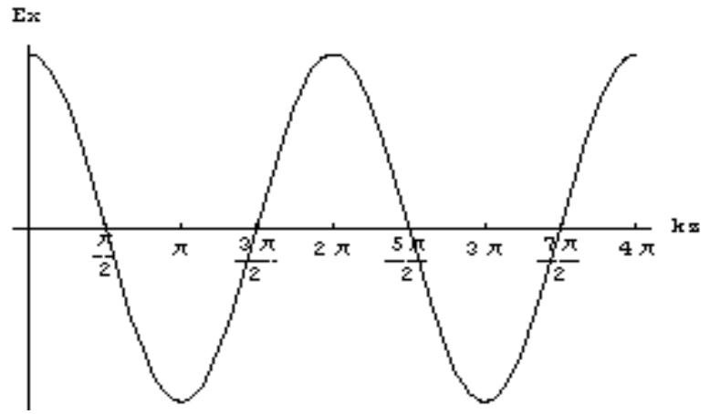

line

| kz       | Ex     |
| -------- | ------ |
| 0        | 1      |
| π/2      | -1     |
| π        | 0      |
| 3π/2     | 1      |
| 2π       | 0      |
| 5π/2     | -1     |
| 3π       | 0      |
| 7π/2     | 1      |
| 4π       | 0      |

由 $\omega t - kz = C$ $\Longrightarrow \omega \mathrm{d}t - k\mathrm{d}z = 0$

故得到均匀平面波的相速为

$$
v _ {p} = \frac {\mathrm{d} z}{\mathrm{d} t} = \frac {\omega}{k} = \frac {\omega}{\omega \sqrt {\mu \varepsilon}} = \frac {1}{\sqrt {\mu \varepsilon}} \xleftarrow {\mathrm{(m/s)}}
$$

相速只与媒质参数有关，而与电磁波的频率无关

真空中： $v_{p}=c=\frac{1}{\sqrt{\mu_{0}\varepsilon_{0}}}=\frac{1}{\sqrt{4\pi\times10^{-7}\times\frac{1}{36\pi}\times10^{-9}}}=3\times10^{8}m/s$

# 2、能量密度与能流密度

由于 $\vec{H} = \frac{1}{\eta}\vec{e}_z\times \vec{E}$ 于是有

$$
w _ {e} = \frac {1}{2} \varepsilon | \vec {E} | ^ {2} = \frac {1}{2} \mu | \vec {H} | ^ {2} = w _ {m} \xleftarrow {\text {电场能量与磁场能量相同}}
$$

故 $w = w_{e} + w_{m} = \varepsilon |\vec{E}|^{2} = \mu |\vec{H}|^{2}$

$$
\vec {S} = \vec {E} (z, t) \times \vec {H} (z, t) = \vec {e} _ {z} \frac {1}{2 \eta} E _ {m} ^ {2} \cos^ {2} (\omega t - k z + \phi_ {x})
$$

$$
w _ {a v} = \frac {1}{2} \varepsilon E _ {m} ^ {2} = \frac {1}{2} \mu H _ {m} ^ {2}
$$

$$
\vec {\bf {S}} _ {a v} = \frac {1}{2} \mathrm{Re} [ \vec {\bf {E}} (z) \times \vec {\bf {H}} ^ {*} (z) ] = \vec {e} _ {z} \frac {1}{2 \eta} E _ {m} ^ {2}
$$

$$
= \vec {e} _ {z} \frac {1}{2} \varepsilon E _ {m} ^ {2} \frac {1}{\sqrt {\mu \varepsilon}} = w _ {a v} \vec {v} _ {p} \xleftarrow {\text {能量的传输速度等于相速}}
$$

# 3、理想介质中的均匀平面波的传播特点

根据前面的分析，可总结出理想介质中的均匀平面波的传播特点为：

电场、磁场与传播方向之间相互垂直，是横电磁波（TEM 波）  
无衰减，电场与磁场的振幅不变

波阻抗为实数，电场与磁场同相位  
电磁波的相速与频率无关，无色散  
电场能量密度等于磁场能量密度，能量的传输速度等于相速

text_image

x
E
o
H
y
z

理想介质中均匀平面波的 $E$ 和 $\pmb{H}$

例6.1.2 频率为9.4GHz的均匀平面波在聚乙烯中传播，设其为无耗的理想介质材料，相对介电常数为 $\varepsilon_{r}=2.26$ 。若磁场的振幅为7 mA/m，求相速、波长、波阻抗和电场强度的振幅值。

解: 由题意 $\varepsilon_{r} = 2.26, \mu_{r} = 1, f = 9.4 \times 10^{9} \mathrm{~Hz}$

因此 $v_{p}=\frac{v_{0}}{\sqrt{\varepsilon_{r}}}=\frac{v_{0}}{\sqrt{2.26}}=1.996\times10^{8}\quad m/s$

$$
\lambda = \frac {v _ {p}}{f} = \frac {1 . 9 9 6 \times 1 0 ^ {8}}{9 . 4 \times 1 0 ^ {9}} = 2. 1 2 \quad \mathrm{cm}
$$

$$
\eta = \sqrt {\frac {\mu}{\varepsilon}} = \frac {\eta_ {0}}{\sqrt {\varepsilon_ {r}}} = \frac {3 7 7}{\sqrt {2 . 2 6}} = 2 5 1 \quad \Omega \quad \vec {H} = \frac {1}{\eta} \vec {e} _ {z} \times \vec {E}
$$

$$
E _ {m} = H _ {m} \eta = 7 \times 1 0 ^ {- 3} \times 2 5 1 = 1. 7 5 7 \quad \mathrm{V/m}
$$

习题5.10: 均匀平面波的磁场强度的振幅为 $\frac{1}{3\pi} \mathrm{A/m}$ , 以相位常数为 $30 \mathrm{rad/m}$ 在空气中沿 $-\vec{e}_z$ 方向传播。当 $t = 0$ 和 $z = 0$ 时, 若 $\vec{H}$ 取向为 $-\vec{e}_y$ , 试写出 $\vec{E}$ 和 $\vec{H}$ 的表示式, 并求出频率和波长。

对应第六版教材第六章课后习题7。

解：以余弦为基准，直接写出

$$
\vec {H} (z, t) = - \vec {e} _ {y} \frac {1}{3 \pi} \cos (\omega t + k z) \quad \mathrm{A/m}
$$

第四版(5.1.22)，第五版(5.1.26)式，第六版（6.1.17）式：

$$
\vec {E} (z, t) = \eta_ {0} \vec {H} (z, t) \times (- \vec {e} _ {z}) = \vec {e} _ {x} 4 0 \cos (\omega t + k z) \quad \mathrm{V/m}
$$

因k=30 rad/m，故

$$
\lambda = \frac {2 \pi}{k} = \frac {2 \pi}{3 0} = 0. 2 1 \mathrm{m}, f = \frac {c}{\lambda} = \frac {3 \times 1 0 ^ {8}}{\pi / 1 5} = \frac {4 5}{\pi} \times 1 0 ^ {8} = 1. 4 3 \times 1 0 ^ {9} \mathrm{Hz}
$$

则 $\vec{H}(z,t) = -\vec{e}_y\frac{1}{3\pi}\cos (90\times 10^8 t + 30z)\quad \mathrm{A / m}$

$$
\vec {E} (z, t) = \vec {e} _ {x} 4 0 \cos (9 0 \times 1 0 ^ {8} t + 3 0 z) \quad \mathrm{V/m}
$$

例6.1.1 频率为100MHz的均匀平面电磁波，在一无耗媒质中沿 +z 方向传播，其电场 $\vec{E} = \vec{e}_{x} E_{x}$ 。已知该媒质的相对介电常数 $\varepsilon_{r} = 4$ 、相对磁导率 $\mu_{r} = 1$ ，且当 t = 0 、 z = 1/8m 时，电场幅值为 $10^{-4} V/m$ 。试求电场强度和磁场强度的瞬时表示式。

解：设电场强度的瞬时表示式为

$$
\vec {E} (z, t) = \vec {e} _ {x} E _ {x} = \vec {e} _ {x} 1 0 ^ {- 4} \cos (\omega t - k z + \phi_ {x})
$$

式中 $\omega = 2\pi f = 2\pi \times 10^{8}$ rad/s

$$
k = \omega \sqrt {\varepsilon \mu} = \frac {\omega}{c} \sqrt {\varepsilon_ {r} \mu_ {r}} = \frac {2 \pi \times 1 0 ^ {8}}{3 \times 1 0 ^ {8}} \sqrt {4} = \frac {4}{3} \pi \mathrm{rad/m}
$$

对于余弦函数，当相角为零时达振幅值。考虑条件 $t = 0$ 、 $z = 1 / 8m$ 时，电场达到幅值，得

$$
\phi_ {x} = k z = \frac {4 \pi}{3} \times \frac {1}{8} = \frac {\pi}{6}
$$

所以

$$
\vec {E} (z, t) = \vec {e} _ {x} 1 0 ^ {- 4} \cos (2 \pi \times 1 0 ^ {8} t - \frac {4 \pi}{3} z + \frac {\pi}{6})
$$

$$
= \vec {e} _ {x} 1 0 ^ {- 4} \cos [ 2 \pi \times 1 0 ^ {8} t - \frac {4 \pi}{3} (z - \frac {1}{8}) ] \quad \mathrm{V/m}
$$

磁场强度的瞬时表示式为

$$
\vec {H} = \frac {1}{\eta} \vec {e} _ {z} \times \vec {E} = \vec {e} _ {y} \frac {1}{\eta} E _ {x}
$$

式中

$$
\eta = \sqrt {\frac {\mu}{\varepsilon}} = \frac {\eta_ {0}}{\sqrt {\varepsilon_ {r}}} = 6 0 \pi \quad \Omega
$$

因此

$$
\vec {H} (z, t) = \vec {e} _ {y} \frac {1 0 ^ {- 4}}{6 0 \pi} \cos [ 2 \pi \times 1 0 ^ {8} t - \frac {4}{3} \pi (z - \frac {1}{8}) ] \quad \mathrm{A/m}
$$

例6.1.3 自由空间中平面波的电场强度 $\vec{E} = \vec{e}_{x} 50 \cos(\omega t - kz) \, \text{V/m}$ ，求在 $z = z_{0}$ 处垂直穿过半径 R = 2.5m 的圆平面的平均功率。

解: 电场强度的复数表示式为 $\vec{E} = \vec{e}_x 50 e^{-jkz}$

自由空间的本征阻抗为 $\eta_0 = 120\pi$ $\Omega$

故得到该平面波的磁场强度 $\vec{H} = \frac{1}{\eta}\vec{e}_z\times \vec{E} = \vec{e}_y\frac{E}{\eta_0} = \vec{e}_y\frac{5}{12\pi}\mathrm{e}^{-jkz}\mathrm{A / m}$ 于是，平均坡印廷矢量

$$
\vec {S} _ {a v} = \frac {1}{2} \operatorname{Re} (\vec {E} \times \vec {H} ^ {*}) = \vec {e} _ {z} \frac {1}{2} \times 5 0 \times \frac {5}{1 2 \pi} = \vec {e} _ {z} \frac {1 2 5}{1 2 \pi} \quad \mathrm {W/ m^ {2}}
$$

垂直穿过半径R=2.5m的圆平面的平均功率

$$
P _ {a v} = \int_ {S} \vec {\boldsymbol {S}} _ {a v} \cdot \mathrm{d} \vec {\boldsymbol {S}} = \frac {1 2 5}{1 2 \pi} \times \pi R ^ {2} = \frac {1 2 5}{1 2 \pi} \times \pi \times 2. 5 ^ {2} = 6 5. 1 \quad \mathrm{W}
$$

# 6.1.3 沿任意方向传播的均匀平面波

沿+z方向传播的均匀平面波

$$
\vec {\bf E} (z) = \vec {\bf E} _ {m} {\bf e} ^ {- j k z} = \vec {\bf E} _ {m} {\bf e} ^ {- j k \vec {e} _ {z} \cdot \vec {r}}
$$

$$
\vec {k} = \vec {e} _ {z} k
$$

$$
\vec {e} _ {z} \cdot \vec {E} _ {m} = 0
$$

$$
\vec {H} (z) = \frac {1}{\eta} \vec {e} _ {z} \times \vec {E} (z)
$$

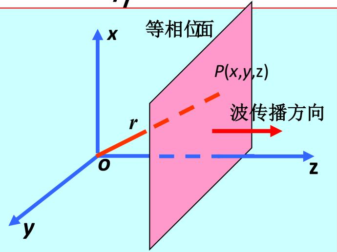

text_image

等相位面
P(x,y,z)
波传播方向
r
O
y
x
z

沿 $+\mathbf{z}$ 方向传播的均匀平面波

沿 $\vec{e}_n$ 传播方向的均匀平面波

$$
\vec {\bf E} (\vec {r}) = \vec {\bf E} _ {m} {\bf e} ^ {- j k \vec {e} _ {n} \cdot \vec {r}} = \vec {\bf E} _ {m} {\bf e} ^ {- j (k _ {x} x + k _ {y} y + k _ {z} z)}
$$

$$
\vec {k} = \vec {e} _ {n} k = \vec {e} _ {x} k _ {x} + \vec {e} _ {y} k _ {y} + \vec {e} _ {z} k _ {z}
$$

$$
\vec {e} _ {n} \cdot \vec {\mathbf {E}} _ {m} = 0
$$

$$
\vec {H} (\vec {r}) = \frac {1}{\eta} \vec {e} _ {n} \times \vec {E} (\vec {r})
$$

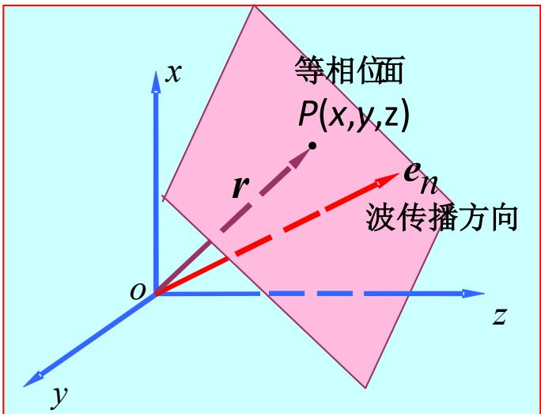

text_image

等相位面
P(x,y,z)
r
e_n
波传播方向
x
o
y
z

沿任意方向传播的均匀平面波

例6.1.4 频率 $f = 500\mathrm{kHz}$ 的均匀平面波，在 $\mu = \mu_0, \varepsilon = \varepsilon_0\varepsilon_{\mathrm{r}}, \sigma = 0$ 的无损耗媒质中传播。已知 $E_0 = e_x2 - e_y + e_z\mathrm{kV / m}, H_0 = e_x6 + e_y9 - e_z3\mathrm{A / m}$ 求：(1) 传播方向 $e_n$ ；(2) $\varepsilon_{\mathrm{r}}$ 和 $\lambda$ 。

解：(1) $e_{n}=e_{E}\times e_{H}=\frac{E_{0}\times H_{0}}{|E_{0}||H_{0}|}=\frac{1}{\sqrt{21}}(-e_{x}+e_{y}2+e_{z}4)$

(2) 由 $\eta = \frac{\eta_0}{\sqrt{\epsilon_r}} = \frac{|E_0|}{|H_0|} = \frac{10^3}{\sqrt{21}}$ ，得到

$$
\varepsilon_ {\mathrm{r}} = \frac {2 1 \eta_ {0} ^ {2}}{1 0 ^ {6}} = 2. 9 8
$$

$$
\lambda = \frac {\lambda_ {0}}{\sqrt {\varepsilon_ {\mathrm{r}}}} = 0. 5 8 \frac {v _ {0}}{f} = 3 4 7. 3 \mathrm{m}
$$

$$
\lambda = \frac {2 \pi}{k} = \frac {1}{f \sqrt {\mu \varepsilon}}
$$

补充：在空气中传播的均匀平面波的磁场强度的复数表示式为

$$
\vec {H} = (- \vec {e} _ {x} A + \vec {e} _ {y} 2 + \vec {e} _ {z} 4) \mathbf {e} ^ {- j (4 \pi x + 3 \pi z)}
$$

式中 $A$ 为常数。求:

(1) 波矢量 $\vec{k}$ ;  
(2) 波长和频率;  
(3) A的值;   
(4) 相伴电场的复数形式;  
(5) 平均坡印廷矢量。

解：（1）因为 $\vec{H} = \vec{H}_{m} e^{-j\vec{k} \cdot \vec{r}}$ ，所以

$$
\vec {H} _ {m} = - \vec {e} _ {x} A + \vec {e} _ {y} 2 + \vec {e} _ {z} 4, \quad \vec {k} \cdot \vec {r} = k _ {x} x + k _ {y} y + k _ {z} z = 4 \pi x + 3 \pi z
$$

则 $k_{x} = 4\pi$ 、 $k_{y} = 0$ 、 $k_{z} = 3\pi$ ， $\vec{k} = \vec{e}_x4\pi +\vec{e}_z3\pi$

$$
\left| \vec {k} \right| = \sqrt {(3 \pi) ^ {2} + (4 \pi) ^ {2}} = 5 \pi
$$

$$
\hat {e} _ {n} = \frac {\vec {k}}{| \vec {k} |} = \vec {e} _ {x} \frac {4}{5} + \vec {e} _ {z} \frac {3}{5}
$$

(2) $\lambda = \frac{2\pi}{k} = \frac{2\pi}{5\pi} = \frac{2}{5}\mathrm{m}, f = \frac{c}{\lambda} = \frac{3\times 10^{8}}{2 / 5} = 7.5\times 10^{8}\mathrm{Hz}$

(3) $\vec{k} \cdot \vec{H}_m = 4\pi(-A) + 0 \times 2 + 3\pi \cdot 4 = 0 \Rightarrow A = 3$

$$
\begin{array}{l} = 1 2 0 \pi (- \vec {e} _ {x} 3 + \vec {e} _ {y} 2 + \vec {e} _ {z} 4) e ^ {- j (4 \pi x + 3 \pi z)} \times (\vec {e} _ {x} \frac {4}{5} + \vec {e} _ {z} \frac {3}{5}) \\ = 1 2 0 \pi (\vec {e} _ {x} 1. 2 + \vec {e} _ {y} 5 - \vec {e} _ {z} 1. 6) e ^ {- j (4 \pi x + 3 \pi z)} \\ \end{array}
$$

(4) $\vec{E} (\vec{r}) = \eta_0\vec{H} (\vec{r})\times \vec{e}_n$

(5) $\vec{S}_{av} = \frac{1}{2}\mathrm{Re}[\vec{E}\times \vec{H}^{*}]$

$$
= \frac {1}{2} \operatorname{Re} \left\{1 2 0 \pi \left(\vec {e} _ {x} 1. 2 + \vec {e} _ {y} 5 - \vec {e} _ {z} 1. 6\right) e ^ {- j (4 \pi x + 3 \pi z)} \right.
$$

$$
\left. \times [ (- \vec {e} _ {x} 3 + \vec {e} _ {y} 2 + \vec {e} _ {z} 4) e ^ {- j (4 \pi x + 3 \pi z)} ] ^ {*} \right\}
$$

$$
= 1 2 \pi \times 2 9 \times (\vec {e} _ {x} 4 + \vec {e} _ {z} 3) W / m ^ {2}
$$

# 6.2 导电媒质中的均匀平面电磁波

导电媒质的典型特征是电导率 $\sigma \neq 0$   
电磁波在导电媒质中传播时，有传导电流 $J = \sigma E$ 存在，同时伴随着电磁能量的损耗  
电磁波的传播特性与无损耗媒质中的传播特性有所不同

注意：同学们需要先认真复习第六版5.4节所讲过的内容，再学习本节内容。

# 导电媒质中的均匀平面波（场解表达）

在均匀的导电媒质中,由

$$
\boldsymbol {\nabla} \times \boldsymbol {H} = \boldsymbol {J} + \mathrm{j} \omega \varepsilon \boldsymbol {E} = \mathrm{j} \omega \left(\varepsilon - \mathrm{j} \frac {\sigma}{\omega}\right) \boldsymbol {E} = \mathrm{j} \omega \varepsilon_ {\mathrm{c}} \boldsymbol {E}
$$

可得到

$$
\nabla \cdot \boldsymbol {E} = \frac {1}{\mathrm{j} \omega \varepsilon_ {\mathrm{c}}} \nabla \cdot (\nabla \times \boldsymbol {H}) = 0
$$

因此可见,在均匀的导电媒质中,虽然传导电流密度 $J \neq 0$ ,但不存在自由电荷密度,即 $\rho = 0$ 。

波动方程

$$
\nabla^ {2} \overrightarrow {E} + k _ {c} ^ {2} \overrightarrow {E} = 0 (k _ {c} = \omega \sqrt {\mu \varepsilon_ {c}})
$$

沿 z 轴传播的均匀平面波解为

$$
\vec {E} (z) = \vec {e} _ {x} E _ {x} (z) = \vec {e} _ {x} E _ {x m} e ^ {- j k _ {c} z} e ^ {j \phi_ {x}}
$$

令 $\gamma = jk_{c} = \alpha + j\beta$ ，则均匀平面波解为

振幅有衰减

$$
\vec {E} (z) = \vec {e} _ {x} E _ {x m} \mathrm{e} ^ {- \gamma z} = \vec {e} _ {x} E _ {x m} \mathrm{e} ^ {- \alpha z} \mathrm{e} ^ {- j \beta z} e ^ {j \phi_ {x}}
$$

$$
\vec {E} (z) = \vec {e} _ {x} E _ {x m} \mathrm{e} ^ {- \gamma z} = \vec {e} _ {x} E _ {x m} \mathrm{e} ^ {- \alpha z} \mathrm{e} ^ {- j \beta z} e ^ {j \phi_ {x}}
$$

瞬时值形式 $\vec{E} (z,t) = \vec{e}_xE_{xm}\mathrm{e}^{-\alpha z}\cos (\omega t - \beta z + \phi_x)$

γ称为电磁波的传播常数，单位：1/m

$\mathrm{e}^{-\alpha z}$ 是衰减因子。 $\alpha$ 称为衰减常数，单位： $\mathrm{Np / m}$ （奈培/米） $\mathrm{e}^{-j\beta z}$ 是相位因子。 $\beta$ 称为相位常数，单位： $\mathrm{rad / m}$ （弧度/米）

# 相伴的磁场

$$
\nabla \times \vec {E} = - j \omega \mu \vec {H}
$$

$$
\overrightarrow {H} (z) = \vec {e} _ {y} \sqrt {\frac {\varepsilon_ {c}}{\mu}} \mathrm{E} _ {x m} e ^ {- \gamma z} = \vec {e} _ {y} \frac {1}{\eta_ {c}} \mathrm{E} _ {x m} e ^ {- \alpha z} e ^ {- j \beta z + j \phi_ {x}}
$$

$$
\overrightarrow {H} (z) = \frac {1}{\eta_ {c}} \vec {e} _ {z} \times \overrightarrow {E} (z) = \vec {e} _ {y} \frac {1}{| \eta_ {c} | e ^ {j \phi}} E _ {x m} e ^ {- \alpha z} e ^ {- j \beta z + j \phi_ {x}}
$$

本征阻抗 $\eta_{c} = \sqrt{\frac{\mu}{\varepsilon_{c}}} = |\eta_{c}|e^{j\phi}$ 磁场滞后于电场

瞬时值: $\overrightarrow{H}(z,t) = \vec{e}_y\frac{1}{|\eta_c|} E_{xm}\mathrm{e}^{-\alpha z}\cos (\omega t - \beta z + \phi_x - \phi)$

本征阻抗 $\eta_{c}=\sqrt{\frac{\mu}{\varepsilon_{c}}}=\left|\eta_{c}\right|e^{j\phi}$ 磁场滞后于电场

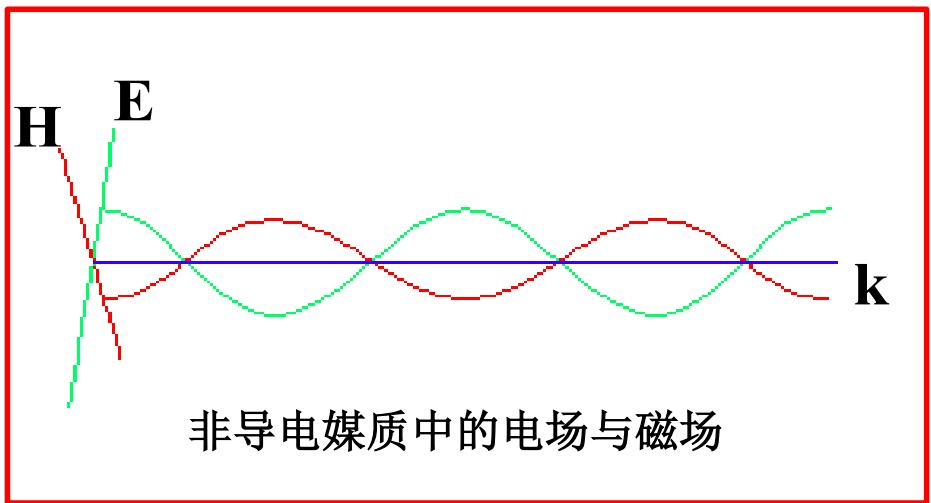

text_image

H E
非导电媒质中的电场与磁场
k

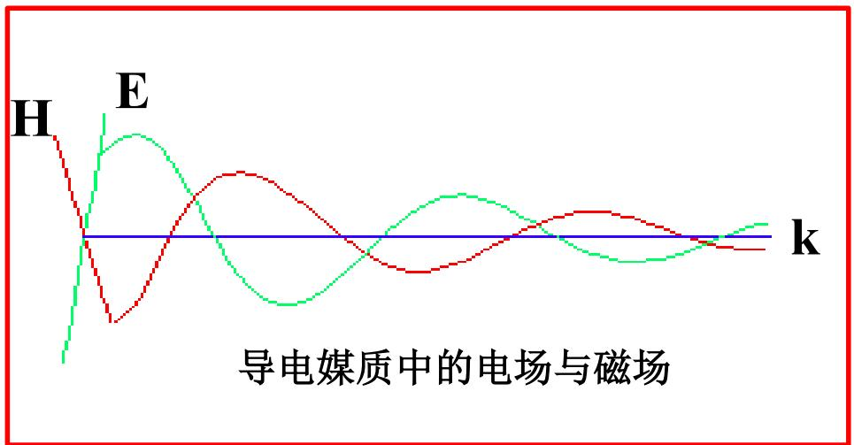

line

| Point | Red Line Value | Green Line Value |
|-------|----------------|------------------|
| H     | High           | Low              |
| E     | Medium         | High             |
| k     | Low            | Low              |

# 传播参数

$$
\left\{ \begin{array}{l} \gamma^ {2} = (j k _ {c}) ^ {2} = - k _ {c} ^ {2} = - \omega^ {2} \mu (\varepsilon - j \frac {\sigma}{\omega}) \\ \gamma^ {2} = (\alpha + j \beta) ^ {2} = \alpha^ {2} - \beta^ {2} + j 2 \alpha \beta \end{array} \right.
$$

$$
\Longrightarrow \left\{ \begin{array}{l} \alpha^ {2} - \beta^ {2} = - \omega^ {2} \mu \varepsilon \\ 2 \alpha \beta = \omega \mu \sigma \end{array} \right.
$$

$$
\alpha = \omega \sqrt {\frac {\mu \varepsilon}{2} \left[ \sqrt {1 + (\frac {\sigma}{\omega \varepsilon}) ^ {2}} - 1 \right]},
$$

$$
\beta = \omega \sqrt {\frac {\mu \varepsilon}{2} \left[ \sqrt {1 + (\frac {\sigma}{\omega \varepsilon}) ^ {2}} + 1 \right]}
$$

$$
\beta = \omega \sqrt {\frac {\mu \varepsilon}{2} \left[ \sqrt {1 + (\frac {\sigma}{\omega \varepsilon}) ^ {2}} + 1 \right]}
$$

$$
\lambda = \frac {2 \pi}{\beta} = 1 / \left\{f \sqrt {\frac {\mu \varepsilon}{2} \left[ \sqrt {1 + (\frac {\sigma}{\omega \varepsilon}) ^ {2}} + 1 \right]} \right\}
$$

$$
v _ {P} = \frac {\omega}{\beta} = 1 / \sqrt {\frac {\mu \varepsilon}{2} \left[ \sqrt {1 + \left(\frac {\sigma}{\omega \varepsilon}\right) ^ {2}} + 1 \right]}
$$

相速不仅与媒质参数有关，而与电磁波的频率有关

$$
w _ {\text {eav}} = \frac {1}{4} \operatorname{Re} \left[ \varepsilon_ {\mathrm{c}} \boldsymbol {E} \cdot \boldsymbol {E} ^ {*} \right] = \frac {\varepsilon}{4} E _ {x \mathrm{m}} ^ {2} \mathrm{e} ^ {- 2 a z}
$$

$$
w _ {\text { m   a   v }} = \frac {1}{4} \operatorname{Re} [ \mu \boldsymbol {H} \cdot \boldsymbol {H} ^ {*} ] = \frac {\mu}{4} \frac {E _ {x m} ^ {2}}{| \eta_ {c} | ^ {2}} e ^ {- 2 a z}
$$

$$
= \frac {\varepsilon}{4} E _ {x m} ^ {2} \mathrm{e} ^ {- 2 a z} \left[ 1 + \left(\frac {\sigma}{\omega \varepsilon}\right) ^ {2} \right] ^ {1 / 2}
$$

平均坡印廷矢量

$$
\vec {S} _ {a v} = \frac {1}{2} \mathrm{Re} [ \vec {E} (z) \times \vec {H} ^ {*} (z) ] = \vec {e} _ {z} \frac {1}{2 | \eta_ {c} |} E _ {x m} ^ {2} e ^ {- 2 \alpha z} \cos \phi
$$

# 导电媒质中均匀平面波的传播特点

电场强度E、磁场强度H与波的传播方向相互垂直，是横电磁波（TEM波）；  
在波的传播过程中，电场与磁场的振幅呈指数衰减；  
媒质的本征阻抗为复数，电场与磁场不同相位，磁场滞后于电场，相位差 $\phi$ ；  
- 波的传播速度（相速）不仅与媒质参数有关，而与频率有关（有色散）。  
平均磁场能量密度大于平均电场能量密度。

# 媒质弱导电和强导电情况下的传播常数与波阻抗

$$
\begin{array}{r l} & {\text {弱导电媒质} \quad \frac {\sigma}{\omega \varepsilon} <   <   1} \\ & {\gamma = j \omega \sqrt {\mu \varepsilon} (1 + \frac {\sigma}{j \omega \varepsilon}) ^ {1 / 2} \approx j \omega \sqrt {\mu \varepsilon} + \frac {\sigma}{2} \sqrt {\frac {\mu}{\varepsilon}} \xrightarrow [ \beta \approx \omega \sqrt {\mu \varepsilon} ]{\alpha \approx \frac {\sigma}{2} \sqrt {\frac {\mu}{\varepsilon}}}} \\ & {\eta_ {c} = \sqrt {\frac {\mu}{\varepsilon_ {c}}} = \sqrt {\frac {\mu}{\varepsilon}} (1 + \frac {\sigma}{j \omega \varepsilon}) ^ {- 1 / 2} \approx \sqrt {\frac {\mu}{\varepsilon}} (1 + j \frac {\sigma}{2 \omega \varepsilon})} \\ & {(1 + x) ^ {- 1 / 2} \approx 1 - \frac {x}{2}} \end{array}
$$

# 弱导电媒质中均匀平面波的特点

□ 衰减小;   
□ 相位常数和非导电媒质中的相位常数大致相等;  
☐ 电场和磁场存在较小的相位差。

# 良导体中的均匀平面波

良导体: $\frac{\sigma}{\omega\varepsilon} >> 1$

金、银、铜、铁、铝等金属对于无线电波均是良导体。

例如铜： $\frac{\sigma}{\omega\varepsilon} = \frac{1.04\times 10^{18}}{f}$

# 良导体中的参数

$$
\gamma = j \omega \sqrt {\mu \varepsilon} (1 - j \frac {\sigma}{\omega \varepsilon}) ^ {1 / 2} \approx \sqrt {j \omega \mu \sigma} = \sqrt {\omega \mu \sigma} \mathrm{e} ^ {j 4 5 ^ {\circ}} = \sqrt {\frac {\omega \mu \sigma}{2}} (1 + j)
$$

$$
\begin{array}{r l}&{\rightarrow \alpha \approx \beta \approx \sqrt {\frac {\omega \mu \sigma}{2}} \approx \sqrt {\pi f \mu \sigma}}\\&{\text {相速} v _ {p} = \frac {\omega}{\beta} \approx \frac {\omega}{\sqrt {\pi f \mu \sigma}} = \sqrt {\frac {2 \omega}{\mu \sigma}}}\\&{\text {皮长:} \lambda = \frac {2 \pi}{\beta} \approx \frac {2 \pi}{\sqrt {\pi f \mu \sigma}} = 2 \sqrt {\frac {\pi}{f \mu \sigma}} \quad \propto 1 / \sqrt {f}}\end{array}
$$

本征阻抗 $\eta_{c} = \sqrt{\frac{\mu}{\varepsilon_{c}}}\approx \sqrt{\frac{j\omega\mu}{\sigma}}\approx \sqrt{\frac{2\pi f\mu}{\sigma}}\mathrm{e}^{j45^{\circ}} = (1 + j)\sqrt{\frac{\pi f\mu}{\sigma}}$

良导体中电磁波的磁场强度的相位滞后于电场强度45°。

$$
\alpha \approx \sqrt {\pi f \mu \sigma}
$$

例如，频率 $f = 3\mathrm{MHz}$ 时，电磁波在铜 $(\sigma = 5.8\times 10^{7}\mathrm{S / m},\mu_{\mathrm{r}} = 1)$ 中的

$$
\alpha \approx 2. 6 2 \times 1 0 ^ {4} \mathrm{Np/m},
$$

趋肤效应：电磁波的频率越高，衰减系数越大，高频电磁波只能存在于良导体的表面层内，称为趋肤效应。

趋肤深度（δ）：电磁波进入良导体后，其振幅下降到表面处振幅的1/e时所传播的距离。即

$$
E _ {m} \mathrm{e} ^ {- \alpha \delta} = \frac {E _ {m}}{\mathrm{e}} \Longrightarrow \delta = \frac {1}{\alpha} = \frac {1}{\sqrt {\pi f \mu \sigma}}
$$

text_image

E_m
E_m / e
δ
趋肤深度δ

$$
\delta = \frac {1}{\alpha} = \frac {1}{\sqrt {\pi f \mu \sigma}}
$$

铜： $\mu = \mu_{0} = 4\pi \times 10^{-7}\mathrm{H / m},\sigma = 5.8\times 10^{-7}\mathrm{S / m}$

$$
f = 5 0 \mathrm{Hz}, \quad \delta = \frac {6 . 6 \times 1 0 ^ {- 2}}{\sqrt {5 0}} = 9. 3 3 \times 1 0 ^ {- 3} \mathrm{m}
$$

$$
f = 1 \mathrm{MHz}, \quad \delta = \frac {6 . 6 \times 1 0 ^ {- 2}}{\sqrt {1 0 ^ {6}}} = 6. 6 \times 1 0 ^ {- 5} \mathrm{m}
$$

$$
f = 1 0 \mathrm{GHz}, \quad \delta = \frac {6 . 6 \times 1 0 ^ {- 2}}{\sqrt {1 0 \times 1 0 ^ {9}}} = 6. 6 \times 1 0 ^ {- 7} \mathrm{m}
$$

良导体的本征阻抗为

$$
\eta_ {\mathrm{c}} \approx (1 + \mathrm{j}) \sqrt {\frac {\pi f \mu}{\sigma}} = R _ {\mathrm{S}} + \mathrm{j} X _ {\mathrm{S}}
$$

具有相等的电阻和电抗分量

$$
R _ {S} = X _ {S} = \sqrt {\frac {\pi f \mu}{\sigma}} = \frac {1}{\sigma \delta}
$$

表6.2.1一些金属材料的趋肤深度和表面电阻

<table><tr><td>材料名称</td><td>电导率 $\sigma /(S/m)$ </td><td>趋肤深度 $\delta /m$ </td><td>表面电阻 $R_S/Ω$ </td></tr><tr><td>银</td><td> $6.17\times 10^7$ </td><td> $0.064/\sqrt{f}$ </td><td> $2.52\times 10^{-7}\sqrt{f}$ </td></tr><tr><td>紫铜</td><td> $5.8\times 10^7$ </td><td> $0.066/\sqrt{f}$ </td><td> $2.61\times 10^{-7}\sqrt{f}$ </td></tr><tr><td>铝</td><td> $3.72\times 10^7$ </td><td> $0.083/\sqrt{f}$ </td><td> $3.26\times 10^{-7}\sqrt{f}$ </td></tr><tr><td>钠</td><td> $2.1\times 10^7$ </td><td> $0.11/\sqrt{f}$ </td><td></td></tr><tr><td>黄铜</td><td> $1.6\times 10^7$ </td><td> $0.13/\sqrt{f}$ </td><td> $5.01\times 10^{-7}\sqrt{f}$ </td></tr><tr><td>锡</td><td> $0.87\times 10^7$ </td><td> $0.17/\sqrt{f}$ </td><td></td></tr><tr><td>石墨</td><td> $0.01\times 10^7$ </td><td> $1.6/\sqrt{f}$ </td><td></td></tr></table>

例6.2.2 在进行电磁测量时，为了防止室内的电子设备受外界电磁场的干扰，可采用金属铜板构造屏蔽室，通常取铜板厚度大于 $5\delta$ 就能满足要求。若要求屏蔽的电磁干扰频率范围从 $10\mathrm{kHz}$ 到 $100\mathrm{MHz}$ ，试计算至少需要多厚的铜板才能达到要求。铜的参数为 $\mu = \mu_0$ 、 $\varepsilon = \varepsilon_0$ 、 $\sigma = 5.8 \times 10^7\mathrm{S / m}$ 。

解: 对于频率范围的低端 $f_{L}=10kHz$ ，有

$$
\frac {\sigma}{\omega_ {L} \varepsilon} = \frac {5 . 8 \times 1 0 ^ {7}}{2 \pi \times 1 0 ^ {4} \times \frac {1}{3 6 \pi} \times 1 0 ^ {- 9}} = 1. 0 4 \times 1 0 ^ {1 4} \gg 1
$$

对于频率范围的高端 $f_{H}=100MHz$ ，有

$$
\frac {\sigma}{\omega_ {H} \varepsilon} = \frac {5 . 8 \times 1 0 ^ {7}}{2 \pi \times 1 0 ^ {8} \times \frac {1}{3 6 \pi} \times 1 0 ^ {- 9}} = 1. 0 4 \times 1 0 ^ {1 0} \gg 1
$$

由此可见，在要求的频率范围内均可将铜视为良导体，故

$$
\delta_ {L} = \frac {1}{\sqrt {\pi f _ {L} \mu \sigma}} = \frac {1}{\sqrt {\pi \times 1 0 ^ {4} \times 4 \pi \times 1 0 ^ {- 7} \times 5 . 8 \times 1 0 ^ {7}}} = 0. 6 6 \mathrm{mm}
$$

$$
\delta_ {H} = \frac {1}{\sqrt {\pi f _ {H} \mu \sigma}} = \frac {1}{\sqrt {\pi \times 1 0 ^ {8} \times 4 \pi \times 1 0 ^ {- 7} \times 5 . 8 \times 1 0 ^ {7}}} = 6. 6 \mu \mathrm{m}
$$

为了满足给定的频率范围内的屏蔽要求，故铜板的厚度d至少应为

$$
d = 5 \delta_ {L} = 3. 3 \quad \mathrm{mm}
$$

例6.2.1 一沿 x 方向极化的线极化波在海水中传播，取 + z 轴方向为传播方向。已知海水的媒质参数为 $\varepsilon_{r} = 81$ 、 $\mu_{r} = 1$ 、 $\sigma = 4S/m$ ，在 z = 0 处的电场 $E_{x} = 100\cos(10^{7}\pi t)$ V/m。求：

(1) 衰减常数、相位常数、本征阻抗、相速、波长及趋肤深度;   
(2) 电场强度幅值减小为 $z = 0$ 处的1/1000时，波传播的距离  
(3) z = 0.8m 处的电场强度和磁场强度的瞬时表达式;   
(4) $z = 0.8m$ 处穿过 $1m^{2}$ 面积的平均功率。

解: (1) 根据题意, 有

$$
\omega = 1 0 ^ {7} \pi \mathrm{rad/s} f = \frac {\omega}{2 \pi} = 5 \times 1 0 ^ {6} \quad \mathrm{Hz}
$$

所以 $\frac{\sigma}{\omega\varepsilon}=\frac{4}{10^{7}\pi\times(\frac{1}{36\pi}\times10^{-9})\times81}=178\gg1$

此时海水可视为良导体。

故衰减常数 $\alpha = \sqrt{\pi f\mu\sigma} = \sqrt{\pi\times 5\times 10^{6}\times 4\pi\times 10^{-7}\times 4} = 8.89\mathrm{Np / m}$

$$
\beta = \alpha = 8. 8 9 \mathrm{rad/m}
$$

本征阻抗 $\eta_{c} = \sqrt{\frac{\omega\mu}{\sigma}}\mathrm{e}^{j\frac{\pi}{4}} = \sqrt{\frac{10^{7}\pi\times 4\pi\times 10^{-7}}{4}}\mathrm{e}^{j\frac{\pi}{4}} = \pi \mathrm{e}^{j\frac{\pi}{4}}\Omega$

相速 $v_{p}=\frac{\omega}{\beta}=\frac{10^{7}\pi}{8.89}=3.53\times10^{6}\ m/s$

波长 $\lambda = \frac{2\pi}{\beta} = \frac{2\pi}{8.89} = 0.707\mathrm{m}$

趋肤深度 $\delta=\frac{1}{\alpha}=\frac{1}{8.89}=0.112\ m$

(2) 令 $e^{-\alpha z} = 1/1000$ ，即 $e^{\alpha z} = 1000$ ，由此得到电场强度幅值减小为 $z = 0$ 处的 $1/1000$ 时，波传播的距离

$$
z = \frac {1}{\alpha} \ln 1 0 0 0 = \frac {2 . 3 0 2}{8 . 8 9} = 0. 7 7 7 \mathrm{m}
$$

(3) 根据题意, 电场的瞬时表达式为

$$
E (z, t) = e _ {x} 1 0 0 \mathrm{e} ^ {- 8. 8 9 z} \cos (1 0 ^ {7} t - 8. 8 9 z)
$$

在z=0.8m处，电场的瞬时表达式为

$$
\begin{array}{l} E (0. 8, t) = e _ {x} 1 0 0 \mathrm{e} ^ {- 8. 8 9 \times 0. 8} \cos (1 0 ^ {7} \pi t - 8. 8 9 \times 0. 8) \\ = e _ {x} 0. 0 8 2 \cos (1 0 ^ {7} \pi t - 7. 1 1) \quad \mathrm{V/m} \\ \end{array}
$$

磁场的瞬时表达式为

$$
\begin{array}{l} \boldsymbol {H} (0. 8, t) = \boldsymbol {e} _ {y} \frac {1 0 0 e ^ {- 8 . 8 9 \times 0 . 8}}{| \eta_ {c} |} \cos (1 0 ^ {7} \pi t - 8. 8 9 \times 0. 8 - \frac {\pi}{4}) \\ = e _ {y} 0. 0 2 6 \cos \left(1 0 ^ {7} \pi t - 1. 6 1\right) \quad \mathrm{A/m} \\ \end{array}
$$

(4) 在 $z = 0.8 \mathrm{~m}$ 处的平均坡印廷矢量

$$
\begin{array}{l} \pmb {S} _ {a v} = \pmb {e} _ {z} \frac {1}{2 | \eta_ {c} |} E _ {x m} ^ {2} \mathrm{e} ^ {- 2 \alpha z} \cos \phi \\ = e _ {z} \frac {1 0 0 ^ {2}}{2 \pi} \mathrm{e} ^ {- 2 \times 8. 8 9 \times 0. 8} \cos \frac {\pi}{4} \\ = e _ {z} 0. 7 5 \quad \mathrm{mW/m} ^ {2} \\ \end{array}
$$

穿过 $1 ~m^{2}$ 的平均功率 $P_{av} = 0.75 ~mW$

由此可知，电磁波在海水中传播时衰减很快，尤其在高频时，衰减更为严重，这给潜艇之间的通信带来了很大的困难。若为保持低衰减，工作频率必须很低，但即使在1kHz的低频下，衰减仍然很明显。

line

| f(Hz) | δ(m) |
|-------|------|
| 10    | 80   |
| 100   | 30   |
| 1000  | 10   |
| 10000 | 2    |

海水中的趋肤深度随频率变化的曲线

# 色散与群速

色散现象：相速随频率变化

电磁波的传播特性与介质参数( $\varepsilon$ 、 $\mu$ 和 $\sigma$ )有关，当这些参数和传播常数随频率变化时，不同频率电磁波的传播特性就会有所不同，这就是色散效应，这种媒质称为色散媒质。

我们知道，一个信号总是由许许多多频率成分组成，稳态的单一频率正弦行波是不能携带任何信号的，“信号”之所以能传递，是由于对波调制的结果。调制波传播的速度才是信号传递的速度。用相速无法描述一个信号在色散媒质中的传播速度，因此，需要引入“群速”概念。

载有信息的电磁波通常是由一个高频载波和以载频为中心向两侧扩展的频带所构成的波包，波包包络传播的速度就“群速”。下面讨论窄带信号在色散媒质中传播的情况。

# 不同频率电磁波的叠加

两个振幅均为 $E_{m}$ 、角频率分别为 $\omega + \Delta\omega$ 和 $\omega - \Delta\omega$ 、相位常数分别为 $\beta + \Delta\beta$ 和 $\beta - \Delta\beta$ 的同向行波

$$
\vec {E} _ {1} (z, t) = \vec {e} _ {x} E _ {m} \cos [ (\omega + \Delta \omega) t - (\beta + \Delta \beta) z ]
$$

$$
\vec {E} _ {2} (z, t) = \vec {e} _ {x} E _ {m} \cos [ (\omega - \Delta \omega) t - (\beta - \Delta \beta) z ]
$$

# 合成波电场

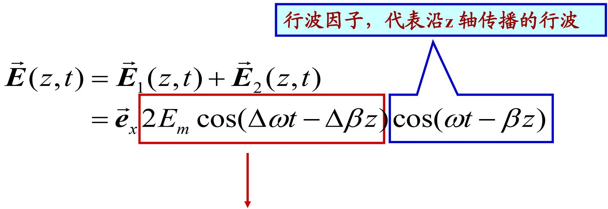

text_image

行波因子，代表沿z轴传播的行波
\vec{E}(z,t) = \vec{E}_1(z,t) + \vec{E}_2(z,t)
= \vec{e}_x 2E_m \cos(\Delta\omega t - \Delta\beta z) \cos(\omega t - \beta z)

振幅，包络波，以角频率 $\Delta \omega$ 缓慢变化

$$
\vec {E} (z, t) = \vec {E} _ {1} (z, t) + \vec {E} _ {2} (z, t) = \vec {e} _ {x} 2 E _ {m} \cos (\Delta \omega t - \Delta \beta z) \cos (\omega t - \beta z)
$$

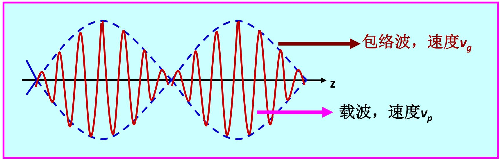

text_image

包络波，速度v_g
载波，速度v_p

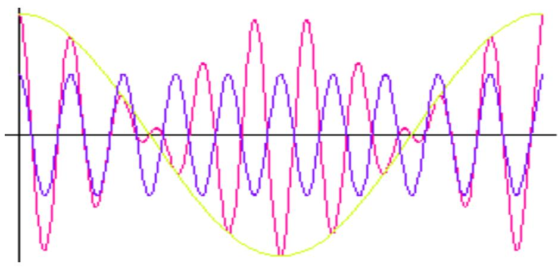

line

| X  | Red Line | Blue Line | Yellow Line |
|----|----------|-----------|-------------|
| 0  | 1.0      | 0.5       | 1.0         |
| 1  | 0.8      | 0.7       | 0.9         |
| 2  | 0.6      | 0.9       | 0.7         |
| 3  | 0.4      | 0.8       | 0.5         |
| 4  | 0.2      | 0.6       | 0.3         |
| 5  | 0.0      | 0.4       | 0.1         |
| 6  | -0.2     | 0.2       | -0.1        |
| 7  | -0.4     | 0.0       | -0.3        |
| 8  | -0.6     | -0.2      | -0.5        |
| 9  | -0.8     | -0.4      | -0.7        |
| 10 | -1.0     | -0.6      | -0.9        |
| 11 | -0.8     | -0.8      | -0.7        |
| 12 | -0.6     | -1.0      | -0.5        |
| 13 | -0.4     | -0.8      | -0.3        |
| 14 | -0.2     | -0.6      | -0.1        |
| 15 | 0.0      | -0.4      | 0.1         |
| 16 | 0.2      | -0.2      | 0.3         |
| 17 | 0.4      | 0.0       | 0.5         |
| 18 | 0.6      | 0.2       | 0.7         |
| 19 | 0.8      | 0.4       | 0.9         |
| 20 | 1.0      | 0.6       | 1.0         |
| 21 | 0.8      | 0.8       | 0.9         |
| 22 | 0.6      | 1.0       | 0.7         |
| 23 | 0.4      | 0.8       | 0.5         |
| 24 | 0.2      | 0.6       | 0.3         |
| 25 | 0.0      | 0.4       | 0.1         |
| 26 | -0.2     | 0.2       | -0.1        |
| 27 | -0.4     | 0.0       | -0.3        |
| 28 | -0.6     | -0.2      | -0.5        |
| 29 | -0.8     | -0.4      | -0.7        |
| 30 | -1.0     | -0.6      | -0.9        |
| 31 | -0.8     | -0.8      | -1.0        |
| 32 | -0.6     | -1.0      | -0.9        |
| 33 | -0.4     | -0.8      | -0.7        |
| 34 | -0.2     | -0.6      | -0.5        |
| 35 | 0.0      | -0.4      | -0.3        |
| 36 | 0.2      | -0.2      | -0.1        |
| 37 | 0.4      | 0.0       | 0.1         |
| 38 | 0.6      | 0.2       | 0.3         |
| 39 | 0.8      | 0.4       | 0.5         |
| 40 | 1.0      | 0.6       | 0.7         |
| 41 | 0.8      | 0.8       | 0.9         |
| 42 | 0.6      | 1.0       | 1.1         |
| 43 | 0.4      | 0.8       | 1.3         |
| 44 | 0.2      | 0.6       | 1.5         |
| 45 | 0.0      | 0.4       | 1.7         |
| 46 | -0.2     | 0.2       | 1.9         |
| 47 | -0.4     | 0.0       | 2.1         |
| 48 | -0.6     | -0.2      | 2.3         |
| 49 | -0.8     | -0.4      | 2.5         |
| 50 | -1.0     | -0.6      | 2.7         |
| 51 | -0.8     | -0.8      | 2.9         |
| 52 | -0.6     | -1.0      | 3.1         |
| 53 | -0.4     | -0.8      | 3.3         |
| 54 | -0.2     | -0.6      | 3.5         |
| 55 | 0.0      | -0.4      | 3.7         |
| 56 | 0.2      | -0.2      | 3.9         |
| 57 | 0.4      | 0.0       | 4.1         |
| 58 | 0.6      | 0.2       | 4.3         |
| 59 | 0.8      | 0.4       | 4.5         |
| 60+| +1       | +1        | +1          |

$$
\vec {E} (z, t) = \vec {E} _ {1} (z, t) + \vec {E} _ {2} (z, t) = \vec {e} _ {x} 2 E _ {m} \cos (\Delta \omega t - \Delta \beta z) \cos (\omega t - \beta z)
$$

相速 $v_{p}$ ：载波的恒定相位点推进速度

$$
\omega t - \beta z = C \quad \Longrightarrow \quad v _ {p} = \frac {\omega}{\beta}
$$

■ 群速 $v_{g}$ ：包络波的恒定相位点推进速度

$$
\Delta \omega t - \Delta \beta z = C \quad \Longrightarrow \quad v _ {g} = \lim _ {\Delta \beta \rightarrow 0} \frac {\Delta \omega}{\Delta \beta} = \frac {\mathrm{d} \omega}{\mathrm{d} \beta}
$$

$$
v _ {g} = \frac {\mathrm{d} \omega}{\mathrm{d} \beta} = \frac {\mathrm{d} (\beta v _ {p})}{\mathrm{d} \beta} = v _ {p} + \beta \frac {\mathrm{d} v _ {p}}{\mathrm{d} \beta}
$$

$$
= v _ {p} + \frac {\omega}{v _ {p}} \frac {\mathrm{d} v _ {p}}{\mathrm{d} \omega} \frac {\mathrm{d} \omega}{\mathrm{d} \beta} = v _ {p} + \frac {\omega}{v _ {p}} \frac {\mathrm{d} v _ {p}}{\mathrm{d} \omega} v _ {g}
$$

$$
\Longrightarrow v _ {g} = \frac {v _ {p}}{1 - \frac {\omega}{v _ {p}} \frac {\mathrm{d} v _ {p}}{\mathrm{d} \omega}}
$$

$$
\longrightarrow \left\{ \begin{array}{l l} \frac {\mathrm{d} v _ {p}}{\mathrm{d} \omega} = 0, v _ {g} = v _ {p} & \text {--无色散} \\ \frac {\mathrm{d} v _ {p}}{\mathrm{d} \omega} <   0, v _ {g} <   v _ {p} & \text {--正常色散} \\ \frac {\mathrm{d} v _ {p}}{\mathrm{d} \omega} > 0, v _ {g} > v _ {p} & \text {--反常色散} \end{array} \right.
$$

补充：载频为 $f=100kHz$ 的窄频带信号在海水中传播，试求群速。

解: 海水的参数: $\sigma = 4 \mathrm{~S} / \mathrm{m}$ 、 $\varepsilon_{r} = 81$ 、 $\mu_{r} = 1$ , 当 $f = 100 \mathrm{kHz}$ 时, 有

$\frac{\sigma}{\omega\varepsilon}\gg1$ ，可视为良导体

$$
\left\{ \begin{array}{l} \beta \approx 1. 2 6 \mathrm{rad/m} \\ v _ {p} = 5 \times 1 0 ^ {5} \mathrm{m/s} \end{array} \right.
$$

由

$$
v _ {p} (\omega) \approx \sqrt {\frac {2 \omega}{\mu \sigma}} = \sqrt {\frac {2 \omega}{\mu_ {0} \sigma}} = 6 3 1 \sqrt {\omega}
$$

得

$$
\frac {\mathrm{d} v _ {p}}{\mathrm{d} \omega} = \frac {\mathrm{d}}{\mathrm{d} \omega} (6 3 1 \sqrt {\omega}) = \frac {6 3 1}{2} \frac {1}{\sqrt {\omega}}
$$

$v_{g}>v_{p}$ 反常色散媒质

群速： $v_{g}=\frac{5\times10^{5}}{1-\frac{\omega}{v_{p}}\frac{631}{2}\frac{1}{\sqrt{\omega}}}=10^{6}m/s>v_{p}=5\times10^{5}m/s$

# 6.3 平面电磁波的极化

极化的定义

直线极化波

圆极化波

椭圆极化波

极化波的合成与分解

极化的工程应用

# 极化的定义

一般情况下，沿+z方向传播的均匀平面波 $\vec{E} = \vec{e}_{x} E_{x} + \vec{e}_{y} E_{y}$ ，其中

$$
E _ {x} = E _ {x m} \cos (\omega t - k z + \varphi_ {x}),
$$

$$
E _ {y} = E _ {y m} \cos (\omega t - k z + \varphi_ {y})
$$

波的极化表征在空间给定点上电场强度矢量的取向随时间变化的特性，是电磁理论中的一个重要概念。

波的极化：在电磁波传播空间给定点处，电场强度矢量的端点随时间变化的轨迹。

电磁波的极化状态取决于 $E_{x}$ 和 $E_{y}$ 的振幅之间和相位之间的关系，分为：

直线极化：电场强度矢量的端点轨迹为一直线段  
圆极化：电场强度矢量的端点轨迹为一个圆  
椭圆极化：电场强度矢量的端点轨迹为一个椭圆

电磁波的极化状态取决于 $E_{x}$ 和 $E_{y}$ 的振幅之间和相位之间的关系，

$$
E _ {x} = E _ {x m} \cos (\omega t - k z + \varphi_ {x})
$$

$$
E _ {x} = E _ {x m} \cos (\omega t + \varphi_ {x})
$$

$$
E _ {y} = E _ {y m} \cos (\omega t - k z + \varphi_ {y})
$$

$$
E _ {y} = E _ {y m} \cos (\omega t + \varphi_ {y})
$$

# 直线极化波

条件： $\varphi_{y}-\varphi_{x}=0$ 或 $\pm\pi$

随时间变化

合成波电场的模

$$
E = \sqrt {E _ {x} ^ {2} (0 , t) + E _ {y} ^ {2} (0 , t)} = \sqrt {E _ {x m} ^ {2} + E _ {y m} ^ {2}} \cos (\omega t + \phi_ {x})
$$

合成波电场与+x轴的夹角

$$
\alpha = \arctan \left(\frac {E _ {y}}{E _ {x}}\right) = \pm \arctan \left(\frac {E _ {y m}}{E _ {x m}}\right)
$$

常数

text_image

φ_y - φ_x = 0

text_image

φ_y - φ_x = ±π

特点：合成波电场的大小随时间变化，但其矢端轨迹与x轴的夹角始终保持不变。

■ 结论 任何两个同频率、同传播方向且极化方向互相垂直的线极化波，当它们的相位相同或相差为±π时，其合成波为线极化波。

南京广播电视集团新建中波发射台

2017年12月28日

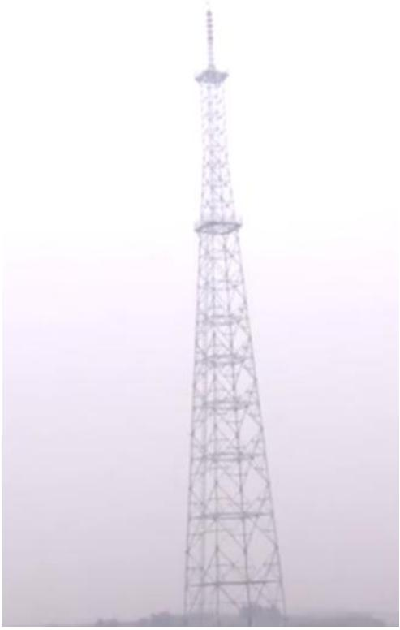

natural_image

Exterior view of a tall, multi-tiered transmission tower against a hazy sky (no signage or text visible)

# 圆极化波

条件： $E_{xm}=E_{ym}=E_{m}$ 、 $\varphi_{y}-\varphi_{x}=\pm\pi/2$

则 $E_{x}(0,t) = E_{m}\cos (\omega t + \varphi_{x})$

$$
E _ {y} (0, t) = E _ {m} \cos (\omega t + \varphi_ {x} \pm \frac {\pi}{2}) = \mp E _ {m} \sin (\omega t + \varphi_ {x})
$$

常数

合成波电场的模

$$
E = \sqrt {E _ {x} ^ {2} (0 , t) + E _ {y} ^ {2} (0 , t)} = E _ {m}
$$

随时间变化

合成波电场与 $+x$ 轴的夹角 $\alpha = \arctan [\mp \tan (\omega t + \varphi_x)] = \mp (\omega t + \varphi_x)$

■ 特点 合成波电场的大小不随时间改变，但方向却随时间变化，电场的矢端在一个圆上并以角速度 $\omega$ 旋转。

■ 结论 任何两个同频率、同传播方向且极化方向互相垂直的线极化波，当它们的振幅相同、相位差为±π/2时，其合成波为圆极化波。

\- 左旋圆极化波：若 $\varphi_{y} - \varphi_{x} = \pi / 2$ ，则电场矢端的旋转方向与电磁波传播方向成左手螺旋关系，称为左旋圆极化波

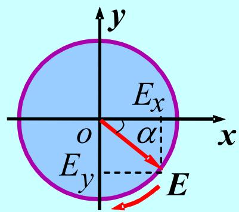

text_image

y
Eₓ
o
α
x
Eᵧ
E

左旋圆极化波

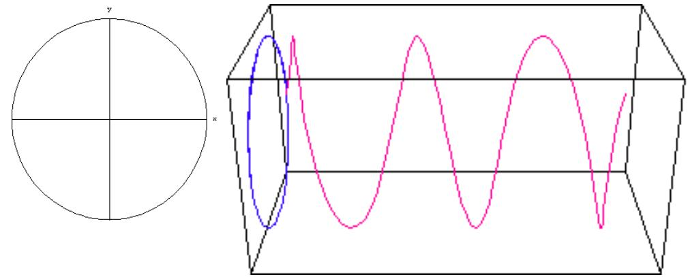

text_image

Mathematical diagram showing a circle and a 3D coordinate system with labeled axes x, y, and z.

\- 右旋圆极化波：若 $\varphi_{y} - \varphi_{x} = -\pi / 2$ ，则电场矢端的旋转方向与电磁波传播方向成右手螺旋关系，称为右旋圆极化波

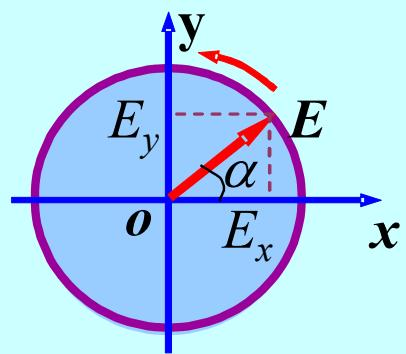

text_image

y
E_y
E
α
o
E_x
x

右旋圆极化波

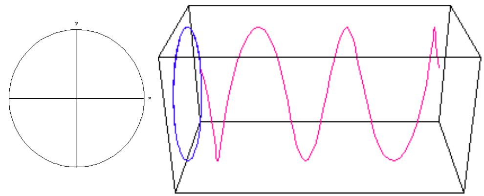

text_image

Mathematical diagram showing a circle and a 3D wave surface with labeled axes x, y, and z.

个旋转矢量(见图6-8)，所以圆偏振光可看成是两个相互垂直的线偏振光的合成，其分量应写成

$$
\left\{ \begin{array}{l} E _ {x} = A \cos \omega t, \\ E _ {y} = A \cos \left(\omega t \pm \frac {\pi}{2}\right). \end{array} \right. \tag {6.3}
$$

电矢量的表达式为

$$
\begin{array}{l} \boldsymbol {E} = E _ {x} \hat {\boldsymbol {x}} + E _ {y} \hat {\boldsymbol {y}} \\ = A \cos \omega t \hat {\boldsymbol {x}} + A \cos \left(\omega t \pm \frac {\pi}{2}\right) \hat {\boldsymbol {y}}, \tag {6.4} \\ \end{array}
$$

式中 $\hat{\pmb{x}}$ 、 $\hat{\pmb{y}}$ 是沿 $x, y$ 轴的单位基矢。我们假定波是沿 $z$ 轴传播的，在图6-8中它垂直纸面迎面而来。这时若电矢量按逆时针方向旋转，我们称之为左旋圆偏振光，若按顺时针方向旋转，则称之为右旋圆偏振光。①读者可验证一下，(6.4)式中 $\pi /2$ 前的正号对应右旋，负号对应左旋。

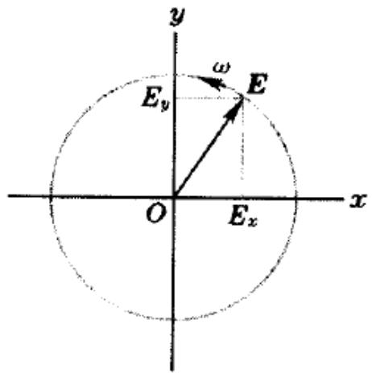

text_image

y
ω
E
Ey
E
O
Ex
x

图6-8圆偏振光  
中电矢量的运动

natural_image

Nighttime rocket launch with bright exhaust plume and launch tower, no visible text or symbols

natural_image

Satellite in orbit above Earth with solar panels deployed, set against a starry blue sky (no text or symbols visible)

高分二号卫星（中国民用遥感卫星）

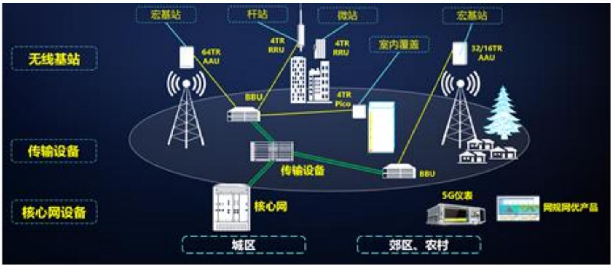

flowchart

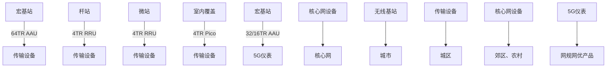
```mermaid
graph TD
    A["宏基站"] -->|64TR AAU| B["传输设备"]
    C["杆站"] -->|4TR RRU| D["传输设备"]
    E["微站"] -->|4TR RRU| F["传输设备"]
    G["室内覆盖"] -->|4TR Pico| H["传输设备"]
    I["宏基站"] -->|32/16TR AAU| J["5G仪表"]
    K["核心网设备"] --> L["核心网"]
    M["无线基站"] --> N["城市"]
    O["传输设备"] --> P["城区"]
    Q["核心网设备"] --> R["郊区、农村"]
    S["5G仪表"] --> T["网规网优产品"]
```

# 椭圆极化波

其它情况下，令 $\varphi_{y}-\varphi_{x}=\varphi$ 由

$$
E _ {x} (0, t) = E _ {x m} \cos (\omega t + \varphi_ {x})
$$

$$
E _ {y} (0, t) = E _ {y m} \cos (\omega t + \varphi_ {x} + \varphi)
$$

可得到 $\frac{E_{x}^{2}}{E_{xm}^{2}}+\frac{E_{y}^{2}}{E_{ym}^{2}}-\frac{2E_{x}E_{y}}{E_{xm}E_{ym}}\cos\varphi=\sin^{2}\varphi$

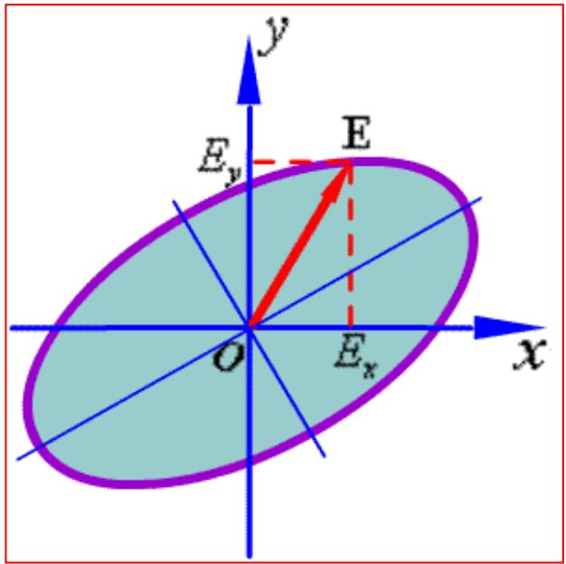

text_image

y
E_y
E
O
E_x
x

■ 特点：合成波电场的大小和方向都随时间改变，其端点在一个椭圆上旋转。

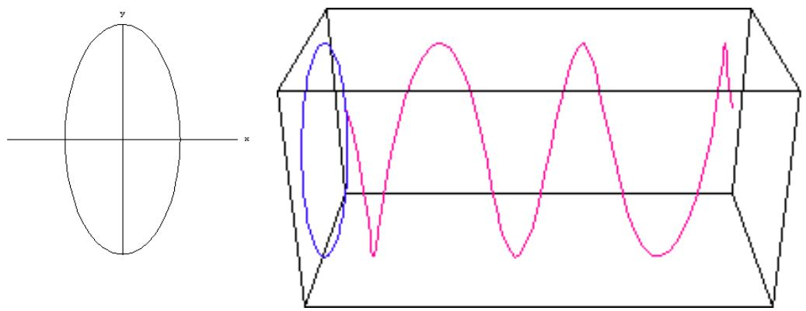

text_image

Mathematical diagram showing a 3D ellipsoid and its corresponding waveforms in a Cartesian coordinate system.

# 合成波极化的小结

电磁波的极化状态取决于 $E_{x}$ 和 $E_{y}$ 的振幅 $E_{xm}$ 、 $E_{ym}$ 和相位差 $\Delta\varphi=\varphi_{y}-\varphi_{x}$

对于沿+z方向传播的均匀平面波：

线极化： $\Delta\varphi=0,\pm\pi$ ；  
$\Delta\varphi = 0$ ，在1、3象限， $\Delta\varphi = \pm \pi$ ，在2、4象限  
圆极化： $\Delta\varphi = \pm\pi/2,\quad E_{xm} = E_{ym};$   
取 “+”，左旋圆极化，取 “-”，右旋圆极化  
椭圆极化：其它情况； $\Delta\varphi>0$ ，左旋， $\Delta\varphi<0$ ，右旋

类似于例6.3.1 判别下列均匀平面波的极化方式。

(1) $\vec{E} = \vec{e}_x E_m \sin (\omega t - kz) + \vec{e}_y E_m \cos (\omega t - kz)$   
(2) $\vec{E}=\vec{e}_{x}E_{m}e^{-jkz}-\vec{e}_{y}jE_{m}e^{-jkz}$   
(3) $\vec{E} = \vec{e}_x E_m \sin (\omega t - kz + \frac{\pi}{4}) + \vec{e}_y E_m \cos (\omega t - kz - \frac{\pi}{4})$   
(4) $\vec{E} = \vec{e}_x E_m \sin (\omega t - kz) + \vec{e}_y 2E_m \cos (\omega t - kz)$

解：（1） $E_{xm}=E_{ym},\quad\phi_{x}=-\frac{\pi}{2},\quad\phi_{y}=0,\Delta\phi=\frac{\pi}{2}\quad\Longrightarrow$ 左旋圆极化波

(2) $E_{xm} = E_{ym}, \phi_x = 0, \phi_y = -\frac{\pi}{2}, \Delta \phi = -\frac{\pi}{2} \longrightarrow$ 右旋圆极化波

(3) $\phi_{x} = -\frac{\pi}{4}$ 、 $\phi_{y} = -\frac{\pi}{4}, \Delta \phi = 0$ → 线极化波

(4) $E_{xm} \neq E_{ym}, \quad \phi_x = -\frac{\pi}{2}, \quad \phi_y = 0, \Delta \phi = \frac{\pi}{2} \implies$ 左旋椭圆极化波

# 极化波的分解

□ 任何一个线极化波、圆极化波或椭圆极化波可分解成两个线极化波的叠加  
□ 任何一个线极化波都可以表示成旋向相反、振幅相等的两圆极化波的叠加, 即

$$
\vec {E} = \vec {e} _ {x} E _ {m} \mathbf {e} ^ {- j k z} = (\vec {e} _ {x} + j \vec {e} _ {y}) \frac {E _ {m}}{2} \mathbf {e} ^ {- j k z} + (\vec {e} _ {x} - j \vec {e} _ {y}) \frac {E _ {m}}{2} \mathbf {e} ^ {- j k z}
$$

□ 任何一个椭圆极化波也可以表示成旋向相反、振幅不等的两圆极化波的叠加，即

$$
\vec {E} = (\vec {e} _ {x} E _ {x m} + \vec {e} _ {y} E _ {y m}) \mathbf {e} ^ {- j k z}
$$

$$
= (\vec {e} _ {x} - \vec {e} _ {y} j) \frac {E _ {x m} + j E _ {y m}}{2} \mathrm{e} ^ {- j k z} + (\vec {e} _ {x} + \vec {e} _ {y} j) \frac {E _ {x m} - j E _ {y m}}{2} \mathrm{e} ^ {- j k z}
$$

# 例题6.3.3（关于极化波分解的例题）

已知一线极化波的电场 $E(z) = e_x E_{\mathrm{m}} \mathrm{e}^{-jkz} + e_y E_{\mathrm{m}} \mathrm{e}^{-jkz}$ ，试将其分解为两个振幅相等、旋向相反的圆极化波。

解：设两个振幅相等、旋向相反的圆极化波分别为

$$
\boldsymbol {E} _ {1} (z) = (\boldsymbol {e} _ {x} + \mathrm{j} \boldsymbol {e} _ {y}) E _ {1 \mathrm{m}} \mathrm{e} ^ {- \mathrm{j} k z}, \quad \boldsymbol {E} _ {2} (z) = (\boldsymbol {e} _ {x} - \mathrm{j} \boldsymbol {e} _ {y}) E _ {2 \mathrm{m}} \mathrm{e} ^ {- \mathrm{j} k z}
$$

其中 $E_{1m}$ 和 $E_{2m}$ 为待定常数。令

$$
\boldsymbol {E} _ {1} (z) + \boldsymbol {E} _ {2} (z) = \boldsymbol {E} (z)
$$

即

$$
\left(\boldsymbol {e} _ {x} + \mathrm{j} \boldsymbol {e} _ {y}\right) E _ {1 \mathrm{m}} \mathrm{e} ^ {- \mathrm{j} k z} + \left(\boldsymbol {e} _ {x} - \mathrm{j} \boldsymbol {e} _ {y}\right) E _ {2 \mathrm{m}} \mathrm{e} ^ {- \mathrm{j} k z} = \boldsymbol {e} _ {x} E _ {\mathrm{m}} \mathrm{e} ^ {- \mathrm{j} k z} + \boldsymbol {e} _ {y} E _ {\mathrm{m}} \mathrm{e} ^ {- \mathrm{j} k z}
$$

$$
\left(\boldsymbol {e} _ {x} + \mathrm{j} \boldsymbol {e} _ {y}\right) E _ {1 \mathrm{m}} \mathrm{e} ^ {- \mathrm{j} k z} + \left(\boldsymbol {e} _ {x} - \mathrm{j} \boldsymbol {e} _ {y}\right) E _ {2 \mathrm{m}} \mathrm{e} ^ {- \mathrm{j} k z} = \boldsymbol {e} _ {x} E _ {\mathrm{m}} \mathrm{e} ^ {- \mathrm{j} k z} + \boldsymbol {e} _ {y} E _ {\mathrm{m}} \mathrm{e} ^ {- \mathrm{j} k z}
$$

由此可解得

$$
E _ {1 \mathrm{m}} = \frac {E _ {\mathrm{m}}}{2} (1 - \mathrm{j}) = \frac {E _ {\mathrm{m}}}{\sqrt {2}} \mathrm{e} ^ {- \mathrm{j} \pi / 4}, \quad E _ {2 \mathrm{m}} = \frac {E _ {\mathrm{m}}}{2} (1 + \mathrm{j}) = \frac {E _ {\mathrm{m}}}{\sqrt {2}} \mathrm{e} ^ {\mathrm{j} \pi / 4}
$$

显然有 $|E_{1\mathrm{m}}| = |E_{2\mathrm{m}}| = \frac{E_{\mathrm{m}}}{\sqrt{2}}$ 。故两个振幅相等、旋向相反的圆极化波分别为

$$
\boldsymbol {E} _ {1} (z) = \left(\boldsymbol {e} _ {x} + \mathrm{j} \boldsymbol {e} _ {y}\right) \frac {E _ {\mathrm{m}}}{\sqrt {2}} \mathrm{e} ^ {- \mathrm{j} \pi / 4} \mathrm{e} ^ {- \mathrm{j} k z}, \quad \boldsymbol {E} _ {2} (z) = \left(\boldsymbol {e} _ {x} - \mathrm{j} \boldsymbol {e} _ {y}\right) \frac {E _ {\mathrm{m}}}{\sqrt {2}} \mathrm{e} ^ {\mathrm{j} \pi / 4} \mathrm{e} ^ {- \mathrm{j} k z}
$$

# 极化波的工程应用

电磁波的极化在许多领域中获得了广泛应用。如:

在雷达目标探测的技术中，利用目标对电磁波散射过程中改变极化的特性实现目标的识别  
无线电技术中，利用天线发射和接收电磁波的极化特性，实现最佳无线电信号的发射和接收。  
在光学工程中利用材料对于不同极化波的传播特性设计光学偏振片等等

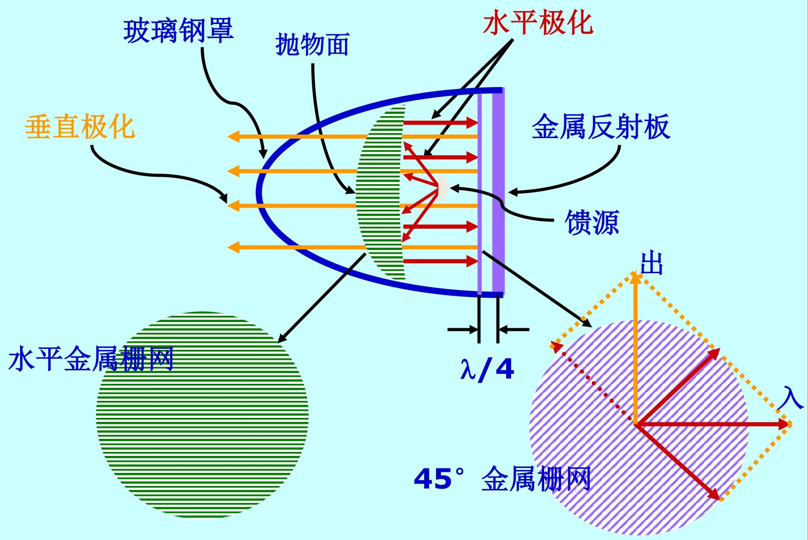

flowchart

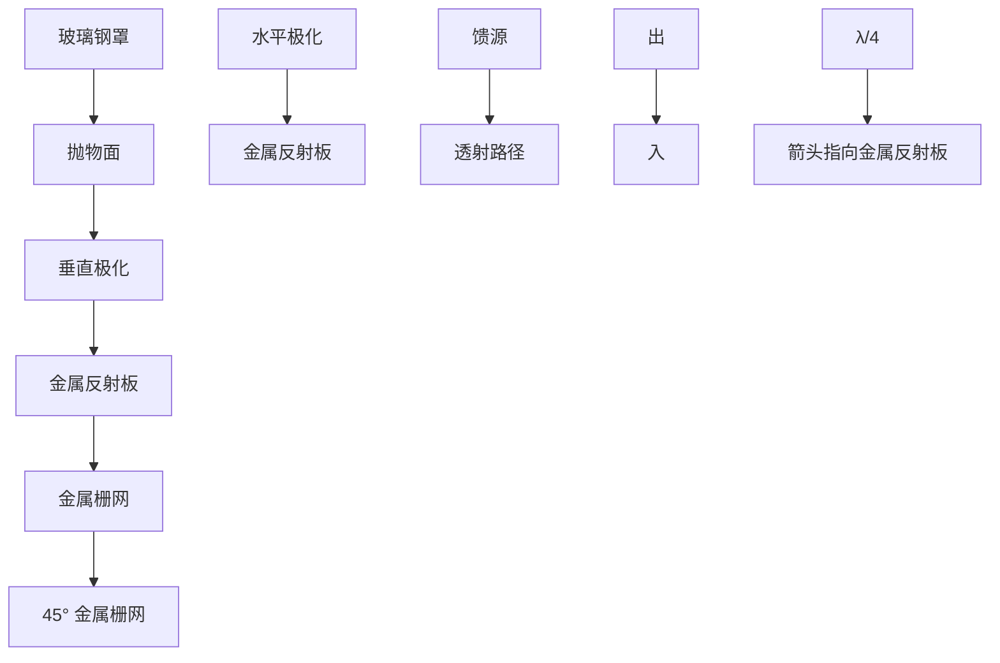
```mermaid
graph TD
    A["玻璃钢罩"] --> B["抛物面"]
    B --> C["垂直极化"]
    C --> D["金属反射板"]
    D --> E["金属栅网"]
    E --> F["45° 金属栅网"]
    G["水平极化"] --> H["金属反射板"]
    I["馈源"] --> J["透射路径"]
    K["出"] --> L["入"]
    M["λ/4"] --> N["箭头指向金属反射板"]
```

极化扭转天线示意图

电磁波的极化很重要，需要好好学习！

# 反射与透射 引言

现象：电磁波入射到不同媒质分界面上时，一部分波被分界面反射，一部分波透过分界面。  
入射方式: 垂直入射、斜入射;  
媒质类型：理想导体、理想介质、导电媒质   
分析方法:

入射波（已知）+ 反射波（未知） $\xleftarrow{边界条件}$ 透射波（未知）

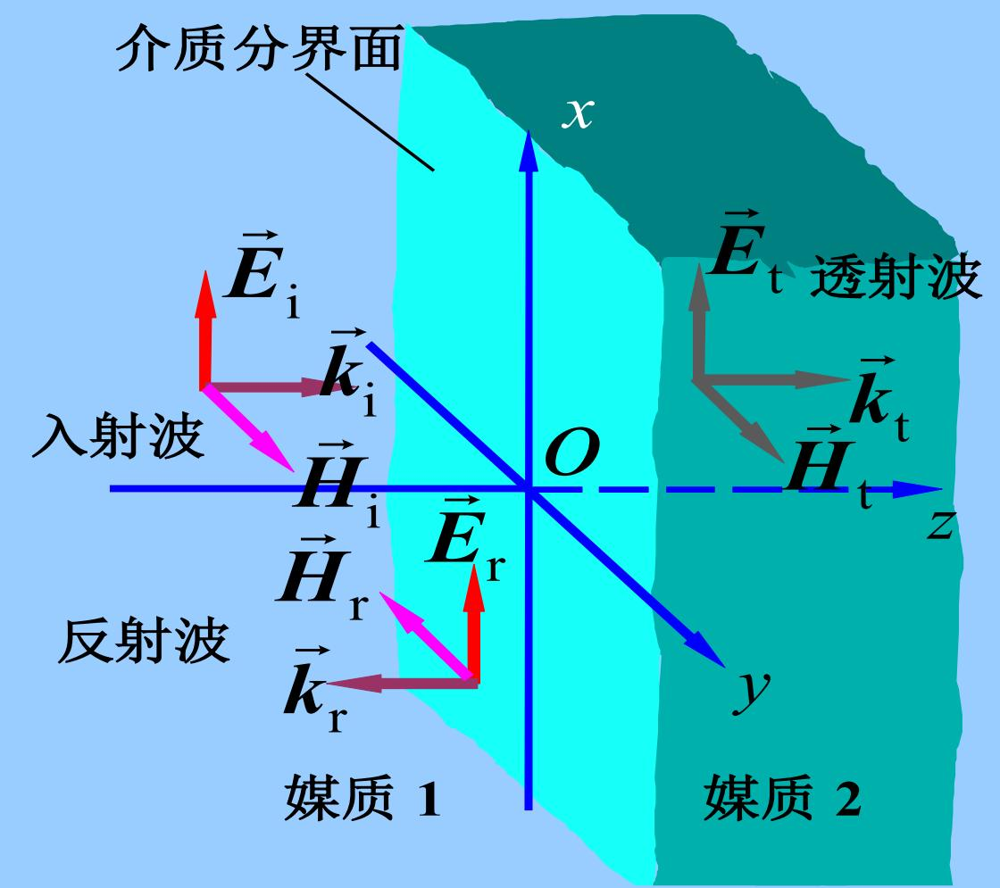

text_image

介质分界面
x
E⃗_i
k⃗_i
入射波
H⃗_i
E⃗_r
H⃗_r
k⃗_r
媒质 1
y
O
z
E⃗_t 透射波
k⃗_t
H⃗_t
媒质 2

均匀平面波垂直入射到两种不同媒质的分界平面

# 6.5 均匀平面电磁波向媒质平面的垂直入射

# 本节内容

向理想导体表面的垂直入射

向理想介质分界面的垂直入射

向导电媒质分界面的垂直入射

本节讲解顺序与教材略有不同，请注意。

# 6.5.3 向理想导体表面的垂直入射

媒质1为理想介质， $\sigma_{1} = 0$

媒质2为理想导体， $\sigma_{2}=\infty$

z < 0 中，理想介质的参数为

$$
\mu_ {1} \setminus \varepsilon_ {1} \setminus \sigma_ {1}
$$

z>0中，理想导体的参数为

$$
\mu_ {2} \cdot \varepsilon_ {2} \cdot \sigma_ {2}
$$

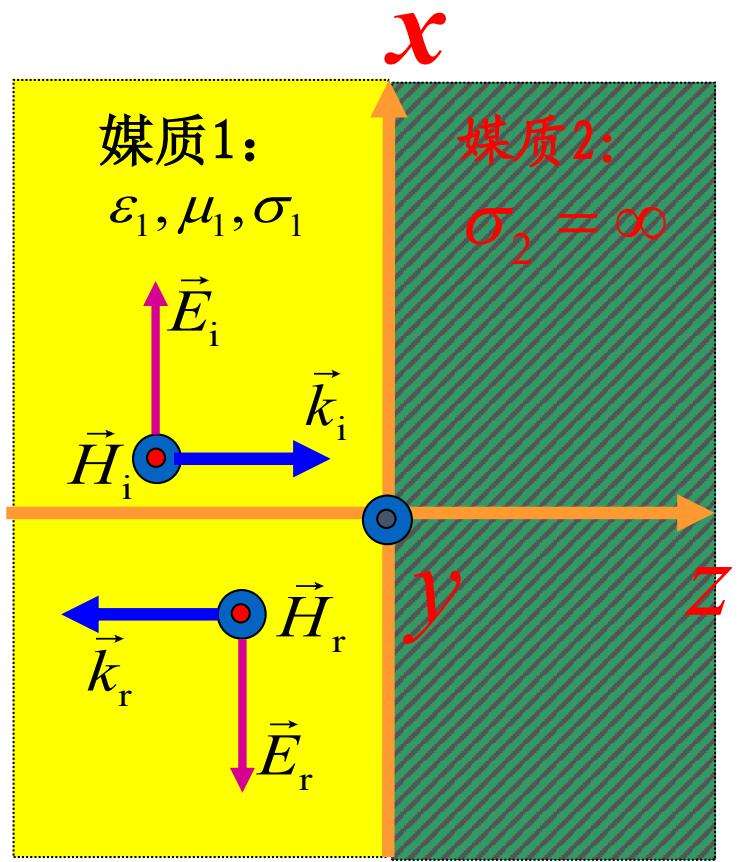

text_image

媒质1:
ε₁, μ₁, σ₁
媒质2:
σ₂ = ∞
x
Eᵢ
kᵢ
Hᵢ
y
z
kᵣ
Hᵣ
Eᵣ

$$
z = 0
$$

沿x方向极化的均匀平面波从理想介质1垂直入射到与理想导体2的分界平面上。

媒质1（理想介质）中的入射波：

$$
\vec {E} _ {\mathrm{i}} (z) = \vec {e} _ {x} E _ {\mathrm{im}} \mathbf {e} ^ {- \mathrm{j} \beta_ {1} z}
$$

$$
\vec {H} _ {\mathrm{i}} (z) = \vec {e} _ {z} \times \frac {1}{\eta_ {1}} \vec {E} _ {\mathrm{i}} (z) = \vec {e} _ {y} \frac {E _ {\mathrm{im}}}{\eta_ {1}} \mathrm{e} ^ {- \mathrm{j} \beta_ {1} z}
$$

这里 $\beta_{1} = \omega \sqrt{\mu_{1}\varepsilon_{1}},\eta_{1} = \sqrt{\frac{\mu_{1}}{\varepsilon_{1}}}$

媒质1（理想介质）中的反射波：

$$
\vec {E} _ {\mathrm{r}} (z) = \vec {e} _ {x} E _ {\mathrm{rm}} \mathbf {e} ^ {j \beta_ {1} z}
$$

$$
\vec {H} _ {\mathrm{r}} (z) = - \vec {e} _ {z} \times \frac {1}{\eta_ {1}} \vec {E} _ {\mathrm{r}} (z) = - \vec {e} _ {y} \frac {E _ {\mathrm{rm}}}{\eta_ {1}} \mathbf {e} ^ {j \beta_ {1} z}
$$

媒质1中的合成波：

$$
\vec {E} _ {\mathrm{l}} (z) = \vec {E} _ {\mathrm{i}} (z) + \vec {E} _ {\mathrm{r}} (z) = \vec {e} _ {x} \left(E _ {\mathrm{im}} \mathbf {e} ^ {- j \beta_ {\mathrm{l}} z} + E _ {\mathrm{rm}} \mathbf {e} ^ {j \beta_ {\mathrm{l}} z}\right)
$$

$$
\vec {H} _ {\mathrm{l}} (z) = \vec {H} _ {\mathrm{i}} (z) + \vec {H} _ {\mathrm{r}} (z) = \vec {e} _ {y} \frac {1}{\eta_ {\mathrm{l}}} \Big (E _ {\mathrm{im}} \mathbf {e} ^ {- j \beta_ {\mathrm{l}} z} - E _ {\mathrm{rm}} \mathbf {e} ^ {j \beta_ {\mathrm{l}} z} \Big)
$$

在分界面 $z = 0$ 上，电场强度切向分量连续，即

$$
\vec {E} _ {1} (0) = \vec {E} _ {2} (0)
$$

$$
\vec {e} _ {x} \left(E _ {\mathrm{im}} \mathbf {e} ^ {- j \beta_ {1} z} + E _ {\mathrm{rm}} \mathbf {e} ^ {j \beta_ {1} z}\right) \bigg | _ {z = 0} = 0
$$

$$
E _ {\mathrm{rm}} = - E _ {\mathrm{im}}
$$

在分界面上，反射波电场与入射波电场的相位差为 $\pi$

媒质1中的反射波： $\vec{E}_{\mathrm{r}}(z) = -\vec{e}_xE_{\mathrm{im}}\mathrm{e}^{\mathrm{j}\beta_1z},\quad \vec{H}_{\mathrm{r}}(z) = \vec{e}_y\frac{E_{\mathrm{im}}}{\eta_1}\mathrm{e}^{\mathrm{j}\beta_1z}$

# 媒质1中合成波的电磁场为

$$
\vec {E} _ {1} (z) = \vec {e} _ {x} E _ {\mathrm{im}} (\mathbf {e} ^ {- \mathrm{j} \beta_ {1} z} - \mathbf {e} ^ {\mathrm{j} \beta_ {1} z}) = - \vec {e} _ {x} j 2 E _ {\mathrm{im}} \sin (\beta_ {1} z)
$$

$$
\vec {H} _ {1} (z) = \vec {e} _ {y} \frac {E _ {\mathrm{im}}}{\eta_ {1}} (\mathrm{e} ^ {- \mathrm{j} \beta_ {1} z} + \mathrm{e} ^ {\mathrm{j} \beta_ {1} z}) = \vec {e} _ {y} \frac {2}{\eta_ {1}} E _ {\mathrm{im}} \cos (\beta_ {1} z)
$$

欧拉公式

$$
\mathrm{e} ^ {j z} = \cos z + j \sin z, \mathrm{e} ^ {- j z} = \cos z - j \sin z
$$

$$
\cos z = \frac {1}{2} \left(\mathrm{e} ^ {j z} + \mathrm{e} ^ {- j z}\right), \sin z = \frac {1}{2 j} \left(\mathrm{e} ^ {j z} - \mathrm{e} ^ {- j z}\right)
$$

# 瞬时值形式

$$
\vec {E} _ {1} (z, t) = \mathrm{Re} [ \vec {E} _ {1} (z) \mathrm{e} ^ {\mathrm{j} \omega t} ] = \vec {e} _ {x} 2 E _ {\mathrm{im}} \sin (\beta_ {1} z) \sin (\omega t)
$$

$$
\vec {H} _ {1} (z, t) = \mathrm{Re} [ \vec {H} _ {1} (z) \mathrm{e} ^ {\mathrm{j} \omega t} ] = \vec {e} _ {y} \frac {2 E _ {\mathrm{im}}}{\eta_ {1}} \cos (\beta_ {1} z) \cos (\omega t)
$$

$$
- j = \mathrm{e} ^ {j (- \pi / 2)}; \operatorname{Re} (A) = \frac {1}{2} (A + A ^ {*})
$$

合成波为驻波。

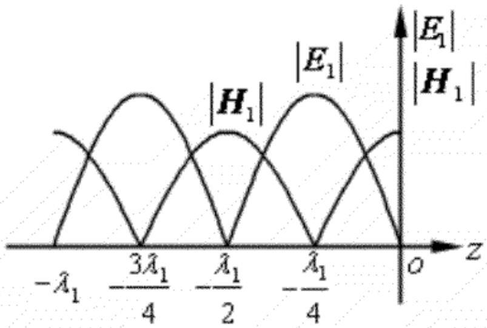

即

$$
y = \left(2 A \cos \frac {2 \pi}{\lambda} x\right) \cos \frac {2 \pi}{T} t \tag {11-39}
$$

由上式可看出, 合成以后各点都在作同周期的谐振动, 但各质元的振幅为 $\left|2A\cos \frac{2\pi}{\lambda} x\right|$ , 即驻波的振幅与位置有关 (与时间无关). 振幅最大值发生在 $\left|\cos \frac{2\pi}{\lambda} x\right| = 1$ 的点, 因此波腹的位置可由

$$
\frac {2 \pi}{\lambda} x = k \pi \quad (k = 0, \pm 1, \pm 2, \dots)
$$

来决定，即

$$
\boxed {x = k \frac {\lambda}{2}} \quad (k = 0, \pm 1, \pm 2, \dots) \tag {11-40}
$$

这就是波腹的位置.由此可见,相邻两个波腹间的距离为

$$
\boxed {x = k \frac {\lambda}{2}} \quad (k = 0, \pm 1, \pm 2, \dots) \tag {11-40}
$$

这就是波腹的位置.由此可见,相邻两个波腹间的距离为

$$
x _ {k + 1} - x _ {k} = \frac {\lambda}{2}
$$

同样，振幅的最小值发生在 $\left|\cos \frac{2\pi}{\lambda} x\right| = 0$ 的点，因此，波节的位置可由

$$
\frac {2 \pi}{\lambda} x = (2 k + 1) \frac {\pi}{2} \quad (k = 0, \pm 1, \pm 2, \dots)
$$

来决定，即

$$
x = (2 k + 1) \frac {\lambda}{4} \quad (k = 0, \pm 1, \pm 2, \dots) \tag {11-41}
$$

这就是波节的位置.可见相邻两个波节之间的距离也是 $\lambda /2$

# （对理想导体表面的垂直入射）合成波的特点

$$
\vec {E} _ {1} (z, t) = \mathrm{Re} [ \vec {E} _ {1} (z) \mathrm{e} ^ {\mathrm{j} \omega t} ] = \vec {e} _ {x} 2 E _ {\mathrm{im}} \sin (\beta_ {1} z) \sin (\omega t)
$$

$$
\vec {H} _ {1} (z, t) = \mathrm{Re} [ \vec {H} _ {1} (z) \mathrm{e} ^ {\mathrm{j} \omega t} ] = \vec {e} _ {y} \frac {2 E _ {\mathrm{im}}}{\eta_ {1}} \cos (\beta_ {1} z) \cos (\omega t)
$$

$\vec{E}_{1}$ 、 $\vec{H}_{1}$ 在空间上错开 $\lambda/4$ ，电场的波腹（节）点正好是磁场的波节（腹）点。

$\vec{E}_{1}$ 、 $\vec{H}_{1}$ 在时间上有 $\pi/2$ 的相移。

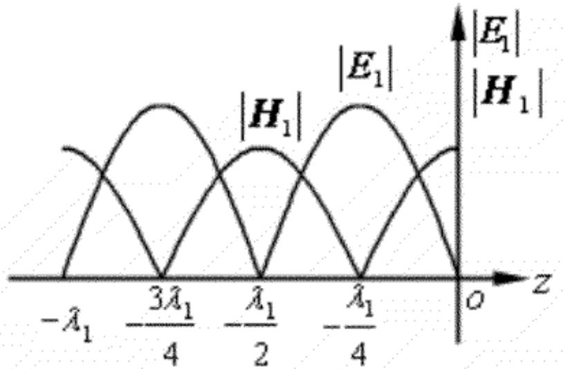

$$
\vec {E} _ {1} (z, t) = \mathrm{Re} [ \vec {E} _ {1} (z) \mathrm{e} ^ {\mathrm{j} \omega t} ] = \vec {e} _ {x} 2 E _ {\mathrm{im}} \sin (\beta_ {1} z) \sin (\omega t)
$$

$$
\vec {H} _ {1} (z, t) = \mathrm{Re} [ \vec {H} _ {1} (z) \mathrm{e} ^ {\mathrm{j} \omega t} ] = \vec {e} _ {y} \frac {2 E _ {\mathrm{im}}}{\eta_ {1}} \cos (\beta_ {1} z) \cos (\omega t)
$$

电场振幅的最大值为 $2E_{\mathrm{im}}$ ，最小值为0；  
磁场振幅的最大值为 $2E_{im}/\eta_{1}$ ，最小值也为0。

$$
\vec {E} _ {1} (z, t) = \operatorname{Re} [ \vec {E} _ {1} (z) \mathrm{e} ^ {\mathrm{j} \omega t} ]
$$

$$
= \vec {e} _ {x} 2 E _ {\mathrm{im}} \sin (\beta_ {1} z) \sin (\omega t)
$$

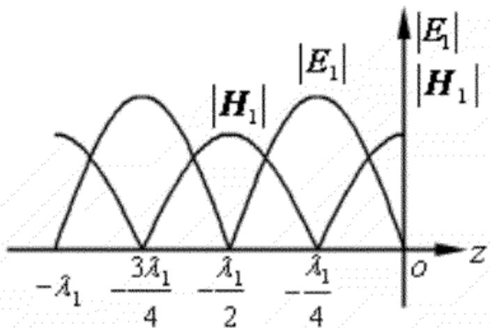

电场波节点（ $\left|E_{1}(z)\right|$ 的最小值的位置）

$$
\beta_ {1} z _ {\min} = - n \pi \longrightarrow z _ {\min} = - \frac {n \lambda_ {1}}{2} (n = 0, 1, 2, 3, \dots)
$$

电场波腹点（ $\left|\vec{E}_{1}(z)\right|$ 的最大值的位置）

$$
\beta_ {1} z _ {\max} = - (2 n + 1) \pi / 2 \longrightarrow z _ {\max} = - \frac {(2 n + 1) \lambda_ {1}}{4} (n = 0, 1, 2, 3, \dots)
$$

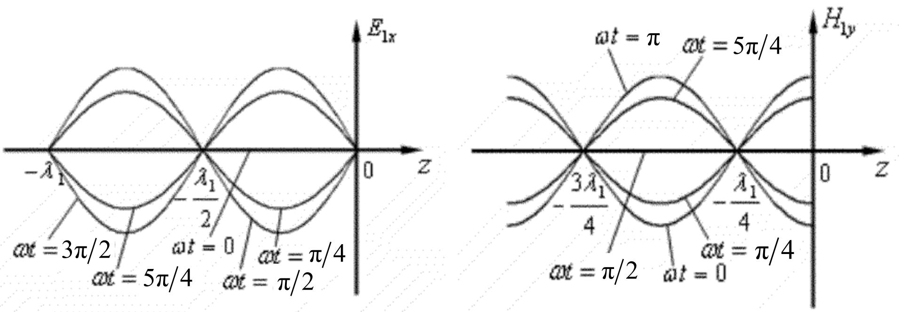

两相邻波节点之间任意两点的电场同相。  
同一波节点两侧的电场反相。

媒质1中的合成波的平均能流密度矢量

$$
\vec {S} _ {\mathrm{av}} = \frac {1}{2} \operatorname{Re} [ \vec {E} _ {1} \times \vec {H} _ {1} ^ {*} ] = \frac {1}{2} \operatorname{Re} \left[ - \vec {e} _ {x} \mathrm{j} 2 E _ {\mathrm{im}} \sin (\beta_ {1} z) \times \vec {e} _ {y} \left(\frac {2 E _ {\mathrm{im}} \cos (\beta_ {1} z)}{\eta_ {1}}\right) ^ {*} \right] = 0
$$

坡印廷矢量的平均值为零，不发生能量传输过程，仅在两个波节间进行电场能量和磁场能量的交换。

理想导体表面上的感应电流

$$
\vec {J} _ {S} = \vec {e} _ {\mathrm{n}} \times \vec {H} _ {1} (z) \mid_ {z = 0} = - \vec {e} _ {z} \times \vec {e} _ {y} \frac {2 E _ {\mathrm{im}} \cos (\beta_ {1} z)}{\eta_ {1}} \mid_ {z = 0} = \vec {e} _ {x} \frac {2 E _ {\mathrm{im}}}{\eta_ {1}}
$$

# 习题6.2 一均匀平面波沿 $+z$ 方向传播，其电场强度矢量为

$$
\vec {E} _ {\mathrm{i}} = \vec {e} _ {x} 1 0 0 \sin (\omega t - \beta z) + \vec {e} _ {y} 2 0 0 \cos (\omega t - \beta z) \mathrm{V/m}
$$

(1) 求相伴的磁场强度；  
(2) 若在传播方向上 $z = 0$ 处, 放置一无限大的理想导体平板, 求区域 $z < 0$ 中的电场强度和磁场强度;  
(3) 求理想导体板表面的电流密度。

# 第五版教材为习题6.2，第六版教材为6.5节习题2

解：(1) 电场强度的复数表示

$$
\vec {E} _ {\mathrm{i}} = \vec {e} _ {x} 1 0 0 \mathrm{e} ^ {- \mathrm{j} \beta z} \mathrm{e} ^ {- \mathrm{j} \pi / 2} + \vec {e} _ {y} 2 0 0 \mathrm{e} ^ {- \mathrm{j} \beta z}
$$

则 $\vec{H}_{\mathrm{i}}(z) = \frac{1}{\eta_0}\vec{e}_z\times \vec{E}_{\mathrm{i}} = \frac{1}{\eta_0} (-\vec{e}_x200\mathrm{e}^{-\mathrm{j}\beta z} + \vec{e}_y100\mathrm{e}^{-\mathrm{j}\beta z}\mathrm{e}^{-\mathrm{j}\pi /2})$

写成瞬时表达式

$$
\begin{array}{l} \vec {H} _ {\mathrm{i}} (z, t) = \operatorname{Re} [ \vec {H} _ {\mathrm{i}} (z) \mathrm{e} ^ {\mathrm{j} \omega t} ] \\ = \frac {1}{\eta_ {0}} [ - \vec {e} _ {x} 2 0 0 \cos (\omega t - \beta z) + \vec {e} _ {y} 1 0 0 \cos (\omega t - \beta z - \frac {1}{2} \pi) ] \\ \end{array}
$$

(2) 反射波的电场为

$$
\vec {E} _ {\mathrm{r}} (z) = - \vec {e} _ {x} 1 0 0 \mathrm{e} ^ {\mathrm{j} \beta z} \mathrm{e} ^ {- \mathrm{j} \pi / 2} - \vec {e} _ {y} 2 0 0 \mathrm{e} ^ {\mathrm{j} \beta z}
$$

反射波的磁场为

$$
\vec {H} _ {\mathrm{r}} (z) = \frac {1}{\eta_ {0}} (- \vec {e} _ {z} \times \vec {E} _ {\mathrm{r}}) = \frac {1}{\eta_ {0}} (- \vec {e} _ {x} 2 0 0 \mathrm{e} ^ {\mathrm{j} \beta z} + \vec {e} _ {y} 1 0 0 \mathrm{e} ^ {\mathrm{j} \beta z} \mathrm{e} ^ {- \mathrm{j} \pi / 2})
$$

在区域 $z < 0$ 的合成波电场和磁场分别为

$$
\vec {E} _ {\mathrm{l}} = \vec {E} _ {\mathrm{i}} + \vec {E} _ {\mathrm{r}} = - \vec {e} _ {x} \mathrm{j} 2 0 0 \mathrm{e} ^ {- \mathrm{j} \pi / 2} \sin (\beta z) - \vec {e} _ {y} \mathrm{j} 4 0 0 \sin (\beta z)
$$

$$
\vec {H} _ {1} = \vec {H} _ {\mathrm{i}} + \vec {H} _ {\mathrm{r}} = \frac {1}{\eta_ {0}} [ - \vec {e} _ {x} 4 0 0 \cos (\beta z) + \vec {e} _ {y} 2 0 0 \mathrm{e} ^ {- \mathrm{j} \pi / 2} \cos (\beta z) ]
$$

# (3) 理想导体表面电流密度为

$$
\vec {J} _ {S} = - \vec {e} _ {z} \times \vec {H} _ {1} \big | _ {z = 0}
$$

$$
= \vec {e} _ {x} \frac {2 0 0}{\eta_ {0}} \mathrm{e} ^ {- \mathrm{j} \pi / 2} + \vec {e} _ {y} \frac {4 0 0}{\eta_ {0}} = - \vec {e} _ {x} \mathrm{j} 0. 5 3 + \vec {e} _ {y} 1. 0 6
$$

例题 一右旋圆极化波垂直入射至位于 z=0 的理想导体板上, 其电场强度的复数形式为

$$
\boldsymbol {E} _ {\mathrm{i}} (z) = \left(\boldsymbol {e} _ {x} - \mathrm{j} \boldsymbol {e} _ {y}\right) E _ {\mathrm{m}} \mathrm{e} ^ {- \mathrm{j} \beta z}
$$

(1) 确定反射波的极化；  
(2) 写出总电场强度的瞬时表达式；  
(3) 求板上的感应面电流密度。

解：（1）设反射波电场的复数形式为

$$
E _ {\mathrm{r}} (z) = \left(e _ {x} E _ {\mathrm{rx}} + e _ {\mathrm{y}} E _ {\mathrm{ry}}\right) \mathrm{e} ^ {\mathrm{j} \beta z}
$$

由理想导体表面电场所满足的边界条件, 在 z=0 时有

$$
\left[ \boldsymbol {E} _ {\mathrm{i}} (z) + \boldsymbol {E} _ {\mathrm{r}} (z) \right] _ {z = 0} = 0
$$

得

$$
\boldsymbol {E} _ {\mathrm{r}} (z) = (- \boldsymbol {e} _ {x} + \boldsymbol {e} _ {y} \mathrm{j}) E _ {\mathrm{m}} \mathrm{e} ^ {\mathrm{j} \beta z}
$$

这是一个沿 $-e_{z}$ 方向传播的左旋圆极化波。

(2) z<0 区域的总电场强度

$$
\begin{array}{l} \boldsymbol {E} _ {1} (z, t) = \operatorname{Re} \left\{\left[ \boldsymbol {E} _ {\mathrm{i}} (z) + \boldsymbol {E} _ {\mathrm{r}} (z) \right] \mathrm{e} ^ {\mathrm{j} \omega t} \right\} \\ = \operatorname{Re} \left\{\left[ \left(\boldsymbol {e} _ {x} - \boldsymbol {e} _ {y} \mathrm{j}\right) \mathrm{e} ^ {- \mathrm{j} \beta z} + \left(- \boldsymbol {e} _ {x} + \boldsymbol {e} _ {y} \mathrm{j}\right) \mathrm{e} ^ {\mathrm{j} \beta z} \right] E _ {\mathrm{m}} \mathrm{e} ^ {\mathrm{j} \omega t} \right\} \\ = \operatorname{Re} \left\{\left[ - \left(\boldsymbol {e} _ {x} - \boldsymbol {e} _ {y} j\right) j 2 \sin \beta z \right] E _ {\mathrm{m}} e ^ {j \omega t} \right| \\ = 2 E _ {\mathrm{m}} \sin \beta z \left(\boldsymbol {e} _ {x} \sin \omega t - \boldsymbol {e} _ {y} \cos \omega t\right) \\ \end{array}
$$

(3) 又由理想导体表面磁场所满足的边界条件

$$
\boldsymbol {e} _ {\mathrm{n}} \times \boldsymbol {H} _ {1} = \boldsymbol {J} _ {S}
$$

这里 $e_{n} = -e_{z}$ ，则

$$
\boldsymbol {J} _ {\mathrm{S}} = - \boldsymbol {e} _ {z} \times \left[ \boldsymbol {H} _ {\mathrm{i}} (z) + \boldsymbol {H} _ {\mathrm{r}} (z) \right] _ {z = 0}
$$

而

$$
\boldsymbol {H} _ {\mathrm{i}} (z) = \frac {1}{\eta} \boldsymbol {e} _ {z} \times \boldsymbol {E} _ {\mathrm{i}} (z) = (\boldsymbol {e} _ {x} \mathrm{j} + \boldsymbol {e} _ {y}) \frac {\boldsymbol {E} _ {\mathrm{m}}}{\eta_ {0}} \mathrm{e} ^ {- \mathrm{j} \beta z}
$$

$$
\boldsymbol {H} _ {\mathrm{r}} (z) = \frac {1}{\eta} (- \boldsymbol {e} _ {z}) \times \boldsymbol {E} _ {\mathrm{r}} (z) = (\boldsymbol {e} _ {x} \mathrm{j} + \boldsymbol {e} _ {y}) \frac {E _ {\mathrm{m}}}{\eta_ {0}} \mathrm{e} ^ {\mathrm{j} \beta z}
$$

故

$$
\boldsymbol {J} _ {\mathrm{S}} = - \boldsymbol {e} _ {z} \times \left[ \boldsymbol {H} _ {\mathrm{i}} (z) + \boldsymbol {H} _ {\mathrm{r}} (z) \right] _ {z = 0} = \left(\boldsymbol {e} _ {x} - \boldsymbol {e} _ {y} \mathrm{j}\right) \frac {2 E _ {\mathrm{m}}}{\eta_ {0}}
$$

# 6.1.1 向理想介质分界面的垂直入射

媒质1为理想介质， $\sigma_{1} = 0$

媒质2为理想介质， $\sigma_{2} = 0$

z < 0 中，理想介质的参数为

$$
\mu_ {1} \setminus \varepsilon_ {1} \setminus \sigma_ {1}
$$

z>0中，理想介质的参数为

$$
\mu_ {2} \cdot \varepsilon_ {2} \cdot \sigma_ {2}
$$

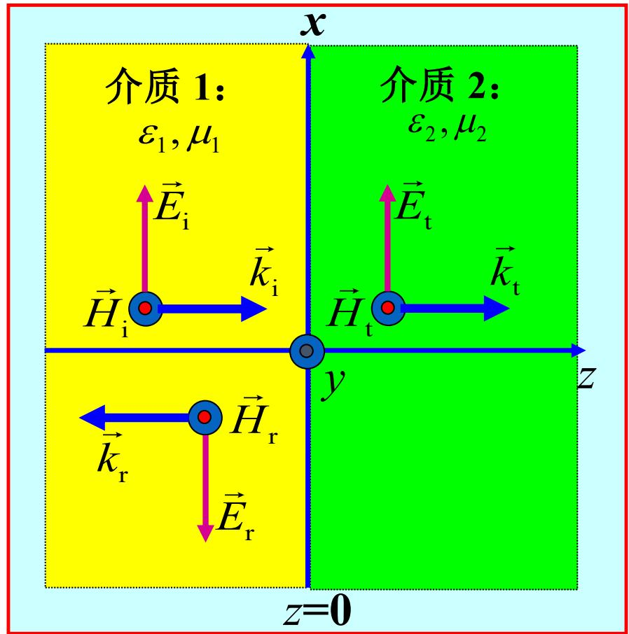

text_image

介质1:
ε₁, μ₁
介质2:
ε₂, μ₂
x
y
z=0
Eᵢ
kᵢ
Hᵢ
Eₜ
kₜ
Hₜ
Eᵣ
kᵣ
Hᵣ
Eᵣ

沿x方向极化的均匀平面波从理想介质1垂直入射到与理想介质2的分界平面上。

媒质1（理想介质）中的入射波:

$$
\vec {E} _ {\mathrm{i}} (z) = \vec {e} _ {x} E _ {\mathrm{im}} \mathbf {e} ^ {- \mathrm{j} \beta_ {1} z} \qquad \vec {H} _ {\mathrm{i}} (z) = \vec {e} _ {z} \times \frac {1}{\eta_ {1}} \vec {E} _ {\mathrm{i}} (z) = \vec {e} _ {y} \frac {E _ {\mathrm{im}}}{\eta_ {1}} \mathbf {e} ^ {- \mathrm{j} \beta_ {1} z}
$$

这里 $\beta_{1} = \omega \sqrt{\mu_{1}\varepsilon_{1}},\eta_{1} = \sqrt{\frac{\mu_{1}}{\varepsilon_{1}}}$

媒质1（理想介质）中的反射波：

$$
\vec {E} _ {\mathrm{r}} (z) = \vec {e} _ {x} E _ {\mathrm{rm}} \mathbf {e} ^ {j \beta_ {1} z}; \vec {H} _ {\mathrm{r}} (z) = - \vec {e} _ {z} \times \frac {1}{\eta_ {1}} \vec {E} _ {\mathrm{r}} (z) = - \vec {e} _ {y} \frac {E _ {\mathrm{rm}}}{\eta_ {1}} \mathbf {e} ^ {j \beta_ {1} z}
$$

媒质1中的合成波：

$$
\vec {E} _ {\mathrm{l}} (z) = \vec {E} _ {\mathrm{i}} (z) + \vec {E} _ {\mathrm{r}} (z) = \vec {e} _ {x} \left(E _ {\mathrm{im}} \mathbf {e} ^ {- j \beta_ {\mathrm{l}} z} + E _ {\mathrm{rm}} \mathbf {e} ^ {j \beta_ {\mathrm{l}} z}\right)
$$

$$
\vec {H} _ {\mathrm{l}} (z) = \vec {H} _ {\mathrm{i}} (z) + \vec {H} _ {\mathrm{r}} (z) = \vec {e} _ {y} \frac {1}{\eta_ {\mathrm{l}}} \Big (E _ {\mathrm{im}} \mathbf {e} ^ {- j \beta_ {\mathrm{l}} z} - E _ {\mathrm{rm}} \mathbf {e} ^ {j \beta_ {\mathrm{l}} z} \Big)
$$

# 媒质2（理想介质）中只有透射波：

$$
\vec {E} _ {2} (z) = \vec {E} _ {\mathrm{t}} (z) = \vec {e} _ {x} E _ {\mathrm{tm}} \mathbf {e} ^ {- \mathrm{j} \beta_ {2} z}
$$

$$
\vec {H} _ {2} (z) = \vec {H} _ {\mathrm{t}} (z) = \vec {e} _ {z} \times \frac {1}{\eta_ {2}} \vec {E} _ {\mathrm{t}} (z) = \vec {e} _ {y} \frac {E _ {\mathrm{tm}}}{\eta_ {2}} \mathbf {e} ^ {- \mathrm{j} \beta_ {2} z}
$$

这里： $\beta_{2} = \omega \sqrt{\mu_{2}\varepsilon_{2}}$ $\eta_{2} = \sqrt{\frac{\mu_{2}}{\varepsilon_{2}}}$

在分界面 $z = 0$ 上，电场强度和磁场强度切向分量连续，即

$$
\left\{ \begin{array}{l} E _ {1 x} (0) = E _ {2 x} (0) \\ H _ {1 y} (0) = H _ {2 y} (0) \end{array} \right. \longrightarrow \left\{ \begin{array}{l} E _ {\mathrm{im}} + E _ {\mathrm{rm}} = E _ {\mathrm{tm}} \\ \frac {1}{\eta_ {1}} (E _ {\mathrm{im}} - E _ {\mathrm{rm}}) = \frac {1}{\eta_ {2}} E _ {\mathrm{tm}} \end{array} \right.
$$

由此解得： $\left\{ \begin{array}{l}E_{\mathrm{rm}} = \frac{\eta_2 - \eta_1}{\eta_2 + \eta_1} E_{\mathrm{im}}\\ E_{\mathrm{tm}} = \frac{2\eta_2}{\eta_2 + \eta_1} E_{\mathrm{im}} \end{array} \right.$

定义分界面上的反射系数 $\Gamma$ 为反射波电场的振幅与入射波电场振幅之比、透射系数 $\tau$ 为透射波电场的振幅与入射波电场振幅之比，则

$$
\left\{ \begin{array}{r l} & {\Gamma = \frac {E _ {\mathrm{rm}}}{E _ {\mathrm{im}}} = \frac {\eta_ {2} - \eta_ {1}}{\eta_ {2} + \eta_ {1}}} \\ & {\tau = \frac {E _ {\mathrm{tm}}}{E _ {\mathrm{im}}} = \frac {2 \eta_ {2}}{\eta_ {2} + \eta_ {1}}} \end{array} \right.
$$

媒质1中的入射波： $\vec{E}_{\mathrm{i}}(z) = \vec{e}_x E_{\mathrm{im}} e^{-j\beta_1 z}$

$$
\vec {H} _ {\mathrm{i}} (z) = \vec {e} _ {y} \frac {E _ {\mathrm{im}}}{\eta_ {1}} \mathbf {e} ^ {- \mathrm{j} \beta_ {1} z}
$$

媒质1中的反射波: $\vec{E}_{\mathrm{r}}(z) = \vec{e}_x\Gamma E_{\mathrm{im}}\mathrm{e}^{\mathrm{j}\beta_1z}$

$$
\vec {H} _ {\mathrm{r}} (z) = - \vec {e} _ {y} \frac {\Gamma E _ {\mathrm{im}}}{\eta_ {1}} \mathrm{e} ^ {\mathrm{j} \beta_ {1} z}
$$

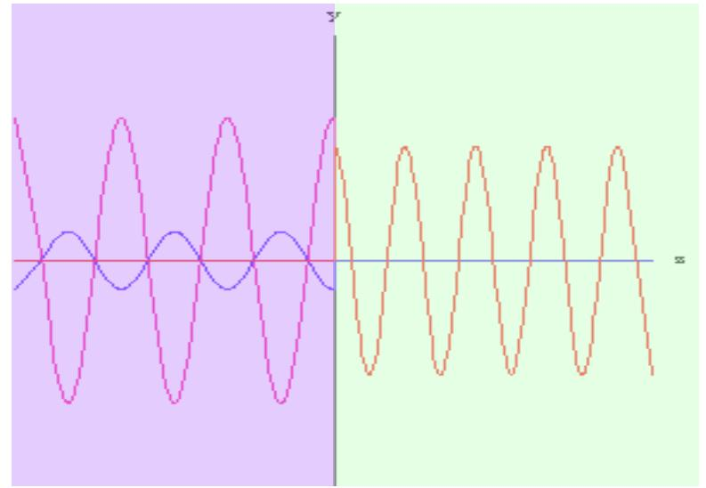

line

| x    | y (blue) | y (red) | y (orange) |
| ---- | -------- | ------- | ---------- |
| 0    | 0        | 0       | 0          |
| 1    | 0.5      | 0.8     | -0.2       |
| 2    | 0.3      | 0.6     | 0.4        |
| 3    | 0.7      | 0.4     | -0.6       |
| 4    | 0.2      | 0.9     | 0.8        |
| 5    | -0.1     | 0.7     | -0.4       |
| 6    | 0.6      | 0.5     | 0.6        |
| 7    | 0.4      | 0.7     | -0.2       |
| 8    | -0.3     | 0.6     | 0.8        |
| 9    | 0.8      | 0.4     | -0.4       |
| 10   | 0.5      | 0.9     | 0.6        |
| 11   | -0.2     | 0.7     | -0.8       |
| 12   | 0.7      | 0.5     | 0.4        |
| 13   | 0.3      | 0.7     | -0.2       |
| 14   | -0.6     | 0.6     | 0.8        |
| 15   | 0.9      | 0.4     | -0.4       |
| 16   | 0.2      | 0.9     | 0.6        |
| 17   | -0.4     | 0.7     | -0.8       |
| 18   | 0.8      | 0.5     | 0.8        |
| 19   | 0.5      | 0.7     | -0.2       |
| 20   | -0.3     | 0.6     | 0.4        |
| 21   | 0.7      | 0.4     | -0.6       |
| 22   | 0.3      | 0.9     | 0.8        |
| 23   | -0.6     | 0.7     | -0.4       |
| 24   | 0.9      | 0.5     | 0.6        |
| 25   | 0.2      | 0.7     | -0.2       |
| 26   | -0.4     | 0.6     | 0.8        |
| 27   | 0.8      | 0.4     | -0.4       |
| 28   | 0.5      | 0.9     | 0.6        |
| 29   | -0.3     | 0.7     | -0.8       |
| 30   | 0.7      | 0.5     | 0.8        |
| 31   | 0.3      | 0.7     | -0.2       |
| 32   | -0.6     | 0.6     | 0.4        |
| 33   | 0.9      | 0.4     | -0.6       |
| 34   | 0.2      | 0.9     | 0.6        |
| 35   | -0.4     | 0.7     | -0.8       |
| 36   | 0.8      | 0.5     | 0.8        |
| 37   | 0.5      | 0.7     | -0.2       |
| 38   | -0.3     | 0.6     | 0.4        |
| 39   | 0.7      | 0.4     | -0.6       |
| 40   | 0.3      | 0.9     | 0.6        |
| 41   | -0.6     | 0.7     | -0.8       |
| 42   | 0.9      | 0.5     | 0.8        |
| 43   | 0.2      | 0.7     | -0.2       |
| 44   | -0.4     | 0.6     | 0.4        |
| 45   | 0.8      | 0.4     | -0.6       |
| 46   | 0.5      | 0.9     | -0.8       |
| 47   | -0.3     | 0.7     | -1.2       |
| 48   | 0.7      | 0.5     | -1.4       |
| 49   | 0.3      | 0.7     | -1.6       |
| 50   | -0.6     | 0.6     | -1.8       |
| 51   | 1         | nan     | nan        |
| 52   | nan      | nan     | nan        |
| 53   | nan      | nan     | nan        |
| 54   | nan      | nan     | nan        |
| 55   | nan      | nan     | nan        |
| 56   | nan      | nan     | nan        |
| 57   | nan      | nan     | nan        |
| 58   | nan      | nan     | nan        |
| 59   | nan      | nan     | nan        |
| 60   | nan      | nan     | nan        |
| Note: The actual values for y and x are not provided in the code snippet, so they are represented as placeholders (e.g., "x", "y", "z" for the y-axis). You would need to run the code if you want to run the x-axis labels ("x", "y", or labels "z" for the y-axis labels ("x", "y").

媒质1中的合成波： $\vec{E}_1(z) = \vec{E}_{\mathrm{i}}(z) + \vec{E}_{\mathrm{r}}(z) = \vec{e}_xE_{\mathrm{im}}(\mathrm{e}^{-\mathrm{j}\beta_1z} + \Gamma \mathrm{e}^{\mathrm{j}\beta_1z})$

$$
\vec {H} _ {\mathrm{l}} (z) = \vec {H} _ {\mathrm{i}} (z) + \vec {H} _ {\mathrm{r}} (z) = \vec {e} _ {y} \frac {E _ {\mathrm{im}}}{\eta_ {\mathrm{l}}} (\mathrm{e} ^ {- \mathrm{j} \beta_ {\mathrm{l}} z} - \Gamma \mathrm{e} ^ {\mathrm{j} \beta_ {\mathrm{l}} z})
$$

媒质2中的透射波： $\vec{E}_{2}(z)=\vec{E}_{t}(z)=\vec{e}_{x}\tau E_{im}e^{-j\beta_{2}z}$

$$
\vec {H} _ {2} (z) = \vec {H} _ {\mathrm{t}} (z) = \vec {e} _ {y} \frac {\tau E _ {\mathrm{im}}}{\eta_ {2}} \mathrm{e} ^ {- \mathrm{j} \beta_ {2} z}
$$

$$
\Gamma = \frac {\eta_ {2} - \eta_ {1}}{\eta_ {2} + \eta_ {1}}, \quad \tau = \frac {2 \eta_ {2}}{\eta_ {2} + \eta_ {1}}
$$

# 讨论

当 $\eta_{2} > \eta_{1}$ 时， $\Gamma > 0$ ，反射波电场与入射波电场同相。  
当 $\eta_{2} < \eta_{1}$ 时， $\Gamma < 0$ ，反射波电场与入射波电场反相。

$$
1 + \Gamma = \tau
$$

$$
0 \leq \tau \leq 2
$$

$$
\eta_ {2} <   \eta_ {1}, \tau <   1; \eta_ {2} > \eta_ {1}, \tau > 1
$$

# 合成波的特点

$$
\begin{array}{l} \vec {E} _ {1} (z) = \vec {e} _ {x} E _ {\mathrm{im}} (\mathbf {e} ^ {- \mathrm{j} \beta_ {1} z} + \Gamma \mathbf {e} ^ {\mathrm{j} \beta_ {1} z}) \\ = \vec {e} _ {x} E _ {\mathrm{im}} \left[ (1 + \Gamma) \mathrm{e} ^ {- \mathrm{j} \beta_ {1} z} + \Gamma (\mathrm{e} ^ {\mathrm{j} \beta_ {1} z} - \mathrm{e} ^ {- \mathrm{j} \beta_ {1} z}) \right] \\ = \vec {e} _ {x} E _ {\mathrm{im}} \left[ (1 + \Gamma) \mathrm{e} ^ {- \mathrm{j} \beta_ {1} z} + \mathrm{j} 2 \Gamma \sin (\beta_ {1} z) \right] \\ \end{array}
$$

# 这种由行波和纯驻波合成的波称为行驻波（混合波）

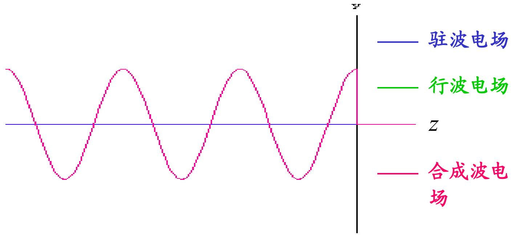

line

| Time Point | 驻波电场 (V) | 行波电场 (V) | 合成波电场 (V) |
| ---------- | ------------ | ------------ | -------------- |
| 0          | 0            | 0            | 0              |
| 1          | 0            | 0            | 0              |
| 2          | 0            | 0            | 0              |
| 3          | 0            | 0            | 0              |
| 4          | 0            | 0            | 0              |
| 5          | 0            | 0            | 0              |
| 6          | 0            | 0            | 0              |
| 7          | 0            | 0            | 0              |
| 8          | 0            | 0            | 0              |
| 9          | 0            | 0            | 0              |
| 10         | 0            | 0            | 0              |
| 11         | 0            | 0            | 0              |
| 12         | 0            | 0            | 0              |
| 13         | 0            | 0            | 0              |
| 14         | 0            | 0            | 0              |
| 15         | 0            | 0            | 0              |
| 16         | 0            | 0            | 0              |
| 17         | 0            | 0            | 0              |
| 18         | 0            | 0            | 0              |
| 19         | 0            | 0            | 0              |
| 20         | 0            | 0            | 0              |
| 21         | 0            | 0            | 0              |
| 22         | 0            | 0            | 0              |
| 23         | 0            | 0            | 0              |
| 24         | 0            | 0            | 0              |
| 25         | 0            | 0            | 0              |
| 26         | 0            | 0            | 0              |
| 27         | 0            | 0            | 0              |
| 28         | 0            | 0            | 0              |
| 29         | 0            | 0            | 0              |
| 30         | 0            | 0            | 0              |
| 31         | 0            | 0            | 0              |
| 32         | 0            | 0            | 0              |
| 33         | 0            | 0            | 0              |
| 34         | 0            | 0            | 0              |
| 35         | 0            | 0            | 0              |
| 36         | 0            | 0            | 0              |
| 37         | 0            | 0            | 0              |
| 38         | 0            | 0            | 0              |
| 39         | 0            | 0            | 0              |
| 40         | 0            | 0            | 0              |
| 41         | 0            | 0            | 0              |
| 42         | 0            | 0            | 0              |
| 43         | 0            | 0            | 0              |
| 44         | 0            | 0            | 0              |
| 45         | 0            | 0            | 0              |
| 46         | 0            | 0            | 0              |
| 47         | 0            | 0            | 0              |
| 48         | 0            | 0            | 0              |
| 49         | 0            | 0            | 0              |
| 50         | 0            | 0            | 0              |
| ...        | ...          | ...          | ...            |
| ...        | ...          | ...          | ...            |
| ...        | ...          | ...          | ...            |
| ...        | ...          | ...          | ...            |
| ...        | ...          | ...          | ...            |
| ...        | ...          | ...          | ...            |
| ...        | ...          | ...          | ...            |
| ...        | ...          | ...          | ...            |
| ...        | ...          |...          | ...            |
| ...        | ...          | ...          | ...            |
| ...        | ...          | ...          | ...            |
| ...        | ...          | ...          | ...            |
| ...        | ...          | ...          | ...            |
| ...        | ...          | ...          | ...            |
| ...        | ...          | ...          | ...            |
| ...        | ...          | ...          | ...            |
| ...        (Note: The y-axis values are not explicitly labeled in the image, so they are estimated based on the legend and data labels) are estimated based on the chart title. The y-axis label is 'Z'.)

# 合成波电场振幅（ $\Gamma>0$ ）

$$
\vec {E} _ {1} (z) = \vec {e} _ {x} E _ {\mathrm{im}} (\mathbf {e} ^ {- \mathrm{j} \beta_ {1} z} + \Gamma \mathbf {e} ^ {\mathrm{j} \beta_ {1} z})
$$

$$
\left| \vec {E} _ {1} (z) \right| = E _ {\mathrm{im}} \left| 1 + \Gamma \mathrm{e} ^ {\mathrm{j} 2 \beta_ {1} z} \right| = E _ {\mathrm{im}} \sqrt {1 + \Gamma^ {2} + 2 \Gamma \cos (2 \beta_ {1} z)}
$$

当 $\beta_{1}z = -n\pi$ ，即 $z = -n\lambda_{1}/2$ $(n = 0,1,2,\cdots)$ 时，有

$$
\left| \vec {E} _ {1} (z) \right| _ {\mathrm{max}} = E _ {\mathrm{im}} \left| 1 + \varGamma \right|
$$

当 $\beta_{1}z = -(2n + 1)\pi/2$ ，即 $z = -(n/2 + 1/4)\lambda_{1}$ $(n = 0, 1, 2, \cdots)$ 时，有

$$
\left| \vec {E} _ {1} (z) \right| _ {\mathrm{min}} = E _ {\mathrm{im}} \left| 1 - \varGamma \right|
$$

# 合成波电场振幅（ $\Gamma>0$ ）

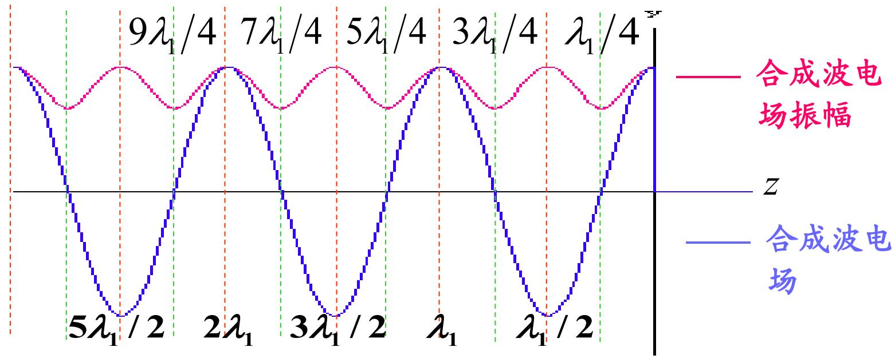

line

| λ₁ / λ₂ | 合成波电场振幅 | 合成波电场 |
| ------- | -------------- | ---------- |
| 5       | ~0.8           | ~0.0       |
| 9       | ~0.8           | ~0.0       |
| 2       | ~0.8           | ~0.8       |
| 7       | ~0.8           | ~0.0       |
| 3       | ~0.8           | ~-0.8      |
| 5       | ~0.8           | ~0.8       |
| 7       | ~0.8           | ~0.0       |
| 3       | ~0.8           | ~-0.8      |
| 5       | ~0.8           | ~0.8       |
| 7       | ~0.8           | ~0.0       |
| 9       | ~0.8           | ~-0.8      |

# 合成波电场振幅（ $\Gamma<0$ ）

$$
\left| \vec {E} _ {1} (z) \right| = E _ {\mathrm{im}} \left| 1 + \varGamma \mathbf {e} ^ {\mathrm{j} 2 \beta_ {1} z} \right| = E _ {\mathrm{im}} \sqrt {1 + \varGamma^ {2} + 2 \varGamma \cos (2 \beta_ {1} z)}
$$

当 $\beta_{1}z = -n\pi$ ，即 $z = -n\lambda_{1}/2$ $(n = 0,1,2,\cdots)$ 时，有

$$
\left| \vec {E} _ {1} (z) \right| _ {\mathrm{min}} = E _ {\mathrm{im}} \left| 1 + \varGamma \right|
$$

当 $\beta_{1}z=-(2n+1)\pi/2$ ，即 $z=-(n/2+1/4)\lambda_{1}$ $(n=0,1,2,\cdots)$ 时，有

$$
\left| \vec {E} _ {1} (z) \right| _ {\mathrm{max}} = E _ {\mathrm{im}} \left| 1 - \varGamma \right|
$$

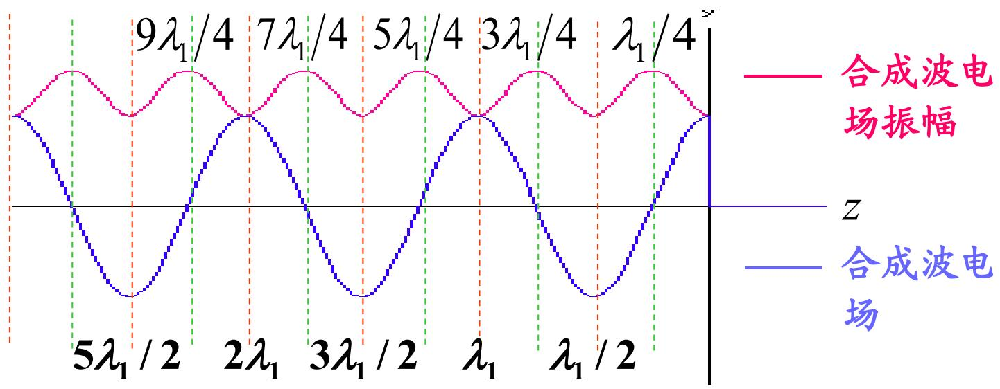

line

| λ₁ / 2 | 合成波电场振幅 | 合成波电场 |
| ------ | -------------- | ---------- |
| 5      | 0              | 0          |
| 9      | 1              | -1         |
| 2      | 0              | 0          |
| 7      | 1              | -1         |
| 3      | 0              | 0          |
| 5      | 1              | -1         |
| 9      | 0              | 0          |
| 3      | 1              | -1         |
| 7      | 0              | 0          |
| 3      | 1              | -1         |
| 5      | 0              | 0          |
| 9      | 1              | -1         |
| 3      | 0              | 0          |
| 3      | 1              | -1         |
| 7      | 0              | 0          |
| 3      | 1              | -1         |
| 9      | 0              | 0          |
| 3      | 1              | -1         |
| 3      | 0              | 0          |
| 7      | 1              | -1         |
| 3      | 0              | 0          |
| 9      | 1              | -1         |
| 3      | 0              | 0          |
| 3      | 1              | -1         |
| 7      | 0              | 0          |
| 3      | 1              | -1         |
| 9      | 0              | 0          |
| 3      | 1              | -1        |
| 3      | 0              | 0          |
| 7      | 1              | -1         |
| 3      | 0              | 0          |
| 9      | 1              | -1        |
| 3      | 0              | 0          |
| 3      | 1              | -1        |
| 7      | 0              | 0          |
| 3      | 1              | -1        |
| 9      | 1              | -1        |
| 3      | 0              | 0          |
| 3      | 1              | -1        |
| 7      | 0              | 0          |
| 3      | 1              | -1        |
| 9      | 1              | -1        |
| 3      | 0              | 0          |
| 3      | 1.5            | -1.5       |
| 7      | 0              | 0          |
| 3      | 1.5            | -1.5       |
| 9      | 0              | 0          |
| 3      | 1.5            | -1.5       |
| 7      | 0              | 0          |
| 3      | 1.5            | -1.5       |
| 9      | 0              | 0          |
| 3      | 1.5            | -1.5       |
| 7      | 0              | 0          |

# 驻波系数(驻波比) S

驻波系数 S 定义为合成波的电场强度振幅的最大值与最小值之比，即

$$
S = \frac {\left| \vec {E} \right| _ {\max}}{\left| \vec {E} \right| _ {\min}} = \frac {1 + | \Gamma |}{1 - | \Gamma |} \quad \Longleftrightarrow \quad | \Gamma | = \frac {S - 1}{S + 1}
$$

# 讨论

当 $\Gamma=0$ 时，S=1，为行波。  
当 $\Gamma=\pm1$ 时， $S=\infty$ ，是纯驻波。  
当 $0 < |\Gamma| < 1$ 时， $1 < S < \infty$ ，为混合波。 $S$ 越大，驻波分量越大，行波分量越小；

例6.5.1 在自由空间，一均匀平面波垂直入射到半无限大的无耗介质平面上，已知自由空间中，合成波的驻波比为3，介质内传输波的波长是自由空间波长的1/6，且分界面上为驻波电场的最小点。求介质的相对磁导率和相对介电常数。

解: 因为驻波比 $S = \frac{1 + |\Gamma|}{1 - |\Gamma|} = 3 \longrightarrow |\Gamma| = \frac{1}{2}$

由于界面上是驻波电场的最小点，故 $\Gamma = -\frac{1}{2}$

而反射系数 $\Gamma=\frac{\eta_{2}-\eta_{1}}{\eta_{2}+\eta_{1}}$ 式中 $\eta_{1}=\eta_{0},\eta_{2}=\sqrt{\frac{\mu_{2}}{\varepsilon_{2}}}=\sqrt{\frac{\mu_{r}}{\varepsilon_{r}}}\eta_{0}$ $\eta_{2}=\frac{1}{3}\eta_{0}\longrightarrow\frac{\mu_{r}}{\varepsilon_{r}}=\frac{1}{9}$

又因为2区的波长 $\lambda_{2}=\frac{\lambda_{0}}{\sqrt{\mu_{r}\varepsilon_{r}}}=\frac{\lambda_{0}}{6}\Longrightarrow\varepsilon_{r}\mu_{r}=36\Longrightarrow\left\{\begin{aligned}\mu_{r}&=2\\\varepsilon_{r}&=18\end{aligned}\right.$

# 电磁能流密度

媒质1中沿 z 方向传播的平均能流密度

$$
\vec {S} _ {\mathrm{iav}} = \frac {1}{2} \operatorname{Re} \left[ \vec {E} _ {\mathrm{i}} \times \vec {H} _ {\mathrm{i}} ^ {*} \right] = \vec {e} _ {z} \frac {1}{2 \eta_ {1}} E _ {\mathrm{im}} ^ {2}
$$

$$
\vec {S} _ {\mathrm{rav}} = \frac {1}{2} \mathrm{Re} \Big [ \vec {E} _ {\mathrm{r}} \times \vec {H} _ {\mathrm{r}} ^ {*} \Big ] = - \vec {e} _ {z} \frac {1}{2 \eta_ {1}} \Gamma^ {2} E _ {\mathrm{im}} ^ {2}
$$

$$
\vec {S} _ {\text {1av}} = \frac {1}{2} \operatorname{Re} \left[ \vec {E} _ {1} \times \vec {H} _ {1} ^ {*} \right] = \vec {e} _ {z} \frac {E _ {\mathrm{im}} ^ {2}}{2 \eta_ {1}} (1 - \Gamma^ {2})
$$

入射波平均能流密度减去反射波平均能流密度

媒质2中的平均能流密度

$$
\vec {S} _ {\mathrm{2av}} = \frac {1}{2} \operatorname{Re} \left[ \vec {E} _ {2} \times \vec {H} _ {2} ^ {*} \right] = \vec {e} _ {z} \frac {E _ {\mathrm{im}} ^ {2}}{2 \eta_ {2}} \tau^ {2}
$$

由 $1 - \Gamma^2 = (1 + \Gamma)(1 - \Gamma) = \frac{\eta_1}{\eta_2}\tau^2$ $\vec{S}_{1\mathrm{av}} = \vec{S}_{2\mathrm{av}}$

习题6.7 入射波电场 $\vec{E}_{i}=\vec{e}_{x}10\cos(3\pi\times10^{9}t-10\pi z)$ V/m从空气（z<0）中正入射到z=0的平面边界面上。在z>0区域中， $\mu_{r}=1$ 、 $\varepsilon_{r}=4$ 。求区域z>0的电场和磁场。

解: $z > 0$ 区域的本征阻抗

$$
\eta_ {2} = \sqrt {\frac {\mu_ {2}}{\varepsilon_ {2}}} = \eta_ {0} \sqrt {\frac {\mu_ {\mathrm{r2}}}{\varepsilon_ {\mathrm{r2}}}} = \frac {1 2 0 \pi}{2} = 6 0 \pi \Omega
$$

透射系数

$$
\tau = \frac {2 \eta_ {2}}{\eta_ {1} + \eta_ {2}} = \frac {2 \times 6 0 \pi}{1 2 0 \pi + 6 0 \pi} = 0. 6 6 7
$$

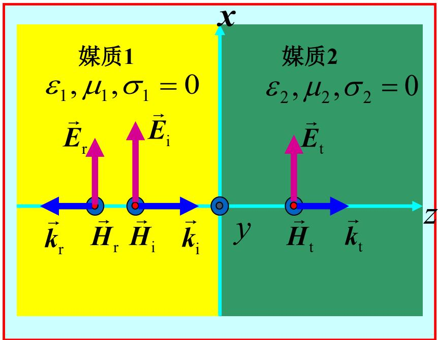

text_image

媒质1
ε₁, μ₁, σ₁ = 0
Eᵣ ↑
→ Eᵢ
kᵣ Hᵣ Hᵢ kᵢ
媒质2
ε₂, μ₂, σ₂ = 0
Eₜ
y Hₜ kₜ
x
z

第五版教材为习题6.7，第六版教材为6.5节习题7

# 相位常数

$$
\beta_ {2} = \omega \sqrt {\mu_ {2} \varepsilon_ {2}} = \omega \sqrt {\mu_ {0} \varepsilon_ {0}} \sqrt {\varepsilon_ {\mathrm{r2}}} = \frac {3 \pi \times 1 0 ^ {9}}{3 \times 1 0 ^ {8}} \times 2 = 2 0 \pi \mathrm{rad/m}
$$

故 $\vec{E}_2 = \vec{e}_xE_{2\mathrm{m}}\cos (\omega t - \beta_2z) = \vec{e}_x\tau E_\mathrm{im}\cos (\omega t - \beta_2z)$

$$
= \vec {e} _ {x} 0. 6 6 7 \times 1 0 \cos (3 \pi \times 1 0 ^ {9} t - 2 0 \pi z)
$$

$$
= \vec {e} _ {x} 6. 6 7 \cos (3 \pi \times 1 0 ^ {9} t - 2 0 \pi z) \mathrm{V/m}
$$

$$
\vec {H} _ {2} = \frac {1}{\eta_ {2}} \vec {e} _ {z} \times \vec {E} _ {2}
$$

$$
= \vec {e} _ {y} \frac {6 . 6 7}{6 0 \pi} \cos (3 \pi \times 1 0 ^ {9} t - 2 0 \pi z)
$$

$$
= \vec {e} _ {y} 0. 0 3 6 \cos (3 \pi \times 1 0 ^ {9} t - 2 0 \pi z) \mathrm{A/m}
$$

# 第五版教材为习题6.8，第六版教材为本章习题14

习题6.8 已知媒质1的 $\varepsilon_{r1}=4$ 、 $\mu_{r1}=1$ 、 $\sigma_{1}=0$ ；媒质2的 $\varepsilon_{r2}=10$ 、 $\mu_{r2}=4$ 、 $\sigma_{2}=0$ 。角频率 $\omega=5\times10^{8}rad/s$ 的均匀平面波从媒质1垂直入射到分界面上，设入射波是沿x轴方向的线极化波，在t=0、z=0时，入射波电场的振幅为2.4V/m。求：

(1) $\beta_{1}$ 和 $\beta_{2}$ ;  
(2) 反射系数 $\Gamma$ ;  
(3) 1区的电场 $\vec{E}_{1}(z,t)$ ;  
(4) 2区的电场 $\vec{E}_{2}(z,t)$ 。

解: (1) $\beta_{1} = \omega \sqrt{\mu_{1} \varepsilon_{1}} = \omega \sqrt{\mu_{0} \varepsilon_{0}} \sqrt{\mu_{\mathrm{r} 1} \varepsilon_{\mathrm{r} 1}} = \frac{5 \times 10^{8}}{3 \times 10^{8}} \times 2 = 3.33 \mathrm{rad / m}$

$$
\beta_ {2} = \omega \sqrt {\mu_ {0} \varepsilon_ {0}} \sqrt {\mu_ {\mathrm{r2}} \varepsilon_ {\mathrm{r2}}} = \frac {5 \times 1 0 ^ {8}}{3 \times 1 0 ^ {8}} \sqrt {1 0 \times 4} = 1 0. 5 4 \mathrm{rad/m}
$$

(2) $\eta_{1} = \sqrt{\frac{\mu_{1}}{\varepsilon_{1}}} = \eta_{0}\sqrt{\frac{\mu_{\mathrm{r1}}}{\varepsilon_{\mathrm{r1}}}} = \eta_{0}\frac{1}{2} = 60\pi \Omega$

$$
\eta_ {2} = \sqrt {\frac {\mu_ {2}}{\varepsilon_ {2}}} = \eta_ {0} \sqrt {\frac {\mu_ {\mathrm{r2}}}{\varepsilon_ {\mathrm{r2}}}} = \eta_ {0} \sqrt {\frac {4}{1 0}} \approx 7 5. 9 \pi \Omega
$$

$$
\Gamma = \frac {\eta_ {2} - \eta_ {1}}{\eta_ {2} + \eta_ {1}} = \frac {7 5 . 9 - 6 0}{6 0 + 7 5 . 9} = 0. 1 1 7
$$

# (3) 1区的电场

$$
\vec {E} _ {\mathrm{l}} (z) = \vec {E} _ {\mathrm{i}} (z) + \vec {E} _ {\mathrm{r}} (z) = \vec {e} _ {x} E _ {\mathrm{im}} (\mathrm{e} ^ {- \mathrm{j} \beta_ {\mathrm{l}} z} + \Gamma \mathrm{e} ^ {\mathrm{j} \beta_ {\mathrm{l}} z})
$$

$$
= \vec {e} _ {x} E _ {\mathrm{im}} [ (1 + \Gamma) \mathrm{e} ^ {- \mathrm{j} \beta_ {1} z} + \mathrm{j} 2 \Gamma \sin (\beta_ {1} z) ]
$$

$$
= \vec {e} _ {x} 2. 4 [ 1. 1 1 7 \mathrm{e} ^ {- \mathrm{j} 3. 3 3 z} + \mathrm{j} 0. 2 3 4 \sin (3. 3 3 z) ]
$$

或 $\vec{E}_1(z) = \vec{E}_{\mathrm{i}}(z) + \vec{E}_{\mathrm{r}}(z) = \vec{e}_x2.4\mathrm{e}^{-\mathrm{j}3.33z} + \vec{e}_x0.281\mathrm{e}^{\mathrm{j}3.33z}$

# 1区的电场瞬时值

$$
\vec {E} _ {1} (z, t) = \operatorname{Re} \left[ \vec {E} _ {1} (z) \mathrm{e} ^ {\mathrm{j} \omega t} \right]
$$

$$
= \vec {e} _ {x} 2. 4 \cos (5 \times 1 0 ^ {8} t - 3. 3 3 z) + \vec {e} _ {x} 0. 2 8 1 \cos (5 \times 1 0 ^ {8} t + 3. 3 3 z)
$$

(4) $\tau = \frac{2\eta_2}{\eta_1 + \eta_2} \approx 1.12$

故 $\vec{E}_2(z) = \vec{e}_xE_{\mathrm{tm}}\mathrm{e}^{-\mathrm{j}\beta_2z} = \vec{e}_x\tau E_{\mathrm{im}}\mathrm{e}^{-\mathrm{j}\beta_2z}$

$$
= \vec {e} _ {x} 1. 1 2 \times 2. 4 \mathrm{e} ^ {- \mathrm{j} 1 0. 5 4 z} = \vec {e} _ {x} 2. 6 8 \mathrm{e} ^ {- \mathrm{j} 1 0. 5 4 z}
$$

$$
\vec {E} _ {2} (z, t) = \operatorname{Re} \left[ \vec {E} _ {2} (z) \mathrm{e} ^ {\mathrm{j} \omega t} \right] = \vec {e} _ {x} 2. 6 8 \cos (5 \times 1 0 ^ {8} t - 1 0. 5 4 z)
$$

# 6.1.2 向导电媒质分界面的垂直入射

z < 0 中，导电媒质1 的参数为

$$
\mu_ {1}, \varepsilon_ {1}, \sigma_ {1}
$$

z>0中，导电媒质2的参数为

$$
\mu_ {2} 、 \varepsilon_ {2} 、 \sigma_ {2}
$$

沿x方向极化的均匀平面波从媒质1垂直入射到与导电媒质2的分界平面上。

text_image

媒质1:
ε₁,μ₁,σ₁
媒质2:
ε₂,μ₂,σ₂
Eᵢ
kᵢ
Hᵢ
Hₜ
kₜ
y
z
kᵣ
Hᵣ
Eᵣ

媒质1中的入射波:

$$
\vec {E} _ {\mathrm{i}} (z) = \vec {e} _ {x} E _ {\mathrm{im}} \mathbf {e} ^ {- \gamma_ {1} z}
$$

$$
\vec {H} _ {\mathrm{i}} (z) = \vec {e} _ {y} \frac {E _ {\mathrm{im}}}{\eta_ {\mathrm{lc}}} \mathrm{e} ^ {- \gamma_ {1} z}
$$

媒质1中的反射波：

$$
\vec {E} _ {\mathrm{r}} (z) = \vec {e} _ {x} E _ {\mathrm{rm}} \mathbf {e} ^ {\gamma_ {1} z}
$$

$$
\vec {H} _ {\mathrm{r}} (z) = - \vec {e} _ {y} \frac {E _ {\mathrm{rm}}}{\eta_ {\mathrm{lc}}} \mathrm{e} ^ {\gamma_ {1} z}
$$

$$
\begin{array}{l} \gamma_ {1} = \mathrm{j} k _ {\mathrm{1c}} = \mathrm{j} \omega \sqrt {\mu_ {1} \varepsilon_ {\mathrm{1c}}} \\ = \mathrm{j} \omega \sqrt {\mu_ {1} \varepsilon_ {1}} (1 - \mathrm{j} \frac {\sigma_ {1}}{\omega \varepsilon_ {1}}) ^ {1 / 2} \\ \end{array}
$$

$$
\eta_ {\mathrm{1c}} = \sqrt {\frac {\mu_ {1}}{\varepsilon_ {\mathrm{1c}}}} = \sqrt {\frac {\mu_ {1}}{\varepsilon_ {1}}} (1 - \mathrm{j} \frac {\sigma_ {1}}{\omega \varepsilon_ {1}}) ^ {- 1 / 2}
$$

$$
= \eta_ {1} (1 - \mathrm{j} \frac {\sigma_ {1}}{\omega \varepsilon_ {1}}) ^ {- 1 / 2}
$$

媒质1中的合成波：

$$
\vec {E} _ {\mathrm{l}} (z) = \vec {E} _ {\mathrm{i}} (z) + \vec {E} _ {\mathrm{r}} (z) = \vec {e} _ {x} E _ {\mathrm{im}} \mathbf {e} ^ {- \gamma_ {1} z} + \vec {e} _ {x} E _ {\mathrm{rm}} \mathbf {e} ^ {\gamma_ {1} z}
$$

$$
\vec {H} _ {\mathrm{l}} (z) = \vec {H} _ {\mathrm{i}} (z) + \vec {H} _ {\mathrm{r}} (z) = \vec {e} _ {y} \frac {E _ {\mathrm{im}}}{\eta_ {\mathrm{lc}}} \mathrm{e} ^ {- \gamma_ {\mathrm{l}} z} - \vec {e} _ {y} \frac {E _ {\mathrm{rm}}}{\eta_ {\mathrm{lc}}} \mathrm{e} ^ {\gamma_ {\mathrm{l}} z}
$$

媒质2中的透射波：

$$
\vec {E} _ {\mathrm{t}} (z) = \vec {e} _ {x} E _ {\mathrm{tm}} \mathbf {e} ^ {- \gamma_ {2} z}, \vec {H} _ {\mathrm{t}} (z) = \vec {e} _ {y} \frac {E _ {\mathrm{tm}}}{\eta_ {\mathrm{2c}}} \mathbf {e} ^ {- \gamma_ {2} z}
$$

$$
\gamma_ {2} = \mathrm{j} k _ {\mathrm{2c}} = \mathrm{j} \omega \sqrt {\mu_ {2} \varepsilon_ {\mathrm{2c}}} = \mathrm{j} \omega \sqrt {\mu_ {2} \varepsilon_ {2}} (1 - \mathrm{j} \frac {\sigma_ {2}}{\omega \varepsilon_ {2}}) ^ {1 / 2}
$$

$$
\eta_ {2 \mathrm{c}} = \sqrt {\frac {\mu_ {2}}{\varepsilon_ {2 \mathrm{c}}}} = \sqrt {\frac {\mu_ {2}}{\varepsilon_ {2}}} (1 - \mathrm{j} \frac {\sigma_ {2}}{\omega \varepsilon_ {2}}) ^ {- 1 / 2} = \eta_ {2} (1 - \mathrm{j} \frac {\sigma_ {2}}{\omega \varepsilon_ {2}}) ^ {- 1 / 2}
$$

在分界面 $z = 0$ 上，电场强度和磁场强度切向分量连续，即

$$
\left\{ \begin{array}{l} \mathbf {E} _ {1} (0) = \mathbf {E} _ {2} (0) \\ \mathbf {H} _ {1} (0) = \mathbf {H} _ {2} (0) \end{array} \right. \quad \Longrightarrow \left\{ \begin{array}{l} E _ {\mathrm{im}} + E _ {\mathrm{rm}} = E _ {\mathrm{tm}} \\ \frac {1}{\eta_ {\mathrm{1c}}} (E _ {\mathrm{im}} - E _ {\mathrm{rm}}) = \frac {1}{\eta_ {\mathrm{2c}}} E _ {\mathrm{tm}} \end{array} \right.
$$

定义分界面上的反射系数 $\Gamma$ 为反射波电场的振幅与入射波电场振幅之比、透射系数 $\tau$ 为透射波电场的振幅与入射波电场振幅之比，则 $E_{\mathrm{rm}} + E_{\mathrm{cm}} = E_{\mathrm{cm}} - E_{\mathrm{rm}} - E_{\mathrm{cm}} - E_{\mathrm{cm}}$

$$
\left\{ \begin{array}{l} E _ {\mathrm{im}} + E _ {\mathrm{rm}} = E _ {\mathrm{tm}} \\ \frac {1}{\eta_ {\mathrm{1c}}} (E _ {\mathrm{im}} - E _ {\mathrm{rm}}) = \frac {1}{\eta_ {\mathrm{2c}}} E _ {\mathrm{tm}} \end{array} \right. \Longrightarrow \left\{ \begin{array}{l} \Gamma = \frac {E _ {\mathrm{rm}}}{E _ {\mathrm{im}}} = \frac {\eta_ {\mathrm{2c}} - \eta_ {\mathrm{1c}}}{\eta_ {\mathrm{2c}} + \eta_ {\mathrm{1c}}} \\ \tau = \frac {E _ {\mathrm{tm}}}{E _ {\mathrm{im}}} = \frac {2 \eta_ {\mathrm{2c}}}{\eta_ {\mathrm{2c}} + \eta_ {\mathrm{1c}}} \end{array} \right.
$$

讨论:

1+Γ=τ   
Γ和τ是复数，表明反射波和透射波的振幅和相位与入射波都不同。  
若媒质2为理想导体，即 $\sigma_{2} = \infty$ ，则 $\eta_{2c} = 0$ ，故有

$$
\Gamma = - 1, \tau = 0
$$

若两种媒质均为理想介质，即 $\sigma_{1} = \sigma_{2} = 0$ ，则得到

$$
\Gamma = \frac {\eta_ {2} - \eta_ {1}}{\eta_ {2} + \eta_ {1}}, \quad \tau = \frac {2 \eta_ {2}}{\eta_ {2} + \eta_ {1}}
$$

# 6.6 均匀平面电磁波向多层介质平面的垂直入射

natural_image

Aerial view of a modern stealth fighter jet flying above clouds, with no visible text or symbols on the aircraft or surroundings.

歼20

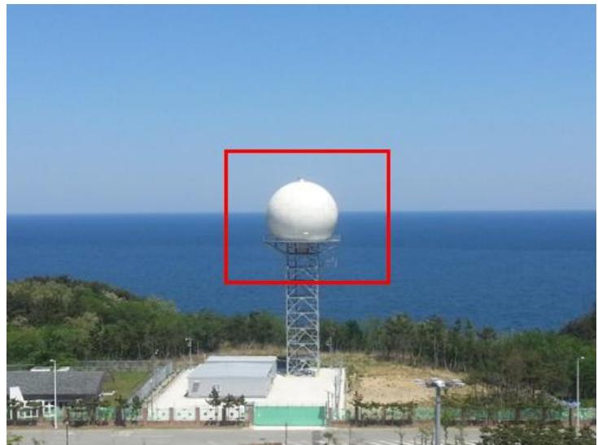

natural_image

Exterior view of a coastal radar tower with a large spherical dish, set against the sea and green hills (no signage or text visible)

12米近程航管雷达天线罩

# 本节内容

多层介质中的场量关系与等效波阻抗

四分之一波长匹配层

半波长介质窗

# 多层介质中的场量关系与等效波阻抗

电磁波在多层介质中的传播具有普遍的实际意义。

以三种介质形成的多层媒
质为例，说明平面波在多层媒
质中的传播过程及其求解方法。

text_image

界面1
① μ₁, ε₁
E₁ᵣ
k₁ᵣ H₁ᵣ
界面2
② μ₂, ε₂
E₂ᵣ
k₂ᵣ H₂ᵣ
③ μ₃, ε₃
O
d
z
E₁ᵢ
H₁ᵢ k₁ᵢ
E₂ᵢ
H₂ᵢ k₂ᵢ
E₃t
H₃t k₃t

如图所示，当平面波自媒质①向分界面垂直入射时，在媒质①和②之间的分界面上发生反射和透射。当透射波到达媒质②和③的分界面时，又发生反射与透射，而且此分界面上的反射波回到媒质①和②的分界面上时再次发生反射与透射。

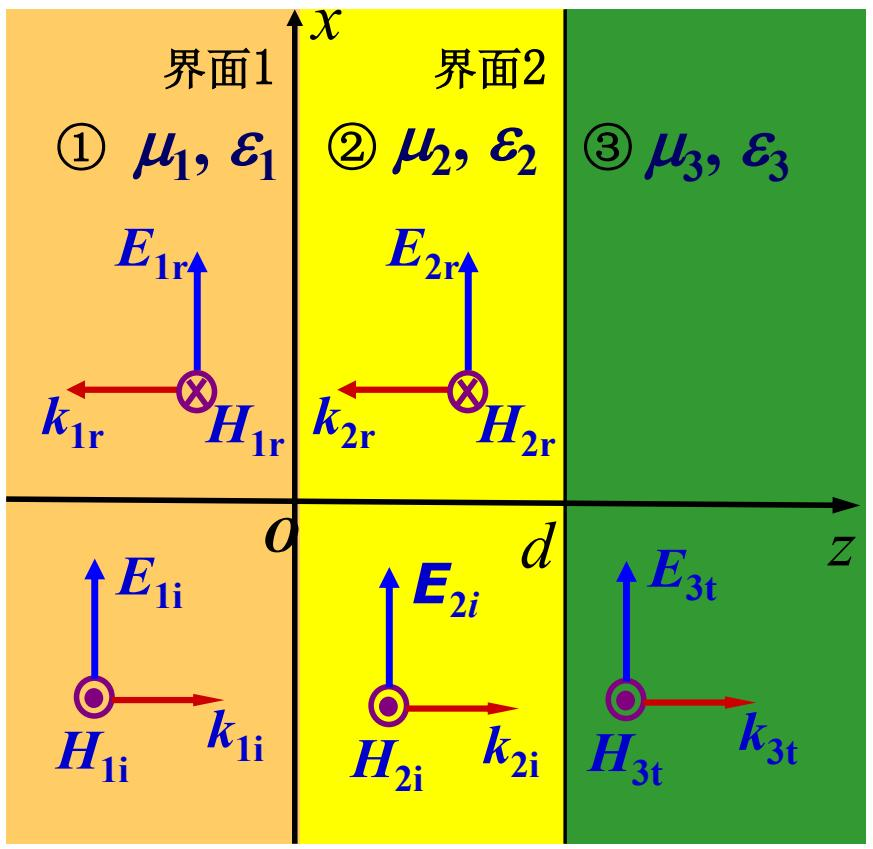

text_image

界面1
① μ₁, ε₁
E₁ᵣ
k₁ᵣ H₁ᵣ
界面2
② μ₂, ε₂
E₂ᵣ
k₂ᵣ H₂ᵣ
③ μ₃, ε₃
O
d
z
E₁ᵢ
H₁ᵢ k₁ᵢ
E₂ᵢ
H₂ᵢ k₂ᵢ
E₃t
H₃t k₃t

由此可见，在两个分界面上发生多次反射与透射现象。

媒质①和②中存在两种平面波，其一是向正z方向传播的波，另一是向负z方向传播的波，在媒质③中仅存在向正z方向传播的波。因此，各个媒质中的电场和磁场强度可以分别表示为

$$
\vec {E} _ {1} (z) = \vec {e} _ {x} (E _ {\mathrm{lim}} \mathbf {e} ^ {- \mathrm{j} \beta_ {1} z} + E _ {\mathrm{1rm}} \mathbf {e} ^ {\mathrm{j} \beta_ {1} z}) = \vec {e} _ {x} E _ {\mathrm{lim}} (\mathbf {e} ^ {- \mathrm{j} \beta_ {1} z} + \Gamma_ {1} \mathbf {e} ^ {\mathrm{j} \beta_ {1} z})
$$

$$
\vec {H} _ {1} (z) = \vec {e} _ {y} \frac {E _ {\mathrm{lim}}}{\eta_ {1}} (\mathrm{e} ^ {- \mathrm{j} \beta_ {1} z} - \Gamma_ {1} \mathrm{e} ^ {\mathrm{j} \beta_ {1} z})
$$

$$
\vec {E} _ {2} (z) = \vec {e} _ {x} [ E _ {\mathrm{2im}} \mathbf {e} ^ {- \mathrm{j} \beta_ {2} (z - d)} + E _ {\mathrm{2rm}} \mathbf {e} ^ {\mathrm{j} \beta_ {2} (z - d)} ] = \vec {e} _ {x} \tau_ {1} E _ {\mathrm{1im}} [ \mathbf {e} ^ {- \mathrm{j} \beta_ {2} (z - d)} + \Gamma_ {2} \mathbf {e} ^ {\mathrm{j} \beta_ {2} (z - d)} ]
$$

$$
\vec {H} _ {2} (z) = \vec {e} _ {y} \frac {\tau_ {1} E _ {1 \mathrm{im}}}{\eta_ {2}} [ \mathbf {e} ^ {- \mathrm{j} \beta_ {2} (z - d)} - \Gamma_ {2} \mathbf {e} ^ {\mathrm{j} \beta_ {2} (z - d)} ]
$$

$$
\vec {E} _ {3} (z) = \vec {e} _ {x} E _ {\mathrm{3tm}} \mathbf {e} ^ {- \mathrm{j} \beta_ {3} (z - d)} = \vec {e} _ {x} \tau_ {1} \tau_ {2} E _ {\mathrm{1im}} \mathbf {e} ^ {- \mathrm{j} \beta_ {3} (z - d)}
$$

$$
\vec {H} _ {3} (z) = \vec {e} _ {y} \frac {\tau_ {1} \tau_ {2} E _ {\mathrm{lim}}}{\eta_ {3}} \mathrm{e} ^ {- \mathrm{j} \beta_ {3} (z - d)}
$$

$$
\vec {E} _ {1} (z) = \vec {e} _ {x} (E _ {\mathrm{lim}} \mathbf {e} ^ {- \mathrm{j} \beta_ {1} z} + E _ {\mathrm{1rm}} \mathbf {e} ^ {\mathrm{j} \beta_ {1} z}) = \vec {e} _ {x} E _ {\mathrm{lim}} (\mathbf {e} ^ {- \mathrm{j} \beta_ {1} z} + \Gamma_ {1} \mathbf {e} ^ {\mathrm{j} \beta_ {1} z})
$$

$$
\vec {H} _ {1} (z) = \vec {e} _ {y} \frac {E _ {\mathrm{lim}}}{\eta_ {1}} (\mathbf {e} ^ {- \mathrm{j} \beta_ {1} z} - \Gamma_ {1} \mathbf {e} ^ {\mathrm{j} \beta_ {1} z})
$$

$$
\Gamma_ {1} = \frac {E _ {\mathrm{1rm}}}{E _ {\mathrm{1im}}}
$$

$$
\vec {E} _ {2} (z) = \vec {e} _ {x} [ E _ {\mathrm{2im}} \mathbf {e} ^ {- \mathrm{j} \beta_ {2} (z - d)} + E _ {\mathrm{2rm}} \mathbf {e} ^ {\mathrm{j} \beta_ {2} (z - d)} ] = \vec {e} _ {x} \tau_ {1} E _ {\mathrm{1im}} [ \mathbf {e} ^ {- \mathrm{j} \beta_ {2} (z - d)} + \Gamma_ {2} \mathbf {e} ^ {\mathrm{j} \beta_ {2} (z - d)} ]
$$

$$
\vec {H} _ {2} (z) = \vec {e} _ {y} \frac {\tau_ {1} E _ {1 \mathrm{im}}}{\eta_ {2}} [ \mathrm{e} ^ {- \mathrm{j} \beta_ {2} (z - d)} - \Gamma_ {2} \mathrm{e} ^ {\mathrm{j} \beta_ {2} (z - d)} ]
$$

$$
\Gamma_ {2} = \frac {E _ {2 \mathrm{rm}}}{E _ {2 \mathrm{im}}}
$$

$$
\tau_ {1} = \frac {E _ {2 \mathrm{im}}}{E _ {1 \mathrm{im}}}
$$

$$
\vec {E} _ {3} (z) = \vec {e} _ {x} E _ {\mathrm{3tm}} \mathrm{e} ^ {- \mathrm{j} \beta_ {3} (z - d)} = \vec {e} _ {x} \tau_ {1} \tau_ {2} E _ {\mathrm{lim}} \mathrm{e} ^ {- \mathrm{j} \beta_ {3} (z - d)}
$$

$$
\vec {H} _ {3} (z) = \vec {e} _ {y} \frac {\tau_ {1} \tau_ {2} E _ {\mathrm{lim}}}{\eta_ {3}} \mathbf {e} ^ {- \mathrm{j} \beta_ {3} (z - d)}
$$

$$
\tau_ {2} = \frac {E _ {\mathrm{3tm}}}{E _ {\mathrm{2im}}}
$$

根据边界条件，在分界面z=d上， $E_{2}(d)=E_{3}(d)$ 、 $H_{2}(d)=H_{3}(d)$ 得

$$
1 + \Gamma_ {2} = \tau_ {2}
$$

$$
\frac {1}{\eta_ {2}} (1 - \Gamma_ {2}) = \frac {\tau_ {2}}{\eta_ {3}}
$$

$$
\Gamma_ {2} = \frac {\eta_ {3} - \eta_ {2}}{\eta_ {3} + \eta_ {2}},
$$

$$
\tau_ {2} = \frac {2 \eta_ {3}}{\eta_ {3} + \eta_ {2}}
$$

在分界面z=0上， $E_{1}(0)=E_{2}(0)$ 、 $H_{1}(0)=H_{2}(0)$ ，得

$$
1 + \Gamma_ {1} = \tau_ {1} [ \mathrm{e} ^ {\mathrm{j} \beta_ {2} d} + \Gamma_ {2} \mathrm{e} ^ {- \mathrm{j} \beta_ {2} d} ]
$$

$$
\frac {1}{\eta_ {1}} (1 - \Gamma_ {1}) = \frac {\tau_ {1}}{\eta_ {2}} [ \mathrm{e} ^ {\mathrm{j} \beta_ {2} d} - \Gamma_ {2} \mathrm{e} ^ {- \mathrm{j} \beta_ {2} d} ]
$$

$$
\Gamma_ {1} = \frac {\eta_ {\mathrm{ef}} - \eta_ {1}}{\eta_ {\mathrm{ef}} + \eta_ {1}},
$$

$$
\tau_ {1} = \frac {1 + \Gamma_ {1}}{\mathbf {e} ^ {\mathrm{j} \beta_ {2} d} + \Gamma_ {2} \mathbf {e} ^ {- \mathrm{j} \beta_ {2} d}}
$$

等效波阻抗

其中： $\eta_{\mathrm{ef}} = \eta_{2}\frac{\mathrm{e}^{\mathrm{j}\beta_{2}d} + \Gamma_{2}\mathrm{e}^{-\mathrm{j}\beta_{2}d}}{\mathrm{e}^{\mathrm{j}\beta_{2}d} - \Gamma_{2}\mathrm{e}^{-\mathrm{j}\beta_{2}d}} = \eta_{2}\frac{\eta_{3} + \mathrm{j}\eta_{2}\tan(\beta_{2}d)}{\eta_{2} + \mathrm{j}\eta_{3}\tan(\beta_{2}d)}$

在计算多层媒质的第一个分界面上的总反射系数时，引入等效波阻抗概念可以简化求解过程。

定义: 媒质中任一点的合成波电场横向分量与合成波磁场横向分量之比为该点的波阻抗 $Z(z)$ , 即

$$
Z (z) = \frac {E _ {x} (z)}{H _ {y} (z)} \quad o r \quad Z (z) = - \frac {E _ {y} (z)}{H _ {x} (z)}
$$

注意：存在反射时，波阻抗不等于媒质的本征阻抗，一般情况下波阻抗与空间坐标有关。

[1]许桂香,于作利,于国安.用类比法引入媒质波阻抗的概念[J].烟台师范学院学报(自然科学版),1999(01):77-79.

（通过媒质中电磁场方程与导体传输线方程的类比及物理量的对应,由传输线的阻抗定义式给出了媒质波阻抗的定义。）

则媒质②中任一点的波阻抗为

$$
Z _ {2} (z) = \frac {E _ {2} (z)}{H _ {2} (z)} = \eta_ {2} \frac {\mathrm{e} ^ {- \mathrm{j} \beta_ {2} (z - d)} + \Gamma_ {2} \mathrm{e} ^ {\mathrm{j} \beta_ {2} (z - d)}}{\mathrm{e} ^ {- \mathrm{j} \beta_ {2} (z - d)} - \Gamma_ {2} \mathrm{e} ^ {\mathrm{j} \beta_ {2} (z - d)}}
$$

在 $z = 0$ 处，有 $Z_{2}(0) = \eta_{2}\frac{\mathrm{e}^{\mathrm{j}\beta_{2}d} + \Gamma_{2}\mathrm{e}^{-\mathrm{j}\beta_{2}d}}{\mathrm{e}^{\mathrm{j}\beta_{2}d} - \Gamma_{2}\mathrm{e}^{-\mathrm{j}\beta_{2}d}} = \eta_{\mathrm{ef}}$

由此可见， $\eta_{\mathrm{ef}}$ 即为媒质②中 $z = 0$ 处的波阻抗。

引入等效波阻抗以后，在计算第一层媒质分界面上的反射系数 $\Gamma_{1}$ 时，第二层媒质和第三层媒质可以看作等效波阻抗为 $\eta_{\mathrm{ef}}$ 的一种媒质。

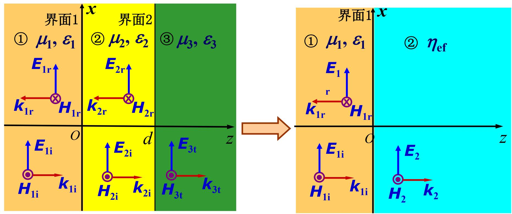

flowchart

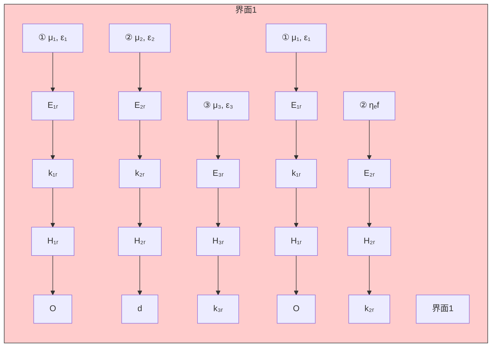
```mermaid
graph LR
    subgraph 界面1
        A["① μ₁, ε₁"] --> B["E₁ᵣ"]
        B --> C["k₁ᵣ"]
        C --> D["H₁ᵣ"]
        D --> E["O"]
        F["② μ₂, ε₂"] --> G["E₂ᵣ"]
        G --> H["k₂ᵣ"]
        H --> I["H₂ᵣ"]
        I --> J["d"]
        K["③ μ₃, ε₃"] --> L["E₃ᵣ"]
        L --> M["H₃ᵣ"]
        M --> N["k₃ᵣ"]
        O["界面1"]
        P["① μ₁, ε₁"] --> Q["E₁ᵣ"]
        Q --> R["k₁ᵣ"]
        R --> S["H₁ᵣ"]
        S --> T["O"]
        U["② ηₑf"] --> V["E₂ᵣ"]
        V --> W["H₂ᵣ"]
        W --> X["k₂ᵣ"]
    end
    style 界面1 fill:#f9f,stroke:#333
    style 界面1 fill:#ccf,stroke:#333
    style 界面1 fill:#cfc,stroke:#333
    style 界面1 fill:#fcc,stroke:#333
    style 界面1 fill:#ffc,stroke:#333
    style 界面1 fill:#cff,stroke:#333
    style 界面1 fill:#ffc,stroke:#333
    style 界面1 fill:#cfc,stroke:#333
    style 界面1 fill:#fcc,stroke:#333
```

上述方法实质上时电路中经常采用的网络分析方法，即只需考虑后置媒质的总体影响，不必关心后置媒质的内部结构。

利用等效波阻抗计算 $n$ 层媒质的第一条边界上的总反射系数时，首先求出第 $(n - 2)$ 条分界面处的等效波阻抗 $\eta_{(n - 2)\mathrm{ef}}$ ，然后用波阻抗为 $\eta_{(n - 2)\mathrm{ef}}$ 的媒质代替第 $(n - 1)$ 层及第 $n$ 层媒质。

依次类推，自右向左逐一计算各条分界面处的等效波阻抗，直至求得第一条边界处的等效波阻抗后，即可计算总反射系数。

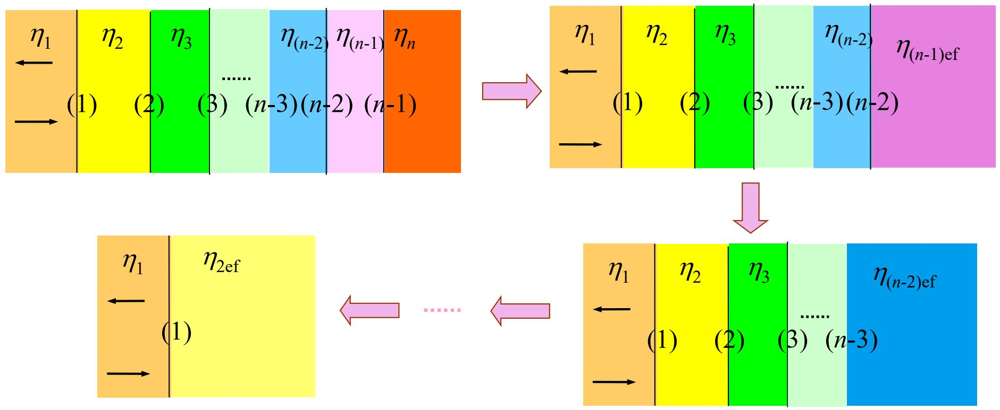

flowchart

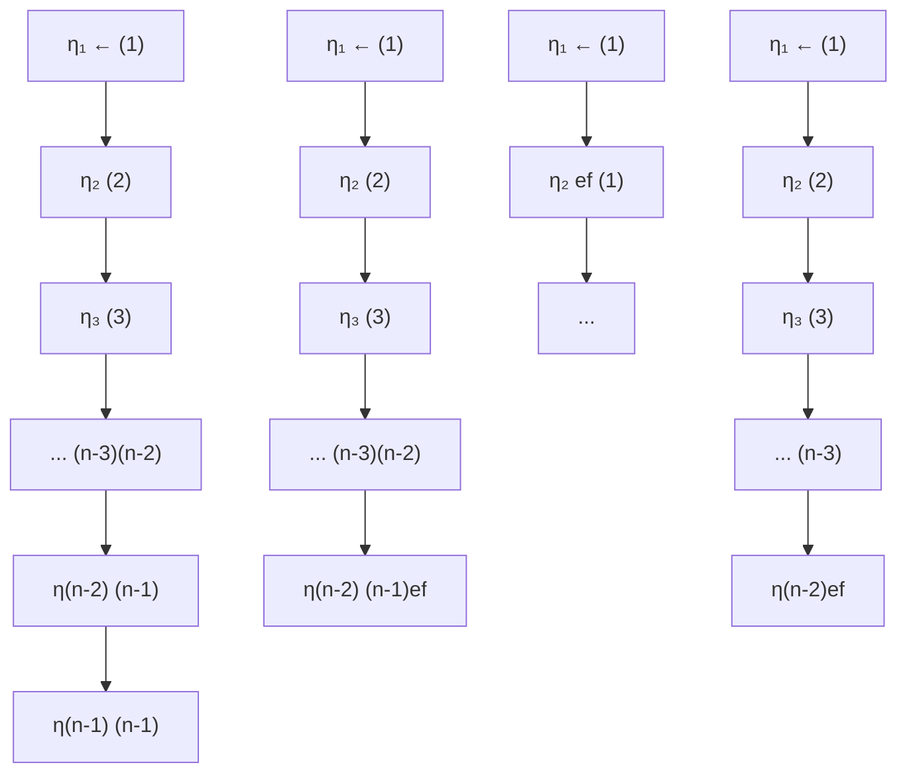
```mermaid
graph TD
    A["η₁ ← (1)"] --> B["η₂ (2)"]
    B --> C["η₃ (3)"]
    C --> D["... (n-3)(n-2)"]
    D --> E["η(n-2) (n-1)"]
    E --> F["η(n-1) (n-1)"]
    
    G["η₁ ← (1)"] --> H["η₂ (2)"]
    H --> I["η₃ (3)"]
    I --> J["... (n-3)(n-2)"]
    J --> K["η(n-2) (n-1)ef"]
    
    L["η₁ ← (1)"] --> M["η₂ ef (1)"]
    M --> N["..."]
    
    O["η₁ ← (1)"] --> P["η₂ (2)"]
    P --> Q["η₃ (3)"]
    Q --> R["... (n-3)"]
    R --> S["η(n-2)ef"]
```

# 典型工程应用：四分之一波长匹配层

设两种理想介质的波阻抗分别为 $\eta_{1}$ 与 $\eta_{3}$ ，为了消除分界面的反射，可在两种理想介质中间插入厚度为四分之一波长（该波长是指平面波在夹层中的波长）的理想介质夹层，如图所示。

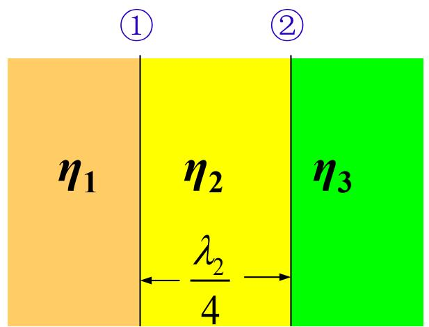

text_image

①
②
η₁ η₂ η₃
← λ₂ / 4 →

首先求出第一个分界面上的等效波阻抗。考虑到

$$
d = \frac {\lambda_ {2}}{4} \quad \Longrightarrow \quad \beta_ {2} d = \frac {\pi}{2}
$$

等效波阻抗

$$
\eta_ {\mathrm{ef}} = \eta_ {2} \frac {\eta_ {3} + \mathrm{j} \eta_ {2} \tan (\beta_ {2} d)}{\eta_ {2} + \mathrm{j} \eta_ {3} \tan (\beta_ {2} d)} = \frac {\eta_ {2} ^ {2}}{\eta_ {3}}
$$

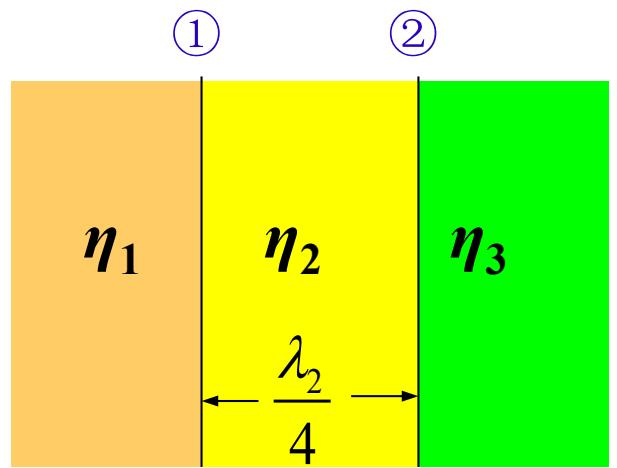

text_image

①
②
η₁ η₂ η₃
← λ₂ / 4 →

为了消除反射，

必须要求 $\eta_{ef} = \eta_{1}$ ，

$$
\Gamma_ {1} = \frac {\eta_ {\mathrm{ef}} - \eta_ {1}}{\eta_ {\mathrm{ef}} + \eta_ {1}}
$$

那么由上式得

$$
\eta_ {1} = \frac {\eta_ {2} ^ {2}}{\eta_ {3}}
$$

$$
\eta_ {2} = \sqrt {\eta_ {1} \eta_ {3}}
$$

例题 频率 $f = 10 \mathrm{GHz}$ 的均匀平面波从空气中垂直入射到 $\varepsilon = 4 \varepsilon_{0}$ 、 $\mu = \mu_{0}, \sigma = 0$ 的理想媒质平面上, 为了消除反射, 在媒质表面涂上 $1/4$ 波长的匹配层。试求匹配层的相对介电常数和最小厚度。

解：已知的本征阻抗为

$$
\eta_ {1} = \eta_ {0} = 3 7 7 \Omega , \eta_ {3} = \frac {\eta_ {0}}{\sqrt {\varepsilon_ {\mathrm{r} 3}}} = 1 8 8. 5 \Omega
$$

则匹配层的本征阻抗为

$$
\eta_ {2} = \sqrt {\eta_ {1} \eta_ {3}} = \sqrt {3 7 7 \times 1 8 8 . 5} \Omega = 3 7 7 / \sqrt {2} \Omega
$$

又由于 $\eta_{2}=\frac{\eta_{0}}{\sqrt{\varepsilon_{r2}}}$ ，故得到

$$
\varepsilon_ {\mathrm{r} 2} = \left(\frac {\eta_ {0}}{\eta_ {2}}\right) ^ {2} = \left(\frac {3 7 7}{3 7 7 / \sqrt {2}}\right) ^ {2} = 2
$$

匹配层的最小厚度

$$
d _ {2} = \frac {\lambda_ {2}}{4} = \frac {0 . 3}{4 \sqrt {2}} \mathrm{m} = 0. 0 5 3 \mathrm{m}
$$

# 典型工程应用：半波长介质窗

如果介质1和介质3是相同的介质，即 $\eta_{3} = \eta_{1}$ ，当介质2的厚度 $d = \lambda_{2} / 2$ 时，有

$$
\tan (\beta_ {2} d) = \tan (\frac {2 \pi}{\lambda_ {2}} \frac {\lambda_ {2}}{2}) = \tan \pi = 0 \implies \eta_ {\mathrm{ef}} = \eta_ {2} \frac {\eta_ {3} + \mathrm{j} \eta_ {2} \tan (\beta_ {2} d)}{\eta_ {2} + \mathrm{j} \eta_ {3} \tan (\beta_ {2} d)} = \eta_ {3} = \eta_ {1}
$$

由此得到介质1与介质2的分界面上的反射系数 $\Gamma_{1} = \frac{\eta_{\mathrm{ef}} - \eta_{1}}{\eta_{\mathrm{ef}} + \eta_{1}} = 0$

同时， $d = \lambda_{2} / 2\longrightarrow \beta_{2}d = \pi \longrightarrow \tau_{1} = \frac{1 + \Gamma_{1}}{\mathrm{e}^{\mathrm{j}\beta_{2}d} + \Gamma_{2}\mathrm{e}^{-\mathrm{j}\beta_{2}d}} = -\frac{1}{1 + \Gamma_{2}}$

$$
\longrightarrow \tau_ {1} \tau_ {2} = - 1 \longrightarrow E _ {\mathrm{3tm}} = - E _ {\mathrm{lim}}
$$

结论: 电磁波可以无损耗地通过厚度为 $\lambda_{2} / 2$ 的介质层。因此, 这种厚度 $d = \lambda_{2} / 2$ 的介质层又称为半波长介质窗。

应用：雷达天线罩的设计就利用了这个原理。为了使雷达天线免受恶劣环境的影响，通常用天线罩将天线保护起来，若天线罩的介质层厚度设计为该介质中的电磁波的半个波长，就可以消除天线罩对电磁波的反射。

natural_image

Exterior view of a coastal radar tower with a large dome structure, overlooking the ocean under a clear blue sky (no signage or text visible)

12米近程航管雷达天线罩

natural_image

Aircraft in flight with a large radar dome on its wing, no visible text or symbols.

空警2000

$$
\eta = \eta_ {0} \sqrt {\frac {\mu_ {r}}{\varepsilon_ {r}}}
$$

此外，如果夹层媒质的相对介电常数等于相对磁导率，即 $\varepsilon_{\mathrm{r}} = \mu_{\mathrm{r}}$ ，那么，夹层媒质的波阻抗等于真空的波阻抗。

当这种夹层置于空气中，平面波向其表面正投射时，无论夹层的厚度如何，反射现象均不可能发生。换言之，这种媒质对于电磁波似乎是完全“透明”的。

由此可见，若使用这种媒质制成保护天线的天线罩，其电磁特性十分优越。但是，普通媒质的磁导率很难与介电常数达到同一数量级。近来研发的新型磁性材料可以接近这种需求。