# 第七章

# 电磁波在导波系统中的导行传输分析

导波系统 —— 引导电磁波从一处定向传输到另一处的装置

导行电磁波 —— 被限制在某一特定区域内传播的电磁波

常用的导波系统的分类:

传输线、金属波导、表面波波导

# 1、传输线

text_image

平行线

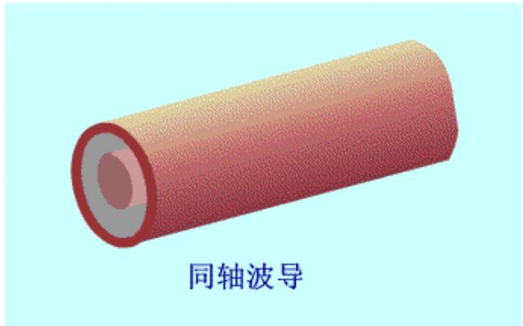

text_image

同轴波导

平行双导线是最简单的传输线，随着工作频率的升高，其辐射损耗急剧增加，故双导线仅用于米波和分米波的低频段。

同轴线没有电磁辐射，工作频带很宽。

# 2、金属波导

natural_image

3D rendered geometric shape with pink and brown triangular sections inside a textured pink block (no text or symbols)

矩形波导

natural_image

Simple 3D illustration of a hollow cylinder with gradient shading (no text or symbols)

圆波导

波导是用金属管制作的导波系统，电磁波在管内传播，损耗很小，主要用于 3GHz 到 30GHz 的频率范围。

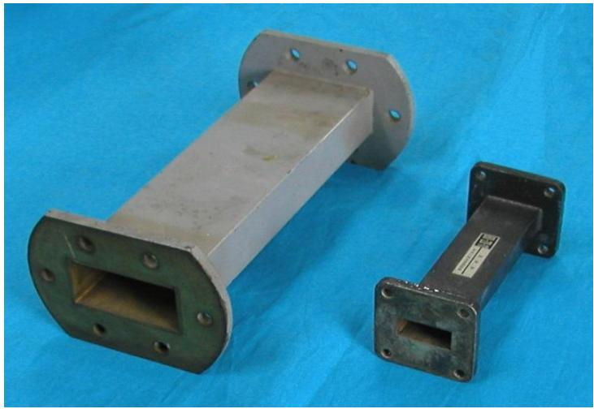

natural_image

Two metallic mechanical components with flanged ends and mounting holes, displayed on a blue fabric background (no text or symbols visible)

# 本章内容

7.1 导行电磁波概论  
7.2 矩形波导   
7.3 圆柱形波导   
7.4 同轴波导  
7.5 谐振腔   
7.6 传输线

# 7.1 导行电磁波概论

分析均匀波导系统时，作如下假定:

★ 波导是无限长的规则直波导，其横截面形状可以任意，但沿轴向处处相同，沿z轴方向放置。

text_image

y
O
x, μ
z

★ 波导内壁是理想导体，即 $\sigma = \infty$ 。  
★ 波导内填充均匀、线性、各向同性无耗媒质，其参数 $\varepsilon$ 、 $\mu$ 和 $\eta$ 均为实常数。  
★ 波导内无源，即 $\rho = 0, J = 0$ 。  
★波导内的电磁场为时谐场，角频率为ω。波沿+z方向传播。

# 1、场矢量

对于均匀波导，导波的电磁场矢量为

$$
\vec {E} (x, y, z) = \vec {E} (x, y) \mathrm{e} ^ {- \gamma z} \quad \vec {H} (x, y, z) = \vec {H} (x, y) \mathrm{e} ^ {- \gamma z}
$$

场分量:

$$
E _ {x} (x, y, z) = E _ {x} (x, y) \mathrm{e} ^ {- \gamma z} \quad H _ {x} (x, y, z) = H _ {x} (x, y) \mathrm{e} ^ {- \gamma z}
$$

$$
E _ {y} (x, y, z) = E _ {y} (x, y) \mathrm{e} ^ {- \gamma z} \quad H _ {y} (x, y, z) = H _ {y} (x, y) \mathrm{e} ^ {- \gamma z}
$$

$$
E _ {z} (x, y, z) = E _ {z} (x, y) \mathrm{e} ^ {- \gamma z} \quad H _ {z} (x, y, z) = H _ {z} (x, y) \mathrm{e} ^ {- \gamma z}
$$

其中:

$$
E _ {x} (x, y, z) 、 E _ {y} (x, y, z) 、 H _ {x} (x, y, z) 、 H _ {y} (x, y, z) - \text {横向分量}
$$

$E_{z}(x,y,z)$ 、 $H_{z}(x,y,z)$ ——纵向分量

# 横向场分量与纵向场分量的关系

直角坐标系中展开

$$
\frac {\partial E _ {z}}{\partial y} + \gamma E _ {y} = - j \omega \mu H _ {x}
$$

$$
\nabla \times \vec {E} = - j \omega \mu \vec {H} \Rightarrow
$$

$$
\frac {\partial E _ {z}}{\partial x} + \gamma E _ {x} = j \omega \mu H _ {y}
$$

$$
\Rightarrow
$$

$$
\frac {\partial E _ {y}}{\partial x} - \frac {\partial E _ {x}}{\partial y} = - j \omega \mu H _ {z}
$$

直角坐标系中展开

$$
\frac {\partial H _ {z}}{\partial y} + \gamma H _ {y} = j \omega \varepsilon E _ {x}
$$

$$
\Longrightarrow
$$

$$
\nabla \times \vec {H} = j \omega \varepsilon \vec {E} \Rightarrow
$$

$$
\frac {\partial H _ {z}}{\partial x} + \gamma H _ {x} = - j \omega \varepsilon E _ {y}
$$

$$
\frac {\partial H _ {y}}{\partial x} - \frac {\partial H _ {x}}{\partial y} = j \omega \varepsilon E _ {z}
$$

$$
H _ {x} = \frac {1}{k _ {c} ^ {2}} (j \omega \varepsilon \frac {\partial E _ {z}}{\partial y} - \gamma \frac {\partial H _ {z}}{\partial x})
$$

$$
H _ {y} = \frac {- 1}{k _ {c} ^ {2}} (j \omega \varepsilon \frac {\partial E _ {z}}{\partial x} + \gamma \frac {\partial H _ {z}}{\partial y})
$$

$$
E _ {x} = \frac {- 1}{k _ {c} ^ {2}} \left(\gamma \frac {\partial E _ {z}}{\partial x} + j \omega \mu \frac {\partial H _ {z}}{\partial y}\right)
$$

$$
E _ {y} = \frac {- 1}{k _ {c} ^ {2}} (\gamma \frac {\partial E _ {z}}{\partial y} - j \omega \mu \frac {\partial H _ {z}}{\partial x})
$$

$$
k _ {c} ^ {2} = \gamma^ {2} + k ^ {2}
$$

# 导波的分类

☐ 如果 $E_{z}=0,\quad H_{z}=0,\quad E$ 、H 完全在横截面内，这种被称为横电磁波，简记为 TEM 波，这种波型不能用纵向场法求解；  
☐ 如果 $E_{z} \neq 0$ , $H_{z} = 0$ ，传播方向只有电场分量，磁场在横截面内，称为横磁波，简称为 TM 波；  
☐ 如果 $E_{z}=0,\quad H_{z}\neq0$ ，传播方向只有磁场分量，电场在横截面内，称为横电波，简称为 TE 波。

$$
H _ {x} = \frac {1}{k _ {c} ^ {2}} (j \omega \varepsilon \frac {\partial E _ {z}}{\partial y} - \gamma \frac {\partial H _ {z}}{\partial x})
$$

$$
H _ {y} = \frac {- 1}{k _ {c} ^ {2}} \left(j \omega \varepsilon \frac {\partial E _ {z}}{\partial x} + \gamma \frac {\partial H _ {z}}{\partial y}\right)
$$

$$
E _ {x} = \frac {- 1}{k _ {c} ^ {2}} (\gamma \frac {\partial E _ {z}}{\partial x} + j \omega \mu \frac {\partial H _ {z}}{\partial y})
$$

$$
E _ {y} = \frac {- 1}{k _ {c} ^ {2}} (\gamma \frac {\partial E _ {z}}{\partial y} - j \omega \mu \frac {\partial H _ {z}}{\partial x})
$$

# 2、场方程

根据亥姆霍兹方程 $\nabla^2\vec{\mathbf{E}} +k^2\vec{\mathbf{E}} = 0,\nabla^2\vec{\mathbf{H}} +k^2\vec{\mathbf{H}} = 0$

故场分量满足的方程

$$
\left. \begin{array}{l l} {{\nabla^ {2} E _ {x} + k ^ {2} E _ {x} = 0,}} & {{\nabla^ {2} H _ {x} + k ^ {2} H _ {x} = 0}} \\ {{\nabla^ {2} E _ {y} + k ^ {2} E _ {y} = 0,}} & {{\nabla^ {2} H _ {y} + k ^ {2} H _ {y} = 0}} \end{array} \right\} \text {-- 横向场方程}
$$

$$
\nabla^ {2} E _ {z} + k ^ {2} E _ {z} = 0, \nabla^ {2} H _ {z} + k ^ {2} H _ {z} = 0 -- \mathrm{纵向场方程}
$$

电磁场的横向分量可用两个纵向分量表示，只需要考虑纵向场方程。

$$
\begin{array}{l} E _ {z} (x, y, z) = E _ {z} (x, y) \mathrm{e} ^ {- \gamma z} \\ H _ {z} (x, y, z) = H _ {z} (x, y) \mathrm{e} ^ {- \gamma z} \end{array} \Longrightarrow \left\{ \begin{array}{l} (\frac {\partial^ {2}}{\partial x ^ {2}} + \frac {\partial^ {2}}{\partial y ^ {2}} + k _ {c}) E _ {z} (x, y) = 0 \\ (\frac {\partial^ {2}}{\partial x ^ {2}} + \frac {\partial^ {2}}{\partial y ^ {2}} + k _ {c} ^ {2}) H _ {z} (x, y) = 0 \end{array} \right.
$$

# 课堂上板书推导。

# TEM波

对于 TEM 波, 因为 $E_{z}=0$ 和 $H_{z}=0$ , 所以, 除非 $k_{c}^{2}=\gamma^{2}+k^{2}=0$ , 否则由式 (7.1.5a) \~ 式 (7.1.5d) 只能得到零解。因此, 对于 TEM 波有

$$
\gamma_ {\mathrm{TEM}} ^ {2} + k ^ {2} = 0
$$

从而可得到波导中的 TEM 波的传播特性：

传播常数

$$
\gamma = \gamma_ {\mathrm{TEM}} = \mathrm{j} k = \mathrm{j} \omega \sqrt {\varepsilon \mu}
$$

相速度

$$
v _ {\mathrm{p}} = \frac {1}{\sqrt {\varepsilon \mu}}
$$

波阻抗

$$
Z _ {\mathrm{TEM}} = \frac {E _ {x}}{H _ {y}} = \frac {\gamma}{\mathrm{j} \omega \varepsilon} = \sqrt {\frac {\mu}{\varepsilon}} = \eta
$$

电场与磁场的关系

$$
\boldsymbol {H} = \frac {1}{Z _ {\mathrm{TEM}}} \boldsymbol {e} _ {z} \times \boldsymbol {E}
$$

从以上的分析可知,导波系统中的 TEM 波的传播特性与无界空间中的均匀平面波的传播特性相同。

$$
v _ {p} = \frac {1}{\sqrt {\varepsilon \mu}}
$$

$$
Z _ {\mathrm{TEM}} = \sqrt {\frac {\mu}{\varepsilon}} = \eta
$$

natural_image

Two metallic mechanical components with flanged ends and mounting holes, displayed on a blue fabric background (no text or symbols visible)

另外, 单导体波导不能支持 TEM 波。这是因为假如在波导内存在 TEM 波, 由于磁场只有横向分量, 则磁力线应在横向平面内闭合, 这时就要求在波导内存在纵向的传导电流或位移电流。但是, 因为是单导体波导, 其内没有纵向传导电流。又因为 TEM 波的纵向电场 $E_{z} = 0$ , 所以也没有纵向的位移电流。

# TM波和TE波

课堂上板书推导。

# 1. 横磁波(TM 波)

在传播方向上没有磁场分量, 即 $H_{z}=0$ 。

TM 波的纵向场分量与横向场分量关系

$$
H _ {x} = \frac {\mathrm{j} \omega \epsilon}{k _ {\mathrm{c}} ^ {2}} \frac {\partial E _ {z}}{\partial y}
$$

$$
H _ {y} = - \frac {\mathrm{j} \omega \varepsilon}{k _ {\mathrm{c}} ^ {2}} \frac {\partial E _ {z}}{\partial x}
$$

$$
Z _ {T M} = \frac {E _ {x}}{H _ {y}} = - \frac {E _ {y}}{H _ {x}} = \frac {\gamma}{j \omega \varepsilon}
$$

$$
E _ {x} = - \frac {\gamma}{k _ {\mathrm{c}} ^ {2}} \frac {\partial E _ {z}}{\partial x}
$$

$$
\vec {H} = \frac {1}{Z _ {T M}} \hat {e} _ {z} \times \vec {E}
$$

$$
E _ {y} = - \frac {\gamma}{k _ {\mathrm{c}} ^ {2}} \frac {\partial E _ {z}}{\partial y}
$$

# 2. 横电波(TE 波)

在传播方向上没有电场分量，即 $E_{z}=0$ 。

TE波的纵向场分量与横向场分量关系

$$
H _ {x} = - \frac {\gamma}{k _ {\mathrm{c}} ^ {2}} \frac {\partial H _ {z}}{\partial x}
$$

$$
H _ {y} = - \frac {\gamma}{k _ {\mathrm{c}} ^ {2}} \frac {\partial H _ {z}}{\partial y}
$$

$$
Z _ {T E} = \frac {E _ {x}}{H _ {y}} = - \frac {E _ {y}}{H _ {x}} = \frac {j \omega \mu}{\gamma}
$$

$$
E _ {x} = - \frac {\mathrm{j} \omega \mu}{k _ {\mathrm{c}} ^ {2}} \frac {\partial H _ {z}}{\partial y}
$$

$$
\vec {E} = - Z _ {T E} \left(\hat {e} _ {z} \times \vec {H}\right)
$$

$$
E _ {y} = \frac {\mathrm{j} \omega \mu}{k _ {\mathrm{c}} ^ {2}} \frac {\partial H _ {z}}{\partial x}
$$

对于 TM 波和 TE 波, 因为 $E_{z} \neq 0$ 或 $H_{z} \neq 0$ , 所以 $k_{c}^{2} = \gamma^{2} + k^{2} \neq 0$ ,
因此 TM 波和 TE 的传播常数

$$
\gamma = \sqrt {k _ {c} ^ {2} - k ^ {2}}
$$

$$
\begin{array}{l} k ^ {2} > k _ {c} ^ {2} \qquad \gamma = j \beta = j \sqrt {k ^ {2} - k _ {c} ^ {2}} \qquad e ^ {- \gamma z} = e ^ {- j \beta z} (1) \\ k ^ {2} <   k _ {c} ^ {2} \quad \gamma = \sqrt {k _ {c} ^ {2} - k ^ {2}} > 0 \quad e ^ {- \gamma z} \searrow (2) \\ k ^ {2} = k _ {c} ^ {2} \qquad \gamma = \sqrt {k _ {c} ^ {2} - k _ {c} ^ {2}} = 0 \qquad e ^ {- \gamma z} = 1 (3) \\ \end{array}
$$

$k_{c}$ 截止波数

截止波数 $k_{c}$

截止角频率 $\omega_{c} = \frac{k_{c}}{\sqrt{\mu\varepsilon}}$

截止频率 $f_{c} = \frac{\omega_{c}}{2\pi} = \frac{k_{c}}{2\pi\sqrt{\mu\varepsilon}}$

截止波长 $\lambda_{c} = \frac{2\pi}{k_{c}} = \frac{v_{p}}{f_{c}} = \frac{1}{\sqrt{\mu\varepsilon}}\frac{1}{f_{c}}$

截止波数 $k_{c}$

$$
\gamma = j \beta = j \sqrt {k ^ {2} - k _ {c} ^ {2}}
$$

# 7.2 矩形波导

结构：如图所示，a——宽边尺寸、b——窄边尺寸  
特点：可以传播TM波和TE波，不能传播TEM波

text_image

y
b
z
x
a
o

矩形波导中的场分布

$$
\nabla^ {2} \vec {E} + k ^ {2} \vec {E} = 0
$$

$$
E _ {z} (x, y, z) = E _ {z} (x, y) e ^ {- \gamma z}
$$

1. 矩形波导中TM波的场分布

对于TM波， $H_{z}=0$ ，波导内的电磁场由 $E_{z}$ 确定

方程 $(\frac{\partial^2}{\partial x^2} +\frac{\partial^2}{\partial y^2} +k_c^2)E_z(x,y) = 0$

边界条件 $E_{z}\mid_{x = 0} = 0\quad E_{z}\mid_{x = a} = 0$

$$
E _ {z} \mid_ {y = 0} = 0 \quad E _ {z} \mid_ {y = b} = 0
$$

text_image

y
b
z
x
a
o

利用分离变量法可求解此偏微分方程的边值问题。

设 $E_{z}$ 具有分离变量形式，即 $E_{z}(x,y) = f(x)g(y)$

代入到 $(\frac{\partial^2}{\partial x^2} +\frac{\partial^2}{\partial y^2} +k_c^2)E_z(x,y) = 0$

$$
- \frac {1}{f (x)} \frac {\mathrm{d} ^ {2} f (x)}{\mathrm{d} x ^ {2}} = \frac {1}{g (y)} \frac {\mathrm{d} ^ {2} g (y)}{\mathrm{d} y ^ {2}} + k _ {c} ^ {2}
$$

从而分离出两个常微分方程:

$$
\left\{ \begin{array}{l} f ^ {\prime \prime} (x) + k _ {x} ^ {2} f (x) = 0 \\ f (0) = 0, \quad f (a) = 0 \end{array} \right. \quad \left\{ \begin{array}{l} g ^ {\prime \prime} (y) + k _ {y} ^ {2} g (y) = 0 \\ g (0) = 0, \quad g (b) = 0 \end{array} \right.
$$

$$
k _ {x} ^ {2} + k _ {y} ^ {2} = k _ {c} ^ {2}
$$

$$
\left\{ \begin{array}{l l} f ^ {\prime \prime} (x) + k _ {x} ^ {2} f (x) = 0 \\ f (0) = 0, \quad f (a) = 0 \end{array} \right. \quad \left\{ \begin{array}{l l} g ^ {\prime \prime} (y) + k _ {y} ^ {2} g (y) = 0 \\ g (0) = 0, \quad g (b) = 0 \end{array} \right. \quad k _ {x} ^ {2} + k _ {y} ^ {2} = k _ {c} ^ {2}
$$

两个固有值问题的解为一系列分离的固有值和固有函数:

$$
\left\{ \begin{array}{l l} k _ {x} = \frac {m \pi}{a} & \\ f (x) = A \sin \frac {m \pi}{a} x & \end{array} \right. \quad \left\{ \begin{array}{l l} k _ {y} = \frac {n \pi}{b} & m = 1, 2, 3 \dots \\ g (y) = C \sin \frac {n \pi}{b} y & n = 1, 2, 3 \dots \end{array} \right.
$$

故 $E_{z}(x,y) = f(x)g(y) = E_{m}\sin \left(\frac{m\pi}{a} x\right)\sin \left(\frac{n\pi}{b} y\right)$

$$
k _ {c m n} ^ {2} = k _ {x m} ^ {2} + k _ {y n} ^ {2} = (\frac {m \pi}{a}) ^ {2} + (\frac {n \pi}{b}) ^ {2} \xleftarrow {\text {截止波数只与波导的结构尺寸有关。}}
$$

$$
E _ {z} (x, y) = E _ {m} \sin (\frac {m \pi}{a} x) \sin (\frac {n \pi}{b} y)
$$

所以TM波的场分布

$$
E _ {z} (x, y, z) = E _ {z} (x, y) \mathrm{e} ^ {- \gamma z} = E _ {0} \sin (\frac {m \pi}{a} x) \sin (\frac {n \pi}{b} y) \mathrm{e} ^ {- \gamma z}
$$

$$
E _ {x} (x, y, z) = - \frac {\gamma}{k _ {c} ^ {2}} \frac {\partial E _ {z}}{\partial x} = - \frac {\gamma}{k _ {c} ^ {2}} \frac {m \pi}{a} E _ {m} \cos (\frac {m \pi}{a} x) \sin (\frac {n \pi}{b} y) e ^ {- \gamma z}
$$

$$
E _ {y} (x, y, z) = - \frac {\gamma}{k _ {c} ^ {2}} \frac {\partial E _ {z}}{\partial y} = - \frac {\gamma}{k _ {c} ^ {2}} \frac {n \pi}{b} E _ {m} \sin (\frac {m \pi}{a} x) \cos (\frac {n \pi}{b} y) e ^ {- \gamma z}
$$

$$
H _ {x} (x, y, z) = \frac {j \omega \varepsilon}{k _ {c} ^ {2}} \frac {\partial E _ {z}}{\partial y} = \frac {j \omega \varepsilon}{k _ {c} ^ {2}} \frac {n \pi}{b} E _ {m} \sin (\frac {m \pi}{a} x) \cos (\frac {n \pi}{b} y) e ^ {- \gamma z}
$$

$$
H _ {y} (x, y, z) = - \frac {j \omega \varepsilon}{k _ {c} ^ {2}} \frac {\partial E _ {z}}{\partial x} = - \frac {j \omega \varepsilon}{k _ {c} ^ {2}} \frac {m \pi}{a} E _ {m} \cos (\frac {m \pi}{a} x) \sin (\frac {n \pi}{b} y) e ^ {- \gamma z}
$$

$$
H _ {z} (x, y, z) = 0
$$

$$
m = 1, 2, 3 \dots n = 1, 2, 3 \dots
$$

# 2. 矩形波导中的TE波的场分布

对于TE波， $E_{z}=0$ ，波导内的电磁场由 $H_{z}$ 确定

方程 $(\frac{\partial^2}{\partial x^2} + \frac{\partial^2}{\partial y^2} + k_c^2)H_z(x,y) = 0$

边界条件 $\frac{\partial H_z}{\partial x}\big|_{x = 0} = 0$ $\frac{\partial H_z}{\partial x}\big|_{x = a} = 0$

$$
\frac {\partial H _ {z}}{\partial y} \big | _ {y = 0} = 0 \quad \frac {\partial H _ {z}}{\partial y} \big | _ {y = b} = 0
$$

text_image

y
b
z
x
a
o

其解为

$$
H _ {z} (x, y) = H _ {m} \cos (\frac {m \pi}{a} x) \cos (\frac {n \pi}{b} y)
$$

$$
m = 0, 1, 2, 3 \dots
$$

$$
k _ {c m n} = \sqrt {\left(\frac {m \pi}{a}\right) ^ {2} + \left(\frac {n \pi}{b}\right) ^ {2}}
$$

$$
n = 0, 1, 2, 3 \dots
$$

# 所以TE波的场分布

$$
H _ {z} (x, y, z) = H _ {m} \cos (\frac {m \pi}{a} x) \cos (\frac {n \pi}{b} y) \mathrm{e} ^ {- \gamma z}
$$

$$
H _ {x} (x, y, z) = \frac {\gamma}{k _ {c} ^ {2}} \frac {m \pi}{a} H _ {m} \sin (\frac {m \pi}{a} x) \cos (\frac {n \pi}{b} y) e ^ {- \gamma z}
$$

$$
H _ {y} (x, y, z) = \frac {\gamma}{k _ {c} ^ {2}} \frac {n \pi}{b} H _ {m} \cos (\frac {m \pi}{a} x) \sin (\frac {n \pi}{b} y) e ^ {- \gamma z}
$$

$$
E _ {x} (x, y, z) = \frac {j \omega \mu}{k _ {c} ^ {2}} \frac {n \pi}{b} H _ {m} \cos \left(\frac {m \pi}{a} x\right) \sin \left(\frac {n \pi}{b} y\right) e ^ {- \gamma z}
$$

$$
E _ {y} (x, y, z) = - \frac {j \omega \mu}{k _ {c} ^ {2}} \frac {m \pi}{a} H _ {m} \sin (\frac {m \pi}{a} x) \cos (\frac {n \pi}{b} y) e ^ {- \gamma z}
$$

$$
E _ {z} (x, y, z) = 0
$$

$$
m = 0, 1, 2, 3 \dots n = 0, 1, 2, 3 \dots
$$

# 3. 矩形波导中的TM波和TE波的特点

m 和 n 有不同的取值，对于 m 和 n 的每一种组合都有相应的截止波数 $k_{cmn}$ 和场分布，即一种可能的的模式，称为 $TM_{mn}$ 模或 $TE_{mn}$ 模；  
不同的模式有不同的截止波数 $k_{cmn}$ ;  
由于对相同的 $m$ 和 $n$ , $\mathrm{TM}_{mn}$ 模和 $\mathrm{TE}_{mn}$ 模的截止波数 $k_{cmn}$ 相同, 这种情况称为模式的简并;  
对于 $TE_{mn}$ 模，其m和n可以为0，但不能同时为0；而对于 $TM_{mn}$ 模，其m和n不能为0，即不存在 $TM_{m0}$ 模和 $TM_{0n}$ 模。

# 矩形波导中的波的传播特性

由 $k_{cmn}=k=\omega\sqrt{\mu\varepsilon}$ 定义

截止角频率： $\omega_{cmn} = \frac{k_{cmn}}{\sqrt{\mu\varepsilon}} = \frac{1}{\sqrt{\mu\varepsilon}}\sqrt{\left(\frac{m\pi}{a}\right)^2 + \left(\frac{n\pi}{b}\right)^2}$

截止频率： $f_{cmn}=\frac{k_{cmn}}{2\pi\sqrt{\mu\varepsilon}}=\frac{1}{2\pi\sqrt{\mu\varepsilon}}\sqrt{(\frac{m\pi}{a})^{2}+(\frac{n\pi}{b})^{2}}$

截止波长： $\lambda_{cmn} = \frac{2\pi}{k_{cmn}} = \frac{2\pi}{\sqrt{(m\pi / a)^2 + (n\pi / b)^2}} = \frac{1}{f_{cmn}\sqrt{\mu\varepsilon}}$

结论：在矩形波导中， $\mathrm{TE}_{10}$ 模的截止频率最低、截止波长最长。

在矩形波导中， $\mathsf{TE}_{mn}$ 波和 $\mathsf{TM}_{mn}$ 波的场矢量均可表示为

$$
\vec {E} _ {m n} (x, y, z) = \vec {E} _ {m n} (x, y) \mathrm{e} ^ {- \gamma_ {m n} z} \qquad \vec {H} _ {m n} (x, y, z) = \vec {H} _ {m n} (x, y) \mathrm{e} ^ {- \gamma_ {m n} z}
$$

其中： $\gamma_{mn} = \sqrt{k_{cmn}^2 - k^2} = \sqrt{k_{cmn}^2 - \omega^2\mu\varepsilon}$

矩形波导中的 $TE_{mn}$ 波和 $TM_{mn}$ 波的传播特性与电磁波的波数k和截止波数 $k_{cmn}$ 有关。

注：波数 $k$ 为无界空间中均匀媒质（通常为真空或空气情况）传播的电磁波的波数。

$$
\gamma_ {m n} = \sqrt {k _ {c m n} ^ {2} - k ^ {2}} = \sqrt {k _ {c m n} ^ {2} - \omega^ {2} \mu \varepsilon}
$$

当 $k_{cmn} > k$ 时， $\gamma_{mn}$ 为实数， $\mathrm{e}^{-\gamma_{mn}z}$ 为衰减因子

——相应模式的波不能在矩形波导中传播。

波阻抗 $Z_{TM_{mn}}=\frac{\gamma_{mn}}{j\omega\varepsilon}=\frac{k}{j\omega\varepsilon}\sqrt{1-(k_{cmn}/k)^{2}}$

纯虚数

$$
Z _ {T E _ {m n}} = \frac {j \omega \mu}{\gamma_ {m n}} = \frac {j \omega \mu}{k \sqrt {1 - (k _ {c m n} / k) ^ {2}}}
$$

当 $k_{cmn}=k$ 时， $\gamma_{mn}=0$ ，

——相应模式的波也不能在矩形波导中传播。

当 $k_{cmn} < k$ 时， $\gamma_{mn} = \sqrt{k_{cmn}^2 - k^2} = j\sqrt{\omega^2\mu\varepsilon - (\frac{m\pi}{a})^2 - (\frac{n\pi}{b})^2} = j\beta_{mn}$

——相应模式的波能在矩形波导中传播。

当 $k_{cmn} < k$ 时，传播参数

$$
\gamma_ {m n} = \sqrt {k _ {c m n} ^ {2} - k ^ {2}} = j \sqrt {\omega^ {2} \mu \varepsilon - (\frac {m \pi}{a}) ^ {2} - (\frac {n \pi}{b}) ^ {2}} = j \beta_ {m n}
$$

相位常数

$$
\begin{array}{l} \beta_ {m n} = \sqrt {\omega^ {2} \mu \varepsilon - (\frac {m \pi}{a}) ^ {2} - (\frac {n \pi}{b}) ^ {2}} = k \sqrt {1 - (k _ {c m n} / k) ^ {2}} \\ = k \sqrt {1 - (f _ {c m n} / f) ^ {2}} = k \sqrt {1 - (\lambda / \lambda_ {c m n}) ^ {2}} \\ \end{array}
$$

相速度

$$
v _ {p m n} = \frac {\omega}{\beta_ {m n}} = \frac {\omega}{k \sqrt {1 - (f _ {c m n} / f) ^ {2}}} > \frac {\omega}{k}
$$

相速度

$$
v _ {p m n} = \frac {\omega}{\beta_ {m n}} = \frac {\omega}{k \sqrt {1 - (f _ {c m n} / f) ^ {2}}} > \frac {\omega}{k}
$$

$$
\beta_ {m n} ^ {2} = \omega^ {2} \mu \varepsilon - k _ {c m n} ^ {2}
$$

群速度

$$
v _ {g m n} = \frac {\mathrm{d} \omega}{\mathrm{d} \beta_ {m n}} = \frac {\beta_ {m n}}{\omega} v _ {p} ^ {2} = v _ {p} \sqrt {1 - (f _ {c m n} / f) ^ {2}} <   v _ {p}
$$

$$
\boldsymbol {v} _ {g m n} \cdot \boldsymbol {v} _ {p m n} = v _ {p} ^ {2}
$$

波导波长

$$
\lambda_ {g m n} = \frac {2 \pi}{\beta_ {m n}} = \frac {2 \pi}{k \sqrt {1 - (f _ {c m n} / f) ^ {2}}} > \frac {2 \pi}{k}
$$

$$
\lambda_ {g m n} > \lambda
$$

波阻抗

$$
Z _ {T M _ {m n}} = \frac {\gamma_ {m n}}{j \omega \varepsilon} = \frac {\beta_ {m n}}{\omega \varepsilon} = \frac {k}{\omega \varepsilon} \sqrt {1 - (f _ {c m n} / f) ^ {2}} <   \sqrt {\frac {\mu}{\varepsilon}}
$$

$$
Z _ {T E _ {m n}} = \frac {j \omega \mu}{\gamma_ {m n}} = \frac {\omega \mu}{\beta_ {m n}} = \frac {\omega \mu}{k \sqrt {1 - (f _ {c m n} / f) ^ {2}}} > \sqrt {\frac {\mu}{\varepsilon}}
$$

■ 结论：当工作频率 $f$ 大于截止频率 $\mathbf{f}_{\mathrm{cmn}}$ 时，矩形波导中可以传播相应的 $\mathsf{TE}_{mn}$ 模式和 $\mathsf{TM}_{mn}$ 模式的电磁波；当工作频率 $f$ 小于或等于截止频率 $\mathbf{f}_{\mathrm{cmn}}$ 时，矩形波导中不能传播相应的 $\mathsf{TE}_{mn}$ 模式和 $\mathsf{TM}_{mn}$ 模式的电磁波。

例 7.2.1 (1) 写出边长为 a 和 b 的矩形波导中 $TM_{11}$ 模场量的瞬时表达式；(2) 求其截止频率、波导波长、相速度及波阻抗；(3) 画出 xy 平面和 yz 平面的电力线和磁力线。

例7.2.2 在尺寸为 $a \times b = 22.86 \times 10.16 mm^{2}$ 的矩形波导中，传输 $TE_{10}$ 模，工作频率 10GHz。

(1) 求截止波长、波导波长和波阻抗;   
(2) 若波导的宽边尺寸增大一倍, 上述参数如何变化? 还能传输什么模式?  
(3) 若波导的窄边尺寸增大一倍, 上述参数如何变化? 还能传输什么模式?

$$
\lambda_ {c m n} = \frac {2 \pi}{k _ {c m n}} = \frac {2 \pi}{\sqrt {(m \pi / a) ^ {2} + (n \pi / b) ^ {2}}} = \frac {1}{f _ {c m n} \sqrt {\mu \varepsilon}}
$$

$$
f _ {c m n} = \frac {k _ {c m n}}{2 \pi \sqrt {\mu \varepsilon}} = \frac {1}{2 \pi \sqrt {\mu \varepsilon}} \sqrt {(\frac {m \pi}{a}) ^ {2} + (\frac {n \pi}{b}) ^ {2}}
$$

解: (1) 截止波长 $\lambda_{c10}=2a=2\times22.86(\mathrm{mm})$

$$
f _ {c 1 0} = \frac {1}{2 a \sqrt {\mu_ {0} \varepsilon_ {0}}} = \frac {3 \times 1 0 ^ {8}}{2 \times 2 2 . 8 6 \times 1 0 ^ {- 3}} = 6. 5 6 \times 1 0 ^ {9} (\mathrm{Hz})
$$

$$
\lambda_ {g 1 0} = \frac {\lambda_ {0}}{\sqrt {1 - \left(f _ {c} / f\right) ^ {2}}} = \frac {3 \times 1 0 ^ {- 2}}{\sqrt {1 - (6 . 5 6 / 1 0) ^ {2}}} = 3 9. 7 (\mathrm{mm})
$$

$$
Z _ {\mathrm{TE} _ {1 0}} = \frac {\eta_ {0}}{\sqrt {1 - \left(f _ {c} / f\right) ^ {2}}} = \frac {3 7 7}{0 . 7 5 5} = 4 9 9. 3 (\Omega)
$$

(2) 当 $a' = 2a = 2 \times 22.86 = 45.72 \, (\text{mm})$ 时

$$
\lambda_ {c 1 0} = 2 a ^ {\prime} = 9 1. 4 4 (\mathrm{mm})
$$

$$
f _ {c 1 0} = \frac {1}{2 a ^ {\prime} \sqrt {\mu_ {0} \varepsilon_ {0}}} = \frac {1}{2} \times 6. 5 6 \times 1 0 ^ {9} = 3. 2 8 \times 1 0 ^ {9} (\mathrm{Hz})
$$

$$
\lambda_ {g 1 0} = \frac {\lambda_ {0}}{\sqrt {1 - \left(f _ {c} / f\right) ^ {2}}} = \frac {3 \times 1 0 ^ {- 2}}{\sqrt {1 - (3 . 2 8 / 1 0) ^ {2}}} = 3 1. 7 6 (m m)
$$

$$
Z _ {\mathrm{TE} _ {1 0}} = \frac {\eta_ {0}}{\sqrt {1 - \left(f _ {c} / f\right) ^ {2}}} = \frac {3 7 7}{\sqrt {0 . 8 9 2}} = 3 9 9. 2 (\Omega)
$$

此时 $\lambda_{c20}=a'=45.72(\mathrm{mm})$ $\lambda_{c30}=\frac{2}{3}a'=30.48(\mathrm{mm})$

由于工作波长 $\lambda_{0}=30(\mathrm{mm})$

故此时能传输的模式为 $TE_{10}$ 、 $TE_{20}$ 、 $TE_{30}$ (3) 当 $b' = 2b = 2 \times 10.16 = 20.32 \, (\text{mm})$ 时

$$
\lambda_ {c 1 0} = 2 a = 4 5. 7 2 (\mathrm{mm}) \quad f _ {c 1 0} = \frac {1}{2 a \sqrt {\mu_ {0} \varepsilon_ {0}}} = 6. 5 6 \times 1 0 ^ {9} (\mathrm{Hz})
$$

$$
\lambda_ {g 1 0} = \frac {\lambda_ {0}}{\sqrt {1 - \left(f _ {c} / f\right) ^ {2}}} = 3 9. 7 (\mathrm{mm})
$$

$$
Z _ {\mathrm{TE} _ {1 0}} = \frac {\eta_ {0}}{\sqrt {1 - \left(f _ {c} / f\right) ^ {2}}} = 4 9 9. 3 (\Omega)
$$

此时 $\lambda_{c01}=2b'=40.64(\mathrm{mm})$

$$
\lambda_ {c 1 1} = \frac {2}{\sqrt {(1 / a) ^ {2} + (1 / b ^ {\prime}) ^ {2}}} = \frac {2}{\sqrt {(1 / 2 2 . 8 6) ^ {2} + (1 / 2 0 . 3 2) ^ {2}}} = 3 0. 4 (\mathrm{mm})
$$

由于工作波长 $\lambda=30(\mathrm{mm})$

故此时能传输的模式为

$$
\mathrm{TE} _ {1 0} \text {、} \mathrm{TE} _ {0 1} \text {、} \mathrm{TE} _ {1 1} \text {、} \mathrm{TM} _ {1 1}
$$

# 矩形波导中的主模

$$
f _ {c m n} = \frac {k _ {c m n}}{2 \pi \sqrt {\mu \varepsilon}} = \frac {1}{2 \pi \sqrt {\mu \varepsilon}} \sqrt {(\frac {m \pi}{a}) ^ {2} + (\frac {n \pi}{b}) ^ {2}}
$$

主模：截止频率最低的模式  
高次模：除主模以外的其余模式  
在矩形波导中（ $a > b$ ）：主模为 $\mathrm{TE}_{10}$ 模

$a > 2b$ ， $\mathrm{TE}_{20}$ 模为第一个高次模

$b < a < 2b$ ， $\mathrm{TE}_{01}$ 模为第一个高次模

$TE_{10}$ 模（主模）场结构简单、稳定、频带宽、损耗小  
矩形波导器件几乎都工作在 $TE_{10}$ 模式  
$TE_{10}$ 模（主模）的传播特性参数

$$
k _ {c 1 0} = \frac {\pi}{a} f _ {c 1 0} = \frac {1}{2 a \sqrt {\varepsilon \mu}} \lambda_ {c 1 0} = 2 a
$$

$$
\beta_ {1 0} = \sqrt {\omega^ {2} \mu \varepsilon - (\pi / a) ^ {2}}
$$

# ■ 主模的场结构

对于主模 $TE_{10}$ 模，电磁场分量复数形式为

$$
\begin{array}{l} H _ {z} (x, y, z) = H _ {m} \cos (\frac {\pi}{a} x) \mathrm{e} ^ {- j \beta z} \\ E _ {x} (x, y, z) = 0 \\ E _ {y} (x, y, z) = - j \frac {\omega a \mu}{\pi} H _ {m} \sin (\frac {\pi}{a} x) \mathrm{e} ^ {- j \beta z} \\ H _ {x} (x, y, z) = j \frac {a \beta}{\pi} H _ {m} \sin (\frac {\pi}{a} x) \mathrm{e} ^ {- j \beta z} \\ H _ {y} (x, y, z) = 0 \\ E _ {z} (x, y, z) = 0 \\ \end{array}
$$

# 对于主模 $\mathsf{TE}_{10}$ 模，电磁场分量瞬时值形式为

$$
\begin{array}{l} H _ {z} (x, y, z, t) = H _ {m} \cos (\frac {\pi}{a} x) \cos (\omega t - \beta z) \\ E _ {x} (x, y, z, t) = 0 \\ E _ {y} (x, y, z, t) = \frac {\omega a \mu}{\pi} H _ {m} \sin (\frac {\pi}{a} x) \sin (\omega t - \beta z) \\ H _ {x} (x, y, z, t) = - \frac {a \beta}{\pi} H _ {m} \sin (\frac {\pi}{a} x) \sin (\omega t - \beta z) \\ H _ {y} (x, y, z, t) = 0 \\ E _ {z} (x, y, z, t) = 0 \\ \end{array}
$$

text_image

y/b
x/a 0
y/b
0 π/2 π 3π/2 2π βz
x/a
0 π/2 π 3π/2 2π βz

主模的场结构

# 主模的管壁电流

$$
\begin{array}{l} \left. \vec {J} _ {S} \right| _ {x = 0} = \vec {\boldsymbol {e}} _ {n} \times \vec {H} \mid_ {x = a} = \vec {\boldsymbol {e}} _ {x} \times \left(\vec {\boldsymbol {e}} _ {x} H _ {x} + \vec {\boldsymbol {e}} _ {z} H _ {z}\right) \mid_ {x = 0} \\ = - \boldsymbol {e} _ {y} H _ {m} \cos (\omega t - \beta z) \\ \end{array}
$$

$$
\begin{array}{l} \left. \vec {J} _ {S} \right| _ {x = a} = \vec {\boldsymbol {e}} _ {n} \times \vec {H} \mid_ {x = a} = - \vec {\boldsymbol {e}} _ {x} \times \left(\vec {\boldsymbol {e}} _ {x} H _ {x} + \vec {\boldsymbol {e}} _ {z} H _ {z}\right) \mid_ {x = a} \\ = - \boldsymbol {e} _ {y} H _ {m} \cos (\omega t - \beta z) \\ \end{array}
$$

text_image

TE₁₀模的管壁电流

$$
\begin{array}{l} \left. \vec {J} _ {S} \right| _ {y = 0} = \left. \vec {e} _ {y} \times \vec {H} \right| _ {y = 0} = \left. \vec {e} _ {y} \times \left(\vec {e} _ {x} H _ {x} + \vec {e} _ {z} H _ {z}\right) \right| _ {y = 0} \\ = \vec {e} _ {x} H _ {m} \cos (\frac {\pi x}{a}) \cos (\omega t - \beta z) - \vec {e} _ {z} \frac {\beta a}{\pi} H _ {m} \sin (\frac {\pi x}{a}) \cos (\omega t - \beta z) \\ \end{array}
$$

$$
\left. \vec {J} _ {S} \right| _ {y = b} = - \vec {\boldsymbol {e}} _ {y} \times \vec {H} \Big | _ {y = b} = - \vec {\boldsymbol {e}} _ {y} \times (\vec {\boldsymbol {e}} _ {x} H _ {x} + \vec {\boldsymbol {e}} _ {z} H _ {z}) \Big | _ {y = b}
$$

$$
= - \vec {e} _ {x} H _ {z} (x, b, z, t) + \vec {e} _ {z} H _ {x} (x, b, z, t) = - \vec {J} _ {S} \Big | _ {y = 0}
$$

研究管壁电流的实际意义：研究实际波导的损耗、测量和整合。

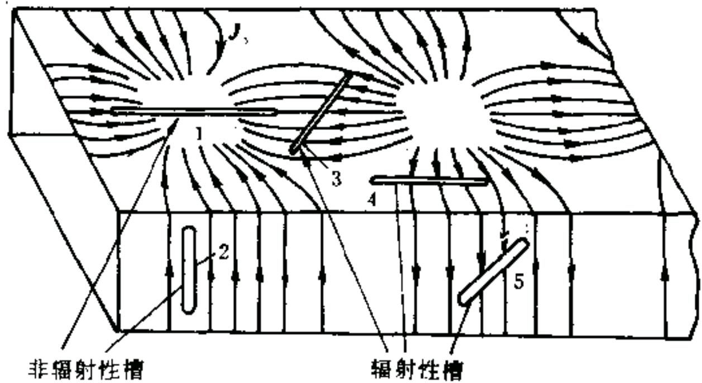

text_image

非辐射性槽
辐射性槽

$$
\lambda_ {c m n} = \frac {2 \pi}{k _ {c m n}} = \frac {2 \pi}{\sqrt {(m \pi / a) ^ {2} + (n \pi / b) ^ {2}}} = \frac {1}{f _ {c m n} \sqrt {\mu \varepsilon}}
$$

# 2. 单模传输

模式分布图：按截止波长从长到短的顺序，把所有模从低到高堆积起来形成各模式的截止波长分布图（简并模用一个矩形条表示）

bar

| Category | Value |
|---|---|
| TE₁₂, TM₁₂ | 1.5 |
| TE₃₀ | 2.0 |
| TE₁₁, TM₁₁ | 2.5 |
| TE₀₁ | 3.0 |
| TE₂₀ | 3.5 |
| TE₁₀ | 4.0 |

# 模式分布图可按工作波长分为三个区：

- 截止区（I）： $\lambda > 2a$   
单模区（Ⅱ）： $a < \lambda < 2a$   
- 多模区（Ⅲ）： $\lambda < a$

bar

| Region | Value |
|---|---|
| I | 2a |
| II | 2b |
| III | 2b |
| (labeled as 'a') | 2b |
| (labeled as '2a') | 2a |
| (labeled as '2b') | 2b |
| (labeled as '30') | 2b |
| (labeled as '31') | 2b |
| (labeled as 'TM₁₁') | 2b |
| (labeled as 'TM₁₂') | 2b |

# 说明:

# 截止区：

由于2a 是矩形波导中能出现的最长截止波长，因此，当工作波长 $\lambda>2a$ 时，电磁波就不能在波导中传播，故称为“截止区”。

# 单模区：

在这一区域只有一个模出现，若工作波长 $a < \lambda < 2a$ ，就只能传输 $\mathrm{TE}_{10}$ 模，其它模式都处于截止状态，这种情况称为“单模传输”，因此该区称为“单模区”。在使用波导传输能量时，通常要求工作在单模状态。

# 多模区：

若工作波长 $\lambda < a$ ，则波导中至少会出现两种以上的波型，故此区称为多模区。

# 单模传输条件

$$
2 a > \lambda > a \Longrightarrow \lambda / 2 <   a <   \lambda \quad b = (0. 4 \sim 0. 5) a
$$

由设计的波导尺寸实现单模传输。  
- 截止波长相同时，传输 $\mathrm{TE}_{10}$ 模所要求的 $a$ 边尺寸最小。同时 $\mathrm{TE}_{10}$ 模的截止波长与 $b$ 边尺寸无关，所以可尽量减小 $b$ 的尺寸以节省材料。但考虑波导的击穿和衰减问题， $b$ 不能太小。  
- $\mathrm{TE}_{10}$ 模和 $\mathrm{TE}_{20}$ 模之间的距离大于其他高阶模之间的距离， $\mathrm{TE}_{10}$ 模波段最宽。  
可以获得单方向极化波，这正是某些情况下所要求的。  
对于一定比值 $a / b$ ，在给定工作频率下 $\mathrm{TE}_{10}$ 模具有最小的衰减。

例7.2.3 有一内充空气、截面尺寸为 $a \times b (b < a < 2b)$ 的矩形波导，主模工作在3GHz。若要求工作频率至少高于主模截止频率的 $20\%$ 和至少低于次高模截止频率的 $20\%$ 。

(1) 给出尺寸 $a$ 和 $b$ 的设计。  
(2) 根据设计的尺寸, 计算在工作频率时的相速、波导波长和波阻抗。

解: (1) 对于 $b < a < 2b$ 的矩形波导, 其主模为 $\mathrm{TE}_{10}$ 模, 相应的截止频率:

$$
f _ {c 1 0} = \frac {1}{2 a \sqrt {\mu_ {0} \varepsilon_ {0}}}
$$

次高模为 $\mathrm{TE}_{01}$ 模，其截止频率： $f_{c01} = \frac{1}{2b\sqrt{\mu_0\varepsilon_0}}$

由题意 $\frac{3\times 10^{9} - f_{c10}}{f_{c10}}\geq 20\%$ $\frac{f_{c01} - 3\times 10^{9}}{f_{c01}}\geq 20\%$

解得 $a \geq 0.06 \mathrm{~m} b \leq 0.04 \mathrm{~m}$ 且 $a < 2b$

(2) 取 $a = 7\mathrm{cm},$ $b = 4\mathrm{cm}$

则

$$
f _ {c 1 0} = \frac {1}{2 a \sqrt {\mu \varepsilon}} = 2. 1 4 \mathrm{GHz}
$$

$$
v _ {p} = \frac {c}{\sqrt {1 - (f _ {c 1 0} / f) ^ {2}}} = 4. 3 \times 1 0 ^ {8} \mathrm{m/s}
$$

$$
\lambda_ {g} = \frac {v _ {p}}{f} = 1 4. 2 9 \mathrm{m}
$$

$$
Z _ {T E _ {1 0}} = \frac {\eta_ {0}}{\sqrt {1 - \left(f _ {c 1 0} / f\right) ^ {2}}} = 5 3 8. 6 \Omega
$$

# ■ 主模的功率传输

$$
\begin{array}{l} \vec {S} _ {a v} = \frac {1}{2} \mathrm{Re} [ \vec {E} \times \vec {H} ^ {*} ] = \frac {1}{2} \mathrm{Re} [ (\vec {e} _ {y} E _ {y}) \times (\vec {e} _ {x} H _ {x} + \vec {e} _ {z} H _ {z}) ^ {*} ] \\ = - \vec {e} _ {z} \frac {1}{2} \operatorname{Re} (E _ {y} H _ {x} ^ {*}) + \vec {e} _ {x} \frac {1}{2} \operatorname{Re} (E _ {y} H _ {z} ^ {*}) \\ = \vec {e} _ {z} \frac {1}{2} \frac {\omega \mu \beta a ^ {2}}{\pi^ {2}} H _ {m} ^ {2} \sin^ {2} \left(\frac {\pi}{a} x\right) + \vec {e} _ {x} (\dots) \\ \end{array}
$$

$$
P = \int_ {0} ^ {a} \int_ {0} ^ {b} \vec {\boldsymbol {S}} _ {a v} \cdot \vec {\boldsymbol {e}} _ {z} d x d y = \frac {a b}{4} \frac {1}{Z _ {T E _ {1 0}}} E _ {m} ^ {2}
$$

$$
= \frac {a b}{4 8 0 \pi} E _ {m} ^ {2} \sqrt {1 - \lambda^ {2} / (2 a) ^ {2}}
$$

其中 $E_{m} = \frac{\omega\mu aH_{m}}{\pi}$

text_image

y
b
z
x
a
o

# 7.3 圆柱形波导

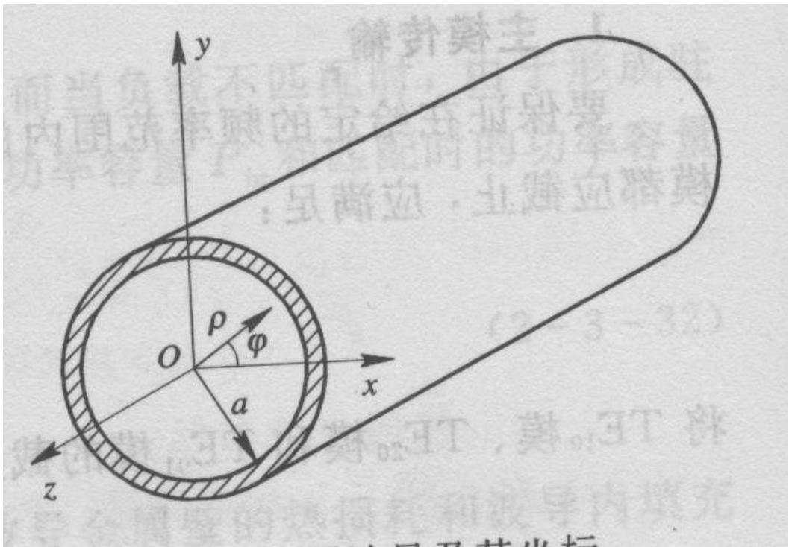

text_image

y
O
ρ
φ
a
x
z
解剖莫主
内圆弧被击射的功率容
x
y
z

在圆柱形波导内 $\vec{E} (\rho ,\phi ,z) = \vec{E} (\rho ,\phi)\mathrm{e}^{-\gamma z}$ $\vec{H} (\rho ,\phi ,z) = \vec{E} (\rho ,\phi)\mathrm{e}^{-\gamma z}$

$$
\nabla \times \vec {H} = j \omega \varepsilon \vec {E} \xrightarrow {\text {圆柱坐标系中展开}} \left\{ \begin{array}{l} \frac {1}{\rho} \frac {\partial H _ {z}}{\partial \phi} + \gamma E _ {\phi} = j \omega \varepsilon E _ {\rho} \\ - \gamma H _ {\rho} - \frac {\partial H _ {z}}{\partial \rho} = j \omega \varepsilon E _ {\phi} \\ \frac {1}{\rho} \frac {\partial}{\partial \rho} (\rho H _ {\phi}) - \frac {1}{\rho} \frac {\partial H _ {\rho}}{\partial \phi} = j \omega \varepsilon E _ {z} \end{array} \right.
$$

$$
\nabla \times \vec {E} = - j \omega \mu \vec {H} \xrightarrow {\text {圆柱坐标系中展开}} \left\{ \begin{array}{l l} \frac {1}{\rho} \frac {\partial E _ {z}}{\partial \phi} + \gamma E _ {\phi} = - j \omega \mu H _ {\rho} \\ - \gamma E _ {\rho} - \frac {\partial E _ {z}}{\partial \rho} = - j \omega \mu H _ {\rho} \\ \frac {1}{\rho} \frac {\partial}{\partial \rho} (\rho E _ {\phi}) - \frac {1}{\rho} \frac {\partial E _ {\rho}}{\partial \phi} = - j \omega \mu H _ {z} \end{array} \right.
$$

利用两个纵向场分量 $E_{z}$ 和 $H_{z}$ 来表示其他场分量：

$$
\left\{ \begin{array}{l} E _ {\rho} = - \frac {1}{\gamma^ {2} + k ^ {2}} \Bigg (\gamma \frac {\partial E _ {z}}{\partial \rho} + j \frac {\omega \mu}{\rho} \frac {\partial H _ {z}}{\partial \phi} \Bigg) \\ E _ {\phi} = \frac {1}{\gamma^ {2} + k ^ {2}} \Bigg (- \frac {\gamma}{\rho} \frac {\partial E _ {z}}{\partial \phi} + j \omega \mu \frac {\partial H _ {z}}{\partial \rho} \Bigg) \\ H _ {\rho} = \frac {1}{\gamma^ {2} + k ^ {2}} \Bigg (j \frac {\omega \varepsilon}{\rho} \frac {\partial E _ {z}}{\partial \phi} - \gamma \frac {\partial H _ {z}}{\partial \rho} \Bigg) \\ H _ {\phi} = - \frac {1}{\gamma^ {2} + k ^ {2}} \Bigg (j \omega \varepsilon \frac {\partial E _ {z}}{\partial \rho} + \frac {\gamma}{\rho} \frac {\partial H _ {z}}{\partial \phi} \Bigg) \end{array} \right.
$$

# 圆柱形波导中的场分布

◆求圆柱形波导内场量分布的方法与求矩形波导内场量分布的方法类似，只是应采用圆柱坐标系，如图所示。

1. 圆柱形波导中TM波的场分布

对于TM波， $H_{z}=0$ ，波导内的电磁场由 $E_{z}$ 确定

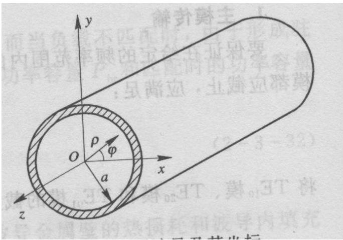

text_image

y
ρ
φ
O
a
x
z

方程

$$
\frac {\partial^ {2} E _ {z}}{\partial \rho^ {2}} + \frac {1}{\rho} \frac {\partial E _ {z}}{\partial \rho} + \frac {1}{\rho^ {2}} \frac {\partial^ {2} E _ {z}}{\partial \phi^ {2}} + k _ {c} ^ {2} E _ {z} = 0
$$

$$
k _ {c} ^ {2} = \gamma^ {2} + k ^ {2}
$$

边界条件 $E_{z}\big|_{\rho=a}=0$

其解为 $E_{z}(\rho,\phi)=E_{m}J_{m}(k_{cmn}\rho)\left\{\begin{aligned}\cos(m\phi)\\ \sin(m\phi)\end{aligned}\right.$

$J_{m}(p) = 0$ 第 $\pmb{n}$ 个根

$$
k _ {c m n} = \frac {P _ {m n}}{a}
$$

# 2. 圆柱形波导中TE波的场分布

对于TE波， $E_{z}=0$ ，波导内的电磁场由 $H_{z}$ 确定

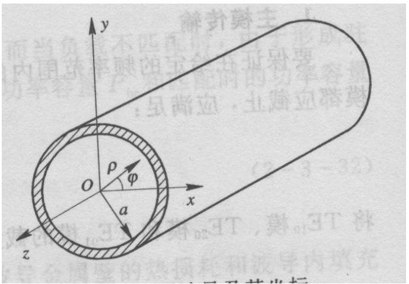

text_image

y
ρ
φ
O
a
x
z
(2-3-32)

方程 $\frac{\partial^2H_z}{\partial\rho^2} +\frac{1}{\rho}\frac{\partial H_z}{\partial\rho} +\frac{1}{\rho^2}\frac{\partial^2H_z}{\partial\phi^2} +k_c^2 H_z = 0$

边界条件

$$
\left. \frac {\partial H _ {z}}{\partial \rho} \right| _ {\rho = a} = 0
$$

$$
\left. E _ {\phi} \right| _ {\rho = a} = \frac {1}{j \omega \varepsilon} \frac {\partial H _ {z}}{\partial \rho} \Bigg | _ {\rho = a} = 0
$$

其解为 $H_{z}(\rho ,\phi) = H_{m}J_{m}(k_{cmn}\rho)\left\{ \begin{array}{l}\cos (m\phi)\\ \sin (m\phi) \end{array} \right.$

$$
k _ {c m n} = \frac {P _ {m n} ^ {\prime}}{a} \boxed {J _ {m} ^ {\prime} (p) = 0 \text {第} n \text {个根}}
$$

表 7.3.1 $J_{m}(p) = 0$ 的根 $p_{mn}$ 

<table><tr><td>m</td><td>n=1</td><td>n=2</td><td>n=3</td><td>n=4</td><td>n=5</td></tr><tr><td>0</td><td>2.405</td><td>5.520</td><td>8.654</td><td>11.792</td><td>14.931</td></tr><tr><td>1</td><td>3.832</td><td>7.016</td><td>10.173</td><td>13.324</td><td>16.471</td></tr><tr><td>2</td><td>5.136</td><td>8.417</td><td>11.620</td><td>14.796</td><td>17.960</td></tr></table>

表 7.3.2 $J_{m}^{\prime}(p) = 0$ 的根 $p_{mn}^{\prime}$ 

<table><tr><td>m</td><td>n=1</td><td>n=2</td><td>n=3</td><td>n=4</td></tr><tr><td>0</td><td>3.832</td><td>7.016</td><td>10.174</td><td>13.324</td></tr><tr><td>1</td><td>1.841</td><td>5.332</td><td>8.536</td><td>11.706</td></tr><tr><td>2</td><td>3.054</td><td>6.705</td><td>9.965</td><td>13.107</td></tr><tr><td>3</td><td>4.201</td><td>8.015</td><td>11.344</td><td></td></tr></table>

# 圆柱形波导中波的传播特性

对于给定尺寸(半径 a)的圆柱形波导, $TM_{mn}$ 模和 $TE_{mn}$ 模的截止波数 $k_{cmn}$ 分别由式(7.3.17)和式(7.3.22)确定,相应的截止频率

$$
f _ {\mathrm{cmn}} = \frac {k _ {\mathrm{cmn}}}{2 \pi \sqrt {\mu \varepsilon}} \tag {7.3.24}
$$

截止波长

$$
\lambda_ {\mathrm{cmn}} = \frac {2 \pi}{k _ {\mathrm{cmn}}} \tag {7.3.25}
$$

当电磁波的工作频率 $f$ 大于相应模式的截止频率 $f_{cmn}$ （或工作波长 $\lambda$ 小于相应模式的截止波长 $\lambda_{cmn}$ ）时，波导中就可以传播该模式的 $\mathrm{TM}_{mn}$ 模或 $\mathrm{TE}_{mn}$ 模。相应的传播特性参数如下：

相位常数

$$
\beta_ {m n} = \sqrt {\omega^ {2} \mu \varepsilon - k _ {\mathrm{cmn}} ^ {2}} = k \sqrt {1 - \left(\frac {f _ {\mathrm{cmn}}}{f}\right) ^ {2}} \tag {7.3.26}
$$

相速度

$$
v _ {\mathrm{pmn}} = \frac {\omega}{\beta_ {m n}} = \frac {v _ {\mathrm{p}}}{\sqrt {1 - \left(\frac {f _ {\mathrm{cmn}}}{f}\right) ^ {2}}} \tag {7.3.27}
$$

波导波长

$$
\lambda_ {\mathrm{gmn}} = \frac {v _ {\mathrm{pmn}}}{f} = \frac {\lambda}{\sqrt {1 - \left(\frac {f _ {\mathrm{cmn}}}{f}\right) ^ {2}}} \tag {7.3.28}
$$

波阻抗

$$
Z _ {\mathrm{TM}} = \frac {E _ {\rho}}{H _ {\phi}} = - \frac {E _ {\phi}}{H _ {\rho}} = \eta \sqrt {1 - \left(\frac {f _ {\mathrm{cmn}}}{f}\right) ^ {2}} \tag {7.3.29}
$$

$$
Z _ {\mathrm{TE}} = \frac {E _ {\rho}}{H _ {\phi}} = - \frac {E _ {\phi}}{H _ {\rho}} = \frac {\eta}{\sqrt {1 - \left(\frac {f _ {\mathrm{cmn}}}{f}\right) ^ {2}}} \tag {7.3.30}
$$

1. 圆柱形波导中的模式分布图  

bar_stacked

| Category     | Value |
| ------------ | ----- |
| TE02 TM12    | 1     |
| TE32         | 2     |
| TM02         | 3     |
| TE12         | 4     |
| TM21         | 5     |
| TE31         | 6     |
| TE01 TM11    | 7     |
| TE21         | 8     |
| TM01         | 9     |
| TE11         | 10    |

2.61a

3.41a

$$
\lambda_ {c m n} = \frac {2 \pi a}{p _ {m n}} o r \frac {2 \pi a}{p _ {m n} ^ {\prime}}
$$

# 2. 圆柱形波导中波的传播特性

(1) 圆柱形波导中存在无穷多个可能的传播模式。

(2) 圆柱形波导中最低截止频率模式是 $\mathsf{TE}_{11}$ 模, 其截止波长为 $3.41\alpha$ , 它是圆柱形波导中的主模。

(3) 圆柱形波导中存在模式的双重简并:

① 不同模式具有相同的截止波长。例如 $(\lambda_{c})_{\mathrm{TE}_{0n}} = (\lambda_{c})_{\mathrm{TM}_{1n}}$ ，因此， $TE_{0n}$ 模和 $TM_{1n}$ 模存在模式简并现象，这种简并称为 E-H 简并，这和矩形波导中的模式简并相同。

② 从TE波和TM波的场分量表示式可知，当 $m \neq 0$ 时，对于同一个 $\mathrm{TE}_{\mathrm{mn}}$ 模和 $\mathrm{TM}_{\mathrm{mn}}$ 模都有两个场结构，它们与坐标 $\varphi$ 的关系分别为 $\sin(m\varphi)$ 和 $\cos(m\varphi)$ ，这种简并称为极化简并，是圆柱形波导中特有的。

例 7.3.1 一空气填充的圆柱形波导中的 $TE_{01}$ 模, 已知 $\lambda/\lambda_{c}=0.7$ , 工作频率 f=3000 MHz, 求波导波长。

解： $\lambda_{\mathrm{gTE}_{01}} = \frac{\lambda}{\sqrt{1 - (\lambda / \lambda_{\mathrm{cTE}_{01}})^2}} = \frac{1}{f\sqrt{\mu_0\varepsilon_0}\sqrt{1 - 0.7^2}} = 0.14\mathrm{m}$

# 第五版和第六版教材的（7.3.28）式

解：

第四版 $\beta = \sqrt{k^2 - k_c^2} = \omega \sqrt{\mu \varepsilon}\sqrt{1 - \left(\frac{\lambda}{\lambda_c}\right)^2}$

$$
= 2 \pi f \sqrt {\mu_ {0} \varepsilon_ {0}} \sqrt {1 - 0 . 7 ^ {2}} = 4 4. 9 \mathrm{rad/m}
$$

故

$$
\lambda_ {\mathrm{g}} = \frac {2 \pi}{\beta} = \frac {2 \pi}{4 4 . 9} \mathrm{m} = 0. 1 4 \mathrm{m}
$$

例 7.3.2 一空气填充的圆柱形波导, 周长为 25.1 cm, 其工作频率为 3 GHz, 求该波导内可能传播的模式。

解：工作波长为

$$
\lambda = c / f = 1 0 \mathrm{cm}
$$

截止波长大于工作波长 $(\lambda_{c}>\lambda)$ 的模式可以传播。

该波导的半径为

$$
a = \frac {l}{2 \pi} = \frac {2 5 . 1}{2 \times 3 . 1 4} \mathrm{cm} \approx 4 \mathrm{cm}
$$

$TE_{11}$ 模的截止波长为

$$
\lambda_ {\mathrm{cTE} _ {1 1}} = \frac {3 . 4 1 2 a}{5 . 1 3 a} \approx 1 3. 6 \mathrm{cm}
$$

$TE_{01}$ 模和 $TM_{11}$ 模的截止波长为

$$
\lambda_ {\mathrm{cTE} _ {0 1}} = \lambda_ {\mathrm{cTM} _ {1 1}} = 1. 6 4 a \approx 6. 5 6 \mathrm{cm}
$$

$TM_{01}$ 模的截止波长为

$$
\lambda_ {\mathrm{cTM} _ {0 1}} = \frac {2 . 6 1 3 a}{2 . 6 2 a} \approx \frac {1 0 . 4 4 8}{1 0 . 4 8 \mathrm{cm}}
$$

$TE_{21}$ 模的截止波长为

$$
\lambda_ {\mathrm{cTE} _ {2 1}} = 2. 0 6 a \approx 8. 2 4 \mathrm{cm}
$$

$$
\lambda_ {c m n} = \frac {2 \pi a}{p _ {m n}} o r \frac {2 \pi a}{p _ {m n} ^ {\prime}}
$$

↑
↑
TM波 TE波

其余模式的截止波长都小于 $10 \, cm$ ，所以该圆柱形波导中可能传播的模式为 $TE_{11}$ 和 $TM_{01}$ 。

# 7.4 同轴波导

同轴波导是一种内、外导体构成的双导体导波系统，也称为同轴线。内外导体为理想导体，内导体半径为 $a$ ，外导体的内半径为 $b$ ，内外导体之间填充电参数为 $\varepsilon$ 和 $\mu$ 的理想介质。

同轴线是双导体波导，它既可

以传播TEM波，也可传播TE波、TM波。

text_image

同轴波导

# 7.4.1 同轴波导中的TEM波

# 1. TEM波的场分布

设电磁波沿+z方向传播，相应的场为时谐场，其复数形式为

$$
\boldsymbol {E} (\rho , \phi , z) = \boldsymbol {E} (\rho , \phi) \mathrm{e} ^ {- \gamma z}, \boldsymbol {H} (\rho , \phi , z) = \boldsymbol {H} (\rho , \phi) \mathrm{e} ^ {- \gamma z}
$$

对于TEM波, $E_{z} = 0, H_{z} = 0$ , 而磁力线是闭合曲线, 电场和磁场都在横截面内, 即 $\mathbf{H} = \mathbf{e}_{\phi} H_{\phi}, \mathbf{E} = \mathbf{e}_{\rho} E_{\rho}$

natural_image

Diagram of concentric circular patterns with radial arrows and dashed lines, no text or symbols present

text_image

Diagram showing a multi-level abacus with beads, crosses, and arrows indicating movement or counting.

电力线

---

磁力线

同轴波导中TEM模的场分布

$$
\pmb {H} = \pmb {e} _ {\phi} H _ {\phi}, \pmb {E} = \pmb {e} _ {\rho} E _ {\rho}
$$

在圆柱坐标系中

$$
\nabla \times \boldsymbol {H} = - j \omega \varepsilon \boldsymbol {E}
$$

$$
\nabla \times \boldsymbol {E} = - j \omega \mu \boldsymbol {H}
$$

沿+z方向的传播因子 $e^{-\gamma z}$

$$
\gamma H _ {\phi} = j \omega \varepsilon E _ {\rho}
$$

$$
\frac {1}{\rho} \frac {\partial}{\partial \rho} \Big (\rho H _ {\phi} \Big) = 0
$$

$$
\gamma E _ {\rho} = j \omega \mu H _ {\phi}
$$

$$
\frac {1}{\rho} \frac {\partial}{\partial \rho} \Big (\rho E _ {\rho} \Big) = 0
$$

$$
\left\{ \begin{array}{l} H _ {\phi} = \frac {H _ {m}}{\rho} \mathrm{e} ^ {- \gamma z} \\ E _ {\rho} = \frac {\gamma}{j \omega \varepsilon} H _ {\phi} = \frac {\gamma}{j \omega \varepsilon} \frac {H _ {m}}{\rho} \mathrm{e} ^ {- \gamma z} \end{array} \right.
$$

# 2. TEM波的传播特性参数

传播常数: $\gamma = \gamma_{\mathrm{TEM}} = jk = j\omega \sqrt{\mu\varepsilon} = j\beta$

相位常数: $\beta = \omega \sqrt{\mu \varepsilon}$

相速度: $v_{p}=\frac{\omega}{\beta}=\frac{1}{\sqrt{\varepsilon\mu}}$ —— 无色散波

截止波数: $k_{c} = \sqrt{\gamma^{2} + k^{2}} = 0$

截止波长: $\lambda_{c} = \infty$ ——TEM模是同轴波导中的主模

波阻抗: $Z_{\mathrm{TEM}} = \frac{E_{\rho}}{H_{\phi}} = \frac{\gamma}{j\omega\varepsilon} = \sqrt{\frac{\mu}{\varepsilon}} = \eta$

内外导体间的电压:

$$
U (z) = \int_ {a} ^ {b} E _ {\rho} \mathrm{d} \rho = \int_ {a} ^ {b} \sqrt {\frac {\mu}{\varepsilon}} \frac {H _ {m}}{\rho} \mathrm{e} ^ {- j \beta z} \mathrm{d} \rho = \sqrt {\frac {\mu}{\varepsilon}} H _ {m} \ln \frac {b}{a} \mathrm{e} ^ {- j \beta z}
$$

内导体上的轴向电流:

$$
I (z) = \oint \vec {H} _ {\varphi} \cdot \mathrm{d} \vec {l} = \int_ {0} ^ {2 \pi} H _ {\varphi} \rho \mathrm{d} \varphi = 2 \pi H _ {m} \mathrm{e} ^ {- j \beta z}
$$

由特性阻抗的定义可知，其特性阻抗 $Z_{0}$ 为

$$
Z _ {0} = \frac {U (z)}{I (z)} = \frac {1}{2 \pi} \sqrt {\frac {\mu}{\varepsilon}} \ln \frac {b}{a} \quad \text {若填充空气} \quad Z _ {0} = 6 0 \ln \frac {b}{a}
$$

# 3. 传输功率与功率容量

同轴波导中传输TEM模时，其传输功率为

$$
P = \frac {1}{2} \mathrm{Re} \int_ {S} (\boldsymbol {E} \times \boldsymbol {H} ^ {*}) \bullet \mathrm{d} \boldsymbol {S} = \frac {1}{2} \mathrm{Re} \int_ {S} (\boldsymbol {E} _ {t} \times \boldsymbol {H} _ {t} ^ {*}) \bullet \boldsymbol {e} _ {z} \mathrm{d} S
$$

$$
= \frac {1}{2} \mathrm{Re} [ \int_ {a} ^ {b} (E _ {\rho} H _ {\phi} ^ {*}) 2 \pi \rho \mathrm{d} \rho ] = \pi \frac {\beta}{\omega \varepsilon} | H _ {m} | ^ {2} \ln \frac {b}{a}
$$

$$
= \pi \sqrt {\frac {\mu}{\varepsilon}} \left| H _ {m} \right| ^ {2} \ln \frac {b}{a} = \frac {\pi}{\eta} \left| E _ {m} \right| ^ {2} \ln \frac {b}{a}
$$

$$
\vec {H} _ {\varphi} = \frac {1}{\eta} \hat {e} _ {z} \times \vec {E} _ {\rho}
$$

$$
E _ {m} = \eta H _ {m}
$$

$$
E _ {\rho} = \frac {\gamma}{j \omega \varepsilon} H _ {\phi} = \frac {\gamma}{j \omega \varepsilon} \frac {H _ {m}}{\rho} \mathrm{e} ^ {- \gamma z}
$$

同轴波导中的TEM模在 $\rho = a$ 处电场最大，且等于

$$
\left| E _ {a} \right| = \sqrt {\frac {\mu}{\varepsilon}} \frac {H _ {m}}{a} = \frac {\eta H _ {m}}{a} = \frac {E _ {m}}{a}
$$

若假设该处的电场强度等于同轴波导中所填充媒质的击穿电场强度 $E_{\mathrm{br}}$ ，则击穿时有 $\left|E_m\right| = E_{br}a$ ，故得同轴波导中传输TEM模时的功率容量为

$$
P _ {b r} = \frac {\pi a ^ {2} E _ {b r} ^ {2}}{\eta} \ln \frac {b}{a}
$$

# 7.4.2 同轴波导的高次模

在实际应用中，同轴波导都是以TEM模（主模）方式工作。但是，当工作频率过高时，在同轴波导中还将出现一系列的高次模：TM模和TE模。

同轴波导中的TM模和TE模的分析方法与圆柱形波导中TM模和TE模的分析方法相似。即在给定的边界条件下求解 $E_{\mathrm{z}}$ 和 $H_{\mathrm{z}}$ 满足的波动方程，从而可以得到同轴波导中不同 $\mathrm{TE}_{\mathrm{mn}}$ 模和 $\mathrm{TM}_{\mathrm{mn}}$ 模的场分布以及相应模式的截止波长 $\lambda_{\mathrm{cmn}}$ 。

# 同轴波导中TE波和TM波的截止波长分别为

$$
\lambda_ {c \mathrm{TE} _ {1 1}} \approx \pi (b + a)
$$

$$
\lambda_ {c \mathrm{TM} _ {0 1}} \approx 2 (b - a)
$$

# 同轴波导的模式分布如图所示

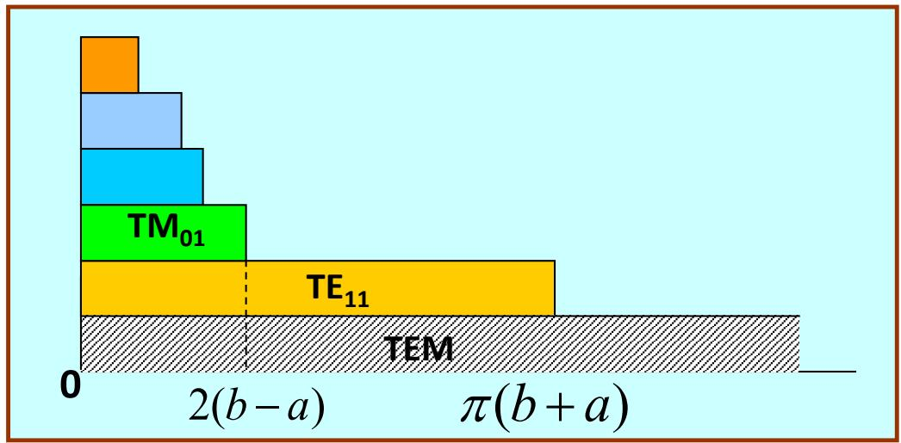

bar_stacked

| Category | Value |
| -------- | ----- |
| TM₀₁     | 2(b - a) |
| TE₁₁     | π(b + a) |
| TEM      | 0     |

为保证同轴波导在给定工作频带内只传输TEM模，就必须使工作波长大于第一个高次模 $\mathrm{TE}_{11}$ 模的截止波长，即

$$
\lambda_ {\mathrm{min}} \geqslant \lambda_ {c \mathrm{TE} _ {1 1}} \approx \pi (b + a) \Longrightarrow a + b \leqslant \frac {\lambda_ {\mathrm{min}}}{\pi}
$$

该式给出了 $a + b$ 的取值范围。

要最终确定尺寸，还必须确定 $b / a$ 的值。

# 可以根据实际需要选择该值的大小:

① 当要求功率容量最大时

$$
P _ {b r} = \frac {\pi a ^ {2} E _ {b r} ^ {2}}{\eta} \ln \frac {b}{a} \quad \xrightarrow {\left. \frac {\mathrm{d} P _ {b r}}{\mathrm{d} a} \right| _ {b = c o n s t} = 0} \frac {b}{a} \approx 1. 6 4 9, Z _ {0} \approx 3 0 \Omega
$$

② 当要求传输损耗最小时

$$
\alpha_ {c} = \frac {R _ {s}}{2 \eta \ln \frac {b}{a}} \left(\frac {1}{a} + \frac {1}{b}\right) \xrightarrow {\left. \frac {\mathrm{d} \alpha_ {c}}{\mathrm{d} a} \right| _ {b = c o n s t} = 0} \frac {b}{a} \approx 3. 5 9, Z _ {0} \approx 7 6. 7 \Omega
$$

两者兼顾，采用的折中尺寸 $\frac{b}{a} \approx 2.3, Z_0 \approx 50\Omega$

此时，功率容量比最佳情况约小于 $15\%$ ，而衰减则比最佳情况约大 $10\%$

- 实际使用的同轴波导（同轴线）的特性阻抗一般取50Ω和75Ω;  
- $50\Omega$ 的同轴线兼顾了耐压、功率容量和衰减的需求，属于通用型；  
- $75\Omega$ 的同轴线是衰减最小的同轴线，主要用于远距离传输。

\- 几种常见的同轴连接头。

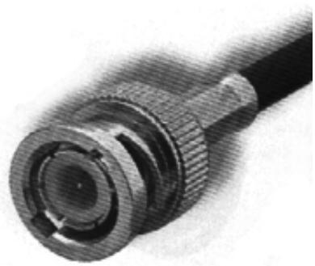

natural_image

Close-up of a metallic connector with threaded shaft and black cable (no visible text or symbols)

(a) BNC型

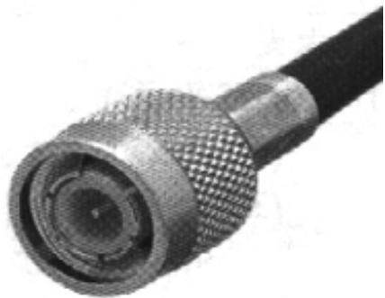

natural_image

Close-up of a metallic coaxial connector with mesh texture (no text or symbols visible)

(b) TNC 型

natural_image

Close-up of a metallic connector with threaded top and gold-colored base (no visible text or symbols)

natural_image

Close-up of a metallic coaxial connector with brass and gold-colored body (no text or symbols visible)

(c) SMA型

natural_image

Close-up of a metallic U-tau connector with threaded metal body and circular cap (no text or symbols visible)

(d) N型连接头

# 7.5 谐振腔

随着频率的增高，电磁波的波长接近元件尺寸，由集中参数元件组成的振荡回路容易产生辐射，损耗增大。故采用空腔谐振器。  
- 几种常见的微波谐振

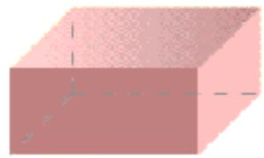

natural_image

Simple 3D geometric shape resembling a cube with shaded faces and dashed lines indicating hidden edges (no text or symbols)

(a) 矩形腔

natural_image

Simple pink cylindrical shape with a dashed line extending from its side, no text or symbols present.

(b) 圆柱腔

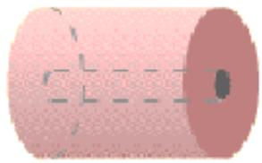

natural_image

Simple illustration of a cylindrical object with dashed internal lines and a small dark object inside (no text or symbols)

(c) 同轴腔

- 谐振腔的主要参量是：谐振频率和品质因素  
- 工作原理：电磁波在腔体中来回反射形成振荡  
- 分析方法：将谐振腔看作一段两端短路的波导，利用波导的场分布导出谐振腔的场分布以及相应参数

# 1. 矩形谐振腔的场分布

构成——可将一段矩形波导两端封闭而构成，如图所示。

尺寸: $a \times b \times l$

场分布:

$$
H _ {z} \big | _ {z = 0, l} = 0
$$

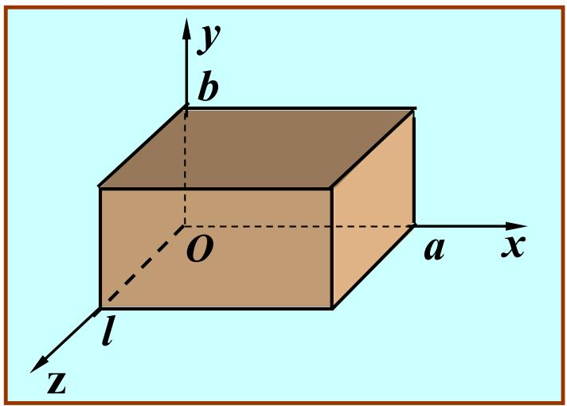

text_image

y
b
O
a x
l
z

TE模: $H_{z}(x,y)=H_{0}\cos(\frac{m\pi}{a}x)\cos(\frac{n\pi}{b}y)\sin(\frac{p\pi}{l}z)$

$$
m 、 n = 0, 1, 2, \dots ;
$$

$$
p = 1, 2, \dots
$$

TM模: $E_{z}(x,y) = E_{0}\sin \left(\frac{m\pi}{a} x\right)\sin \left(\frac{n\pi}{b} y\right)\cos \left(\frac{p\pi}{l} z\right)$

$$
m 、 n = 1, 2, \dots ;
$$

$$
p = 0, 1, 2, \dots
$$

$$
k _ {m n p} = \sqrt {\left(\frac {m \pi}{a}\right) ^ {2} + \left(\frac {n \pi}{b}\right) ^ {2} + \left(\frac {p \pi}{l}\right) ^ {2}}
$$

$$
\left. \frac {\partial E _ {z}}{\partial z} \right| _ {z = 0, l} = 0
$$

特点: 不同的 $m 、 n 、 p$ 对应于不同的振荡模式, $\mathrm{TE}_{mnp}$ 模或 $\mathrm{TM}_{mnp}$ 模。

# 2. 矩形谐振腔的谐振频率（例题7.5.1）

由

$$
k _ {m n p} = \omega_ {m n p} \sqrt {\mu \varepsilon} = \sqrt {\left(\frac {m \pi}{a}\right) ^ {2} + \left(\frac {n \pi}{b}\right) ^ {2} + \left(\frac {p \pi}{l}\right) ^ {2}}
$$

得到谐振频率

$$
f _ {m n p} = \frac {\omega_ {m n p}}{2 \pi} = \frac {1}{2 \pi \sqrt {\mu \varepsilon}} \sqrt {(\frac {m \pi}{a}) ^ {2} + (\frac {n \pi}{b}) ^ {2} + (\frac {p \pi}{l}) ^ {2}}
$$

特点:

① 谐振频率与谐振腔的尺寸、填充介质以及振荡模式有关;  
② 存在一系列离散的谐振频率，不同的模式有不同的振荡频率；  
③ 最低谐振频率:

$$
a > b > l \text {时,} f _ {1 1 0} = \frac {1}{2 \sqrt {\mu \varepsilon}} \sqrt {\frac {1}{a ^ {2}} + \frac {1}{b ^ {2}}}
$$

$$
a > l > b \text {时,} f _ {1 0 1} = \frac {1}{2 \sqrt {\mu \varepsilon}} \sqrt {\frac {1}{a ^ {2}} + \frac {1}{l ^ {2}}}
$$

例题7.5.1 有一填充空气的矩形谐振腔,其沿 x、y、z 方向的尺寸分别为: (1) a > b > l; (2) a > l > b; (3) a = b = l。试确定相应的主模和谐振频率。

解：选择 $z$ 轴作为参考的传播方向，对于 $\mathrm{TM}_{mnp}$ 模，由其场分量的表示式(7.5.2)可知， $m$ 和 $n$ 不能为零，而 $p$ 可以为零。对于 $\mathrm{TE}_{mnp}$ 模，由其场分量的表示式(7.5.6)可知， $m$ 或 $n$ 均可为零（但不能同时为零），而 $p$ 不能为零。因此，可能的最低阶模式为

$$
\mathrm{TM} _ {1 1 0}, \mathrm{TE} _ {0 1 1}, \mathrm{TE} _ {1 0 1}
$$

相应的谐振频率由式(7.5.5)给出。

$$
f _ {m n p} = \frac {1}{2 \pi \sqrt {\mu \varepsilon}} \sqrt {(\frac {m \pi}{a}) ^ {2} + (\frac {n \pi}{b}) ^ {2} + (\frac {p \pi}{l}) ^ {2}} = \frac {v _ {P 0}}{2} \sqrt {(\frac {m}{a}) ^ {2} + (\frac {n}{b}) ^ {2} + (\frac {p}{l}) ^ {2}}
$$

$$
\mathsf {T M} _ {1 1 0}, \mathsf {T E} _ {0 1 1}, \mathsf {T E} _ {1 0 1} \quad f _ {m n p} = \frac {v _ {P 0}}{2} \sqrt {\left(\frac {m}{a}\right) ^ {2} + \left(\frac {n}{b}\right) ^ {2} + \left(\frac {p}{l}\right) ^ {2}}
$$

(1) 当 $a > b > l$ 时, 最低谐振频率为

$$
f _ {1 1 0} = \frac {c}{2} \sqrt {\frac {1}{a ^ {2}} + \frac {1}{b ^ {2}}}
$$

式中 c 为自由空间的波速。于是得 $TM_{110}$ 为主模。

(2) 当 $a > l > b$ 时, 最低谐振频率为

$$
f _ {1 0 1} = \frac {c}{2} \sqrt {\frac {1}{a ^ {2}} + \frac {1}{l ^ {2}}}
$$

于是得 $TE_{101}$ 为主模。

(3) 当 $a = b = l$ 时, $\mathrm{TM}_{110}, \mathrm{TE}_{011}, \mathrm{TE}_{101}$ 的谐振频率相同

$$
f _ {1 1 0} = f _ {1 0 1} = f _ {0 1 1} = \frac {c}{\sqrt {2} a}
$$

# 3. 谐振腔的品质因素 Q

谐振腔可以储存电场能量和磁场能量。在实际的谐振腔中，由于腔壁的电导率是有限的，它的表面电阻不为零，这样将导致能量的损耗。

谐振腔的品质因素Q定义为

储存的能量

$$
Q = 2 \pi \frac {W}{W _ {T}}
$$

一个周期内损耗的能量

谐振腔的品质因素Q定义为

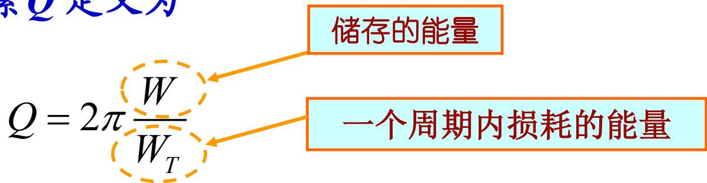

text_image

Q = 2π W / W_T
储存的能量
一个周期内损耗的能量

设 $P_{L}$ 为谐振腔内的时间平均功率损耗，则一个周期 $T = \frac{2\pi}{\omega}$ 内谐振腔损耗的能量为

$$
W _ {T} = P _ {L} \frac {2 \pi}{\omega} \Longrightarrow Q = \omega \frac {W}{P _ {L}}
$$

确定谐振腔在谐振频率的Q值时，通常是假设其损耗足够的小，可以用无损耗时的场分布进行计算。

$P_{L}$ : 单位面积的损耗功率表达式, 见第五版5.2节内容。

$$
Q = \omega \frac {W}{P _ {L}}
$$

例 7.5.2 计算矩形谐振腔中 $TE_{101}$ 模的 Q 值。

解：由式(7.5.6)，令 $m = 1, n = 0, p = 1$ ，得 $\mathrm{TE}_{101}$ 的场分量

$$
H _ {z} (x, y, z) = H _ {\mathrm{m}} \cos \left(\frac {\pi}{a} x\right) \sin \left(\frac {\pi}{l} z\right)
$$

$$
H _ {x} (x, y, z) = - \frac {1}{k _ {\mathrm{c}} ^ {2}} \frac {\pi}{a} \frac {\pi}{l} H _ {\mathrm{m}} \sin \left(\frac {\pi}{a} x\right) \cos \left(\frac {\pi}{l} z\right)
$$

$$
E _ {y} (x, y, z) = - \frac {\mathrm{j} \omega \mu}{k _ {\mathrm{c}} ^ {2}} \frac {\pi}{a} H _ {\mathrm{m}} \sin \left(\frac {\pi}{a} x\right) \sin \left(\frac {\pi}{l} z\right)
$$

$$
E _ {x} (x, y, z) = 0, H _ {y} (x, y, z) = 0, E _ {z} (x, y, z) = 0
$$

时间平均储存的电场能量

$$
W _ {\mathrm{e}} = \frac {\varepsilon_ {0}}{4} \int | E _ {y} | ^ {2} \mathrm{d} V = \frac {\varepsilon_ {0} \omega^ {2} \mu_ {0} ^ {2} \pi^ {2}}{4 k _ {\mathrm{c}} ^ {4} a ^ {2}} H _ {\mathrm{m}} ^ {2} \int_ {0} ^ {l} \int_ {0} ^ {b} \int_ {0} ^ {a} \sin^ {2} \left(\frac {\pi}{a} x\right) \sin^ {2} \left(\frac {\pi}{l} z\right) \mathrm{d} x \mathrm{d} y \mathrm{d} z
$$

$$
= \frac {\varepsilon_ {0} \omega_ {1 0 1} ^ {2} \mu_ {0} ^ {2} a ^ {2}}{4 \pi^ {2}} H _ {\mathrm{m}} ^ {2} \left(\frac {a}{2}\right) b \left(\frac {l}{2}\right) = \frac {1}{4} \varepsilon_ {0} \mu_ {0} ^ {2} a ^ {3} b l f _ {1 0 1} ^ {2} H _ {\mathrm{m}} ^ {2}
$$

式中已将 $k_{\mathrm{c}}^{2} = \left(\frac{\pi}{a}\right)^{2}$ 代入。再将 $f_{101} = \frac{1}{2\sqrt{\mu_0\varepsilon_0}}\left(\sqrt{\frac{1}{a^2} + \frac{1}{l^2}}\right)$ 代入上式，得

$$
W _ {\mathrm{e}} = \frac {\mu_ {0}}{1 6} a b l \left(\frac {a ^ {2}}{l ^ {2}} + 1\right) H _ {\mathrm{m}} ^ {2}
$$

时间平均储存的磁场能量

$$
W _ {\mathrm{m}} = \int \left(\left| H _ {x} \right| ^ {2} + \left| H _ {z} \right| ^ {2}\right) \mathrm{d} V = \frac {\mu_ {0}}{1 6} a b l \left(\frac {a ^ {2}}{l ^ {2}} + 1\right) H _ {\mathrm{m}} ^ {2} = W _ {\mathrm{e}}
$$

于是总的储能

$$
W = W _ {\mathrm{e}} + W _ {\mathrm{m}} = \frac {\mu_ {0} H _ {\mathrm{m}} ^ {2}}{8} a b l \left(\frac {a ^ {2}}{l ^ {2}} + 1\right)
$$

# 单位面积的损耗功率

$$
\mathrm{P240(5.2.34)式:} \quad P _ {\mathrm{av}} = \frac {1}{2} | J _ {\mathrm{s}} | ^ {2} R _ {\mathrm{s}} = \frac {1}{2} | H _ {\mathrm{t}} | ^ {2} R _ {\mathrm{s}}
$$

于是总的损耗功率 $P_{L}=\iint_{S}P_{av}dS$

$$
= R _ {S} \left[ \int_ {0} ^ {b} \int_ {0} ^ {a} \left| H _ {x} \right| ^ {2} d x d y + \int_ {0} ^ {l} \int_ {0} ^ {a} \left| H _ {x} \right| ^ {2} d x d z + \int_ {0} ^ {l} \int_ {0} ^ {b} \left| H _ {x} \right| ^ {2} d y d z \right.
$$

$$
\left. + \int_ {0} ^ {b} \int_ {0} ^ {a} \left| H _ {z} \right| ^ {2} \mathrm{d} x \mathrm{d} y + \int_ {0} ^ {l} \int_ {0} ^ {a} \left| H _ {z} \right| ^ {2} \mathrm{d} x \mathrm{d} z + \int_ {0} ^ {l} \int_ {0} ^ {b} \left| H _ {z} \right| ^ {2} \mathrm{d} y \mathrm{d} z \right]
$$

$$
= R _ {S} \left[ H _ {m} ^ {2} \frac {a ^ {2}}{l ^ {2}} \left(\frac {a}{2} b \cos^ {2} \frac {\pi}{l} z + \frac {a}{2} \frac {l}{2} + b \frac {l}{2} \sin^ {2} \frac {\pi}{a} x\right) \right.
$$

$$
\left. + H _ {m} ^ {2} \left(\frac {a}{2} b \sin^ {2} \frac {\pi}{l} z + \frac {a}{2} \frac {l}{2} + b \frac {l}{2} \cos^ {2} \frac {\pi}{a} x\right) \right]
$$

$$
= \frac {R _ {S} H _ {m} ^ {2}}{2} \left[ \frac {a ^ {3}}{l} \left(\frac {b}{l} + \frac {1}{2}\right) + a l \left(\frac {b}{a} + \frac {1}{2}\right) \right]
$$

矩形谐振腔 $\mathrm{TE}_{101}$ 模的品质因素 $Q$ 为

$$
Q = \omega \frac {W}{P _ {L}} = \frac {\pi f _ {1 0 1} \mu_ {0} a b l (a ^ {2} + l ^ {2})}{R _ {S} [ 2 b (a ^ {3} + l ^ {3}) + a l (a ^ {2} + l ^ {2}) ]}
$$

式中 $R_{S}$ 为良导体的表面电阻 $R_{S} = \sqrt{\frac{\pi f\mu}{\sigma}}$