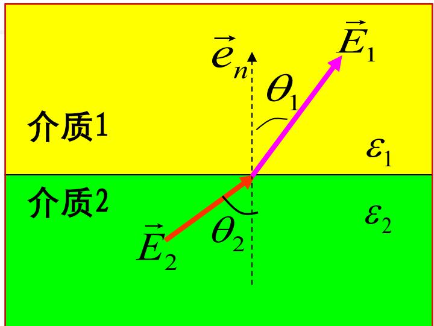

# 3.1.1 静电场的基本方程和边界条件 (预习笔记)

> ==💡 章节导读与知识脉络：==
> 在第二章中，系统学习了包含时变因素的宏观电磁场基本规律（麦克斯韦方程组、介质的极化与磁化效应、普遍的边界条件等）。从第三章开始，研究对象限定为==“静电场”==。
> 静电场是指由空间中静止分布的电荷所产生的电场。其首要特征是所有物理量均不随时间发生变化，即对时间的偏导数 $\frac{\partial}{\partial t} = 0$。因此，交变电磁场中电场与磁场相互激发的耦合项（法拉第电磁感应项和麦克斯韦位移电流项）均等于零。本节的内容是将第二章的一般性规律在“时不变”条件下进行化简，从而推导出描述静电场特性的基本方程和边界条件。

---

### 一、 静电场的基本方程

静电场的空间分布特性可以由两个核心定律来完全描述：==“有源性”==和==“无旋性”==。

#### 1. 静电场是有源场（高斯定理的微分与积分形式）
静电场是有源场，其源头即为静止电荷。电场线起源于正电荷，终止于负电荷。
*   ==微分形式（描述空间局部点）：== 
    $$ \nabla \cdot \vec{D} = \rho $$
    *(物理意义：空间中任意一点的电通密度散度，严格等于该点处的体电荷密度 $\rho$。)*
*   ==积分形式（描述宏观闭合曲面）：== 
    $$ \oint_S \vec{D} \cdot d\vec{S} = q $$

#### 2. 静电场是保守场（无旋场）
在静电场中，电场力对沿任意闭合路径移动的试验电荷所作的功恒为零。这表明静电场的电场线不会自身闭合形成旋涡状的回路。
*   ==微分形式：== 
    $$ \nabla \times \vec{E} = 0 $$
    *(物理意义：静电场的旋度处处为 0，是一个典型的无旋保守场。这一属性不仅明确了电场线的空间拓扑结构，也是后续引入标量“电位”进行分析的充要数学前提。）*
	
	如果去看非静电场的[[2.6.1 麦克斯韦方程组#^a11fe1]]，可以发现右边就不是0了 。而是 $- \frac{\partial \vec{B}}{\partial t}$
*   ==积分形式：==
    $$ \oint_C \vec{E} \cdot d\vec{l} = 0 $$

#### 3. 媒质的本构关系
在各向同性的线性均匀电介质中，电通量密度矢量 $\vec{D}$ 和电场强度矢量 $\vec{E}$ 之间存在线性比例关系。由于没有磁场耦合，独立适用介电常数 $\varepsilon$ 作为比例系数：
$$ \vec{D} = \varepsilon\vec{E} $$

---

### 二、 静==电场==在媒质分界面上的边界条件

当静电场跨越两种不同媒质的分界面时，由于两侧媒质介电常数的突变或界面上可能存在的面电荷，电场矢量将发生不连续变化。在此时变项为零的条件下，由麦克斯韦积分方程自然推导出其边界条件：

1. ==法向分量（垂直于界面的方向）：==
   利用 $\oint_S \vec{D} \cdot d\vec{S} = q$ 在界面处取极限厚度的扁平高斯圆柱面，得：
   $$ \vec{e}_n \cdot (\vec{D}_1 - \vec{D}_2) = \rho_S \quad \text{或} \quad D_{1n} - D_{2n} = \rho_S $$
   *(物理意义：两种媒质交界面上，电通密度矢量的法向分量发生突变，其差值大小等于分界面上的真实自由面电荷密度 $\rho_S$。若分界面上不存在自由面电荷（$\rho_S=0$），则其法向分量连续，即 $D_{1n} = D_{2n}$。)*

2. ==切向分量（平行于界面的方向）：==
   利用 $\oint_C \vec{E} \cdot d\vec{l} = 0$ 在界面处取极限高度的狭长矩形回路，得：
   $$ \vec{e}_n \times (\vec{E}_1 - \vec{E}_2) = 0 \quad \text{或} \quad E_{1t} - E_{2t} = 0 $$
   *(物理意义：由于静电场旋度为0，电场强度的切向分量在任何媒质的分界面上均保持连续，绝不会发生突变。)*

==总结来说，法向的 D 差一个 ρ，切向的 E 连续==

#### 特例：导体表面的边界条件
当分界面的一侧为处于静电平衡状态的导体时，==导体内部的电场强度处处为零==（即 $\vec{E}_{内} = 0$，$\vec{D}_{内} = 0$）。否则内部自由电子在电场力作用下将发生宏观移动，破坏静电平衡。
将导体内部场量为零的条件代入上述一般边界方程中，可知在导体表面外侧（设媒质侧外法向为 $\vec{e}_n$）：
*   ==法向条件==： $\vec{e}_n \cdot \vec{D} = \rho_S$ （外侧电场线垂直于导体表面，电通密度的大小等于导体表面局部感应的自由面电荷密度）。
*   ==切向条件==： $\vec{e}_n \times \vec{E} = 0$ （外侧电场强度在平行于导体表面的切向分量严格为零，这也说明导体表面是一个等电位面）。

> ==总结==：静电场服从由电荷激发且无旋的基本方程。在跨越分界面时，电场强度的切向分量永远连续，而电通密度的法向分量的不连续量则由界面上的表面自由电荷决定。