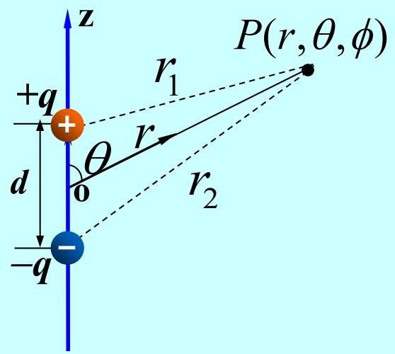
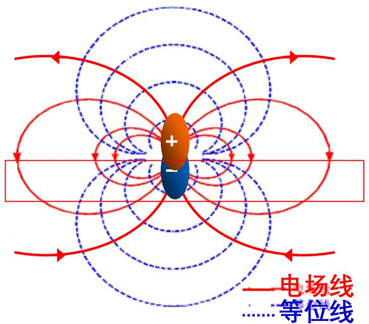
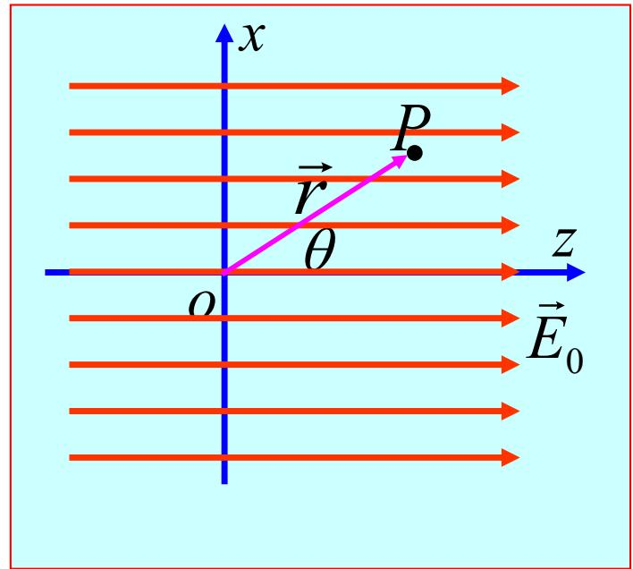
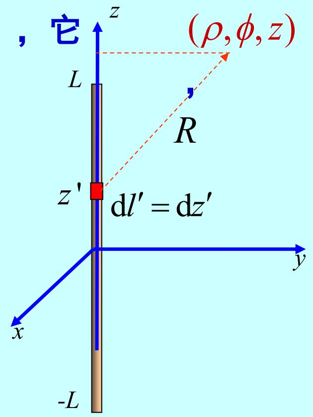
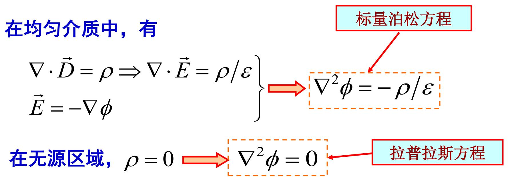

# 3.1.2 电位函数的分析与求解

## 0. 电位与电位函数的概念与来源

### 为什么要有这些物理量，它们是怎么来的？
根据静电场的基本方程之一，静电场是一个==无旋场==。其微分形式表达为电场强度的旋度为零：
$$ \nabla \times \vec{E} = 0 $$
在线性代数与矢量分析中存在一个定理：恒定为零的旋度场，可以由某一个==标量函数==的梯度来表示。因为任意标量函数梯度的旋度恒为零（即 $\nabla \times (\nabla \phi) = 0$）。基于这个数学规律，引入了一个标量函数 $\phi$。

**引入的目的：**
引入电位的主要目的是==简化计算==。
电场强度 $\vec{E}$ 是一矢量，计算它需要同时处理三个坐标分量。而标量函数 $\phi$ 只包含数值大小。通过先利用电荷分布求出标量场 $\phi$，再对其求偏导（求梯度），就能直接得到复杂的电场强度矢量，从而在工程和理论计算上降低几何运算的复杂度。

### 电位与电位函数是什么？
1. **电位函数的定义**
   ==电位函数==（用 $\phi$ 或 $\varphi$ 表示）就是满足无旋数学定理的空间标量函数。定义空间中各点的电场强度等于该标量函数的==负==梯度：
   $$ \vec{E} = -\nabla \phi $$
   等式右侧的负号规定了电场强度的方向总是指向电位数值下降最快的方向。
2. **电位的物理意义**
   空间中某一点 $P$ 的==电位==，在物理上定义为：将单位正电荷从 $P$ 点移动到规定的==零电位参考点==时，电场力所做的功。

## 1. 电位函数的推导

由 $\nabla \times \vec{E} = 0$，可知静电场可以用一个标量函数的梯度来表示。标量函数 $\phi$ 称为静电场的标量电位或电位。

电位表达式的推导过程如下：
令 $\vec{R} = \vec{r} - \vec{r}'$。
对于连续的体分布电荷，有：
$$
\begin{array}{l} \vec{E}(\vec{r}) = \frac{1}{4 \pi \varepsilon} \int_V \frac{\rho(\vec{r}') \vec{R}}{R^3} \mathrm{d}V' = -\frac{1}{4 \pi \varepsilon} \int_V \rho(\vec{r}') \nabla \left(\frac{1}{R}\right) \mathrm{d}V' \\ = -\nabla \left[ \frac{1}{4 \pi \varepsilon} \int_V \rho(\vec{r}') \left(\frac{1}{R}\right) \mathrm{d}V' \right] \end{array}
$$
其中利用了 $\nabla \left(\frac{1}{R}\right) = -\frac{\vec{R}}{R^3}$，这是第一章的重要例题结论

由上述推导可得，**体电荷的电位**为：（背诵）
$$ \varphi(\vec{r}) = \frac{1}{4 \pi \varepsilon} \int_V \frac{\rho(\vec{r}')}{R} \mathrm{d}V' + C $$ ^6be8fe

相应的，**面电荷的电位**为：
$$ \varphi(\vec{r}) = \frac{1}{4 \pi \varepsilon} \int_S \frac{\rho_S(\vec{r}')}{R} \mathrm{d}S' + C $$

**线电荷的电位**为：
$$ \varphi(\vec{r}) = \frac{1}{4 \pi \varepsilon} \int_C \frac{\rho_l(\vec{r}')}{R} \mathrm{d}l' + C $$

**点电荷的电位**为：
$$ \varphi(\vec{r}) = \frac{q}{4 \pi \varepsilon R} + C $$

## 2. 电位差的推导

将 $\vec{E} = -\nabla \phi$ 两端点乘 $\mathrm{d}\vec{l}$，可得：
$$ \vec{E} \cdot \mathrm{d}\vec{l} = -\nabla \phi \cdot \mathrm{d}\vec{l} = -\left(\frac{\partial \phi}{\partial x} \mathrm{d}x + \frac{\partial \phi}{\partial y} \mathrm{d}y + \frac{\partial \phi}{\partial z} \mathrm{d}z\right) = -\mathrm{d}\phi $$

将上式两边从点P到点Q沿任意路径进行积分，结果为：

P、Q 两点间的**电位差**  等于电场力**将单位正电荷从P点移至Q点所做的功**。
电场力使单位正电荷由高电位处移到低电位处。
电位差也称为电压，用 $U$ 表示。
电位差有确定值，**只与首尾两点位置有关**，与积分路径无关。

## 3. 电位参考点

静电位可以相差一个常数，即：
$$ \phi' = \phi + C \Longrightarrow \nabla \phi' = \nabla (\phi + C) = \nabla \phi $$
为使空间各点电位具有确定值，可以选定空间某一点作为参考点，令参考点的电位为零。由于空间各点与参考点的电位差为确定值，该点的电位因此具有确定值，即：

选择电位参考点时，应使电位表达式最为简单。若电荷分布在有限区域内，通常取无限远作为电位参考点。若电荷分布在无限大（比如平面）上，那么可能得选择有限远处。一个问题中，只能有一个参考点。

## 4. 电偶极子和均匀电场分布的推导

### 例 3.1.1 求电偶极子的电位。

**解：**
在球坐标系中，计算电位的表达式：
$$
\begin{array}{l} \phi (\vec{r}) = \frac{q}{4 \pi \varepsilon_0} \left(\frac{1}{r_1} - \frac{1}{r_2}\right) = \frac{q}{4 \pi \varepsilon_0} \frac{r_2 - r_1}{r_1 r_2} \\ r_1 = \sqrt{r^2 + (d/2)^2 - rd \cos\theta} \\ r_2 = \sqrt{r^2 + (d/2)^2 + rd \cos\theta} \end{array}
$$

使用二项式展开。由于 $r \gg d$，可得：
$r_1 \approx r - \frac{d}{2} \cos\theta$
$r_2 \approx r + \frac{d}{2} \cos\theta$
代入上式计算得：

$$ \phi(\vec{r}) = \frac{qd \cos\theta}{4 \pi \varepsilon_0 r^2} = \frac{\vec{p} \cdot \vec{e}_r}{4 \pi \varepsilon_0 r^2} = \frac{\vec{p} \cdot \vec{r}}{4 \pi \varepsilon_0 r^3} $$

其中 $\vec{p} = q\vec{d}$，定义为电偶极矩，方向由负电荷指向正电荷。

根据球坐标系中的梯度公式，计算电偶极子的远区电场强度为：
$$
\begin{array}{l} \vec{E}(\vec{r}) = -\nabla \phi = -\left(\vec{e}_r \frac{\partial \phi}{\partial r} + \vec{e}_\theta \frac{1}{r} \frac{\partial \phi}{\partial \theta} + \vec{e}_\varphi \frac{1}{r \sin\theta} \frac{\partial \phi}{\partial \varphi}\right) \\ = \frac{qd}{4 \pi \varepsilon_0 r^3} (\vec{e}_r 2 \cos\theta + \vec{e}_\theta \sin\theta) \end{array}
$$

等位线方程为：
$$ \frac{p \cos\theta}{4 \pi \varepsilon_0 r^2} = C \Longrightarrow r^2 = C' \cos\theta $$

电场线微分方程为：
$$ \frac{\mathrm{d}r}{E_r} = \frac{r \mathrm{d}\theta}{E_\theta} $$
将 $E_\theta$ 和 $E_r$ 代入电场线微分方程，解得 $\vec{E}$ 线方程为：
$$ r = C_1 \sin^2\theta $$

### 例 3.1.2 求均匀电场的电位分布。

**解：**
选定均匀电场空间中的一点 $o$ 为坐标原点，任意点 $P$ 的位置矢量为 $\vec{r}$，则：
$$ \varphi(P) - \varphi(o) = \int_P^o \vec{E}_0 \cdot \mathrm{d}\vec{l} = -\int_o^P \vec{E}_0 \cdot \mathrm{d}\vec{r} = -\vec{E}_0 \cdot \vec{r} $$

选择点 $o$ 为电位参考点，即 $\varphi(o) = 0$，则：
$$ \varphi(P) = -\vec{E}_0 \cdot \vec{r} $$

在球坐标系中，设定极轴方向与 $\vec{E}_0$ 的方向一致，即 $\vec{E}_0 = \vec{e}_z E_0$，则有：
$$ \varphi(P) = -\vec{E}_0 \cdot \vec{r} = -\vec{e}_z \cdot \vec{r} E_0 = -E_0 r \cos\theta $$

在圆柱面坐标系中，设定 $\vec{E}_0$ 与 x 轴方向一致，即 $\vec{E}_0 = \vec{e}_x E_0$。此时位置矢量 $\vec{r} = \vec{e}_\rho \rho + \vec{e}_z z$，故有：
$$ \varphi(P) = -\vec{E}_0 \cdot \vec{r} = -\vec{e}_x \cdot E_0 (\vec{e}_\rho \rho + \vec{e}_z z) = -E_0 \rho \cos\phi $$

### 例：求长度为 2L、电荷线密度为 $\rho_{l0}$ 的均匀带电线的电位。

**解：**
采用圆柱面坐标系，令线电荷与 z 轴重合，中点位于坐标原点。由系统轴对称性，电位与 $\phi$ 无关。
位于 $z'$ 处的线元 $\mathrm{d}l' = \mathrm{d}z'$ 到点 $P(\rho, \phi, z)$ 的距离为 $R = \sqrt{\rho^2 + (z - z')^2}$。此时计算公式为：
$$
\begin{array}{l} \varphi(\vec{r}) = \frac{\rho_{l0}}{4 \pi \varepsilon_0} \int_{-L}^L \frac{1}{\sqrt{\rho^2 + (z - z')^2}} \mathrm{d}z' \\ = \left. \frac{\rho_{l0}}{4 \pi \varepsilon_0} \ln \left[ z' - z + \sqrt{\rho^2 + (z - z')^2} \right] \right|_{-L}^L \\ = \frac{\rho_{l0}}{4 \pi \varepsilon_0} \ln \frac{\sqrt{\rho^2 + (z - L)^2} - (z - L)}{\sqrt{\rho^2 + (z + L)^2} - (z + L)} \end{array}
$$

如果设定 $L \to \infty$，可以计算无限长直线电荷的电位。此时由于分母和分子项的简化情况，得到：
$$ \varphi(\vec{r}) \approx \frac{\rho_{l0}}{4 \pi \varepsilon_0} \ln \frac{\sqrt{\rho^2 + L^2} + L}{\sqrt{\rho^2 + L^2} - L} = \frac{\rho_{l0}}{4 \pi \varepsilon_0} \ln \frac{2L}{\rho^2 / 2L} \approx \frac{\rho_{l0}}{2 \pi \varepsilon_0} \ln \frac{2L}{\rho} $$

当 $L \to \infty$ 时，由于电荷不是分布在有限区域内，如果仍取无穷远处为电位参考点，上述结果趋于无穷大。因此，可以引入常数 $C$ 进行修正，选择有限远点作为电位参考点：
$$ \varphi(\vec{r}) = \frac{\rho_{l0}}{2 \pi \varepsilon_0} \ln \frac{2L}{\rho} + C $$

如果选择在 $\rho = a$ 的点处为电位参考点，则计算得到 $C$ 为：
$$ C = -\frac{\rho_{l0}}{2 \pi \varepsilon_0} \ln \frac{2L}{a} \Longrightarrow \varphi(\vec{r}) = \frac{\rho_{l0}}{2 \pi \varepsilon_0} \ln \frac{a}{\rho} $$

## 5. 电位的微分方程与边界条件

对空间有界问题, [[3.1.2_电位函数的分析与求解#^6be8fe]] 等四个式子不再适用于电位的计算,但却可通过解泊松方程或拉普拉斯方程求 φ(r) ，不过这时还需补充边界条件。

**静电位的边界条件推导：**

设 $P_1$ 和 $P_2$ 是介质分界面两侧紧贴界面的相邻两点

![[Pasted image 20260418191221.png]]

电位分别为 $\varphi_1$ 和 $\varphi_2$。当两点间距离趋于零 $\Delta l \to 0$ 时，电位的变化满足：
$$ \phi_1 - \phi_2 = \lim_{\Delta l \to 0} \int_{P_1}^{P_2} \vec{E} \cdot \mathrm{d}\vec{l} = 0 \Longrightarrow \phi_1 = \phi_2 $$

由 $\vec{e}_n \cdot (\vec{D}_1 - \vec{D}_2) = \rho_S$ 和 $\vec{D} = -\varepsilon \nabla \phi$ 的关系，可得出电位的法向导数边界条件：
$$ \varepsilon_2 \frac{\partial \phi_2}{\partial n} - \varepsilon_1 \frac{\partial \phi_1}{\partial n} = \rho_S $$

若介质分界面上不存在自由面电荷（即 $\rho_S = 0$），则有：
$$ \varepsilon_2 \frac{\partial \phi_2}{\partial n} = \varepsilon_1 \frac{\partial \phi_1}{\partial n} $$

对于导体表面上电位的边界条件：导体表面是等位面，具有 $\phi =$ 常数。

# 3.1.2 电位函数的分析与求解 (预习笔记)

> **💡 章节导读与知识脉络：**
> 在 3.1.1 节中明确了静电场是一个无旋场。无旋场的数学定理保证了该==矢量场可以由一个标量函数==的梯度来表示。引入这个标量函数——“电位”，可以将原来针对三个空间方向矢量分量（$\vec{E}$）的复杂计算，简化为对单一标量 $\phi$ 的计算求导。本节主要研究电位函数的定义、物理意义、参考点的选择原则，以及电位函数所满足的微分方程与典型电荷分布下的计算方法。

---

### 一、 电位与电位差的定义

#### 1. 电位函数的引入
由静电场的无旋性 $\nabla \times \vec{E} = 0$ 可知==，电场强度矢量必定可以表示为某标量函数 $\phi$ 的负梯度==：（背诵）
$$ \vec{E} = -\nabla \phi $$
*(物理意义：在数学上，任意标量函数的梯度的旋度恒为零。这里的标量函数 $\phi$ 即定义为电位。负号表示电场强度的方向总是指向电位下降最快的方向。求取空间某点的电场强度，可以通过求解空间电位标量场的梯度得到。)*

#### 2. 电位差（电压）
在静电场中，将单位正电荷从空间内一点 $P$ 移动到另一点 $Q$ 时电场力所作的功，定义为两点之间的电位差（即电压 $U$）：
$$ \int_P^Q \vec{E} \cdot d\vec{l} = -\int_P^Q d\phi = \phi(P) - \phi(Q) $$
*(物理意义：由于静电场是保守场，电场力作功的结果仅与路径的起点 $P$ 和终点 $Q$ 的电位状态有关，而与具体的移动路径无关。公式表达了电位差等于路径线积分的标量结果。)*

---

### 二、 电位参考点的选择原则

电位是一个相对的标量，只有电位差才具有绝对的物理操作意义。要确定空间中任意一点的电位绝对数值 $\phi(P)$，必须人为规定一个电位为零的参考点。

选择零电位参考点的基本原则：
1. **无限远处为零（最常用情形）：** 当场源电荷分布在有限区域内（如点电荷、有限长的线电荷、有限面积的面电荷或体电荷）时，通常选择距离电荷系统无限远处为电位零参考点，即 $\phi(\infty) = 0$。
2. **有限远处为零（特定情形）：** 若场源电荷分布延伸至无限远（如无限长的带电直线、无限大均匀带电平面），此时选无限远处为零参考点会导致电位公式积分为无穷大。因此必须在有限空间内选取特定的、有物理意义的固定点（如距离场源距离为 $a$ 处）作为零参考点。*（同一问题中零电位参考点必须唯一确定，不可更改。）*

---

### 三、 典型电荷分布下的电位积分计算（叠加原理）

根据叠加原理和点电荷的电位公式，对于不同的电荷分布，可以通过空间积分求得任意一点的电位分布公式：
*   **体分布电荷**（体电荷密度为 $\rho$）： 
    $$ \phi(\vec{r}) = \frac{1}{4\pi\varepsilon} \int_V \frac{\rho(\vec{r}')}{R} dV' $$
*   **面分布电荷**（面电荷密度为 $\rho_S$）： 
    $$ \phi(\vec{r}) = \frac{1}{4\pi\varepsilon} \int_S \frac{\rho_S(\vec{r}')}{R} dS' $$
*   **线分布电荷**（线电荷密度为 $\rho_l$）以及**单一固定点电荷** $q$： 
    $$ \phi(\vec{r}) = \frac{q}{4\pi\varepsilon R} $$
    （注：式中 $R = |\vec{r} - \vec{r}'|$ 是源电荷所在位置 $\vec{r}'$ 到场点（待求点）位置 $\vec{r}$ 的标量距离。上述公式均默认为无限远处为零电位参考点。）
*   **电偶极子（相距极近的等量异号点电荷 $+q$ 和 $-q$）：** 
    $$ \phi(\vec{r}) \approx \frac{\vec{p}\cdot\vec{e}_r}{4\pi\varepsilon_0 r^2} $$
    *(物理意义：在远区场（测试点距离 $r \gg d$），电位分布与偶极矩 $\vec{p} = q\vec{d}$ 强相关。相比单一孤立点电荷（与 $r$ 呈反比衰减），电偶极子的电位衰减速度更快（与 $r^2$ 呈反比）。)*

---

### 四、 电位的微分方程与边界条件

静电场的基本规律可以直接转换为关于电位函数的二阶微分方程及相应的边界条件。

#### 1. 泊松方程与拉普拉斯方程（背诵）
将线性同性媒质的本构方程 $\vec{D} = \varepsilon\vec{E}$ 以及电位梯度方程 $\vec{E} = -\nabla\phi$ 代入静电场高斯定理的微分形式 $\nabla\cdot\vec{D} = \rho$ 中，提出负号，即可得到：
*   **泊松方程（Poisson's Equation，针对存在体电荷分布的区域）：**
    $$ \nabla^2 \phi = -\frac{\rho}{\varepsilon} $$
    *(物理意义：空间中任意一点电位分布的拉普拉斯运算（即 $\nabla^2$ 算子，表征标量场的空间二阶微商特质），与该点的体电荷密度 $\rho$ 成正比。)*
*   **拉普拉斯方程（Laplace's Equation，针对无自由电荷分布的区域）：**
    $$ \nabla^2 \phi = 0 $$
    *(物理意义：当研究区域内没有自由体电荷（$\rho=0$）时，泊松方程退化为拉普拉斯方程。它说明无源区电位函数满足调和函数的平滑解析性质。)*

#### 2. 电位在媒质分界面上的边界条件
静电场越过两种不同介质的交界面时，电场切向连续和电通密度法向边界条件转化为电位的表达式：
*   由于由于电场切向连续，在其面上积分后的电位函数必须在分界面上保持空间位置的连续性：
    $$ \phi_1 = \phi_2 $$
*   由法向边界条件 $D_{1n} - D_{2n} = \rho_S$ 以及 $D_n = \varepsilon E_n = -\varepsilon \frac{\partial \phi}{\partial n}$ 代入得：
    $$ \varepsilon_2 \frac{\partial \phi_2}{\partial n} - \varepsilon_1 \frac{\partial \phi_1}{\partial n} = \rho_S $$
    （其中 $n$ 为由媒质2指向媒质1的法向坐标方向）。若界面上不存在自由面电荷（$\rho_s = 0$），则两侧电位在法向上的偏导数将依据两侧介质的介电常数发生相应的比例折射突变。

> **总结**：计算复杂静电场分布时，采用标量电位 $\phi$ 进行建模求解泊松/拉普拉斯方程或积分，较直接处理矢量电场更为便捷。一旦解出空间特定点处的标量电位函数，即可通过求取负梯度 $-\nabla \phi$ 准确计算出该点的电场强度矢量。

> 🔗 **附：相关考点例题链接**
> 在掌握了上述一维电位方程与边界条件后，有一个非常经典的考试难点：即求解由有限厚度面电荷与两块平板导体边界所划定的电位解。详细解题过程请参考笔记：
> [[【考试难点】_两块无限大接地导体平板间的电位场求解]]