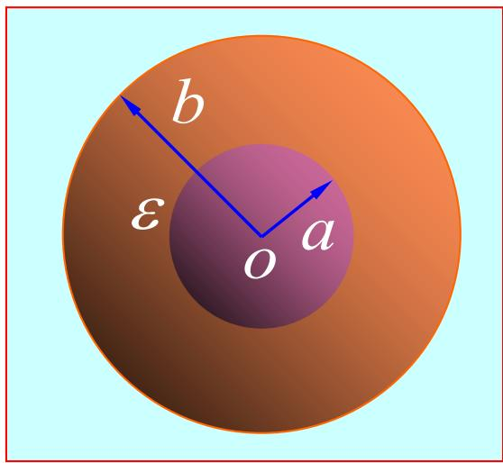
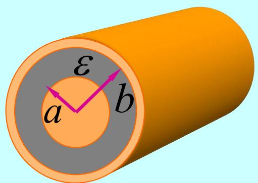
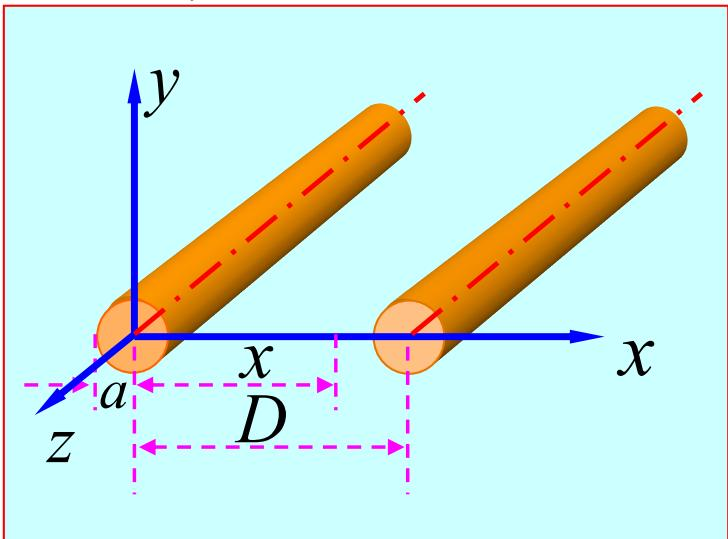

# 3.1.3 导体系统的电容

## 1. 电容的定义
电容是描述导体系统储存电荷与产生电位差之间关系的物理量。

### 孤立导体的电容
对于空间中远离其他导体的孤立导体，其带电量 $q$ 与其电位 $\varphi$（以无穷远处为电位零点）成正比。孤立导体的电容 $C$ 定义为：

$$
C = \frac{q}{\varphi}
$$

==key point: 电容的大小仅由导体的几何尺寸、形状以及周围介质的介电常数决定，与带电量和电位无关。==

### 相对电容（电容器的电容）
由两个带有等量异号电荷（$+q$ 与 $-q$）的导体组成的系统称为电容器。其相对电容 $C$ 定义为单个导体所带电量 $q$ 的绝对值与两导体间电位差 $U$ 的比值：

$$
C = \frac{q}{U} = \frac{q}{\left| \varphi_1 - \varphi_2 \right|}
$$

计算给定导体系统电容的一般步骤如下：
1. **假定电荷**：假定两导体分别带等量异号电荷 $+q$ 和 $-q$（或电荷的面密度 $\rho_s$、线密度 $\rho_l$）。
2. **计算场强**：利用高斯定理（针对对称分布情况）或其他静电场求解方法，求出两导体之间空间内的电场强度 $\vec{E}$。
3. **计算电位差**：计算两导体之间的电位差 $U = \int_1^2 \vec{E} \cdot d\vec{l}$。
4. **求解比值**：代入定义式求比值 $C = \frac{q}{U}$，得到电容。

## 3. 具体应用实例推导

### 例1：同心球形电容器的电容
设同心球形电容器的内导体（外表面）半径为 $r_1$，外导体（内表面）半径为 $r_2$，其间填充介电常数为 $\varepsilon$ 的均匀介质。

1. 假定内导体带电荷 $+q$，外导体带电荷 $-q$。
2. 由高斯定理 $\oint_S \vec{D} \cdot d\vec{S} = q$，在介质区域 $r_1 < r < r_2$ 内作同心球面，得到径向电场强度为：
$$
\vec{E} = \frac{q}{4\pi\varepsilon r^2} \hat{e}_r 
$$
3. 计算两导体间的电位差 $U$：
$$
U = \int_{r_1}^{r_2} \vec{E} \cdot d\vec{r} = \int_{r_1}^{r_2} \frac{q}{4\pi\varepsilon r^2} dr = \frac{q}{4\pi\varepsilon} \left( \frac{1}{r_1} - \frac{1}{r_2} \right) = \frac{q(r_2 - r_1)}{4\pi\varepsilon r_1 r_2}
$$
4. 代入定义得同心球形电容器的电容：
$$
C = \frac{q}{U} = \frac{4\pi\varepsilon r_1 r_2}{r_2 - r_1}
$$

==key point: 当 $r_2 \to \infty$ 时，上式将演变为半径为 $r_1$ 的孤立导体球的电容式 $C = 4\pi\varepsilon r_1$。== ^4523c6

### 例2：同轴线单位长度的电容
设同轴线的内导体外半径为 $r_1$，外电缆圆筒内半径为 $r_2$，其间填充介电常数为 $\varepsilon$ 的均匀介质。

1. 假定内、外导体单位长度分别带电荷 $+\rho_l$ 和 $-\rho_l$。
2. 根据圆柱对称性应用高斯定理，在介质区域 $r_1 < r < r_2$ 内求解电场强度：
$$
\vec{E} = \frac{\rho_l}{2\pi\varepsilon r} \hat{e}_r
$$
3. 计算内外导体间的电位差 $U$：
$$
U = \int_{r_1}^{r_2} \vec{E} \cdot d\vec{r} = \int_{r_1}^{r_2} \frac{\rho_l}{2\pi\varepsilon r} dr = \frac{\rho_l}{2\pi\varepsilon} \ln\left(\frac{r_2}{r_1}\right)
$$
4. 得到同轴线单位长度的电容 $C_0$ 为：
$$
C_0 = \frac{\rho_l}{U} = \frac{2\pi\varepsilon}{\ln(r_2 / r_1)}
$$

### 例3：平行双线传输线单位长度==**的电容（期中考试要考）**==
设两根平行足够长圆导线截面半径均为 $a$，轴心间距为 $d$，满足 $d \gg a$ ，周围介质为 $\varepsilon_0$。

1. 假定两导线单位长度带电量分别为 $+\rho_l$ 和 $-\rho_l$。由条件 $d \gg a$ ，近似认为电荷均匀分布于导线表面。
2. 利用单一带电长直导线的电场 $E = \frac{\rho_l}{2\pi\varepsilon_0 r}$ 及叠加原理。在两导线轴心连线的平面上，距离左侧带正电导线轴心距离为 $x$ 处，总电场方向均向右，大小为：
$$
\vec{E}(x) = \frac{\rho_l}{2\pi\varepsilon_0 x} + \frac{\rho_l}{2\pi\varepsilon_0 (d - x)}
$$
3. 对介质所在区间沿两导线连线积分得电位差 $U$：
$$
U = \int_{a}^{d-a} E(x) dx = \frac{\rho_l}{2\pi\varepsilon_0} \int_{a}^{d-a} \left( \frac{1}{x} + \frac{1}{d - x} \right) dx = \frac{\rho_l}{\pi\varepsilon_0} \ln \left( \frac{d - a}{a} \right)
$$
由于 $d \gg a$，上式可近似为 $U \approx \frac{\rho_l}{\pi\varepsilon_0} \ln(d/a)$。
4. 得到单位长度电容 $C_0$ 为：
$$
C_0 = \frac{\rho_l}{U} = \frac{\pi\varepsilon_0}{\ln\left(\frac{d-a}{a}\right)} \approx \frac{\pi\varepsilon_0}{\ln(d/a)}
$$

## 4. 多导体系统与部分电容
在涉及 $n$ 个独立导体和参考系统的大型网络中，每个导体上的电荷既取决于其自身电位，也取决于系统内其他导体的分布电位。

### 电位系数 $\alpha$
由于物理系统遵循线性叠加规律，任一导体 $i$ 的电位 $\varphi_i$ 可表示为系统所有导体电荷 $q_j$ 的线性函数组合：
$$
\varphi_i = \sum_{j=1}^{n} \alpha_{ij} q_j \quad (i = 1, 2, \dots, n)
$$
其中系数 $\alpha_{ij}$ 称为电位系数。$\alpha_{ii}$ 表示自电位系数，$\alpha_{ij}$ ($i \neq j$) 表示互电位系数。
$\alpha_{ij}$ 的数值完全取决于所有导体的几何结构与周围介质，并不依赖于电荷与电位。另外，由静电场能量及互易定理可证：$\alpha_{ij} = \alpha_{ji}$。

### 电容系数 $\beta$
将已知电荷转变为关于导体电位的线性关系（对方程组求逆矩阵），得到分布电荷：
$$
q_i = \sum_{j=1}^{n} \beta_{ij} \varphi_j \quad (i = 1, 2, \dots, n)
$$
$\beta_{ij}$ 称为电容系数或感应系数。$\beta_{ii}$ 为自电容系数，$\beta_{ij}$ ($i \neq j$) 为互感应系数。
电容系数行列式与电位系数行列式的相互运算关系可记作余子式法则：
$$
\beta_{ij} = (-1)^{i+j} \frac{M_{ji}}{|\alpha|}
$$
这里 $|\alpha|$ 为电位系数矩阵的行列式值，而 $M_{ji}$ 为余子式。==key point: 任何正常的多导体物理系统中，必有 $\beta_{ii} > 0$，而 $\beta_{ij} \le 0$ ($i \neq j$)，同时保持对称性 $\beta_{ij} = \beta_{ji}$。==

### 部分电容 $C_{ij}$
将前式重组，按电位差的形式归纳：
$$
q_i = \sum_{j=1}^{n} \beta_{ij} \varphi_j = \left( \sum_{j=1}^{n} \beta_{ij} \right) \varphi_i - \sum_{j \neq i}^n \beta_{ij} (\varphi_i - \varphi_j)
$$
令：
$$
C_{ii} = \sum_{j=1}^{n} \beta_{ij}
$$
$$
C_{ij} = -\beta_{ij} \quad (i \neq j)
$$
进而得到直观的部分电容（Partial Capacitance）电荷分布描述方程：
$$
q_i = C_{ii} \varphi_i + \sum_{j \neq i}^n C_{ij} (\varphi_i - \varphi_j)
$$
其中，$C_{ii}$ 是导体 $i$ 与大地（参考零电位）之间的部分电容；$C_{ij}$ 是导体 $i$ 与导体 $j$ 之间的部分电容。这里包含的所有 $C_{ij}$ 与 $C_{ii}$ 实数恒大于或等于零。

## 5. 等效电容
在复杂的多导体环境中，可以将任意指定的两个导体等效视为标准电容器的两个引脚。若使此两引脚带等效电量 $\pm q$，并在两者之间直接引发电位差 $U$，则这二者构成的系统具有等效宏观容性。
等效电容 $C_{eq}$ 统一定义为：
$$
C_{eq} = \frac{q}{U}
$$
这在工程分析中可通过绘制包含分布参数 $C_{ij}$ 及 $C_{ii}$ 的等效分立无源网络，并运用基础节点电压法进行合并求得。