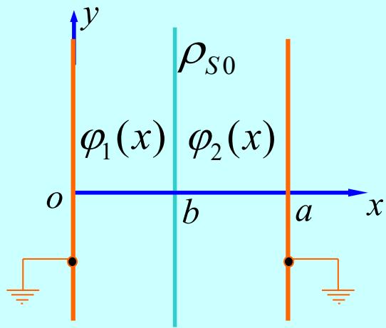

# ==【考试难点】两块无限大接地导体平板间的电位场求解==

## 1. 问题描述

两块无限大接地导体平板分别置于 $x=0$ 和 $x=a$ 处。在两板之间的 $x=b$ 处，有一面密度为 $\rho_{S0}$ 的均匀面电荷分布。周围空间介电常数取真空介电常数 $\varepsilon_0$。求两导体平板之间的电位 $\varphi$ 分布和电场强度 $\vec{E}$ 分布。

## 2. 求解思路与物理模型

由于两块导体板都是无限大平板，在 $y$ 与 $z$ 方向上没有结构变化，因此电位只依赖于 $x$ 坐标。这是一个一维静电边值问题。

在两块接地导体板之间，除 $x=b$ 处的面电荷外，其余区域没有自由电荷。因此可把空间分成两个无源区域：

- **区域一**：$0<x<b$。
- **区域二**：$b<x<a$。

在无源区域中，电位满足拉普拉斯方程：

$$
\nabla^2\varphi=0
$$

一维情况下退化为：

$$
\frac{\mathrm{d}^2\varphi}{\mathrm{d}x^2}=0
$$

需要分别求解两个区域的电位函数，并利用导体板接地条件、电位连续条件和面电荷处的电场跃变条件确定积分常数。

## 3. 详细求解步骤

### 第一步：写出电位的一般解形式

区域一满足：

$$
\frac{\mathrm{d}^2\varphi_1(x)}{\mathrm{d}x^2}=0
$$

两次积分得：

$$
\varphi_1(x)=C_1x+D_1\quad(0<x<b)
$$

区域二满足：

$$
\frac{\mathrm{d}^2\varphi_2(x)}{\mathrm{d}x^2}=0
$$

两次积分得：

$$
\varphi_2(x)=C_2x+D_2\quad(b<x<a)
$$

其中 $C_1,D_1,C_2,D_2$ 是四个待定积分常数。

### 第二步：分析边界条件并列出方程

#### 1. ==导体板接地条件==

左导体板在 $x=0$ 处接地，因此：

$$
\varphi_1(0)=0
$$

代入 $\varphi_1(x)=C_1x+D_1$，得到：

$$
D_1=0
$$

右导体板在 $x=a$ 处接地，因此：

$$
\varphi_2(a)=0
$$

代入 $\varphi_2(x)=C_2x+D_2$，得到：

$$
C_2a+D_2=0
$$

#### 2. ==面电荷处的电位连续性条件==

在 $x=b$ 处只有一层极薄面电荷，电位本身必须连续：

$$
\varphi_1(b)=\varphi_2(b)
$$

代入两个区域的一般解，得到：

$$
C_1b+D_1=C_2b+D_2
$$

由于 $D_1=0$，可写成：

$$
C_1b=C_2b+D_2
$$

#### 3. ==面电荷处的电场法向跃变条件==

面电荷所在界面法向取 $+x$ 方向，即从区域一指向区域二。电位移矢量法向分量满足：

$$
D_{2n}-D_{1n}=\rho_{S0}
$$

在真空中 $\vec{D}=\varepsilon_0\vec{E}$，所以：

$$
\varepsilon_0E_2-\varepsilon_0E_1=\rho_{S0}
$$

又因为：

$$
\vec{E}=-\nabla\varphi
$$

一维情况下：

$$
E_x(x)=-\frac{\partial\varphi}{\partial x}
$$

因此两侧电场为：

$$
E_1(x)=-\frac{\partial\varphi_1(x)}{\partial x}=-C_1
$$

$$
E_2(x)=-\frac{\partial\varphi_2(x)}{\partial x}=-C_2
$$

代入跃变条件：

$$
\varepsilon_0(-C_2)-\varepsilon_0(-C_1)=\rho_{S0}
$$

整理得：

$$
\boxed{C_2-C_1=-\frac{\rho_{S0}}{\varepsilon_0}}
$$

### 第三步：求解常数并代回原式

由 $D_1=0$ 与 $C_2a+D_2=0$ 得：

$$
D_2=-C_2a
$$

把 $D_1=0$、$D_2=-C_2a$ 代入电位连续条件：

$$
C_1b=C_2b-C_2a=C_2(b-a)
$$

所以：

$$
C_1=C_2\frac{b-a}{b}
$$

再代入跃变条件：

$$
C_2-C_2\frac{b-a}{b}=-\frac{\rho_{S0}}{\varepsilon_0}
$$

整理得：

$$
C_2\cdot\frac{a}{b}=-\frac{\rho_{S0}}{\varepsilon_0}
$$

因此：

$$
\boxed{C_2=-\frac{\rho_{S0}b}{\varepsilon_0a}}
$$

进而：

$$
\boxed{C_1=C_2\frac{b-a}{b}=\frac{\rho_{S0}(a-b)}{\varepsilon_0a}}
$$

$$
\boxed{D_2=-C_2a=\frac{\rho_{S0}b}{\varepsilon_0}}
$$

## 4. 最终结论

将积分常数代回两个区域的电位函数，得到电位分布：

$$
\boxed{\varphi_1(x)=\frac{\rho_{S0}(a-b)}{\varepsilon_0a}x\quad(0\leq x\leq b)}
$$

$$
\boxed{\varphi_2(x)=\frac{\rho_{S0}b}{\varepsilon_0a}(a-x)\quad(b\leq x\leq a)}
$$

对电位求负梯度即可得到电场强度。由于电位只随 $x$ 变化：

$$
\vec{E}=-\nabla\varphi=-\vec{e}_x\frac{\mathrm{d}\varphi}{\mathrm{d}x}
$$

区域一中：

$$
\boxed{\vec{E}_1(x)=-\vec{e}_x\frac{\mathrm{d}\varphi_1(x)}{\mathrm{d}x}=-\vec{e}_x\frac{\rho_{S0}(a-b)}{\varepsilon_0a}\quad(0\leq x<b)}
$$

区域二中：

$$
\boxed{\vec{E}_2(x)=-\vec{e}_x\frac{\mathrm{d}\varphi_2(x)}{\mathrm{d}x}=\vec{e}_x\frac{\rho_{S0}b}{\varepsilon_0a}\quad(b<x\leq a)}
$$

> ==**结论**==：本题的核心是把两块接地导体板之间的空间分成两个无源区域，分别用一维拉普拉斯方程得到线性电位，再用 $x=b$ 处的电位连续条件和电位移法向跃变条件确定四个积分常数。
