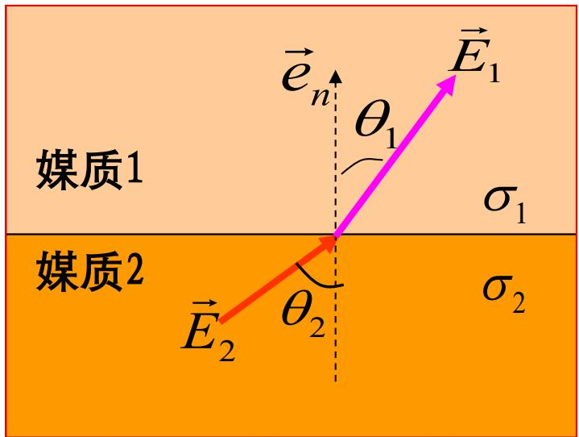
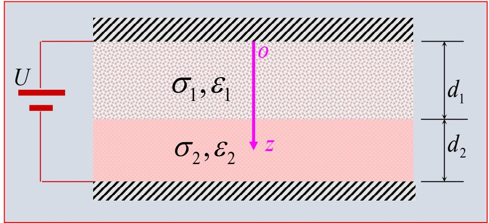

# 3.2.1 恒定电场的基本方程和边界条件（预习笔记）

> ==💡 章节导读与知识脉络：==
> 3.1 节研究的是静止电荷产生的静电场，导体内部场为零、不存在电流流动。本节转入研究导体中存在==恒定电流==时所伴随的电场——**恒定电场**。
> 恒定电场与静电场的==核心区别==：
> 1. 恒定电场**可以存在于导体内部**，导体不再是等势体，内部电场不为零；
> 2. 导体中存在焦耳热损耗，需外加电源持续补充能量。
>
> 但令人惊喜的是，恒定电场与静电场在数学形式上==高度相似==——都可以引入电位函数、都满足拉普拉斯方程、边界条件格式也相同（仅将 $\varepsilon$ 换成 $\sigma$）。这正是 3.2.2 节"静电比拟法"的基础。

---

### 一、 恒定电场的基本方程

恒定电场的==基本场矢量==是电流密度 $\vec{J}(\vec{r})$ 和电场强度 $\vec{E}(\vec{r})$。  
在**恒定电流**状态下，电荷的空间分布不随时间变化（$\frac{\partial\rho}{\partial t} = 0$），由电流连续性方程可以推出：

#### 1. 无散性（对电流而言）

$$
\left\{ \begin{array}{ll}
\nabla \cdot \vec{J} = 0 & \text{（微分形式）} \\[4pt]
\oint_{S} \vec{J} \cdot \mathrm{d}\vec{S} = 0 & \text{（积分形式）}
\end{array} \right.
$$

*(物理意义：任意闭合曲面穿出的净电流为零。流进多少，流出多少，不会在某处无限堆积。恒定电流形成闭合的电流管。)*

#### 2. 无旋性（对电场而言）

$$
\left\{ \begin{array}{ll}
\nabla \times \vec{E} = 0 & \text{（微分形式）} \\[4pt]
\oint_{C} \vec{E} \cdot \mathrm{d}\vec{l} = 0 & \text{（积分形式）}
\end{array} \right.
$$

*(物理意义：恒定电场依然是保守场（无旋场），电场力绕任意闭合路径做功为零。与静电场的 $\nabla\times\vec{E}=0$ 完全一致，因此同样可以引入标量电位函数。)*

#### 3. 线性各向同性导电媒质的本构关系（欧姆定律微分形式）

$$
\vec{J} = \sigma \vec{E}
$$

#### 4. 电位函数与拉普拉斯方程

由无旋性，引入电位函数 $\varphi$：
$$
\vec{E} = -\nabla\varphi
$$

在==均匀导电媒质==（$\sigma$ 为常数）且无体电荷分布的区域内：
$$
\nabla \cdot \vec{J} = 0 \;\Rightarrow\; \nabla \cdot (\sigma \vec{E}) = \sigma\nabla \cdot \vec{E} = 0 \;\Rightarrow\; \nabla^2 \varphi = 0
$$

==恒定电场中的电位同样满足拉普拉斯方程，与静电场在无源区的规律完全一致。==

---

### 二、 恒定电场在媒质分界面上的边界条件

当恒定电流跨越两种不同导电媒质（电导率分别为 $\sigma_1$、$\sigma_2$）的分界面时：

#### 1. 法向分量：电流密度法向连续

由 $\oint_S \vec{J} \cdot \mathrm{d}\vec{S} = 0$ 在界面取极薄扁平圆柱面：
$$
\vec{e}_n \cdot (\vec{J}_1 - \vec{J}_2) = 0 \quad \Longrightarrow \quad J_{1n} = J_{2n}
$$

*(法向电流连续，否则电荷在界面无限积累，破坏恒定状态。)*

#### 2. 切向分量：电场强度切向连续

由 $\oint_C \vec{E} \cdot \mathrm{d}\vec{l} = 0$ 在界面取极薄矩形回路：
$$
\vec{e}_n \times (\vec{E}_1 - \vec{E}_2) = 0 \quad \Longrightarrow \quad E_{1t} = E_{2t}
$$

==总结：法向的 $J$ 连续，切向的 $E$ 连续。==

#### 3. 场矢量的折射关系

结合上面两个边界条件与 $\vec{J}=\sigma\vec{E}$，可以推出电流线在界面处的"折射定律"：
$$
\frac{\tan\theta_1}{\tan\theta_2} = \frac{E_{1t}/E_{1n}}{E_{2t}/E_{2n}} = \frac{\sigma_1/J_{1n}}{\sigma_2/J_{2n}} = \frac{\sigma_1}{\sigma_2}
$$

**重要特例：**
- **一侧为理想绝缘体**（$\sigma_1 = 0$）：则 $J_{2n} = 0$，媒质 2 中电流只有切向分量，与界面**平行**。
- **一侧为良导体**（$\sigma_2 \gg \sigma_1$，且 $\theta_2 \neq 90°$）：则 $\theta_1 \approx 0$，电场线近似**垂直**于良导体表面，良导体表面近似为等位面。

#### 4. 分界面上的感应自由电荷

由 $\rho_S = \vec{e}_n \cdot (\vec{D}_1 - \vec{D}_2) = \vec{e}_n \cdot (\varepsilon_1\vec{E}_1 - \varepsilon_2\vec{E}_2)$，结合 $\vec{E} = \vec{J}/\sigma$：
$$
\rho_S = \left(\frac{\varepsilon_1}{\sigma_1} - \frac{\varepsilon_2}{\sigma_2}\right) J_n
$$

*(若两侧媒质的弛豫时间 $\tau=\varepsilon/\sigma$ 相同，则界面上无自由电荷堆积。)*

#### 5. 电位的边界条件

$$
\varphi_1 = \varphi_2, \qquad \sigma_1 \frac{\partial\varphi_1}{\partial n} = \sigma_2 \frac{\partial\varphi_2}{\partial n}
$$

*(与静电场边界条件 $\varphi_1=\varphi_2$，$\varepsilon_1\frac{\partial\varphi_1}{\partial n}=\varepsilon_2\frac{\partial\varphi_2}{\partial n}$ 的唯一区别是将 $\varepsilon$ 换成了 $\sigma$——这正是静电比拟的核心。)*

---

---

### 三、 例题

#### 例 1：填充两层介质的平行板电容器

**题目**：平行板电容器，两层介质参数分别为 $\varepsilon_1$、$\sigma_1$（厚度 $d_1$）和 $\varepsilon_2$、$\sigma_2$（厚度 $d_2$），外加电压 $U$。求介质分界面上的自由电荷面密度。

**解**：极板为理想导体，电流沿 $z$ 方向流动。由法向电流连续 $J_{1n}=J_{2n}=J$：

$$
E_1 = \frac{J}{\sigma_1},\quad E_2 = \frac{J}{\sigma_2}
$$

$$
U = E_1 d_1 + E_2 d_2 = \left(\frac{d_1}{\sigma_1}+\frac{d_2}{\sigma_2}\right)J
\quad\Rightarrow\quad
J = \frac{U}{\dfrac{d_1}{\sigma_1}+\dfrac{d_2}{\sigma_2}}
$$

介质分界面上（由媒质 2 侧法向指向媒质 1 侧）的自由电荷面密度：

$$
\rho_{S\text{介}} = D_{2n} - D_{1n} = \varepsilon_2 E_2 - \varepsilon_1 E_1 = \left(\frac{\varepsilon_2}{\sigma_2} - \frac{\varepsilon_1}{\sigma_1}\right)J = \frac{\sigma_1\varepsilon_2 - \sigma_2\varepsilon_1}{\sigma_2 d_1 + \sigma_1 d_2}U
$$

*(物理解释：若两层介质的弛豫时间 $\tau=\varepsilon/\sigma$ 相同，则 $\rho_{S\text{介}}=0$，界面无电荷堆积。)*

---

#### 例 2：填充两层介质的同轴电缆

**题目**：同轴电缆内导体半径 $a$，介质分界面半径 $b$，外导体半径 $c$。两层介质参数为 $\varepsilon_1$、$\sigma_1$（$a<\rho<b$）和 $\varepsilon_2$、$\sigma_2$（$b<\rho<c$）。内导体电压为 $U_0$，外导体接地。求（1）两导体之间的电流密度和电场强度分布；（2）介质分界面上的自由电荷面密度。

![[Pasted image 20260420202050.jpg]]

**解**：电流由内导体流向外导体，轴对称分布，设单位长度径向电流为 $I$。

由 $\oint_S \vec{J}\cdot\mathrm{d}\vec{S}=I$，得电流密度（全区域）：

$$
\vec{J} = \vec{e}_\rho \frac{I}{2\pi\rho} \quad (a<\rho<c)
$$

两层介质中的电场：

$$
\vec{E}_1 = \vec{e}_\rho\frac{I}{2\pi\sigma_1\rho}\;(a<\rho<b),\qquad \vec{E}_2 = \vec{e}_\rho\frac{I}{2\pi\sigma_2\rho}\;(b<\rho<c)
$$

由 $U_0 = \int_a^b \vec{E}_1\cdot\mathrm{d}\vec{\rho} + \int_b^c \vec{E}_2\cdot\mathrm{d}\vec{\rho}$ 确定电流：

$$
I = \frac{2\pi\sigma_1\sigma_2 U_0}{\sigma_2\ln(b/a)+\sigma_1\ln(c/b)}
$$

代入得各量的最终表达式：

$$
\vec{J} = \vec{e}_\rho\frac{\sigma_1\sigma_2 U_0}{\rho[\sigma_2\ln(b/a)+\sigma_1\ln(c/b)]}\;(a<\rho<c)
$$

$$
\vec{E}_1 = \vec{e}_\rho\frac{\sigma_2 U_0}{\rho[\sigma_2\ln(b/a)+\sigma_1\ln(c/b)]}\;(a<\rho<b)
$$

$$
\vec{E}_2 = \vec{e}_\rho\frac{\sigma_1 U_0}{\rho[\sigma_2\ln(b/a)+\sigma_1\ln(c/b)]}\;(b<\rho<c)
$$

介质分界面（$\rho=b$）上的自由电荷面密度：

$$
\rho_{S12} = \varepsilon_2 E_{2}\big|_{\rho=b} - \varepsilon_1 E_{1}\big|_{\rho=b} = \frac{(\varepsilon_2\sigma_1 - \varepsilon_1\sigma_2)U_0}{b[\sigma_2\ln(b/a)+\sigma_1\ln(c/b)]}
$$

---

> ==总结：==
> 恒定电场与静电场都无旋（保守场），电位满足拉普拉斯方程。
> 边界条件：**法向 $J$ 连续，切向 $E$ 连续**；界面上可能存在感应自由电荷 $\rho_S = (\varepsilon_1/\sigma_1 - \varepsilon_2/\sigma_2)J_n$。
> 所有规律与静电场高度对应（$\vec{D}\leftrightarrow\vec{J}$，$\varepsilon\leftrightarrow\sigma$），为 3.2.2 节静电比拟法奠定了数学基础。