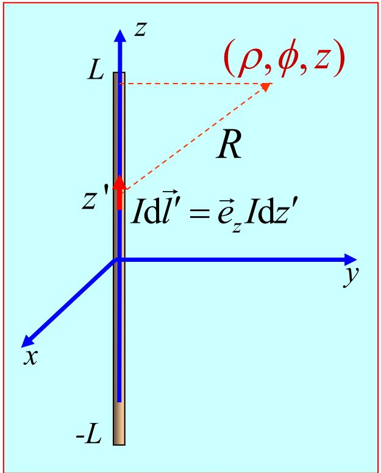
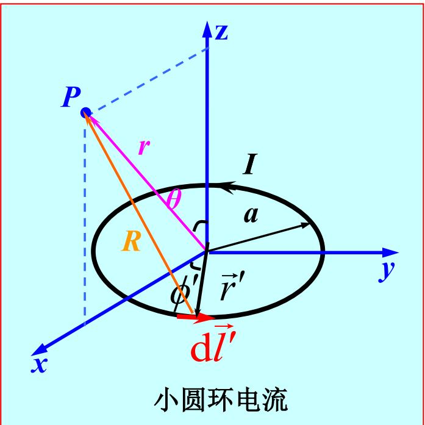
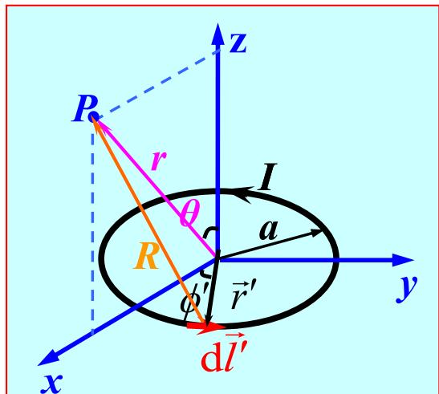
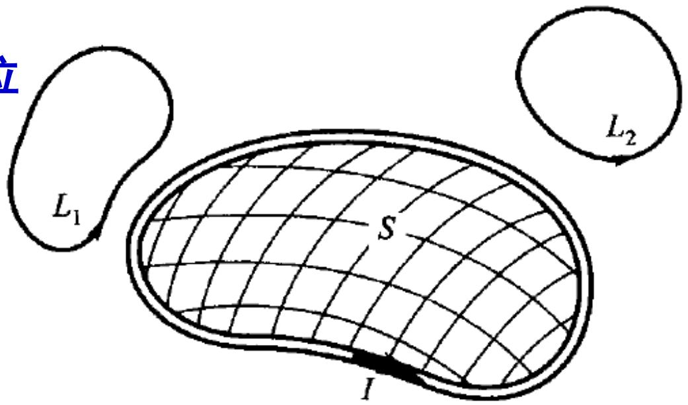
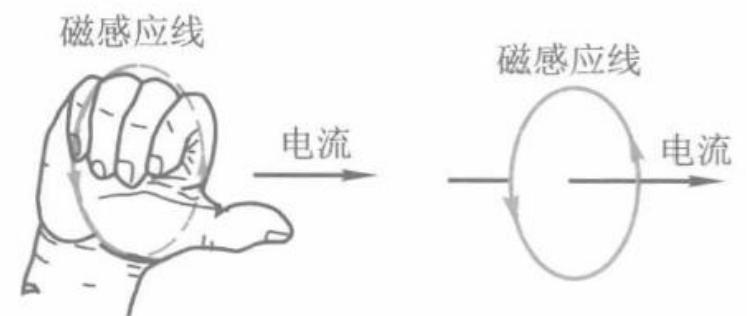
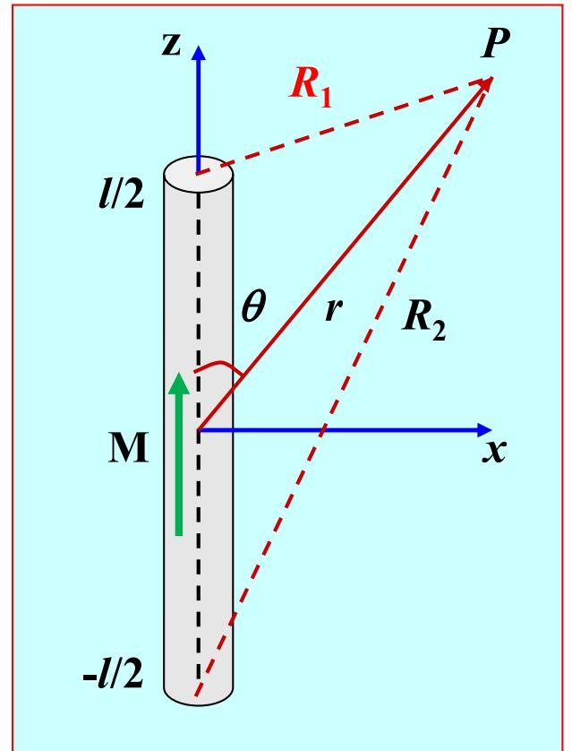

# 3.3.2 恒定磁场的矢量磁位和标量磁位（预习笔记）

> ==💡 章节导读与知识脉络：==
> 直接用 $\vec{B}$ 和 $\vec{H}$ 求解边值问题有时比较困难，引入**位函数**可以将矢量问题转化为标量或更结构化的问题。本节有两种位函数：
> - **矢量磁位** $\vec{A}$（全空间适用）：由 $\nabla\cdot\vec{B}=0$ 引入，$\vec{B}=\nabla\times\vec{A}$；类比电场中由 $\nabla\times\vec{E}=0$ 引入 $\vec{E}=-\nabla\varphi$；
> - **标量磁位** $\varphi_m$（仅在 $\vec{J}=0$ 的无源区适用）：由 $\nabla\times\vec{H}=0$ 引入 $\vec{H}=-\nabla\varphi_m$，与静电位类比。
>
> 引入位函数的本质：将矢量方程化为矢量/标量泊松方程，更易求解。

---

### 一、 矢量磁位 $\vec{A}$

#### 1. 定义

由 $\nabla\cdot\vec{B}=0$（散度为零的矢量场一定可以写成某矢量的旋度），引入矢量磁位 $\vec{A}$，满足：

$$
\vec{B} = \nabla \times \vec{A}
$$

*(物理意义：$\vec{A}$ 的旋度给出磁感应强度。注意 $\vec{A}$ 的方向与产生它的电流方向相同，因此积分式 $\mathrm{d}\vec{A} \propto \vec{J}\,\mathrm{d}V'/R$ 中电流方向即为 $\vec{A}$ 方向。)*

#### 2. 规范条件——库仑规范

$\vec{A}' = \vec{A} + \nabla\psi$ 也满足同一个 $\vec{B}$，因此 $\vec{A}$ 不唯一，需附加**库仑规范**：

$$
\nabla \cdot \vec{A} = 0
$$

#### 3. 矢量泊松方程

将 $\vec{B}=\nabla\times\vec{A}$ 代入 $\nabla\times\vec{H}=\vec{J}$，并利用库仑规范：

$$
\nabla\times(\nabla\times\vec{A}) = \mu\vec{J}
\;\Rightarrow\;
\nabla(\nabla\cdot\vec{A}) - \nabla^2\vec{A} = \mu\vec{J}
\;\Rightarrow\;
\boxed{\nabla^2\vec{A} = -\mu\vec{J}}
$$

*(矢量泊松方程，与静电位泊松方程 $\nabla^2\varphi=-\rho/\varepsilon$ 完全类比。无源区退化为 $\nabla^2\vec{A}=0$。)*

#### 4. 积分解

$$
\vec{A}(\vec{r}) = \frac{\mu}{4\pi}\int_V \frac{\vec{J}(\vec{r}')}{R}\,\mathrm{d}V'
\qquad
\text{（面电流）}\;\vec{A} = \frac{\mu}{4\pi}\int_S\frac{\vec{J}_S}{R}\,\mathrm{d}S'
\qquad
\text{（线电流）}\;\vec{A} = \frac{\mu I}{4\pi}\oint_C\frac{\mathrm{d}\vec{l}'}{R}
$$

#### 5. 磁通量与 $\vec{A}$ 的关系

$$
\varPhi = \int_S \vec{B}\cdot\mathrm{d}\vec{S} = \int_S \nabla\times\vec{A}\cdot\mathrm{d}\vec{S} = \oint_C \vec{A}\cdot\mathrm{d}\vec{l}
$$

*(磁通量等于矢量磁位沿回路的线积分，有时计算磁通比直接积分 $\vec{B}$ 更方便。)*

#### 6. $\vec{A}$ 的边界条件

由 $B_{1n}=B_{2n}$ 和切向 $A$ 连续性（利用极薄矩形回路令 $\Delta h\to0$ 推导）：

$$
\vec{A}_1 = \vec{A}_2 \quad \text{（矢量磁位在界面处切向和法向均连续）}
$$

---

### 二、 典型例题：矢量磁位的计算

#### 例 1：无限长线电流的矢量磁位

**问题**：电流 $I$ 沿 $+z$ 方向流动于无限长直导线，求磁矢位 $\vec{A}(\vec{r})$。

**解**：先对长度 $2L$ 的线段积分，电流元 $I\,\mathrm{d}\vec{l}' = \vec{e}_z I\,\mathrm{d}z'$，到场点 $P(\rho,\phi,z)$ 的距离 $R=\sqrt{\rho^2+(z-z')^2}$：

$$
\vec{A} = \vec{e}_z\frac{\mu_0 I}{4\pi}\int_{-L}^{L}\frac{1}{\sqrt{\rho^2+(z-z')^2}}\mathrm{d}z'
= \vec{e}_z\frac{\mu_0 I}{4\pi}\ln\frac{\sqrt{\rho^2+(z-L)^2}-(z-L)}{\sqrt{\rho^2+(z+L)^2}-(z+L)}
$$

令 $L\to\infty$（令 $\rho_0$ 为参考距离），取相对磁矢位：

$$
\boxed{\vec{A}(\vec{r}) = \vec{e}_z\frac{\mu_0 I}{2\pi}\ln\frac{\rho_0}{\rho}}
$$

**验证**：由 $\vec{B}=\nabla\times\vec{A}$，圆柱坐标中对 $\vec{e}_z A_z$ 取旋度：

$$
\vec{B} = \nabla\times\vec{A} = -\vec{e}_\phi\frac{\partial A_z}{\partial\rho} = \vec{e}_\phi\frac{\mu_0 I}{2\pi\rho}
$$

与安培定律结果完全一致。

*(注意：无限长线电流的磁矢位在 $\rho\to\infty$ 时对数发散，类似于无限长线电荷的电位；实际中取有限参考距离 $\rho_0$ 即可解决。)*

---

#### 例 2：小圆环电流（磁偶极子）的远区场

**问题**：半径为 $a$、电流为 $I$ 的小圆形回路，求远区（$r\gg a$）的矢量磁位与磁场。

**解**：因轴对称性，在 $\phi=0$ 的 $xz$ 平面上计算不失一般性。

利用细线电流积分式，远区近似（$r\gg a$，展开 $1/|\vec{r}-\vec{r}'|$）：

$$
\frac{1}{|\vec{r}-\vec{r}'|} \approx \frac{1}{r}\left(1+\frac{a}{r}\sin\theta\cos\phi'\right)
$$

积分后（$y$ 方向分量积分非零，而在 $\phi=0$ 面上 $\vec{e}_y=\vec{e}_\phi$）：

$$
\vec{A}(\vec{r}) = \vec{e}_\phi\frac{\mu_0 I\pi a^2}{4\pi r^2}\sin\theta = \vec{e}_\phi\frac{\mu_0 IS}{4\pi r^2}\sin\theta
$$

其中 $S=\pi a^2$ 是圆环面积。磁偶极矩定义为 $\vec{p}_m = I\vec{S} = IS\vec{e}_z$，则：

$$
\boxed{\vec{A}(\vec{r}) = \frac{\mu_0}{4\pi r^3}\vec{p}_m\times\vec{r} = \vec{e}_\phi\frac{\mu_0 p_m}{4\pi r^2}\sin\theta}
$$

对 $\vec{A}$ 取旋度得磁场：

$$
\boxed{\vec{B}(\vec{r}) = \frac{\mu_0 p_m}{4\pi r^3}(\vec{e}_r\,2\cos\theta + \vec{e}_\theta\sin\theta)}
$$

*(这与静电场中电偶极子的电场公式形式完全相同，体现了磁偶极子与电偶极子的数学对偶性。载流小圆环是最基本的磁偶极子模型。)*

---

### 三、 标量磁位 $\varphi_m$

#### 1. 适用条件

在**无传导电流**的区域（$\vec{J}=0$），安培定律变为 $\nabla\times\vec{H}=0$，$\vec{H}$ 是无旋场，可引入标量磁位：

$$
\vec{H} = -\nabla\varphi_m
$$

> ==注意==：$\varphi_m$ 只能在 $\vec{J}=0$ 的单连通区域中使用。若回路链环着电流（如图所示，电流穿过回路所围曲面），则 $\oint_L \vec{H}\cdot\mathrm{d}\vec{l}\neq 0$，标量磁位会出现多值问题。

#### 2. 微分方程

引入磁化强度 $\vec{M}$ 后，$\vec{B}=\mu_0(\vec{H}+\vec{M})$，则 $\nabla\cdot\vec{B}=0$ 给出：

$$
\nabla\cdot\vec{H} = -\nabla\cdot\vec{M} = \frac{\rho_m}{\mu_0}
\quad\Rightarrow\quad
\nabla^2\varphi_m = -\frac{\rho_m}{\mu_0}
$$

其中 $\rho_m = -\mu_0\nabla\cdot\vec{M}$ 称为**等效磁荷体密度**。均匀线性媒质（$\vec{M}=0$ 或 $\vec{M}$ 均匀）时：

$$
\boxed{\nabla^2\varphi_m = 0}
$$

#### 3. 积分表达式

与静电位类比（$\varepsilon_0\to\mu_0$，$\rho\to\rho_m$）：

$$
\varphi_m(\vec{r}) = \frac{1}{4\pi\mu_0}\int_V\frac{\rho_m(\vec{r}')}{R}\,\mathrm{d}V'
$$

#### 4. 边界条件

$$
\varphi_{m1} = \varphi_{m2}, \qquad \mu_1\frac{\partial\varphi_{m1}}{\partial n} = \mu_2\frac{\partial\varphi_{m2}}{\partial n}
$$

---

### 四、 标量磁位与静电位的对比

| 项目 | 静电位 $\varphi$ | 标量磁位 $\varphi_m$ |
|------|-----------------|-------------------|
| 引入条件 | $\nabla\times\vec{E}=0$ | $\nabla\times\vec{H}=0$（$\vec{J}=0$） |
| 定义 | $\vec{E}=-\nabla\varphi$ | $\vec{H}=-\nabla\varphi_m$ |
| 微分方程 | $\nabla^2\varphi=-(\rho+\rho_P)/\varepsilon_0$ | $\nabla^2\varphi_m=-\rho_m/\mu_0$ |
| 等效"源" | 极化电荷 $\rho_P=-\nabla\cdot\vec{P}$ | 等效磁荷 $\rho_m=-\mu_0\nabla\cdot\vec{M}$ |
| 界面条件 | $\varepsilon_1\partial\varphi_1/\partial n=\varepsilon_2\partial\varphi_2/\partial n$ | $\mu_1\partial\varphi_{m1}/\partial n=\mu_2\partial\varphi_{m2}/\partial n$ |

---

### 五、 典型例题：圆柱永磁体的远区磁场

**问题**：半径 $a$、长度 $l$ 的圆柱永磁体，沿轴向均匀磁化 $\vec{M}=\vec{e}_z M_0$，求远区（$r\gg l$）的 $\vec{B}$。

**解**：$M_0$ 为常数，$\rho_m = -\mu_0\nabla\cdot\vec{M}=0$（内部无磁荷）。端面处的等效磁荷面密度：

$$
\rho_{m\perp} = \mu_0 M_0 \quad\text{（上端面）},\quad \rho_{m\perp} = -\mu_0 M_0 \quad\text{（下端面）}
$$

等效磁荷：$q_m = \mu_0\pi a^2 M_0$（上端面），$-q_m$（下端面）。

当 $r\gg l$ 时，两端面等效为磁偶极子 $\vec{p}_m = q_m\vec{l} = \vec{e}_z\pi a^2\mu_0 M_0 l$，类比静电偶极子：

$$
\varphi_m = \frac{1}{4\pi\mu_0}\frac{\vec{p}_m\cdot\vec{r}}{r^3}
\;\Rightarrow\;
\vec{B} = -\mu_0\nabla\varphi_m = \frac{\mu_0 p_m}{4\pi r^3}(\vec{e}_r\,2\cos\theta+\vec{e}_\theta\sin\theta)
$$

*(均匀磁化永磁体在远区等效为磁偶极子，其场的形式与小圆环电流的磁场（例 2）完全相同，体现了电流磁偶极子与磁荷磁偶极子的等效性。)*

---

> ==总结：==
> - **矢量磁位** $\vec{B}=\nabla\times\vec{A}$，库仑规范下满足 $\nabla^2\vec{A}=-\mu\vec{J}$，适用于全空间；积分解 $\vec{A}(\vec{r})=\frac{\mu}{4\pi}\int\frac{\vec{J}}{R}\,\mathrm{d}V'$；边界条件 $\vec{A}_1=\vec{A}_2$；
> - **标量磁位** $\vec{H}=-\nabla\varphi_m$，仅在 $\vec{J}=0$ 的无源区有效，满足 $\nabla^2\varphi_m=0$；
> - 两种位函数都将场方程化为泊松/拉普拉斯方程，是 3.4–3.6 节边值问题求解的基础。
