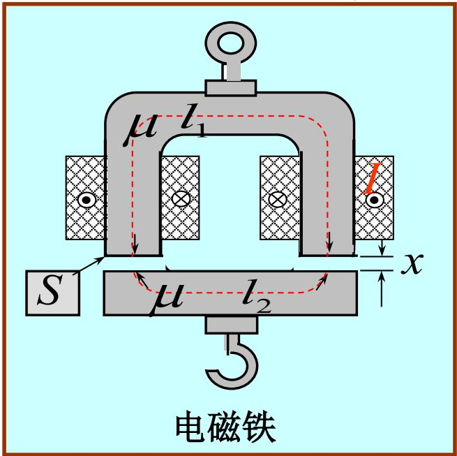
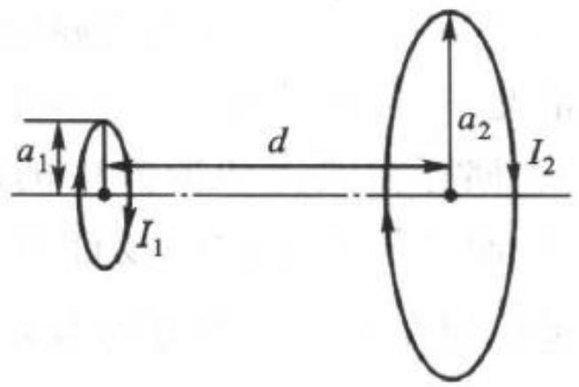

# 3.3.5 磁场力

## 1. 恒定磁场力的基本原理

在电磁场理论中，磁场力指恒定磁场中载流导体或磁介质所受到的力作用。磁场的能量分布随物体发生位移时改变，据此可由能量转化关系计算宏观磁场力与转矩。

### 洛伦兹力的宏观表现（安培力）
对于体积 $V$ 内流动电流密度为 $\vec{J} (\vec{r})$ ，处于外部磁感应强度为 $\vec{B}(\vec{r})$ 的磁场中，电流受到宏观安培力的作用。微元体 $dV$ 内的载流子受总力 $\vec{F}$ 表达式为：

$$
\vec{F} = \int_V \vec{J} \times \vec{B} \, \mathrm{d}V
$$

如果导线为通有电流 $I$ 的细导线 $C$，那么在磁感应线上受力微元积分为安培力矢量形式：

$$
\vec{F} = \oint_C I \, \mathrm{d}\vec{l} \times \vec{B}
$$

### 由能量变化求作用力的方法（虚位移法）
==key point==：对于恒定电流建立的磁场，力或转矩可以假定载流线圈或者磁介质发生无限小的几何位移 $\mathrm{d}\vec{r}$ 或者角位移 $\mathrm{d}\alpha$ 来求得其对磁能的影响。这种方法叫做虚位移法或原理。

考虑两种典型的理想物理过程情形：
==第一种过程：电流维持不变 $I = \text{const.}$==
当位移 $\mathrm{d}\vec{r}$ 发生时，由于电源为了保持总电流恒定而补充做功，增量的变化与磁场力做的功直接关联。
虚功由公式推导出沿某标量坐标 $x$ 方向的作用力 $F_x$：

$$
F_x = \Big( \frac{\partial W_m}{\partial x} \Big)_{I = \text{const.}}
$$

同理，若系统绕某轴转过角 $\alpha$，转矩 $T$：

$$
T_\alpha = \Big( \frac{\partial W_m}{\partial \alpha} \Big)_{I = \text{const.}}
$$

==第二种过程：磁链维持不变 $\Psi = \text{const.}$==
如果闭合系统是超导或断开电源后通量不守恒等维持通量，系统中不消耗外部电源能量。
内部系统的磁场能量改变即提供外力机械功：

$$
F_x = - \Big( \frac{\partial W_m}{\partial x} \Big)_{\Psi = \text{const.}}
$$

## 2. 宏观磁场力及边界在界面的效应
对于线性磁介质内的受力分析同样满足以上虚位移推论。不同磁介质接触的边界因为磁导率 $\mu$ 不同，内部结构因为极化或磁化同样受到不均匀的法向与切向的宏观压力分布，引起磁场力的作用现象。 

==key point==：这种宏观压力效应实质是由磁场边界条件由于两种媒质 $H_{1t}$、$B_{1n}$、$H_{2t}$、$B_{2n}$ 突变引起的界面的单位面积力作用。它可根据麦克斯韦应力张量求得界面法向压强差。

