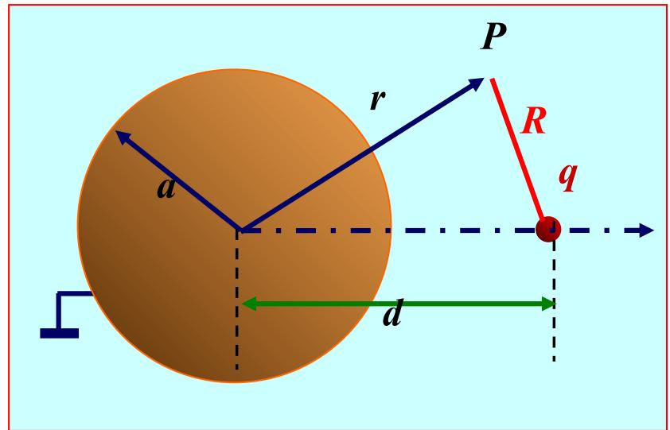
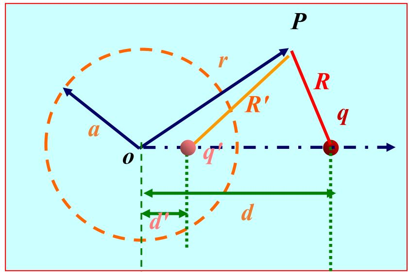

# 3.5.2 导体圆柱面的镜像

线电荷对接地导体圆柱面的镜像问题：如图 1 所示，一根电荷线密度为 $\rho _ { l }$ 的无限长线电荷位于半径为 $\pmb { a }$ 的无限长接地导体圆柱面外，与圆柱的轴线平行且到轴线的距离为d。

特点：在导体圆柱面上有感应电荷，圆轴外的电位由线电荷与感应电荷共同产生。 

分析方法：镜像电荷是圆柱面内部与轴线平行的无限长线电荷，如图2所示。

图1 线电荷与导体圆柱

图2 线电荷与导体圆柱的镜像

# 3.5.2 导体圆柱面的镜像

方程 $\nabla ^ { 2 } \varphi = - \frac { \rho _ { l } } { \varepsilon } \delta \big ( \rho - d , \phi \big ) ,$ 

边界条件 $\varphi \mid _ { \rho = a } = 0$ 

图1 线电荷与导体圆柱

图2 线电荷与导体圆柱的镜像

例 求长度为2L、电荷线密度为 $\rho _ { l 0 }$ 的均匀带电线的电位。

解 采用圆柱面坐标系，令线电荷与 z 轴相重合，中点位于坐标原点。由于轴对称性，电位与 $\phi$ 无关。

在带电线上位于 $z ^ { \prime }$ 处的线元 $\mathrm { d } l ^ { \prime } = \mathrm { d } z ^ { \prime }$ ，它到点 $P ( \rho , \phi , z )$ 的距离 $R = \sqrt { \rho ^ { 2 } + ( z - z ^ { \prime } ) ^ { 2 } }$ 

则

$$
\begin{array}{l} \varphi (\vec {r} ^ {\prime}) = \frac {\rho_ {l 0}}{4 \pi \varepsilon_ {0}} \int_ {- L} ^ {L} \frac {1}{\sqrt {\rho^ {2} + (z - z ^ {\prime}) ^ {2}}} \mathrm {d} z ^ {\prime} \\ = \frac {\rho_ {l 0}}{4 \pi \varepsilon_ {0}} \ln [ z ^ {\prime} - z + \sqrt {\rho^ {2} + (z - z ^ {\prime}) ^ {2}} ] \Bigg | _ {- L} ^ {L} \\ = \frac {\rho_ {l 0}}{4 \pi \varepsilon_ {0}} \ln \frac {\sqrt {\rho^ {2} + (z - L) ^ {2}} - (z - L)}{\sqrt {\rho^ {2} + (z + L) ^ {2}} - (z + L)} \\ \end{array}
$$

在上式中若令 ，则可得到无限长直线电荷的电位。当L>>R 时，上式可写为

$$
\varphi (\vec {r}) \approx \frac {\rho_ {l 0}}{4 \pi \varepsilon_ {0}} \ln \frac {\sqrt {\rho^ {2} + L ^ {2}} + L}{\sqrt {\rho^ {2} + L ^ {2}} - L} = \frac {\rho_ {l 0}}{4 \pi \varepsilon_ {0}} \ln \frac {2 L}{\rho^ {2} / 2 L} \approx \frac {\rho_ {l 0}}{2 \pi \varepsilon_ {0}} \ln \frac {2 L}{\rho}
$$

当 $L \to \infty$ 时，上式变为无穷大，这是因为电荷不是分布在有限区域内，而将电位参考点选在无穷远点之故。这时可在上式中加上一个任意常数，则有 $\varphi ( \vec { r } ) = \frac { \rho _ { l 0 } } { 2 \pi \varepsilon _ { 0 } } \ln \frac { 2 L } { \rho } + C$ P

并选择有限远处为电位参考点。例如，选择ρ= a的点为电位参考点，则有$C = - \frac { \rho _ { l 0 } } { 2 \pi \varepsilon _ { 0 } } \ln \frac { 2 L } { a } \qquad \varphi ( \vec { r } ) = \frac { \rho _ { l 0 } } { 2 \pi \varepsilon _ { 0 } } \ln \frac { a } { \rho }$ 2πε。

设镜像电荷的线密度为 $\rho _ { l } ^ { \prime }$ ， 且距圆柱的轴线为 $d ^ { \prime }$ ，则由 $\rho _ { l }$ 和 $\rho _ { l } ^ { \prime }$ 共同产生的电位函数

$$
\varphi = \frac {\rho_ {l}}{2 \pi \varepsilon} \ln \frac {1}{\sqrt {\rho^ {2} + d ^ {2} - 2 \rho d \cos \phi}} + \frac {\rho_ {l} ^ {\prime}}{2 \pi \varepsilon} \ln \frac {1}{\sqrt {\rho^ {2} + d ^ {\prime 2} - 2 \rho d ^ {\prime} \cos \phi}} + C
$$

由于导体圆柱接地，所以当 $\rho = a$ 时，电位应为零，即

$$
\frac {\rho_ {l}}{2 \pi \varepsilon} \ln \frac {1}{a \sqrt {a ^ {2} + d ^ {2} - 2 a d \cos \phi}} + \frac {\rho_ {l} ^ {\prime}}{2 \pi \varepsilon} \ln \frac {1}{\sqrt {a ^ {2} + d ^ {\prime 2} - 2 a d ^ {\prime} \cos \phi}} + C = 0
$$

$$
\frac {\rho_ {l}}{2 \pi \varepsilon} \ln \frac {1}{a \sqrt {a ^ {2} + d ^ {2} - 2 a d \cos \phi}} + \frac {\rho_ {l} ^ {\prime}}{2 \pi \varepsilon} \ln \frac {1}{\sqrt {a ^ {2} + d ^ {\prime 2} - 2 a d ^ {\prime} \cos \phi}} + C = 0
$$

由于上式对任意的都成立，因此，将上式对φ求导，可以得到

$$
\rho_ {l} d \left(a ^ {2} + d ^ {2}\right) + \rho_ {l} ^ {\prime} d ^ {\prime} \left(a ^ {2} + d ^ {\prime 2}\right) - 2 a d d ^ {\prime} \left(\rho_ {l} + \rho_ {l} ^ {\prime}\right) \cos \phi = 0
$$

所以有 $ \begin{array} { l } { { \rho _ { l } d ( a ^ { 2 } + d ^ { 2 } ) + \rho _ { l } ^ { \prime } d ^ { \prime } ( a ^ { 2 } + d ^ { \prime } { } ^ { 2 } ) = 0 } } \\ { { \rho _ { l } + \rho _ { l } ^ { \prime } = 0 } } \end{array} \} \overset { \rho _ { l } ^ { \prime } = - } { \underset { d ^ { \prime } = \frac { d } { \delta } } { \longrightarrow } } \{ \begin{array} { l l } { { \rho _ { l } ^ { \prime } = - { } \rho _ { l } ^ { \prime } d ^ { \prime } ( a ^ { 2 } + d ^ { \prime } { } ^ { 2 } ) = 0 } } & { { \quad - \{ \begin{array} { l l } { { \rho _ { l } ^ { \prime } = - \rho _ { l } ^ { \prime } d ^ { \prime } ( a ^ { 2 } + d ^ { \prime } { } ^ { 2 } ) = 0 } } & { { \quad - \{ \begin{array} { l l } { { \rho _ { l } ^ { \prime } = - \rho _ { l } ^ { \prime } d ^ { \prime } } } \\ { { d ^ { \prime } = { } \frac { d ^ { \prime } } { d ^ { \prime } } } } } & { { { \quad - \{ \begin{array} { l l } { { d ^ { \prime } } } \end{array} } \} } } \end{array} } } }   \end{array}  \end{array}$ l −d  = ad

导体圆柱面外的电位函数 =PnVd²p²+a²-2pda²cos +C2π d√p²+d²-2pd cosΦ

由 $\rho = a$ 时， ln 2π8 a

故 =Pn√p²+-2pda²cos $\varphi = \frac { \rho _ { l } } { 2 \pi \varepsilon } \mathrm { l n } \frac { \sqrt { d ^ { 2 } \rho ^ { 2 } + a ^ { 4 } - 2 \rho d a ^ { 2 } \cos \phi } } { \sqrt { a ^ { 2 } \rho ^ { 2 } + a ^ { 2 } d ^ { 2 } - 2 \rho d a ^ { 2 } \cos \phi } }$ 

导体圆柱面上的感应电荷面密度为

$$
\rho_ {S} = - \varepsilon \frac {\partial \varphi}{\partial \rho} \bigg | _ {\rho = a} = - \frac {\rho_ {l} (d ^ {2} - a ^ {2})}{2 \pi a (a ^ {2} + d ^ {2} - 2 a d \cos \phi)}
$$

导体圆柱面上单位长度的感应电荷为

高数（第七版）上册381页（105式）

$$
\rho_ {i n} = \int_ {S} \rho_ {S} \mathrm {d} S = - \frac {\rho_ {l} (d ^ {2} - a ^ {2})}{2 \pi a} \int_ {0} ^ {2 \pi} \frac {a \mathrm {d} \phi}{a ^ {2} + d ^ {2} - 2 a d \cos \phi} = - \rho_ {l}
$$

导体圆柱面上单位长度的感应电荷与所设置的镜像电荷相等。

# 两平行圆柱导体的电轴

问题：如图1所示， 两平行导体圆柱的半径均为 $\pmb { a }$ ，两导体轴线间距为 $2 h$ ，单位长度分别带电荷 $\rho _ { l }$ 和 $- \rho _ { l }$ o

特点：由于两圆柱带电导体的电场互相影响，使导体表面的电荷分布不均匀，相对的一侧电荷密度大， 而相背的一侧电荷密度较小。

分析方法：将导体表面上的电荷用线密度分别为 $\pm \rho _ { l }$ 、 且相距为2b 的两根无限长带电细线来等效替代， 如图 2所示。

图1 两平行圆柱导体

图2 两平行圆柱导体的电轴

# 利用线电荷与接地导体圆柱面的镜像确定

由 $d ^ { \prime } = \frac { a ^ { 2 } } { d } \Longrightarrow \ ( h - b ) ( h + b ) = a ^ { 2 }$ 

$$
\Longrightarrow b = \sqrt {h ^ {2} - a ^ {2}}
$$

图2 两平行圆柱导体的电轴

通常将带电细线的所在的位置称为圆柱导体的电轴，因而这种方法又称为电轴法。

思考：能否用电轴法求解半径不同的两平行圆柱导体问题？

例3.5.3一根与地面平行架设的圆柱导体,半径为 $a$ ,悬挂高度为 $h$ ，如图3.5.16所示。（1）证明：单位长度上圆柱导线与地面间的电容为 $C _ { 0 } =$ ar(/a)；（2）若导线与地面间的电压为Un，证明：地面对单位长度导线的 $\frac { 2 \pi \varepsilon _ { 0 } } { \operatorname { a r c c o s h } ( h / a ) }$ $U _ { \mathfrak { d } }$ 

作用力 $F _ { 0 } = \frac { \pi \epsilon _ { 0 } U _ { 0 } ^ { 2 } } { [ \operatorname { a r c c o s h } ( h / a ) ] ^ { 2 } ( h ^ { 2 } - a ^ { 2 } ) ^ { 1 / 2 } } \circ$ 

图3.5.16平行于地面的

圆柱导线

图3.5.17平行于地面的圆

柱导线的镜像

$$
\begin{array}{l} \varphi_ {0} = \frac {q _ {l}}{2 \pi \varepsilon_ {0}} \ln \frac {1}{a - (h - b)} - \frac {q _ {l}}{2 \pi \varepsilon_ {0}} \ln \frac {1}{b + (h - a)} \\ = \frac {q _ {l}}{2 \pi \varepsilon_ {0}} \ln \frac {\sqrt {h ^ {2} - a ^ {2}} + (h - a)}{\sqrt {h ^ {2} - a ^ {2}} - (h - a)} \\ = \frac {q _ {l}}{2 \pi \varepsilon_ {0}} \ln \frac {\sqrt {h ^ {2} - a ^ {2}} + h}{a} = \frac {q _ {l}}{2 \pi \varepsilon_ {0}} \ln \left[ \sqrt {\left(\frac {h}{a}\right) ^ {2} - 1} + \frac {h}{a} \right] \\ \end{array}
$$

因 $x > 1$ 时,有 $\ln ( { \sqrt { x ^ { 2 } - 1 } } + x ) = \operatorname { a r c c o s h } ( x )$ ,故上式可改写为

$$
\varphi_ {0} = \frac {q _ {l}}{2 \pi \varepsilon_ {0}} \operatorname {a r c c o s h} \left(\frac {h}{a}\right)
$$

$$
C _ {0} = \frac {q _ {l}}{\varphi_ {0}} = \frac {2 \pi \varepsilon_ {0}}{\operatorname {a r c c o s h} (h / a)}
$$

（2）导线单位长度上的电场能量为

$$
W _ {\mathrm {e}} = \frac {1}{2} C _ {0} U _ {0} ^ {2} = \frac {\pi \varepsilon_ {0} U _ {0} ^ {2}}{\operatorname {a r c c o s h} (h / a)}
$$

利用虚位移法，可得地面对导线单位长度的作用力为

$$
\begin{array}{l} F _ {0} = \left. \frac {\partial W _ {\mathrm {e}}}{\partial h} \right| _ {U _ {0} \text {不 变}} = \frac {\partial}{\partial h} \left[ \frac {\pi \varepsilon_ {0} U _ {0} ^ {2}}{\operatorname {a r c c o s h} (h / a)} \right] \\ = \frac {\pi \varepsilon_ {0} U _ {0} ^ {2}}{\left[ \operatorname {a r c c o s h} (h / a) \right] ^ {2} \left(h ^ {2} - a ^ {2}\right) ^ {1 / 2}} \\ \end{array}
$$

# 点电荷与无限大电介质平面的镜像

问题：如图 1 所示，介电常数分别为 $\varepsilon _ { 1 }$ 和 $\varepsilon _ { 2 }$ 的两种不同电介质的分界面是无限大平面，在电介质 1 中有一个点电荷q，距分界平面为h 。

特点：在点电荷的电场作用下，电介质产生极化，在介质分界面上形成极化电荷分布。此时，空间中任一点的电场由点电荷与极化电荷共同产生。

分析方法：计算电介质 1 中的电位时，用位于介质 2 中的镜像电荷来代替分界面上的极化电荷，并把整个空间看作充满介电常数为 $\mathcal { E } _ { 1 }$ 的均匀介质，如图2所示。

图1 点电荷与电介质分界平面

图2 介质1的镜像电荷

$\frac { \partial } { \partial x } \frac { \partial } { \partial { \boldsymbol { \Sigma } } } : \nabla ^ { 2 } \varphi _ { 1 } = - \frac { \rho } { \varepsilon } \delta \big ( \boldsymbol { x } , \boldsymbol { y } , z - h \big ) , ( z \geq 0 )$ 

方程 $\nabla ^ { 2 } \varphi _ { 2 } = 0 , ( z \leq 0 )$ 

边界条件 lx²+y²+2²→ $\varphi { \frac { \scriptstyle } { 1 { \boldsymbol { x } } ^ { 2 } + y ^ { 2 } + z ^ { 2 } \to \infty } } = 0$ 

$$
\varphi_ {1} \big | _ {z = 0} = \varphi_ {2} \big | _ {z = 0}
$$

$$
\left. \varepsilon_ {1} \frac {\partial \varphi_ {1}}{\partial z} \right| _ {z = 0} = \left. \varepsilon_ {2} \frac {\partial \varphi_ {2}}{\partial z} \right| _ {z = 0}
$$

图1 点电荷与电介质分界平面

# 介质1中的电位为

$$
\varphi_ {1} (x, y, z) = \frac {1}{4 \pi \varepsilon_ {1}} \left[ \frac {q}{\sqrt {x ^ {2} + y ^ {2} + (z - h) ^ {2}}} + \frac {q ^ {\prime}}{\sqrt {x ^ {2} + y ^ {2} + (z + h) ^ {2}}} \right] \qquad (z \geq 0)
$$

计算电介质 2 中的电位时，用位于介质 1 中的镜像电荷来代替分界面上的极化电荷，并把整个空间看作充满介电常数为 $ { \varepsilon } _ { 2 }$ 的均匀介质，如图 3所示。介质2中的电位为

图3 介质2的镜像电荷

$$
\varphi_ {2} (x, y, z) = \frac {1}{4 \pi \varepsilon_ {2}} \frac {q + q ^ {\prime \prime}}{\sqrt {x ^ {2} + y ^ {2} + (z - h) ^ {2}}} \quad (z \leq 0)
$$

利用电位满足的边界条件

$$
\left. \varphi_ {1} \right| _ {z = 0} = \left. \varphi_ {2} \right| _ {z = 0} \qquad \left. \varepsilon_ {1} \frac {\partial \varphi_ {1}}{\partial z} \right| _ {z = 0} = \left. \varepsilon_ {2} \frac {\partial \varphi_ {2}}{\partial z} \right| _ {z = 0}
$$

${ \left\{ \begin{array} { l l } { { \cfrac { 1 } { \varepsilon _ { 1 } } } ( q + q ^ { \prime } ) = { \cfrac { 1 } { \varepsilon _ { 2 } } } ( q + q ^ { \prime \prime } ) } \\ { q - q ^ { \prime } = q + q ^ { \prime \prime } } \end{array} \right. } \Longrightarrow { \left\{ \begin{array} { l l l } { q ^ { \prime } = { \cfrac { \varepsilon _ { 1 } - \varepsilon _ { 2 } } { \varepsilon _ { 1 } + \varepsilon _ { 2 } } } q } \\ { q ^ { \prime \prime } = - { \cfrac { \varepsilon _ { 1 } - \varepsilon } { \varepsilon _ { 1 } + \varepsilon } } q } \end{array} \right. }$ a可得到 ε2

说明：对位于无限大平表面介质分界面附近、且平行于分界面的无限长线电荷（单位长度带），其镜像电荷为

$$
\rho_ {l} ^ {\prime} = \frac {\varepsilon_ {1} - \varepsilon_ {2}}{\varepsilon_ {1} + \varepsilon_ {2}} \rho_ {l}, \rho_ {l} ^ {\prime \prime} = - \frac {\varepsilon_ {1} - \varepsilon_ {2}}{\varepsilon_ {1} + \varepsilon_ {2}} \rho_ {l}
$$

# 线电流与无限大磁介质平面的镜像

问题：如图1所示，磁导率分别为 $\mu _ { 1 }$ 和 $\mu _ { 2 }$ 的两种均匀磁介质的分界面是无限大平面，在磁介质1中有一根无限长直线电流平行于分界平面，且与分界平面相距为h。

特点：在直线电流I 产生的磁场作用下，磁介质被磁化，在分界面上有磁化电流分布，空间中的磁场由线电流和磁化电流共同产生。

分析方法：在计算磁介质1中的磁场时，用置于介质2中的镜像线电流来代替分界面上的磁化电流，并把整个空间看作充满磁导率为 $\mu _ { 1 }$ 的均匀介质，如图2所示。

图1 线电流与磁介质分界平面

图2 磁介质1的镜像线电流

在计算磁介质2中的磁场时， 用置于介质1中的镜像线电流来代替分界面上的磁化电流，并把整个空间看作充满磁导率为 $\mu _ { 2 }$ 的均匀介质，如图3所示。

因为电流沿y轴方向流动，所以矢量磁位只有y分量，则磁介质1和磁介质2中任一点的矢量磁位分别为

图3 磁介质2的镜像线电流

$$
\begin{array}{l} A _ {1} = \frac {\mu_ {1} I}{2 \pi} \ln \frac {1}{\sqrt {x ^ {2} + (z - h) ^ {2}}} + \frac {\mu_ {1} I ^ {\prime}}{2 \pi} \ln \frac {1}{\sqrt {x ^ {2} + (z + h) ^ {2}}} (z \geq 0) \\ A _ {2} = \frac {\mu_ {2} (I + I ^ {\prime \prime})}{2 \pi} \ln \frac {1}{\sqrt {x ^ {2} + (z - h) ^ {2}}} \quad (z \leq 0) \\ \end{array}
$$

# 利用矢量磁位满足的边界条件

$$
\left. A _ {1} \right| _ {z = 0} = \left. A _ {2} \right| _ {z = 0}, \left. \frac {1}{\mu_ {1}} \frac {\partial A _ {1}}{\partial z} \right| _ {z = 0} = \left. \frac {1}{\mu_ {2}} \frac {\partial A _ {2}}{\partial z} \right| _ {z = 0}
$$

1 2( ) ( )I I I I + = +  $\left\{ { \begin{array} { l } { { \boldsymbol { I } } ^ { \prime } = { \frac { \mu _ { 2 } - \mu _ { 1 } } { \mu _ { 2 } + \mu _ { 1 } } } { \boldsymbol { I } } } \\ { { \boldsymbol { I } } ^ { \prime \prime } = - { \frac { \mu _ { 2 } - \mu _ { 1 } } { \mu _ { 2 } + \mu _ { 1 } } } { \boldsymbol { I } } } \end{array} } \right.$ 可得到I I I I − = + 

故 A $\mathsf { \Pi } _ { 1 } = \frac { \mu _ { 1 } I } { 2 \pi } \ln \frac { 1 } { \sqrt { x ^ { 2 } + \left( z - h \right) ^ { 2 } } } + \frac { \mu _ { 1 } ( \mu _ { 2 } - \mu _ { 1 } ) I } { 2 \pi ( \mu _ { 2 } + \mu _ { 1 } ) } \ln \frac { 1 } { \sqrt { x ^ { 2 } + \left( z + h \right) ^ { 2 } } }$ n (z≥0)

$$
A _ {2} = \frac {\mu_ {1} \mu_ {2} I}{\pi \left(\mu_ {2} + \mu_ {1}\right)} \ln \frac {1}{\sqrt {x ^ {2} + (z - h) ^ {2}}} \quad (z \leq 0)
$$

相应的磁场可由 $\overrightarrow { B } = \nabla \times \overrightarrow { A }$ 求得。

例3.5.4空气中有一根通有电流I的直导线平行于铁板平面,与铁表面距离为 $h$ ,如图3.5.24所示。求空气中任意一点的磁场。

图3.5.24直线电流与铁板平面

3.5.25直线电流对无限大铁板平面的镜像

# 利用例3.3.2得出的一根无限长直线电流的矢量磁位计算公式

$$
\boldsymbol {A} = e _ {z} \frac {\mu_ {0} I}{2 \pi} \ln \left(\frac {\rho_ {0}}{\rho}\right)
$$

得到任意一点 $P ( x , y )$ 的矢量磁位为

$$
\boldsymbol {A} = e _ {z} \frac {\mu_ {0} I}{2 \pi} \ln \left(\frac {\rho_ {0}}{\rho_ {1}}\right) + e _ {z} \frac {\mu_ {0} I}{2 \pi} \ln \left(\frac {\rho_ {0}}{\rho_ {2}}\right) = e _ {z} \frac {\mu_ {0} I}{2 \pi} \ln \frac {\rho_ {0} ^ {2}}{\rho_ {1} \rho_ {2}}
$$

式中

$$
\rho_ {1} = \left[ x ^ {2} + (y - h) ^ {2} \right] ^ {1 / 2}, \quad \rho_ {2} = \left[ x ^ {2} + (y + h) ^ {2} \right] ^ {1 / 2}
$$

因此，点 $P ( x , y )$ 的磁感应强度为

$$
\begin{array}{l} \boldsymbol {B} = \boldsymbol {\nabla} \times \boldsymbol {A} = e _ {x} \frac {\partial A _ {z}}{\partial y} - e _ {y} \frac {\partial A _ {z}}{\partial x} \\ \mu_ {0} I \begin{array}{l} = - e _ {x} \frac {\mu I _ {0}}{2 \pi} \left[ \frac {y + h}{x ^ {2} + (y + h) ^ {2}} + \frac {y - h}{x ^ {2} + (y - h) ^ {2}} \right] + \\ e _ {y} \frac {\mu I _ {0}}{2 \pi} \left[ \frac {x}{x ^ {2} + (y + h) ^ {2}} + \frac {x}{x ^ {2} + (y - h) ^ {2}} \right] \end{array} \\ \end{array}
$$

+ 分离变量法是求解边值问题的一种经典方法

分离变量法解题的基本思路：

将偏微分方程中含有n个自变量的待求函数表示成n个各自只含一个变量的函数的乘积，把偏微分方程分解成n个常微分方程，求出各常微分方程的通解后，把它们线性叠加起来，得到级数形式解，并利用给定的边界条件确定待定常数。

中 分离变量法的理论依据是惟一性定理

