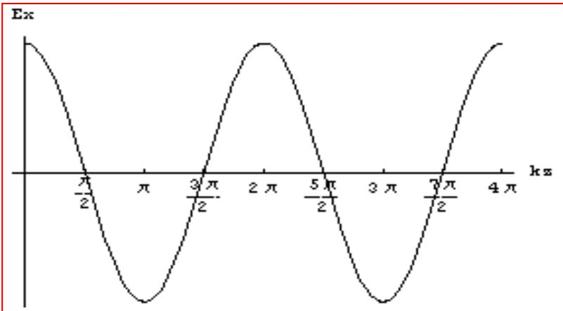
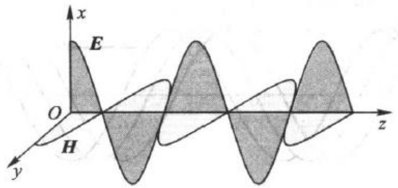

# 6.1.1 理想介质中的均匀平面波函数（预习笔记）

> [!tip] 章节导读与知识脉络
> ==与前置章节的关联：==
> [[5.2.1_无源区的波动方程|无源区的波动方程]] 已经说明，在无源、均匀、无损媒质中，电场和磁场都满足波动方程。[[5.4.4_时谐场的亥姆霍兹方程|时谐场的亥姆霍兹方程]] 又把时域波动方程改写成只含空间变量的形式。现在第 6 章把这个一般方程用于最简单、最基本的一类波：==均匀平面波==。
>
> ==本节研究内容：==
> 本节要解决三个问题：第一，理想介质中的均匀平面波为什么只剩横向场量；第二，沿 $+z$ 和 $-z$ 方向传播的复矢量表达式分别是什么；第三，电场 $\vec{E}$、磁场 $\vec{H}$ 和传播方向之间满足怎样的方向关系与幅值关系。

---

## 一、==研究对象和基本假设==

本节讨论的空间是==无源区域==：

$$
\rho=0,\qquad \vec{J}=0
$$

同时，这个无源空间充满线性、各向同性、均匀的==理想介质==。理想介质中没有传导损耗，因此可以按无损时谐场处理。

由 [[5.4.4_时谐场的亥姆霍兹方程|亥姆霍兹方程]] 可知，时谐电磁场满足：

$$
\nabla^2\vec{E}+k^2\vec{E}=0,
\qquad
\nabla^2\vec{H}+k^2\vec{H}=0
$$

其中：

$$
k=\omega\sqrt{\mu\varepsilon}
$$

这里 $k$ 是理想介质中的波数，也可以称为相位常数。它描述相位随空间距离变化的快慢。

---

## 二、==均匀平面波沿 $z$ 轴传播时的简化==

若均匀平面波沿 $z$ 轴传播，则等相位面是垂直于 $z$ 轴的平面。教材用数学条件表示为：电场强度和磁场强度都不是 $x$、$y$ 的函数，即

$$
\frac{\partial\vec{E}}{\partial x}=\frac{\partial\vec{E}}{\partial y}=0,
\qquad
\frac{\partial\vec{H}}{\partial x}=\frac{\partial\vec{H}}{\partial y}=0
$$

因此三维的亥姆霍兹方程可以化成只关于 $z$ 的常微分方程：

$$
\frac{\mathrm{d}^2\vec{E}}{\mathrm{d}z^2}+k^2\vec{E}=0,
\qquad
\frac{\mathrm{d}^2\vec{H}}{\mathrm{d}z^2}+k^2\vec{H}=0
$$

这一步的意思是：波在横向平面上没有振幅、相位和方向变化，所有空间变化都只沿传播方向 $z$ 发生。

---

## 三、==为什么均匀平面波是 TEM 波==

无源理想介质中有：

$$
\nabla\cdot\vec{E}=0,
\qquad
\nabla\cdot\vec{H}=0
$$

对电场来说：

$$
\nabla\cdot\vec{E}
=\frac{\partial E_x}{\partial x}
+\frac{\partial E_y}{\partial y}
+\frac{\partial E_z}{\partial z}=0
$$

由于均匀平面波不随 $x$、$y$ 改变，所以

$$
\frac{\partial E_x}{\partial x}=0,
\qquad
\frac{\partial E_y}{\partial y}=0
$$

于是得到：

$$
\frac{\partial E_z}{\partial z}=0
\quad\Longrightarrow\quad
E_z=0
$$

同理：

$$
\nabla\cdot\vec{H}
=\frac{\partial H_x}{\partial x}
+\frac{\partial H_y}{\partial y}
+\frac{\partial H_z}{\partial z}=0
\quad\Longrightarrow\quad
H_z=0
$$

所以均匀平面波中：

$$
E_z=0,
\qquad
H_z=0
$$

> **结论：均匀平面波是横电磁波**
> 电场强度 $\vec{E}$ 和磁场强度 $\vec{H}$ 都垂直于波的传播方向。这样的波称为==横电磁波==，也称为 ==TEM 波==。

需要注意，这里的“横”不是说电场或磁场一定沿 $x$ 轴或 $y$ 轴，而是说它们都没有沿传播方向的分量。若波沿 $z$ 方向传播，$\vec{E}$ 和 $\vec{H}$ 都只能位于 $xOy$ 平面内。

---

## 四、==分量形式的波动方程==

由于 $E_z=0$、$H_z=0$，只需考虑四个横向分量：

$$
\frac{\mathrm{d}^2E_x}{\mathrm{d}z^2}+k^2E_x=0
$$

$$
\frac{\mathrm{d}^2E_y}{\mathrm{d}z^2}+k^2E_y=0
$$

$$
\frac{\mathrm{d}^2H_x}{\mathrm{d}z^2}+k^2H_x=0
$$

$$
\frac{\mathrm{d}^2H_y}{\mathrm{d}z^2}+k^2H_y=0
$$

如果先研究 $x$ 方向电场分量，就有：

$$
\frac{\mathrm{d}^2E_x(z)}{\mathrm{d}z^2}+k^2E_x(z)=0,
\qquad
k=\omega\sqrt{\mu\varepsilon}
$$

它的通解为：

$$
\boxed{E_x(z)=A_1e^{-jkz}+A_2e^{jkz}}
$$

这个式子不是单纯的数学形式。两个指数项分别代表两个相反方向传播的波。
---

## 五、==$A_1e^{-jkz}$ 表示沿 $+z$ 方向传播的波==

第一项写成：

$$
E_{1x}(z)=A_1e^{-jkz}=E_{1xm}e^{j\phi_{1x}}e^{-jkz}
$$

结合 [[5.4.1_时谐电磁场的复数表示|时谐电磁场的复数表示]]，瞬时值为：

$$
E_{1x}(z,t)
=\operatorname{Re}\left[E_{1xm}e^{j\phi_{1x}}e^{-jkz}e^{j\omega t}\right]
$$

即：

$$
\boxed{E_{1x}(z,t)=E_{1xm}\cos(\omega t-kz+\phi_{1x})}
$$

教材中的波形图如下：

对式子 $\omega t-kz+\phi_{1x}=C$ 而言，若时间 $t$ 增大，为了保持同一个相位 $C$，$z$ 必须增大。因此这个波沿 $+z$ 方向传播。

> **判断规则：**
> 在采用 $e^{j\omega t}$ 作公共时间因子时，空间因子 $e^{-jkz}$ 表示沿 $+z$ 方向传播；空间因子 $e^{jkz}$ 表示沿 $-z$ 方向传播。

---

## 六、==$A_2e^{jkz}$ 表示沿 $-z$ 方向传播的波==

第二项写成：

$$
E_{2x}(z)=A_2e^{jkz}=E_{2xm}e^{j\phi_{2x}}e^{jkz}
$$

它对应的瞬时值为：

$$
E_{2x}(z,t)
=\operatorname{Re}\left[E_{2xm}e^{j\phi_{2x}}e^{jkz}e^{j\omega t}\right]
$$

即：

$$
\boxed{E_{2x}(z,t)=E_{2xm}\cos(\omega t+kz+\phi_{2x})}
$$

对式子 $\omega t+kz+\phi_{2x}=C$ 而言，若时间 $t$ 增大，为了保持同一个相位 $C$，$z$ 必须减小。因此这个波沿 $-z$ 方向传播。

---

## 七、==由电场求相伴磁场==

由 [[5.4.2_复矢量的麦克斯韦方程|复矢量的麦克斯韦方程]]，理想介质中的法拉第方程为：

$$
\nabla\times\vec{E}=-j\omega\mu\vec{H}
$$

先看沿 $+z$ 方向传播、且电场沿 $x$ 方向的分量：

$$
\vec{E}_1=\vec{e}_xE_{1x}
$$

因为 $E_{1x}$ 只随 $z$ 变化，所以

$$
\nabla\times\vec{E}_1
=\vec{e}_y\frac{\partial E_{1x}}{\partial z}
$$

代入 $E_{1x}=A_1e^{-jkz}$：

$$
\frac{\partial E_{1x}}{\partial z}=-jkE_{1x}
$$

于是：

$$
\vec{e}_y(-jkE_{1x})=-j\omega\mu\vec{H}_1
$$

两边消去 $-j$，得到：

$$
\vec{H}_1
=\vec{e}_y\frac{k}{\omega\mu}E_{1x}
$$

又因为

$$
k=\omega\sqrt{\mu\varepsilon}
$$

所以：

$$
\frac{k}{\omega\mu}=\sqrt{\frac{\varepsilon}{\mu}}
$$

因此：

$$
\vec{H}_1
=\vec{e}_y\sqrt{\frac{\varepsilon}{\mu}}E_{1x}
$$

定义理想介质的==本征阻抗==：

$$
\boxed{\eta=\frac{E_{1x}}{H_{1y}}=\sqrt{\frac{\mu}{\varepsilon}}}
$$

单位为 $\Omega$。于是上式可写成：

$$
\boxed{\vec{H}_1=\frac{1}{\eta}\vec{e}_z\times\vec{E}_1}
$$

在真空中：

$$
\eta=\eta_0=\sqrt{\frac{\mu_0}{\varepsilon_0}}=120\pi\approx377\Omega
$$
---

## 八、==沿相反方向传播时磁场方向也要改变==

对于沿 $-z$ 方向传播的波：

$$
\vec{E}_2=\vec{e}_xE_{2x}=\vec{e}_xA_2e^{jkz}
$$

相伴磁场为：

$$
\boxed{\vec{H}_2=\frac{1}{\eta}(-\vec{e}_z)\times\vec{E}_2}
$$

也就是说，磁场方向不是只由电场方向决定，还要同时看传播方向。传播方向反过来时，为了保持电场、磁场、传播方向之间的右手关系，磁场方向也要相应改变。

---

## 九、==电场、磁场和传播方向的关系==

对沿 $+z$ 方向传播的均匀平面波，有：

$$
\boxed{\vec{H}=\frac{1}{\eta}\vec{e}_z\times\vec{E}}
$$

也可以写成：

$$
\boxed{\vec{E}=\eta\vec{H}\times\vec{e}_z}
$$

教材中的方向关系图如下：

从图和公式可以同时看出：

- $\vec{E}$ 垂直于 $\vec{H}$；
- $\vec{E}$ 和 $\vec{H}$ 都垂直于传播方向；
- $\vec{E}\times\vec{H}$ 的方向就是波的传播方向；
- 理想介质中 $\eta$ 为实数，所以 $\vec{E}$ 与 $\vec{H}$ ==同相位==。

> **结论：理想介质中均匀平面波的基本结构**
> 在理想介质中，均匀平面波的电场强度与磁场强度相互垂直，二者都垂直于传播方向，并且电场和磁场同相位。若传播方向为 $+z$，则 $\vec{H}=\frac{1}{\eta}\vec{e}_z\times\vec{E}$。

---

## 十、==本节总结==

1. 理想介质、无源、时谐场满足亥姆霍兹方程：

$$
\nabla^2\vec{E}+k^2\vec{E}=0,
\qquad
\nabla^2\vec{H}+k^2\vec{H}=0
$$

2. 沿 $z$ 轴传播的均匀平面波只随 $z$ 改变，因此可化为：

$$
\frac{\mathrm{d}^2\vec{E}}{\mathrm{d}z^2}+k^2\vec{E}=0,
\qquad
\frac{\mathrm{d}^2\vec{H}}{\mathrm{d}z^2}+k^2\vec{H}=0
$$

3. 由 $\nabla\cdot\vec{E}=0$ 和 $\nabla\cdot\vec{H}=0$ 可知：

$$
E_z=0,
\qquad
H_z=0
$$

所以均匀平面波是 TEM 波。

4. $x$ 方向电场分量满足：

$$
\frac{\mathrm{d}^2E_x(z)}{\mathrm{d}z^2}+k^2E_x(z)=0
$$

通解为：

$$
E_x(z)=A_1e^{-jkz}+A_2e^{jkz}
$$

其中 $A_1e^{-jkz}$ 表示沿 $+z$ 方向传播，$A_2e^{jkz}$ 表示沿 $-z$ 方向传播。

5. 对沿 $+z$ 方向传播的波，电场和磁场满足：

$$
\vec{H}=\frac{1}{\eta}\vec{e}_z\times\vec{E},
\qquad
\eta=\sqrt{\frac{\mu}{\varepsilon}}
$$

6. 真空中的本征阻抗为：

$$
\eta_0=120\pi\approx377\Omega
$$

7. 理想介质中，均匀平面波的 $\vec{E}$、$\vec{H}$ 与传播方向三者两两垂直，且 $\vec{E}$ 与 $\vec{H}$ 同相位。