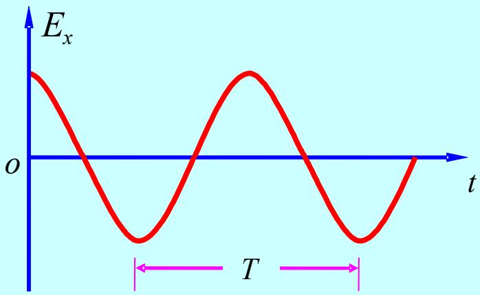
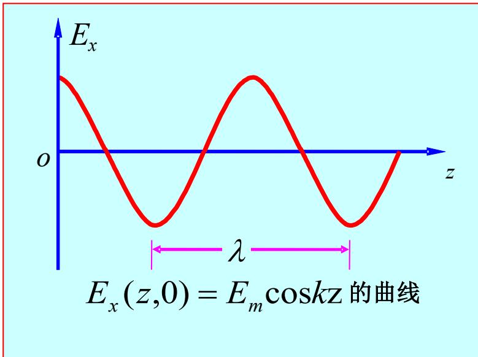
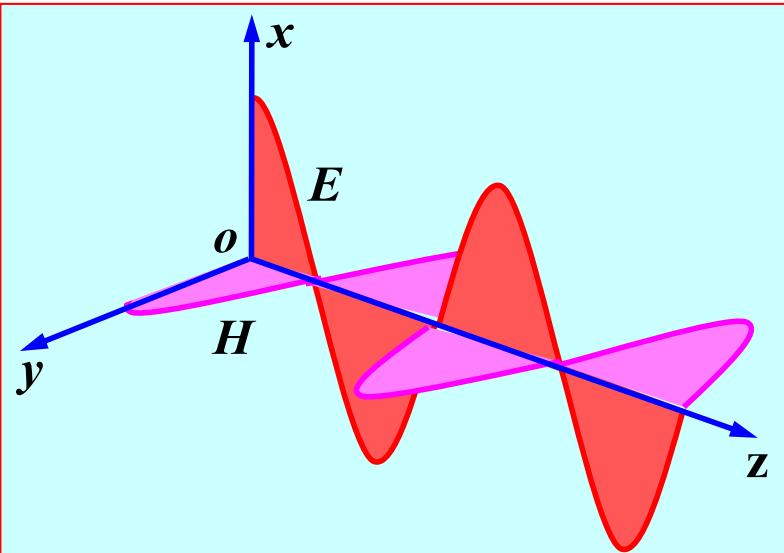

# 6.1.2 理想介质中均匀平面波的传播特点（预习笔记）

> [!tip] 章节导读与知识脉络
> ==与前置章节的关联：==
> [[6.1.1_理想介质中的均匀平面波函数|理想介质中的均匀平面波函数]] 已经得到均匀平面波的场表达式，并说明 $\vec{E}$、$\vec{H}$ 与传播方向三者两两垂直。本节在这个基础上进一步说明：波的周期、波长、相速、能量密度和坡印廷矢量怎样计算。
>
> ==本节研究内容：==
> 本节把均匀平面波的传播特点分成三层：第一是时间和空间相位参数；第二是电场能量、磁场能量和能流密度；第三是理想介质中均匀平面波的总特点。

---

## 一、==角频率、频率和周期==

对沿 $+z$ 方向传播的简谐平面波，可以写成：

$$
E_x(z,t)=E_m\cos(\omega t-kz+\phi_x)
$$

这里的时间变化由 $\omega t$ 控制。

**角频率** $\omega$ 表示单位时间内相位变化的快慢，单位是：

$$
\mathrm{rad/s}
$$

如果固定空间位置，例如取 $z=0$，电场变为：

$$
E_x(0,t)=E_m\cos(\omega t+\phi_x)
$$

相位每变化 $2\pi$，波形就完成一次重复。因此周期 $T$ 满足：

$$
\omega T=2\pi
$$

所以：

$$
\boxed{T=\frac{2\pi}{\omega}}
$$

频率 $f$ 是单位时间内完成周期变化的次数：

$$
\boxed{f=\frac{1}{T}=\frac{\omega}{2\pi}}
$$

单位为 Hz。

教材中固定空间点观察时间变化的图如下：

这张图说明：周期 $T$ 是同一空间点处电场随时间重复一次所需的时间。

---

## 二、==相位常数和波长==

若固定时间，例如取 $t=0$，电场随空间位置变化。空间相位由 $kz$ 控制。

**相位常数** $k$ 表示波传播单位距离时相位变化的大小，单位是：

$$
\mathrm{rad/m}
$$

波长 $\lambda$ 是空间相位差为 $2\pi$ 的两个相邻同相位点之间的距离。因此：

$$
k\lambda=2\pi
$$

所以：

$$
\boxed{k=\frac{2\pi}{\lambda}}
$$

也可写为：

$$
\boxed{\lambda=\frac{2\pi}{k}}
$$

在理想介质中：

$$
k=\omega\sqrt{\mu\varepsilon}=2\pi f\sqrt{\mu\varepsilon}
$$

因此：

$$
\boxed{\lambda=\frac{1}{f\sqrt{\mu\varepsilon}}}
$$

教材中固定时间观察空间变化的图如下：

这张图说明：波长 $\lambda$ 是空间中波形重复一次的距离。

---

## 三、==相速的定义和计算==

**相速** $v_p$ 是电磁波等相位面在空间中的移动速度。对

$$
E_x(z,t)=E_m\cos(\omega t-kz+\phi_x)
$$

某一个固定相位点满足：

$$
\omega t-kz+\phi_x=C
$$

对上式微分：

$$
\omega\mathrm{d}t-k\mathrm{d}z=0
$$

于是：

$$
v_p=\frac{\mathrm{d}z}{\mathrm{d}t}=\frac{\omega}{k}
$$

由于理想介质中

$$
k=\omega\sqrt{\mu\varepsilon}
$$

所以：

$$
\boxed{v_p=\frac{\omega}{k}=\frac{1}{\sqrt{\mu\varepsilon}}}
$$

这说明在理想介质中，相速只由媒质参数 $\mu$、$\varepsilon$ 决定。

在真空中：

$$
\boxed{c=\frac{1}{\sqrt{\mu_0\varepsilon_0}}=3\times10^8\ \mathrm{m/s}}
$$

如果媒质相对参数为 $\mu_r$、$\varepsilon_r$，则：

$$
v_p=\frac{c}{\sqrt{\mu_r\varepsilon_r}}
$$

---

## 四、==理想介质中无色散的含义==

在理想介质中：

$$
v_p=\frac{1}{\sqrt{\mu\varepsilon}}
$$

这个式子不含频率 $f$，所以不同频率的均匀平面波在同一理想介质中的相速相同。

这就是教材所说的==无色散==：

> **结论：**
> 理想介质中均匀平面波的相速与频率无关，因此不同频率成分不会因为传播速度不同而逐渐分开。

这条结论后面学习 [[6.2 导电媒质中的均匀平面电磁波|导电媒质中的均匀平面电磁波]] 时很重要。导电媒质中相速通常与频率有关，因此会出现色散。

---

## 五、==电场能量密度与磁场能量密度相等==

由上一节可知，沿 $+z$ 方向传播时：

$$
\vec{H}=\frac{1}{\eta}\vec{e}_z\times\vec{E}
$$

并且理想介质中的本征阻抗为：

$$
\eta=\sqrt{\frac{\mu}{\varepsilon}}
$$

所以电场和磁场的幅值满足：

$$
H=\frac{E}{\eta}
$$

电场能量密度为：

$$
w_e=\frac{1}{2}\varepsilon|\vec{E}|^2
$$

磁场能量密度为：

$$
w_m=\frac{1}{2}\mu|\vec{H}|^2
$$

代入 $H=E/\eta$：

$$
w_m=\frac{1}{2}\mu\frac{|\vec{E}|^2}{\eta^2}
$$

又因为

$$
\eta^2=\frac{\mu}{\varepsilon}
$$

所以：

$$
w_m=\frac{1}{2}\mu\frac{|\vec{E}|^2}{\mu/\varepsilon}
=\frac{1}{2}\varepsilon|\vec{E}|^2
$$

即：

$$
\boxed{w_e=w_m}
$$

> **结论：**
> 在理想介质均匀平面波中，电场能量密度等于磁场能量密度。电场和磁场不是分别孤立存在，而是在传播过程中以相等的平均储能共同构成电磁波。

---

## 六、==总能量密度==

总能量密度为：

$$
w=w_e+w_m
$$

因为 $w_e=w_m$，所以：

$$
w=\varepsilon|\vec{E}|^2
$$

也可写为：

$$
w=\mu|\vec{H}|^2
$$

若讨论时谐场的平均能量密度，要联系 [[5.4.6_平均能量密度和平均能流密度矢量|平均能量密度和平均能流密度矢量]]。教材给出：

$$
\boxed{w_{av}=\frac{1}{2}\varepsilon E_m^2=\frac{1}{2}\mu H_m^2}
$$

这里的 $E_m$、$H_m$ 是电场和磁场的振幅。

---

## 七、==瞬时能流密度与平均能流密度==

坡印廷矢量定义为：

$$
\vec{S}=\vec{E}\times\vec{H}
$$

这与 [[2.8.3_坡印廷矢量|坡印廷矢量]] 中的定义一致。对沿 $+z$ 方向传播的均匀平面波，$\vec{E}\perp\vec{H}$，且 $\vec{E}\times\vec{H}$ 指向 $+z$ 方向。因此瞬时能流密度方向就是传播方向。

若电场写为：

$$
\vec{E}(z,t)=\vec{e}_xE_m\cos(\omega t-kz+\phi_x)
$$

则磁场为：

$$
\vec{H}(z,t)=\vec{e}_y\frac{E_m}{\eta}\cos(\omega t-kz+\phi_x)
$$

因此：

$$
\vec{S}(z,t)=\vec{e}_z\frac{E_m^2}{\eta}\cos^2(\omega t-kz+\phi_x)
$$

时谐场中更常用平均坡印廷矢量：

$$
\boxed{\vec{S}_{av}=\frac{1}{2}\operatorname{Re}\left[\vec{E}(z)\times\vec{H}^{*}(z)\right]}
$$

对于理想介质中的均匀平面波：

$$
\boxed{\vec{S}_{av}=\vec{e}_z\frac{1}{2\eta}E_m^2}
$$

---

## 八、==能量传输速度等于相速==

由

$$
\eta=\sqrt{\frac{\mu}{\varepsilon}}
$$

可得：

$$
\frac{1}{\eta}=\sqrt{\frac{\varepsilon}{\mu}}
$$

于是平均能流密度可写为：

$$
\vec{S}_{av}=\vec{e}_z\frac{1}{2}E_m^2\sqrt{\frac{\varepsilon}{\mu}}
$$

又因为

$$
w_{av}=\frac{1}{2}\varepsilon E_m^2
$$

所以：

$$
\vec{S}_{av}=w_{av}\vec{v}_p
$$

其中

$$
\vec{v}_p=\vec{e}_z\frac{1}{\sqrt{\mu\varepsilon}}
$$

> **结论：**
> 理想介质均匀平面波中，平均能流密度等于平均能量密度乘以传播速度。因此能量的传输速度等于相速。

---

## 九、==理想介质中均匀平面波的传播特点汇总==

教材中的三维传播关系图如下：

可以把理想介质中均匀平面波的特点整理为：

1. ==TEM 波==：电场、磁场与传播方向三者两两垂直。
2. ==无衰减==：理想介质中没有传导损耗，电场和磁场振幅不随传播距离衰减。
3. ==本征阻抗为实数==：

$$
\eta=\sqrt{\frac{\mu}{\varepsilon}}
$$

因此电场与磁场同相位。

4. ==无色散==：

$$
v_p=\frac{1}{\sqrt{\mu\varepsilon}}
$$

相速与频率无关。

5. ==电场能量密度等于磁场能量密度==：

$$
w_e=w_m
$$

6. ==能量传输速度等于相速==：

$$
\vec{S}_{av}=w_{av}\vec{v}_p
$$

---

## 十、==本节总结==

> **核心结论：**
> 理想介质中的均匀平面波是一种无衰减、无色散的 TEM 波。它的电场、磁场和传播方向相互垂直，电场与磁场同相位，电场能量和磁场能量平均相等，平均能流沿传播方向传输。

需要记住的公式为：

$$
T=\frac{2\pi}{\omega},\qquad f=\frac{\omega}{2\pi}
$$

$$
k=\frac{2\pi}{\lambda}=\omega\sqrt{\mu\varepsilon}
$$

$$
\lambda=\frac{1}{f\sqrt{\mu\varepsilon}}
$$

$$
v_p=\frac{\omega}{k}=\frac{1}{\sqrt{\mu\varepsilon}}
$$

$$
\eta=\sqrt{\frac{\mu}{\varepsilon}}
$$

$$
w_e=w_m,
\qquad
w_{av}=\frac{1}{2}\varepsilon E_m^2=\frac{1}{2}\mu H_m^2
$$

$$
\vec{S}_{av}=\frac{1}{2}\operatorname{Re}(\vec{E}\times\vec{H}^{*})=\vec{e}_z\frac{E_m^2}{2\eta}
$$
