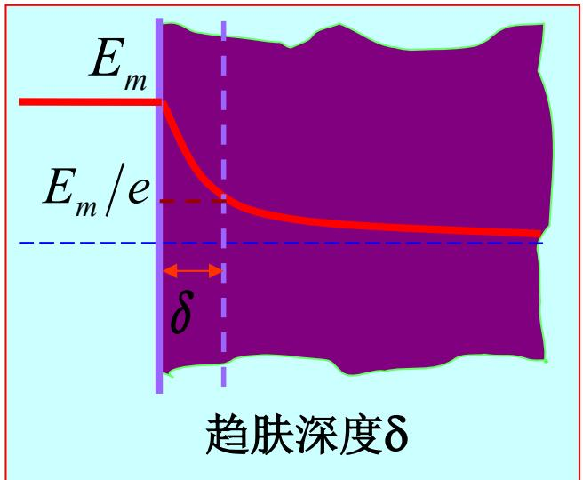
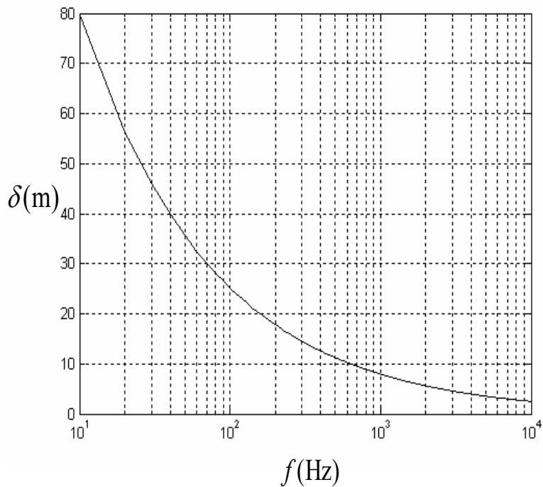

# 6.2.2 导电媒质中的传播参数与趋肤效应（预习笔记）

> [!tip] 章节导读与知识脉络
> ==与前置章节的关联：==
> [[6.2.1_导电媒质中的均匀平面波场解与相伴磁场|导电媒质中的均匀平面波场解与相伴磁场]] 已经把电场写成 $\vec{E}=\vec{e}_xE_{xm}e^{-\alpha z}e^{-j\beta z}e^{j\phi_x}$。本节要进一步说明 $\alpha$、$\beta$、$\eta_c$ 由媒质参数和频率怎样决定，并解释弱导电媒质、良导体、趋肤深度和表面电阻。
>
> ==本节研究内容：==
> 本节围绕一个判断量展开：$\sigma/(\omega\varepsilon)$。这个比值表示传导电流相对于位移电流的强弱，可联系 [[5.4.3_复电容率和复磁导率|复电容率和复磁导率]] 中的导电损耗角正切。

---

## 一、==由传播常数求 $\alpha$ 和 $\beta$==

导电媒质中：

$$
\gamma=jk_c=\alpha+j\beta
$$

又有：

$$
k_c^2=\omega^2\mu\varepsilon_c
=\omega^2\mu\left(\varepsilon-j\frac{\sigma}{\omega}\right)
$$

因此：

$$
\gamma^2=(jk_c)^2=-k_c^2=-\omega^2\mu\left(\varepsilon-j\frac{\sigma}{\omega}\right)
$$

展开右边：

$$
\gamma^2=-\omega^2\mu\varepsilon+j\omega\mu\sigma
$$

另一方面：

$$
\gamma^2=(\alpha+j\beta)^2=\alpha^2-\beta^2+j2\alpha\beta
$$

比较实部和虚部，得到：

$$
\boxed{\alpha^2-\beta^2=-\omega^2\mu\varepsilon}
$$

$$
\boxed{2\alpha\beta=\omega\mu\sigma}
$$

这两式说明：导电损耗使传播常数同时含有衰减常数 $\alpha$ 和相位常数 $\beta$。

---

## 二、==$\alpha$ 和 $\beta$ 的一般公式==

由上面两式可解得：

$$
\boxed{\alpha=\omega\sqrt{\frac{\mu\varepsilon}{2}\left[\sqrt{1+\left(\frac{\sigma}{\omega\varepsilon}\right)^2}-1\right]}}
$$

$$
\boxed{\beta=\omega\sqrt{\frac{\mu\varepsilon}{2}\left[\sqrt{1+\left(\frac{\sigma}{\omega\varepsilon}\right)^2}+1\right]}}
$$

这里最重要的是比值：

$$
\frac{\sigma}{\omega\varepsilon}
$$

它表示传导电流幅度与位移电流幅度之比：

$$
\frac{\sigma E}{\omega\varepsilon E}=\frac{\sigma}{\omega\varepsilon}
$$

因此它决定导电媒质更接近“弱导电媒质”还是“良导体”。

---

## 三、==导电媒质中的波长和相速==

导电媒质中的相位常数是 $\beta$，所以波长为：（背诵）

$$
\boxed{\lambda=\frac{2\pi}{\beta}}
$$

相速为：（背诵）

$$
\boxed{v_p=\frac{\omega}{\beta}}
$$

把 $\beta$ 的一般公式代入，可写成：

$$
v_p=\frac{1}{\sqrt{\dfrac{\mu\varepsilon}{2}\left[\sqrt{1+\left(\dfrac{\sigma}{\omega\varepsilon}\right)^2}+1\right]}}
$$

因为式中含有 $\omega$，所以导电媒质中的相速一般与频率有关。

> **结论：**
> 导电媒质通常是色散媒质。不同频率的波在其中传播时，相速可能不同。

---

## 四、==导电媒质中的平均能量密度==

电场平均能量密度为：

$$
w_{eav}=\frac{1}{4}\operatorname{Re}\left[\varepsilon_c\vec{E}\cdot\vec{E}^{*}\right]
$$

由于 $\operatorname{Re}(\varepsilon_c)=\varepsilon$，得到：

$$
\boxed{w_{eav}=\frac{\varepsilon}{4}E_{xm}^2e^{-2\alpha z}}
$$

磁场平均能量密度为：

$$
w_{mav}=\frac{1}{4}\operatorname{Re}\left[\mu\vec{H}\cdot\vec{H}^{*}\right]
$$

由 $H=E/|\eta_c|$ 可得：

$$
w_{mav}=\frac{\mu}{4}\frac{E_{xm}^2}{|\eta_c|^2}e^{-2\alpha z}
$$

教材进一步写成：

$$
\boxed{w_{mav}=\frac{\varepsilon}{4}E_{xm}^2e^{-2\alpha z}\left[1+\left(\frac{\sigma}{\omega\varepsilon}\right)^2\right]^{1/2}}
$$

因此在导电媒质中通常有：

$$
w_{mav}>w_{eav}
$$

这与理想介质中 $w_e=w_m$ 不同。

---

## 五、==平均坡印廷矢量==

平均坡印廷矢量为：

$$
\vec{S}_{av}=\frac{1}{2}\operatorname{Re}\left[\vec{E}(z)\times\vec{H}^{*}(z)\right]
$$

对沿 $+z$ 方向传播的导电媒质均匀平面波：

$$
\boxed{\vec{S}_{av}=\vec{e}_z\frac{1}{2|\eta_c|}E_{xm}^2e^{-2\alpha z}\cos\phi}
$$

其中：

$$
\eta_c=|\eta_c|e^{j\phi}
$$

这里 $e^{-2\alpha z}$ 表示平均能流密度随传播距离衰减。它是 $e^{-\alpha z}$ 的平方，因为能流密度与场量乘积有关。

---

## 六、==导电媒质中均匀平面波的一般特点==

从上面的公式可以总结：

1. ==仍然是 TEM 波==：$\vec{E}$、$\vec{H}$ 与传播方向仍互相垂直。
2. ==振幅指数衰减==：电场和磁场都含有 $e^{-\alpha z}$。
3. ==本征阻抗为复数==：$\eta_c=|\eta_c|e^{j\phi}$。
4. ==电场和磁场不同相位==：磁场滞后于电场，滞后角为 $\phi$。
5. ==有色散==：相速一般与频率有关。
6. ==平均磁场能量密度大于平均电场能量密度==。

---

## 七、==弱导电媒质==

若：

$$
\frac{\sigma}{\omega\varepsilon}\ll1
$$

则传导电流远小于位移电流，媒质称为==弱导电媒质==或近似良绝缘体。

传播常数可近似为：

$$
\gamma=j\omega\sqrt{\mu\varepsilon}\left(1+\frac{\sigma}{j\omega\varepsilon}\right)^{1/2}
$$

利用近似：

$$
(1+x)^{1/2}\approx1+\frac{x}{2}
$$

得到：

$$
\gamma\approx j\omega\sqrt{\mu\varepsilon}+\frac{\sigma}{2}\sqrt{\frac{\mu}{\varepsilon}}
$$

所以：

$$
\boxed{\alpha\approx\frac{\sigma}{2}\sqrt{\frac{\mu}{\varepsilon}}}
$$

$$
\boxed{\beta\approx\omega\sqrt{\mu\varepsilon}}
$$

弱导电媒质的复本征阻抗为：

$$
\eta_c=\sqrt{\frac{\mu}{\varepsilon_c}}
\approx\sqrt{\frac{\mu}{\varepsilon}}\left(1+j\frac{\sigma}{2\omega\varepsilon}\right)
$$

因此弱导电媒质的特点是：

- 衰减较小；
- 相位常数近似等于理想介质中的相位常数；
- 电场和磁场之间只有较小相位差。

---

## 八、==良导体==

若：

$$
\frac{\sigma}{\omega\varepsilon}\gg1
$$

则传导电流远大于位移电流，媒质称为==良导体==。金、银、铜、铁、铝等金属对许多无线电频率的电磁波都可看作良导体。

良导体中：

$$
\gamma=j\omega\sqrt{\mu\varepsilon}\left(1-j\frac{\sigma}{\omega\varepsilon}\right)^{1/2}
$$

由于 $\sigma/(\omega\varepsilon)\gg1$，可近似为：

$$
\gamma\approx\sqrt{j\omega\mu\sigma}
$$

又因为：

$$
\sqrt{j}=e^{j45^\circ}=\frac{1+j}{\sqrt{2}}
$$

所以：

$$
\gamma\approx\sqrt{\frac{\omega\mu\sigma}{2}}(1+j)
$$

于是：（背诵）

$$
\boxed{\alpha\approx\beta\approx\sqrt{\frac{\omega\mu\sigma}{2}}=\sqrt{\pi f\mu\sigma}}
$$

---

## 九、==良导体中的相速、波长和本征阻抗==

由于良导体中：

$$
\beta\approx\sqrt{\pi f\mu\sigma}
$$

所以相速为：

$$
\boxed{v_p=\frac{\omega}{\beta}\approx\sqrt{\frac{2\omega}{\mu\sigma}}}
$$

波长为：

$$
\boxed{\lambda=\frac{2\pi}{\beta}\approx2\sqrt{\frac{\pi}{f\mu\sigma}}}
$$

良导体中的复本征阻抗为：

$$
\eta_c\approx\sqrt{\frac{j\omega\mu}{\sigma}}
$$

写成频率形式：

$$
\boxed{\eta_c\approx(1+j)\sqrt{\frac{\pi f\mu}{\sigma}}}
$$

因为 $1+j$ 的相角是 $45^\circ$，所以良导体中磁场强度滞后于电场强度：

$$
45^\circ
$$

---

## 十、==趋肤效应和趋肤深度==

良导体中：

$$
\alpha\approx\sqrt{\pi f\mu\sigma}
$$

频率越高，$\alpha$ 越大，电磁波振幅衰减越快。高频电磁波只能存在于导体表面附近的一层区域内，这称为==趋肤效应==。

趋肤深度 $\delta$ 定义为：电磁波进入良导体后，振幅下降到表面处振幅 $1/e$ 时所传播的距离。

若表面处振幅为 $E_m$，则：

$$
E_me^{-\alpha\delta}=\frac{E_m}{e}
$$

所以：

$$
\boxed{\delta=\frac{1}{\alpha}}
$$

对良导体：

$$
\boxed{\delta=\frac{1}{\sqrt{\pi f\mu\sigma}}}
$$

教材中的趋肤深度示意图如下：

这张图说明：在距离表面 $\delta$ 处，场振幅降为表面值的 $1/e$。

---

## 十一、==频率越高，趋肤深度越小==

由

$$
\delta=\frac{1}{\sqrt{\pi f\mu\sigma}}
$$

可见：

$$
\delta\propto\frac{1}{\sqrt{f}}
$$

所以频率提高时，电磁波在导体内能进入的深度变小。

教材中海水的趋肤深度随频率变化曲线如下：

该曲线表达的主要结论是：频率越高，趋肤深度越小，电磁波越难深入导电媒质内部。

---

## 十二、==表面电阻==

良导体的本征阻抗可写为：

$$
\eta_c\approx(1+j)\sqrt{\frac{\pi f\mu}{\sigma}}
$$

定义表面阻抗的电阻分量和电抗分量：

$$
\eta_c=R_S+jX_S
$$

因此：

$$
\boxed{R_S=X_S=\sqrt{\frac{\pi f\mu}{\sigma}}}
$$

又因为：

$$
\delta=\frac{1}{\sqrt{\pi f\mu\sigma}}
$$

所以：

$$
\boxed{R_S=\frac{1}{\sigma\delta}}
$$

这个公式说明：趋肤深度越小，电流越集中在表面更薄的区域内，等效表面电阻越大。

---

## 十三、==本节总结==

1. 导电媒质传播常数满足：

$$
\gamma=\alpha+j\beta
$$

并且：

$$
\alpha=\omega\sqrt{\frac{\mu\varepsilon}{2}\left[\sqrt{1+\left(\frac{\sigma}{\omega\varepsilon}\right)^2}-1\right]}
$$

$$
\beta=\omega\sqrt{\frac{\mu\varepsilon}{2}\left[\sqrt{1+\left(\frac{\sigma}{\omega\varepsilon}\right)^2}+1\right]}
$$

2. 导电媒质中：

$$
\lambda=\frac{2\pi}{\beta},\qquad v_p=\frac{\omega}{\beta}
$$

3. 弱导电媒质条件为：

$$
\frac{\sigma}{\omega\varepsilon}\ll1
$$

此时：

$$
\alpha\approx\frac{\sigma}{2}\sqrt{\frac{\mu}{\varepsilon}},
\qquad
\beta\approx\omega\sqrt{\mu\varepsilon}
$$

4. 良导体条件为：

$$
\frac{\sigma}{\omega\varepsilon}\gg1
$$

此时：

$$
\alpha\approx\beta\approx\sqrt{\pi f\mu\sigma}
$$

5. 良导体趋肤深度为：

$$
\delta=\frac{1}{\alpha}=\frac{1}{\sqrt{\pi f\mu\sigma}}
$$

6. 良导体表面电阻为：

$$
R_S=\sqrt{\frac{\pi f\mu}{\sigma}}=\frac{1}{\sigma\delta}
$$

7. 导电媒质与理想介质的主要差别是：导电媒质中电磁波有衰减、有相位差、通常有色散；良导体中高频电磁波主要集中在表面层内。
