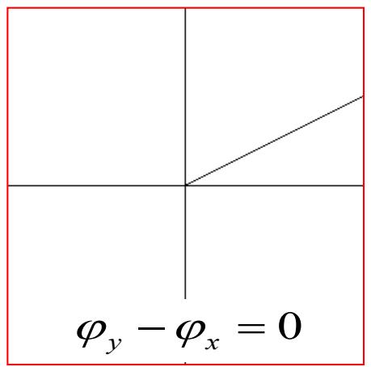
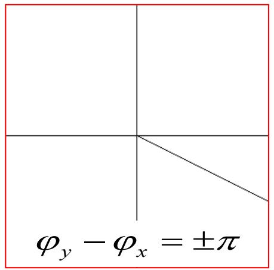

# 6.3.1 极化的定义与直线极化波（预习笔记）

> [!tip] 章节导读与知识脉络
> ==与前置章节的关联：==
> [[6.1.1_理想介质中的均匀平面波函数|理想介质中的均匀平面波函数]] 和 [[6.1.3_沿任意方向传播的均匀平面波|沿任意方向传播的均匀平面波]] 已经说明，均匀平面波是横电磁波，电场 $\vec{E}$ 垂直于传播方向。现在进一步研究：在垂直于传播方向的横截面内，电场矢量的方向怎样随时间改变。
>
> ==本节研究内容：==
> 本节只讨论两个内容：第一，什么是电磁波的极化；第二，什么条件下两个互相垂直的电场分量合成为直线极化波。这里的“极化”是指电磁波中电场矢量端点的运动状态，不是 [[2.5.1.(1-3) 电介质的极化_电位移矢量|电介质被电场极化]] 中的极化强度矢量 $\vec{P}$。

---

## 一、==为什么要讨论极化==

设均匀平面波沿 $+z$ 方向传播。由于电磁波是横波，电场没有 $z$ 分量，只能在垂直于传播方向的 $xOy$ 平面内变化。因此电场可写为：

$$
\vec{E}=\vec{e}_xE_x+\vec{e}_yE_y
$$

其中：

$$
E_x=E_{xm}\cos(\omega t-kz+\varphi_x)
$$

$$
E_y=E_{ym}\cos(\omega t-kz+\varphi_y)
$$

这说明：同一个沿 $+z$ 方向传播的均匀平面波，可以看作由两个互相垂直的线极化分量合成：

- $x$ 方向分量 $E_x$；
- $y$ 方向分量 $E_y$。

电磁波的极化状态由这两个分量的==振幅关系==和==相位关系==共同决定。

---

## 二、==极化的定义==

教材定义：波的极化表征在空间给定点上电场强度矢量的取向随时间变化的特性。

更具体地说，固定空间中某一点，例如取 $z=0$，观察电场矢量：

$$
\vec{E}(0,t)=\vec{e}_xE_x(0,t)+\vec{e}_yE_y(0,t)
$$

此时：

$$
E_x(0,t)=E_{xm}\cos(\omega t+\varphi_x)
$$

$$
E_y(0,t)=E_{ym}\cos(\omega t+\varphi_y)
$$

随着时间 $t$ 改变，电场矢量 $\vec{E}$ 的端点会在 $xOy$ 平面内运动。这个端点运动形成的轨迹，就用来判断极化状态。

> **结论：**
> 电磁波的极化，是指在空间某一固定点处，电场强度矢量端点随时间变化形成的轨迹。

---

## 三、==三种基本极化状态==

根据电场端点轨迹的形状，极化状态分为三类：

1. ==直线极化==：电场强度矢量端点轨迹是一条直线段。
2. ==圆极化==：电场强度矢量端点轨迹是一个圆。
3. ==椭圆极化==：电场强度矢量端点轨迹是一个椭圆。

本节先研究直线极化。圆极化和椭圆极化后续再单独整理。

---

## 四、==直线极化波的相位条件==

直线极化波的条件是：

$$
\boxed{\varphi_y-\varphi_x=0\quad\text{或}\quad \pm\pi}
$$

这表示 $x$ 方向分量和 $y$ 方向分量同相，或反相。

固定观察点 $z=0$，有：

$$
E_x=E_{xm}\cos(\omega t+\varphi_x)
$$

如果 $\varphi_y-\varphi_x=0$，则：

$$
E_y=E_{ym}\cos(\omega t+\varphi_x)
$$

此时两个分量同时达到正最大、同时为零、同时达到负最大，所以合成电场的方向保持不变。

如果 $\varphi_y-\varphi_x=\pm\pi$，则：

$$
E_y=E_{ym}\cos(\omega t+\varphi_x\pm\pi)
=-E_{ym}\cos(\omega t+\varphi_x)
$$

此时两个分量始终反相，但它们的比值仍为常数，所以合成电场的方向仍保持在一条固定直线上。

---

## 五、==直线极化时电场方向为什么不变==

### 1. 相位差为 $0$ 的情况

当：

$$
\varphi_y-\varphi_x=0
$$

有：

$$
\frac{E_y}{E_x}
=\frac{E_{ym}\cos(\omega t+\varphi_x)}{E_{xm}\cos(\omega t+\varphi_x)}
=\frac{E_{ym}}{E_{xm}}
$$

所以合成电场与 $+x$ 轴的夹角为：

$$
\boxed{\alpha=\arctan\left(\frac{E_y}{E_x}\right)=\arctan\left(\frac{E_{ym}}{E_{xm}}\right)}
$$

该角度不随时间改变。

教材中相位差为 $0$ 的线极化示意图如下：

### 2. 相位差为 $\pm\pi$ 的情况

当：

$$
\varphi_y-\varphi_x=\pm\pi
$$

有：

$$
\frac{E_y}{E_x}
=\frac{-E_{ym}\cos(\omega t+\varphi_x)}{E_{xm}\cos(\omega t+\varphi_x)}
=-\frac{E_{ym}}{E_{xm}}
$$

所以：

$$
\boxed{\alpha=-\arctan\left(\frac{E_{ym}}{E_{xm}}\right)}
$$

该角度同样不随时间改变，只是直线方向与同相情况不同。

教材中相位差为 $\pm\pi$ 的线极化示意图如下：

---

## 六、==直线极化时电场大小怎样变化==

教材给出合成电场的模：

$$
E=\sqrt{E_x^2(0,t)+E_y^2(0,t)}
$$

当两个分量同相时：

$$
E_x=E_{xm}\cos(\omega t+\varphi_x)
$$

$$
E_y=E_{ym}\cos(\omega t+\varphi_x)
$$

所以：

$$
E=\sqrt{E_{xm}^2+E_{ym}^2}\,\left|\cos(\omega t+\varphi_x)\right|
$$

如果讨论带方向的合成电场投影，也常写成：

$$
E=\sqrt{E_{xm}^2+E_{ym}^2}\cos(\omega t+\varphi_x)
$$

这里要注意：直线极化并不是说电场大小不变，而是说电场矢量始终沿同一条直线方向振动。电场大小会随时间变化，并且方向可能在这条直线上正反交替。

---

## 七、==直线极化的判定方法==

对沿 $+z$ 方向传播的平面波：

$$
\vec{E}=\vec{e}_xE_{xm}\cos(\omega t-kz+\varphi_x)
+\vec{e}_yE_{ym}\cos(\omega t-kz+\varphi_y)
$$

判断是否为直线极化，主要看相位差：

$$
\Delta\varphi=\varphi_y-\varphi_x
$$

若：

$$
\boxed{\Delta\varphi=0\quad\text{或}\quad\pm\pi}
$$

则为直线极化。

此时合成电场端点轨迹为一条直线段，直线方向由 $E_{ym}/E_{xm}$ 和相位差正负决定。

---

## 八、==本节总结==

1. 沿 $+z$ 方向传播的均匀平面波可写成：

$$
\vec{E}=\vec{e}_xE_x+\vec{e}_yE_y
$$

其中：

$$
E_x=E_{xm}\cos(\omega t-kz+\varphi_x),
\qquad
E_y=E_{ym}\cos(\omega t-kz+\varphi_y)
$$

2. 电磁波极化研究的是：固定空间点处，电场矢量端点随时间形成的轨迹。

3. 极化状态由 $E_x$ 和 $E_y$ 的振幅关系、相位关系共同决定。

4. 直线极化条件为：

$$
\boxed{\varphi_y-\varphi_x=0\quad\text{或}\quad\pm\pi}
$$

5. 直线极化波的特点是：电场大小随时间变化，但电场矢量端点始终在同一条直线段上运动。

6. 本节的核心判断是：只要两个互相垂直的同频线极化分量同相或反相，它们的合成波就是直线极化波。
