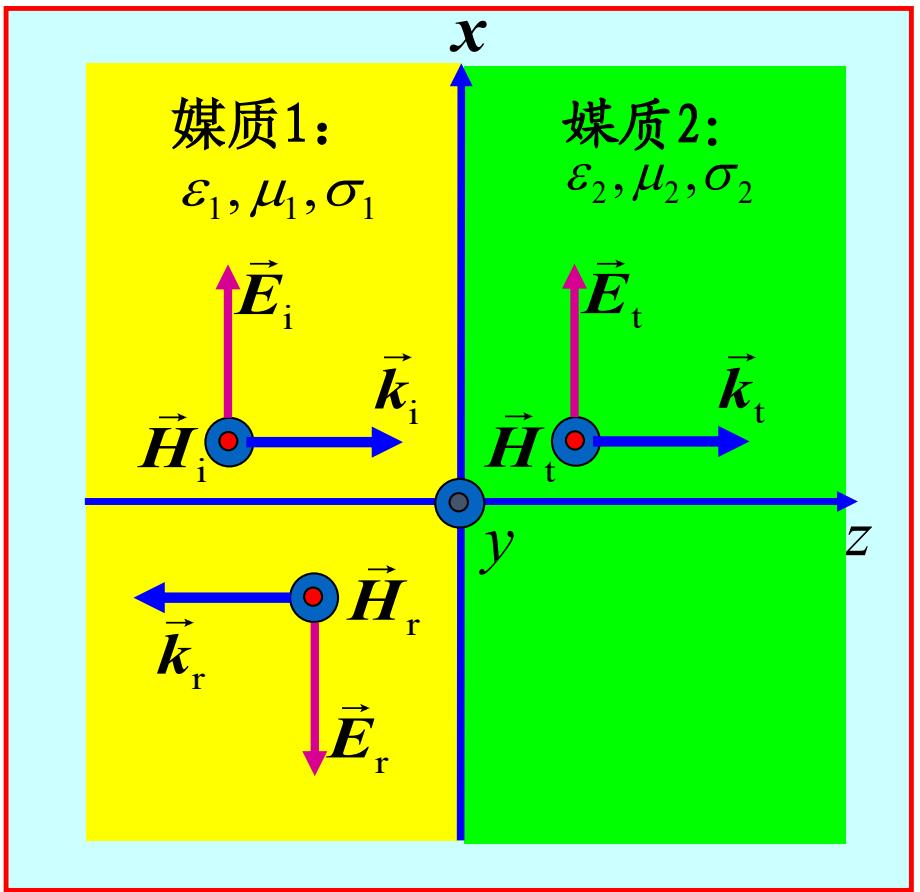

# 6.5.2 向导电媒质分界面的垂直入射（预习笔记）

> [!tip] 章节导读与知识脉络
> ==与前置章节的关联：==
> [[6.5.1_向理想介质分界面的垂直入射|向理想介质分界面的垂直入射]] 已经建立了垂直入射的基本方法：写出入射波、反射波和透射波，再用分界面上的切向 $\vec{E}$、切向 $\vec{H}$ 连续条件求反射系数和透射系数。[[6.2.1_导电媒质中的均匀平面波场解与相伴磁场|导电媒质中的场解]] 和 [[6.2.2_导电媒质中的传播参数与趋肤效应|导电媒质中的传播参数]] 说明，导电媒质中要使用复本征阻抗 $\eta_c$ 和传播常数 $\gamma$。
>
> ==本节研究内容：==
> 本节把理想介质分界面的垂直入射推广到导电媒质。形式上仍然是同一套边界条件，但公式中的 $\eta_1,\eta_2$ 要换成复本征阻抗 $\eta_{1c},\eta_{2c}$，传播因子也从 $e^{\mp j\beta z}$ 变成 $e^{\mp\gamma z}$。因此 $\Gamma$ 和 $\tau$ 一般为复数，表示反射波、透射波不仅振幅改变，相位也改变。

---

## 一、==物理模型==

分界面仍取为：

$$
z=0
$$

媒质 1 位于：

$$
z<0
$$

媒质 2 位于：

$$
z>0
$$

两侧都是导电媒质，参数分别为：

$$
\mu_1,\varepsilon_1,\sigma_1
$$

$$
\mu_2,\varepsilon_2,\sigma_2
$$

沿 $x$ 方向极化的均匀平面波，从媒质 1 垂直入射到导电媒质 2 的分界面。教材示意图如下：

图中仍有三种波：

- 入射波：在媒质 1 中沿 $+z$ 方向传播；
- 反射波：在媒质 1 中沿 $-z$ 方向传播；
- 透射波：在媒质 2 中沿 $+z$ 方向传播。

---

## 二、==导电媒质中的复参数==

导电媒质的复电容率为：

$$
\varepsilon_c=\varepsilon-j\frac{\sigma}{\omega}
$$

媒质 1 中：

$$
\varepsilon_{1c}=\varepsilon_1-j\frac{\sigma_1}{\omega}
$$

媒质 2 中：

$$
\varepsilon_{2c}=\varepsilon_2-j\frac{\sigma_2}{\omega}
$$

传播常数为：

$$
\gamma=jk_c
$$

对媒质 1：

$$
\boxed{\gamma_1=j\omega\sqrt{\mu_1\varepsilon_{1c}}}
$$

也可写成：

$$
\gamma_1=j\omega\sqrt{\mu_1\varepsilon_1}\left(1-j\frac{\sigma_1}{\omega\varepsilon_1}\right)^{1/2}
$$

对媒质 2：

$$
\boxed{\gamma_2=j\omega\sqrt{\mu_2\varepsilon_{2c}}}
$$

也可写成：

$$
\gamma_2=j\omega\sqrt{\mu_2\varepsilon_2}\left(1-j\frac{\sigma_2}{\omega\varepsilon_2}\right)^{1/2}
$$

---

## 三、==复本征阻抗==

导电媒质中电场与磁场的比值由复本征阻抗决定。

媒质 1 的复本征阻抗为：

$$
\boxed{\eta_{1c}=\sqrt{\frac{\mu_1}{\varepsilon_{1c}}}}
$$

即：

$$
\eta_{1c}=\sqrt{\frac{\mu_1}{\varepsilon_1}}\left(1-j\frac{\sigma_1}{\omega\varepsilon_1}\right)^{-1/2}
$$

若令：

$$
\eta_1=\sqrt{\frac{\mu_1}{\varepsilon_1}}
$$

则：

$$
\eta_{1c}=\eta_1\left(1-j\frac{\sigma_1}{\omega\varepsilon_1}\right)^{-1/2}
$$

媒质 2 的复本征阻抗为：

$$
\boxed{\eta_{2c}=\sqrt{\frac{\mu_2}{\varepsilon_{2c}}}}
$$

即：

$$
\eta_{2c}=\eta_2\left(1-j\frac{\sigma_2}{\omega\varepsilon_2}\right)^{-1/2}
$$

这里 $\eta_{1c}$、$\eta_{2c}$ 一般都是复数，所以电场和磁场一般不同相。

---

## 四、==媒质 1 中的入射波和反射波==

媒质 1 中入射波为：

$$
\boxed{\vec{E}_{\mathrm{i}}(z)=\vec{e}_xE_{\mathrm{im}}e^{-\gamma_1z}}
$$

$$
\boxed{\vec{H}_{\mathrm{i}}(z)=\vec{e}_y\frac{E_{\mathrm{im}}}{\eta_{1c}}e^{-\gamma_1z}}
$$

反射波沿 $-z$ 方向传播，因此：

$$
\boxed{\vec{E}_{\mathrm{r}}(z)=\vec{e}_xE_{\mathrm{rm}}e^{\gamma_1z}}
$$

$$
\boxed{\vec{H}_{\mathrm{r}}(z)=-\vec{e}_y\frac{E_{\mathrm{rm}}}{\eta_{1c}}e^{\gamma_1z}}
$$

反射波磁场仍然有负号，原因与理想介质情况相同：反射波传播方向为 $-z$，而入射波传播方向为 $+z$。

---

## 五、==媒质 1 中的合成波==

媒质 1 中总电场为：

$$
\vec{E}_1(z)=\vec{E}_{\mathrm{i}}(z)+\vec{E}_{\mathrm{r}}(z)
$$

即：

$$
\boxed{\vec{E}_1(z)=\vec{e}_xE_{\mathrm{im}}e^{-\gamma_1z}+\vec{e}_xE_{\mathrm{rm}}e^{\gamma_1z}}
$$

总磁场为：

$$
\vec{H}_1(z)=\vec{H}_{\mathrm{i}}(z)+\vec{H}_{\mathrm{r}}(z)
$$

即：

$$
\boxed{\vec{H}_1(z)=\vec{e}_y\frac{E_{\mathrm{im}}}{\eta_{1c}}e^{-\gamma_1z}-\vec{e}_y\frac{E_{\mathrm{rm}}}{\eta_{1c}}e^{\gamma_1z}}
$$

由于 $\gamma_1=\alpha_1+j\beta_1$ 一般为复数，媒质 1 中的入射波和反射波都带有衰减特性。

---

## 六、==媒质 2 中的透射波==

媒质 2 中只有向 $+z$ 方向传播的透射波：

$$
\boxed{\vec{E}_{\mathrm{t}}(z)=\vec{e}_xE_{\mathrm{tm}}e^{-\gamma_2z}}
$$

$$
\boxed{\vec{H}_{\mathrm{t}}(z)=\vec{e}_y\frac{E_{\mathrm{tm}}}{\eta_{2c}}e^{-\gamma_2z}}
$$

若媒质 2 是有损耗导电媒质，则透射波进入媒质 2 后会随 $z$ 增大而衰减。若媒质 2 是良导体，这个衰减会很快，对应 [[6.2.2_导电媒质中的传播参数与趋肤效应|趋肤效应]]。

---

## 七、==分界面边界条件==

在 $z=0$ 分界面上，切向电场和切向磁场连续：

$$
\vec{E}_1(0)=\vec{E}_2(0)
$$

$$
\vec{H}_1(0)=\vec{H}_2(0)
$$

代入各波场表达式，得到：

$$
\boxed{E_{\mathrm{im}}+E_{\mathrm{rm}}=E_{\mathrm{tm}}}
$$

$$
\boxed{\frac{1}{\eta_{1c}}(E_{\mathrm{im}}-E_{\mathrm{rm}})=\frac{1}{\eta_{2c}}E_{\mathrm{tm}}}
$$

与理想介质情况相比，这两条边界方程形式完全一样，只是把 $\eta_1,\eta_2$ 换成了 $\eta_{1c},\eta_{2c}$。

---

## 八、==反射系数和透射系数==

定义：

$$
\Gamma=\frac{E_{\mathrm{rm}}}{E_{\mathrm{im}}}
$$

$$
\tau=\frac{E_{\mathrm{tm}}}{E_{\mathrm{im}}}
$$

由边界条件解得：

$$
\boxed{\Gamma=\frac{\eta_{2c}-\eta_{1c}}{\eta_{2c}+\eta_{1c}}}
$$

$$
\boxed{\tau=\frac{2\eta_{2c}}{\eta_{2c}+\eta_{1c}}}
$$

并且仍有：

$$
\boxed{1+\Gamma=\tau}
$$

这里的 $\Gamma$ 和 $\tau$ 一般为复数。复数的模表示振幅比例，复数的相角表示相位改变。

---

## 九、==导电媒质中反射和透射的特点==

与理想介质相比，导电媒质垂直入射有三个重要变化：

1. ==传播常数为复数==：
   $$
   \gamma=\alpha+j\beta
   $$
   因此波在传播时同时发生相位变化和振幅衰减。

2. ==本征阻抗为复数==：
   $$
   \eta_c=|\eta_c|e^{j\phi}
   $$
   因此电场和磁场一般不同相。

3. ==反射系数和透射系数为复数==：
   $$
   \Gamma=|\Gamma|e^{j\theta_\Gamma},\qquad \tau=|\tau|e^{j\theta_\tau}
   $$
   因此反射波和透射波相对入射波既有振幅变化，也有相位变化。

---

## 十、==两个重要特例==

### 1. 媒质 2 为理想导体

若媒质 2 是理想导体，则：

$$
\sigma_2\to\infty
$$

理想导体内部电场为零，可等效理解为：

$$
\eta_{2c}=0
$$

代入导电媒质公式：

$$
\Gamma=\frac{0-\eta_{1c}}{0+\eta_{1c}}=-1
$$

$$
\tau=\frac{2\cdot0}{0+\eta_{1c}}=0
$$

所以：

$$
\boxed{\Gamma=-1,\qquad \tau=0}
$$

这表示电场全反射，且反射波电场在分界面处与入射波电场反相。

### 2. 两种媒质均为理想介质

若：

$$
\sigma_1=0,
\qquad
\sigma_2=0
$$

则：

$$
\eta_{1c}=\eta_1,
\qquad
\eta_{2c}=\eta_2
$$

于是导电媒质公式退化为理想介质公式：

$$
\boxed{\Gamma=\frac{\eta_2-\eta_1}{\eta_2+\eta_1}}
$$

$$
\boxed{\tau=\frac{2\eta_2}{\eta_2+\eta_1}}
$$

这说明本节公式比上一节更一般。

---

## 十一、==本节总结==

1. 导电媒质垂直入射的场表达式使用传播常数：

$$
\gamma=\alpha+j\beta
$$

2. 导电媒质中的本征阻抗为复数：

$$
\eta_c=\sqrt{\frac{\mu}{\varepsilon_c}},
\qquad
\varepsilon_c=\varepsilon-j\frac{\sigma}{\omega}
$$

3. 分界面边界条件为：

$$
E_{\mathrm{im}}+E_{\mathrm{rm}}=E_{\mathrm{tm}}
$$

$$
\frac{1}{\eta_{1c}}(E_{\mathrm{im}}-E_{\mathrm{rm}})=\frac{1}{\eta_{2c}}E_{\mathrm{tm}}
$$

4. 反射系数和透射系数为：

$$
\boxed{\Gamma=\frac{\eta_{2c}-\eta_{1c}}{\eta_{2c}+\eta_{1c}}}
$$

$$
\boxed{\tau=\frac{2\eta_{2c}}{\eta_{2c}+\eta_{1c}}}
$$

5. $\Gamma$ 和 $\tau$ 一般为复数，因此反射波和透射波相对入射波既有振幅变化，也有相位变化。

6. 若媒质 2 为理想导体，则：

$$
\Gamma=-1,
\qquad
\tau=0
$$

7. 若两种媒质都是理想介质，则本节公式退化为上一节的理想介质垂直入射公式。
