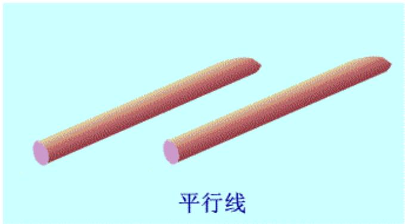
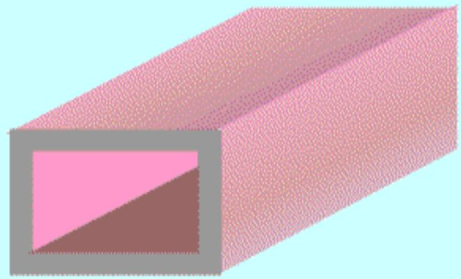
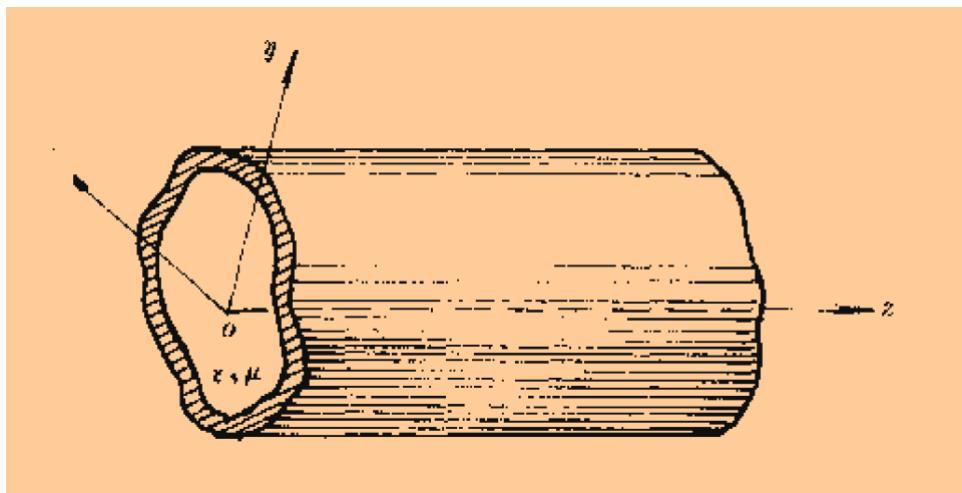

# 7.1.1 导行电磁波的基本假设与场分解（预习笔记）

> [!tip] 章节导读与知识脉络
> ==与前置章节的关联==
> [[5.4.2_复矢量的麦克斯韦方程|复矢量的麦克斯韦方程]] 已经说明，时谐场中可以把时间因子 $e^{j\omega t}$ 省去，只研究空间复振幅。[[5.4.4_时谐场的亥姆霍兹方程|时谐场的亥姆霍兹方程]] 又说明，无源均匀媒质中的场满足 $\nabla^2\vec{E}+k^2\vec{E}=0$ 和 $\nabla^2\vec{H}+k^2\vec{H}=0$。本节是在这个基础上，把电磁波限制在波导中沿 $z$ 方向传播。
>
> ==本节研究内容==
> 本节先说明波导分析的基本假设，然后把场分成横向分量和纵向分量，最后建立“只要知道 $E_z$、$H_z$，就能求出其余横向分量”的关系。

---

## 一、导波系统和导行电磁波

==导波系统==是用来引导电磁波从一处定向传输到另一处的结构。常见形式有传输线、金属波导和表面波波导。

教材开头给出几类导波结构的例子：

==导行电磁波==是被限制在某一特定区域内传播的电磁波。和第6章的均匀平面波相比，导行波的主要差别是：

1. 均匀平面波在横向无限空间中传播，场在横截面上没有结构变化；
2. 导行波被金属壁或导体边界限制，场在横截面上会形成特定分布；
3. 导行波的传播特性不仅由媒质决定，还由波导横截面的尺寸和形状决定。

---

## 二、均匀波导的基本假设

教材分析的是==均匀波导系统==。这里的“均匀”主要指沿传播方向 $z$，横截面形状处处相同。

基本假设如下：

1. 波导是无限长的规则直波导，横截面形状沿 $z$ 方向不变。
2. 波导内壁是理想导体，即 $\sigma=\infty$。
3. 波导内部填充均匀、线性、各向同性、无损耗媒质，参数 $\varepsilon$、$\mu$、$\eta$ 均为实常数。
4. 波导内部无源，即

$$
\rho=0,\qquad \vec{J}=0
$$

5. 波导内电磁场是时谐场，角频率为 $\omega$，并沿 $z$ 方向传播。

教材示意图如下：

这些假设的作用是把问题简化成一个标准边值问题：在无源均匀媒质中求时谐场，并让场在理想导体壁上满足边界条件。理想导体壁面的边界条件可以回看 [[2.7.2.3 理想导体表面上的边界条件|理想导体表面上的边界条件]]。

---

## 三、场量的传播因子

对于沿 $z$ 方向传播的导波，教材把场写成：

$$
\vec{E}(x,y,z)=\vec{E}(x,y)e^{-\gamma z}
$$

$$
\vec{H}(x,y,z)=\vec{H}(x,y)e^{-\gamma z}
$$

这里 $\gamma$ 是传播常数。若波导无损并处于传播状态，通常有：

$$
\gamma=j\beta
$$

于是传播因子变为：

$$
e^{-j\beta z}
$$

这和 [[6.1.1_理想介质中的均匀平面波函数|理想介质中的均匀平面波函数]] 中沿 $+z$ 传播的写法一致。不同点在于：第6章平面波的场振幅不随 $x,y$ 改变，而波导中的场振幅 $\vec{E}(x,y)$、$\vec{H}(x,y)$ 会随横截面位置变化。

---

## 四、横向分量和纵向分量

因为波导沿 $z$ 方向放置，所以把场分为两类：

1. ==横向场分量==：垂直于传播方向的分量，即

$$
E_x,\quad E_y,\quad H_x,\quad H_y
$$

2. ==纵向场分量==：沿传播方向的分量，即

$$
E_z,\quad H_z
$$

因此各分量可以写成：

$$
E_x(x,y,z)=E_x(x,y)e^{-\gamma z},\qquad
E_y(x,y,z)=E_y(x,y)e^{-\gamma z}
$$

$$
H_x(x,y,z)=H_x(x,y)e^{-\gamma z},\qquad
H_y(x,y,z)=H_y(x,y)e^{-\gamma z}
$$

$$
E_z(x,y,z)=E_z(x,y)e^{-\gamma z},\qquad
H_z(x,y,z)=H_z(x,y)e^{-\gamma z}
$$

> **注意**：这里的 $E_x(x,y)$、$E_y(x,y)$ 等只是横截面上的分布函数。完整空间场还要乘上沿 $z$ 方向的传播因子 $e^{-\gamma z}$。

---

## 五、横向场分量由纵向场分量决定

在无源均匀媒质中，时谐场满足复数形式的麦克斯韦方程：

$$
\nabla\times\vec{E}=-j\omega\mu\vec{H}
$$

$$
\nabla\times\vec{H}=j\omega\varepsilon\vec{E}
$$

把场量中的 $e^{-\gamma z}$ 代入后，对 $z$ 求导会出现：

$$
\frac{\partial}{\partial z}\rightarrow -\gamma
$$

经过整理，可以把四个横向分量写成 $E_z$、$H_z$ 的偏导数组合：

$$
H_x=\frac{1}{k_c^2}\left(j\omega\varepsilon\frac{\partial E_z}{\partial y}-\gamma\frac{\partial H_z}{\partial x}\right)
$$

$$
H_y=-\frac{1}{k_c^2}\left(j\omega\varepsilon\frac{\partial E_z}{\partial x}+\gamma\frac{\partial H_z}{\partial y}\right)
$$

$$
E_x=-\frac{1}{k_c^2}\left(\gamma\frac{\partial E_z}{\partial x}+j\omega\mu\frac{\partial H_z}{\partial y}\right)
$$

$$
E_y=-\frac{1}{k_c^2}\left(\gamma\frac{\partial E_z}{\partial y}-j\omega\mu\frac{\partial H_z}{\partial x}\right)
$$

其中：

$$
k_c^2=\gamma^2+k^2
$$

这个结论非常重要。它说明分析波导时，不需要一开始就同时求六个场分量。只要先求出两个纵向分量 $E_z$ 和 $H_z$，其余四个横向分量就可以由上面的关系得到。

---

## 六、为什么纵向场分量是分析核心

从数学上看，波导问题是一个边值问题。横截面的金属壁会限制场的形状。若直接求六个分量，方程很多，边界条件也复杂。

教材采用的思路是：

1. 先根据导波类型判断 $E_z$、$H_z$ 哪些为零；
2. 对不为零的纵向分量列出横截面上的方程；
3. 用理想导体边界条件确定允许存在的场分布；
4. 再由纵向分量反推出横向分量。

这和 [[3.6.1_直角坐标系中的分离变量法|直角坐标系中的分离变量法]] 的思路相似：不是任意函数都能满足边界条件，只有某些特定形式的函数可以存在。波导中的不同“模式”正是这些被边界条件筛选出来的场分布。

---

> **本节总结**
> 1. 导行电磁波是被导波系统限制在特定区域中传播的电磁波。
> 2. 均匀波导中，场可以写成横截面分布函数乘以传播因子 $e^{-\gamma z}$。
> 3. 场分量要分成横向分量 $E_x,E_y,H_x,H_y$ 和纵向分量 $E_z,H_z$。
> 4. 波导分析的关键是先求 $E_z$、$H_z$，再由它们求横向场分量。
> 5. 波导模式本质上是满足金属壁边界条件的横截面场分布。
