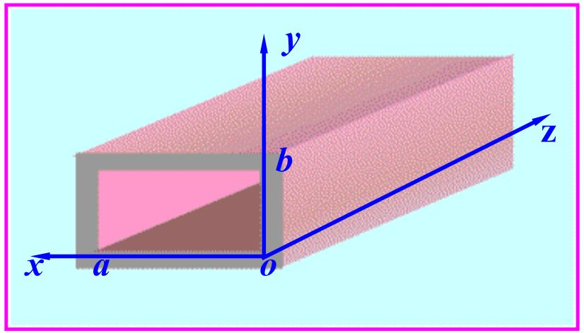
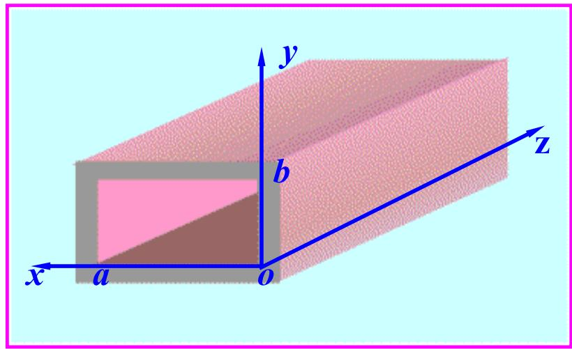

# 7.2.1 矩形波导中的TM波和TE波场分布（预习笔记）

> [!tip] 章节导读与知识脉络
> ==与前置章节的关联==
> [[7.1.2_导波分类与纵向场方程|导波分类与纵向场方程]] 已经说明，TM 波要求解 $E_z$，TE 波要求解 $H_z$。矩形波导的求解方法和 [[3.6.1_直角坐标系中的分离变量法|直角坐标系中的分离变量法]] 相同：在矩形区域内解亥姆霍兹方程，再用边界条件确定可允许的函数形式。
>
> ==本节研究内容==
> 本节研究矩形波导中 TM 波和 TE 波的纵向场分布，并说明模式下标 $m,n$ 的来源。

---

## 一、矩形波导的几何模型

矩形波导是由理想导体壁围成的空心金属管。通常令波导沿 $z$ 方向延伸，横截面尺寸为：

$$
0<x<a,\qquad 0<y<b
$$

其中通常取：

$$
a>b
$$

教材中的矩形波导示意图如下：

矩形波导的四个金属壁面分别为：

$$
x=0,\quad x=a,\quad y=0,\quad y=b
$$

因为金属壁是理想导体，所以壁面上的切向电场为零。这是求场分布时最重要的边界条件。

---

## 二、TM 波的纵向场 $E_z$

TM 波满足：

$$
H_z=0,\qquad E_z\ne0
$$

所以先求纵向电场 $E_z$。在矩形横截面内，它满足：

$$
\left(\frac{\partial^2}{\partial x^2}
+\frac{\partial^2}{\partial y^2}
+k_c^2\right)E_z(x,y)=0
$$

由于 $E_z$ 是沿 $z$ 方向的电场分量，而矩形波导的金属壁面都沿 $z$ 方向延伸，所以 $E_z$ 在所有壁面上都是切向（即沿电流传播方向）电场。理想导体壁面要求切向电场为零，因此：

$$
E_z(0,y)=0,\qquad E_z(a,y)=0
$$

$$
E_z(x,0)=0,\qquad E_z(x,b)=0
$$

这和两端固定弦的数学条件相似：函数在边界上必须取零。

---

## 三、TM 波的分离变量结果

令：

$$
E_z(x,y)=X(x)Y(y)
$$

代入横截面亥姆霍兹方程后，可得到两个方向上的正弦函数。因为 $E_z$ 在 $x=0,a$ 和 $y=0,b$ 都为零，所以只能取：

$$
X(x)=\sin\frac{m\pi x}{a}
$$

$$
Y(y)=\sin\frac{n\pi y}{b}
$$

因此 TM 波的纵向电场可写成：

$$
\boxed{
E_z=E_{mn}\sin\frac{m\pi x}{a}\sin\frac{n\pi y}{b}e^{-\gamma z}
}
$$

其中

$$
m=1,2,3,\cdots,\qquad n=1,2,3,\cdots
$$

对应的==截止波数==为：（背诵）

$$
\boxed{
k_c^2=\left(\frac{m\pi}{a}\right)^2+\left(\frac{n\pi}{b}\right)^2
}
$$

> **注意**：==TM 波中 $m$ 和 $n$ 都不能为零==。因为若 $m=0$ 或 $n=0$，正弦函数中至少有一个恒为零，导致 $E_z$ 整体为零，就不再是 TM 波。

教材中给出的场分布辅助图如下：

---

## 四、TE 波的纵向场 $H_z$

TE 波满足：

$$
E_z=0,\qquad H_z\ne0
$$

所以先求纵向磁场 $H_z$。它满足：

$$
\left(\frac{\partial^2}{\partial x^2}
+\frac{\partial^2}{\partial y^2}
+k_c^2\right)H_z(x,y)=0
$$

TE 波的边界条件不是 $H_z=0$，而是由壁面切向电场为零推出：

$$
\frac{\partial H_z}{\partial n}=0
$$

也就是 $H_z$ 在金属壁法向方向上的导数为零。具体到矩形波导：

$$
\left.\frac{\partial H_z}{\partial x}\right|_{x=0,a}=0
$$

$$
\left.\frac{\partial H_z}{\partial y}\right|_{y=0,b}=0
$$

这说明 $H_z$ 在边界处不是必须等于零，而是法向变化率为零。

---

## 五、TE 波的分离变量结果

为了让边界处法向导数为零，$H_z$ 取余弦型分布：

$$
\boxed{
H_z=H_{mn}\cos\frac{m\pi x}{a}\cos\frac{n\pi y}{b}e^{-\gamma z}
}
$$

其中

$$
m=0,1,2,\cdots,\qquad n=0,1,2,\cdots
$$

但 $m,n$ 不能同时为零，否则 $k_c=0$，对应的场不能形成普通空心矩形波导中的传播模式。

TE 波同样有：

$$
\boxed{
k_c^2=\left(\frac{m\pi}{a}\right)^2+\left(\frac{n\pi}{b}\right)^2
}
$$

教材中的 TE 场分布示意图如下：

---

## 六、模式下标 $m,n$ 的含义

在矩形波导中，模式通常写成：

$$
\mathrm{TM}_{mn},\qquad \mathrm{TE}_{mn}
$$

其中：

1. $m$ 表示沿宽边 $x$ 方向的半波变化次数；
2. $n$ 表示沿窄边 $y$ 方向的半波变化次数；
3. $m,n$ 越大，横截面场变化越快；
4. 横截面变化越快，截止波数 $k_c$ 越大，对应截止频率越高。

这和 [[6.1.2_理想介质中均匀平面波的传播特点|波数 $k$ 表示空间相位变化快慢]] 的思想一致。这里的 $k_c$ 表示横截面方向上的空间变化快慢。

---

> **本节总结**
> 1. 矩形波导中 TM 波求 $E_z$，TE 波求 $H_z$。
> 2. TM 波的 $E_z$ 在理想导体壁面上为零，所以取正弦型分布。
> 3. TE 波的 $H_z$ 在壁面法向导数为零，所以取余弦型分布。
> 4. 两类波的截止波数都满足 $k_c^2=(m\pi/a)^2+(n\pi/b)^2$。
> 5. 模式下标 $m,n$ 描述横截面两个方向上的场变化次数。
