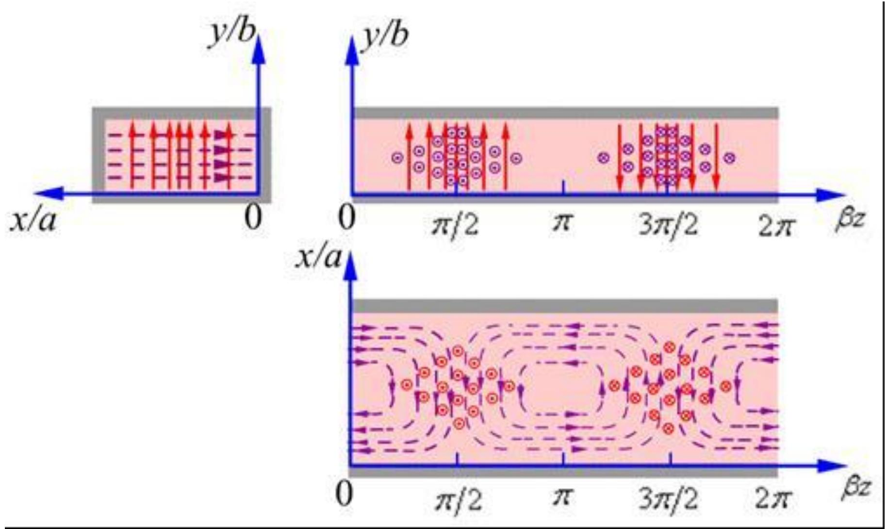
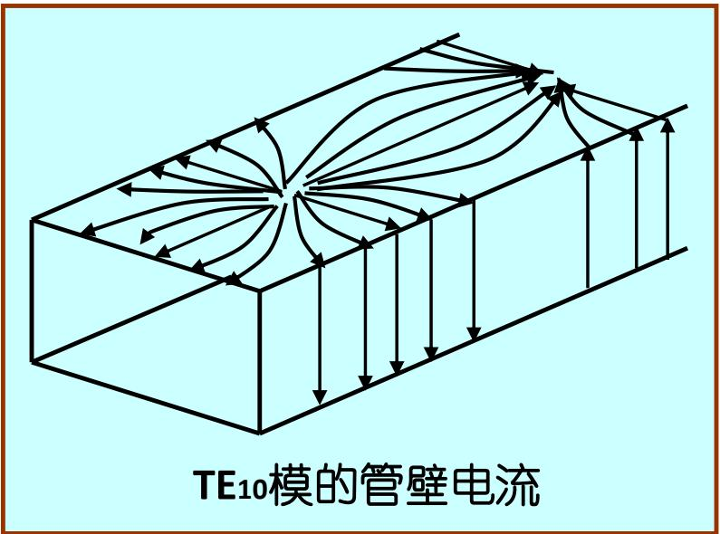

# 7.2.2 矩形波导的传播特性与主模（预习笔记）

> [!tip] 章节导读与知识脉络
> ==与前置章节的关联==
> [[7.2.1_矩形波导中的TM波和TE波场分布|上一节]] 得到矩形波导的模式波数 $k_c$。[[6.1.2_理想介质中均匀平面波的传播特点|理想介质中均匀平面波的传播特点]] 中的相速、波长、波数关系仍然要用，但波导中会多出一个由横截面限制产生的截止条件。
>
> ==本节研究内容==
> 本节说明矩形波导的截止波长、传播常数、波导波长、相速，并重点理解主模 $\mathrm{TE}_{10}$。

---

## 一、传播常数与截止条件

矩形波导中，横向截止波数为：

$$
k_c^2=\left(\frac{m\pi}{a}\right)^2+\left(\frac{n\pi}{b}\right)^2
$$

波导内填充媒质的普通波数为：

$$
k=\omega\sqrt{\mu\varepsilon}=\frac{2\pi}{\lambda}
$$

由
（背诵）
$$
k_c^2=\gamma^2+k^2
$$

可得：

$$
\gamma^2=k_c^2-k^2
$$

当 $k>k_c$ 时，$\gamma$ 为纯虚数，可写成：

$$
\gamma=j\beta
$$

此时场沿 $z$ 方向有传播因子：

$$
e^{-j\beta z}
$$

表示真正传播的导波。

当 $k<k_c$ 时，$\gamma$ 为实数，场沿 $z$ 方向呈指数衰减，不能远距离传输。

> **结论**：波导不是任意频率都能传输。只有频率高于某一截止频率，对应模式才能传播。（背诵）

---

## 二、截止波长和截止频率

截止状态满足：

$$
k=k_c
$$

因为

$$
k=\frac{2\pi}{\lambda}
$$

所以截止波长为：

$$
\boxed{
\lambda_c=\frac{2\pi}{k_c}
}
$$

对矩形波导：

$$
\boxed{
\lambda_{c,mn}=\frac{2}{\sqrt{\left(\frac{m}{a}\right)^2+\left(\frac{n}{b}\right)^2}}
}
$$

截止频率为：

$$
\boxed{
f_{c,mn}=\frac{v}{\lambda_{c,mn}}
}
$$

其中

$$
v=\frac{1}{\sqrt{\mu\varepsilon}}
$$

若波导内为空气，可近似取 $v=c$。

---

## 三、传播常数 $\beta$

传播状态下：

$$
\gamma=j\beta
$$

代入

$$
k_c^2=\gamma^2+k^2
$$

得：

$$
k_c^2=-\beta^2+k^2
$$

所以：

$$
\boxed{
\beta=\sqrt{k^2-k_c^2}
}
$$

也可以写成：

$$
\boxed{
\beta=k\sqrt{1-\left(\frac{\lambda}{\lambda_c}\right)^2}
}
$$

这里 $\lambda$ 是同一媒质中无限大空间的波长，$\lambda_c$ 是该模式的截止波长。

---

## 四、波导波长

波导内沿 $z$ 方向传播时，相位常数是 $\beta$，所以沿波导方向的波长称为==波导波长==：

$$
\boxed{
\lambda_g=\frac{2\pi}{\beta}
}
$$

代入 $\beta$ 的表达式：

$$
\boxed{
\lambda_g=\frac{\lambda}{\sqrt{1-\left(\frac{\lambda}{\lambda_c}\right)^2}}
}
$$

因为传播时必须有 $\lambda<\lambda_c$，所以分母小于 1，于是：

$$
\lambda_g>\lambda
$$

> **理解**：波导中的相位沿 $z$ 方向变化得比自由空间慢，因此沿波导方向量到的波长更长。

---

## 五、相速和群速

波导中的相速为：

$$
v_p=\frac{\omega}{\beta}
$$

代入 $\beta=k\sqrt{1-(\lambda/\lambda_c)^2}$，并利用 $k=\omega/v$，得：

$$
\boxed{
v_p=\frac{v}{\sqrt{1-\left(\frac{\lambda}{\lambda_c}\right)^2}}
}
$$

因此：

$$
v_p>v
$$

这并不违反相对论，因为相速不是能量或信息的传播速度。真正与能量传播相关的是群速：

$$
\boxed{
v_g=v\sqrt{1-\left(\frac{\lambda}{\lambda_c}\right)^2}
}
$$

并且有：

$$
v_pv_g=v^2
$$

这和 [[6.2.3_色散与群速|色散与群速]] 中相速、群速需要区分的思想相同。

---

## 六、矩形波导的主模

==主模==是截止频率最低、最容易传播的模式。

矩形波导通常取 $a>b$。对 TE 波，允许 $m$ 或 $n$ 为零，但不能同时为零。最低的非零截止波数来自：

$$
m=1,\qquad n=0
$$

所以矩形波导的主模是：

$$
\boxed{\mathrm{TE}_{10}}
$$

其截止波数为：

$$
k_c=\frac{\pi}{a}
$$

截止波长为：

$$
\boxed{\lambda_c=2a}
$$

截止频率为：

$$
\boxed{f_c=\frac{v}{2a}}
$$

主模场结构图如下：

---

## 七、$\mathrm{TE}_{10}$ 模的场结构理解

对于 $\mathrm{TE}_{10}$：

$$
m=1,\qquad n=0
$$

所以 $H_z$ 的横截面分布与

$$
\cos\frac{\pi x}{a}
$$

有关，而与 $y$ 无关。

这说明：

1. 沿宽边 $x$ 方向有半个周期的变化；
2. 沿窄边 $y$ 方向没有变化；
3. 电场主要沿 $y$ 方向分布；
4. 磁场既有横向分量，也有纵向分量。

教材中还给出了主模的管壁电流分布：

主模重要的原因是：实际矩形波导常常希望只传输 $\mathrm{TE}_{10}$，这样场分布单一，传输稳定，不容易出现多模干扰。

---

> **本节总结**
> 1. 波导模式只有在 $k>k_c$，即 $\lambda<\lambda_c$ 时才能传播。
> 2. 矩形波导模式的截止波长为 $\lambda_{c,mn}=2/\sqrt{(m/a)^2+(n/b)^2}$。
> 3. 波导波长 $\lambda_g$ 大于同媒质中的普通波长 $\lambda$。
> 4. 波导相速 $v_p>v$，群速 $v_g<v$，二者满足 $v_pv_g=v^2$。
> 5. 矩形波导的主模是 $\mathrm{TE}_{10}$，其截止波长为 $2a$。
