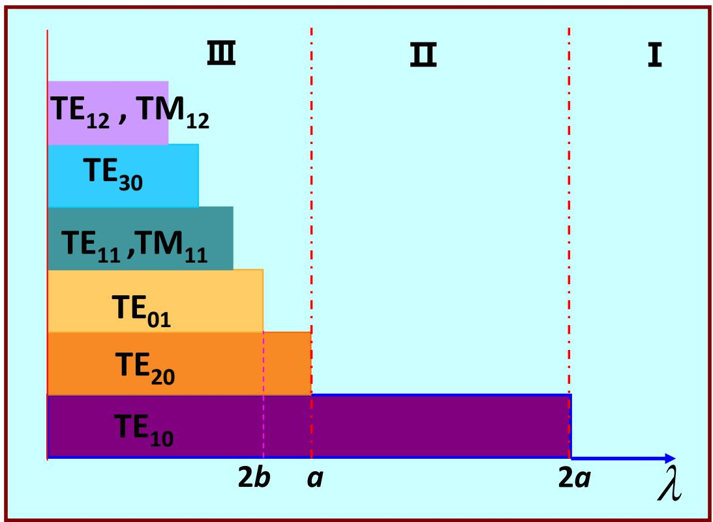
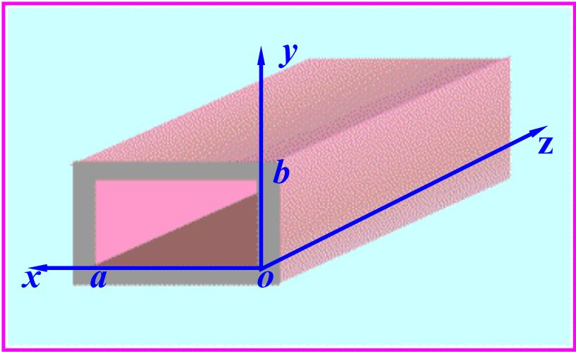

# 7.2.3 矩形波导的单模传输与功率传输（预习笔记）

> [!tip] 章节导读与知识脉络
> ==与前置章节的关联==
> [[7.2.2_矩形波导的传播特性与主模|上一节]] 说明 $\mathrm{TE}_{10}$ 是矩形波导的主模。[[2.8.3_坡印廷矢量|坡印廷矢量]] 说明电磁功率由 $\vec{S}=\vec{E}\times\vec{H}$ 描述。本节把这两个内容合在一起，研究怎样让矩形波导只传输主模，以及主模如何携带功率。
>
> ==本节研究内容==
> 本节说明矩形波导的截止区、单模区、多模区，以及 $\mathrm{TE}_{10}$ 模的传输功率表达式。

---

## 一、为什么要单模传输

矩形波导中，每一个模式都有自己的截止波长或截止频率。若工作频率很高，多个模式都可能同时传播。

多模传输会带来两个问题：

1. 不同模式的场分布不同，接收端场结构不稳定；
2. 不同模式的相速和群速不同，信号会发生模式色散。

所以工程中常希望只让主模 $\mathrm{TE}_{10}$ 传播，而让其他高次模处于截止状态。

教材给出的单模传输示意图如下：

---

## 二、模式分布图的三个区域

教材把工作波长所在范围分为三个区域：

### 1. 截止区

若工作波长大于主模截止波长：

$$
\lambda>\lambda_{c,10}=2a
$$

则连主模也不能传播，所有模式都截止。此时波导中只能出现沿 $z$ 方向衰减的场，不能有效传输功率。

### 2. 单模区

若主模能够传播，而其他高次模仍截止，则波导处于单模区。

对常用矩形波导，主模是 $\mathrm{TE}_{10}$，下一个容易出现的高次模通常与 $\mathrm{TE}_{20}$ 或 $\mathrm{TE}_{01}$ 有关。

单模传输的基本条件是：

$$
\lambda_{c,\text{next}}<\lambda<\lambda_{c,10}
$$

其中 $\lambda_{c,\text{next}}$ 表示除主模外最高的截止波长。因为某一模式传播要求 $\lambda<\lambda_c$，所以要让高次模截止，就要让工作波长大于这些高次模的截止波长。

### 3. 多模区

若工作波长继续减小，使多个模式都满足：

$$
\lambda<\lambda_c
$$

则多个模式可以同时传播，进入多模区。

---

## 三、矩形波导常用单模条件

若 $a>b$，主模为：

$$
\mathrm{TE}_{10}
$$

其截止波长：

$$
\lambda_{c,10}=2a
$$

常见高次模有：

$$
\mathrm{TE}_{20}:\quad \lambda_{c,20}=a
$$

$$
\mathrm{TE}_{01}:\quad \lambda_{c,01}=2b
$$

因此单模区需要满足：

$$
\max(a,2b)<\lambda<2a
$$

这条式子的含义是：

1. $\lambda<2a$，保证主模 $\mathrm{TE}_{10}$ 能传播；
2. $\lambda>a$，保证 $\mathrm{TE}_{20}$ 截止；
3. $\lambda>2b$，保证 $\mathrm{TE}_{01}$ 截止；
4. 取 $\max(a,2b)$，是因为要同时压住所有最接近主模的高次模。

---

## 四、主模功率传输

导波传输的功率由平均坡印廷矢量计算：

$$
\vec{S}_{\mathrm{av}}=\frac{1}{2}\operatorname{Re}(\vec{E}\times\vec{H}^{*})
$$

总功率为横截面积分：

$$
P=\iint_S \vec{S}_{\mathrm{av}}\cdot \vec{e}_z\,\mathrm{d}S
$$

对于矩形波导的 $\mathrm{TE}_{10}$ 模，教材给出了主模功率传输示意图：

如果用最大电场幅值 $E_m$ 表示，主模传输功率可写成与横截面尺寸、媒质波阻抗和传播状态有关的形式。常见结构是：

$$
P\propto ab\frac{E_m^2}{\eta}\sqrt{1-\left(\frac{\lambda}{\lambda_c}\right)^2}
$$

这里最重要的理解不是记比例系数，而是看清三个因素：

1. 横截面面积越大，可承载的功率越大；
2. 电场幅值越大，传输功率越大；
3. 越接近截止，$\sqrt{1-(\lambda/\lambda_c)^2}$ 越小，能量沿 $z$ 方向传输越困难。

---

## 五、功率容量的限制

矩形波导不能无限提高功率。主要限制来自两个方面：

1. ==击穿限制==：波导内电场过强时，填充介质可能被击穿；
2. ==损耗发热限制==：实际金属不是理想导体，壁面电流会产生热损耗。

主模 $\mathrm{TE}_{10}$ 的电场在横截面内分布不均匀，最大电场通常出现在波导中部附近。因此估算最大可传输功率时，要关注最大电场幅值，而不是只看平均场强。

---

## 六、和传输线的区别

矩形波导与同轴线、平行双导线不同：

1. 矩形空心波导不能传输 TEM 波；
2. 它存在截止频率；
3. 频率低于主模截止频率时不能传输；
4. 高频时可能进入多模传输。

这也是第7章与第6章均匀平面波的一个重要差别：导波系统的几何尺寸会直接决定哪些频率和模式能传播。

---

> **本节总结**
> 1. 单模传输的目标是只让 $\mathrm{TE}_{10}$ 模传播。
> 2. 矩形波导常用单模条件为 $\max(a,2b)<\lambda<2a$。
> 3. 工作波长过长会进入截止区，过短会进入多模区。
> 4. 主模功率由平均坡印廷矢量在横截面上的积分给出。
> 5. 接近截止时，能量沿波导方向传输能力下降。
