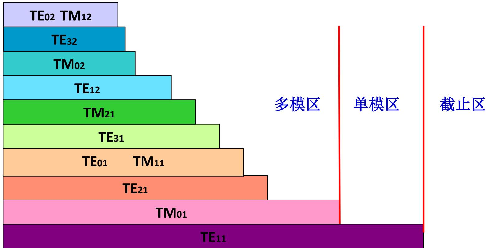

# 7.3.2 圆柱形波导的传播特性（预习笔记）

> [!tip] 章节导读与知识脉络
> ==与前置章节的关联==
> [[7.3.1_圆柱形波导的场分布|上一节]] 得到圆柱形波导 TM 模和 TE 模的截止波数。传播常数、波导波长、相速和群速的形式与 [[7.2.2_矩形波导的传播特性与主模|矩形波导传播特性]] 相同，只是 $k_c$ 的来源从三角函数本征值变成贝塞尔函数零点。
>
> ==本节研究内容==
> 本节整理圆柱形波导的截止波长、传播条件和主模，并说明为什么圆波导的主模是 $\mathrm{TE}_{11}$。

---

## 一、圆柱形波导的截止波数

圆柱形波导中，TM 模和 TE 模的截止波数分别由不同零点决定。

### 1. TM 模

TM 模满足：

$$
J_n(k_ca)=0
$$

若 $p_{nm}$ 是 $J_n(x)$ 的第 $m$ 个零点，则：

$$
\boxed{k_c=\frac{p_{nm}}{a}}
$$

### 2. TE 模

TE 模满足：

$$
J_n'(k_ca)=0
$$

若 $p'_{nm}$ 是 $J_n'(x)$ 的第 $m$ 个零点，则：

$$
\boxed{k_c=\frac{p'_{nm}}{a}}
$$

教材给出的圆柱形波导传播特性图如下：

---

## 二、截止波长

截止波长仍然由：

$$
\lambda_c=\frac{2\pi}{k_c}
$$

给出。

对 TM 模：

$$
\boxed{
\lambda_{c,\mathrm{TM}_{nm}}=\frac{2\pi a}{p_{nm}}
}
$$

对 TE 模：

$$
\boxed{
\lambda_{c,\mathrm{TE}_{nm}}=\frac{2\pi a}{p'_{nm}}
}
$$

所以只要知道贝塞尔函数零点，就能得到相应模式的截止波长。

---

## 三、传播条件

圆柱形波导中某一模式能够传播的条件仍为：

$$
k>k_c
$$

等价地：

$$
\lambda<\lambda_c
$$

若：

$$
\lambda>\lambda_c
$$

则该模式截止，场沿 $z$ 方向指数衰减。

传播状态下：

$$
\boxed{
\beta=\sqrt{k^2-k_c^2}
}
$$

波导波长：

$$
\boxed{
\lambda_g=\frac{2\pi}{\beta}
}
$$

相速：

$$
\boxed{
v_p=\frac{\omega}{\beta}
}
$$

群速：

$$
\boxed{
v_g=v\sqrt{1-\left(\frac{\lambda}{\lambda_c}\right)^2}
}
$$

这些公式和矩形波导完全同形，说明“截止”是所有空心金属波导共有的特征。

---

## 四、圆柱形波导的主模

主模是截止频率最低、截止波长最长的模式。因为：

$$
\lambda_c=\frac{2\pi}{k_c}
$$

所以主模对应最小的 $k_c$。

常用贝塞尔函数零点中：

$$
p'_{11}\approx1.841
$$

它比常见 TM 模的第一个零点

$$
p_{01}\approx2.405
$$

更小。因此圆柱形波导的主模是：

$$
\boxed{\mathrm{TE}_{11}}
$$

其截止波长为：

$$
\boxed{
\lambda_{c,\mathrm{TE}_{11}}=\frac{2\pi a}{1.841}\approx3.41a
}
$$

---

## 五、常见模式的直观比较

圆柱形波导常见低阶模式包括：

1. $\mathrm{TE}_{11}$：主模，最先传播；
2. $\mathrm{TM}_{01}$：第一个常见 TM 模；
3. $\mathrm{TE}_{21}$：较高次 TE 模；
4. $\mathrm{TE}_{01}$：在圆波导中有特殊工程价值，损耗特性较好。

不同模式的场分布差别主要体现在：

1. 角向是否分瓣；
2. 径向有几个零点或极值；
3. 壁面电流和损耗分布不同；
4. 截止频率不同。

教材中还特别提示了不同版本教材中某个公式的差异。预习时先记住主线：考试或解题通常先根据模式查零点，再代入截止波长和传播参数公式。

---

## 六、与矩形波导的对比

| 项目 | 矩形波导 | 圆柱形波导 |
|---|---|---|
| 坐标系 | 直角坐标 | 柱坐标 |
| 横向函数 | 正弦、余弦 | 贝塞尔函数 |
| TM 边界 | $E_z=0$ | $J_n(k_ca)=0$ |
| TE 边界 | $\partial H_z/\partial n=0$ | $J_n'(k_ca)=0$ |
| 主模 | $\mathrm{TE}_{10}$ | $\mathrm{TE}_{11}$ |

两者的传播参数形式相同，差别集中在横截面边界条件怎样决定 $k_c$。

---

> **本节总结**
> 1. 圆柱形波导 TM 模的截止波数由 $J_n(x)$ 的零点决定。
> 2. 圆柱形波导 TE 模的截止波数由 $J_n'(x)$ 的零点决定。
> 3. 圆柱形波导的主模是 $\mathrm{TE}_{11}$。
> 4. 传播条件仍然是 $\lambda<\lambda_c$。
> 5. 圆柱形波导和矩形波导的传播公式同形，区别在 $k_c$ 的求法。
