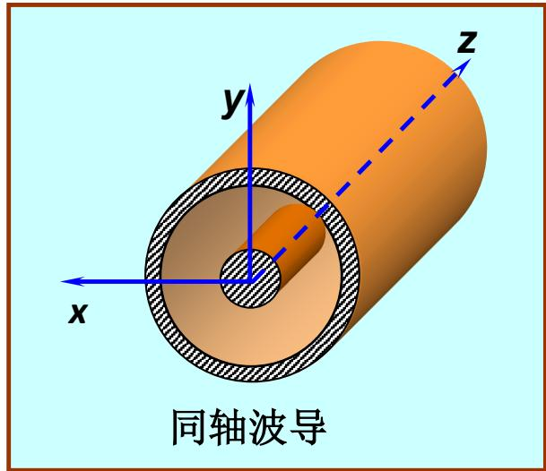
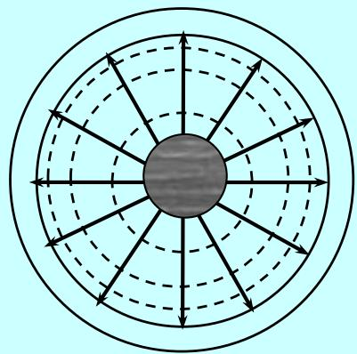
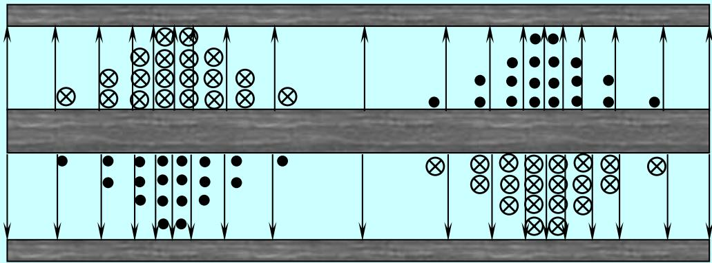

# 7.4.1 同轴波导中的TEM波（预习笔记）

> [!tip] 章节导读与知识脉络
> ==与前置章节的关联==
> [[2.8.3_坡印廷矢量|坡印廷矢量]] 中已经讨论过同轴线中的电磁能流。[[7.1.2_导波分类与纵向场方程|导波分类]] 说明 TEM 波满足 $E_z=0,H_z=0$。同轴波导有内外两个导体，能够建立横向电场和横向磁场，所以可以传输 TEM 波。
>
> ==本节研究内容==
> 本节研究同轴波导中 TEM 波的场分布、传播参数、特性阻抗、传输功率和功率容量。

---

## 一、同轴波导的结构

同轴波导由内导体和外导体组成。设内导体半径为 $a$，外导体内半径为 $b$，两导体之间填充均匀理想介质。

横截面区域为：

$$
a<\rho<b
$$

教材中的同轴波导示意图如下：

同轴波导和矩形、圆柱空心波导不同。它有两个导体，所以可以支持 TEM 波。

---

## 二、TEM 波的场分布

TEM 波满足：

$$
E_z=0,\qquad H_z=0
$$

同轴结构具有圆柱对称性。若内外导体之间电压为 $U$，则电场只有径向分量：

$$
\vec{E}=E_\rho\vec{e}_\rho
$$

根据静电场中同轴圆柱电容器的结果：

$$
\boxed{
E_\rho=\frac{U}{\rho\ln(b/a)}
}
$$

如果内导体电流为 $I$，外导体回流为 $-I$，则磁场只有环向分量：

$$
\vec{H}=H_\varphi\vec{e}_\varphi
$$

由安培环路定理：

$$
\boxed{
H_\varphi=\frac{I}{2\pi\rho}
}
$$

教材中的场线图如下：

这张图要看清两点：

1. 电场线从内导体指向外导体，沿径向；
2. 磁场线绕内导体成闭合圆，沿 $\varphi$ 方向。

---

## 三、TEM 波没有截止频率

同轴线中的 TEM 波与均匀平面波类似，没有纵向场分量，也没有横向截止波数：

$$
k_c=0
$$

因此传播常数为：

$$
\gamma=j\beta
$$

其中：

$$
\boxed{
\beta=k=\omega\sqrt{\mu\varepsilon}
}
$$

相速为：

$$
\boxed{
v_p=\frac{\omega}{\beta}=\frac{1}{\sqrt{\mu\varepsilon}}
}
$$

这说明 TEM 波没有像矩形波导和圆柱形空心波导那样的截止频率。理论上，低频也可以沿同轴线传播。

---

## 四、特性阻抗

同轴线的特性阻抗定义为电压和电流的比值：

$$
Z_0=\frac{U}{I}
$$

由场关系：

$$
\frac{E_\rho}{H_\varphi}=\eta=\sqrt{\frac{\mu}{\varepsilon}}
$$

代入：

$$
\frac{U}{\rho\ln(b/a)}\bigg/\frac{I}{2\pi\rho}=\eta
$$

可得：

$$
\boxed{
Z_0=\frac{U}{I}=\frac{\eta}{2\pi}\ln\frac{b}{a}
}
$$

若介质为空气，则：

$$
\eta_0=120\pi\ \Omega
$$

于是：

$$
Z_0=60\ln\frac{b}{a}\ \Omega
$$

这和传输线课程中的同轴电缆特性阻抗公式一致。

---

## 五、单位长度电容和电感

同轴线单位长度电容为：

$$
\boxed{
C=\frac{2\pi\varepsilon}{\ln(b/a)}
}
$$

单位长度电感为：

$$
\boxed{
L=\frac{\mu}{2\pi}\ln\frac{b}{a}
}
$$

于是：

$$
\sqrt{\frac{L}{C}}
=\frac{1}{2\pi}\sqrt{\frac{\mu}{\varepsilon}}\ln\frac{b}{a}
=\frac{\eta}{2\pi}\ln\frac{b}{a}
$$

所以：

$$
Z_0=\sqrt{\frac{L}{C}}
$$

同时：

$$
\frac{1}{\sqrt{LC}}=\frac{1}{\sqrt{\mu\varepsilon}}
$$

这说明同轴 TEM 波的传播速度也可以由分布参数 $L,C$ 得到。

---

## 六、传输功率

平均坡印廷矢量沿 $z$ 方向：

$$
\vec{S}_{\mathrm{av}}=\frac{1}{2}\operatorname{Re}(\vec{E}\times\vec{H}^{*})
$$

因为：

$$
\vec{e}_\rho\times\vec{e}_\varphi=\vec{e}_z
$$

所以能量沿同轴线轴向传播。

总功率也可直接写成：

$$
\boxed{
P=\frac{1}{2}UI
}
$$

若用电压表示：

$$
\boxed{
P=\frac{U^2}{2Z_0}
}
$$

若用电流表示：

$$
\boxed{
P=\frac{1}{2}I^2Z_0
}
$$

教材还给出了同轴线中电磁能流的辅助图：

---

## 七、功率容量

同轴波导的功率容量主要受最大电场限制。因为：

$$
E_\rho=\frac{U}{\rho\ln(b/a)}
$$

电场在 $\rho=a$ 处最大：

$$
E_{\max}=\frac{U}{a\ln(b/a)}
$$

若介质击穿场强为 $E_{\mathrm{br}}$，则要求：

$$
E_{\max}<E_{\mathrm{br}}
$$

这会限制最大电压，从而限制最大传输功率。

---

> **本节总结**
> 1. 同轴波导有两个导体，因此可以传输 TEM 波。
> 2. TEM 波中 $E_z=0,H_z=0$，电场沿径向，磁场沿环向。
> 3. 同轴 TEM 波没有截止频率，传播速度为 $1/\sqrt{\mu\varepsilon}$。
> 4. 特性阻抗为 $Z_0=\dfrac{\eta}{2\pi}\ln\dfrac{b}{a}$。
> 5. 传输功率可写成 $P=U^2/(2Z_0)$ 或 $P=I^2Z_0/2$。
